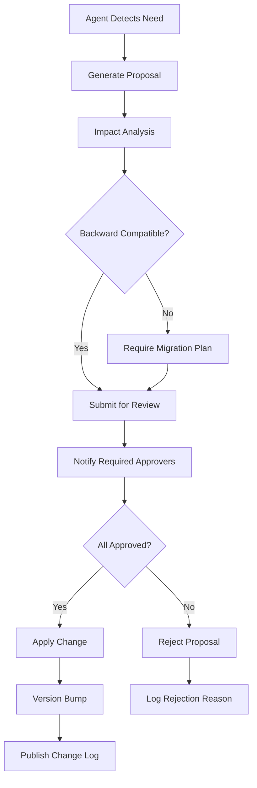

# Knowledge Graph Contract: Human-AI Ontology Governance

**Version:** 1.0.0
**Status:** DRAFT
**Last Updated:** 2025-11-01

> **CRITICAL INSIGHT**: Build ontology first so that the way it can grow is governed by the knowledge graph itself which becomes the contract that the AI agents and the human agents are agreeing to work under.

---

## Executive Summary

This document defines the **Knowledge Graph Contract** - a formal ontology schema that serves as the governing framework for human-AI collaboration in the weave-nn system. The knowledge graph is not just a data structure; it is a **executable contract** that defines:

1. **What agents CAN do** (capabilities)
2. **What agents CANNOT do** (constraints)
3. **What agents MAY do with approval** (permissions)
4. **What agents MUST do** (obligations)
5. **How the ontology itself evolves** (meta-governance)

---

## 1. Core Ontology Schema

### 1.1 Entity Types

The knowledge graph recognizes these fundamental entity types, derived from the weave-nn codebase analysis:

```typescript
/**
 * Core Entity Types in the Knowledge Graph
 */
enum EntityType {
  // Autonomous Entities
  AGENT = 'agent',                    // AI agents (researcher, coder, analyst, etc.)
  HUMAN = 'human',                    // Human operators and approvers
  SWARM = 'swarm',                    // Agent collectives (hive mind, mesh, hierarchical)

  // Execution Entities
  TASK = 'task',                      // Discrete work units
  WORKFLOW = 'workflow',              // Multi-step processes
  EXECUTION = 'execution',            // Runtime instances

  // Knowledge Entities
  PRIMITIVE = 'primitive',            // Foundational concepts (from PRIMITIVES.md)
  DOCUMENT = 'document',              // Markdown files in vault
  CONCEPT = 'concept',                // Abstract ideas
  FEATURE = 'feature',                // System capabilities

  // Technical Entities
  SERVICE = 'service',                // Running processes (MCP server, workflow engine)
  INTEGRATION = 'integration',        // External systems (OpenAI, databases)
  SCHEMA = 'schema',                  // Data structures
  API = 'api',                        // Interfaces

  // Environment Entities
  ENVIRONMENT = 'environment',        // dev, staging, prod
  DEPLOYMENT = 'deployment',          // Deployed instances
  REPOSITORY = 'repository',          // Git repositories
  VAULT = 'vault',                    // Obsidian vaults

  // Governance Entities
  CONTRACT = 'contract',              // This ontology contract
  POLICY = 'policy',                  // Governance rules
  APPROVAL = 'approval',              // Human consent records
  AUDIT_LOG = 'audit_log',            // Immutable history
}
```

### 1.2 Relationship Types

Relationships define **allowable connections** between entities:

```typescript
/**
 * Relationship Types (Directed Edges)
 */
enum RelationType {
  // Agent Relationships
  EXECUTES = 'executes',              // Agent → Task
  MANAGES = 'manages',                // Agent → Workflow
  COORDINATES = 'coordinates',        // Agent → Agent
  REPORTS_TO = 'reports_to',          // Agent → Human

  // Task Relationships
  DEPENDS_ON = 'depends_on',          // Task → Task
  BLOCKS = 'blocks',                  // Task → Task
  TRIGGERS = 'triggers',              // Task → Workflow

  // Knowledge Relationships
  IMPLEMENTS = 'implements',          // Document → Primitive
  EXTENDS = 'extends',                // Primitive → Primitive
  REFERENCES = 'references',          // Document → Document (wikilinks)
  CATEGORIZES = 'categorizes',        // Primitive → Document (taxonomy)

  // Permission Relationships
  REQUIRES_APPROVAL = 'requires_approval',  // Task → Human
  APPROVES = 'approves',              // Human → Task
  GRANTS = 'grants',                  // Human → Permission
  REVOKES = 'revokes',                // Human → Permission

  // Deployment Relationships
  DEPLOYS_TO = 'deploys_to',          // Agent → Environment
  RUNS_IN = 'runs_in',                // Service → Environment
  MONITORS = 'monitors',              // Agent → Service

  // Audit Relationships
  LOGS = 'logs',                      // Agent → AuditLog
  VALIDATES = 'validates',            // Contract → Entity
  ENFORCES = 'enforces',              // Policy → Relationship
}
```

### 1.3 Constraint Types

Constraints are **immutable rules** enforced by the knowledge graph:

```typescript
/**
 * Constraint Types (Graph-Level Invariants)
 */
interface Constraint {
  id: string;
  type: ConstraintType;
  entity_types: EntityType[];
  rule: ConstraintRule;
  severity: 'blocking' | 'warning' | 'info';
  immutable: boolean;
}

enum ConstraintType {
  // Cardinality Constraints
  ONE_TO_ONE = 'one_to_one',          // e.g., Agent → Human (one supervisor)
  ONE_TO_MANY = 'one_to_many',        // e.g., Human → Agent (many reports)
  MANY_TO_MANY = 'many_to_many',      // e.g., Agent ← Task → Agent (collaboration)

  // Temporal Constraints
  BEFORE = 'before',                  // Task A must complete before Task B
  AFTER = 'after',
  CONCURRENT = 'concurrent',          // Can run in parallel
  NEVER_CONCURRENT = 'never_concurrent', // Mutual exclusion

  // Permission Constraints
  REQUIRES_HUMAN_APPROVAL = 'requires_human_approval',
  AUTONOMOUS_WITHIN_BOUNDS = 'autonomous_within_bounds',
  PROHIBITED = 'prohibited',          // Hard block

  // Data Integrity Constraints
  MUST_EXIST = 'must_exist',          // Referenced entities must be present
  UNIQUE = 'unique',                  // No duplicates allowed
  IMMUTABLE_AFTER_CREATION = 'immutable_after_creation',

  // Schema Constraints
  VALID_SCHEMA = 'valid_schema',      // Must conform to JSON Schema
  TYPE_SAFE = 'type_safe',            // TypeScript type compatibility
}

type ConstraintRule =
  | { min: number; max: number }      // Cardinality
  | { pattern: RegExp }               // String validation
  | { enum: string[] }                // Allowed values
  | { validator: (entity: Entity) => boolean }; // Custom logic
```

### 1.4 Property Schemas

Every entity type has a **required property schema**:

```typescript
/**
 * Agent Entity Schema
 */
interface AgentEntity {
  // Required Properties
  id: string;                         // Unique identifier
  type: EntityType.AGENT;
  name: string;                       // Human-readable name
  role: AgentRole;                    // From weave-nn agent types
  created_at: ISO8601Timestamp;
  created_by: HumanID | SystemID;

  // Capability Properties
  capabilities: Capability[];         // What this agent CAN do
  constraints: Constraint[];          // What this agent CANNOT do
  permissions: Permission[];          // What this agent MAY do (with approval)
  obligations: Obligation[];          // What this agent MUST do

  // Coordination Properties
  coordination_topology?: 'mesh' | 'hierarchical' | 'ring' | 'star';
  max_concurrent_tasks?: number;
  priority_level?: 'low' | 'medium' | 'high' | 'critical';

  // Governance Properties
  supervisor?: HumanID;               // Who oversees this agent
  approval_policy?: PolicyID;         // What needs approval
  audit_level?: 'full' | 'minimal' | 'none';

  // Optional Metadata
  metadata?: Record<string, unknown>;
}

/**
 * Task Entity Schema
 */
interface TaskEntity {
  id: string;
  type: EntityType.TASK;
  title: string;
  description: string;

  // Execution Properties
  status: TaskStatus;
  assigned_to?: AgentID;
  started_at?: ISO8601Timestamp;
  completed_at?: ISO8601Timestamp;

  // Dependency Properties
  depends_on: TaskID[];
  blocks: TaskID[];
  triggers?: WorkflowID;

  // Approval Properties
  requires_approval: boolean;
  approved_by?: HumanID[];
  approval_timestamp?: ISO8601Timestamp;

  // Context Properties
  vault_context?: VaultID;
  environment?: EnvironmentID;

  metadata?: Record<string, unknown>;
}

enum TaskStatus {
  PENDING = 'pending',
  AWAITING_APPROVAL = 'awaiting_approval',
  APPROVED = 'approved',
  IN_PROGRESS = 'in_progress',
  BLOCKED = 'blocked',
  COMPLETED = 'completed',
  FAILED = 'failed',
  CANCELLED = 'cancelled',
}
```

---

## 2. Contract Primitives

### 2.1 Capabilities

**Capabilities** define what an agent **CAN** do within the system:

```typescript
/**
 * Capability: A granted ability with optional conditions
 */
interface Capability {
  id: string;
  name: string;
  action: Action;                     // The allowed operation
  scope: Scope;                       // Where it can be performed
  conditions?: Condition[];           // When it's allowed

  // Provenance
  granted_by: HumanID | PolicyID;
  granted_at: ISO8601Timestamp;
  expires_at?: ISO8601Timestamp;      // Optional TTL
}

enum Action {
  // File Operations
  READ_FILE = 'read_file',
  WRITE_FILE = 'write_file',
  DELETE_FILE = 'delete_file',
  MOVE_FILE = 'move_file',

  // Vault Operations
  CREATE_DOCUMENT = 'create_document',
  UPDATE_FRONTMATTER = 'update_frontmatter',
  CREATE_WIKILINK = 'create_wikilink',

  // Execution Operations
  SPAWN_TASK = 'spawn_task',
  EXECUTE_WORKFLOW = 'execute_workflow',
  COORDINATE_AGENTS = 'coordinate_agents',

  // Code Operations
  EXECUTE_CODE = 'execute_code',
  DEPLOY_SERVICE = 'deploy_service',
  MODIFY_SCHEMA = 'modify_schema',

  // Knowledge Operations
  QUERY_GRAPH = 'query_graph',
  UPDATE_PRIMITIVE = 'update_primitive',
  PROPOSE_SCHEMA_CHANGE = 'propose_schema_change',
}

interface Scope {
  type: 'global' | 'environment' | 'vault' | 'directory' | 'file';
  target?: string;                    // Path or ID
  exclusions?: string[];              // Blacklist
}

interface Condition {
  type: 'time_window' | 'approval_required' | 'human_present' | 'budget_limit';
  parameters: Record<string, unknown>;
}
```

**Example Capability**:
```typescript
const deploymentAgentCapability: Capability = {
  id: 'cap-deploy-dev-001',
  name: 'Deploy to Development Environment',
  action: Action.DEPLOY_SERVICE,
  scope: {
    type: 'environment',
    target: 'development',
    exclusions: ['production', 'staging']
  },
  conditions: [
    {
      type: 'budget_limit',
      parameters: { max_cost_usd: 10 }
    }
  ],
  granted_by: 'human-alice-001',
  granted_at: '2025-11-01T10:00:00Z'
};
```

### 2.2 Constraints

**Constraints** define what an agent **CANNOT** do:

```typescript
/**
 * Constraint: An absolute prohibition
 */
interface Constraint {
  id: string;
  name: string;
  prohibition: Action[];              // Blocked actions
  scope: Scope;                       // Where it's blocked
  reason: string;                     // Why it's blocked

  // Enforcement
  severity: 'blocking' | 'warning';
  immutable: boolean;                 // Can it be removed?
  enforced_by: 'graph' | 'policy' | 'code';

  created_at: ISO8601Timestamp;
  created_by: HumanID | SystemID;
}
```

**Example Constraint**:
```typescript
const noProductionDeleteConstraint: Constraint = {
  id: 'const-no-prod-delete-001',
  name: 'Prohibit Production File Deletion',
  prohibition: [Action.DELETE_FILE, Action.MOVE_FILE],
  scope: {
    type: 'environment',
    target: 'production'
  },
  reason: 'Production data must be preserved. Only humans can delete production files.',
  severity: 'blocking',
  immutable: true,                    // Cannot be removed by agents
  enforced_by: 'graph',
  created_at: '2025-11-01T00:00:00Z',
  created_by: 'system-init'
};
```

### 2.3 Permissions

**Permissions** define what an agent **MAY** do with human approval:

```typescript
/**
 * Permission: A capability that requires approval workflow
 */
interface Permission {
  id: string;
  name: string;
  action: Action;
  scope: Scope;

  // Approval Workflow
  requires_approval_from: HumanRole[];
  approval_quorum?: number;           // e.g., 2 of 3 must approve
  approval_timeout?: number;          // Auto-deny after N seconds

  // Conditions
  conditions: Condition[];

  // Status
  status: 'pending' | 'approved' | 'denied' | 'expired';
  requested_at: ISO8601Timestamp;
  requested_by: AgentID;
  reviewed_by?: HumanID[];
}

enum HumanRole {
  OPERATOR = 'operator',              // Day-to-day user
  APPROVER = 'approver',              // Can approve tasks
  ADMIN = 'admin',                    // Can modify policies
  SECURITY = 'security',              // Can audit everything
  ARCHITECT = 'architect',            // Can modify ontology
}
```

**Example Permission**:
```typescript
const deployProductionPermission: Permission = {
  id: 'perm-deploy-prod-001',
  name: 'Deploy Service to Production',
  action: Action.DEPLOY_SERVICE,
  scope: {
    type: 'environment',
    target: 'production'
  },
  requires_approval_from: [HumanRole.APPROVER, HumanRole.SECURITY],
  approval_quorum: 2,                 // Both must approve
  approval_timeout: 3600000,          // 1 hour
  conditions: [
    {
      type: 'time_window',
      parameters: {
        allowed_days: ['monday', 'tuesday', 'wednesday'],
        allowed_hours: { start: 9, end: 17 }
      }
    }
  ],
  status: 'pending',
  requested_at: '2025-11-01T10:00:00Z',
  requested_by: 'agent-deployment-001'
};
```

### 2.4 Obligations

**Obligations** define what an agent **MUST** do:

```typescript
/**
 * Obligation: A mandatory duty
 */
interface Obligation {
  id: string;
  name: string;
  duty: Duty;
  frequency: Frequency;
  deadline?: ISO8601Timestamp;

  // Enforcement
  priority: 'low' | 'medium' | 'high' | 'critical';
  penalty_for_violation?: Penalty;

  // Status
  status: 'pending' | 'in_progress' | 'completed' | 'overdue' | 'violated';
  last_fulfilled_at?: ISO8601Timestamp;
}

interface Duty {
  type: 'report' | 'audit' | 'backup' | 'verify' | 'notify';
  action: Action;
  target: EntityID;
  parameters?: Record<string, unknown>;
}

interface Frequency {
  type: 'once' | 'recurring';
  interval?: 'hourly' | 'daily' | 'weekly' | 'on_event';
  cron_expression?: string;
}

interface Penalty {
  type: 'suspend' | 'revoke_capability' | 'alert_human';
  parameters?: Record<string, unknown>;
}
```

**Example Obligation**:
```typescript
const auditLogObligation: Obligation = {
  id: 'obl-audit-log-001',
  name: 'Log All Production Actions',
  duty: {
    type: 'audit',
    action: Action.WRITE_FILE,        // Log this action
    target: 'env-production',
    parameters: {
      log_level: 'full',
      include_diff: true
    }
  },
  frequency: {
    type: 'recurring',
    interval: 'on_event'              // Every time action occurs
  },
  priority: 'critical',
  penalty_for_violation: {
    type: 'suspend',
    parameters: {
      duration_seconds: 3600,         // 1 hour suspension
      notify: [HumanRole.SECURITY]
    }
  },
  status: 'pending'
};
```

---

## 3. Evolution Rules

### 3.1 Automatic Evolution (Within Contract Bounds)

The ontology can **self-evolve** in these ways **without human approval**:

```typescript
/**
 * Automatic Evolution: Changes that don't modify the contract
 */
interface AutoEvolution {
  // New Entity Instances (using existing types)
  create_entity: {
    allowed: true,
    constraints: [
      'must_use_existing_entity_type',
      'must_have_valid_schema',
      'must_not_violate_constraints'
    ]
  };

  // New Relationships (using existing types)
  create_relationship: {
    allowed: true,
    constraints: [
      'must_use_existing_relation_type',
      'must_satisfy_cardinality',
      'must_not_create_cycles_where_prohibited'
    ]
  };

  // Property Updates (within schema)
  update_properties: {
    allowed: true,
    constraints: [
      'must_match_property_schema',
      'immutable_fields_cannot_change',
      'must_validate_against_constraints'
    ]
  };

  // Knowledge Graph Queries
  query_graph: {
    allowed: true,
    constraints: [
      'no_side_effects',
      'read_only_access'
    ]
  };
}
```

**Example**: An agent can create a new `TaskEntity` (allowed entity type) with valid properties, assign it to itself (valid relationship), and log the action (obligation).

### 3.2 Human-Approved Evolution (Contract Modifications)

These changes **require human approval**:

```typescript
/**
 * Human-Approved Evolution: Changes to the contract itself
 */
interface ApprovedEvolution {
  // New Entity Types
  add_entity_type: {
    requires_approval_from: [HumanRole.ARCHITECT],
    quorum: 1,
    rationale_required: true,
    impact_analysis_required: true
  };

  // New Relationship Types
  add_relationship_type: {
    requires_approval_from: [HumanRole.ARCHITECT],
    quorum: 1,
    must_define: [
      'source_entity_types',
      'target_entity_types',
      'cardinality',
      'semantics'
    ]
  };

  // New Constraints
  add_constraint: {
    requires_approval_from: [HumanRole.ARCHITECT, HumanRole.SECURITY],
    quorum: 2,
    severity: 'blocking',
    must_justify: 'reason_for_constraint'
  };

  // Modify Property Schemas
  modify_schema: {
    requires_approval_from: [HumanRole.ARCHITECT],
    quorum: 1,
    backward_compatible: true,        // Prefer additive changes
    migration_plan_required: true     // How to migrate existing data
  };

  // Remove Constraints (dangerous!)
  remove_constraint: {
    requires_approval_from: [HumanRole.ARCHITECT, HumanRole.SECURITY, HumanRole.ADMIN],
    quorum: 3,                        // All three must agree
    rationale_required: true,
    immutable_constraints_cannot_be_removed: true
  };
}
```

**Example Proposal Flow**:
```typescript
interface SchemaChangeProposal {
  id: string;
  type: 'add_entity_type' | 'add_relationship_type' | 'modify_schema';
  proposed_by: AgentID;
  proposed_at: ISO8601Timestamp;

  // Proposal Details
  change: {
    action: string;                   // e.g., "Add NEURAL_MODEL entity type"
    specification: unknown;           // JSON Schema or TypeScript interface
    rationale: string;                // Why this change is needed
    impact_analysis: {
      affected_entities: number;
      backward_compatible: boolean;
      migration_complexity: 'low' | 'medium' | 'high';
    };
  };

  // Approval Workflow
  status: 'proposed' | 'under_review' | 'approved' | 'rejected';
  required_approvers: HumanRole[];
  approvals: Array<{
    human_id: HumanID;
    approved: boolean;
    timestamp: ISO8601Timestamp;
    comments?: string;
  }>;
}
```

### 3.3 Immutable Invariants (System Guarantees)

These rules **can NEVER be changed** (enforced at graph database level):

```typescript
/**
 * Immutable Invariants: The unchangeable laws of the system
 */
const IMMUTABLE_INVARIANTS = {
  // Audit Immutability
  audit_logs_cannot_be_deleted: true,
  audit_logs_cannot_be_modified: true,

  // Human Supremacy
  humans_can_always_override_agents: true,
  humans_can_always_revoke_permissions: true,
  agents_cannot_modify_human_permissions: true,

  // Constraint Integrity
  blocking_constraints_cannot_be_bypassed: true,
  immutable_constraints_cannot_be_removed_by_agents: true,

  // Data Integrity
  entities_must_have_valid_schema: true,
  relationships_must_reference_existing_entities: true,
  cycles_prohibited_in_dependency_graphs: true,

  // Provenance
  all_changes_must_have_creator_id: true,
  all_changes_must_have_timestamp: true,
} as const;
```

### 3.4 Ontology Versioning

The ontology uses **semantic versioning** for schema changes:

```typescript
/**
 * Ontology Version
 */
interface OntologyVersion {
  version: string;                    // e.g., "2.1.0"
  released_at: ISO8601Timestamp;

  // Semantic Versioning
  major: number;                      // Breaking changes (new entity types, removed fields)
  minor: number;                      // Additive changes (new optional fields)
  patch: number;                      // Bug fixes (constraint clarifications)

  // Change Log
  changes: ChangeRecord[];
  migration_guide?: string;           // How to upgrade from previous version
}

interface ChangeRecord {
  type: 'added' | 'modified' | 'deprecated' | 'removed';
  entity: string;                     // What changed (entity type, relationship, etc.)
  description: string;
  approved_by: HumanID[];
  rationale: string;
}
```

---

## 4. Governance Model

### 4.1 AI Proposal Workflow

When an AI agent wants to **extend the schema**:



**Implementation**:
```typescript
class SchemaProposalSystem {
  async proposeSchemaChange(
    agent: AgentID,
    change: SchemaChange
  ): Promise<ProposalID> {
    // 1. Validate agent has capability to propose
    if (!this.canPropose(agent)) {
      throw new Error('Agent lacks PROPOSE_SCHEMA_CHANGE capability');
    }

    // 2. Perform impact analysis
    const impact = await this.analyzeImpact(change);

    // 3. Create proposal
    const proposal: SchemaChangeProposal = {
      id: generateID(),
      type: change.type,
      proposed_by: agent,
      proposed_at: new Date().toISOString(),
      change: {
        action: change.action,
        specification: change.spec,
        rationale: change.rationale,
        impact_analysis: impact
      },
      status: 'proposed',
      required_approvers: this.getRequiredApprovers(change.type),
      approvals: []
    };

    // 4. Submit to approval queue
    await this.graph.createEntity(EntityType.PROPOSAL, proposal);

    // 5. Notify humans
    await this.notifyHumans(proposal);

    return proposal.id;
  }

  async approveProposal(
    human: HumanID,
    proposal: ProposalID,
    approved: boolean,
    comments?: string
  ): Promise<void> {
    // 1. Verify human has role to approve
    const proposal = await this.graph.getEntity(proposal);
    if (!this.canApprove(human, proposal.required_approvers)) {
      throw new Error('Insufficient permissions to approve this proposal');
    }

    // 2. Record approval
    proposal.approvals.push({
      human_id: human,
      approved,
      timestamp: new Date().toISOString(),
      comments
    });

    // 3. Check if quorum reached
    const quorum = await this.checkQuorum(proposal);

    if (quorum.approved) {
      // Apply change
      await this.applySchemaChange(proposal.change);
      proposal.status = 'approved';

      // Version bump
      await this.bumpVersion(proposal.change.impact_analysis);

      // Publish changelog
      await this.publishChangelog(proposal);
    } else if (quorum.rejected) {
      proposal.status = 'rejected';
      await this.logRejection(proposal);
    }

    await this.graph.updateEntity(proposal.id, proposal);
  }
}
```

### 4.2 Human Review Process

Humans review proposals through a **dashboard**:

```typescript
/**
 * Approval Dashboard for Humans
 */
interface ApprovalDashboard {
  // Pending Proposals
  pending_proposals: Array<{
    id: ProposalID;
    proposed_by: string;              // Agent name
    summary: string;                  // One-line description
    impact: 'low' | 'medium' | 'high';
    urgency: 'low' | 'medium' | 'high';
    awaiting: HumanRole[];            // Who needs to approve
  }>;

  // My Actions Required
  my_actions: Array<{
    proposal: ProposalID;
    role: HumanRole;                  // Why I'm being asked
    deadline?: ISO8601Timestamp;
    estimated_review_time: number;    // Minutes
  }>;

  // Recent Approvals
  recent_approvals: Array<{
    proposal: ProposalID;
    status: 'approved' | 'rejected';
    approved_by: HumanID[];
    applied_at: ISO8601Timestamp;
  }>;
}
```

### 4.3 Consensus Mechanisms

For multi-stakeholder decisions:

```typescript
/**
 * Consensus Strategy
 */
enum ConsensusStrategy {
  UNANIMOUS = 'unanimous',            // All must agree
  MAJORITY = 'majority',              // >50% must agree
  QUORUM = 'quorum',                  // N of M must agree
  WEIGHTED_VOTE = 'weighted_vote',    // Roles have different weights
}

interface ConsensusConfig {
  strategy: ConsensusStrategy;
  required_roles: HumanRole[];
  quorum_count?: number;              // For QUORUM strategy
  role_weights?: Record<HumanRole, number>; // For WEIGHTED_VOTE
  timeout?: number;                   // Auto-reject after N ms
}

class ConsensusEngine {
  async checkConsensus(
    proposal: SchemaChangeProposal,
    config: ConsensusConfig
  ): Promise<{ approved: boolean; rejected: boolean }> {
    const approvals = proposal.approvals.filter(a => a.approved);
    const rejections = proposal.approvals.filter(a => !a.approved);

    switch (config.strategy) {
      case ConsensusStrategy.UNANIMOUS:
        return {
          approved: approvals.length === config.required_roles.length,
          rejected: rejections.length > 0
        };

      case ConsensusStrategy.MAJORITY:
        const total = config.required_roles.length;
        return {
          approved: approvals.length > total / 2,
          rejected: rejections.length > total / 2
        };

      case ConsensusStrategy.QUORUM:
        return {
          approved: approvals.length >= config.quorum_count!,
          rejected: false // Quorum doesn't auto-reject
        };

      case ConsensusStrategy.WEIGHTED_VOTE:
        const approval_weight = approvals.reduce((sum, a) => {
          const human = await this.getHuman(a.human_id);
          return sum + (config.role_weights![human.role] || 1);
        }, 0);

        const total_weight = Object.values(config.role_weights!).reduce((a, b) => a + b, 0);

        return {
          approved: approval_weight > total_weight / 2,
          rejected: false
        };
    }
  }
}
```

### 4.4 Conflict Resolution

When contracts clash (e.g., Agent A's permission conflicts with Agent B's constraint):

```typescript
/**
 * Conflict Resolution Rules
 */
class ConflictResolver {
  async resolveConflict(
    entity1: Entity,
    entity2: Entity,
    conflict: Conflict
  ): Promise<Resolution> {
    // Rule 1: Constraints always win over permissions
    if (conflict.type === 'constraint_vs_permission') {
      return {
        winner: entity1.type === EntityType.CONSTRAINT ? entity1 : entity2,
        action: 'block',
        rationale: 'Constraints take precedence over permissions for safety'
      };
    }

    // Rule 2: Immutable entities cannot be overridden
    if (entity1.immutable || entity2.immutable) {
      return {
        winner: entity1.immutable ? entity1 : entity2,
        action: 'block',
        rationale: 'Immutable entities cannot be modified'
      };
    }

    // Rule 3: Higher priority wins
    if (entity1.priority !== entity2.priority) {
      return {
        winner: entity1.priority > entity2.priority ? entity1 : entity2,
        action: 'escalate_to_human',
        rationale: 'Priority conflict requires human decision'
      };
    }

    // Rule 4: When in doubt, ask human
    return {
      winner: null,
      action: 'escalate_to_human',
      rationale: 'Unable to auto-resolve, human judgment required'
    };
  }
}

interface Conflict {
  type: 'constraint_vs_permission' | 'permission_vs_permission' | 'obligation_vs_capability';
  entities: [Entity, Entity];
  description: string;
}

interface Resolution {
  winner: Entity | null;
  action: 'allow' | 'block' | 'escalate_to_human';
  rationale: string;
}
```

---

## 5. Implementation Technology

### 5.1 Graph Database Selection

**Recommended**: **TypeDB** (for weave-nn TypeScript integration)

```typescript
/**
 * Why TypeDB?
 */
const TYPEDB_ADVANTAGES = {
  type_safety: 'Schema-first with strong typing (matches TypeScript)',
  inference: 'Logical inference for complex queries (e.g., transitive dependencies)',
  hypergraph: 'Relations can have properties (e.g., approval_timestamp on APPROVES edge)',
  query_language: 'TypeQL is expressive and composable',
  embedded: 'Can run as Node.js library (no separate server required)',
  open_source: true
};

/**
 * Alternative: Neo4j
 */
const NEO4J_ADVANTAGES = {
  maturity: 'Battle-tested, large community',
  tooling: 'Excellent visualization (Neo4j Bloom)',
  performance: 'Optimized for graph traversals',
  query_language: 'Cypher is well-known',
  cloud: 'Managed cloud offerings available'
};
```

**Decision**: Use **TypeDB** for type safety and TypeScript alignment, with Neo4j as an optional export target for visualization.

### 5.2 Schema Language

Use **TypeDB Schema** (similar to OWL but simpler):

```typeql
# Entity Types
define

agent sub entity,
  owns agent-id @key,
  owns agent-name,
  owns agent-role,
  plays executes:executor,
  plays reports-to:subordinate,
  plays approves:approver;

human sub entity,
  owns human-id @key,
  owns human-name,
  owns human-role,
  plays reports-to:supervisor,
  plays grants:grantor,
  plays approves:approver;

task sub entity,
  owns task-id @key,
  owns task-title,
  owns task-status,
  plays executes:task,
  plays depends-on:dependent,
  plays depends-on:dependency,
  plays requires-approval:task;

# Relationship Types
executes sub relation,
  relates executor,
  relates task;

reports-to sub relation,
  relates subordinate,
  relates supervisor;

depends-on sub relation,
  relates dependent,
  relates dependency;

requires-approval sub relation,
  relates task,
  relates approver;

approves sub relation,
  relates approver,
  relates approved-entity,
  owns approval-timestamp,
  owns approval-decision;

# Attribute Types
agent-id sub attribute, value string;
agent-name sub attribute, value string;
agent-role sub attribute, value string,
  regex "^(researcher|coder|analyst|architect|tester)$";

human-id sub attribute, value string;
human-name sub attribute, value string;
human-role sub attribute, value string,
  regex "^(operator|approver|admin|security|architect)$";

task-id sub attribute, value string;
task-title sub attribute, value string;
task-status sub attribute, value string,
  regex "^(pending|approved|in_progress|completed|failed)$";

approval-timestamp sub attribute, value datetime;
approval-decision sub attribute, value boolean;

# Rules (Inference)
rule task-transitively-depends-on:
  when {
    (dependent: $t1, dependency: $t2) isa depends-on;
    (dependent: $t2, dependency: $t3) isa depends-on;
  } then {
    (dependent: $t1, dependency: $t3) isa depends-on;
  };

rule agent-needs-approval-for-production:
  when {
    $agent isa agent, has agent-id $aid;
    $task isa task, has task-title $title;
    $title contains "production";
    (executor: $agent, task: $task) isa executes;
  } then {
    (task: $task, approver: $human) isa requires-approval;
    $human isa human, has human-role "approver";
  };
```

### 5.3 Query Language

Use **TypeQL** for querying:

```typeql
# Get all tasks assigned to a specific agent
match
  $agent isa agent, has agent-id "agent-researcher-001";
  (executor: $agent, task: $task) isa executes;
  $task has task-title $title, has task-status $status;
get $title, $status;

# Find tasks that need approval from specific human
match
  $task isa task;
  (task: $task, approver: $human) isa requires-approval;
  $human has human-role "approver", has human-name "Alice";
  not {
    (approver: $human, approved-entity: $task) isa approves;
  };
get $task;

# Detect circular dependencies (should be blocked by constraint)
match
  $t1 isa task;
  (dependent: $t1, dependency: $t2) isa depends-on;
  (dependent: $t2, dependency: $t1) isa depends-on;
get $t1, $t2;
```

### 5.4 Integration with weave-nn

Embed TypeDB in the weave-nn TypeScript codebase:

```typescript
/**
 * Knowledge Graph Client (weave-nn/weaver/src/knowledge-graph/client.ts)
 */
import { TypeDB, SessionType, TransactionType } from 'typedb-driver';

export class KnowledgeGraphClient {
  private driver: TypeDB.Driver;
  private database = 'weave-nn-kg';

  async connect(address = 'localhost:1729'): Promise<void> {
    this.driver = await TypeDB.coreDriver(address);

    // Ensure database exists
    const databases = await this.driver.databases.all();
    if (!databases.some(db => db.name === this.database)) {
      await this.driver.databases.create(this.database);
    }
  }

  async queryEntities(
    entityType: EntityType,
    filters?: Record<string, unknown>
  ): Promise<Entity[]> {
    const session = await this.driver.session(this.database, SessionType.DATA);
    const tx = await session.transaction(TransactionType.READ);

    let query = `match $e isa ${entityType};`;

    // Add filters
    if (filters) {
      for (const [key, value] of Object.entries(filters)) {
        query += ` $e has ${key} "${value}";`;
      }
    }

    query += ' get $e;';

    const result = await tx.query.match(query);
    const entities: Entity[] = [];

    for await (const answer of result) {
      const entity = this.conceptToEntity(answer.get('e'));
      entities.push(entity);
    }

    await tx.close();
    await session.close();

    return entities;
  }

  async createEntity(
    type: EntityType,
    properties: Record<string, unknown>
  ): Promise<EntityID> {
    // Validate schema
    await this.validateSchema(type, properties);

    // Check constraints
    await this.validateConstraints(type, properties);

    // Insert entity
    const session = await this.driver.session(this.database, SessionType.DATA);
    const tx = await session.transaction(TransactionType.WRITE);

    const entityId = this.generateID(type);

    let query = `insert $e isa ${type}, has ${type}-id "${entityId}"`;
    for (const [key, value] of Object.entries(properties)) {
      query += `, has ${key} "${value}"`;
    }
    query += ';';

    await tx.query.insert(query);
    await tx.commit();
    await session.close();

    return entityId;
  }

  async proposeSchemaChange(
    agent: AgentID,
    change: SchemaChange
  ): Promise<ProposalID> {
    // Implement schema proposal workflow
    const proposal = await this.schemaProposalSystem.proposeSchemaChange(agent, change);
    return proposal;
  }
}
```

---

## 6. Example Contracts

### 6.1 DeploymentAgent Contract

```typescript
const deploymentAgentContract: AgentContract = {
  agent_id: 'agent-deployment-001',
  agent_name: 'Production Deployment Agent',
  agent_role: 'coder',

  // What it CAN do
  capabilities: [
    {
      id: 'cap-deploy-dev-001',
      name: 'Deploy to Development',
      action: Action.DEPLOY_SERVICE,
      scope: { type: 'environment', target: 'development' },
      conditions: [],
      granted_by: 'human-alice-001',
      granted_at: '2025-11-01T10:00:00Z'
    },
    {
      id: 'cap-read-code-001',
      name: 'Read Source Code',
      action: Action.READ_FILE,
      scope: { type: 'directory', target: '/home/aepod/dev/weave-nn' },
      conditions: [],
      granted_by: 'policy-default-agents',
      granted_at: '2025-11-01T00:00:00Z'
    }
  ],

  // What it CANNOT do
  constraints: [
    {
      id: 'const-no-prod-deploy-001',
      name: 'Cannot Deploy to Production Without Approval',
      prohibition: [Action.DEPLOY_SERVICE],
      scope: { type: 'environment', target: 'production' },
      reason: 'Production deployments require human approval',
      severity: 'blocking',
      immutable: true,
      enforced_by: 'graph',
      created_at: '2025-11-01T00:00:00Z',
      created_by: 'system-init'
    }
  ],

  // What it MAY do (with approval)
  permissions: [
    {
      id: 'perm-deploy-prod-001',
      name: 'Deploy to Production (with approval)',
      action: Action.DEPLOY_SERVICE,
      scope: { type: 'environment', target: 'production' },
      requires_approval_from: [HumanRole.APPROVER, HumanRole.SECURITY],
      approval_quorum: 2,
      conditions: [
        {
          type: 'time_window',
          parameters: {
            allowed_days: ['monday', 'tuesday', 'wednesday'],
            allowed_hours: { start: 9, end: 17 }
          }
        }
      ],
      status: 'pending',
      requested_at: '2025-11-01T10:00:00Z',
      requested_by: 'agent-deployment-001'
    }
  ],

  // What it MUST do
  obligations: [
    {
      id: 'obl-log-deployments-001',
      name: 'Log All Deployments',
      duty: {
        type: 'audit',
        action: Action.DEPLOY_SERVICE,
        target: '*',
        parameters: { log_level: 'full' }
      },
      frequency: { type: 'recurring', interval: 'on_event' },
      priority: 'critical',
      status: 'pending'
    },
    {
      id: 'obl-notify-humans-001',
      name: 'Notify Humans of Production Deployments',
      duty: {
        type: 'notify',
        action: Action.DEPLOY_SERVICE,
        target: 'env-production',
        parameters: { notify_roles: [HumanRole.OPERATOR, HumanRole.APPROVER] }
      },
      frequency: { type: 'recurring', interval: 'on_event' },
      priority: 'high',
      status: 'pending'
    }
  ]
};
```

### 6.2 ResearchAgent Contract

```typescript
const researchAgentContract: AgentContract = {
  agent_id: 'agent-researcher-001',
  agent_name: 'Knowledge Research Agent',
  agent_role: 'researcher',

  // What it CAN do
  capabilities: [
    {
      id: 'cap-read-vault-001',
      name: 'Read Vault Documents',
      action: Action.READ_FILE,
      scope: { type: 'vault', target: 'vault-weave-nn' },
      conditions: [],
      granted_by: 'policy-default-agents',
      granted_at: '2025-11-01T00:00:00Z'
    },
    {
      id: 'cap-query-graph-001',
      name: 'Query Knowledge Graph',
      action: Action.QUERY_GRAPH,
      scope: { type: 'global' },
      conditions: [],
      granted_by: 'policy-default-agents',
      granted_at: '2025-11-01T00:00:00Z'
    },
    {
      id: 'cap-create-docs-001',
      name: 'Create Research Documents',
      action: Action.CREATE_DOCUMENT,
      scope: { type: 'directory', target: '_files/research/' },
      conditions: [],
      granted_by: 'human-alice-001',
      granted_at: '2025-11-01T10:00:00Z'
    }
  ],

  // What it CANNOT do
  constraints: [
    {
      id: 'const-no-modify-prod-001',
      name: 'Cannot Modify Production Code',
      prohibition: [Action.WRITE_FILE, Action.DELETE_FILE],
      scope: { type: 'environment', target: 'production' },
      reason: 'Research agents should not modify production',
      severity: 'blocking',
      immutable: true,
      enforced_by: 'graph',
      created_at: '2025-11-01T00:00:00Z',
      created_by: 'system-init'
    },
    {
      id: 'const-no-execute-code-001',
      name: 'Cannot Execute Code',
      prohibition: [Action.EXECUTE_CODE],
      scope: { type: 'global' },
      reason: 'Research agents are read-only, not execution agents',
      severity: 'blocking',
      immutable: false,
      enforced_by: 'policy',
      created_at: '2025-11-01T00:00:00Z',
      created_by: 'policy-researcher-limits'
    }
  ],

  // What it MAY do (with approval)
  permissions: [
    {
      id: 'perm-propose-primitive-001',
      name: 'Propose New Primitive Types',
      action: Action.PROPOSE_SCHEMA_CHANGE,
      scope: { type: 'global' },
      requires_approval_from: [HumanRole.ARCHITECT],
      approval_quorum: 1,
      conditions: [],
      status: 'approved',
      requested_at: '2025-11-01T10:00:00Z',
      requested_by: 'agent-researcher-001'
    }
  ],

  // What it MUST do
  obligations: [
    {
      id: 'obl-cite-sources-001',
      name: 'Cite Sources in Research Documents',
      duty: {
        type: 'verify',
        action: Action.CREATE_DOCUMENT,
        target: '_files/research/',
        parameters: { require_references: true }
      },
      frequency: { type: 'recurring', interval: 'on_event' },
      priority: 'medium',
      status: 'pending'
    }
  ]
};
```

### 6.3 ArchitectAgent Contract

```typescript
const architectAgentContract: AgentContract = {
  agent_id: 'agent-architect-001',
  agent_name: 'System Architecture Agent',
  agent_role: 'architect',

  // What it CAN do
  capabilities: [
    {
      id: 'cap-read-all-001',
      name: 'Read All Code and Documentation',
      action: Action.READ_FILE,
      scope: { type: 'global' },
      conditions: [],
      granted_by: 'policy-default-agents',
      granted_at: '2025-11-01T00:00:00Z'
    },
    {
      id: 'cap-propose-arch-001',
      name: 'Propose Architecture Changes',
      action: Action.PROPOSE_SCHEMA_CHANGE,
      scope: { type: 'global' },
      conditions: [],
      granted_by: 'human-alice-001',
      granted_at: '2025-11-01T10:00:00Z'
    },
    {
      id: 'cap-create-diagrams-001',
      name: 'Create Architecture Diagrams',
      action: Action.CREATE_DOCUMENT,
      scope: { type: 'directory', target: 'docs/architecture/' },
      conditions: [],
      granted_by: 'policy-default-agents',
      granted_at: '2025-11-01T00:00:00Z'
    }
  ],

  // What it CANNOT do
  constraints: [
    {
      id: 'const-no-implement-001',
      name: 'Cannot Implement Code Directly',
      prohibition: [Action.WRITE_FILE, Action.EXECUTE_CODE],
      scope: { type: 'directory', target: 'weaver/src/' },
      reason: 'Architects design, they don\'t implement',
      severity: 'blocking',
      immutable: false,
      enforced_by: 'policy',
      created_at: '2025-11-01T00:00:00Z',
      created_by: 'policy-architect-limits'
    }
  ],

  // What it MAY do (with approval)
  permissions: [
    {
      id: 'perm-approve-schema-001',
      name: 'Approve Schema Changes (as Architect Role)',
      action: Action.APPROVES,
      scope: { type: 'global' },
      requires_approval_from: [HumanRole.ADMIN],
      approval_quorum: 1,
      conditions: [],
      status: 'approved',
      requested_at: '2025-11-01T10:00:00Z',
      requested_by: 'agent-architect-001'
    }
  ],

  // What it MUST do
  obligations: [
    {
      id: 'obl-review-proposals-001',
      name: 'Review All Schema Change Proposals',
      duty: {
        type: 'report',
        action: Action.PROPOSE_SCHEMA_CHANGE,
        target: '*',
        parameters: { response_time_hours: 24 }
      },
      frequency: { type: 'recurring', interval: 'on_event' },
      priority: 'high',
      status: 'pending'
    }
  ]
};
```

---

## 7. Integration with weave-nn Codebase

### 7.1 Existing Schema Patterns

Based on codebase analysis, weave-nn already has these ontological primitives:

**From `cultivation/types.ts`**:
- `VaultContext` → Maps to `VAULT` entity
- `DocumentMetadata` → Maps to `DOCUMENT` entity properties
- `AgentTask` → Maps to `TASK` entity
- `AgentOrchestrationResult` → Maps to workflow execution tracking

**From `workflow-engine/types.ts`**:
- `WorkflowDefinition` → Maps to `WORKFLOW` entity
- `WorkflowExecution` → Maps to `EXECUTION` entity
- `WorkflowTrigger` → Maps to relationship between `EVENT` and `WORKFLOW`

**From `shadow-cache/types.ts`**:
- `CachedFile` → Maps to `DOCUMENT` entity with caching metadata
- `Link` → Maps to `REFERENCES` relationship (wikilinks)
- `Tag` → Maps to `CATEGORIZES` relationship

**From `seed-generator.ts`**:
- `DependencyInfo` → Maps to `INTEGRATION` entity
- `ServiceInfo` → Maps to `SERVICE` entity
- `PrimitiveDiscovery` → Maps to `PRIMITIVE` entity

### 7.2 Migration Path

1. **Phase 1: Schema Definition**
   - Define TypeDB schema for all entity types
   - Map existing TypeScript interfaces to TypeDB types
   - Create migration scripts for existing data

2. **Phase 2: Client Integration**
   - Implement `KnowledgeGraphClient` in TypeScript
   - Wrap existing data access with graph queries
   - Add validation layer using graph constraints

3. **Phase 3: Contract Enforcement**
   - Implement `AgentContract` system
   - Add pre-execution validation (check capabilities/constraints)
   - Add post-execution audit logging

4. **Phase 4: Governance UI**
   - Build approval dashboard for humans
   - Add schema proposal workflow
   - Implement conflict resolution interface

### 7.3 Example Integration: Cultivation System

```typescript
/**
 * Cultivation Engine with Knowledge Graph Contract
 */
import { KnowledgeGraphClient } from './knowledge-graph/client.js';
import { AgentContract } from './knowledge-graph/contracts.js';

export class CultivationEngine {
  constructor(
    private graph: KnowledgeGraphClient,
    private vaultContext: VaultContext
  ) {}

  async cultivate(options: CultivateOptions): Promise<CultivationReport> {
    // 1. Get agent contract
    const agent = await this.graph.queryEntities(EntityType.AGENT, {
      'agent-name': 'Knowledge Research Agent'
    });

    const contract = await this.graph.getContract(agent[0].id);

    // 2. Check if agent can perform cultivation
    const canCultivate = await this.graph.validateCapability(
      contract,
      Action.CREATE_DOCUMENT,
      { type: 'vault', target: this.vaultContext.vaultRoot }
    );

    if (!canCultivate.allowed) {
      throw new Error(`Agent cannot cultivate: ${canCultivate.reason}`);
    }

    // 3. Generate primitives (with contract bounds)
    const seedEnhancer = new SeedEnhancer(this.vaultContext, this.projectRoot, {
      deepAnalysis: options.deepAnalysis
    });

    const documents = await seedEnhancer.generate();

    // 4. Validate against constraints
    for (const doc of documents) {
      const valid = await this.graph.validateEntity(EntityType.DOCUMENT, {
        type: doc.type,
        path: doc.path,
        frontmatter: doc.frontmatter
      });

      if (!valid.isValid) {
        console.warn(`Document ${doc.path} violates constraint: ${valid.violation}`);
        // Skip or ask for approval
      }
    }

    // 5. Check if any require approval
    const needsApproval = documents.filter(doc =>
      doc.path.includes('production') || doc.frontmatter.priority === 'critical'
    );

    if (needsApproval.length > 0) {
      const approval = await this.graph.requestApproval({
        action: Action.CREATE_DOCUMENT,
        targets: needsApproval.map(d => d.path),
        requested_by: agent[0].id,
        requires_approval_from: [HumanRole.APPROVER]
      });

      // Wait for human approval...
      await approval.waitForDecision();

      if (!approval.approved) {
        throw new Error('Cultivation rejected by human');
      }
    }

    // 6. Write documents (now approved)
    const writer = new VaultWriter(this.vaultContext.vaultRoot);
    await writer.writeDocuments(documents);

    // 7. Log to audit trail (obligation)
    await this.graph.logAudit({
      agent_id: agent[0].id,
      action: Action.CREATE_DOCUMENT,
      targets: documents.map(d => d.path),
      timestamp: new Date().toISOString(),
      approved_by: approval?.approved_by
    });

    return {
      filesProcessed: documents.length,
      frontmatterAdded: documents.filter(d => d.frontmatter).length,
      documentsGenerated: documents.length,
      footersUpdated: 0,
      warnings: [],
      errors: [],
      generatedDocuments: documents,
      processingTime: Date.now() - startTime
    };
  }
}
```

---

## 8. Conclusion

This **Knowledge Graph Contract** establishes a **self-governing ontology** where:

1. **AI agents operate autonomously** within well-defined capability boundaries
2. **Human approval is required** for critical actions and schema modifications
3. **The ontology evolves** through a formal proposal → review → approval workflow
4. **Conflicts are resolved** deterministically (constraints > permissions, humans > agents)
5. **All changes are audited** with immutable provenance

The contract itself is encoded in the knowledge graph, making it **queryable, verifiable, and executable** - not just documentation, but living governance code.

### Next Steps

1. **Implement Phase 1**: Define TypeDB schema for weave-nn entities
2. **Build KnowledgeGraphClient**: TypeScript client for graph operations
3. **Create Approval Dashboard**: UI for human governance
4. **Integrate with Cultivation**: Wrap existing workflows with contract validation
5. **Deploy to Production**: Start with read-only mode, gradually enable write operations

---

**Document Status**: DRAFT
**Requires Approval From**: Architect Role
**Proposed By**: Knowledge Graph Specialist (Hive Mind Agent)
**Timestamp**: 2025-11-01T12:00:00Z
