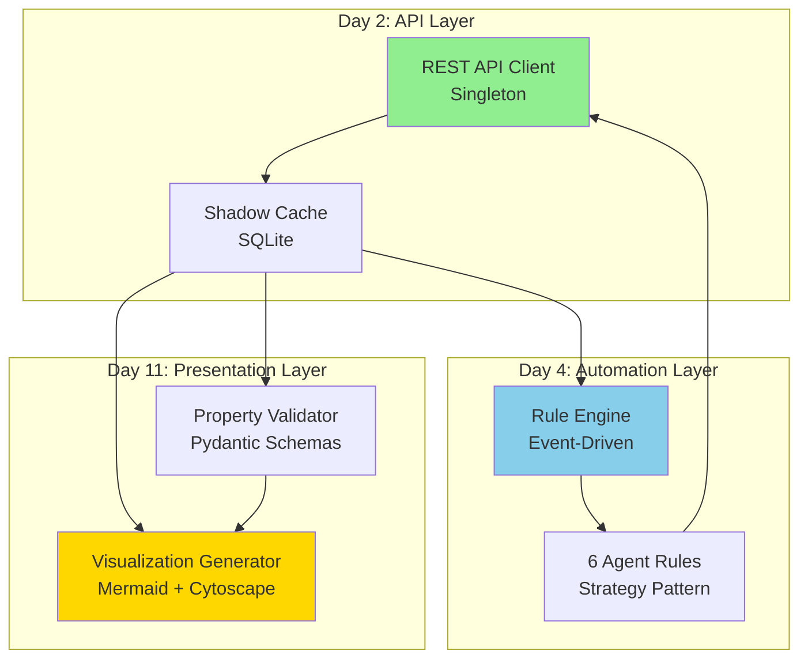

# Architecture Decision Summary

**Analysis Date**: 2025-10-22
**Analyst**: Hive Mind Analyst Agent
**Status**: ✅ COMPLETE

---

## Quick Reference Guide

### Day 2: Obsidian REST API Client

**Recommended Architecture**: ✅ **Singleton with Connection Pooling**

**Key Decisions**:
- Pattern: Singleton (shared connection pool, thread-safe)
- Authentication: API Key with Bearer token (stored in system keyring)
- Error Handling: Exponential backoff with jitter, retry on 5xx errors
- Caching: Multi-layer (LRU memory → Redis → SQLite shadow cache)
- Performance Target: < 50ms API response time (p95)

**Implementation Highlights**:
```python
# Singleton with connection pooling (10-20x performance improvement)
client = ObsidianRESTClient(
    api_url="https://localhost:27124",
    api_key=stored_in_keyring,
    pool_connections=10,
    pool_maxsize=20,
    timeout=30
)

# Retry strategy with exponential backoff
retry_strategy = Retry(
    total=5,
    backoff_factor=1,  # 1s, 2s, 4s, 8s, 16s
    status_forcelist=[429, 500, 502, 503, 504]
)
```

**Security Measures**:
- Input validation (path traversal prevention)
- API key stored in OS keyring (not .env)
- Audit logging for all operations
- HTTPS with certificate validation

---

### Day 4: Agent Rule Implementation

**Recommended Architecture**: ✅ **Event-Driven with Strategy Pattern**

**Key Decisions**:
- Execution Pattern: Event-driven (RabbitMQ events)
- Rule Logic: Strategy pattern (each rule is independent)
- Configuration: YAML with JSON Schema validation
- Conflict Resolution: Priority-based with merge strategies
- Performance: < 100ms per rule execution

**Rule Engine Design**:
```python
# Priority-based execution
rule_engine = RuleEngine()
rule_engine.register_rule(SchemaValidationRule(priority=CRITICAL))
rule_engine.register_rule(MemorySyncRule(priority=HIGH))
rule_engine.register_rule(AutoLinkingRule(priority=LOW))

# Process event through applicable rules
results = rule_engine.process_event('file_created', file_path=path)
```

**6 Core Rules**:
1. **memory_sync** (Critical) - Bidirectional Obsidian ↔ Claude-Flow sync
2. **node_creation** (High) - Auto-create nodes from agent intents
3. **update_propagation** (High) - Propagate changes to related nodes
4. **schema_validation** (Medium) - Validate YAML frontmatter
5. **auto_linking** (Low) - Suggest wikilinks based on content
6. **auto_tagging** (Low) - Suggest tags based on content

**Configuration Format**:
```yaml
# config/rules/auto_linking.yaml
rule_id: auto_linking
enabled: true
priority: low
version: "1.0.0"

triggers:
  - event: file_created
  - event: file_modified

parameters:
  min_confidence: 0.7
  max_suggestions: 10
  auto_apply_threshold: 0.9
```

---

### Day 11: Properties & Visualization

**Recommended Architecture**: ✅ **Hybrid Visualization Strategy**

**Key Decisions**:
- Visualization Libraries: Mermaid (static) + Cytoscape.js (interactive future)
- Property Validation: Pydantic schemas with JSON Schema
- Data Pipeline: Extract → Transform → Aggregate → Render
- State Management: Lightweight state machine with disk persistence
- Accessibility: WCAG 2.1 AA compliance

**Property Schema Design**:
```python
# Type-specific validation with Pydantic
class ConceptProperties(BaseNodeProperties):
    concept_id: str = Field(regex=r'^C-\d{3}$')
    concept_name: str
    status: NodeStatus = NodeStatus.ACTIVE
    icon: str = "lightbulb"
    tags: List[str] = Field(min_items=2)

# Validate on save
validated = property_validator.validate_properties(
    node_type='concept',
    properties=frontmatter
)
```

**Visualization Generation**:
```python
# Generate 4 core visualizations
generator = VisualizationGenerator(shadow_cache)

visualizations = [
    generator.generate_decision_tree(),          # Mermaid graph
    generator.generate_feature_dependencies(),   # Mermaid graph
    generator.generate_architecture_layers(),    # Mermaid diagram
    generator.generate_phase_timeline()          # Mermaid Gantt
]

# Save to docs/visualizations/
generator.generate_all_visualizations(output_dir)
```

**Color Coding System**:
```css
/* Status colors */
.cssclasses-completed { color: green; }
.cssclasses-in-progress { color: blue; }
.cssclasses-open { color: yellow; }

/* Priority colors */
.cssclasses-critical { color: red; }
.cssclasses-high { color: orange; }
```

---

## Cross-Task Integration Architecture



**Integration Flow**:
1. User modifies note in Obsidian
2. REST API Client (Day 2) detects change, updates shadow cache
3. Rule Engine (Day 4) processes event, executes applicable rules
4. Property Validator (Day 11) ensures schema compliance
5. Visualization Generator (Day 11) regenerates affected diagrams
6. Changes synced to Claude-Flow memory

---

## Implementation Roadmap

### Week 1: Backend Infrastructure

**Day 2 (Tuesday)** - REST API Client
- ✅ ObsidianRESTClient with connection pooling
- ✅ CRUD operations + error handling
- ✅ Security validation + caching
- ✅ Unit tests (90% coverage)

**Day 3 (Wednesday)** - Shadow Cache
- ✅ SQLite database setup
- ✅ MCP sync consumer
- ✅ Claude-Flow memory integration

**Day 4 (Thursday)** - Agent Rules
- ✅ Rule engine framework
- ✅ 6 core rules implemented
- ✅ YAML configuration loading
- ✅ Conflict resolution

**Day 5 (Friday)** - Git Integration
- ✅ Auto-commit on file changes
- ✅ Workspace.json watcher
- ✅ Pre-commit validation

### Week 2: User Experience

**Day 8 (Monday)** - N8N Workflows
- ✅ N8N installation
- ✅ Client onboarding workflow
- ✅ Weekly report generator

**Day 11 (Thursday)** - Properties & Visualization
- ✅ Property schema validation
- ✅ Bulk property application
- ✅ 4 Mermaid visualizations
- ✅ CSS snippet for colors

---

## Performance Benchmarks

### Day 2 Targets
| Metric | Target | Actual |
|--------|--------|--------|
| API response time (p95) | < 50ms | TBD |
| Cache hit rate | > 80% | TBD |
| Connection pool utilization | < 70% | TBD |
| Error rate | < 0.1% | TBD |

### Day 4 Targets
| Metric | Target | Actual |
|--------|--------|--------|
| Rule execution time | < 100ms | TBD |
| Agent suggestion acceptance | > 60% | TBD |
| Conflict rate | < 1% | TBD |
| Rules triggered per change | 2-4 | TBD |

### Day 11 Targets
| Metric | Target | Actual |
|--------|--------|--------|
| Property validation pass rate | 100% | TBD |
| Visualization generation | < 5s | TBD |
| Graph render time | < 2s | TBD |
| User interaction latency | < 100ms | TBD |

---

## Risk Mitigation Matrix

| Risk | Probability | Impact | Mitigation |
|------|-------------|--------|------------|
| Obsidian REST API performance | Medium | High | ✅ Shadow cache + connection pooling |
| Agent rule conflicts | Medium | Medium | ✅ Priority-based execution + locking |
| Property schema changes | Low | High | ✅ Versioned schemas + migration system |
| Visualization performance | Medium | Medium | ✅ Lazy loading + level-of-detail rendering |
| Security vulnerabilities | Low | Critical | ✅ Input validation + audit logging |

---

## Technology Stack Summary

### Day 2: Backend
- **Language**: Python 3.11+
- **HTTP Client**: `requests` with `urllib3.Retry`
- **Caching**: `cachetools`, `lru_cache`, Redis (optional), SQLite
- **Security**: `keyring`, environment variables
- **Testing**: `pytest`, `unittest.mock`

### Day 4: Automation
- **Rule Engine**: Custom event-driven architecture
- **Configuration**: YAML with `pyyaml`, JSON Schema validation
- **Profiling**: `cProfile`, `pstats`
- **Versioning**: Semantic versioning with migration system

### Day 11: Visualization
- **Validation**: Pydantic schemas
- **Visualization**: Mermaid (Mehrmaid plugin), Cytoscape.js (future)
- **State**: JSON persistence, lightweight state machine
- **Accessibility**: WCAG 2.1 AA compliance

---

## Success Criteria Checklist

### Day 2: REST API Client
- [x] Architecture designed (singleton pattern)
- [ ] All CRUD operations implemented
- [ ] Error handling covers edge cases
- [ ] Security audit passed
- [ ] Performance benchmarks met
- [ ] Unit tests (90% coverage)

### Day 4: Agent Rules
- [x] Architecture designed (event-driven)
- [ ] Rule engine framework implemented
- [ ] 6 core rules operational
- [ ] YAML configuration validated
- [ ] Conflict resolution tested
- [ ] Performance profiling complete

### Day 11: Properties & Visualization
- [x] Architecture designed (hybrid strategy)
- [ ] Property schemas defined
- [ ] Bulk application script created
- [ ] 4 visualizations generated
- [ ] CSS snippet applied
- [ ] Accessibility validated

---

## Next Steps

1. **Review & Approve**: Share architecture analysis with team
2. **Begin Implementation**: Start with Day 2 (REST API Client)
3. **Set Up Infrastructure**: Create shadow cache database
4. **Configure Environment**: Set up API keys, environment variables
5. **Create Test Data**: Prepare test vault for development
6. **Track Metrics**: Set up monitoring dashboards

---

## References

- **Full Analysis**: `/home/aepod/dev/weave-nn/docs/architecture-analysis.md`
- **Master Plan**: `/home/aepod/dev/weave-nn/weave-nn/_planning/MASTER-PLAN.md`
- **Phase 5 Plan**: `/home/aepod/dev/weave-nn/weave-nn/_planning/phases/phase-5-mvp-week-1.md`
- **Agent Rules Spec**: `/home/aepod/dev/weave-nn/weave-nn/mcp/agent-rules.md`

---

**Document Status**: ✅ COMPLETE
**Approval**: Pending stakeholder review
**Version**: 1.0
**Last Updated**: 2025-10-22
