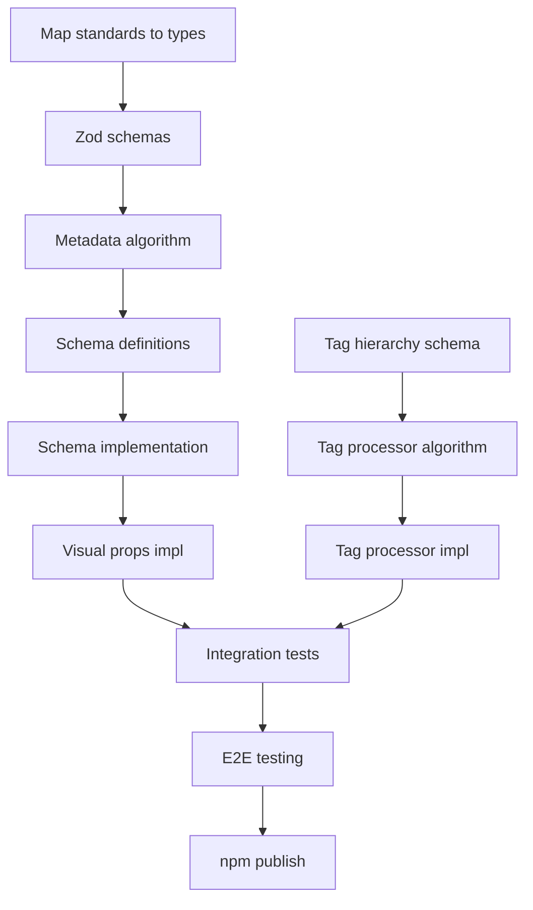

# SPARC Development Plan: @weavelogic/knowledge-graph-agent

**Version**: 0.2.0 -> 1.0.0
**Created**: 2025-12-28
**Methodology**: SPARC (Specification, Pseudocode, Architecture, Refinement, Completion)

---

## Executive Summary

This document outlines the complete development roadmap for implementing all features in the knowledge-graph-agent NPM package, following the SPARC methodology. The plan transforms the existing v0.2.0 package into a production-ready v1.0.0 release with full weave-nn standards compliance.

---

## Phase 1: Specification

### 1.1 Requirements Analysis

#### 1.1.1 Core Requirements (from weave-nn standards)

| ID | Requirement | Source | Priority |
|----|------------|--------|----------|
| REQ-001 | Full Metadata Schema v3.0 support | `metadata-schema-v3.md` | Critical |
| REQ-002 | Nested tag hierarchy support | `tag-hierarchy-system.md` | Critical |
| REQ-003 | Visual intelligence properties | `metadata-schema-v3.md` | High |
| REQ-004 | Obsidian-native output (wikilinks, callouts) | `PRIMITIVES.md` | Critical |
| REQ-005 | SQLite FTS5 full-text search | Existing implementation | High |
| REQ-006 | Claude-flow memory integration | Package spec | High |
| REQ-007 | Dataview query field generation | `metadata-schema-v3.md` | Medium |
| REQ-008 | CSS class generation for Obsidian | `metadata-schema-v3.md` | Medium |
| REQ-009 | Icon system integration | `obsidian-icon-system.md` | Medium |
| REQ-010 | Graph connectivity analysis | Existing implementation | High |

#### 1.1.2 Feature Specifications

**Category A: Knowledge Graph Core**

| Feature | Description | Status | Complexity |
|---------|-------------|--------|------------|
| Node CRUD operations | Create, read, update, delete nodes | Implemented | 3 |
| Edge management | Bidirectional link tracking | Implemented | 3 |
| Tag management | Hierarchical tag support | Partial | 4 |
| Full-text search | FTS5 with sanitized queries | Implemented | 4 |
| Graph statistics | Connectivity and orphan analysis | Implemented | 3 |
| Metadata storage | Key-value persistence | Implemented | 2 |

**Category B: Documentation Analyzer**

| Feature | Description | Status | Complexity |
|---------|-------------|--------|------------|
| Content categorization | Auto-detect document type | Implemented | 4 |
| Tag extraction | Extract and generate tags | Implemented | 3 |
| Link extraction | Wikilinks and markdown links | Implemented | 3 |
| Concept extraction | Headers and bold terms | Implemented | 3 |
| Cross-reference building | Related doc linking | Implemented | 4 |
| MOC generation | Map of Content files | Implemented | 3 |

**Category C: Standards Compliance (NEW)**

| Feature | Description | Status | Complexity |
|---------|-------------|--------|------------|
| Visual properties | Icon, color, cssclasses | Not Started | 4 |
| Relationship types | depends_on, enables, blocks | Not Started | 4 |
| Dataview fields | completion, effort_hours, deadline | Not Started | 3 |
| Learning loop metadata | perception_score, cultivation | Not Started | 3 |
| Knowledge graph metrics | centrality_score, cluster_id | Not Started | 5 |
| Tag hierarchy validation | Nested tag enforcement | Not Started | 4 |

**Category D: Integration**

| Feature | Description | Status | Complexity |
|---------|-------------|--------|------------|
| Claude-flow sync | Memory persistence | Partial | 4 |
| MCP command generation | Store/retrieve commands | Implemented | 3 |
| CLAUDE.md generation | Project configuration | Implemented | 3 |
| Deep analysis agents | Claude-flow agent analysis | Not Started | 5 |
| Vector embeddings | Semantic search prep | Not Started | 5 |

#### 1.1.3 Acceptance Criteria

**AC-001: Metadata Schema v3.0 Compliance**
- [ ] All generated frontmatter includes core identifiers (title, type, status)
- [ ] Visual properties block with icon, color, cssclasses
- [ ] Relationship arrays (related_files, depends_on, enables)
- [ ] Dataview fields for progress tracking
- [ ] Valid Zod schema validation passes

**AC-002: Tag Hierarchy Support**
- [ ] Support nested tag syntax (`phase/phase-14/obsidian`)
- [ ] Automatic tag generation from path and content
- [ ] Tag validation against defined hierarchies
- [ ] Tag statistics with hierarchy grouping

**AC-003: Obsidian Integration**
- [ ] Wikilinks format `[[Title|Display]]`
- [ ] Callout blocks `> [!info]`, `> [!warning]`
- [ ] Proper CSS class array generation
- [ ] Canvas position metadata support

**AC-004: Graph Intelligence**
- [ ] Orphan node detection
- [ ] Connectivity scoring
- [ ] Cluster identification
- [ ] Most-connected node analysis

**AC-005: CLI Completeness**
- [ ] All commands documented and functional
- [ ] Interactive prompts with inquirer
- [ ] Progress indicators with ora
- [ ] JSON output mode support

---

### 1.2 Task Breakdown - Phase 1

| Task ID | Task Name | Dependencies | Complexity | Priority |
|---------|-----------|--------------|------------|----------|
| P1-001 | Document existing API surface | None | 2 | Critical |
| P1-002 | Map weave-nn standards to types | None | 3 | Critical |
| P1-003 | Define Zod schemas for metadata v3.0 | P1-002 | 4 | Critical |
| P1-004 | Create tag hierarchy schema | P1-002 | 3 | High |
| P1-005 | Document visual property requirements | P1-002 | 2 | High |
| P1-006 | Define integration requirements | None | 3 | High |
| P1-007 | Create acceptance test criteria | P1-001-P1-006 | 3 | High |

---

## Phase 2: Pseudocode

### 2.1 Algorithm Designs

#### 2.1.1 Metadata Schema v3.0 Generator

```pseudocode
FUNCTION generateMetadataV3(document, options):
    // Core identifiers
    metadata = {
        title: extractTitle(document) OR formatTitle(document.filename),
        type: detectDocumentType(document.content, document.path),
        status: determineStatus(document.content, document.frontmatter),
        phase_id: extractPhaseId(document.path, document.content)
    }

    // Categorization
    metadata.tags = UNION(
        extractExistingTags(document.frontmatter),
        extractHashTags(document.content),
        generatePathTags(document.path),
        inferContentTags(document.content)
    )

    metadata.domain = detectDomain(document.path, document.content)
    metadata.scope = detectScope(document.content)
    metadata.priority = extractPriority(document.content, document.frontmatter)

    // Visual properties (NEW in v3.0)
    metadata.visual = {
        icon: getIconForType(metadata.type),
        color: getColorForType(metadata.type),
        cssclasses: generateCssClasses(metadata)
    }

    // Relationships
    metadata.related_files = extractWikilinks(document.content)
    metadata.related_concepts = extractConcepts(document.content)
    metadata.depends_on = extractDependencies(document.content)
    metadata.enables = extractEnables(document.content)

    // Dataview fields
    IF document.type IN ['planning', 'implementation']:
        metadata.completion = calculateCompletion(document.content)
        metadata.effort_hours = extractEffort(document.content)
        metadata.deadline = extractDeadline(document.content)

    RETURN validateWithZod(metadata, MetadataV3Schema)
```

#### 2.1.2 Tag Hierarchy Processor

```pseudocode
CLASS TagHierarchyProcessor:
    hierarchies = LOAD_HIERARCHIES()

    FUNCTION processTag(tag):
        // Normalize tag format
        normalized = tag.toLowerCase().replace(/[^a-z0-9\/-]/g, '')

        // Check if it's already hierarchical
        IF normalized.contains('/'):
            parts = normalized.split('/')
            RETURN validateHierarchy(parts)

        // Try to find parent hierarchy
        FOR hierarchy IN hierarchies:
            IF hierarchy.hasChild(normalized):
                RETURN hierarchy.getFullPath(normalized)

        RETURN normalized

    FUNCTION validateHierarchy(parts):
        current = hierarchies
        FOR part IN parts:
            IF NOT current.has(part):
                LOG_WARNING("Unknown hierarchy: " + parts.join('/'))
                RETURN parts.join('/')
            current = current.get(part).children
        RETURN parts.join('/')

    FUNCTION generateHierarchicalTags(document):
        tags = extractAllTags(document)
        hierarchicalTags = []

        FOR tag IN tags:
            processed = processTag(tag)
            hierarchicalTags.push(processed)

            // Add parent tags for inheritance
            parts = processed.split('/')
            FOR i FROM 1 TO parts.length - 1:
                parent = parts.slice(0, i).join('/')
                hierarchicalTags.push(parent)

        RETURN UNIQUE(hierarchicalTags)
```

#### 2.1.3 Visual Intelligence Generator

```pseudocode
CONST TYPE_ICONS = {
    planning: "📋",
    implementation: "⚙️",
    research: "🔬",
    architecture: "🏛️",
    testing: "🧪",
    documentation: "📚",
    hub: "🌐",
    concept: "💡",
    technical: "🔧",
    feature: "✨",
    primitive: "🧱",
    service: "🔌",
    guide: "📖",
    standard: "📏",
    integration: "🔗"
}

CONST TYPE_COLORS = {
    planning: "#3B82F6",
    implementation: "#10B981",
    research: "#8B5CF6",
    architecture: "#EC4899",
    testing: "#F59E0B",
    documentation: "#06B6D4",
    hub: "#EC4899",
    concept: "#6366F1",
    // ... etc
}

FUNCTION generateVisualProperties(metadata):
    visual = {}

    // Icon
    visual.icon = TYPE_ICONS[metadata.type] OR "📄"

    // Color
    visual.color = TYPE_COLORS[metadata.type] OR "#64748B"

    // CSS Classes
    visual.cssclasses = [
        "type-" + metadata.type,
        "status-" + metadata.status,
        "priority-" + (metadata.priority OR "medium")
    ]

    IF metadata.phase_id:
        visual.cssclasses.push(metadata.phase_id.toLowerCase())

    IF metadata.domain:
        visual.cssclasses.push("domain-" + metadata.domain)

    RETURN visual
```

#### 2.1.4 Graph Connectivity Analyzer

```pseudocode
CLASS GraphConnectivityAnalyzer:
    FUNCTION analyzeConnectivity(graph):
        results = {
            orphanNodes: [],
            clusters: [],
            centralityScores: {},
            bridgeNodes: []
        }

        // Find orphan nodes
        FOR node IN graph.nodes:
            IF node.outgoingLinks.length == 0 AND node.incomingLinks.length == 0:
                results.orphanNodes.push(node)

        // Calculate centrality scores using degree centrality
        FOR node IN graph.nodes:
            degree = node.outgoingLinks.length + node.incomingLinks.length
            maxPossible = (graph.nodes.length - 1) * 2
            results.centralityScores[node.id] = degree / maxPossible

        // Detect clusters using connected components
        visited = SET()
        FOR node IN graph.nodes:
            IF NOT visited.has(node.id):
                cluster = BFS(node, visited)
                results.clusters.push(cluster)

        // Find bridge nodes (high betweenness)
        results.bridgeNodes = findBridgeNodes(graph, results.clusters)

        RETURN results

    FUNCTION BFS(startNode, visited):
        cluster = []
        queue = [startNode]

        WHILE queue.length > 0:
            node = queue.shift()
            IF visited.has(node.id):
                CONTINUE
            visited.add(node.id)
            cluster.push(node)

            FOR link IN CONCAT(node.outgoingLinks, node.incomingLinks):
                targetNode = graph.getNode(link.target)
                IF targetNode AND NOT visited.has(targetNode.id):
                    queue.push(targetNode)

        RETURN cluster
```

### 2.2 Data Structure Designs

#### 2.2.1 Extended Node Type

```typescript
interface KnowledgeNodeV3 extends KnowledgeNode {
  // Core (existing)
  id: string;
  path: string;
  filename: string;
  title: string;
  type: NodeType;
  status: NodeStatus;
  content: string;
  frontmatter: NodeFrontmatterV3;
  tags: string[];
  outgoingLinks: NodeLink[];
  incomingLinks: NodeLink[];
  wordCount: number;
  lastModified: Date;

  // NEW: Visual properties
  visual: {
    icon: string;
    color: string;
    cssclasses: string[];
    graph_group?: string;
    canvas_position?: { x: number; y: number };
  };

  // NEW: Relationships
  depends_on: string[];
  enables: string[];
  blocks: string[];
  supersedes?: string;
  superseded_by?: string;

  // NEW: Dataview fields
  completion?: number;
  effort_hours?: number;
  actual_hours?: number;
  assigned_to?: string[];
  deadline?: string;
  started_date?: string;
  completed_date?: string;

  // NEW: Graph metrics
  centrality_score?: number;
  cluster_id?: string;
  orphan_risk?: 'low' | 'medium' | 'high';
}
```

#### 2.2.2 Tag Hierarchy Schema

```typescript
interface TagHierarchy {
  name: string;
  description: string;
  children: Map<string, TagHierarchy>;
  metadata?: {
    icon?: string;
    color?: string;
    deprecated?: boolean;
    aliases?: string[];
  };
}

const ROOT_HIERARCHIES: TagHierarchy[] = [
  { name: 'phase', children: ['phase-12', 'phase-13', 'phase-14', 'phase-15'] },
  { name: 'status', children: ['draft', 'planned', 'in-progress', 'review', 'blocked', 'complete', 'archived'] },
  { name: 'domain', children: ['architecture', 'weaver', 'learning-loop', 'knowledge-graph', 'infrastructure', 'research', 'implementation'] },
  { name: 'priority', children: ['critical', 'high', 'medium', 'low'] },
  { name: 'type', children: ['planning', 'implementation', 'research', 'documentation', 'testing', 'decision'] },
  { name: 'tech', children: ['language', 'runtime', 'framework', 'database', 'platform', 'ai'] },
  { name: 'agent', children: ['swarm', 'development', 'research', 'operations'] },
  { name: 'scope', children: ['system', 'component', 'feature', 'task', 'file'] },
];
```

### 2.3 Module Interaction Designs

```
┌─────────────────────────────────────────────────────────────────────┐
│                         CLI Layer (bin.ts)                          │
│  ┌─────────┐ ┌─────────┐ ┌─────────┐ ┌─────────┐ ┌─────────┐       │
│  │  init   │ │ analyze │ │  graph  │ │  sync   │ │ search  │ ...   │
│  └────┬────┘ └────┬────┘ └────┬────┘ └────┬────┘ └────┬────┘       │
└───────┼──────────┼──────────┼──────────┼──────────┼────────────────┘
        │          │          │          │          │
        ▼          ▼          ▼          ▼          ▼
┌─────────────────────────────────────────────────────────────────────┐
│                      Generator Layer                                 │
│  ┌─────────────┐ ┌──────────────┐ ┌──────────────┐ ┌──────────────┐ │
│  │ docs-init   │ │docs-analyzer │ │graph-generator│ │  claude-md   │ │
│  └──────┬──────┘ └──────┬───────┘ └──────┬───────┘ └──────┬───────┘ │
│         │               │                │                │         │
│         │     ┌─────────┴────────────────┴───────────┐    │         │
│         │     │        Metadata Processor (NEW)       │    │         │
│         │     │  ┌─────────────┐ ┌─────────────────┐ │    │         │
│         │     │  │ Visual Gen  │ │ Tag Hierarchy   │ │    │         │
│         │     │  └─────────────┘ └─────────────────┘ │    │         │
│         │     └──────────────────────────────────────┘    │         │
└─────────┼────────────────────┼────────────────────────────┼─────────┘
          │                    │                            │
          ▼                    ▼                            ▼
┌─────────────────────────────────────────────────────────────────────┐
│                         Core Layer                                   │
│  ┌──────────────┐ ┌──────────────┐ ┌──────────────┐                 │
│  │   database   │ │    graph     │ │   security   │                 │
│  │   (SQLite)   │ │  (Manager)   │ │  (Sanitize)  │                 │
│  └──────┬───────┘ └──────┬───────┘ └──────────────┘                 │
│         │                │                                           │
│         └────────────────┼───────────────────────────────────────────│
│                          │                                           │
│              ┌───────────┴───────────┐                               │
│              │     types.ts          │                               │
│              │  (Zod schemas, TS)    │                               │
│              └───────────────────────┘                               │
└─────────────────────────────────────────────────────────────────────┘
                                    │
                                    ▼
┌─────────────────────────────────────────────────────────────────────┐
│                      Integration Layer                               │
│  ┌──────────────────┐ ┌──────────────────┐ ┌──────────────────┐     │
│  │   claude-flow    │ │   obsidian       │ │   embeddings     │     │
│  │   (MCP sync)     │ │   (vault export) │ │   (vectors-NEW)  │     │
│  └──────────────────┘ └──────────────────┘ └──────────────────┘     │
└─────────────────────────────────────────────────────────────────────┘
```

### 2.4 Task Breakdown - Phase 2

| Task ID | Task Name | Dependencies | Complexity | Priority |
|---------|-----------|--------------|------------|----------|
| P2-001 | Design metadata v3.0 generator algorithm | P1-003 | 4 | Critical |
| P2-002 | Design tag hierarchy processor | P1-004 | 4 | Critical |
| P2-003 | Design visual intelligence generator | P1-005 | 3 | High |
| P2-004 | Design graph connectivity analyzer | P1-001 | 4 | High |
| P2-005 | Design extended node data structure | P2-001-P2-003 | 3 | Critical |
| P2-006 | Design module interaction flow | P2-001-P2-005 | 3 | High |
| P2-007 | Create algorithm test cases | P2-001-P2-004 | 3 | High |

---

## Phase 3: Architecture

### 3.1 Module Structure

```
packages/knowledge-graph-agent/
├── src/
│   ├── index.ts                 # Public API exports
│   │
│   ├── cli/
│   │   ├── bin.ts              # CLI entry point
│   │   ├── index.ts            # Program setup
│   │   └── commands/
│   │       ├── init.ts         # kg init
│   │       ├── analyze.ts      # kg analyze [deep|report]
│   │       ├── graph.ts        # kg graph
│   │       ├── docs.ts         # kg docs [init|status]
│   │       ├── convert.ts      # kg convert
│   │       ├── claude.ts       # kg claude [update|preview]
│   │       ├── sync.ts         # kg sync
│   │       ├── search.ts       # kg search
│   │       ├── stats.ts        # kg stats
│   │       ├── validate.ts     # kg validate (NEW)
│   │       ├── visualize.ts    # kg visualize (NEW)
│   │       └── export.ts       # kg export (NEW)
│   │
│   ├── core/
│   │   ├── types.ts            # Type definitions
│   │   ├── schemas.ts          # Zod validation schemas (NEW)
│   │   ├── database.ts         # SQLite operations
│   │   ├── graph.ts            # Graph manager
│   │   ├── security.ts         # Input sanitization
│   │   └── constants.ts        # Type mappings, hierarchies (NEW)
│   │
│   ├── generators/
│   │   ├── docs-init.ts        # Initialize docs structure
│   │   ├── docs-analyzer.ts    # Analyze existing docs
│   │   ├── docs-convert.ts     # Convert docs format
│   │   ├── graph-generator.ts  # Generate graph from docs
│   │   ├── claude-md.ts        # CLAUDE.md generation
│   │   ├── metadata-v3.ts      # Metadata v3.0 generator (NEW)
│   │   ├── visual-props.ts     # Visual properties (NEW)
│   │   └── moc-generator.ts    # MOC file generator (NEW)
│   │
│   ├── processors/
│   │   ├── tag-hierarchy.ts    # Tag hierarchy processing (NEW)
│   │   ├── link-resolver.ts    # Cross-reference resolution (NEW)
│   │   ├── content-analyzer.ts # Content analysis (NEW)
│   │   └── frontmatter.ts      # Frontmatter extraction/gen (NEW)
│   │
│   ├── integrations/
│   │   ├── claude-flow.ts      # Claude-flow MCP integration
│   │   ├── obsidian.ts         # Obsidian vault export (NEW)
│   │   └── embeddings.ts       # Vector embeddings (NEW)
│   │
│   ├── analytics/
│   │   ├── connectivity.ts     # Graph connectivity analysis (NEW)
│   │   ├── clusters.ts         # Cluster detection (NEW)
│   │   └── orphans.ts          # Orphan detection (NEW)
│   │
│   ├── templates/
│   │   ├── node-template.hbs   # Node document template
│   │   ├── moc-template.hbs    # MOC template
│   │   ├── primitives.hbs      # PRIMITIVES.md template
│   │   └── claude-md.hbs       # CLAUDE.md template
│   │
│   └── utils/
│       ├── file.ts             # File operations
│       ├── formatting.ts       # Title/filename formatting
│       └── validation.ts       # Input validation
│
├── tests/
│   ├── unit/
│   │   ├── core/
│   │   │   ├── database.test.ts
│   │   │   ├── graph.test.ts
│   │   │   └── schemas.test.ts
│   │   ├── generators/
│   │   │   ├── metadata-v3.test.ts
│   │   │   ├── visual-props.test.ts
│   │   │   └── docs-analyzer.test.ts
│   │   ├── processors/
│   │   │   ├── tag-hierarchy.test.ts
│   │   │   └── frontmatter.test.ts
│   │   └── analytics/
│   │       ├── connectivity.test.ts
│   │       └── clusters.test.ts
│   │
│   ├── integration/
│   │   ├── cli.test.ts
│   │   ├── workflow.test.ts
│   │   └── claude-flow.test.ts
│   │
│   └── fixtures/
│       ├── sample-docs/
│       ├── expected-output/
│       └── test-data.json
│
├── config/
│   ├── default-config.json
│   ├── hierarchies.json        # Tag hierarchy definitions
│   └── type-mappings.json      # Type to icon/color mappings
│
├── docs/
│   ├── API.md
│   ├── CONTRIBUTING.md
│   ├── CLI-REFERENCE.md
│   └── SPARC-DEVELOPMENT-PLAN.md
│
├── package.json
├── tsconfig.json
├── vite.config.ts
└── vitest.config.ts
```

### 3.2 Interface Definitions

#### 3.2.1 Public API (index.ts)

```typescript
// Core exports
export { KnowledgeGraphManager, createKnowledgeGraph } from './core/graph';
export { KnowledgeGraphDatabase, createDatabase } from './core/database';

// Type exports
export type {
  NodeType, NodeStatus, NodeLink, NodeFrontmatter, KnowledgeNode,
  NodeFrontmatterV3, KnowledgeNodeV3,  // NEW
  GraphEdge, GraphMetadata, GraphStats, KnowledgeGraph,
  KGConfig, ConfigSchema,
  GeneratorOptions, GeneratedDocument, DocsInitOptions, DocsInitResult,
  MemoryEntry, SyncResult,
  ClaudeMdSection, ClaudeMdTemplate, ClaudeMdGeneratorOptions,
  // NEW exports
  TagHierarchy, VisualProperties, ConnectivityAnalysis,
  ClusterInfo, OrphanReport,
} from './core/types';

// Schema exports (NEW)
export { MetadataV3Schema, TagSchema, VisualSchema } from './core/schemas';

// Generator exports
export { generateGraph, generateAndSave, updateGraph } from './generators/graph-generator';
export { initDocs, docsExist, getDocsPath } from './generators/docs-init';
export { generateClaudeMd, updateClaudeMd, addSection } from './generators/claude-md';
export { convertDocs, addFrontmatter, validateFrontmatter } from './generators/docs-convert';
export { analyzeDocs } from './generators/docs-analyzer';
// NEW
export { generateMetadataV3, upgradeToV3 } from './generators/metadata-v3';
export { generateVisualProps, getIconForType, getColorForType } from './generators/visual-props';

// Processor exports (NEW)
export { TagHierarchyProcessor, validateTag, normalizeTag } from './processors/tag-hierarchy';
export { resolveLinks, buildCrossReferences } from './processors/link-resolver';
export { analyzecontent, extractConcepts, detectType } from './processors/content-analyzer';
export { parseFrontmatter, generateFrontmatter, mergeFrontmatter } from './processors/frontmatter';

// Analytics exports (NEW)
export { analyzeConnectivity, calculateCentrality } from './analytics/connectivity';
export { detectClusters, getClusters } from './analytics/clusters';
export { findOrphans, getOrphanReport } from './analytics/orphans';

// Integration exports
export { ClaudeFlowIntegration, createClaudeFlowIntegration, generateMcpConfig } from './integrations/claude-flow';
export { exportToObsidian, createVaultStructure } from './integrations/obsidian';  // NEW
export { generateEmbeddings, searchSimilar } from './integrations/embeddings';      // NEW

// CLI export
export { createCLI } from './cli';

// Quick start
export { quickInit } from './index';
```

#### 3.2.2 Core Schemas (NEW: schemas.ts)

```typescript
import { z } from 'zod';

// Node type enum
export const NodeTypeSchema = z.enum([
  'concept', 'technical', 'feature', 'primitive',
  'service', 'guide', 'standard', 'integration',
  'planning', 'implementation', 'research', 'architecture',
  'testing', 'documentation', 'hub', 'sop', 'timeline', 'decision'
]);

// Node status enum
export const NodeStatusSchema = z.enum([
  'draft', 'planned', 'in-progress', 'review', 'blocked',
  'complete', 'archived', 'deprecated', 'active', 'paused'
]);

// Priority enum
export const PrioritySchema = z.enum(['critical', 'high', 'medium', 'low']);

// Domain enum
export const DomainSchema = z.enum([
  'weaver', 'learning-loop', 'knowledge-graph',
  'infrastructure', 'perception', 'cultivation', 'memory', 'neural'
]);

// Scope enum
export const ScopeSchema = z.enum(['system', 'component', 'feature', 'task', 'file']);

// Visual properties schema
export const VisualSchema = z.object({
  icon: z.string().optional(),
  color: z.string().regex(/^#[0-9A-Fa-f]{6}$/).optional(),
  cssclasses: z.array(z.string()).optional(),
  graph_group: z.string().optional(),
  canvas_position: z.object({
    x: z.number(),
    y: z.number()
  }).optional()
});

// Full Metadata v3.0 schema
export const MetadataV3Schema = z.object({
  // Core identifiers (required)
  title: z.string().min(1),
  type: NodeTypeSchema,
  status: NodeStatusSchema,
  phase_id: z.string().optional(),

  // Categorization
  tags: z.array(z.string()).optional(),
  domain: DomainSchema.optional(),
  scope: ScopeSchema.optional(),
  priority: PrioritySchema.optional(),

  // Relationships
  related_concepts: z.array(z.string()).optional(),
  related_files: z.array(z.string()).optional(),
  depends_on: z.array(z.string()).optional(),
  enables: z.array(z.string()).optional(),
  blocks: z.array(z.string()).optional(),
  supersedes: z.string().optional(),
  superseded_by: z.string().optional(),

  // Metadata
  author: z.enum(['human', 'ai-generated', 'collaborative']).optional(),
  created_date: z.string().optional(),
  updated_date: z.string().optional(),
  version: z.string().optional(),

  // Visual (NEW in v3.0)
  visual: VisualSchema.optional(),

  // Dataview fields
  completion: z.number().min(0).max(100).optional(),
  effort_hours: z.number().min(0).optional(),
  actual_hours: z.number().min(0).optional(),
  assigned_to: z.array(z.string()).optional(),
  deadline: z.string().optional(),
  started_date: z.string().optional(),
  completed_date: z.string().optional(),
  review_date: z.string().optional(),

  // Technical metadata
  file_size_kb: z.number().optional(),
  word_count: z.number().optional(),
  code_blocks: z.number().optional(),
  links_internal: z.number().optional(),
  links_external: z.number().optional(),
  embedding_model: z.string().optional(),
  embedding_date: z.string().optional(),

  // Knowledge graph metrics
  knowledge_graph: z.object({
    centrality_score: z.number().min(0).max(1).optional(),
    cluster_id: z.string().optional(),
    orphan_risk: z.enum(['low', 'medium', 'high']).optional()
  }).optional(),

  // Learning loop
  learning_loop: z.object({
    perception_score: z.number().min(0).max(1).optional(),
    cultivation_applied: z.boolean().optional(),
    reflection_insights: z.array(z.string()).optional(),
    iteration_count: z.number().optional()
  }).optional()
});

export type MetadataV3 = z.infer<typeof MetadataV3Schema>;
```

### 3.3 Database Schema Updates

```sql
-- Knowledge Graph Schema v2.0 (Extended)

-- Nodes table (updated)
CREATE TABLE IF NOT EXISTS nodes (
  id TEXT PRIMARY KEY,
  path TEXT NOT NULL UNIQUE,
  filename TEXT NOT NULL,
  title TEXT NOT NULL,
  type TEXT NOT NULL,
  status TEXT NOT NULL DEFAULT 'active',
  content TEXT,
  frontmatter TEXT,        -- JSON: full frontmatter
  visual TEXT,             -- NEW: JSON visual properties
  word_count INTEGER DEFAULT 0,

  -- NEW: Dataview fields
  completion INTEGER,
  effort_hours REAL,
  actual_hours REAL,
  deadline TEXT,
  started_date TEXT,
  completed_date TEXT,

  -- NEW: Graph metrics
  centrality_score REAL,
  cluster_id TEXT,
  orphan_risk TEXT CHECK(orphan_risk IN ('low', 'medium', 'high')),

  created_at TEXT NOT NULL DEFAULT (datetime('now')),
  updated_at TEXT NOT NULL DEFAULT (datetime('now'))
);

-- Relationships table (NEW)
CREATE TABLE IF NOT EXISTS relationships (
  id INTEGER PRIMARY KEY AUTOINCREMENT,
  source_id TEXT NOT NULL,
  target_id TEXT NOT NULL,
  type TEXT NOT NULL CHECK(type IN ('depends_on', 'enables', 'blocks', 'supersedes', 'related')),
  created_at TEXT NOT NULL DEFAULT (datetime('now')),
  FOREIGN KEY (source_id) REFERENCES nodes(id) ON DELETE CASCADE,
  UNIQUE(source_id, target_id, type)
);

-- Clusters table (NEW)
CREATE TABLE IF NOT EXISTS clusters (
  id TEXT PRIMARY KEY,
  name TEXT,
  description TEXT,
  node_count INTEGER DEFAULT 0,
  created_at TEXT NOT NULL DEFAULT (datetime('now'))
);

-- Visual mappings table (NEW)
CREATE TABLE IF NOT EXISTS visual_mappings (
  type TEXT PRIMARY KEY,
  icon TEXT NOT NULL,
  color TEXT NOT NULL,
  default_cssclasses TEXT  -- JSON array
);

-- Insert default visual mappings
INSERT OR IGNORE INTO visual_mappings VALUES
  ('planning', '📋', '#3B82F6', '["type-planning"]'),
  ('implementation', '⚙️', '#10B981', '["type-implementation"]'),
  ('research', '🔬', '#8B5CF6', '["type-research"]'),
  ('architecture', '🏛️', '#EC4899', '["type-architecture"]'),
  ('testing', '🧪', '#F59E0B', '["type-testing"]'),
  ('documentation', '📚', '#06B6D4', '["type-documentation"]'),
  ('hub', '🌐', '#EC4899', '["type-hub"]'),
  ('concept', '💡', '#6366F1', '["type-concept"]'),
  ('technical', '🔧', '#14B8A6', '["type-technical"]'),
  ('feature', '✨', '#F97316', '["type-feature"]'),
  ('primitive', '🧱', '#78716C', '["type-primitive"]'),
  ('service', '🔌', '#0EA5E9', '["type-service"]'),
  ('guide', '📖', '#22C55E', '["type-guide"]'),
  ('standard', '📏', '#EAB308', '["type-standard"]'),
  ('integration', '🔗', '#A855F7', '["type-integration"]');

-- New indexes
CREATE INDEX IF NOT EXISTS idx_nodes_cluster ON nodes(cluster_id);
CREATE INDEX IF NOT EXISTS idx_nodes_completion ON nodes(completion);
CREATE INDEX IF NOT EXISTS idx_relationships_type ON relationships(type);
CREATE INDEX IF NOT EXISTS idx_relationships_target ON relationships(target_id);
```

### 3.4 CLI Command Tree

```
kg
├── init [--path <path>] [--docs <docsDir>]
│   └── Initialize knowledge graph in project
│
├── analyze
│   ├── (default)     Analyze docs and create KG structure
│   ├── deep          Deep analysis with claude-flow agents
│   ├── report        Generate analysis report only
│   └── --dry-run     Preview without creating files
│
├── graph
│   ├── (default)     Generate/update knowledge graph
│   ├── --update      Incremental update
│   └── --full        Full regeneration
│
├── docs
│   ├── init          Initialize docs directory
│   ├── status        Show documentation status
│   └── migrate       Migrate to v3.0 format (NEW)
│
├── convert <source>
│   ├── (default)     Convert docs to weave-nn structure
│   ├── --auto        Automatic categorization
│   └── --interactive Interactive mode
│
├── frontmatter
│   ├── add <path>    Add frontmatter to files
│   ├── validate      Validate frontmatter
│   ├── update        Update/regenerate frontmatter
│   └── upgrade       Upgrade to v3.0 schema (NEW)
│
├── claude
│   ├── update        Update CLAUDE.md
│   ├── preview       Preview content
│   └── --template    Use specific template
│
├── sync
│   ├── (default)     Sync with claude-flow memory
│   └── --show-commands  Show MCP commands
│
├── search <query>
│   ├── (default)     Search knowledge graph
│   ├── --type        Filter by type
│   ├── --status      Filter by status
│   └── --json        JSON output
│
├── stats
│   ├── (default)     Display graph statistics
│   ├── --connectivity   Connectivity analysis (NEW)
│   ├── --clusters       Cluster breakdown (NEW)
│   └── --json        JSON output
│
├── validate (NEW)
│   ├── (default)     Validate all documents
│   ├── --schema      Validate against v3.0 schema
│   ├── --tags        Validate tag hierarchies
│   └── --links       Validate cross-references
│
├── visualize (NEW)
│   ├── (default)     Generate graph visualization
│   ├── --format      Output format (json, dot, html)
│   └── --clusters    Color by cluster
│
└── export (NEW)
    ├── obsidian      Export as Obsidian vault
    ├── json          Export as JSON
    └── csv           Export node list as CSV
```

### 3.5 Task Breakdown - Phase 3

| Task ID | Task Name | Dependencies | Complexity | Priority |
|---------|-----------|--------------|------------|----------|
| P3-001 | Create module directory structure | None | 1 | Critical |
| P3-002 | Define public API interface | P2-005 | 3 | Critical |
| P3-003 | Create Zod schema definitions | P2-001 | 4 | Critical |
| P3-004 | Design database schema v2.0 | P2-005 | 4 | Critical |
| P3-005 | Define CLI command tree | None | 2 | High |
| P3-006 | Create template files | P3-002 | 2 | Medium |
| P3-007 | Design config file schema | P3-003 | 2 | Medium |
| P3-008 | Document architecture decisions | P3-001-P3-007 | 2 | Medium |

---

## Phase 4: Refinement (TDD)

### 4.1 Test Specifications

#### 4.1.1 Unit Tests

**Core Tests:**

```typescript
// tests/unit/core/schemas.test.ts
describe('MetadataV3Schema', () => {
  it('validates minimal required fields', () => {
    const valid = MetadataV3Schema.parse({
      title: 'Test Document',
      type: 'concept',
      status: 'active'
    });
    expect(valid.title).toBe('Test Document');
  });

  it('rejects invalid type', () => {
    expect(() => MetadataV3Schema.parse({
      title: 'Test',
      type: 'invalid',
      status: 'active'
    })).toThrow();
  });

  it('validates visual properties', () => {
    const valid = MetadataV3Schema.parse({
      title: 'Test',
      type: 'planning',
      status: 'in-progress',
      visual: {
        icon: '📋',
        color: '#3B82F6',
        cssclasses: ['type-planning', 'status-in-progress']
      }
    });
    expect(valid.visual?.icon).toBe('📋');
  });

  it('validates completion range 0-100', () => {
    expect(() => MetadataV3Schema.parse({
      title: 'Test',
      type: 'planning',
      status: 'in-progress',
      completion: 150
    })).toThrow();
  });

  it('validates color as hex format', () => {
    expect(() => MetadataV3Schema.parse({
      title: 'Test',
      type: 'planning',
      status: 'active',
      visual: { color: 'blue' }  // Invalid
    })).toThrow();
  });
});
```

**Tag Hierarchy Tests:**

```typescript
// tests/unit/processors/tag-hierarchy.test.ts
describe('TagHierarchyProcessor', () => {
  let processor: TagHierarchyProcessor;

  beforeEach(() => {
    processor = new TagHierarchyProcessor();
  });

  it('normalizes flat tag to hierarchy when parent exists', () => {
    expect(processor.processTag('phase-14')).toBe('phase/phase-14');
  });

  it('preserves already hierarchical tags', () => {
    expect(processor.processTag('phase/phase-14/obsidian')).toBe('phase/phase-14/obsidian');
  });

  it('warns on unknown hierarchy but returns tag', () => {
    const consoleSpy = vi.spyOn(console, 'warn');
    const result = processor.processTag('unknown/custom');
    expect(result).toBe('unknown/custom');
    expect(consoleSpy).toHaveBeenCalled();
  });

  it('generates parent tags for inheritance', () => {
    const tags = processor.generateHierarchicalTags({
      tags: ['phase/phase-14/obsidian']
    });
    expect(tags).toContain('phase');
    expect(tags).toContain('phase/phase-14');
    expect(tags).toContain('phase/phase-14/obsidian');
  });

  it('handles empty or null tags', () => {
    expect(processor.processTag('')).toBe('');
    expect(processor.processTag(null as any)).toBe('');
  });
});
```

**Visual Properties Tests:**

```typescript
// tests/unit/generators/visual-props.test.ts
describe('Visual Properties Generator', () => {
  it('generates correct icon for type', () => {
    expect(getIconForType('planning')).toBe('📋');
    expect(getIconForType('research')).toBe('🔬');
    expect(getIconForType('implementation')).toBe('⚙️');
  });

  it('generates correct color for type', () => {
    expect(getColorForType('planning')).toBe('#3B82F6');
    expect(getColorForType('implementation')).toBe('#10B981');
  });

  it('generates CSS classes from metadata', () => {
    const props = generateVisualProps({
      type: 'planning',
      status: 'in-progress',
      priority: 'high',
      phase_id: 'PHASE-14'
    });
    expect(props.cssclasses).toContain('type-planning');
    expect(props.cssclasses).toContain('status-in-progress');
    expect(props.cssclasses).toContain('priority-high');
    expect(props.cssclasses).toContain('phase-14');
  });

  it('handles missing optional fields', () => {
    const props = generateVisualProps({
      type: 'concept',
      status: 'active'
    });
    expect(props.cssclasses).not.toContain('priority-undefined');
  });

  it('returns fallback for unknown type', () => {
    expect(getIconForType('unknown' as any)).toBe('📄');
    expect(getColorForType('unknown' as any)).toBe('#64748B');
  });
});
```

**Connectivity Analysis Tests:**

```typescript
// tests/unit/analytics/connectivity.test.ts
describe('Connectivity Analyzer', () => {
  let graph: KnowledgeGraph;

  beforeEach(() => {
    graph = createTestGraph();
  });

  it('detects orphan nodes correctly', () => {
    const analysis = analyzeConnectivity(graph);
    expect(analysis.orphanNodes).toHaveLength(2);
    expect(analysis.orphanNodes.map(n => n.id)).toContain('orphan-1');
  });

  it('calculates centrality scores', () => {
    const analysis = analyzeConnectivity(graph);
    expect(analysis.centralityScores['hub-node']).toBeGreaterThan(0.5);
    expect(analysis.centralityScores['leaf-node']).toBeLessThan(0.2);
  });

  it('identifies clusters correctly', () => {
    const analysis = analyzeConnectivity(graph);
    expect(analysis.clusters).toHaveLength(3);
  });

  it('finds bridge nodes between clusters', () => {
    const analysis = analyzeConnectivity(graph);
    expect(analysis.bridgeNodes).toHaveLength(1);
  });

  it('handles empty graph', () => {
    const emptyGraph = createKnowledgeGraph('empty', '/tmp');
    const analysis = analyzeConnectivity(emptyGraph);
    expect(analysis.orphanNodes).toHaveLength(0);
    expect(analysis.clusters).toHaveLength(0);
  });
});
```

#### 4.1.2 Integration Tests

```typescript
// tests/integration/workflow.test.ts
describe('Full Workflow Integration', () => {
  let tempDir: string;

  beforeEach(async () => {
    tempDir = await createTempDir();
    await setupTestDocs(tempDir);
  });

  afterEach(async () => {
    await cleanupTempDir(tempDir);
  });

  it('complete analysis workflow', async () => {
    // Step 1: Initialize
    const initResult = await quickInit({
      projectRoot: tempDir,
      docsPath: 'docs'
    });
    expect(initResult.success).toBe(true);

    // Step 2: Analyze
    const analyzeResult = await analyzeDocs({
      sourceDir: 'docs',
      targetDir: 'docs-nn',
      projectRoot: tempDir,
      createMOC: true
    });
    expect(analyzeResult.filesAnalyzed).toBeGreaterThan(0);
    expect(analyzeResult.filesCreated).toBe(analyzeResult.filesAnalyzed);

    // Step 3: Generate graph
    const graphResult = await generateAndSave({
      projectRoot: tempDir,
      outputPath: join(tempDir, 'docs-nn')
    }, join(tempDir, '.kg/knowledge.db'));
    expect(graphResult.success).toBe(true);

    // Step 4: Verify metadata v3.0
    const db = createDatabase(join(tempDir, '.kg/knowledge.db'));
    const nodes = db.getAllNodes();
    for (const node of nodes) {
      expect(node.frontmatter.visual).toBeDefined();
      expect(MetadataV3Schema.safeParse(node.frontmatter).success).toBe(true);
    }
    db.close();
  });

  it('validates cross-references', async () => {
    await quickInit({ projectRoot: tempDir });

    const db = createDatabase(join(tempDir, '.kg/knowledge.db'));
    const stats = db.getStats();

    expect(stats.orphanNodes).toBeLessThan(stats.totalNodes * 0.1);
    expect(stats.avgLinksPerNode).toBeGreaterThan(1);

    db.close();
  });

  it('generates valid CLAUDE.md', async () => {
    await quickInit({ projectRoot: tempDir, updateClaudeMd: true });

    const claudeMd = readFileSync(join(tempDir, 'CLAUDE.md'), 'utf-8');
    expect(claudeMd).toContain('Knowledge Graph');
    expect(claudeMd).toContain('claude-flow');
  });
});
```

#### 4.1.3 CLI Tests

```typescript
// tests/integration/cli.test.ts
describe('CLI Commands', () => {
  let tempDir: string;

  beforeEach(async () => {
    tempDir = await createTempDir();
  });

  it('kg init creates required files', async () => {
    const result = await runCLI(['init', '--path', tempDir]);
    expect(result.exitCode).toBe(0);
    expect(existsSync(join(tempDir, '.kg'))).toBe(true);
    expect(existsSync(join(tempDir, '.kg/knowledge.db'))).toBe(true);
  });

  it('kg analyze --dry-run does not create files', async () => {
    await setupTestDocs(tempDir);
    const result = await runCLI(['analyze', '--dry-run', '--path', tempDir]);
    expect(result.exitCode).toBe(0);
    expect(existsSync(join(tempDir, 'docs-nn'))).toBe(false);
  });

  it('kg search returns results in JSON', async () => {
    await quickInit({ projectRoot: tempDir });
    const result = await runCLI(['search', 'test', '--json', '--path', tempDir]);
    expect(result.exitCode).toBe(0);
    const output = JSON.parse(result.stdout);
    expect(Array.isArray(output.results)).toBe(true);
  });

  it('kg validate checks schema compliance', async () => {
    await quickInit({ projectRoot: tempDir });
    const result = await runCLI(['validate', '--schema', '--path', tempDir]);
    expect(result.exitCode).toBe(0);
    expect(result.stdout).toContain('valid');
  });

  it('kg stats --connectivity shows analysis', async () => {
    await quickInit({ projectRoot: tempDir });
    const result = await runCLI(['stats', '--connectivity', '--path', tempDir]);
    expect(result.exitCode).toBe(0);
    expect(result.stdout).toContain('Orphan nodes');
    expect(result.stdout).toContain('Centrality');
  });
});
```

### 4.2 Implementation Priority

| Iteration | Features | Tests | Priority |
|-----------|----------|-------|----------|
| 1 | Zod schemas (MetadataV3Schema) | Schema validation tests | Critical |
| 2 | Visual properties generator | Visual props tests | Critical |
| 3 | Tag hierarchy processor | Tag hierarchy tests | Critical |
| 4 | Database schema v2.0 migration | Database tests | High |
| 5 | Metadata v3.0 generator | Metadata generator tests | High |
| 6 | Connectivity analyzer | Connectivity tests | High |
| 7 | CLI validate command | CLI validation tests | High |
| 8 | Frontmatter upgrade command | Upgrade workflow tests | Medium |
| 9 | Obsidian export integration | Export tests | Medium |
| 10 | Deep analysis with claude-flow | Integration tests | Medium |

### 4.3 Task Breakdown - Phase 4

| Task ID | Task Name | Dependencies | Complexity | Priority |
|---------|-----------|--------------|------------|----------|
| P4-001 | Create test fixtures and helpers | P3-001 | 2 | Critical |
| P4-002 | Write schema validation tests | P3-003 | 3 | Critical |
| P4-003 | Write visual properties tests | P2-003 | 2 | Critical |
| P4-004 | Write tag hierarchy tests | P2-002 | 3 | Critical |
| P4-005 | Write connectivity analysis tests | P2-004 | 4 | High |
| P4-006 | Implement Zod schemas | P4-002 | 4 | Critical |
| P4-007 | Implement visual properties generator | P4-003 | 3 | Critical |
| P4-008 | Implement tag hierarchy processor | P4-004 | 4 | Critical |
| P4-009 | Implement connectivity analyzer | P4-005 | 4 | High |
| P4-010 | Write integration tests | P4-006-P4-009 | 3 | High |
| P4-011 | Implement new CLI commands | P4-010 | 3 | High |
| P4-012 | Write CLI tests | P4-011 | 2 | High |
| P4-013 | Refactor existing code for v3.0 | P4-006-P4-009 | 4 | High |
| P4-014 | Database migration implementation | P3-004 | 4 | High |
| P4-015 | Performance optimization | P4-010 | 3 | Medium |

---

## Phase 5: Completion

### 5.1 Integration Testing

| Test Suite | Description | Criteria |
|------------|-------------|----------|
| E2E Workflow | Complete analyze -> graph -> sync | All steps pass |
| Schema Migration | v2.0 to v3.0 upgrade | No data loss |
| CLI Coverage | All commands tested | 100% command coverage |
| Error Handling | Edge cases and failures | Graceful degradation |
| Performance | Large vault analysis | <30s for 1000 files |

### 5.2 Documentation

| Document | Description | Priority |
|----------|-------------|----------|
| API.md | Complete API reference | Critical |
| CLI-REFERENCE.md | CLI command documentation | Critical |
| CONTRIBUTING.md | Contribution guidelines | High |
| CHANGELOG.md | Version history | High |
| MIGRATION-GUIDE.md | v2.0 to v3.0 migration | High |
| EXAMPLES.md | Usage examples | Medium |

### 5.3 Publishing Checklist

- [ ] All tests passing (unit, integration, CLI)
- [ ] TypeScript compilation with no errors
- [ ] ESLint with no warnings
- [ ] Documentation complete
- [ ] README.md updated with new features
- [ ] CHANGELOG.md updated
- [ ] Version bumped to 1.0.0
- [ ] package.json metadata complete
- [ ] npm publish dry-run successful
- [ ] GitHub release created

### 5.4 Task Breakdown - Phase 5

| Task ID | Task Name | Dependencies | Complexity | Priority |
|---------|-----------|--------------|------------|----------|
| P5-001 | Run full E2E test suite | P4-010 | 2 | Critical |
| P5-002 | Performance benchmarking | P4-015 | 3 | High |
| P5-003 | Write API documentation | P4-006-P4-009 | 3 | Critical |
| P5-004 | Write CLI documentation | P4-011 | 2 | Critical |
| P5-005 | Create migration guide | P4-014 | 2 | High |
| P5-006 | Update README.md | P5-003, P5-004 | 2 | Critical |
| P5-007 | Create CHANGELOG.md | All previous | 1 | High |
| P5-008 | Security audit | P4-013 | 3 | High |
| P5-009 | npm publish preparation | P5-001-P5-008 | 2 | Critical |
| P5-010 | GitHub release | P5-009 | 1 | Critical |

---

## Complete Development Roadmap

### Timeline Overview

```
Week 1: Phase 1 (Specification) + Phase 2 (Pseudocode)
  - Days 1-2: Requirements documentation
  - Days 3-4: Algorithm design
  - Day 5: Data structure design

Week 2: Phase 3 (Architecture)
  - Days 1-2: Module structure creation
  - Days 3-4: Interface definitions
  - Day 5: Schema design

Week 3-4: Phase 4 (Refinement/TDD)
  - Week 3: Core implementations (schemas, processors)
  - Week 4: Analytics, CLI, integration

Week 5: Phase 5 (Completion)
  - Days 1-2: Testing and bug fixes
  - Days 3-4: Documentation
  - Day 5: Publishing
```

### Critical Path



### Risk Mitigation

| Risk | Likelihood | Impact | Mitigation |
|------|------------|--------|------------|
| Breaking changes in existing API | Medium | High | Maintain backward compatibility layer |
| Performance regression | Low | Medium | Benchmark before/after |
| Claude-flow API changes | Low | High | Abstract integration layer |
| Obsidian format changes | Low | Medium | Template-based output |
| Complex tag hierarchy edge cases | Medium | Low | Comprehensive test coverage |

---

## Appendix: Full Task Inventory

### All Tasks by Phase

```yaml
phase_1_specification:
  - id: P1-001
    name: Document existing API surface
    dependencies: []
    complexity: 2
    priority: critical
    estimated_hours: 4

  - id: P1-002
    name: Map weave-nn standards to types
    dependencies: []
    complexity: 3
    priority: critical
    estimated_hours: 6

  - id: P1-003
    name: Define Zod schemas for metadata v3.0
    dependencies: [P1-002]
    complexity: 4
    priority: critical
    estimated_hours: 8

  - id: P1-004
    name: Create tag hierarchy schema
    dependencies: [P1-002]
    complexity: 3
    priority: high
    estimated_hours: 4

  - id: P1-005
    name: Document visual property requirements
    dependencies: [P1-002]
    complexity: 2
    priority: high
    estimated_hours: 2

  - id: P1-006
    name: Define integration requirements
    dependencies: []
    complexity: 3
    priority: high
    estimated_hours: 4

  - id: P1-007
    name: Create acceptance test criteria
    dependencies: [P1-001, P1-002, P1-003, P1-004, P1-005, P1-006]
    complexity: 3
    priority: high
    estimated_hours: 4

phase_2_pseudocode:
  - id: P2-001
    name: Design metadata v3.0 generator algorithm
    dependencies: [P1-003]
    complexity: 4
    priority: critical
    estimated_hours: 6

  - id: P2-002
    name: Design tag hierarchy processor
    dependencies: [P1-004]
    complexity: 4
    priority: critical
    estimated_hours: 6

  - id: P2-003
    name: Design visual intelligence generator
    dependencies: [P1-005]
    complexity: 3
    priority: high
    estimated_hours: 4

  - id: P2-004
    name: Design graph connectivity analyzer
    dependencies: [P1-001]
    complexity: 4
    priority: high
    estimated_hours: 6

  - id: P2-005
    name: Design extended node data structure
    dependencies: [P2-001, P2-002, P2-003]
    complexity: 3
    priority: critical
    estimated_hours: 4

  - id: P2-006
    name: Design module interaction flow
    dependencies: [P2-001, P2-002, P2-003, P2-004, P2-005]
    complexity: 3
    priority: high
    estimated_hours: 4

  - id: P2-007
    name: Create algorithm test cases
    dependencies: [P2-001, P2-002, P2-003, P2-004]
    complexity: 3
    priority: high
    estimated_hours: 4

phase_3_architecture:
  - id: P3-001
    name: Create module directory structure
    dependencies: []
    complexity: 1
    priority: critical
    estimated_hours: 1

  - id: P3-002
    name: Define public API interface
    dependencies: [P2-005]
    complexity: 3
    priority: critical
    estimated_hours: 4

  - id: P3-003
    name: Create Zod schema definitions
    dependencies: [P2-001]
    complexity: 4
    priority: critical
    estimated_hours: 6

  - id: P3-004
    name: Design database schema v2.0
    dependencies: [P2-005]
    complexity: 4
    priority: critical
    estimated_hours: 6

  - id: P3-005
    name: Define CLI command tree
    dependencies: []
    complexity: 2
    priority: high
    estimated_hours: 2

  - id: P3-006
    name: Create template files
    dependencies: [P3-002]
    complexity: 2
    priority: medium
    estimated_hours: 4

  - id: P3-007
    name: Design config file schema
    dependencies: [P3-003]
    complexity: 2
    priority: medium
    estimated_hours: 2

  - id: P3-008
    name: Document architecture decisions
    dependencies: [P3-001, P3-002, P3-003, P3-004, P3-005, P3-006, P3-007]
    complexity: 2
    priority: medium
    estimated_hours: 4

phase_4_refinement:
  - id: P4-001
    name: Create test fixtures and helpers
    dependencies: [P3-001]
    complexity: 2
    priority: critical
    estimated_hours: 4

  - id: P4-002
    name: Write schema validation tests
    dependencies: [P3-003]
    complexity: 3
    priority: critical
    estimated_hours: 6

  - id: P4-003
    name: Write visual properties tests
    dependencies: [P2-003]
    complexity: 2
    priority: critical
    estimated_hours: 3

  - id: P4-004
    name: Write tag hierarchy tests
    dependencies: [P2-002]
    complexity: 3
    priority: critical
    estimated_hours: 4

  - id: P4-005
    name: Write connectivity analysis tests
    dependencies: [P2-004]
    complexity: 4
    priority: high
    estimated_hours: 6

  - id: P4-006
    name: Implement Zod schemas
    dependencies: [P4-002]
    complexity: 4
    priority: critical
    estimated_hours: 8

  - id: P4-007
    name: Implement visual properties generator
    dependencies: [P4-003]
    complexity: 3
    priority: critical
    estimated_hours: 4

  - id: P4-008
    name: Implement tag hierarchy processor
    dependencies: [P4-004]
    complexity: 4
    priority: critical
    estimated_hours: 8

  - id: P4-009
    name: Implement connectivity analyzer
    dependencies: [P4-005]
    complexity: 4
    priority: high
    estimated_hours: 8

  - id: P4-010
    name: Write integration tests
    dependencies: [P4-006, P4-007, P4-008, P4-009]
    complexity: 3
    priority: high
    estimated_hours: 8

  - id: P4-011
    name: Implement new CLI commands
    dependencies: [P4-010]
    complexity: 3
    priority: high
    estimated_hours: 8

  - id: P4-012
    name: Write CLI tests
    dependencies: [P4-011]
    complexity: 2
    priority: high
    estimated_hours: 4

  - id: P4-013
    name: Refactor existing code for v3.0
    dependencies: [P4-006, P4-007, P4-008, P4-009]
    complexity: 4
    priority: high
    estimated_hours: 12

  - id: P4-014
    name: Database migration implementation
    dependencies: [P3-004]
    complexity: 4
    priority: high
    estimated_hours: 8

  - id: P4-015
    name: Performance optimization
    dependencies: [P4-010]
    complexity: 3
    priority: medium
    estimated_hours: 6

phase_5_completion:
  - id: P5-001
    name: Run full E2E test suite
    dependencies: [P4-010]
    complexity: 2
    priority: critical
    estimated_hours: 4

  - id: P5-002
    name: Performance benchmarking
    dependencies: [P4-015]
    complexity: 3
    priority: high
    estimated_hours: 4

  - id: P5-003
    name: Write API documentation
    dependencies: [P4-006, P4-007, P4-008, P4-009]
    complexity: 3
    priority: critical
    estimated_hours: 8

  - id: P5-004
    name: Write CLI documentation
    dependencies: [P4-011]
    complexity: 2
    priority: critical
    estimated_hours: 4

  - id: P5-005
    name: Create migration guide
    dependencies: [P4-014]
    complexity: 2
    priority: high
    estimated_hours: 4

  - id: P5-006
    name: Update README.md
    dependencies: [P5-003, P5-004]
    complexity: 2
    priority: critical
    estimated_hours: 4

  - id: P5-007
    name: Create CHANGELOG.md
    dependencies: []
    complexity: 1
    priority: high
    estimated_hours: 2

  - id: P5-008
    name: Security audit
    dependencies: [P4-013]
    complexity: 3
    priority: high
    estimated_hours: 6

  - id: P5-009
    name: npm publish preparation
    dependencies: [P5-001, P5-002, P5-003, P5-004, P5-005, P5-006, P5-007, P5-008]
    complexity: 2
    priority: critical
    estimated_hours: 4

  - id: P5-010
    name: GitHub release
    dependencies: [P5-009]
    complexity: 1
    priority: critical
    estimated_hours: 1

summary:
  total_tasks: 47
  critical_tasks: 20
  high_priority_tasks: 19
  medium_priority_tasks: 8
  total_estimated_hours: 222
  recommended_team_size: 2
  recommended_duration_weeks: 5
```

---

**Document Status**: Complete
**Next Action**: Begin Phase 1 implementation with P1-001 and P1-002
**Assigned**: Development Team
**Review Date**: After Phase 2 completion
