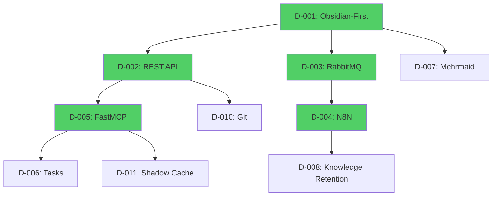

# Weave-NN Decision Hub

**Purpose**: Canonical index of all key decisions for the Weave-NN project (Obsidian-first approach)
**Last Updated**: 2025-10-21
**Post-Pivot Status**: Obsidian-native MVP, no custom web UI

---

## 📊 Decision Status Summary

**Decisions Made**: 16 / 16 (100% for MVP)
**Status**: Ready for Phase 5 implementation
**Approach**: Obsidian-first (web version deferred to future)

---

## ✅ Core Decisions Made (Obsidian-First Pivot)

### Executive Decisions

#### D-001: Project Approach - DECIDED ✅
**Decision**: Start with Obsidian-native implementation (2-week MVP)
**Date**: 2025-10-21
**Rationale**:
- Validates knowledge graph value immediately
- Leverages existing Obsidian ecosystem
- Reduces MVP timeline from 2-6 months → 2 weeks
- Web UI can be built later if validated

**Status**: ✅ **DECIDED** - Proceed with Obsidian-first
**Reference**: [[../.archive/_planning/decision-reanalysis-obsidian-first|Decision Reanalysis Document]]

---

#### D-002: Primary Integration Method - DECIDED ✅
**Decision**: Obsidian Local REST API plugin (not file system or URI)
**Date**: 2025-10-21
**Rationale**:
- ✅ Synchronous responses (success/error handling)
- ✅ Secure (API key, HTTPS)
- ✅ No file conflicts (Obsidian handles writes)
- ✅ Cross-platform (HTTP works everywhere)

**Status**: ✅ **DECIDED**
**Reference**: [[../architecture/obsidian-native-integration-analysis|Obsidian Native Integration Analysis]]

---

#### D-003: Event-Driven Architecture - DECIDED ✅
**Decision**: RabbitMQ message queue for event bus
**Date**: 2025-10-21
**Rationale**:
- **Multi-client production system** (not single-user)
- Async processing for 10+ concurrent client projects
- Guaranteed delivery (messages persist through failures)
- Dead letter queue for error handling
- Scales to 1000+ clients in production

**Status**: ✅ **DECIDED** - CRITICAL for production
**Reference**: [[../features/rabbitmq-message-queue|RabbitMQ Feature Doc]]

---

#### D-004: Workflow Automation Platform - DECIDED ✅
**Decision**: N8N workflow automation (Docker deployment)
**Date**: 2025-10-21
**Rationale**:
- Enables **non-technical team members** to create workflows
- 150+ integrations (Slack, GitHub, etc.)
- Visual workflow builder
- Official MCP support (Feb-Apr 2025)
- 5 core workflows for MVP

**Status**: ✅ **DECIDED** - CRITICAL for team adoption
**Reference**: [[../features/n8n-workflow-automation|N8N Feature Doc]]

---

#### D-005: MCP Server Framework - DECIDED ✅
**Decision**: FastMCP (not raw MCP SDK)
**Date**: 2025-10-21
**Rationale**:
- 60-70% less code (decorators vs manual schema)
- Automatic schema generation from type hints
- Built-in testing framework (<1s per test)
- Enterprise-grade auth and error handling
- Claude Desktop integration via CLI

**Status**: ✅ **DECIDED**
**Reference**: [[../_planning/research/fastmcp-research-findings|FastMCP Research]]

---

#### D-006: Task Management - DECIDED ✅
**Decision**: obsidian-tasks plugin (not custom todo system)
**Date**: 2025-10-21
**Rationale**:
- Native Obsidian integration
- Markdown checkbox syntax (`- [ ]`)
- Query language for task views
- Metadata support (due dates, priorities)
- No custom development needed

**Status**: ✅ **DECIDED**
**Reference**: [[../features/obsidian-tasks-integration|Obsidian Tasks Feature]]

---

#### D-007: Visualization Approach - DECIDED ✅
**Decision**: Mehrmaid plugin for knowledge graphs
**Date**: 2025-10-21
**Rationale**:
- Mermaid.js + Obsidian wikilinks integration
- Clickable nodes in diagrams
- Graph coloring via CSS classes
- Auto-generation deferred to post-MVP improvement

**Status**: ✅ **DECIDED**
**Reference**: [[../_planning/research/obsidian-groups-icons-research|Obsidian Visualization Research]]

---

#### D-008: Knowledge Retention Strategy - DECIDED ✅
**Decision**: Automated cross-project pattern extraction
**Date**: 2025-10-21
**Rationale**:
- Extract patterns on project closure (N8N workflow)
- Claude API for pattern analysis
- Reusable knowledge base structure
- Compound learning effect (50% faster by 10th project)

**Status**: ✅ **DECIDED**
**Reference**: [[../architecture/cross-project-knowledge-retention|Knowledge Retention Architecture]]

---

#### D-009: Agent Framework - DECIDED ✅
**Decision**: Claude-Flow v2.7 for agent orchestration
**Date**: 2025-10-21
**Rationale**:
- 8 concurrent workers
- Rule-based agent system
- Memory integration with Obsidian
- 6 agent rules for MVP

**Status**: ✅ **DECIDED**
**Reference**: Agent rules in `infrastructure/salt/files/claude-flow-rules/`

---

#### D-010: Git Integration - DECIDED ✅
**Decision**: Auto-commit on file changes with debouncing
**Date**: 2025-10-21
**Rationale**:
- Automatic version control
- Debouncing (5 seconds) to batch rapid edits
- Workspace watcher for closed-pane commits
- Pre-commit validation

**Status**: ✅ **DECIDED**
**Reference**: [[../features/git-integration|Git Integration Feature]]

---

#### D-011: Shadow Cache - DECIDED ✅
**Decision**: SQLite cache for metadata queries
**Date**: 2025-10-21
**Rationale**:
- Sub-100ms queries (vs file system parsing)
- Tag and link relationship storage
- Synced via RabbitMQ events
- Enables fast semantic search

**Status**: ✅ **DECIDED**
**Reference**: [[../_planning/phases/phase-5-mvp-week-1|Phase 5 Plan - Day 3]]

---

#### D-012: Semantic Search - DECIDED ✅
**Decision**: Include in MVP (will have 1000s of nodes quickly)
**Date**: 2025-10-21
**Rationale**:
- **User correction**: "We will have 1000's quickly"
- Critical for cross-project capabilities
- OpenAI embeddings + vector search

**Status**: ✅ **DECIDED** - KEEP IN MVP
**Reference**: User feedback in planning review

---

#### D-013: GitHub Bidirectional Sync - DECIDED ✅
**Decision**: Remove from MVP, defer to v1.1
**Date**: 2025-10-21
**Rationale**:
- Not needed for 2-week MVP validation
- Git integration sufficient for version control
- Can add later if validated

**Status**: ✅ **DECIDED** - REMOVE FROM MVP
**Reference**: Planning review user approval

---

#### D-014: Database Technology - DECIDED ✅
**Decision**: SQLite for shadow cache (not PostgreSQL)
**Date**: 2025-10-21
**Rationale**:
- Simpler deployment
- Sufficient for metadata queries
- File-based (no separate DB server)
- Can migrate to Postgres later if needed

**Status**: ✅ **DECIDED**

---

#### D-015: Deployment Model - DECIDED ✅
**Decision**: Two deployment options (local OR GCP)
**Date**: 2025-10-21
**Budget**:
- **Local**: $60/month (APIs only)
- **Production (GCP)**: $110/month (VM + APIs)

**Status**: ✅ **DECIDED**
**Reference**: [[../_planning/MASTER-PLAN|Master Plan - Budget Section]]

---

#### D-016: Obsidian Properties Strategy - DECIDED ✅
**Decision**: Bulk property application via Python script
**Date**: 2025-10-21
**Approach**:
- Icon assignment (Lucide icons, 1,600+ options)
- CSS classes for graph coloring
- Tag taxonomy (type/, scope/, status/, priority/)
- Bulk update script with Obsidian REST API

**Status**: ✅ **DECIDED**
**Reference**: [[../_planning/research/obsidian-groups-icons-research|Properties Research]]

---

## 🚫 Deferred Decisions (Post-MVP)

### D-101: Custom Web UI - DEFERRED
**Status**: Deferred to post-MVP (v1.1+)
**Rationale**: Obsidian validates value first, web UI only if needed
**Reference**: [[../.archive/MASTER-PLAN-WEB-VERSION|Archived Web Version Plan]]

---

### D-102: Mehrmaid Auto-Generation - DEFERRED
**Status**: Deferred to improvement phase
**Rationale**: Manual graph creation sufficient for MVP
**Reference**: Planning review

---

### D-103: GitHub Issues Integration - DEFERRED
**Status**: Deferred to v1.1
**Rationale**: Not needed for initial validation
**Reference**: [[../features/github-issues-integration|GitHub Issues Feature (F-013)]]

---

## 📚 Decision Documentation References

### Active Documents
- [[../_planning/MASTER-PLAN|Master Plan]] - Complete project roadmap
- [[../architecture/obsidian-native-integration-analysis|Obsidian Integration Architecture]]
- [[../architecture/cross-project-knowledge-retention|Knowledge Retention Architecture]]
- [[../_planning/phases/phase-5-mvp-week-1|Phase 5 Plan]] - Week 1 implementation
- [[../_planning/phases/phase-6-mvp-week-2|Phase 6 Plan]] - Week 2 implementation

### Archived Decision Reviews
- [[../.archive/_planning/decision-review-2025-10-20|Decision Review 2025-10-20]] (23 decisions analyzed)
- [[../.archive/_planning/decision-reanalysis-obsidian-first|Decision Reanalysis - Obsidian First]] (16 decisions)
- [[../.archive/DECISIONS|User Decision Questionnaire]] (User filled out)

### Research Documents
- [[../_planning/research/fastmcp-research-findings|FastMCP Framework Research]]
- [[../_planning/research/n8n-mcp-integration-research|N8N MCP Integration Research]]
- [[../_planning/research/obsidian-groups-icons-research|Obsidian Properties Research]]

---

## 🎯 Decision Impact on MVP Timeline

All core decisions are now **DECIDED ✅**, enabling immediate start of Phase 5 implementation.

### Decision Flow

---

## 🔗 Related Documents

- [[../INDEX|Main Knowledge Graph Index]]
- [[../_planning/tasks|Task Hub]] - All 128 implementation tasks
- [[../_planning/PLANNING-REVIEW-2025-10-21|Planning Review]] - Comprehensive audit results
- [[KNOWLEDGE-GRAPH-MAP|Knowledge Graph Structure]]

---

**Status**: All MVP decisions finalized ✅
**Next Step**: Begin Phase 5 implementation (Day 0 setup)
**Last Updated**: 2025-10-21
