# Weave-NN Knowledge Graph Index

**Project**: AI-Powered Knowledge Graph for Managing AI-Generated Markdown
**Status**: Planning & Architecture Phase
**Last Updated**: 2025-10-20

---

## 🎯 Project Overview

[[concepts/weave-nn|Weave-NN]] is a custom-built SaaS platform for transforming AI-generated markdown chaos into an intelligent, searchable, and collaborative knowledge graph.

**Core Value**: Built for AI-human collaboration, not retrofitted from traditional note-taking tools.

---

## 📊 Decision Status Dashboard

**Overall Progress**: 1.5 / 23 decisions made (6%)
**Critical Path Blockers**: 8 decisions

### Executive Decisions (1/4 decided)
- ✅ [[decisions/executive/project-scope|ED-1: Project Scope]] - **DECIDED**: SaaS on Google Cloud
- ❌ [[decisions/executive/development-approach|ED-2: Development Approach]] - **CRITICAL**
- ⚠️  [[decisions/executive/target-users|ED-3: Target Users]] - Partially answered, needs prioritization
- ❌ [[decisions/executive/budget-resources|ED-4: Budget & Resources]] - **BLOCKS** timeline

### Technical Decisions (3/9 decided)
- ❌ [[decisions/technical/frontend-framework|TS-1: Frontend Framework]] - **BLOCKS** TS-2, TS-5
- ❌ [[decisions/technical/graph-visualization|TS-2: Graph Visualization]] - **BLOCKS** MVP
- ❌ [[decisions/technical/backend-architecture|TS-3: Backend Architecture]] - **BLOCKS** setup
- ⚠️  [[decisions/technical/database-storage|TS-4: Database & Storage]] - Partially decided
- ❌ [[decisions/technical/markdown-editor|TS-5: Markdown Editor]] - **BLOCKS** MVP
- ❌ [[decisions/technical/auth|TS-6: Authentication]] - Can defer to post-MVP
- ✅ [[decisions/technical/day-2-rest-api-client|D-017: REST API Client]] - **IMPLEMENTED**: Singleton pattern
- ✅ [[decisions/technical/day-4-agent-rules|D-018: Agent Rules]] - **IMPLEMENTED**: Event-driven
- ✅ [[decisions/technical/day-11-properties-visualization|D-019: Properties & Visualization]] - **IMPLEMENTED**: Hybrid strategy

### Feature Decisions (0/3 decided)
- ❌ [[decisions/features/mvp-features|FP-1: MVP Feature Set]] - **CRITICAL**
- ❌ [[decisions/features/ai-integration|FP-2: AI Integration Priority]] - **CRITICAL**
- ❌ [[decisions/features/collaboration|FP-3: Collaboration Features]] - Medium priority

### Business Decisions (0/2 decided)
- ❌ [[decisions/business/monetization|BM-1: Monetization Strategy]] - Post-MVP
- ❌ [[decisions/business/open-source|BM-2: Open Source Strategy]] - Medium priority

### Integration Decisions (0/3 decided)
- ❌ [[decisions/integrations/obsidian|IR-1: Obsidian Integration]] - **BLOCKS** architecture
- ❌ [[decisions/integrations/git|IR-2: Git Integration]] - **BLOCKS** storage design
- ❌ [[decisions/integrations/other-tools|IR-3: Other Tools]] - Post-MVP

---

## 🔗 Knowledge Graph Structure

### Core Concepts
- [[concepts/knowledge-graph|Knowledge Graph]]
- [[concepts/wikilinks|Wikilinks]]
- [[concepts/bidirectional-linking|Bidirectional Linking]]
- [[concepts/ai-generated-documentation|AI-Generated Documentation]]
- [[concepts/temporal-queries|Temporal Queries]]
- [[concepts/weave-nn|Weave-NN Project Identity]]

### Platform Options Analysis
- [[platforms/obsidian|Obsidian]] - Local-first option
- [[platforms/notion|Notion]] - Cloud collaboration option
- [[platforms/custom-solution|Custom Solution]] - **CHOSEN PATH**: Build custom SaaS

### Technology Stack (Under Decision)
- **Frontend**: [[technical/react-stack|React Stack]] vs [[technical/svelte-stack|Svelte Stack]]
- **Graph**: [[technical/react-flow|React Flow]] vs [[technical/svelte-flow|Svelte Flow]]
- **Editor**: [[technical/tiptap-editor|Tiptap Editor]]
- **Backend**: [[technical/nodejs-backend|Node.js]] vs [[technical/fastapi-backend|FastAPI]]
- **Database**: [[technical/postgresql|PostgreSQL]] + [[technical/graphiti|Graphiti]]
- **Vector Search**: [[technical/pgvector|pgvector]] vs [[technical/pinecone|Pinecone]]
- **BaaS**: [[technical/supabase|Supabase]]

### MCP Integration
- [[mcp/model-context-protocol|Model Context Protocol (MCP)]]
- [[mcp/servers/cyanheads-obsidian-mcp-server|Cyanheads Obsidian MCP Server]]
- [[mcp/servers/jacksteamdev-obsidian-mcp-tools|Jacksteamdev MCP Tools]]
- [[mcp/tools/read_note|read_note Tool]]
- [[mcp/tools/update_note|update_note Tool]]
- [[mcp/tools/manage_frontmatter|manage_frontmatter Tool]]
- [[mcp/tools/manage_tags|manage_tags Tool]]

### Architecture Components
- [[architecture/frontend-layer|Frontend Layer]]
- [[architecture/api-layer|API Layer]]
- [[architecture/data-knowledge-layer|Data/Knowledge Layer]]
- [[architecture/ai-integration-layer|AI Integration Layer]]
- [[architecture/hybrid-approach|Hybrid Approach Strategy]]

### Implementation Phases
- [[implementation/phases/phase-1-obsidian-foundation|Phase 1: Obsidian Foundation (Week 1-2)]]
- [[implementation/phases/phase-2-knowledge-graph-enhancement|Phase 2: Knowledge Graph Enhancement (Week 3-4)]]
- [[implementation/phases/phase-3-advanced-automation|Phase 3: Advanced Automation (Week 5-6)]]
- [[implementation/phases/phase-4-notion-integration|Phase 4: Notion Integration (Week 7+)]]
- [[implementation/phases/phase-1-core-mvp|Phase 1 (Custom): Core MVP (Week 1-6)]]
- [[implementation/phases/phase-2-ai-integration|Phase 2 (Custom): AI Integration (Week 7-10)]]
- [[implementation/phases/phase-3-advanced-features|Phase 3 (Custom): Advanced Features (Week 11-14)]]

### Features
- [[features/knowledge-graph-visualization|Knowledge Graph Visualization]]
- [[features/markdown-editor-component|Markdown Editor Component]]
- [[features/ai-integration-component|AI Integration Component]]
- [[features/temporal-knowledge-graph|Temporal Knowledge Graph]]
- [[features/auto-linking|Auto-Linking & Suggestions]]
- [[features/collaborative-editing|Collaborative Editing]]
- [[features/daily-notes|Daily Notes]]
- [[features/task-management|Task Management]]

### Workflows
- [[workflows/daily-notes-workflow|Daily Notes Workflow]]
- [[workflows/curation-workflows|Curation Workflows]]
- [[workflows/change-detection|Change Detection]]
- [[workflows/version-control-integration|Version Control Integration]]

### Business Model
- [[business/saas-pricing-model|SaaS Pricing Model]]
- [[business/target-users|Target Users]]
- [[business/value-proposition|Value Proposition]]
- [[business/differentiation-strategy|Differentiation Strategy]]
- [[business/cost-analysis|Cost Analysis]]

---

## 🚨 Critical Path Analysis

```mermaid
graph TD
    ED1[✅ ED-1: Project Scope<br/>SaaS Decision] --> TS1[❌ TS-1: Frontend Framework<br/>React vs Svelte]
    ED1 --> TS3[❌ TS-3: Backend Architecture]
    TS1 --> TS2[❌ TS-2: Graph Visualization<br/>BLOCKS MVP]
    TS1 --> TS5[❌ TS-5: Markdown Editor<br/>BLOCKS MVP]
    TS2 --> FP1[❌ FP-1: MVP Features]
    TS5 --> FP1
    TS3 --> TS4[⚠️ TS-4: Database & Storage]
    TS4 --> FP2[❌ FP-2: AI Integration Priority]
    FP1 --> TR1[❌ TR-1: Timeline]
    FP2 --> TR1

    style ED1 fill:#90EE90
    style TS2 fill:#FFB6C6
    style TS5 fill:#FFB6C6
    style FP1 fill:#FFB6C6
```

---

## ❓ Open Questions Requiring Immediate Research

### Technical Questions
- [[decisions/open-questions/Q-TECH-001|Q-TECH-001]]: React Flow vs Svelte Flow performance at 10k+ nodes?
- [[decisions/open-questions/Q-TECH-002|Q-TECH-002]]: How to integrate Graphiti temporal knowledge graphs?
- [[decisions/open-questions/Q-TECH-003|Q-TECH-003]]: Which markdown editor provides best AI integration?
- [[decisions/open-questions/Q-TECH-004|Q-TECH-004]]: pgvector vs Pinecone for vector search?
- [[decisions/open-questions/Q-TECH-005|Q-TECH-005]]: How to handle real-time markdown collaboration conflicts?

### Business/Product Questions
- [[decisions/open-questions/Q-BIZ-001|Q-BIZ-001]]: What is target pricing for SaaS tiers?
- [[decisions/open-questions/Q-BIZ-002|Q-BIZ-002]]: Which collaboration features are table stakes vs premium?
- [[decisions/open-questions/Q-BIZ-003|Q-BIZ-003]]: Target individuals or teams first?

### Integration Questions
- [[decisions/open-questions/Q-INT-001|Q-INT-001]]: Bidirectional Obsidian sync or one-way import?
- [[decisions/open-questions/Q-INT-002|Q-INT-002]]: Which MCP tools to expose for AI agents?

---

## 📅 Next 3 Decisions Needed (In Order)

1. **TS-1: Frontend Framework** (React vs Svelte)
   - **Why**: Blocks 4 other decisions including TS-2 and TS-5
   - **Options**: React (ecosystem) vs Svelte (speed)
   - **Recommended Action**: Prototype both with sample graph + editor

2. **TS-2: Graph Visualization Library**
   - **Why**: Core MVP feature, blocks feature prioritization
   - **Options**: React Flow vs Svelte Flow (depends on TS-1)
   - **Recommended Action**: Performance benchmark with 10k nodes

3. **FP-1: MVP Feature Prioritization**
   - **Why**: Defines scope and timeline
   - **Options**: All features listed need ranking [1] MVP, [2] v1.1, [3] v2.0
   - **Recommended Action**: Fill out priority matrix in DECISIONS.md

---

## 📚 Analysis Documents

### Original Monolithic Documents (Being Replaced)
- ~~[[platform-analysis]]~~ → Split into atomic nodes in `/platforms`, `/mcp`, `/concepts`
- ~~[[custom-solution-analysis]]~~ → Split into atomic nodes in `/technical`, `/features`, `/architecture`
- [[DECISIONS]] → Restructured into `/decisions/*` with metadata

### New Decision Hub
- [[decisions/INDEX|Decision Hub]] - Central tracking for all decisions

### Research Documents
- [[architecture-analysis]] - Comprehensive analysis of Day 2, 4, 11 architectures (93KB)
- [[day-2-4-11-research-findings]] - Research findings with Python code examples (1,655 lines)

### Implementation Documentation
- [[IMPLEMENTATION_SUMMARY]] - Complete implementation summary for Day 2, 4, 11 (1,777 lines of code)

---

## 🎯 Project Goals

1. **Transform** large monolithic markdown docs into atomic, interconnected nodes
2. **Enable** AI agents to contribute to knowledge graph via MCP
3. **Provide** temporal queries (point-in-time knowledge states)
4. **Build** collaborative knowledge graph platform (internal → SaaS)
5. **Support** weavelogic team and client project documentation

---

## 🔍 Quick Navigation

- **Making Decisions**: Start at [[decisions/INDEX]]
- **Understanding Platforms**: See [[platforms/comparison]]
- **Technical Architecture**: Explore [[architecture/frontend-layer]]
- **Implementation Plan**: Review [[implementation/phases/phase-1-obsidian-foundation]]
- **Business Model**: Read [[business/value-proposition]]

---

## 📝 Recent Changes

| Date | Change | Updated By |
|------|--------|------------|
| 2025-10-22 | Implemented Day 2, 4, 11 MVP features (1,777 lines) | Claude (Coder Agent) |
| 2025-10-22 | Created 3 technical decision nodes (D-017, D-018, D-019) | Claude |
| 2025-10-22 | Integrated architecture analysis and research docs | Claude |
| 2025-10-22 | Created daily log for 2025-10-22 | Claude |
| 2025-10-22 | Created MVP Week 1 checklist | Claude |
| 2025-10-20 | Knowledge graph restructuring initiated | Claude (Hive Mind) |
| 2025-10-20 | Decided on SaaS approach (ED-1) | Mathew |
| 2025-10-20 | Created INDEX and decision hub | Claude |

---

**Legend**:
- ✅ = Decided/Complete
- ❌ = Open/Not Started
- ⚠️ = Partially Answered/In Progress
- 🚨 = Critical Path Blocker
