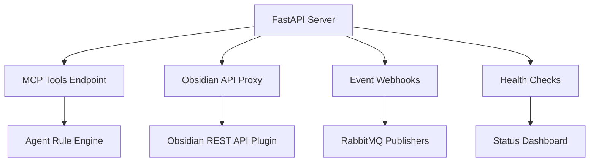

# FastAPI

## Overview

Modern Python web framework for building high-performance APIs with automatic OpenAPI documentation, async support, and runtime type validation. Powers the Weave-NN MCP server.

## Category

**Framework / Backend Web Framework**

## Why We Use It

**Primary reasons**:
1. **Async/await native** - Handles concurrent MCP requests efficiently
2. **Type hints validation** - Pydantic models prevent runtime errors
3. **Automatic OpenAPI docs** - Built-in `/docs` and `/redoc` endpoints
4. **Fast performance** - Built on Starlette (ASGI) and Pydantic
5. **MCP SDK compatibility** - Works seamlessly with FastMCP library

**Specific to Weave-NN MCP Server**:
- RESTful MCP endpoints (`/mcp/tools`, `/mcp/execute`)
- Health check endpoints (`/health`, `/status`)
- Obsidian API proxy (forwards requests to Obsidian REST API)
- Agent rule execution endpoints
- Event webhook receivers

## Key Capabilities

### Core Features
- **ASGI async server** - Non-blocking I/O for concurrent requests
- **Dependency injection** - Clean separation of concerns
- **Request validation** - Automatic Pydantic model validation
- **Response serialization** - JSON encoding with type hints
- **Middleware support** - CORS, authentication, logging
- **WebSocket support** - Real-time updates (future use)

### Developer Experience
- **Automatic OpenAPI schema** - No manual API docs needed
- **Interactive API testing** - Swagger UI at `/docs`
- **Type safety** - IDE autocomplete and error detection
- **Easy testing** - TestClient for unit/integration tests

## Integration Points



**Integration with**:
- [[mcp-protocol]] - Model Context Protocol implementation
- [[obsidian-local-rest-api-plugin]] - Proxy to Obsidian vault
- [[pika-rabbitmq-client]] - Event publishing
- [[sqlite]] - Shadow cache queries
- [[uvicorn]] - ASGI server runtime

## Configuration

### Basic Server Setup (Phase 5, Day 2)

```python
# weave-nn-mcp/server/main.py
from fastapi import FastAPI
from fastapi.middleware.cors import CORSMiddleware
import uvicorn

app = FastAPI(
    title="Weave-NN MCP Server",
    description="Model Context Protocol server for AI-managed knowledge graphs",
    version="0.1.0",
    docs_url="/docs",
    redoc_url="/redoc"
)

# CORS middleware (for Obsidian plugin communication)
app.add_middleware(
    CORSMiddleware,
    allow_origins=["https://localhost:27124"],  # Obsidian REST API
    allow_credentials=True,
    allow_methods=["*"],
    allow_headers=["*"],
)

@app.get("/health")
async def health_check():
    return {"status": "healthy", "service": "weave-nn-mcp"}

if __name__ == "__main__":
    uvicorn.run(
        "main:app",
        host="0.0.0.0",
        port=8000,
        reload=True,  # Dev mode only
        log_level="info"
    )
```

### MCP Tools Endpoint (Phase 5, Day 3)

```python
# weave-nn-mcp/server/mcp_routes.py
from fastapi import APIRouter, HTTPException
from pydantic import BaseModel
from typing import Dict, Any

router = APIRouter(prefix="/mcp", tags=["MCP"])

class ToolExecuteRequest(BaseModel):
    tool_name: str
    parameters: Dict[str, Any]

@router.post("/tools/execute")
async def execute_mcp_tool(request: ToolExecuteRequest):
    """Execute an MCP tool with parameters"""
    tool_name = request.tool_name
    params = request.parameters

    # Route to appropriate handler
    if tool_name == "create_node":
        return await create_node_handler(params)
    elif tool_name == "link_nodes":
        return await link_nodes_handler(params)
    else:
        raise HTTPException(status_code=404, detail=f"Tool {tool_name} not found")

@router.get("/tools/list")
async def list_mcp_tools():
    """List all available MCP tools"""
    return {
        "tools": [
            {"name": "create_node", "description": "Create new knowledge graph node"},
            {"name": "link_nodes", "description": "Create wikilink between nodes"},
            {"name": "query_graph", "description": "Search knowledge graph"},
        ]
    }
```

### Obsidian API Proxy (Phase 5, Day 4)

```python
# weave-nn-mcp/server/obsidian_routes.py
from fastapi import APIRouter, HTTPException
import httpx
import os

router = APIRouter(prefix="/obsidian", tags=["Obsidian"])

OBSIDIAN_API_URL = os.getenv("OBSIDIAN_API_URL", "https://localhost:27124")
OBSIDIAN_API_KEY = os.getenv("OBSIDIAN_API_KEY")

@router.get("/vault/{path:path}")
async def proxy_obsidian_get(path: str):
    """Proxy GET requests to Obsidian REST API"""
    async with httpx.AsyncClient(verify=False) as client:
        response = await client.get(
            f"{OBSIDIAN_API_URL}/{path}",
            headers={"Authorization": f"Bearer {OBSIDIAN_API_KEY}"}
        )
        return response.json()

@router.post("/vault/{path:path}")
async def proxy_obsidian_post(path: str, body: dict):
    """Proxy POST requests to Obsidian REST API"""
    async with httpx.AsyncClient(verify=False) as client:
        response = await client.post(
            f"{OBSIDIAN_API_URL}/{path}",
            json=body,
            headers={"Authorization": f"Bearer {OBSIDIAN_API_KEY}"}
        )
        return response.json()
```

### Environment Configuration

```bash
# weave-nn-mcp/.env
FASTAPI_HOST=0.0.0.0
FASTAPI_PORT=8000
FASTAPI_RELOAD=true  # Dev mode
FASTAPI_LOG_LEVEL=info

# Obsidian integration
OBSIDIAN_API_URL=https://localhost:27124
OBSIDIAN_API_KEY=your-api-key-here

# CORS origins (comma-separated)
CORS_ORIGINS=https://localhost:27124,http://localhost:5173
```

### Development Server

```bash
# Start server with auto-reload
cd /home/aepod/dev/weave-nn/weave-nn/weave-nn-mcp
source ../.venv/bin/activate
uvicorn server.main:app --reload --host 0.0.0.0 --port 8000

# Access interactive docs
open http://localhost:8000/docs
```

## Alternatives Considered

### Flask
- **Pro**: Simpler, more mature, larger ecosystem
- **Con**: Sync-only (requires threading for concurrency), no automatic OpenAPI
- **Verdict**: Rejected - Async support critical for MCP server

### Django REST Framework
- **Pro**: Full-featured, excellent ORM, admin interface
- **Con**: Overkill for MVP (no database initially), slower than FastAPI
- **Verdict**: Rejected - Too heavy for simple API server

### Starlette (Direct)
- **Pro**: Minimal, extremely fast
- **Con**: No request validation, no automatic docs, more boilerplate
- **Verdict**: Rejected - FastAPI builds on Starlette with better DX

### Express.js (Node.js)
- **Pro**: JavaScript full-stack, huge ecosystem
- **Con**: Python MCP SDK more mature, type safety weaker
- **Verdict**: Rejected - Python better for AI/ML integrations

## Decision Reference

**[[phase-4a-decision-closure]]** - Decision TS-3: Backend Architecture
> "TS-3: Backend Architecture → Python FastAPI + MCP ✅"

**[[phase-5-claude-flow-integration]]** - MCP Server Implementation
> "Day 2: Build FastAPI MCP Server with 5 core endpoints"

**Rationale**: FastAPI's combination of async performance, automatic validation, and OpenAPI documentation made it ideal for rapid MCP server development. The async capabilities are critical for handling concurrent file events, RabbitMQ messages, and Obsidian API calls.

## Learning Resources

### Official Documentation
- FastAPI Docs: https://fastapi.tiangolo.com/
- Tutorial: https://fastapi.tiangolo.com/tutorial/
- Advanced User Guide: https://fastapi.tiangolo.com/advanced/
- Deployment Guide: https://fastapi.tiangolo.com/deployment/

### Key Concepts
- Async Programming: https://fastapi.tiangolo.com/async/
- Dependency Injection: https://fastapi.tiangolo.com/tutorial/dependencies/
- Pydantic Models: https://docs.pydantic.dev/latest/
- Testing FastAPI: https://fastapi.tiangolo.com/tutorial/testing/

### Performance & Production
- Uvicorn Documentation: https://www.uvicorn.org/
- ASGI Specification: https://asgi.readthedocs.io/
- FastAPI Best Practices: https://github.com/zhanymkanov/fastapi-best-practices

## Phase Usage

### Phase 5: Claude-Flow MCP Integration
- **Day 2**: FastAPI server scaffold with health checks
- **Day 3**: MCP tools endpoints (`/mcp/tools/*`)
- **Day 4**: Obsidian API proxy endpoints
- **Day 5**: Event webhook receivers

### Phase 6: MVP Week 1 - Backend Infrastructure
- Agent rule execution endpoints
- Shadow cache query endpoints
- File operation endpoints
- Status dashboard endpoints

### Phase 7: MVP Week 2 - Automation & Deployment
- Production configuration (no reload, proper logging)
- Docker containerization
- Integration tests with TestClient
- OpenAPI schema export for client generation

## Testing

### Unit Testing with TestClient

```python
# tests/test_mcp_server.py
from fastapi.testclient import TestClient
from server.main import app

client = TestClient(app)

def test_health_check():
    response = client.get("/health")
    assert response.status_code == 200
    assert response.json() == {"status": "healthy", "service": "weave-nn-mcp"}

def test_list_mcp_tools():
    response = client.get("/mcp/tools/list")
    assert response.status_code == 200
    assert len(response.json()["tools"]) > 0
```

### Integration Testing

```python
# tests/test_obsidian_integration.py
import pytest
from fastapi.testclient import TestClient
from server.main import app

@pytest.mark.asyncio
async def test_obsidian_proxy():
    client = TestClient(app)
    response = client.get("/obsidian/vault/README.md")
    assert response.status_code == 200
    assert "content" in response.json()
```

## Performance Characteristics

- **Throughput**: 20,000+ req/sec (simple endpoints)
- **Latency**: <10ms p99 for health checks
- **Concurrency**: 1000+ concurrent connections (uvicorn workers)
- **Memory**: ~50MB base footprint

**For Weave-NN MVP**:
- Expected load: <100 req/min (single user)
- Performance is NOT a bottleneck
- Focus: Developer experience and reliability

## Migration Path

**Current (MVP)**: FastAPI 0.104 with basic endpoints
**Future (v1.0)**: Add WebSocket endpoints for real-time updates
**Future (v2.0)**: GraphQL API for complex queries (Strawberry GraphQL)

## Notes

- **OpenAPI docs are auto-generated** - No manual Swagger editing needed
- **Pydantic models prevent runtime errors** - Validation happens before handlers
- **TestClient is synchronous** - But tests async endpoints correctly
- **CORS must be configured** - Obsidian plugin runs on different origin
- **Use async handlers by default** - Even if not doing I/O (consistency)
