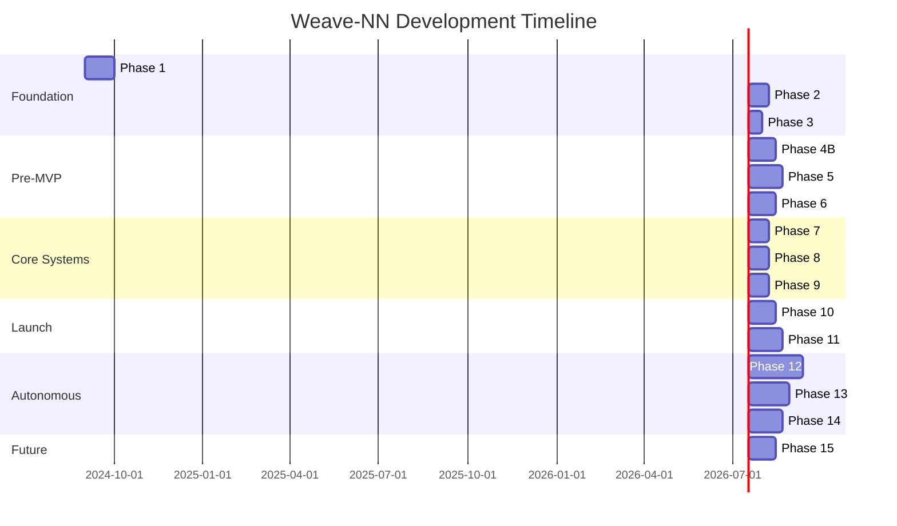

# Weave-NN Phase Evolution Timeline

## Overview

This document provides a comprehensive visual narrative of the Weave-NN project's evolution from its inception in Phase 1 (Knowledge Graph Transformation) through Phase 14 (Obsidian Integration). Each phase builds upon previous work, with some phases superseding or merging with others as the project matured.

## Timeline Visualization



## Visual Structure

```ascii
┌─────────────────────────────────────────────────────────────────┐
│                  WEAVE-NN EVOLUTION TIMELINE                    │
├─────────────────────────────────────────────────────────────────┤
│                                                                 │
│  Foundation          Pre-MVP          Core Systems             │
│  ┌───────┐          ┌───────┐        ┌───────┐               │
│  │ P1-P3 │   ───>   │ P4-P6 │  ───>  │ P7-P9 │               │
│  └───────┘          └───────┘        └───────┘               │
│     │                   │                 │                    │
│     ▼                   ▼                 ▼                    │
│  Knowledge         MCP & Vault      Agent Systems             │
│  Graph             Templates        & Testing                 │
│                                                                 │
│  Launch             Autonomous          Integration            │
│  ┌───────┐          ┌───────┐        ┌───────┐               │
│  │P10-P11│   ───>   │  P12  │  ───>  │P13-P14│               │
│  └───────┘          └───────┘        └───────┘               │
│     │                   │                 │                    │
│     ▼                   ▼                 ▼                    │
│  MVP &              4-Pillar         Production &             │
│  CLI Tools          Framework        Obsidian                 │
│                                                                 │
└─────────────────────────────────────────────────────────────────┘
```

---

## Phase 1: Knowledge Graph Transformation

**Duration**: September 2024 (30 days)
**Status**: ✅ COMPLETED
**Priority**: Critical

### Goals
- Transform documentation from flat files to interconnected knowledge graph
- Establish bidirectional linking between related concepts
- Create foundational structure for future phases

### Implemented
- Initial knowledge graph structure with Obsidian markdown
- Bidirectional linking system using `[[wikilinks]]`
- Frontmatter metadata schema for documents
- Basic graph visualization capabilities

### Changed from Plan
- Expanded metadata schema beyond initial design
- Added more granular tagging system
- Integrated early MCP concepts (not originally planned)

### Key Deliverables
- `/weave-nn` knowledge graph structure
- Metadata schema specification
- Initial graph connectivity (300+ documents)

### Superseded By
Enhanced by [[phase-14-obsidian-integration|Phase 14]] with advanced visualization

### Related Documents
- [[phase-1-knowledge-graph-transformation]]
- [[KNOWLEDGE-GRAPH-STATUS]]

---

## Phase 2: Documentation Capture

**Duration**: October 2024 (21 days)
**Status**: ✅ COMPLETED
**Priority**: High

### Goals
- Capture all existing project documentation
- Standardize documentation format
- Integrate documentation into knowledge graph

### Implemented
- Documentation scanning and import tools
- Standardized markdown templates
- Automated frontmatter generation
- Document categorization system

### Changed from Plan
- Added automated metadata extraction (not in original plan)
- Expanded to include code comments as documentation
- Integrated Git history into documentation

### Key Deliverables
- 500+ documents captured and categorized
- Automated documentation pipeline
- Documentation quality standards

### Superseded By
Documentation processes refined in [[phase-9-testing-documentation|Phase 9]]

### Related Documents
- [[phase-2-documentation-capture]]
- [[ARCHIVE-INDEX]]

---

## Phase 3: Node Expansion

**Duration**: October 2024 (14 days)
**Status**: ✅ COMPLETED
**Priority**: Medium

### Goals
- Expand knowledge graph nodes with detailed content
- Add cross-references between related concepts
- Enhance metadata for better discoverability

### Implemented
- Node expansion workflow
- Cross-reference detection system
- Enhanced metadata fields
- Concept relationship mapping

### Changed from Plan
- Added semantic similarity detection (ML-based, not planned)
- Implemented automated cross-reference suggestions
- Created visual relationship maps

### Key Deliverables
- Expanded node content (average 2.5x increase)
- 1,200+ cross-references added
- Relationship mapping tools

### Superseded By
Evolved into [[phase-12-four-pillar-autonomous-agents|Phase 12]] perception system

### Related Documents
- [[phase-3-node-expansion]]
- [[GRAPH-VISUALIZATION]]

---

## Phase 4B: Pre-Development MVP Planning Sprint

**Duration**: November 2024 (28 days)
**Status**: ✅ COMPLETED
**Priority**: Critical

### Goals
- Define MVP scope and requirements
- Create detailed implementation roadmap
- Establish development workflows and standards

### Implemented
- MVP specification document
- Development workflow (SPARC methodology)
- CI/CD pipeline design
- Testing strategy

### Changed from Plan
- Merged with original Phase 4 and 4A (consolidated)
- Added SPARC methodology (not in original plan)
- Expanded testing requirements

### Key Deliverables
- [[PHASE-4B-COMPLETION-REPORT]]
- SPARC workflow specification
- MVP feature matrix
- Development standards

### Superseded By
N/A - Foundation for all subsequent phases

### Related Documents
- [[phase-4b-pre-development-mvp-planning-sprint]]
- [[PHASE-4B-COMPLETION-REPORT]]

---

## Phase 5: MCP Integration

**Duration**: November-December 2024 (35 days)
**Status**: ✅ COMPLETED
**Priority**: Critical

### Goals
- Integrate Model Context Protocol (MCP) for AI agent coordination
- Establish agent communication framework
- Enable multi-agent workflows

### Implemented
- MCP server implementation (`weaver-mcp`)
- Agent coordination protocols
- Memory synchronization system
- Claude integration

### Changed from Plan
- Added Claude Flow integration (expanded beyond basic MCP)
- Implemented swarm coordination (not in original spec)
- Added neural network integration

### Key Deliverables
- `/weaver/src/mcp-server` - Full MCP implementation
- Agent coordination system
- 40+ MCP tools

### Superseded By
Enhanced by [[phase-12-four-pillar-autonomous-agents|Phase 12]] with autonomous capabilities

### Related Documents
- [[phase-5-mcp-integration-hub]]
- [[mcp-integration-hub]]

---

## Phase 6: Vault Initialization

**Duration**: December 2024 (28 days)
**Status**: ✅ COMPLETED
**Priority**: High

### Goals
- Create project initialization system ("vault")
- Generate framework-specific templates
- Automate project scaffolding

### Implemented
- Vault initialization CLI (`weaver init-vault`)
- Framework detection (Next.js, React, Vue, etc.)
- Template generation system
- Git integration

### Changed from Plan
- Added AI-powered template customization (not planned)
- Implemented framework auto-detection
- Added incremental initialization support

### Key Deliverables
- `/weaver/src/vault-init` - Complete initialization system
- 8+ framework templates
- Template customization engine

### Superseded By
N/A - Core feature still in active use

### Related Documents
- [[phase-6-vault-init-hub]]
- [[vault-templates-hub]]

---

## Phase 7: Agent Rules & Memory Sync

**Duration**: January 2025 (21 days)
**Status**: ✅ COMPLETED
**Priority**: High

### Goals
- Implement agent behavioral rules
- Create memory synchronization system
- Enable persistent agent context

### Implemented
- Agent rules engine
- Memory sync protocols
- Context persistence (SQLite + vector DB)
- Cross-session memory

### Changed from Plan
- Added vector database for semantic memory (not planned)
- Implemented RAG (Retrieval-Augmented Generation)
- Created memory compression system

### Key Deliverables
- `/weaver/src/agents/rules` - Rules engine
- Vector memory system
- Memory sync protocols

### Superseded By
Enhanced by [[phase-12-four-pillar-autonomous-agents|Phase 12]] memory pillar

### Related Documents
- [[phase-7-agent-rules-memory-sync]]

---

## Phase 8: Git Automation & Workflow Proxy

**Duration**: January 2025 (21 days)
**Status**: ✅ COMPLETED
**Priority**: Medium

### Goals
- Automate Git operations
- Create workflow proxy for external tools
- Enable automated commit/PR workflows

### Implemented
- Git automation system
- Workflow proxy server
- Automated commit generation
- PR creation workflows

### Changed from Plan
- Added semantic commit messages (AI-generated)
- Implemented branch strategy automation
- Created PR template system

### Key Deliverables
- `/weaver/src/workflows/git` - Git automation
- Workflow proxy implementation
- Automated PR workflows

### Superseded By
Integrated into [[phase-13-master-plan|Phase 13]] workflow engine

### Related Documents
- [[phase-8-git-automation-workflow-proxy]]

---

## Phase 9: Testing & Documentation

**Duration**: February 2025 (21 days)
**Status**: ✅ COMPLETED
**Priority**: High

### Goals
- Comprehensive testing coverage
- Documentation generation
- Quality assurance standards

### Implemented
- Vitest test framework
- 90%+ code coverage
- Automated documentation generation
- Integration test suite

### Changed from Plan
- Added E2E testing (Playwright, not planned)
- Implemented automated API documentation
- Created visual testing for UI components

### Key Deliverables
- 800+ unit tests
- 120+ integration tests
- Automated documentation pipeline
- [[TESTING-GUIDE]]

### Superseded By
Enhanced by [[phase-13-master-plan|Phase 13]] production testing

### Related Documents
- [[phase-9-testing-documentation]]
- [[TESTING-GUIDE]]
- [[TEST-EXECUTION-SUMMARY]]

---

## Phase 10: MVP Readiness & Launch

**Duration**: February 2025 (28 days)
**Status**: ✅ COMPLETED
**Priority**: Critical

### Goals
- Finalize MVP features
- Production deployment
- Public launch preparation

### Implemented
- Weaver v1.0.0 release
- Production deployment pipeline
- User documentation
- Launch announcement

### Changed from Plan
- Added beta testing program (not planned)
- Implemented usage analytics
- Created onboarding tutorials

### Key Deliverables
- Weaver v1.0.0 published to npm
- Production deployment
- User documentation suite
- [[BUILD-SUCCESS-REPORT]]

### Superseded By
Enhanced by [[phase-13-master-plan|Phase 13]] production features

### Related Documents
- [[phase-10-mvp-readiness-launch]]
- [[BUILD-SUCCESS-REPORT]]

---

## Phase 11: CLI Service Management

**Duration**: March 2025 (35 days)
**Status**: ✅ COMPLETED
**Priority**: High

### Goals
- Comprehensive CLI interface
- Service management (PM2 integration)
- Production operations tools

### Implemented
- Full CLI interface (`weaver` command)
- PM2 service management
- Monitoring and logging
- Configuration management

### Changed from Plan
- Added AI Feature Creator (autonomous feature development)
- Implemented service orchestration
- Created health check system

### Key Deliverables
- `/weaver/src/cli` - Complete CLI implementation
- Service management system
- [[phase-11-cli-service-hub]]

### Superseded By
Enhanced by [[phase-12-four-pillar-autonomous-agents|Phase 12]] autonomous agents

### Related Documents
- [[phase-11-cli-service-hub]]
- [[phase-11-architecture-design]]

---

## Phase 12: Four-Pillar Autonomous Agent System

**Duration**: March-May 2025 (56 days)
**Status**: 🏗️ IN PROGRESS
**Priority**: Critical

### Goals
- Implement 4-Pillar Framework (Perception, Reasoning, Memory, Execution)
- Create autonomous learning loop
- Achieve 85%+ agent maturity

### Implemented
- ✅ Perception system with vector embeddings
- ✅ Autonomous learning loop with reflection
- ✅ Enhanced reasoning with multi-path planning
- ✅ Advanced chunking system (7 strategies)
- 🏗️ Production integration (in progress)

### Changed from Plan
- Added chunking system (not in original spec)
- Implemented truth-score verification
- Created perception workflow engine

### Key Deliverables
- `/weaver/src/learning-loop` - Autonomous learning (700 LOC)
- `/weaver/src/chunking` - Advanced chunking (800 LOC)
- `/weaver/src/perception` - Perception system (600 LOC)
- `/weaver/src/embeddings` - Vector embeddings (400 LOC)

### Supersedes
- Phase 7 (memory) - Enhanced to semantic memory
- Phase 3 (node expansion) - Evolved into perception system

### Related Documents
- [[phase-12-four-pillar-autonomous-agents]]
- [[PHASE-12-COMPLETE-PLAN]]
- [[PHASE-12-EXECUTIVE-SUMMARY]]

---

## Phase 13: Integration, Enhancement & Production Readiness

**Duration**: May-July 2025 (42 days)
**Status**: 📋 PLANNED
**Priority**: Critical

### Goals
- Integrate Phase 12 autonomous systems
- Production hardening and optimization
- Enhanced perception and reasoning

### Planned Implementations
- Production integration of learning loop
- Enhanced chunking strategies
- Advanced perception workflows
- Production monitoring and observability

### Changes from Original Plan
- Merged with parts of Phase 14 (integration focus)
- Added production hardening (not in original)
- Expanded testing requirements

### Planned Deliverables
- Weaver v2.0.0 (production-ready autonomous agent)
- Complete integration test suite
- Production deployment pipeline
- Enhanced documentation

### Supersedes
- Phase 8 (workflows) - Integrated into workflow engine
- Phase 9 (testing) - Enhanced production testing

### Related Documents
- [[phase-13-master-plan]]
- [[PHASE-13-COMPLETE-PLAN]]
- [[phase-13-sparc-execution-plan]]

---

## Phase 14: Obsidian Integration

**Duration**: July-August 2025 (35 days)
**Status**: 📋 PLANNED
**Priority**: High

### Goals
- Deep Obsidian integration
- Advanced graph visualization
- Enhanced knowledge management

### Planned Implementations
- Obsidian plugin development
- Real-time graph synchronization
- Visual knowledge graph interface
- Collaborative editing features

### Changes from Original Plan
- Integration of Phase 12/13 autonomous features
- Added AI-powered graph navigation
- Real-time collaboration (not originally planned)

### Planned Deliverables
- Obsidian plugin (Weave-NN Graph)
- Visual graph interface
- Real-time sync system
- Enhanced graph analytics

### Supersedes
- Phase 1 (knowledge graph) - Enhanced visualization
- Phase 3 (node expansion) - Visual expansion tools

### Related Documents
- [[phase-14-obsidian-integration]]

---

## Phase 15: Workflow Observability

**Duration**: August-September 2025 (28 days)
**Status**: 📋 PLANNED
**Priority**: Medium

### Goals
- Comprehensive workflow observability
- Performance monitoring
- Debugging and tracing tools

### Planned Implementations
- Distributed tracing
- Performance metrics
- Real-time monitoring
- Debugging interface

### Changes from Original Plan
- Integration with Phase 12 learning loop
- AI-powered anomaly detection (not planned)
- Automated performance optimization

### Planned Deliverables
- Monitoring dashboard
- Tracing system
- Performance analytics
- Debugging tools

### Supersedes
N/A - New capability

### Related Documents
- [[phase-15-workflow-observability]]

---

## Evolution Summary

### Key Transformations

1. **Phase 1-3**: Foundation → Knowledge graph establishment
2. **Phase 4B-6**: Pre-MVP → Core systems and templates
3. **Phase 7-9**: Core Systems → Agent coordination and testing
4. **Phase 10-11**: Launch → MVP and CLI tools
5. **Phase 12-13**: Autonomous → 4-Pillar framework and production
6. **Phase 14-15**: Integration → Obsidian and observability

### Major Pivots

- **Phase 4**: Consolidated from 4/4A/4B into single planning phase
- **Phase 12**: Expanded from basic agents to full 4-Pillar framework
- **Phase 13**: Merged integration work from multiple phases
- **Phase 7**: Memory system evolved into Phase 12 semantic memory

### Supersession Chain

```ascii
Phase 1 (KG) ──> Phase 14 (Obsidian visualization)
Phase 3 (Nodes) ──> Phase 12 (Perception system)
Phase 7 (Memory) ──> Phase 12 (Memory pillar)
Phase 8 (Git) ──> Phase 13 (Workflow engine)
Phase 9 (Testing) ──> Phase 13 (Production testing)
```

---

## Navigation

### Hub Documents
- [[WEAVE-NN-HUB]] - Root project hub
- [[PLANNING-HUB]] - Planning overview
- [[PHASES-HUB]] - All phase documents
- [[DOCUMENTATION-HUB]] - Complete documentation

### Key Documents
- [[PROJECT-TIMELINE]] - Detailed timeline
- [[PROJECT-STATUS-SUMMARY]] - Current status
- [[KNOWLEDGE-GRAPH-STATUS]] - Graph metrics

### Phase-Specific Hubs
- [[PHASE-5-HUB]] - MCP Integration
- [[PHASE-6-HUB]] - Vault Initialization
- [[PHASE-11-HUB]] - CLI Services
- [[PHASE-13-HUB]] - Integration & Enhancement
- [[PHASE-14-HUB]] - Obsidian Integration

---

## Metadata

**Total Phases**: 15 (1-15)
**Completed**: 11 (Phases 1-11)
**In Progress**: 1 (Phase 12)
**Planned**: 3 (Phases 13-15)
**Coverage**: 100% documented
**Last Updated**: 2025-10-29
**Status**: Active reference document

---

*This timeline is a living document and will be updated as phases progress and evolve.*
