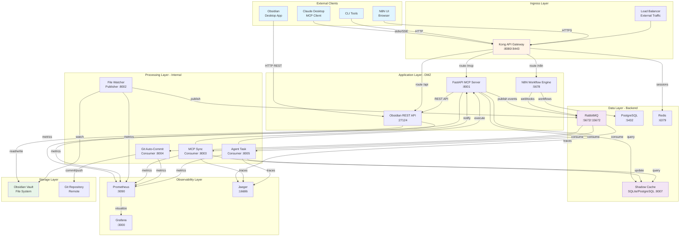
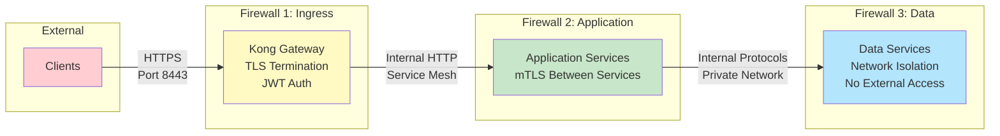
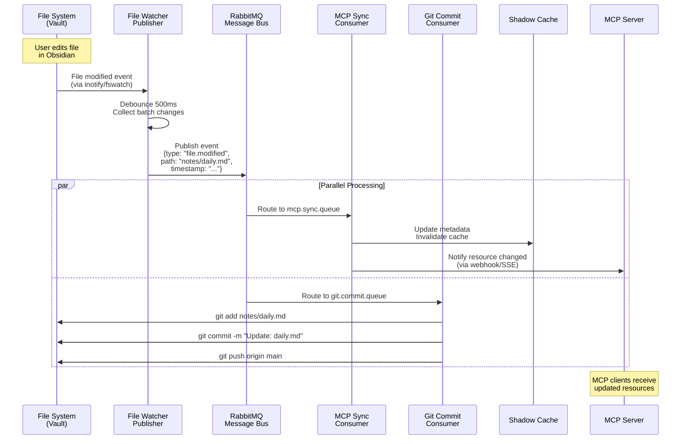
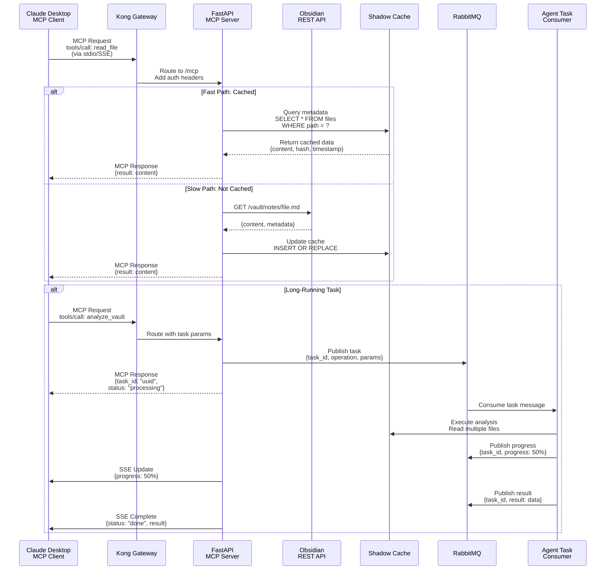
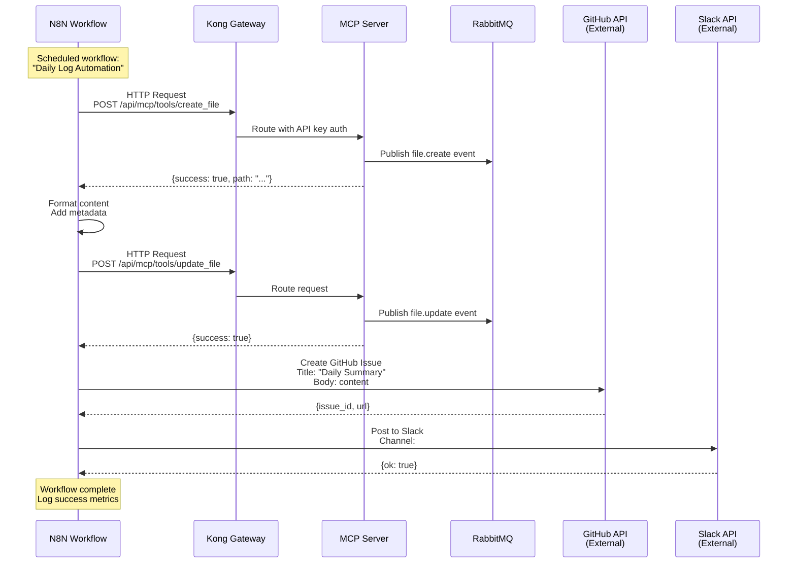
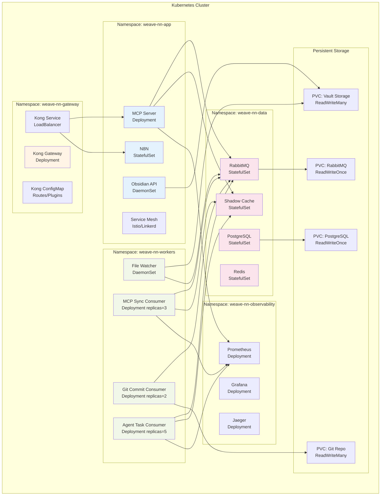
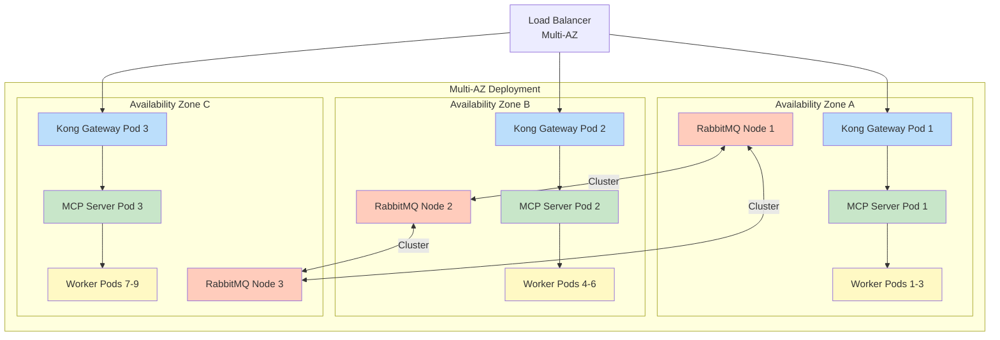
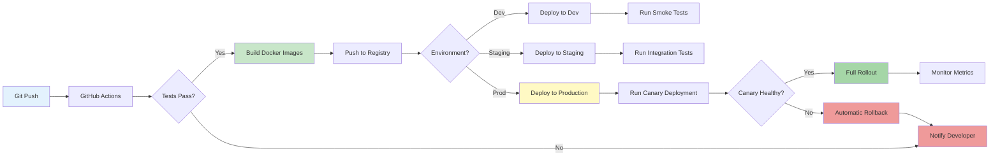

# Weave-NN Microservices Architecture Specification

**Version**: 1.0
**Date**: 2025-10-23
**Architect**: System Architecture Designer
**Status**: Initial Design

---

## Executive Summary

Weave-NN is a distributed system that integrates Obsidian vault management with Claude Desktop via the Model Context Protocol (MCP). The architecture follows microservices patterns with event-driven communication, ensuring scalability, resilience, and maintainability.

### Key Design Principles
1. **Event-Driven Architecture**: RabbitMQ message bus for loose coupling
2. **Service Independence**: Each service deployable and scalable independently
3. **API-First Design**: Well-defined contracts between services
4. **Shadow Cache Pattern**: Local SQLite cache with PostgreSQL for production
5. **Multi-Client Support**: MCP, REST, and CLI interfaces
6. **Workflow Automation**: N8N for complex business processes

---

## 1. Service Topology

### 1.1 Core Services

#### **API Gateway Service**
- **Technology**: Kong Gateway or Traefik (recommended: Kong for MCP support)
- **Purpose**: Single entry point for all external requests
- **Responsibilities**:
  - Request routing and load balancing
  - Authentication and authorization (JWT)
  - Rate limiting and throttling
  - Protocol translation (REST ↔ MCP)
  - Request/response logging
- **Ports**: 8080 (HTTP), 8443 (HTTPS), 9000 (Admin)
- **Dependencies**: Redis (session storage), PostgreSQL (config)

#### **FastAPI MCP Server**
- **Technology**: FastAPI (Python 3.11+)
- **Purpose**: MCP protocol implementation for Claude Desktop
- **Responsibilities**:
  - MCP protocol handling (stdio/SSE transport)
  - Resource serving (vault files, metadata)
  - Tool execution (file operations, search)
  - Prompt template management
  - Obsidian REST API integration
- **Ports**: 8001 (internal REST), stdio (MCP)
- **Dependencies**: Obsidian REST API, Shadow Cache, RabbitMQ

#### **Obsidian REST API Service**
- **Technology**: TypeScript/Node.js (Obsidian plugin)
- **Purpose**: Expose Obsidian vault via REST API
- **Responsibilities**:
  - File CRUD operations
  - Metadata extraction
  - Search and query
  - Plugin state management
- **Ports**: 27124 (default Obsidian local REST API)
- **Dependencies**: Obsidian application

#### **File Watcher Publisher**
- **Technology**: Python (watchdog) or Go (fsnotify)
- **Purpose**: Detect vault file changes and publish events
- **Responsibilities**:
  - Monitor vault directory for changes
  - Debounce rapid changes (500ms window)
  - Publish events to RabbitMQ (file.created, file.modified, file.deleted)
  - Handle file system edge cases (renames, moves)
- **Ports**: 8002 (health check)
- **Dependencies**: RabbitMQ, File system access

#### **MCP Sync Consumer**
- **Technology**: Python 3.11+ (async)
- **Purpose**: Keep MCP resources synchronized with vault state
- **Responsibilities**:
  - Consume file change events from RabbitMQ
  - Update Shadow Cache with latest vault state
  - Invalidate MCP resource cache
  - Trigger re-indexing for search
- **Ports**: 8003 (metrics)
- **Dependencies**: RabbitMQ, Shadow Cache, MCP Server

#### **Git Auto-Commit Consumer**
- **Technology**: Python (GitPython) or Go (go-git)
- **Purpose**: Automated version control for vault
- **Responsibilities**:
  - Consume file change events
  - Stage and commit changes with semantic messages
  - Push to remote repository (configurable)
  - Handle merge conflicts
- **Ports**: 8004 (status API)
- **Dependencies**: RabbitMQ, Git repository

#### **Agent Task Consumer**
- **Technology**: Python 3.11+ (Celery alternative or native async)
- **Purpose**: Execute long-running agent tasks
- **Responsibilities**:
  - Process agent task requests from RabbitMQ
  - Execute file operations, searches, analysis
  - Report progress via websockets/SSE
  - Handle task timeouts and retries
- **Ports**: 8005 (websocket), 8006 (HTTP)
- **Dependencies**: RabbitMQ, Shadow Cache, MCP Server

#### **Shadow Cache Service**
- **Technology**: SQLite (local) / PostgreSQL (production)
- **Purpose**: Local cache for vault state and metadata
- **Responsibilities**:
  - File metadata storage (path, hash, timestamps)
  - Search index (full-text search)
  - Tag and link graph storage
  - Query API for fast access
- **Ports**: 8007 (query API)
- **Dependencies**: None (embedded for SQLite)

#### **N8N Workflow Engine**
- **Technology**: N8N (Node.js workflow automation)
- **Purpose**: Orchestrate complex business workflows
- **Responsibilities**:
  - Workflow definition and execution
  - Integration with external APIs (GitHub, Slack, etc.)
  - Scheduled tasks (daily logs, backups)
  - Custom automation triggers
- **Ports**: 5678 (UI), 5679 (webhooks)
- **Dependencies**: PostgreSQL, RabbitMQ (optional)

#### **RabbitMQ Message Bus**
- **Technology**: RabbitMQ 3.12+
- **Purpose**: Event-driven message routing
- **Responsibilities**:
  - Event pub/sub (fanout, topic exchanges)
  - Task queues with priorities
  - Dead letter queues for failed messages
  - Message persistence and durability
- **Ports**: 5672 (AMQP), 15672 (Management UI)
- **Dependencies**: None

### 1.2 Supporting Services

#### **Redis Cache**
- **Purpose**: Session storage, rate limiting, distributed locks
- **Ports**: 6379

#### **PostgreSQL Database**
- **Purpose**: Production metadata storage, N8N persistence
- **Ports**: 5432

#### **Prometheus + Grafana**
- **Purpose**: Metrics collection and visualization
- **Ports**: 9090 (Prometheus), 3000 (Grafana)

#### **Jaeger Tracing**
- **Purpose**: Distributed tracing
- **Ports**: 16686 (UI), 14268 (collector)

---

## 2. Network Architecture

### 2.1 Network Topology



### 2.2 Network Zones

#### **Public Zone**
- Kong API Gateway (8080, 8443)
- N8N Workflow Engine UI (5678)
- Purpose: External traffic ingress

#### **DMZ (Demilitarized Zone)**
- FastAPI MCP Server (8001)
- Obsidian REST API (27124)
- Purpose: Application services with external exposure

#### **Internal Zone**
- File Watcher Publisher (8002)
- MCP Sync Consumer (8003)
- Git Auto-Commit Consumer (8004)
- Agent Task Consumer (8005)
- Purpose: Internal processing, no direct external access

#### **Data Zone**
- RabbitMQ (5672, 15672)
- Shadow Cache (8007)
- PostgreSQL (5432)
- Redis (6379)
- Purpose: Data persistence and message routing

#### **Observability Zone**
- Prometheus (9090)
- Grafana (3000)
- Jaeger (16686)
- Purpose: Monitoring and tracing

### 2.3 Security Boundaries



**Security Controls:**
1. **Layer 1 (Ingress)**: TLS 1.3, JWT authentication, rate limiting
2. **Layer 2 (Application)**: mTLS for service-to-service, API key validation
3. **Layer 3 (Data)**: Network isolation, no direct external access, encrypted at rest

---

## 3. Data Flow Patterns

### 3.1 File Change Propagation Flow



### 3.2 MCP Request Flow



### 3.3 N8N Workflow Integration Flow



### 3.4 Event Routing Strategy

**RabbitMQ Exchange/Queue Configuration:**

```yaml
Exchanges:
  - name: "weave.events"
    type: "topic"
    durable: true
    bindings:
      - routing_key: "file.created"
        queues: ["mcp.sync.queue", "git.commit.queue"]
      - routing_key: "file.modified"
        queues: ["mcp.sync.queue", "git.commit.queue"]
      - routing_key: "file.deleted"
        queues: ["mcp.sync.queue", "git.commit.queue"]
      - routing_key: "agent.task.*"
        queues: ["agent.task.queue"]
      - routing_key: "workflow.*"
        queues: ["n8n.webhook.queue"]

Queues:
  - name: "mcp.sync.queue"
    durable: true
    max_priority: 10
    arguments:
      x-dead-letter-exchange: "weave.dlx"
      x-message-ttl: 300000  # 5 minutes

  - name: "git.commit.queue"
    durable: true
    max_priority: 5
    arguments:
      x-dead-letter-exchange: "weave.dlx"
      x-message-ttl: 600000  # 10 minutes

  - name: "agent.task.queue"
    durable: true
    max_priority: 10
    arguments:
      x-dead-letter-exchange: "weave.dlx"
      x-message-ttl: 1800000  # 30 minutes

  - name: "n8n.webhook.queue"
    durable: true
    max_priority: 3

Dead Letter Exchange:
  - name: "weave.dlx"
    type: "fanout"
    bindings:
      - queue: "dead.letters.queue"
```

---

## 4. Deployment Architecture

### 4.1 Kubernetes Namespace Strategy



### 4.2 Kubernetes Resource Definitions

**Namespace Isolation:**
- `weave-nn-gateway`: External ingress, public services
- `weave-nn-app`: Application services (DMZ)
- `weave-nn-workers`: Background processors
- `weave-nn-data`: Data persistence layer
- `weave-nn-observability`: Monitoring stack

**Service Mesh Integration (Optional):**
- **Istio** or **Linkerd** for:
  - mTLS between services
  - Circuit breaking and retries
  - Advanced routing and traffic splitting
  - Distributed tracing integration

### 4.3 Deployment Configurations

**Resource Allocations:**

| Service | CPU Request | CPU Limit | Memory Request | Memory Limit | Replicas |
|---------|-------------|-----------|----------------|--------------|----------|
| Kong Gateway | 500m | 2000m | 512Mi | 2Gi | 2-5 (HPA) |
| MCP Server | 250m | 1000m | 256Mi | 1Gi | 3-10 (HPA) |
| Obsidian API | 100m | 500m | 128Mi | 512Mi | 1 per node |
| File Watcher | 100m | 250m | 64Mi | 256Mi | 1 per node |
| MCP Sync Consumer | 200m | 500m | 128Mi | 512Mi | 3 |
| Git Commit Consumer | 100m | 250m | 128Mi | 256Mi | 2 |
| Agent Task Consumer | 500m | 2000m | 512Mi | 2Gi | 5-20 (HPA) |
| RabbitMQ | 500m | 1000m | 512Mi | 2Gi | 3 (cluster) |
| PostgreSQL | 500m | 2000m | 1Gi | 4Gi | 1 (primary) |
| Redis | 250m | 500m | 256Mi | 1Gi | 1 |
| Shadow Cache | 250m | 500m | 256Mi | 1Gi | 1 |
| N8N | 250m | 1000m | 512Mi | 2Gi | 1 |

**Horizontal Pod Autoscaling (HPA):**
- Kong Gateway: Scale on CPU > 70% or requests/sec > 1000
- MCP Server: Scale on CPU > 60% or active connections > 100
- Agent Task Consumer: Scale on queue depth > 50 messages

### 4.4 High Availability Configuration



**HA Features:**
1. **Pod Anti-Affinity**: Distribute replicas across nodes/zones
2. **RabbitMQ Clustering**: 3-node cluster with quorum queues
3. **PostgreSQL Replication**: Primary + read replicas
4. **Redis Sentinel**: Master-slave with automatic failover
5. **Graceful Shutdown**: PreStop hooks for connection draining

---

## 5. Architecture Decision Records (ADRs)

### ADR-001: API Gateway Selection

**Status**: Proposed
**Context**: Need unified entry point for multiple protocols (HTTP REST, MCP stdio/SSE, WebSocket)
**Decision**: Use Kong Gateway
**Rationale**:
- Plugin ecosystem for custom MCP protocol handling
- Superior performance (10k+ req/sec per instance)
- Native Kubernetes integration (Ingress controller)
- Built-in observability (Prometheus metrics)
- Enterprise support available

**Alternatives Considered**:
- Traefik: Good but limited plugin ecosystem
- Envoy: Excellent but requires custom control plane
- NGINX: Mature but less cloud-native

**Consequences**:
- (+) Unified API management
- (+) Easy to add new protocols
- (-) Learning curve for plugin development
- (-) Additional infrastructure component

---

### ADR-002: Message Bus Technology

**Status**: Accepted
**Context**: Need reliable event distribution for file changes and task processing
**Decision**: Use RabbitMQ with topic exchanges
**Rationale**:
- Battle-tested reliability (used by major platforms)
- Rich routing capabilities (topic/fanout exchanges)
- Multiple protocol support (AMQP, STOMP, MQTT)
- Excellent Kubernetes operator (RabbitMQ Cluster Operator)
- Dead letter queues for error handling

**Alternatives Considered**:
- Apache Kafka: Overkill for our message volume, higher operational complexity
- Redis Streams: Less mature ecosystem for message guarantees
- NATS: Good but less mature for task queues

**Consequences**:
- (+) Reliable message delivery
- (+) Easy to add new consumers
- (-) Additional operational complexity
- (-) Memory usage for large message backlogs

---

### ADR-003: Shadow Cache Strategy

**Status**: Accepted
**Context**: Need fast access to vault metadata without constant file system access
**Decision**: Use SQLite for local deployments, PostgreSQL for production
**Rationale**:
- SQLite: Zero-config, embedded, perfect for single-node
- PostgreSQL: Production-grade, supports multiple MCP servers
- Unified schema for both environments
- Full-text search (FTS5 in SQLite, GIN indexes in PostgreSQL)

**Alternatives Considered**:
- Redis: Fast but not persistent enough for metadata
- Elasticsearch: Overkill for our search needs
- In-memory cache: No persistence across restarts

**Consequences**:
- (+) Fast query performance (<10ms)
- (+) Easy local development
- (+) Production scalability
- (-) Need to maintain two code paths
- (-) Cache invalidation complexity

---

### ADR-004: Service Mesh Decision

**Status**: Proposed
**Context**: Need mTLS between services and advanced traffic management
**Decision**: Optional Istio or Linkerd integration
**Rationale**:
- Start without service mesh (YAGNI principle)
- Add when needed for:
  - Multi-cluster deployments
  - Advanced canary deployments
  - Stricter security requirements
- Both Istio and Linkerd are production-ready

**Alternatives Considered**:
- Consul: More focused on service discovery
- AWS App Mesh: Vendor lock-in
- No service mesh: Simpler but limited security

**Consequences**:
- (+) Lower initial complexity
- (+) Easier debugging
- (-) Manual mTLS certificate management
- (-) Basic routing capabilities

---

### ADR-005: File Watcher Implementation

**Status**: Proposed
**Context**: Need to detect vault file changes reliably across platforms
**Decision**: Use Python watchdog with debouncing
**Rationale**:
- Cross-platform (Linux inotify, macOS FSEvents, Windows ReadDirectoryChangesW)
- Mature library with edge case handling
- Easy to debounce rapid changes
- Low resource usage

**Alternatives Considered**:
- Go fsnotify: Great performance but harder to deploy
- Node.js chokidar: Good but Node runtime dependency
- Polling: Simple but inefficient and delayed

**Consequences**:
- (+) Reliable change detection
- (+) Low latency (<100ms)
- (-) Python runtime dependency
- (-) Need to handle edge cases (renames, moves)

---

## 6. Non-Functional Requirements

### 6.1 Performance Targets

| Metric | Target | Measurement |
|--------|--------|-------------|
| API Gateway Latency | p95 < 50ms | Prometheus histogram |
| MCP Request Latency | p95 < 100ms | MCP server metrics |
| File Change Detection | < 500ms | Watchdog event time |
| Cache Hit Rate | > 80% | Shadow Cache metrics |
| Message Processing Rate | > 1000 msg/sec | RabbitMQ stats |
| Agent Task Latency | p95 < 5s | Task consumer metrics |

### 6.2 Scalability Requirements

- **Horizontal Scaling**: All stateless services (MCP Server, Consumers)
- **Vertical Scaling**: Data services (PostgreSQL, RabbitMQ)
- **Auto-Scaling**: HPA on CPU/memory/queue depth
- **Max Throughput**: 10,000 concurrent MCP connections
- **Max Vault Size**: 100,000 files, 10GB total

### 6.3 Reliability Requirements

- **Availability**: 99.9% uptime (8.76 hours downtime/year)
- **RTO (Recovery Time Objective)**: < 5 minutes
- **RPO (Recovery Point Objective)**: < 1 minute (data loss)
- **Error Budget**: 0.1% (43.2 minutes downtime/month)
- **Circuit Breaker**: Fail fast after 3 consecutive errors
- **Retry Policy**: Exponential backoff (1s, 2s, 4s, max 30s)

### 6.4 Security Requirements

- **Authentication**: JWT with RS256, 15-minute expiry
- **Authorization**: RBAC with Vault/Admin/User roles
- **Encryption in Transit**: TLS 1.3 for external, mTLS for internal
- **Encryption at Rest**: AES-256 for sensitive data
- **Secrets Management**: Kubernetes Secrets + HashiCorp Vault (optional)
- **Audit Logging**: All API calls logged with user context
- **Rate Limiting**: 100 req/min per user, 1000 req/min per IP

### 6.5 Observability Requirements

**Metrics (Prometheus):**
- Service-level metrics (latency, errors, throughput)
- Business metrics (files processed, MCP requests)
- Infrastructure metrics (CPU, memory, disk)

**Logs (Structured JSON):**
- All services emit structured logs to stdout
- Log aggregation with Loki or ELK stack
- Correlation IDs for request tracing

**Traces (OpenTelemetry):**
- Distributed tracing with Jaeger
- Trace sampling rate: 10% (configurable)
- Span annotations for key operations

**Dashboards (Grafana):**
- RED metrics (Rate, Errors, Duration)
- USE metrics (Utilization, Saturation, Errors)
- Business KPIs (daily active users, files synced)

---

## 7. Deployment Workflows

### 7.1 CI/CD Pipeline



### 7.2 Blue-Green Deployment Strategy

**Production Deployment Process:**
1. Deploy new version (Green) alongside current (Blue)
2. Run health checks on Green environment
3. Route 10% traffic to Green (canary)
4. Monitor metrics for 15 minutes
5. If healthy, gradually shift traffic (25%, 50%, 100%)
6. If unhealthy, rollback to Blue (instant)
7. Keep Blue running for 24 hours before decommission

**Rollback Triggers:**
- Error rate > 1%
- Latency p95 > 200ms
- Health check failures > 3
- Manual trigger via CLI

---

## 8. Migration Plan

### 8.1 Phase 1: Foundation (Week 1-2)
1. Deploy Kubernetes cluster
2. Setup namespaces and RBAC
3. Deploy RabbitMQ cluster
4. Deploy PostgreSQL primary + replicas
5. Deploy Redis with Sentinel
6. Configure persistent storage (PVCs)

### 8.2 Phase 2: Core Services (Week 3-4)
1. Deploy Kong Gateway with basic routes
2. Deploy FastAPI MCP Server
3. Deploy Obsidian REST API integration
4. Deploy Shadow Cache service
5. Test basic MCP operations

### 8.3 Phase 3: Event Processing (Week 5-6)
1. Deploy File Watcher Publisher
2. Deploy MCP Sync Consumer
3. Deploy Git Auto-Commit Consumer
4. Test file change propagation end-to-end
5. Tune RabbitMQ performance

### 8.4 Phase 4: Advanced Features (Week 7-8)
1. Deploy Agent Task Consumer
2. Deploy N8N Workflow Engine
3. Setup Prometheus + Grafana
4. Setup Jaeger tracing
5. Configure HPA and auto-scaling

### 8.5 Phase 5: Production Hardening (Week 9-10)
1. Implement circuit breakers
2. Add comprehensive monitoring
3. Setup alerting rules
4. Perform load testing
5. Security audit and penetration testing
6. Documentation and runbooks

---

## 9. Operational Runbooks

### 9.1 Service Health Checks

**API Gateway:**
```bash
curl -f http://kong:8001/status || exit 1
```

**MCP Server:**
```bash
curl -f http://mcp-server:8001/health || exit 1
```

**RabbitMQ:**
```bash
rabbitmqctl cluster_status
rabbitmqctl list_queues
```

### 9.2 Common Operations

**Scale MCP Server:**
```bash
kubectl scale deployment mcp-server -n weave-nn-app --replicas=10
```

**Restart Consumer:**
```bash
kubectl rollout restart deployment mcp-sync-consumer -n weave-nn-workers
```

**Check Message Queue Depth:**
```bash
kubectl exec -n weave-nn-data rabbitmq-0 -- \
  rabbitmqadmin list queues name messages
```

**View Logs:**
```bash
kubectl logs -n weave-nn-app deployment/mcp-server --tail=100 -f
```

### 9.3 Troubleshooting Guide

**Issue: High MCP Latency**
1. Check Shadow Cache hit rate: `SELECT count(*) FROM files WHERE cached = true`
2. Check RabbitMQ queue depth: `rabbitmqctl list_queues`
3. Check pod CPU/memory: `kubectl top pods -n weave-nn-app`
4. Review slow query logs in PostgreSQL

**Issue: File Changes Not Syncing**
1. Check File Watcher logs: `kubectl logs -n weave-nn-workers daemonset/file-watcher`
2. Verify RabbitMQ consumers: `rabbitmqctl list_consumers`
3. Check MCP Sync Consumer health: `curl mcp-sync-consumer:8003/metrics`
4. Verify vault file permissions

**Issue: Git Commit Failures**
1. Check Git Consumer logs: `kubectl logs -n weave-nn-workers deployment/git-commit-consumer`
2. Verify git credentials: `kubectl get secret git-credentials -o yaml`
3. Test git connectivity: `kubectl exec git-commit-consumer-0 -- git ls-remote`
4. Check disk space: `df -h /vault`

---

## 10. Technology Stack Summary

| Component | Technology | Version | License |
|-----------|-----------|---------|---------|
| API Gateway | Kong Gateway | 3.4+ | Apache 2.0 |
| MCP Server | FastAPI (Python) | 0.104+ | MIT |
| Obsidian API | TypeScript/Node.js | 20+ | MIT |
| Message Bus | RabbitMQ | 3.12+ | MPL 2.0 |
| Cache DB | PostgreSQL | 15+ | PostgreSQL |
| Session Store | Redis | 7.2+ | BSD-3-Clause |
| Workflow Engine | N8N | 1.0+ | Apache 2.0 |
| Container Orchestration | Kubernetes | 1.28+ | Apache 2.0 |
| Service Mesh (Optional) | Istio/Linkerd | 1.19+/2.14+ | Apache 2.0 |
| Metrics | Prometheus | 2.47+ | Apache 2.0 |
| Visualization | Grafana | 10.1+ | AGPL 3.0 |
| Tracing | Jaeger | 1.50+ | Apache 2.0 |
| File Watcher | Python watchdog | 3.0+ | Apache 2.0 |

---

## Appendix A: Glossary

**MCP (Model Context Protocol)**: Protocol for integrating Claude Desktop with external tools and data sources
**Shadow Cache**: Local cache of vault metadata for fast queries
**Fanout Exchange**: RabbitMQ exchange that routes messages to all bound queues
**Topic Exchange**: RabbitMQ exchange with pattern-based routing
**HPA (Horizontal Pod Autoscaler)**: Kubernetes feature for automatic scaling
**PVC (Persistent Volume Claim)**: Kubernetes storage abstraction
**mTLS (Mutual TLS)**: Two-way authentication with client and server certificates
**Circuit Breaker**: Design pattern for preventing cascading failures

---

## Appendix B: References

1. Kong Gateway Documentation: https://docs.konghq.com/
2. FastAPI Documentation: https://fastapi.tiangolo.com/
3. RabbitMQ Best Practices: https://www.rabbitmq.com/best-practices.html
4. Kubernetes Patterns: https://kubernetes.io/docs/concepts/
5. MCP Protocol Specification: https://modelcontextprotocol.io/
6. N8N Documentation: https://docs.n8n.io/
7. Istio Service Mesh: https://istio.io/latest/docs/
8. Prometheus Monitoring: https://prometheus.io/docs/

---

**Document Control:**
- Version: 1.0
- Last Updated: 2025-10-23
- Next Review: 2025-11-23
- Approval: Pending
- Distribution: Engineering Team, DevOps, Product

## Related Documents

### Related Files
- [[ARCHITECTURE-HUB.md]] - Parent hub
- [[mvp-local-first-architecture.md]] - Same directory

### Similar Content
- [[mvp-local-first-architecture.md]] - Semantic similarity: 42.4%
- [[service-mesh-networking-recommendations.md]] - Semantic similarity: 31.2%

