# Phase 14: Obsidian-Native Knowledge Graph & Visual Intelligence

**Status**: 📋 **PLANNED** (Next Phase After Phase 13)
**Priority**: 🟡 **HIGH**
**Duration**: 7-8 weeks
**Phase Owner**: Development Team + Knowledge Architecture Team
**Dependencies**: Phase 13 (Enhanced Agent Intelligence) ✅

---

## 🎯 Executive Summary

Phase 14 completes the knowledge graph transformation initiated in Phase 13 and delivers a fully integrated, visually enhanced Obsidian vault for the Weave-NN project. This phase addresses the critical **55% orphaned file problem** identified in Phase 13's graph analysis and adds comprehensive Obsidian-native features for superior knowledge navigation and discovery.

### The Knowledge Graph Problem

**Current State** (Post-Phase 13):
- ✅ Phase 13 core cluster: Excellent connectivity (12.67 links/file)
- ✅ 37 critical files with comprehensive metadata (70.2% coverage)
- ✅ 92 high-quality cross-references in key documents
- ❌ **55% of files remain orphaned** (363 out of 660 files)
- ❌ Missing hub documents for historical phases
- ❌ No phase timeline visualization
- ❌ Archive/research disconnected from current work
- ❌ No visual styling or graph optimization

**Target State** (Post-Phase 14):
- ✅ <5% orphaned files (target: 330+ new connections)
- ✅ Complete phase timeline (Phase 1→14 evolution)
- ✅ Hub documents for all major directories
- ✅ Obsidian graph view fully configured
- ✅ Visual styling (colors, icons, groups)
- ✅ Dataview dashboards operational
- ✅ Canvas maps for complex topics
- ✅ Advanced metadata for all critical files

### What Phase 14 Delivers

**Connectivity Enhancement**:
1. Hub documents linking all major topic areas
2. Phase timeline connecting historical evolution
3. Archive integration with current documentation
4. Automated graph analysis tools

**Visual Intelligence**:
1. Color-coded nodes by document type
2. Icon system for files and folders
3. Graph view groups and filters
4. CSS styling for enhanced readability
5. Custom callouts and visual elements

**Advanced Features**:
1. Dataview queries for dynamic content
2. Canvas maps for system architecture
3. Advanced metadata schema v3.0
4. Graph-aware navigation

**Result**: A production-ready Obsidian vault with <5% orphaned files, full visual styling, and advanced knowledge discovery capabilities.

---

## 📚 Background & Context

### Phase 13 Accomplishments ✅

Phase 13 delivered **semantic intelligence** and **advanced reasoning**:
- Vector embeddings for semantic search
- Tree-of-Thought reasoning
- Expert agent coordination
- Advanced chunking system
- Web perception tools
- Hybrid search (keyword + semantic)

**Knowledge Graph Status**:
- Created strong Phase 13 cluster (18 docs, 12.67 links/file)
- Added metadata to 37 critical files
- Renamed 53 generic files
- Established 92 cross-references

**Critical Gap**: While Phase 13 built excellent **local connectivity**, it left **global connectivity** at 45% (target: 95%).

### The Orphaned File Crisis

**Analysis of 660 Markdown Files**:
```
Total Files: 660
Connected Files: 297 (45%)
Orphaned Files: 363 (55%) ⚠️ CRITICAL

Breakdown by Directory:
- /weave-nn/_planning/phases/    : 20% connected (Phase 13 cluster excellent, Phases 1-11 orphaned)
- /weave-nn/docs/                : 35% connected (recent docs good, archive orphaned)
- /weaver/docs/                  : 15% connected (implementation docs isolated)
- /weave-nn/research/            : 10% connected (research papers disconnected)
- /weave-nn/.archive/            : 5% connected (historical docs forgotten)
- /weave-nn/tests/               : 20% connected (test docs isolated)
```

**Impact**:
- Users hit dead ends during graph navigation
- Historical context lost
- Research insights forgotten
- Implementation knowledge siloed
- Phase evolution unclear

### Obsidian Features Not Yet Used

**Current Obsidian Usage**:
- ✅ Wikilinks for basic navigation
- ✅ Frontmatter metadata (basic)
- ❌ Graph view configuration (no colors, groups, filters)
- ❌ CSS snippets for visual styling
- ❌ Dataview plugin queries
- ❌ Canvas for visual mapping
- ❌ Advanced metadata properties
- ❌ Nested tags
- ❌ Graph-aware search
- ❌ Custom icons/colors

**Opportunity**: Obsidian provides rich visual and organizational features that we're not leveraging.

---

## 🎯 Phase 14 Objectives

### Objective 1: Complete Knowledge Graph Connectivity ⭐ CRITICAL

**Goal**: Reduce orphaned files from 55% to <5% (target: 660 files × 0.05 = 33 orphans max)

**Tasks**:
1. Create hub documents for all major directories
2. Build phase timeline linking Phases 1→14
3. Connect archive/research to current work
4. Add bi-directional cross-references
5. Implement automated graph analysis tools
6. Validate connectivity metrics

**Target Metrics**:
- Orphaned files: <5% (33 files max)
- Link density: >2.5 links/file (average across all files)
- Hub documents: 15+ major hubs
- Phase timeline: Complete 1→14 connection path
- Archive integration: 100% of archive docs linked

### Objective 2: Obsidian Visual Styling ⭐ HIGH

**Goal**: Transform plain text vault into visually rich knowledge environment

**Tasks**:
1. Implement color coding by document type
2. Add icon system for files/folders
3. Create CSS snippets for enhanced styling
4. Design custom callouts
5. Configure theme for knowledge work

**Visual Elements**:
- **Colors**: By document type (planning=blue, implementation=green, research=purple, etc.)
- **Icons**: Emoji or Lucide icons for instant recognition
- **Callouts**: Custom warning, info, success, error styles
- **Typography**: Enhanced readability for code, quotes, headings
- **Dark/Light**: Optimized for both modes

### Objective 3: Graph View Optimization ⭐ HIGH

**Goal**: Configure Obsidian graph for maximum navigability

**Tasks**:
1. Define node colors by tags/type
2. Create filtered views (by phase, domain, status)
3. Set up local vs global graph settings
4. Implement graph groups (clustering)
5. Configure search filters
6. Optimize graph physics

**Graph Configuration**:
```json
{
  "groups": [
    { "query": "tag:#phase", "color": "#3B82F6" },
    { "query": "tag:#implementation", "color": "#10B981" },
    { "query": "tag:#research", "color": "#8B5CF6" },
    { "query": "tag:#architecture", "color": "#F59E0B" },
    { "query": "path:_planning", "color": "#6366F1" }
  ],
  "filters": {
    "orphans": true,
    "existing-files": true,
    "attachments": false
  },
  "display": {
    "arrows": true,
    "labels": true,
    "depth": 2
  }
}
```

### Objective 4: Metadata Enhancement ⭐ CRITICAL

**Goal**: Upgrade to metadata schema v3.0 with Obsidian properties

**Tasks**:
1. Expand frontmatter schema
2. Add CSS classes for styling
3. Implement nested tags
4. Create aliases for key documents
5. Add Dataview-compatible fields
6. Document metadata standards

**Schema v3.0**:
```yaml
---
# Core Identifiers
title: "Document Title"
type: planning | implementation | research | architecture | sop
status: draft | in-progress | review | complete | archived
phase_id: "PHASE-14"

# Categorization
tags: [primary, secondary, tertiary]
domain: weaver | learning-loop | knowledge-graph | infrastructure
scope: system | component | feature | task
priority: critical | high | medium | low

# Relationships
related_concepts: [concept1, concept2]
related_files: [file1.md, file2.md]
depends_on: [dependency1.md]
enables: [enabled-feature.md]

# Metadata
author: human | ai-generated | collaborative
created_date: 2025-10-28
updated_date: 2025-10-28
version: "3.0"

# Obsidian Visual
visual:
  icon: "brain" | "code" | "book" | "network"
  color: "#3B82F6" | "#10B981" | "#8B5CF6"
  cssclasses: [type-planning, status-draft, priority-high]

# Dataview Fields
completion: 75
effort_hours: 40
assigned_to: ["agent-1", "agent-2"]
deadline: 2025-12-01

# Audience
audience: [developers, architects, project-managers, end-users]
---
```

### Objective 5: Dataview Integration ⭐ MEDIUM

**Goal**: Dynamic content generation and dashboard views

**Tasks**:
1. Install and configure Dataview plugin
2. Create task list queries
3. Build phase status dashboards
4. Generate statistics views
5. Create relationship maps
6. Add progress tracking queries

**Example Dataview Queries**:
```dataview
// Task Board
TABLE status, priority, effort_hours, completion
FROM #phase-14
WHERE type = "task"
SORT priority DESC, status ASC

// Phase Timeline
LIST
FROM #phase
SORT phase_id ASC

// Orphan Detection
TABLE file.inlinks as Inbound, file.outlinks as Outbound
WHERE length(file.inlinks) = 0 OR length(file.outlinks) = 0
SORT file.name ASC
```

### Objective 6: Canvas & Visual Tools ⭐ MEDIUM

**Goal**: Visual system architecture and concept maps

**Tasks**:
1. Create canvas maps for each phase
2. Design workflow diagrams
3. Build concept maps for complex topics
4. Create mind maps for brainstorming
5. Integrate with graph view

**Canvas Use Cases**:
- Phase architecture overviews
- System component relationships
- Workflow pipelines
- Learning loop visualization
- Agent coordination patterns
- Memory system architecture

### Objective 7: Advanced Linking ⭐ LOW

**Goal**: Sophisticated cross-referencing patterns

**Tasks**:
1. Implement block references
2. Add embed patterns
3. Create linking conventions
4. Set up aliases system
5. Build MOCs (Maps of Content)
6. Document best practices

**Linking Patterns**:
```markdown
# Block References
See specific section: [[file#^block-id]]

# Embeds
![[diagram.png]]
![[other-note#Section]]

# Aliases
[[long-file-name|short alias]]

# MOC Structure
# Knowledge Graph MOC
- [[Overview]]
- [[Architecture]]
  - [[Component A]]
  - [[Component B]]
- [[Implementation]]
- [[Testing]]
```

---

## 🗓️ Phase 14 Timeline (7-8 Weeks)

### Week 1-2: Knowledge Graph Completion (CRITICAL PATH)

**Week 1: Hub Document Creation**
- Days 1-2: Create 15+ major hub documents
  - `/weave-nn/WEAVE-NN-HUB.md` - Root hub
  - `/weave-nn/_planning/PLANNING-HUB.md` - Planning overview
  - `/weave-nn/docs/DOCUMENTATION-HUB.md` - Docs index
  - `/weaver/WEAVER-HUB.md` - Implementation hub
  - `/weave-nn/research/RESEARCH-HUB.md` - Research index
  - Directory-specific hubs for all major areas

- Days 3-4: Build phase timeline
  - Create `PHASE-EVOLUTION-TIMELINE.md`
  - Link Phase 1→14 with evolution narrative
  - Add "superseded by" links in old phases
  - Establish historical context connections

- Day 5: Archive integration strategy
  - Audit archive documents
  - Add "Status: Archived" metadata
  - Create "Modern Alternative" links
  - Connect to current implementations

**Week 2: Systematic Connection Building**
- Days 1-2: Connect planning documents (Phases 1-11 to Phase 13-14)
- Days 2-3: Connect research papers to implementation docs
- Day 4: Connect test documentation to source code
- Day 5: Connect infrastructure docs to system architecture

**Deliverables (Week 1-2)**:
- ✅ 15+ hub documents created
- ✅ Complete phase timeline (Phase 1→14)
- ✅ Archive integration (100% linked)
- ✅ 330+ new connections added
- ✅ Orphaned files: <5%
- ✅ Validation report

### Week 2-3: Obsidian Visual Styling

**Week 2 (Days 3-5): CSS Foundation**
- Day 3: Install base theme and configure
- Day 4: Create CSS snippets directory
- Day 5: Implement color coding system

**Week 3: Visual Enhancements**
- Days 1-2: Icon system implementation
  - Add emoji/Lucide icons to frontmatter
  - Create icon mapping rules
  - Update file explorer view

- Day 3: Custom callouts
  - Design warning, info, success, error styles
  - Create phase-specific callouts
  - Add code highlighting improvements

- Days 4-5: Typography and spacing
  - Optimize readability
  - Enhance code blocks
  - Improve list spacing
  - Test dark/light modes

**Deliverables (Week 2-3)**:
- ✅ CSS snippet library
- ✅ Color coding operational
- ✅ Icon system active
- ✅ Custom callouts designed
- ✅ Theme optimized for knowledge work

### Week 3: Graph View Configuration

**Days 1-2: Graph Groups & Colors**
- Define color scheme by tags
- Create filtered views
- Configure graph physics
- Set up link visualization

**Days 3-4: Search & Filters**
- Implement graph search
- Create saved filter presets
- Configure local vs global views
- Optimize depth settings

**Day 5: Graph Documentation**
- Create graph navigation guide
- Document filter patterns
- Record best practices

**Deliverables (Week 3)**:
- ✅ Graph view fully configured
- ✅ 6+ filter presets
- ✅ Color groups defined
- ✅ Navigation guide complete

### Week 4: Metadata Enhancement

**Days 1-2: Schema v3.0 Implementation**
- Define complete schema
- Create templates
- Add validation rules
- Document standards

**Days 3-4: Mass Metadata Addition**
- Use automated tools to add metadata to 200+ files
- Prioritize critical files first
- Validate schema compliance

**Day 5: Nested Tags & Aliases**
- Implement tag hierarchy
- Add aliases to key documents
- Create tag taxonomy

**Deliverables (Week 4)**:
- ✅ Metadata schema v3.0 defined
- ✅ 200+ files with enhanced metadata
- ✅ Nested tag system operational
- ✅ Alias system configured
- ✅ Metadata coverage: >90%

### Week 5: Dataview Integration

**Days 1-2: Dataview Setup**
- Install Dataview plugin
- Configure settings
- Create query templates
- Test performance

**Days 3-4: Dashboard Creation**
- Task board queries
- Phase status dashboards
- Statistics views
- Relationship maps

**Day 5: Progress Tracking**
- Completion tracking queries
- Effort estimation views
- Timeline visualization
- Bottleneck detection

**Deliverables (Week 5)**:
- ✅ Dataview plugin operational
- ✅ 10+ dashboard queries
- ✅ Task tracking system
- ✅ Progress visualization
- ✅ Query documentation

### Week 6: Canvas & Visual Tools

**Days 1-3: Canvas Creation**
- Phase architecture canvases (14 canvases, one per phase)
- System component diagrams
- Workflow visualizations
- Concept maps

**Days 4-5: Integration & Documentation**
- Link canvases to graph view
- Create navigation paths
- Document canvas patterns
- User guide creation

**Deliverables (Week 6)**:
- ✅ 14+ canvas maps created
- ✅ Visual architecture documentation
- ✅ Workflow diagrams
- ✅ Concept maps for complex topics
- ✅ Canvas user guide

### Week 7: Advanced Features & Testing

**Days 1-2: Advanced Linking**
- Block reference patterns
- Embed strategies
- MOC creation (5+ major MOCs)
- Linking conventions documentation

**Days 3-4: Comprehensive Testing**
- Graph navigation testing
- Visual element verification
- Dataview query validation
- Performance benchmarking

**Day 5: User Acceptance Testing**
- Navigation flow testing
- Discovery pattern validation
- Search effectiveness
- Visual clarity assessment

**Deliverables (Week 7)**:
- ✅ Block references implemented
- ✅ 5+ MOCs created
- ✅ All features tested
- ✅ Performance validated
- ✅ User guide complete

### Week 8: Documentation, Optimization & Launch (Buffer)

**Days 1-2: Complete Documentation**
- Obsidian usage guide
- Graph navigation tutorial
- Dataview query reference
- Visual styling guide
- Best practices documentation

**Days 3-4: Optimization & Polish**
- Performance tuning
- Graph layout optimization
- Query optimization
- Visual refinements

**Day 5: Launch Preparation**
- Final validation
- Migration guide creation
- Rollback procedures
- Launch approval

**Deliverables (Week 8)**:
- ✅ Complete user documentation
- ✅ Performance optimized
- ✅ Launch-ready vault
- ✅ Migration guide
- ✅ Go/No-Go decision

---

## 📋 Detailed Task Breakdown

### Category 1: Knowledge Graph Completion (CRITICAL PATH)

#### Task 1.1: Hub Document Creation ⭐ CRITICAL
**Effort**: 24 hours | **Priority**: CRITICAL | **Week**: 1

**Objective**: Create comprehensive hub documents that serve as navigation centers for all major topic areas.

**Hub Documents to Create** (15 total):
```
1. /weave-nn/WEAVE-NN-HUB.md                    - Root project hub
2. /weave-nn/_planning/PLANNING-HUB.md          - All planning docs
3. /weave-nn/_planning/phases/PHASE-TIMELINE-HUB.md - Phase evolution
4. /weave-nn/docs/DOCUMENTATION-HUB.md          - Documentation index
5. /weave-nn/docs/research/RESEARCH-HUB.md      - Research papers
6. /weave-nn/docs/architecture/ARCHITECTURE-HUB.md - System architecture
7. /weaver/WEAVER-HUB.md                        - Implementation overview
8. /weaver/docs/WEAVER-DOCS-HUB.md              - Weaver documentation
9. /weaver/src/WEAVER-SOURCE-HUB.md             - Source code index
10. /weaver/tests/TESTING-HUB.md                - Test documentation
11. /weave-nn/.archive/ARCHIVE-HUB.md           - Historical documents
12. /weave-nn/infrastructure/INFRASTRUCTURE-HUB.md - Infra docs
13. /weave-nn/coordination/COORDINATION-HUB.md   - Agent coordination
14. /weave-nn/memory/MEMORY-HUB.md              - Memory systems
15. /weave-nn/workflows/WORKFLOW-HUB.md         - Workflow documentation
```

**Hub Document Template**:
```markdown
---
title: "{Topic} Hub - Navigation Center"
type: hub
status: active
tags: [hub, {topic}, navigation]
visual:
  icon: "network"
  color: "#3B82F6"
  cssclasses: [hub-document, type-navigation]
---

# {Topic} Hub

> **Navigation Center**: This hub connects all {topic}-related documentation in the knowledge graph.

## 🎯 Quick Links

### Critical Documents
- [[key-doc-1]] - Primary resource
- [[key-doc-2]] - Essential reading
- [[key-doc-3]] - Latest updates

### By Category
#### Category A
- [[doc-a1]]
- [[doc-a2]]

#### Category B
- [[doc-b1]]
- [[doc-b2]]

## 📊 Status Overview

```dataview
TABLE status, updated_date, priority
FROM "{directory}"
WHERE type != "hub"
SORT priority DESC, updated_date DESC
```

## 🔗 Related Hubs
- [[OTHER-HUB]] - Related topic area
- [[PARENT-HUB]] - Broader context

## 📈 Statistics

```dataview
LIST
WHERE file.folder = "{directory}"
GROUP BY type
```

---

**See Also**: [[WEAVE-NN-HUB]] | [[DOCUMENTATION-HUB]]
```

**Implementation Strategy**:
1. Start with root hub (WEAVE-NN-HUB.md)
2. Create major directory hubs (planning, docs, weaver)
3. Add topic-specific hubs (research, architecture, testing)
4. Establish bidirectional links between hubs
5. Validate hub connectivity

**Success Criteria**:
- ✅ 15 hub documents created
- ✅ Each hub links to 10+ relevant documents
- ✅ Hub-to-hub links established
- ✅ Dataview queries functional
- ✅ Navigation paths validated

**Dependencies**: None

---

#### Task 1.2: Phase Timeline Construction ⭐ CRITICAL
**Effort**: 16 hours | **Priority**: CRITICAL | **Week**: 1

**Objective**: Build complete phase evolution timeline connecting Phases 1→14.

**Deliverable**: `/weave-nn/_planning/phases/PHASE-EVOLUTION-TIMELINE.md`

**Timeline Structure**:
```markdown
---
title: "Phase Evolution Timeline - Weave-NN Development History"
type: timeline
status: active
tags: [phase, timeline, evolution, history]
visual:
  icon: "timeline"
  color: "#8B5CF6"
  cssclasses: [timeline-document, type-planning]
---

# Phase Evolution Timeline

> **Project Journey**: From inception to enhanced intelligence (Phase 1→14)

## 📅 Timeline Overview



```mermaid
graph LR
    P1[Phase 1<br/>Knowledge Graph] --> P2[Phase 2<br/>Documentation]
    P2 --> P3[Phase 3<br/>Node Expansion]
    P3 --> P4[Phase 4<br/>MVP Planning]
    P4 --> P5[Phase 5<br/>MCP Integration]
    P5 --> P6[Phase 6<br/>Vault Init]
    P6 --> P7[Phase 7<br/>Agent Rules]
    P7 --> P8[Phase 8<br/>Git Automation]
    P8 --> P9[Phase 9<br/>Testing]
    P9 --> P10[Phase 10<br/>Launch]
    P10 --> P11[Phase 11<br/>CLI Service]
    P11 --> P12[Phase 12<br/>Learning Loop]
    P12 --> P13[Phase 13<br/>Intelligence]
    P13 --> P14[Phase 14<br/>Obsidian]
```

## 🎯 Phase Summaries

### Phase 1: Knowledge Graph Transformation
**Duration**: 2 weeks | **Status**: ✅ Complete

**What We Built**:
- Initial knowledge graph structure
- Wikilink-based navigation
- Basic metadata

**Key Achievements**:
- Established graph foundation
- Created linking patterns

**Evolution**: Superseded by [[phase-14-obsidian-integration|Phase 14]] for comprehensive graph

📄 [[phase-1-knowledge-graph-transformation|Full Phase 1 Documentation]]

---

### Phase 2: Documentation Capture
**Duration**: 2 weeks | **Status**: ✅ Complete

**What We Built**:
- Documentation scanning
- Content extraction
- Metadata generation

**Key Achievements**:
- Captured 200+ documents
- Structured knowledge base

**Evolution**: Foundation for [[phase-13-enhanced-agent-intelligence|Phase 13]] semantic search

📄 [[phase-2-documentation-capture|Full Phase 2 Documentation]]

---

[... continue for all phases ...]

### Phase 13: Enhanced Agent Intelligence
**Duration**: 6-8 weeks | **Status**: ✅ Complete

**What We Built**:
- Vector embeddings
- Tree-of-Thought reasoning
- Expert agent coordination
- Advanced chunking
- Web perception

**Key Achievements**:
- 92% agent maturity
- Semantic search operational
- Deep reasoning capabilities

**Next Phase**: [[phase-14-obsidian-integration|Phase 14]] completes knowledge graph

📄 [[phase-13-master-plan|Full Phase 13 Documentation]]

---

### Phase 14: Obsidian Integration (Current)
**Duration**: 7-8 weeks | **Status**: 🔄 In Progress

**What We're Building**:
- Complete graph connectivity
- Obsidian visual styling
- Dataview dashboards
- Canvas maps
- Advanced metadata

**Target**: <5% orphaned files, full visual intelligence

📄 [[phase-14-obsidian-integration|Full Phase 14 Documentation]]

---

## 🔗 Cross-Phase Connections

### Knowledge Graph Evolution
- Phase 1: Basic wikilinks → Phase 13: Semantic search → Phase 14: Visual graph

### Documentation Maturity
- Phase 2: Capture → Phase 9: Testing → Phase 14: Dataview dashboards

### Agent Intelligence
- Phase 5: MCP → Phase 7: Rules → Phase 12: Learning → Phase 13: Reasoning

### Production Readiness
- Phase 4: MVP → Phase 10: Launch → Phase 11: Services → Phase 14: Polish

## 📊 Evolution Metrics

```dataview
TABLE phase_id, status, duration, priority
FROM #phase
SORT phase_id ASC
```

---

**See Also**: [[PLANNING-HUB]] | [[WEAVE-NN-HUB]]
```

**Implementation Strategy**:
1. Create timeline document
2. Add summary for each phase (1-14)
3. Establish forward/backward links
4. Add "superseded by" relationships
5. Create Mermaid diagram
6. Validate all phase links

**Success Criteria**:
- ✅ Complete timeline document
- ✅ All 14 phases summarized
- ✅ Forward/backward links working
- ✅ Visual timeline diagram
- ✅ Dataview query functional
- ✅ All phase docs link to timeline

**Dependencies**: None

---

#### Task 1.3: Archive Integration ⭐ HIGH
**Effort**: 12 hours | **Priority**: HIGH | **Week**: 1

**Objective**: Connect archived/historical documents to current implementation.

**Approach**:
1. Audit all archive directories
2. Add "Status: Archived" metadata
3. Create "Modern Alternative" links
4. Add "Superseded By" relationships
5. Create archive hub document

**Archive Integration Pattern**:
```markdown
# In archived document:

---
status: archived
superseded_by: [[current-implementation.md]]
archive_reason: "Replaced by Phase 13 implementation"
historical_value: "Contains original research insights"
---

## ⚠️ Archive Notice

**Status**: 📦 **ARCHIVED** (2025-10-28)

This document has been superseded by modern implementations:
- **Current Version**: [[phase-13-master-plan]]
- **Reason**: Phase 13 delivers production implementation
- **Historical Value**: Contains original research and design decisions

> **Note**: This document is preserved for historical context but is no longer maintained.

## Modern Alternatives

- **Implementation**: See [[PHASE-12-LEARNING-LOOP-BLUEPRINT]]
- **Architecture**: See [[phase-13-enhanced-agent-intelligence]]
- **Usage Guide**: See [[WEAVER-COMPLETE-IMPLEMENTATION-GUIDE]]

---

[Original content follows...]
```

**Success Criteria**:
- ✅ All archive docs have "archived" status
- ✅ "Superseded by" links added (100%)
- ✅ Archive hub document created
- ✅ Historical context preserved
- ✅ Navigation to current docs working

**Dependencies**: None

---

#### Task 1.4: Systematic Connection Building ⭐ CRITICAL
**Effort**: 32 hours | **Priority**: CRITICAL | **Week**: 2

**Objective**: Add 330+ connections to reduce orphans from 55% to <5%.

**Strategy**: Process each orphaned cluster systematically.

**Connection Phases**:

**Phase 2A: Planning Documents (10 hours)**
- Target: 80 orphaned planning docs
- Connect Phases 1-11 to Phase 13-14
- Add hub links
- Establish evolution narrative

**Phase 2B: Research Papers (8 hours)**
- Target: 60 orphaned research docs
- Link to implementation docs
- Add to research hub
- Connect to current features

**Phase 2C: Implementation Docs (8 hours)**
- Target: 50 orphaned weaver docs
- Link to architecture
- Connect to testing
- Add to implementation hub

**Phase 2D: Archive Documents (6 hours)**
- Target: 70 orphaned archive docs
- Add "superseded by" links
- Connect to archive hub
- Preserve historical context

**Connection Template**:
```markdown
# In each orphaned document, add:

## Related Documentation
### Current Implementation
- [[current-implementation]] - Modern approach
- [[phase-13-master-plan]] - Latest architecture

### Historical Context
- [[previous-phase]] - Evolution from this phase
- [[related-research]] - Foundational research

### See Also
- [[TOPIC-HUB]] - Topic overview
- [[PHASE-TIMELINE-HUB]] - Phase evolution
```

**Success Criteria**:
- ✅ 330+ new connections added
- ✅ Orphaned files: <5% (33 max)
- ✅ Link density: >2.5 links/file (average)
- ✅ All clusters connected to hubs
- ✅ Validation report generated

**Dependencies**: Task 1.1 (Hub documents must exist first)

---

#### Task 1.5: Automated Graph Analysis Tools ⭐ MEDIUM
**Effort**: 20 hours | **Priority**: MEDIUM | **Week**: 2

**Objective**: Build tools for continuous graph health monitoring.

**Tools to Create**:
```
/weave-nn/scripts/graph-tools/
├── analyze-links.ts           # Find orphans automatically
├── suggest-connections.ts     # AI-powered connection suggestions
├── validate-graph.ts          # Check connectivity metrics
├── visualize-graph.ts         # Generate visual graph
├── detect-dead-links.ts       # Find broken wikilinks
└── report-generator.ts        # Generate health reports
```

**Tool 1: analyze-links.ts**
```typescript
// Scan all markdown files
// Count inlinks and outlinks
// Identify orphans (0 inlinks OR 0 outlinks)
// Generate orphan list
// Calculate link density

interface GraphMetrics {
  totalFiles: number;
  connectedFiles: number;
  orphanedFiles: number;
  orphanPercentage: number;
  averageLinkDensity: number;
  hubDocuments: string[];
}

async function analyzeGraph(): Promise<GraphMetrics> {
  // Implementation
}
```

**Tool 2: suggest-connections.ts**
```typescript
// For each orphaned file:
// - Analyze content (keywords, topics)
// - Find semantically related files (using embeddings)
// - Suggest top 5 connection candidates
// - Generate wikilink snippets

interface ConnectionSuggestion {
  orphanFile: string;
  suggestions: Array<{
    targetFile: string;
    relevanceScore: number;
    suggestedLinkText: string;
    reason: string;
  }>;
}

async function suggestConnections(orphanFile: string): Promise<ConnectionSuggestion> {
  // Implementation using Phase 13 embeddings
}
```

**Tool 3: validate-graph.ts**
```typescript
// Pre-commit hook for graph validation
// Check for new orphans
// Validate link density
// Ensure hub connectivity
// Generate pass/fail report

interface ValidationResult {
  passed: boolean;
  orphanCount: number;
  orphanThreshold: number;
  newOrphans: string[];
  brokenLinks: string[];
  recommendations: string[];
}

async function validateGraph(): Promise<ValidationResult> {
  // Implementation
}
```

**CI/CD Integration**:
```yaml
# .github/workflows/graph-validation.yml
name: Knowledge Graph Validation

on: [pull_request]

jobs:
  validate:
    runs-on: ubuntu-latest
    steps:
      - uses: actions/checkout@v2
      - name: Validate Graph Health
        run: |
          npm run graph:validate
          # Fail if orphan percentage > 5%
```

**Success Criteria**:
- ✅ All 6 tools implemented
- ✅ Automated orphan detection working
- ✅ Connection suggestions accurate
- ✅ CI/CD validation integrated
- ✅ Daily health reports generated

**Dependencies**: Phase 13 embeddings system

---

### Category 2: Obsidian Visual Styling

#### Task 2.1: Color Coding System ⭐ HIGH
**Effort**: 12 hours | **Priority**: HIGH | **Week**: 2-3

**Objective**: Implement consistent color coding by document type.

**Color Scheme**:
```css
/* Document Type Colors */
.type-planning { --doc-color: #3B82F6; }      /* Blue */
.type-implementation { --doc-color: #10B981; } /* Green */
.type-research { --doc-color: #8B5CF6; }      /* Purple */
.type-architecture { --doc-color: #F59E0B; }  /* Amber */
.type-testing { --doc-color: #EF4444; }       /* Red */
.type-documentation { --doc-color: #06B6D4; } /* Cyan */
.type-hub { --doc-color: #EC4899; }           /* Pink */
.type-sop { --doc-color: #84CC16; }           /* Lime */

/* Status Colors */
.status-draft { --status-color: #9CA3AF; }
.status-in-progress { --status-color: #F59E0B; }
.status-review { --status-color: #3B82F6; }
.status-complete { --status-color: #10B981; }
.status-archived { --status-color: #6B7280; }

/* Priority Colors */
.priority-critical { --priority-color: #DC2626; }
.priority-high { --priority-color: #F59E0B; }
.priority-medium { --priority-color: #3B82F6; }
.priority-low { --priority-color: #9CA3AF; }
```

**CSS Snippets**:
```
/weave-nn/.obsidian/snippets/
├── document-colors.css        # Type-based colors
├── status-indicators.css      # Status colors
├── priority-badges.css        # Priority styling
├── graph-colors.css           # Graph view colors
└── callouts.css               # Custom callouts
```

**Success Criteria**:
- ✅ Color scheme defined
- ✅ CSS snippets created
- ✅ Colors applied in graph view
- ✅ Colors applied in file explorer
- ✅ Dark/light mode compatibility

**Dependencies**: None

---

#### Task 2.2: Icon System ⭐ MEDIUM
**Effort**: 10 hours | **Priority**: MEDIUM | **Week**: 3

**Objective**: Add visual icons for instant document recognition.

**Icon Mapping**:
```yaml
# Document Type Icons
planning: "📋"
implementation: "⚙️"
research: "🔬"
architecture: "🏗️"
testing: "✅"
documentation: "📚"
hub: "🌐"
sop: "📝"
timeline: "📅"

# Status Icons
draft: "✏️"
in-progress: "🔄"
review: "👀"
complete: "✅"
archived: "📦"

# Priority Icons
critical: "🔴"
high: "🟡"
medium: "🔵"
low: "⚪"

# Phase Icons
phase: "🚀"
phase-1: "1️⃣"
phase-2: "2️⃣"
...
phase-14: "🔮"
```

**Icon CSS**:
```css
/* Icon insertion via CSS */
.type-planning::before { content: "📋 "; }
.type-implementation::before { content: "⚙️ "; }
.type-research::before { content: "🔬 "; }
/* ... etc */
```

**Success Criteria**:
- ✅ Icon mapping complete
- ✅ CSS implementation working
- ✅ Icons visible in file explorer
- ✅ Icons visible in graph labels
- ✅ Alternative Lucide icons documented

**Dependencies**: Task 2.1 (CSS foundation)

---

#### Task 2.3: Custom Callouts ⭐ MEDIUM
**Effort**: 8 hours | **Priority**: MEDIUM | **Week**: 3

**Objective**: Design custom callout styles for enhanced readability.

**Callout Types**:
```markdown
> [!phase] Phase Information
> Phase-specific context and status

> [!architecture] Architecture Note
> System design and structure information

> [!implementation] Implementation Detail
> Code and technical implementation notes

> [!research] Research Insight
> Academic findings and research context

> [!warning] Critical Warning
> Important cautionary information

> [!success] Achievement
> Completed milestones and successes

> [!todo] Action Required
> Tasks and action items

> [!timeline] Timeline Context
> Historical context and evolution
```

**Callout CSS**:
```css
.callout[data-callout="phase"] {
  --callout-color: 59, 130, 246; /* Blue */
  --callout-icon: rocket;
}

.callout[data-callout="architecture"] {
  --callout-color: 245, 158, 11; /* Amber */
  --callout-icon: building;
}

/* ... etc */
```

**Success Criteria**:
- ✅ 8+ custom callouts defined
- ✅ CSS styling implemented
- ✅ Icons configured
- ✅ Documentation created
- ✅ Usage examples provided

**Dependencies**: Task 2.1

---

### Category 3: Graph View Optimization

#### Task 3.1: Graph Groups & Filters ⭐ HIGH
**Effort**: 12 hours | **Priority**: HIGH | **Week**: 3

**Objective**: Configure Obsidian graph view for optimal navigation.

**Graph Configuration** (`.obsidian/graph.json`):
```json
{
  "collapse-filter": false,
  "search": "",
  "showTags": true,
  "showAttachments": false,
  "hideUnresolved": false,
  "showOrphans": true,
  "collapse-color-groups": false,
  "colorGroups": [
    {
      "query": "tag:#phase",
      "color": {
        "a": 1,
        "rgb": 59130246
      }
    },
    {
      "query": "tag:#implementation",
      "color": {
        "a": 1,
        "rgb": 16185217
      }
    },
    {
      "query": "tag:#research",
      "color": {
        "a": 1,
        "rgb": 139092246
      }
    },
    {
      "query": "path:_planning",
      "color": {
        "a": 1,
        "rgb": 99102241
      }
    },
    {
      "query": "path:weaver",
      "color": {
        "a": 1,
        "rgb": 16185217
      }
    }
  ],
  "collapse-display": false,
  "showArrow": true,
  "textFadeMultiplier": 0,
  "nodeSizeMultiplier": 1.2,
  "lineSizeMultiplier": 1,
  "collapse-forces": false,
  "centerStrength": 0.5,
  "repelStrength": 12,
  "linkStrength": 1,
  "linkDistance": 200,
  "scale": 1.5,
  "close": true
}
```

**Filter Presets**:
1. **Phase View**: Show only phase-related docs
2. **Implementation View**: Code and technical docs
3. **Research View**: Papers and research
4. **Active Work**: In-progress and review status
5. **Hub Network**: Hub documents and connections
6. **Orphan Detection**: Show orphaned files only

**Success Criteria**:
- ✅ Graph configuration optimized
- ✅ 6+ filter presets created
- ✅ Color groups functional
- ✅ Physics tuned for clarity
- ✅ Documentation complete

**Dependencies**: Task 2.1 (Colors)

---

### Category 4: Metadata Enhancement

#### Task 4.1: Schema v3.0 Implementation ⭐ CRITICAL
**Effort**: 16 hours | **Priority**: CRITICAL | **Week**: 4

**Objective**: Upgrade to comprehensive metadata schema v3.0.

**Schema v3.0** (complete specification in Objective 4 above)

**Implementation Strategy**:
1. Define schema v3.0 specification
2. Create metadata templates
3. Build validation tools
4. Document standards
5. Add to critical files first (200+)
6. Batch process remaining files

**Template System**:
```
/weave-nn/.obsidian/templates/
├── planning-template.md
├── implementation-template.md
├── research-template.md
├── architecture-template.md
├── hub-template.md
└── sop-template.md
```

**Validation Tool**:
```typescript
// scripts/validate-metadata.ts
interface MetadataValidation {
  file: string;
  valid: boolean;
  errors: string[];
  warnings: string[];
}

async function validateMetadata(file: string): Promise<MetadataValidation> {
  // Check required fields
  // Validate field types
  // Verify tag structure
  // Check CSS classes
  // Validate Dataview fields
}
```

**Success Criteria**:
- ✅ Schema v3.0 fully defined
- ✅ Templates created
- ✅ Validation tool operational
- ✅ 200+ files with v3.0 metadata
- ✅ Metadata coverage: >90%
- ✅ Documentation complete

**Dependencies**: None

---

### Category 5: Dataview Integration

#### Task 5.1: Dashboard Queries ⭐ MEDIUM
**Effort**: 16 hours | **Priority**: MEDIUM | **Week**: 5

**Objective**: Create dynamic dashboards using Dataview.

**Dashboard Examples**:

**1. Phase Status Dashboard**:
```dataview
TABLE
  status as Status,
  priority as Priority,
  duration as Duration,
  completion + "%" as Progress
FROM #phase
SORT phase_id ASC
```

**2. Task Board**:
```dataview
TASK
WHERE type = "task"
GROUP BY status
SORT priority DESC
```

**3. Orphan Detection**:
```dataview
TABLE
  length(file.inlinks) as "Inbound Links",
  length(file.outlinks) as "Outbound Links"
WHERE length(file.inlinks) = 0 OR length(file.outlinks) = 0
SORT file.name ASC
```

**4. Recent Activity**:
```dataview
TABLE
  updated_date as "Last Updated",
  status as Status,
  author as Author
FROM ""
SORT updated_date DESC
LIMIT 20
```

**5. Effort Tracking**:
```dataview
TABLE
  sum(rows.effort_hours) as "Total Hours"
FROM #phase
GROUP BY phase_id
```

**Dashboard Files**:
```
/weave-nn/dashboards/
├── PHASE-STATUS-DASHBOARD.md
├── TASK-BOARD.md
├── ORPHAN-REPORT.md
├── ACTIVITY-FEED.md
└── EFFORT-TRACKER.md
```

**Success Criteria**:
- ✅ Dataview plugin installed
- ✅ 10+ dashboard queries created
- ✅ 5+ dashboard files created
- ✅ Queries tested and optimized
- ✅ Documentation complete

**Dependencies**: Task 4.1 (Metadata must exist)

---

### Category 6: Canvas & Visual Tools

#### Task 6.1: Canvas Map Creation ⭐ MEDIUM
**Effort**: 20 hours | **Priority**: MEDIUM | **Week**: 6

**Objective**: Create visual canvas maps for system architecture.

**Canvas Maps to Create** (14+ total):
1. **Phase Architecture Canvases** (14 canvases)
   - One per phase showing architecture
2. **System Overview Canvas**
   - Complete Weave-NN architecture
3. **Learning Loop Canvas**
   - 4-Pillar framework visualization
4. **Knowledge Graph Canvas**
   - Graph structure and relationships
5. **Agent Coordination Canvas**
   - Multi-agent patterns
6. **Workflow Pipeline Canvas**
   - Workflow execution flow

**Canvas Creation Process**:
1. Design canvas layout
2. Add document nodes
3. Create visual connections
4. Add annotations
5. Export as embedded canvas
6. Link to documentation

**Canvas Template**:
```
┌────────────────────────────────────────┐
│  Phase {N} Architecture                │
│                                        │
│  ┌──────────┐      ┌──────────┐       │
│  │Component1│─────▶│Component2│       │
│  └──────────┘      └──────────┘       │
│       │                  │             │
│       │                  │             │
│       ▼                  ▼             │
│  ┌──────────┐      ┌──────────┐       │
│  │Component3│◀─────│Component4│       │
│  └──────────┘      └──────────┘       │
│                                        │
│  Key:                                  │
│  ──▶ Data flow                         │
│  ◀── Feedback                          │
│  [[link]] Related doc                  │
└────────────────────────────────────────┘
```

**Success Criteria**:
- ✅ 14+ canvas maps created
- ✅ Visual architecture documented
- ✅ Canvas embedded in docs
- ✅ Navigation paths established
- ✅ User guide complete

**Dependencies**: None

---

### Category 7: Advanced Features

#### Task 7.1: MOC Creation ⭐ LOW
**Effort**: 12 hours | **Priority**: LOW | **Week**: 7

**Objective**: Build Maps of Content for major topic areas.

**MOCs to Create** (5+ total):
1. **Knowledge Graph MOC**
   - All graph-related docs
2. **Learning Loop MOC**
   - 4-Pillar framework docs
3. **Weaver Implementation MOC**
   - Implementation guides
4. **Testing & Quality MOC**
   - Testing documentation
5. **Research MOC**
   - Academic papers and research

**MOC Template**:
```markdown
---
title: "{Topic} - Map of Content"
type: moc
tags: [moc, {topic}]
visual:
  icon: "map"
  cssclasses: [moc-document]
---

# {Topic} MOC

> **Map of Content**: Curated guide to all {topic} documentation

## 📍 Start Here
- [[overview]] - Topic introduction
- [[quick-start]] - Get started quickly

## 🎯 By Theme

### Theme 1: {Theme Name}
- [[doc1]] - Description
- [[doc2]] - Description
- [[doc3]] - Description

### Theme 2: {Theme Name}
- [[doc4]] - Description
- [[doc5]] - Description

## 🔗 Related MOCs
- [[OTHER-MOC]] - Related topic

## 📊 Content Overview

```dataview
TABLE type, status, updated_date
FROM #{topic}
SORT type ASC, updated_date DESC
```

---

**See Also**: [[WEAVE-NN-HUB]]
```

**Success Criteria**:
- ✅ 5+ MOCs created
- ✅ MOCs linked to hubs
- ✅ Dataview queries functional
- ✅ Navigation paths clear
- ✅ Documentation complete

**Dependencies**: Task 1.1 (Hubs must exist)

---

## ✅ Success Criteria

### Functional Requirements

**Knowledge Graph**:
- ✅ Orphaned files: <5% (33 max out of 660)
- ✅ Link density: >2.5 links/file (average)
- ✅ Hub documents: 15+ created
- ✅ Phase timeline: Complete (Phase 1→14)
- ✅ Archive integration: 100% linked

**Visual Styling**:
- ✅ Color coding operational
- ✅ Icon system active
- ✅ Custom callouts functional
- ✅ CSS snippets library complete
- ✅ Dark/light mode optimized

**Graph View**:
- ✅ Graph groups configured
- ✅ 6+ filter presets created
- ✅ Colors by tag/type working
- ✅ Physics optimized
- ✅ Navigation guide complete

**Metadata**:
- ✅ Schema v3.0 implemented
- ✅ Metadata coverage: >90%
- ✅ Nested tags operational
- ✅ Aliases configured
- ✅ Dataview fields functional

**Dataview**:
- ✅ Plugin installed and configured
- ✅ 10+ dashboard queries created
- ✅ Task tracking operational
- ✅ Progress visualization working
- ✅ Query documentation complete

**Canvas**:
- ✅ 14+ canvas maps created
- ✅ Architecture visualized
- ✅ Canvas embedded in docs
- ✅ Navigation paths established
- ✅ User guide complete

**Advanced Features**:
- ✅ Block references working
- ✅ 5+ MOCs created
- ✅ Linking conventions documented
- ✅ Embed patterns functional

### Performance Requirements

- ✅ Graph loads in <3s
- ✅ Dataview queries: <500ms
- ✅ Search performance: <1s
- ✅ Navigation responsive: <100ms
- ✅ Canvas rendering: <2s

### Quality Requirements

- ✅ Complete user documentation
- ✅ Navigation guide created
- ✅ Best practices documented
- ✅ Templates available
- ✅ Validation tools operational

### User Experience Requirements

- ✅ Graph navigation intuitive
- ✅ Visual elements enhance clarity
- ✅ Dashboards provide insights
- ✅ Discovery patterns clear
- ✅ No dead ends in navigation

---

## 📊 Success Metrics

### Connectivity Metrics

| Metric | Baseline (Phase 13) | Target (Phase 14) | Measurement |
|--------|---------------------|-------------------|-------------|
| **Orphaned Files** | 55% (363 files) | **<5%** (33 max) | Automated tool |
| **Link Density** | 1.08 links/file | **>2.5** links/file | Graph analysis |
| **Hub Documents** | 0 | **15+** | Manual count |
| **Metadata Coverage** | 70.2% | **>90%** | Schema validation |
| **Phase Timeline** | No | **Yes** | Complete chain |

### Visual Enhancement Metrics

| Metric | Target | Measurement |
|--------|--------|-------------|
| **Color Groups** | 6+ | Graph config |
| **Icon Coverage** | >90% files | File explorer |
| **Custom Callouts** | 8+ types | CSS snippets |
| **Filter Presets** | 6+ | Graph settings |
| **CSS Snippets** | 5+ | Snippet directory |

### Feature Adoption Metrics

| Metric | Target | Measurement |
|--------|--------|-------------|
| **Dataview Queries** | 10+ | Dashboard count |
| **Canvas Maps** | 14+ | Canvas directory |
| **MOCs** | 5+ | MOC count |
| **Block References** | 50+ | Usage audit |
| **Dashboard Views** | 5+ | Dashboard files |

### User Experience Metrics

| Metric | Target | Measurement |
|--------|--------|-------------|
| **Navigation Success** | >95% | User testing |
| **Discovery Time** | <2min to find doc | User testing |
| **Graph Clarity** | 4.5/5 rating | User survey |
| **Visual Helpfulness** | 4.5/5 rating | User survey |

---

## 🔗 Dependencies & Risks

### Critical Dependencies

**Internal**:
1. ✅ **Phase 13 Complete** - Semantic search and embeddings
2. ✅ **Obsidian Installed** - Version 1.4+
3. ✅ **Dataview Plugin** - Community plugin
4. ⚠️ **Write Access** - To modify 660+ files

**External**:
1. **Obsidian Plugins**:
   - Dataview (required)
   - Canvas (built-in)
   - Graph View (built-in)
   - Templater (recommended)

### Risk Management

| Risk | Probability | Impact | Mitigation |
|------|-------------|--------|------------|
| **Metadata Addition Breaks Files** | Low | High | Backup vault before mass edits, validate schema |
| **Graph Performance Degrades** | Medium | Medium | Optimize physics, limit node count in views |
| **Dataview Queries Slow** | Medium | Medium | Optimize queries, add indexes, cache results |
| **User Confusion** | Medium | High | Comprehensive docs, guided tours, examples |
| **CSS Conflicts** | Low | Low | Namespace all custom CSS, test themes |
| **Plugin Compatibility** | Low | Medium | Document version requirements, test combinations |
| **Mass Link Addition Errors** | Medium | High | Automated validation, manual review, rollback plan |

---

## 📦 Expected Deliverables

### Documentation Files

**Hub Documents** (15 files):
- WEAVE-NN-HUB.md
- PLANNING-HUB.md
- DOCUMENTATION-HUB.md
- WEAVER-HUB.md
- RESEARCH-HUB.md
- ARCHITECTURE-HUB.md
- TESTING-HUB.md
- INFRASTRUCTURE-HUB.md
- COORDINATION-HUB.md
- MEMORY-HUB.md
- WORKFLOW-HUB.md
- ARCHIVE-HUB.md
- WEAVER-DOCS-HUB.md
- WEAVER-SOURCE-HUB.md
- PHASE-TIMELINE-HUB.md

**Timeline & Maps**:
- PHASE-EVOLUTION-TIMELINE.md
- 5+ MOC documents

**Dashboards** (5+ files):
- PHASE-STATUS-DASHBOARD.md
- TASK-BOARD.md
- ORPHAN-REPORT.md
- ACTIVITY-FEED.md
- EFFORT-TRACKER.md

### Configuration Files

**Obsidian Config**:
- .obsidian/graph.json (graph settings)
- .obsidian/workspace.json (layout)
- .obsidian/snippets/*.css (5+ CSS files)
- .obsidian/templates/*.md (6+ templates)

### Visual Assets

**Canvas Maps** (14+ files):
- Phase 1-14 architecture canvases
- System overview canvas
- Learning loop canvas
- Knowledge graph canvas
- Agent coordination canvas
- Workflow pipeline canvas

### Tools & Scripts

**Graph Tools** (6 files):
- analyze-links.ts
- suggest-connections.ts
- validate-graph.ts
- visualize-graph.ts
- detect-dead-links.ts
- report-generator.ts

### User Guides

**Documentation** (5+ guides):
- OBSIDIAN-USAGE-GUIDE.md
- GRAPH-NAVIGATION-TUTORIAL.md
- DATAVIEW-QUERY-REFERENCE.md
- VISUAL-STYLING-GUIDE.md
- BEST-PRACTICES.md

---

## 🚫 Out of Scope (Future Phases)

**Deferred to Phase 15+**:
- ❌ Interactive graph visualization (D3.js/Cytoscape)
- ❌ AI-powered auto-linking
- ❌ Graph-based recommendations
- ❌ Collaborative editing
- ❌ Version control for graph changes
- ❌ Graph analytics dashboard
- ❌ Multi-vault synchronization

**Explicitly Not Included**:
- ❌ Custom Obsidian plugin development
- ❌ Mobile app optimization
- ❌ Real-time collaboration
- ❌ External graph database
- ❌ Automated content generation
- ❌ Natural language graph queries

---

## 🎓 Learning Outcomes

By completing Phase 14, the Weave-NN knowledge base will demonstrate:

1. **Complete Connectivity** - <5% orphaned files, full graph navigation
2. **Visual Intelligence** - Color-coded, icon-enhanced, visually rich environment
3. **Advanced Discovery** - Dataview dashboards, filtered views, canvas maps
4. **Production Quality** - Professional metadata, comprehensive documentation
5. **Obsidian Mastery** - Full utilization of Obsidian's advanced features

**Result**: A world-class Obsidian vault for software development knowledge management, serving as a reference implementation for knowledge graph best practices.

---

## 📈 Comparison: Phase 13 vs Phase 14

### Phase 13 Focus: Agent Intelligence
- Vector embeddings
- Tree-of-Thought reasoning
- Expert agents
- Semantic search
- Learning capabilities

**Result**: Smart agents with 92% maturity

### Phase 14 Focus: Knowledge Organization
- Graph connectivity
- Visual enhancement
- Discovery optimization
- Metadata enrichment
- Obsidian features

**Result**: Navigable knowledge base with <5% orphans

### Combined Impact
**Phase 13 + Phase 14 = Intelligent Knowledge System**
- Smart agents + Organized knowledge
- Semantic search + Visual navigation
- Learning + Discovery
- Reasoning + Connection

---

## 🎯 Timeline Summary

**Week 1**: Hub creation + phase timeline
**Week 2**: Systematic connection building
**Week 3**: Visual styling + graph config
**Week 4**: Metadata enhancement
**Week 5**: Dataview integration
**Week 6**: Canvas creation
**Week 7**: Advanced features + testing
**Week 8**: Documentation + launch

**Total**: 7-8 weeks (240-280 hours)

---

## 🎊 Conclusion

Phase 14 completes the knowledge graph transformation, delivering a fully connected, visually enhanced, feature-rich Obsidian vault that serves as the foundation for all Weave-NN knowledge work.

**From 55% orphaned to <5% orphaned.**
**From plain text to visual intelligence.**
**From isolated silos to connected knowledge.**

**The future of Weave-NN is a beautifully organized, intelligently connected knowledge graph.** 🌐🎨

---

**Phase 14 Status**: 📋 **READY TO START**
**Estimated Start Date**: Upon Phase 13 completion
**Estimated Completion**: 7-8 weeks from start
**Confidence Level**: 90% (building on Phase 13 success + established Obsidian patterns)
**Risk Level**: Low (incremental enhancement, well-understood tools)

---

**Document Version**: 1.0
**Last Updated**: 2025-10-28
**Next Review**: Upon Phase 14 kickoff
**Maintained By**: Knowledge Architecture Team
