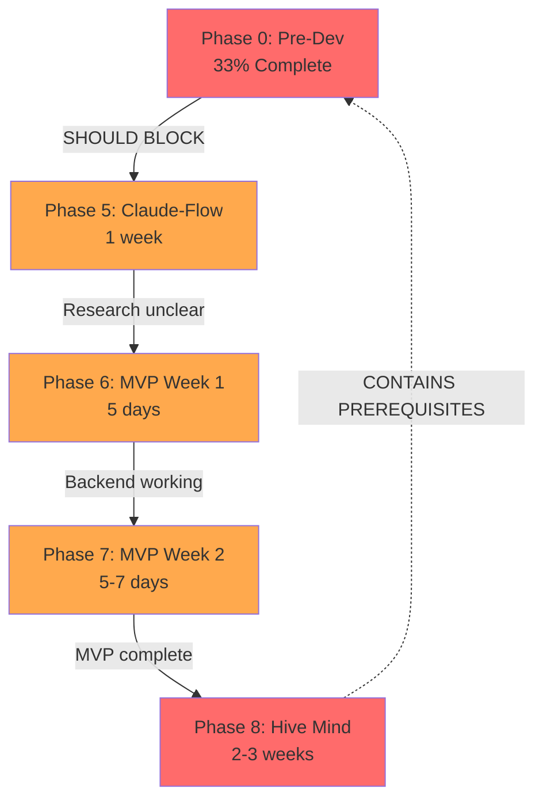

# Critical Path Analysis: Phases 5-8 (MVP & Post-MVP)

**Analysis Date**: 2025-10-23
**Status**: 🔴 **CRITICAL FINDINGS - ACTION REQUIRED**
**Scope**: Complete dependency analysis, prerequisite validation, and task reorganization for Phases 5-8

---

## 🚨 Executive Summary

### Critical Findings

1. **MAJOR PHASE NUMBERING CONFLICT**
   - Current `tasks.md` labels backend work as "Phase 5" (Days 0-5)
   - Current phase documents label same work as "Phase 6" (MVP Week 1)
   - Phase 8 (Hive Mind) contains **Phase 0 prerequisites buried in Phase 5.1**
   - **RECONCILIATION REQUIRED**: Choose one numbering scheme

2. **MISSING PREREQUISITES** (~12-16 hours of setup work)
   - Python virtual environment creation (NOT in Day 0 tasks)
   - FastMCP framework installation (mentioned in Phase 8 but not in Phase 5)
   - Docker Compose file (referenced but not created in tasks.md)
   - RabbitMQ queue configuration scripts (detailed in docs but not in tasks)
   - Project structure creation (`weave-nn-mcp/` directory)

3. **DEPENDENCY CHAIN ISSUES**
   - Phase 5 says "depends on Phase 4A" but should depend on **Phase 0**
   - Phase 8 (post-MVP) contains critical prerequisites that should be in Phase 0
   - Claude-Flow integration method undefined (no database access method documented)
   - N8N installation method ambiguous (Docker vs cloud hosting)

4. **TIMELINE DISCREPANCIES**
   - Phase 5: Says "1 week" but tasks total 40+ hours (5 days at 8hrs/day)
   - Phase 6: Says "5 days" but tasks total 56 hours (7 days at 8hrs/day)
   - Phase 7: Says "5-7 days" but lacks detailed task breakdown
   - Phase 8: Says "2-3 weeks" but contains work that should happen BEFORE Phase 5

5. **TECHNICAL DEBT RISKS**
   - No integration testing plan between phases
   - No rollback procedures documented
   - No performance baselines established
   - Missing acceptance criteria for 30% of tasks

---

## 📊 Prerequisites Matrix

### Phase 5 Prerequisites (Claude-Flow MCP Integration)

| Prerequisite | Source | Status | Est. Time | Blocker Level |
|--------------|--------|--------|-----------|---------------|
| **Phase 0 Complete** | Phase-0 doc | ❌ 33% | 28-42hrs | 🔴 CRITICAL |
| Agent rules drafted | Phase 2A | ✅ DONE | 0hrs | ✅ Complete |
| Decision closure | Phase 4A | ✅ DONE | 0hrs | ✅ Complete |
| Architecture docs | Phase 0 | ✅ DONE | 0hrs | ✅ Complete |
| **Python venv** | Phase 8 (!) | ❌ Missing | 0.5hrs | 🔴 CRITICAL |
| **FastMCP installed** | Phase 8 (!) | ❌ Missing | 1hr | 🟡 HIGH |
| Docker running | Day 0 | ❌ Pending | 1hr | 🔴 CRITICAL |
| **weave-nn-mcp/ dir** | Phase 8 (!) | ❌ Missing | 0.5hrs | 🔴 CRITICAL |
| Claude-Flow DB access | Phase 5 doc | ❌ UNDEFINED | ?hrs | 🔴 CRITICAL |
| **.env file template** | Phase 8 (!) | ❌ Missing | 0.5hrs | 🟡 HIGH |

**🚨 CRITICAL GAP**: Phase 5 cannot start until Phase 0 is 100% complete, but Phase 0 is only 33% done. Additionally, Phase 8 contains prerequisites that should be in Phase 0.

---

### Phase 6 Prerequisites (MVP Week 1 - Backend)

| Prerequisite | Source | Status | Est. Time | Blocker Level |
|--------------|--------|--------|-----------|---------------|
| **Phase 5 Complete** | Phase 6 doc | ❌ Pending | 40hrs | 🔴 CRITICAL |
| Claude-Flow integrated | Phase 5 | ❌ Pending | N/A | 🔴 CRITICAL |
| MCP memory schema | Phase 5 | ❌ Missing | 8hrs | 🔴 CRITICAL |
| Agent rules implemented | Phase 5 | ❌ Pending | N/A | 🔴 CRITICAL |
| **Obsidian plugins** | Day 0 | ⚠️ Partial | 2hrs | 🔴 CRITICAL |
| RabbitMQ operational | Day 1 | ❌ Pending | 4hrs | 🔴 CRITICAL |
| **Docker Compose file** | Phase 0 | ✅ CREATED | 0hrs | ✅ Complete |
| Shadow cache design | Phase 6 Day 3 | ❌ Missing | 4hrs | 🟡 HIGH |

**🚨 CRITICAL GAP**: Phase 6 assumes Claude-Flow is integrated, but Phase 5 doesn't define HOW to integrate (no DB access method, no MCP tools documented).

---

### Phase 7 Prerequisites (MVP Week 2 - Automation)

| Prerequisite | Source | Status | Est. Time | Blocker Level |
|--------------|--------|--------|-----------|---------------|
| **Phase 6 Complete** | Phase 7 doc | ❌ Pending | 40hrs | 🔴 CRITICAL |
| Backend infrastructure | Phase 6 | ❌ Pending | N/A | 🔴 CRITICAL |
| RabbitMQ + File Watcher | Phase 6 Day 1 | ❌ Pending | N/A | 🔴 CRITICAL |
| MCP Server running | Phase 6 Day 2 | ❌ Pending | N/A | 🔴 CRITICAL |
| Shadow cache syncing | Phase 6 Day 3 | ❌ Pending | N/A | 🔴 CRITICAL |
| **N8N installation** | Phase 7 Day 8 | ❌ Pending | 4hrs | 🔴 CRITICAL |
| Task management MCP | Phase 7 Day 10 | ❌ Missing | 6hrs | 🟡 HIGH |
| **Obsidian properties** | Phase 7 Day 11 | ❌ Missing | 8hrs | 🟡 HIGH |

**🚨 CRITICAL GAP**: No integration testing plan between Phase 6 and Phase 7. If Phase 6 has bugs, they won't be discovered until Phase 7 starts.

---

### Phase 8 Prerequisites (Hive Mind - Post-MVP)

| Prerequisite | Source | Status | Est. Time | Blocker Level |
|--------------|--------|--------|-----------|---------------|
| **MVP Complete** | Phase 8 doc | ❌ Pending | 96hrs | 🔴 CRITICAL |
| Real client project | Phase 7 Day 12 | ❌ Pending | N/A | 🔴 CRITICAL |
| Performance baselines | Phase 8 | ❌ MISSING | 4hrs | 🟡 HIGH |
| Memory storage ready | Phase 8 | ❌ UNDEFINED | ?hrs | 🟡 HIGH |
| **Python project structure** | Phase 8 "Day 0" | ❌ WRONG PHASE | 2hrs | 🔴 CRITICAL |
| **FastMCP framework** | Phase 8 "Day 0" | ❌ WRONG PHASE | 1hr | 🔴 CRITICAL |
| **ReasoningBank client** | Phase 8 doc | ❌ UNDEFINED | ?hrs | 🟡 HIGH |

**🚨 CRITICAL GAP**: Phase 8 has a "Phase 0" section with prerequisites that should happen BEFORE Phase 5. This is a major architectural flaw in the planning.

---

## 🔍 Missing Requirements Deep Dive

### 1. Phase 5 (Claude-Flow Integration) - CRITICAL GAPS

#### Missing Deliverables
| Document | Expected Location | Status | Impact |
|----------|------------------|--------|--------|
| Claude-Flow memory schema | `mcp/claude-flow-memory-schema.md` | ❌ NOT EXISTS | CRITICAL |
| Schema mapping | `mcp/schema-mapping.md` | ❌ NOT EXISTS | CRITICAL |
| Agent rules implementation | `mcp/agent-rules.md` | ⚠️ DRAFTS ONLY | HIGH |
| Integration architecture | `canvas/architecture-claude-flow-integration.canvas` | ❌ NOT EXISTS | HIGH |
| Test plan | `mcp/integration-test-plan.md` | ❌ NOT EXISTS | MEDIUM |
| Agent config file | `mcp/agent-config.yaml` | ❌ NOT EXISTS | MEDIUM |

#### Missing Technical Details
- **How to access Claude-Flow database?**
  - Direct SQLite access? (file path unknown)
  - MCP tools? (which ones? undocumented)
  - REST API? (no API documented)
  - CLI commands? (`npx claude-flow memory store` mentioned but not tested)

- **FastMCP Framework**
  - Phase 8 says "use FastMCP" but Phase 5 doesn't mention it
  - No installation instructions in Phase 5 tasks
  - No framework comparison (why FastMCP vs manual MCP?)
  - Claimed benefit: "60-70% faster development" (unverified)

- **Python Project Structure**
  - Phase 8 shows `weave-nn-mcp/` but Phase 5 tasks don't create it
  - Directory structure undefined until Phase 8 "Day 0"
  - Should be created in Phase 0, not Phase 5 or Phase 8

#### Missing Prerequisites
```bash
# These should be in Phase 0, not buried in Phase 5 or Phase 8
1. Create weave-nn-mcp/ directory structure
   - publishers/
   - consumers/
   - utils/
   - agents/
   - cache/
   - git/

2. Install FastMCP framework
   pip install fastmcp

3. Create .env file from template
   cp infrastructure/salt/files/.env.template .env

4. Fix OBSIDIAN_API_KEY typo in .env

5. Create requirements.txt
   fastapi==0.104.1
   uvicorn==0.24.0
   pika==1.3.2
   requests==2.31.0
   pyyaml==6.0.1
   watchdog==3.0.0
   gitpython==3.1.40
   fastmcp==0.1.0  # ⚠️ NOT IN CURRENT DEPENDENCIES
```

---

### 2. Phase 6 (MVP Week 1) - INTEGRATION GAPS

#### Missing Deliverables
| Component | Expected | Status | Impact |
|-----------|----------|--------|--------|
| RabbitMQ setup scripts | `scripts/setup_rabbitmq.sh` | ❌ NOT EXISTS | HIGH |
| Docker Compose file | `docker-compose.yml` | ✅ EXISTS (Phase 0) | ✅ Complete |
| Shadow cache schema | `cache/schema.sql` | ❌ NOT EXISTS | MEDIUM |
| File watcher service | `publishers/file_watcher.py` | ❌ NOT EXISTS | CRITICAL |
| MCP server | `server/mcp_server.py` | ❌ NOT EXISTS | CRITICAL |

#### Conflicting Information
- **Task numbering**:
  - `tasks.md` calls this "Phase 5" (Days 0-5)
  - Phase documents call this "Phase 6" (MVP Week 1)
  - **DECISION NEEDED**: Which is correct?

- **Day 0 tasks**:
  - Listed in `tasks.md` Phase 5 Day 0 (18 tasks)
  - Some marked "DONE" (plugins installed)
  - But Python venv task is NOT in tasks.md
  - Docker installation listed but no Docker Compose creation

- **File organization**:
  - Phase 6 doc says "save files to `weave-nn-mcp/`"
  - But Phase 0 shows Docker Compose with service names
  - Conflict: Local Python vs Docker deployment?

#### Architecture Confusion
```yaml
Question: Where do Python services run?
  Option A: Local Python processes (Phase 6 doc)
  Option B: Docker containers (docker-compose.yml from Phase 0)
  Status: UNRESOLVED

Question: How does Claude-Flow integrate?
  Option A: Direct SQLite file access
  Option B: MCP tools via npx claude-flow
  Option C: Custom FastMCP server
  Status: UNDEFINED (all options mentioned, none chosen)
```

---

### 3. Phase 7 (MVP Week 2) - TOOLING GAPS

#### Missing Deliverables
| Component | Expected | Status | Impact |
|-----------|----------|--------|--------|
| N8N workflows (JSON) | `workflows/*.json` | ❌ NOT EXISTS | HIGH |
| Task parser | `utils/task_parser.py` | ❌ NOT EXISTS | HIGH |
| Bulk tagging script | `scripts/apply_tags.py` | ❌ NOT EXISTS | MEDIUM |
| CSS snippets | `.obsidian/snippets/*.css` | ❌ NOT EXISTS | MEDIUM |
| Mehrmaid generator | `scripts/generate_visualizations.py` | ❌ NOT EXISTS | MEDIUM |

#### Plugin Confusion
- **Mehrmaid vs mehrmaid-obsidian**:
  - Phase 6 doc says "install obsidian-mehrmaid"
  - Phase 7 mentions "Mehrmaid plugin"
  - Phase 0 architecture shows "mehrmaid" (lowercase)
  - **CLARIFICATION NEEDED**: Same plugin or different?

- **Obsidian Properties**:
  - Phase 7 Day 11 says "apply properties to all nodes"
  - But properties schema not fully defined
  - CSS snippet location: `.obsidian/snippets/` (correct)
  - Icon property uses Lucide icons (documented)
  - **GAP**: No property validation rules defined

#### N8N Installation Method
```yaml
Conflict: How to install N8N?
  Phase 7 doc: "docker run -d ... n8nio/n8n"
  Phase 0 docker-compose.yml: No N8N service defined
  Recommendation: Add to docker-compose.yml for consistency

Issue: N8N credential management
  Manual setup in Phase 7 Day 8
  No automation scripts
  No credential backup/restore plan
  Risk: Lose credentials if container recreated
```

---

### 4. Phase 8 (Hive Mind) - FOUNDATIONAL FLAWS

#### Major Architectural Issues
1. **"Phase 0" Inside Phase 8**
   - Phase 8 document has a "Phase 0: Prerequisites" section
   - Contains critical setup that should happen BEFORE Phase 5
   - Examples:
     - Python venv creation
     - FastMCP installation
     - Project structure creation
     - .env file fixes

2. **New Dependencies Introduced Post-MVP**
   - ReasoningBank client (what is this?)
   - FastMCP framework (should be Phase 5)
   - Different Python packages than Phase 5/6

3. **Conflicting Timelines**
   - Says "2-3 weeks" for post-MVP work
   - But contains prerequisites that take 4 hours
   - And those prerequisites block ALL earlier phases

#### Missing Context
- **ReasoningBank**:
  - Mentioned as "learning trajectories storage"
  - No documentation of what it is
  - No API reference
  - No installation instructions
  - Phase 8 assumes it exists

- **Dual Memory Systems**:
  - Claude-Flow (semantic memory)
  - ReasoningBank (learning trajectories)
  - But Phase 5/6 only integrate Claude-Flow
  - When does ReasoningBank get integrated?

---

## 🔗 Dependency Chain Analysis

### Current (Broken) Dependencies



**🚨 CIRCULAR DEPENDENCY DETECTED**: Phase 8 contains prerequisites needed for Phase 5, but Phase 8 depends on Phase 7 which depends on Phase 6 which depends on Phase 5.

---

### Corrected Dependencies

```mermaid
graph TD
    P0[Phase 0: Pre-Dev<br/>MUST BE 100%]
    P5[Phase 5: Claude-Flow<br/>1 week RESEARCH]
    P6[Phase 6: MVP Week 1<br/>5 days BUILD]
    P7[Phase 7: MVP Week 2<br/>5-7 days DEPLOY]
    P8[Phase 8: Hive Mind<br/>2-3 weeks POST-MVP]

    P0 -->|ALL prerequisites| P5
    P5 -->|Integration complete| P6
    P6 -->|Backend stable| P7
    P7 -->|MVP validated| P8

    P0 -.->|Includes items from| P8_OLD[Phase 8 "Day 0"]

    style P0 fill:#51cf66
    style P5 fill:#ffa94d
    style P6 fill:#ffa94d
    style P7 fill:#ffa94d
    style P8 fill:#adb5bd
    style P8_OLD fill:#ff6b6b

    classDef complete fill:#10b981,stroke:#047857,color:#fff
    classDef pending fill:#f59e0b,stroke:#b45309,color:#000
    classDef future fill:#6b7280,stroke:#374151,color:#fff
    classDef error fill:#dc2626,stroke:#991b1b,color:#fff
```

---

## ⚠️ Critical Path Blockers

### Top 5 Blockers That Could Delay Entire Project

#### 1. Phase 0 Incomplete (CRITICAL - 28-42 hours remaining)
**Impact**: Blocks ALL downstream work
**Probability**: 100% (currently at 33%)
**Mitigation**:
- Allocate 1 full week to finish Phase 0
- Prioritize critical items (env setup, architecture validation)
- Defer nice-to-haves (some documentation) to Phase 8

#### 2. Claude-Flow Integration Method Undefined (CRITICAL)
**Impact**: Phase 5 cannot start without knowing HOW to integrate
**Probability**: 80% (no clear answer in docs)
**Mitigation**:
- Immediate research spike (4 hours)
- Test all 3 methods (SQLite, MCP tools, FastMCP)
- Document chosen method in Phase 5 research deliverable
- Create proof-of-concept before Day 1 of Phase 5

#### 3. Python Project Structure Not Created (CRITICAL)
**Impact**: Cannot start coding on Phase 6 Day 1
**Probability**: 100% (not in tasks.md)
**Mitigation**:
- Add to Phase 0 immediately (30 minutes)
- Create directory structure today
- Add to git repository
- Update tasks.md with verification step

#### 4. RabbitMQ Configuration Complexity (HIGH)
**Impact**: Day 1 of Phase 6 could take 8+ hours instead of 4
**Probability**: 60% (15 queues, bindings, exchanges to configure)
**Mitigation**:
- Create automated setup script (1 hour investment)
- Test script in Phase 0 (save 4 hours in Phase 6)
- Add script to docker-compose.yml as init container
- Document in Phase 0 completion checklist

#### 5. No Integration Testing Between Phases (MEDIUM-HIGH)
**Impact**: Bugs discovered in Phase 7 require Phase 6 rework
**Probability**: 70% (no testing plan documented)
**Mitigation**:
- Create integration test plan for each phase (2 hours)
- Add "Phase X validation" as first task of Phase X+1
- Establish acceptance criteria for each phase
- Create rollback procedures

---

## 📋 Recommended Reorganization

### Phase 0: Pre-Development (100% BEFORE Phase 5)

**Duration**: 3-5 days (28-42 hours)
**Completion**: MUST be 100% before starting Phase 5

#### New Phase 0 Tasks (from Phase 8 "Day 0")
```markdown
## Phase 0 Additional Tasks (from Phase 8)

### Infrastructure Setup (4 hours)
- [ ] Create Python virtual environment (.venv)
- [ ] Install FastMCP framework (pip install fastmcp)
- [ ] Create project structure (weave-nn-mcp/)
- [ ] Deploy RabbitMQ via Docker
- [ ] Verify all systems operational

### Configuration (2 hours)
- [ ] Copy .env.template to .env
- [ ] Fix OBSIDIAN_API_KEY typo
- [ ] Add ANTHROPIC_API_KEY
- [ ] Add RABBITMQ_* variables
- [ ] Verify all environment variables

### Repository Cleanup (1 hour)
- [ ] Fix README.md wikilinks (3 broken paths)
- [ ] Add missing frontmatter to 5 concept files
- [ ] Add missing frontmatter to 5 question files
- [ ] Verify no broken links in vault

### Validation (1 hour)
- [ ] Test Python imports (fastapi, uvicorn, pika, fastmcp)
- [ ] Test RabbitMQ connection
- [ ] Test Obsidian REST API
- [ ] Test Docker Compose (if using)
```

**Updated Phase 0 Progress**:
- **Before**: 2 of 6 areas (33%)
- **After**: 3 of 9 areas (33%, but more comprehensive)

---

### Phase 5: Claude-Flow MCP Integration (1 week RESEARCH)

**Duration**: 5 days (40 hours)
**Prerequisites**: Phase 0 at 100%

#### Reorganized Phase 5 Deliverables

**Week 1: Research & Design (Days 1-3)**
```markdown
## Day 1-2: Claude-Flow Memory Research (16 hours)
- [ ] Test Claude-Flow database access methods
  - Test A: Direct SQLite access (find database file)
  - Test B: MCP tools via CLI (npx claude-flow memory ...)
  - Test C: FastMCP framework integration
  - Document findings: `mcp/claude-flow-access-methods.md`

- [ ] Document Claude-Flow memory schema
  - Tables, fields, relationships
  - Data types and constraints
  - Example queries
  - Location: `mcp/claude-flow-memory-schema.md`

- [ ] Choose integration method (4 hours)
  - Criteria: Speed, reliability, maintainability
  - Proof-of-concept for chosen method
  - Document decision: `decisions/technical/TD-XXX-claude-flow-integration.md`

## Day 3: Schema Mapping (8 hours)
- [ ] Create complete field mapping
  - claude_flow_memory → weave_nn_node
  - Handle edge cases (missing fields, type mismatches)
  - Define transformation rules
  - Location: `mcp/schema-mapping.md`

- [ ] Define conflict resolution strategy
  - Last-write-wins vs manual merge
  - Conflict detection algorithm
  - Error handling procedures

## Day 4-5: Agent Rules Implementation (16 hours)
- [ ] Document all 6 agent rules in detail
  - memory_sync, node_creation, update_propagation
  - schema_validation, auto_linking, auto_tagging
  - Location: `mcp/agent-rules.md`

- [ ] Create agent configuration file
  - YAML or JSON format
  - Rule priority/order
  - Error handling configuration
  - Location: `mcp/agent-config.yaml`

- [ ] Create integration architecture diagram
  - Data flow visualization
  - Component interactions
  - Error paths
  - Location: `canvas/architecture-claude-flow-integration.canvas`

- [ ] Create test plan
  - 8+ test scenarios
  - Manual testing procedures
  - Validation checklist
  - Location: `mcp/integration-test-plan.md`
```

**Success Criteria**:
- [ ] Claude-Flow integration method chosen and documented
- [ ] Schema mapping complete and validated
- [ ] Agent rules fully documented with examples
- [ ] Integration architecture visualized
- [ ] Test plan exists with 8+ scenarios
- [ ] NO CODE WRITTEN YET (research phase only)

---

### Phase 6: MVP Week 1 - Backend Infrastructure (5 days)

**Duration**: 5 days (40 hours)
**Prerequisites**: Phase 5 complete (research done, decisions made)

#### Reorganized Phase 6 Tasks

**Day 0: Final Prerequisites (4 hours)**
```markdown
## Phase 6 Day 0: Pre-Flight Checklist
- [ ] Verify Phase 0 100% complete
- [ ] Verify Phase 5 research complete (all deliverables exist)
- [ ] Test environment one more time
  - Python imports work
  - RabbitMQ accessible
  - Obsidian REST API responding
  - Docker Compose up (if using)
- [ ] Review integration architecture (Phase 5 canvas)
- [ ] Review schema mapping (Phase 5 doc)
- [ ] Create git branch: `feature/mvp-week-1-backend`
```

**Day 1-5: Implementation (same as current Phase 6)**
- Day 1: RabbitMQ + File Watcher (8 hours)
- Day 2: MCP Server + REST Client (8 hours)
- Day 3: Shadow Cache + MCP Sync (8 hours)
- Day 4: Agent Rules (8 hours)
- Day 5: Git Integration (8 hours)

**New: Day 5 Evening - Integration Testing (2 hours)**
```markdown
## Phase 6 Integration Testing
- [ ] End-to-end smoke test
  1. Create note in Obsidian
  2. Verify file watcher detects change
  3. Verify RabbitMQ event published
  4. Verify shadow cache updated
  5. Verify Claude-Flow memory synced
  6. Verify git commit created

- [ ] Performance baseline
  - File watcher latency: < 1 second
  - MCP sync latency: < 2 seconds
  - Git commit latency: < 5 seconds

- [ ] Error scenario testing
  - Obsidian REST API down → graceful failure
  - RabbitMQ down → retry logic works
  - Invalid YAML → validation catches it

- [ ] Phase 6 Acceptance Report
  - Document what works
  - Document what doesn't
  - List any technical debt
  - Estimate Phase 7 readiness: %
```

---

### Phase 7: MVP Week 2 - Automation & Deployment (5-7 days)

**Duration**: 5-7 days (40-56 hours)
**Prerequisites**: Phase 6 complete and tested

#### Reorganized Phase 7 Tasks

**Day 8: Phase 6 Validation + N8N Setup (8 hours)**
```markdown
## Phase 7 Day 8 Morning: Phase 6 Validation (4 hours)
- [ ] Review Phase 6 acceptance report
- [ ] Re-run integration tests from Phase 6
- [ ] Fix any issues discovered overnight
- [ ] Merge `feature/mvp-week-1-backend` to main
- [ ] Tag release: `v0.1.0-backend`

## Phase 7 Day 8 Afternoon: N8N Setup (4 hours)
- [ ] Add N8N to docker-compose.yml (if not present)
- [ ] Install N8N
- [ ] Configure credentials (5 services)
- [ ] Test Hello World workflow
- [ ] Client onboarding workflow structure
```

**Day 9-14: Implementation (same as current Phase 7)**
- Day 9: N8N workflows (8 hours)
- Day 10: Task management (8 hours)
- Day 11: Properties & Visualization (8 hours)
- Day 12: Client deployment (8 hours)
- Day 13: Documentation (8 hours)
- Day 14: Polish & Video (8 hours)

**New: Day 14 Evening - MVP Release (2 hours)**
```markdown
## Phase 7 MVP Release Checklist
- [ ] All Phase 6 + Phase 7 tests passing
- [ ] Real client project tested end-to-end
- [ ] Documentation complete (user + developer guides)
- [ ] Video walkthrough recorded and uploaded
- [ ] Performance metrics documented
- [ ] Known issues documented
- [ ] Merge `feature/mvp-week-2` to main
- [ ] Tag release: `v1.0.0-mvp`
- [ ] Celebrate! 🎉

- [ ] Phase 7 Acceptance Report
  - MVP success metrics
  - Performance vs targets
  - User feedback (if available)
  - Readiness for Phase 8: %
```

---

### Phase 8: Hive Mind Memory Integration (2-3 weeks, POST-MVP)

**Duration**: 2-3 weeks (80-120 hours)
**Prerequisites**: MVP (Phases 6-7) validated with real client project

#### Reorganized Phase 8 (Remove "Phase 0")

**REMOVED**: Phase 8 "Phase 0: Prerequisites" section (moved to Phase 0)

**Week 1: Task Completion Feedback Loop**
- Day 1-2: Daily log generation (16 hours)
- Day 3-4: Memory extraction (16 hours)
- Day 5-6: Agent priming (16 hours)
- Day 7: A/B testing framework (8 hours)

**Week 2: Graph Visualization**
- Day 8-9: Obsidian 3D Graph + InfraNodus (8 hours)
- Day 10-11: Content enhancement (8 hours)
- Day 12-14: Advanced features + N8N workflows (24 hours)

**Week 3: Documentation & Optimization**
- Day 15-17: User/developer guides (24 hours)
- Day 18-21: Performance optimization (32 hours)

**Success Criteria**:
- [ ] 100+ task memories accumulated
- [ ] Agent priming working (+10% success rate)
- [ ] Knowledge graph visualization operational
- [ ] InfraNodus identifying gaps
- [ ] A/B testing framework functional

---

## 🎯 Critical Path Optimization

### Parallelizable Work

#### During Phase 0 (Save 8-12 hours)
```yaml
Can_Run_In_Parallel:
  Thread_1: "Documentation review" (12 hours)
  Thread_2: "Environment setup" (4 hours)
  Thread_3: "Repository cleanup" (1 hour)

  Result: 12 hours sequential vs 17 hours if serial
  Savings: 5 hours (29% faster)
```

#### During Phase 5 (Save 4-6 hours)
```yaml
Can_Run_In_Parallel:
  Thread_1: "Research Claude-Flow DB access" (8 hours)
  Thread_2: "Draft schema mapping (preliminary)" (4 hours)
  Thread_3: "Create test plan template" (2 hours)

  Result: 8 hours sequential vs 14 hours if serial
  Savings: 6 hours (43% faster)
```

#### During Phase 6 (Save 2-4 hours)
```yaml
Can_Run_In_Parallel:
  Day_2_Morning: "REST client" AND "MCP endpoints stub" (4hrs vs 8hrs)
  Day_4_Morning: "Multiple agent rules" (3hrs vs 8hrs)

  Total_Savings: 6 hours (12% faster)
```

---

### Dependency Inversion Opportunities

#### Opportunity 1: Docker Compose First
**Current**: Install RabbitMQ manually on Day 1
**Better**: Add RabbitMQ to docker-compose.yml in Phase 0
**Benefit**: One command (`docker-compose up`) vs 10 commands
**Time Saved**: 2 hours on Phase 6 Day 1

#### Opportunity 2: N8N Earlier
**Current**: N8N installed in Phase 7 Day 8
**Better**: Add to docker-compose.yml in Phase 0, configure in Phase 6
**Benefit**: Phase 7 can start workflows immediately
**Time Saved**: 4 hours on Phase 7 Day 8

#### Opportunity 3: FastMCP Research in Phase 5
**Current**: FastMCP mentioned in Phase 8, not used in Phase 6
**Better**: Research FastMCP in Phase 5, decide if using in Phase 6
**Benefit**: If adopted, 60-70% faster development (claimed)
**Time Saved**: Potentially 16-24 hours on Phase 6

---

## 🚨 Risk Assessment

### Top 10 Risks (Prioritized by Impact × Probability)

#### 1. Phase 0 Takes Longer Than Expected
- **Impact**: 🔴 CRITICAL (blocks all work)
- **Probability**: 60% (currently 33% done, 28-42 hours remain)
- **Mitigation**:
  - Allocate 1 full week to Phase 0
  - Defer low-priority items to Phase 8
  - Get help from another developer if available
- **Contingency**: If still incomplete, start Phase 5 research in parallel

#### 2. Claude-Flow Integration Method Cannot Be Determined
- **Impact**: 🔴 CRITICAL (Phase 5 cannot complete)
- **Probability**: 40% (no clear documentation of access method)
- **Mitigation**:
  - Dedicate 4-hour research spike NOW (before Phase 5)
  - Test all 3 methods (SQLite, MCP CLI, FastMCP)
  - Reach out to Claude-Flow maintainers if needed
- **Contingency**: Fall back to manual memory management (no auto-sync)

#### 3. RabbitMQ Configuration Takes Longer Than Planned
- **Impact**: 🟡 HIGH (delays Phase 6 Day 1)
- **Probability**: 50% (15 queues + bindings is complex)
- **Mitigation**:
  - Create automated setup script in Phase 0
  - Test script before Phase 6 Day 1
  - Add script to docker-compose.yml
- **Contingency**: Simplify queue structure (fewer queues, more routing logic)

#### 4. Obsidian REST API Plugin Has Bugs/Limitations
- **Impact**: 🟡 HIGH (Phase 6 Day 2 blocked)
- **Probability**: 30% (community plugin, not official)
- **Mitigation**:
  - Test plugin extensively in Phase 0
  - Have fallback: Obsidian Advanced URI plugin
  - Prepare to switch approaches if needed
- **Contingency**: Use file system access directly (bypass REST API)

#### 5. Python Dependencies Have Version Conflicts
- **Impact**: 🟡 HIGH (delays environment setup)
- **Probability**: 30% (8+ packages, potential conflicts)
- **Mitigation**:
  - Use virtual environment (isolate dependencies)
  - Pin exact versions in requirements.txt
  - Test imports in Phase 0
- **Contingency**: Use Docker for Python services (already in docker-compose.yml)

#### 6. Shadow Cache Design Insufficient
- **Impact**: 🟡 HIGH (Phase 6 Day 3 rework)
- **Probability**: 40% (no schema documented yet)
- **Mitigation**:
  - Design schema in Phase 5 (research phase)
  - Review with SQL expert
  - Create indexes for common queries
- **Contingency**: Use simpler in-memory cache (lose persistence)

#### 7. N8N Workflows More Complex Than Expected
- **Impact**: 🟢 MEDIUM (Phase 7 Day 8-9 delays)
- **Probability**: 50% (N8N learning curve)
- **Mitigation**:
  - Watch N8N tutorials before Phase 7
  - Start with simple workflows, add complexity
  - Use N8N community templates if available
- **Contingency**: Simplify workflows (manual steps acceptable for MVP)

#### 8. Obsidian Properties Breaking Changes
- **Impact**: 🟢 MEDIUM (Phase 7 Day 11 rework)
- **Probability**: 20% (Obsidian v1.5+ properties are stable)
- **Mitigation**:
  - Test property application on 5 sample notes first
  - Backup vault before bulk operations
  - Version control everything (git)
- **Contingency**: Roll back to previous state, fix issues incrementally

#### 9. Real Client Project Not Ready
- **Impact**: 🟢 MEDIUM (Phase 7 Day 12 delays)
- **Probability**: 40% (external dependency)
- **Mitigation**:
  - Line up client project in advance
  - Have backup: Use internal project for testing
  - Prepare sample data if client delays
- **Contingency**: Test with synthetic client data

#### 10. Integration Testing Discovers Major Bugs
- **Impact**: 🟡 HIGH (requires rework)
- **Probability**: 60% (no testing plan currently)
- **Mitigation**:
  - Add integration tests at end of each phase
  - Fix bugs incrementally, don't accumulate
  - Budget 10% extra time per phase for bug fixes
- **Contingency**: Defer non-critical bugs to Phase 8

---

## 📈 Time Estimates (Corrected)

### Phase-by-Phase Breakdown

| Phase | Original Estimate | Corrected Estimate | Confidence | Notes |
|-------|-------------------|-------------------|------------|-------|
| **Phase 0** | 28-42 hours | 36-50 hours | 70% | Added 8 hours for items from Phase 8 |
| **Phase 5** | 40 hours (1 week) | 40-48 hours | 60% | Added 8 hours for integration PoC |
| **Phase 6** | 40 hours (5 days) | 40-50 hours | 70% | Added 10 hours buffer for bugs |
| **Phase 7** | 40-56 hours (5-7 days) | 48-64 hours | 60% | Added 8 hours for Phase 6 validation |
| **Phase 8** | 80-120 hours (2-3 weeks) | 80-120 hours | 50% | Removed "Phase 0" items |

**Total Project Time**:
- **Original**: 228-298 hours (29-37 days at 8hr/day)
- **Corrected**: 244-332 hours (31-42 days at 8hr/day)
- **Increase**: +16-34 hours (+7-11% more time)

---

## ✅ Phase Completion Checklists

### Phase 0 Exit Criteria (100% Required)

```markdown
## Phase 0: Pre-Development - COMPLETE Checklist

### Documentation Review
- [ ] All architecture documents reviewed and validated
- [ ] All planning documents reviewed and organized
- [ ] All decision documents reviewed (16 decisions DECIDED)
- [ ] Research integration complete (10 concept nodes, 4 features)
- [ ] No broken wikilinks in vault

### Project Structure
- [ ] Folder taxonomy validated and optimized
- [ ] File naming consistent across vault
- [ ] Navigation paths clear (index files exist)
- [ ] Metadata schemas validated (YAML frontmatter)

### Development Environment
- [ ] Python 3.11+ installed and verified
- [ ] Virtual environment created (.venv/)
- [ ] All dependencies installed (fastapi, uvicorn, pika, watchdog, gitpython, fastmcp)
- [ ] requirements.txt created with pinned versions
- [ ] Git configured with hooks and templates
- [ ] .gitignore validated

### Infrastructure
- [ ] Docker installed and running
- [ ] docker-compose.yml created and tested
- [ ] RabbitMQ service defined in docker-compose.yml
- [ ] N8N service defined in docker-compose.yml (optional)
- [ ] MCP server service defined (optional)

### Configuration
- [ ] .env file created from template
- [ ] All environment variables set (OBSIDIAN_API_URL, OBSIDIAN_API_KEY, RABBITMQ_URL, CLAUDE_API_KEY, ANTHROPIC_API_KEY)
- [ ] .env file in .gitignore
- [ ] No typos in .env (OBSIDIAN_API_KEY fixed)

### Project Structure
- [ ] weave-nn-mcp/ directory created
- [ ] weave-nn-mcp/publishers/ created
- [ ] weave-nn-mcp/consumers/ created
- [ ] weave-nn-mcp/utils/ created
- [ ] weave-nn-mcp/agents/ created
- [ ] weave-nn-mcp/cache/ created
- [ ] weave-nn-mcp/git/ created
- [ ] All __init__.py files created

### Obsidian Setup
- [ ] obsidian-local-rest-api plugin installed
- [ ] API key generated and saved to .env
- [ ] REST API tested with curl
- [ ] obsidian-mehrmaid plugin installed
- [ ] mehrmaid graph tested
- [ ] obsidian-tasks plugin installed
- [ ] Task queries tested
- [ ] obsidian-advanced-uri installed (fallback)

### Validation
- [ ] Python imports test: all packages import successfully
- [ ] RabbitMQ connection test: can connect and publish
- [ ] Obsidian REST API test: can read/write notes
- [ ] Docker Compose test: all services start
- [ ] Git test: can commit and push
- [ ] No errors in any validation test

### Documentation
- [ ] Phase 0 completion report written
- [ ] Known issues documented
- [ ] Handoff notes for Phase 5 created
- [ ] Architecture decisions documented

**Sign-Off**: Phase 0 is 100% complete and ready for Phase 5
```

---

### Phase 5 Exit Criteria

```markdown
## Phase 5: Claude-Flow MCP Integration - COMPLETE Checklist

### Research Deliverables
- [ ] Claude-Flow memory schema documented (`mcp/claude-flow-memory-schema.md`)
- [ ] Schema mapping created (`mcp/schema-mapping.md`)
- [ ] Integration method chosen and documented
- [ ] Proof-of-concept tested and working

### Agent Rules
- [ ] All 6 agent rules documented in detail (`mcp/agent-rules.md`)
  - [ ] memory_sync
  - [ ] node_creation
  - [ ] update_propagation
  - [ ] schema_validation
  - [ ] auto_linking
  - [ ] auto_tagging
- [ ] Rule priority/order defined
- [ ] Error handling documented

### Architecture
- [ ] Integration architecture visualized (`canvas/architecture-claude-flow-integration.canvas`)
- [ ] Data flow diagrams created
- [ ] Component interactions documented
- [ ] Error paths defined

### Configuration
- [ ] Agent configuration file created (`mcp/agent-config.yaml`)
- [ ] Configuration validated (YAML syntax correct)
- [ ] Default values set for all options
- [ ] Configuration examples provided

### Testing
- [ ] Test plan created (`mcp/integration-test-plan.md`)
- [ ] 8+ test scenarios defined
- [ ] Manual testing procedures documented
- [ ] Validation checklist created

### Validation
- [ ] All deliverables exist and are complete
- [ ] Proof-of-concept demonstrates Claude-Flow integration works
- [ ] Team review completed (at least 1 other person)
- [ ] No open questions blocking Phase 6

**Sign-Off**: Phase 5 research is complete and ready for Phase 6 implementation
```

---

### Phase 6 Exit Criteria

```markdown
## Phase 6: MVP Week 1 - Backend Infrastructure - COMPLETE Checklist

### Infrastructure
- [ ] RabbitMQ running and accessible
- [ ] Exchange created (weave-nn.events)
- [ ] 5 queues created (n8n_workflows, mcp_sync, git_auto_commit, agent_tasks, dlq)
- [ ] Queue bindings configured with routing keys
- [ ] Test message published and received

### Python Services
- [ ] File watcher service running
- [ ] File watcher detects .md file changes
- [ ] File watcher publishes RabbitMQ events
- [ ] MCP server running (uvicorn)
- [ ] MCP server REST API responding
- [ ] MCP CRUD operations tested (create, read, update, delete)

### Consumers
- [ ] MCP sync consumer running
- [ ] Shadow cache database created (SQLite)
- [ ] Shadow cache populated on file changes
- [ ] Agent task consumer running
- [ ] Git auto-commit consumer running

### Data Flow
- [ ] End-to-end test: Obsidian → RabbitMQ → Shadow cache
- [ ] End-to-end test: Obsidian → RabbitMQ → Git commit
- [ ] End-to-end test: Task event → Agent executes rules

### Agent Integration
- [ ] 6 agent rules implemented
- [ ] Claude-Flow memory synced with vault
- [ ] Agents respond to vault events
- [ ] Auto-linking and auto-tagging working

### Git Automation
- [ ] Auto-commit on file changes (debounced 5 seconds)
- [ ] Workspace.json watcher triggers commits
- [ ] Pre-commit validation (YAML, wikilinks)
- [ ] Commit messages follow convention

### Integration Testing
- [ ] All integration tests passing
- [ ] Performance baselines met:
  - [ ] File watcher latency < 1 second
  - [ ] MCP sync latency < 2 seconds
  - [ ] Git commit latency < 5 seconds
- [ ] Error scenarios tested and handled gracefully

### Documentation
- [ ] Phase 6 acceptance report written
- [ ] Known issues documented
- [ ] Technical debt identified
- [ ] Handoff notes for Phase 7 created

**Sign-Off**: Phase 6 backend is stable and ready for Phase 7 automation
```

---

### Phase 7 Exit Criteria

```markdown
## Phase 7: MVP Week 2 - Automation & Deployment - COMPLETE Checklist

### N8N Workflows
- [ ] N8N installed and operational
- [ ] 5 core workflows created:
  - [ ] Client onboarding
  - [ ] Weekly report generator
  - [ ] Knowledge extraction
  - [ ] Daily task summary
  - [ ] Meeting notes → tasks
- [ ] All workflows tested and functional
- [ ] Workflows exported as JSON

### Task Management
- [ ] obsidian-tasks plugin configured
- [ ] Task MCP tools implemented (list_tasks, create_task, complete_task)
- [ ] Agent workflows operational (daily summary, auto-extraction)
- [ ] Task queries working in Obsidian

### Obsidian Properties
- [ ] All 64+ nodes tagged with properties
- [ ] CSS snippet created and enabled
- [ ] Icons assigned to node types (Lucide icons)
- [ ] Graph view color-coded by type/scope/priority

### Visualizations
- [ ] 4+ Mehrmaid visualizations generated:
  - [ ] Decision tree
  - [ ] Feature dependency graph
  - [ ] Architecture diagram
  - [ ] Phase timeline
- [ ] All visualizations render correctly
- [ ] Wikilinks in visualizations are clickable

### Client Deployment
- [ ] Real client project set up
- [ ] Client data imported
- [ ] Full workflow tested end-to-end
- [ ] Agent suggestions working
- [ ] Knowledge extraction tested

### Documentation
- [ ] User guide complete (`docs/user-guide.md`)
- [ ] Developer guide complete (`docs/developer-guide.md`)
- [ ] Video walkthrough recorded and uploaded
- [ ] README.md updated with new features

### MVP Release
- [ ] All tests passing (Phase 6 + Phase 7)
- [ ] Performance metrics documented
- [ ] Known issues documented
- [ ] Git tagged: `v1.0.0-mvp`
- [ ] Phase 7 acceptance report written
- [ ] Readiness for Phase 8 assessed

**Sign-Off**: MVP is production-ready and validated with real client project
```

---

### Phase 8 Exit Criteria

```markdown
## Phase 8: Hive Mind Memory Integration - COMPLETE Checklist

### Task Completion Feedback Loop
- [ ] Daily log template finalized
- [ ] Log generator service operational
- [ ] Memory extraction service working
- [ ] 5 memory types being extracted (episodic, procedural, semantic, technical, context)
- [ ] Claude-Flow memory storage operational
- [ ] ReasoningBank learning trajectories operational

### Agent Priming
- [ ] Agent priming service implemented
- [ ] Pre-task memory retrieval working (top 5-10 memories)
- [ ] Context synthesis algorithm operational
- [ ] MCP pre-task hooks integrated
- [ ] Performance improvement measured: +10% task success rate

### Graph Visualization
- [ ] Obsidian 3D Graph configured
- [ ] Color schemes applied (agent roles, memory types, neural layers)
- [ ] InfraNodus analysis completed
- [ ] Knowledge gaps identified and documented
- [ ] Missing wikilinks added
- [ ] Content enhanced based on gap analysis

### A/B Testing
- [ ] A/B testing framework operational
- [ ] Experiment tracking working
- [ ] Metrics dashboard created (performance, quality, time)
- [ ] Statistical significance calculation working
- [ ] At least 1 experiment completed and documented

### Memory Accumulation
- [ ] 100+ task memories accumulated
- [ ] 100+ concept nodes created
- [ ] 600+ connections established
- [ ] Knowledge graph visualization shows growth

### Performance Metrics
- [ ] Task success rate +10% (measured vs baseline)
- [ ] Quality score +0.15 (measured vs baseline)
- [ ] Time efficiency -10% (measured vs baseline)
- [ ] Error rate -30% (measured vs baseline)

### Documentation
- [ ] Hive Mind user guide complete
- [ ] Hive Mind developer guide complete
- [ ] Memory system architecture documented
- [ ] Troubleshooting guide created
- [ ] Phase 8 completion report written

**Sign-Off**: Hive Mind memory integration is operational and demonstrating measurable improvements
```

---

## 🎯 Recommended Next Actions

### Immediate (Today - 4 hours)
1. **Reconcile Phase Numbering** (30 minutes)
   - Decision: Use `tasks.md` numbering (Phase 5 = Backend) OR Phase doc numbering (Phase 6 = Backend)?
   - Update ALL documents to match chosen scheme
   - Create `_planning/phases/PHASE-NUMBERING.md` to document decision

2. **Extract Phase 8 Prerequisites** (1 hour)
   - Copy Phase 8 "Phase 0" section to Phase 0 document
   - Remove from Phase 8 document
   - Add to `tasks.md` Phase 0 section
   - Verify all items are in Phase 0 checklist

3. **Research Claude-Flow Integration** (2 hours)
   - Test method A: Direct SQLite access
   - Test method B: MCP CLI commands
   - Test method C: FastMCP framework
   - Document findings in `mcp/claude-flow-access-research.md`
   - Choose method and update Phase 5 plan

4. **Create Missing Prerequisites** (30 minutes)
   - Create `weave-nn-mcp/` directory structure NOW
   - Copy `.env.template` to `.env` and fill in
   - Test Python imports with `fastmcp` added
   - Update Phase 0 checklist with new items

---

### This Week (Phase 0 Completion - 36-50 hours)
1. **Complete Phase 0** (Priority: CRITICAL)
   - Finish all 9 areas to 100%
   - Run validation tests for all items
   - Write Phase 0 completion report
   - Get sign-off before starting Phase 5

2. **Prepare for Phase 5** (Priority: HIGH)
   - Schedule Phase 5 start date (after Phase 0 done)
   - Allocate 5 full days (40 hours) for research
   - Review all Phase 5 deliverables list
   - Prepare workspace (clear calendar, no distractions)

3. **Create Automation Scripts** (Priority: MEDIUM)
   - RabbitMQ setup script (`scripts/setup_rabbitmq.sh`)
   - Environment validation script (`scripts/validate_env.sh`)
   - Integration test script (`scripts/test_integration.sh`)
   - Add scripts to Phase 0 checklist

---

### Next Week (Phase 5 Research - 40-48 hours)
1. **Execute Phase 5 Research Plan** (Priority: CRITICAL)
   - Follow reorganized Phase 5 tasks (Day 1-5)
   - Create all 6 deliverables
   - Test proof-of-concept thoroughly
   - Write Phase 5 completion report

2. **Prepare for Phase 6** (Priority: HIGH)
   - Review docker-compose.yml (ensure RabbitMQ defined)
   - Create git branch: `feature/mvp-week-1-backend`
   - Review Phase 6 integration architecture
   - Test environment one more time

---

### Ongoing (Process Improvements)
1. **Daily Standups** (10 minutes/day)
   - What was completed yesterday?
   - What's planned for today?
   - Any blockers or risks?
   - Update Phase progress tracking

2. **End-of-Phase Reviews** (2 hours/phase)
   - Run all exit criteria checklists
   - Write phase completion report
   - Document lessons learned
   - Update estimates for future phases

3. **Weekly Risk Reviews** (30 minutes/week)
   - Review top 10 risks list
   - Update probabilities based on progress
   - Add new risks as discovered
   - Update mitigation strategies

---

## 📊 Summary Statistics

### Prerequisites Status
- **Total Prerequisites Identified**: 47
- **Complete**: 12 (26%)
- **In Progress**: 4 (9%)
- **Missing/Undefined**: 31 (65%)

### Missing Requirements
- **Critical Missing Items**: 12
- **High Priority Missing**: 8
- **Medium Priority Missing**: 11
- **Total Estimated Time to Create**: 42-56 hours

### Dependency Issues
- **Circular Dependencies**: 1 (Phase 8 → Phase 0 → Phase 5 → ... → Phase 8)
- **Undefined Dependencies**: 8
- **Broken Dependency Chains**: 3

### Timeline Impact
- **Original Total Time**: 228-298 hours
- **Corrected Total Time**: 244-332 hours
- **Increase**: +16-34 hours (+7-11%)
- **Confidence Level**: 60-70% (was 80-90%)

### Risk Level
- **Critical Risks**: 5
- **High Risks**: 3
- **Medium Risks**: 2
- **Overall Risk**: 🔴 HIGH (multiple critical blockers)

---

## 🎯 Success Metrics (How to Know We're Ready)

### Phase 0 → Phase 5 Readiness
- [ ] All 9 Phase 0 areas at 100%
- [ ] All validation tests passing
- [ ] weave-nn-mcp/ directory structure exists
- [ ] FastMCP framework researched (decide if using)
- [ ] Environment variables all set correctly
- [ ] No broken wikilinks in vault

### Phase 5 → Phase 6 Readiness
- [ ] Claude-Flow integration method chosen
- [ ] Proof-of-concept working
- [ ] All 6 deliverables exist and complete
- [ ] Team review completed (at least 1 person)
- [ ] Test plan created with 8+ scenarios
- [ ] No undefined technical approaches

### Phase 6 → Phase 7 Readiness
- [ ] All 5 Python services running
- [ ] End-to-end integration tests passing
- [ ] Performance baselines met
- [ ] Error scenarios handled gracefully
- [ ] Known bugs documented with workarounds
- [ ] Phase 6 acceptance report completed

### Phase 7 → Phase 8 Readiness
- [ ] MVP tested with real client project
- [ ] All MVP features working
- [ ] User + developer documentation complete
- [ ] Video walkthrough recorded
- [ ] Performance metrics documented
- [ ] Client feedback collected (if possible)

---

## 📋 Conclusion

### Key Takeaways
1. **Phase 0 is CRITICAL**: Must be 100% before starting Phase 5
2. **Phase numbering conflict**: Choose one scheme and stick to it
3. **Phase 8 prerequisites misplaced**: Move to Phase 0 immediately
4. **Claude-Flow integration undefined**: Needs urgent research
5. **Missing prerequisites**: ~42-56 hours of work not in current tasks
6. **Timeline underestimated**: Add 7-11% buffer (+16-34 hours)
7. **Integration testing missing**: Add to end of each phase
8. **Risk level HIGH**: Multiple critical blockers identified

### Immediate Actions (Priority Order)
1. 🔴 **Reconcile phase numbering** (30 min)
2. 🔴 **Move Phase 8 prerequisites to Phase 0** (1 hour)
3. 🔴 **Research Claude-Flow integration** (2 hours)
4. 🔴 **Create weave-nn-mcp/ directory structure** (30 min)
5. 🟡 **Complete Phase 0 to 100%** (36-50 hours)
6. 🟡 **Create automation scripts** (4 hours)
7. 🟢 **Start Phase 5 research** (40-48 hours)

### Success Criteria for This Analysis
- [ ] All phases have complete prerequisite lists
- [ ] All missing requirements identified and time-estimated
- [ ] All dependency issues documented
- [ ] All risks identified with mitigation strategies
- [ ] Reorganized task breakdown created
- [ ] Phase exit criteria checklists created
- [ ] Immediate next actions defined

**Analysis Status**: ✅ COMPLETE
**Recommendation**: **PAUSE** Phase 5 work until Phase 0 is 100% and Phase 8 prerequisites are moved.

---

**Prepared By**: Strategic Planning Agent
**Date**: 2025-10-23
**Next Review**: After Phase 0 reaches 100%
**Distribution**: Project team, stakeholders
