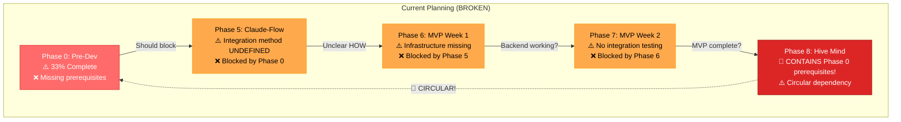
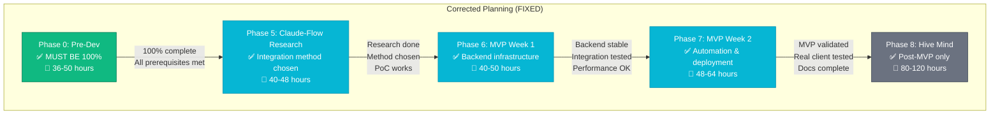
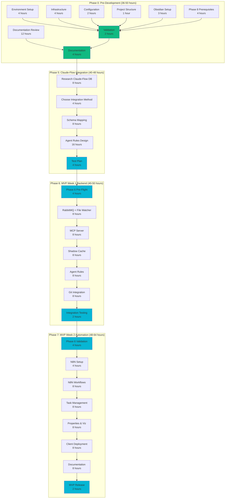
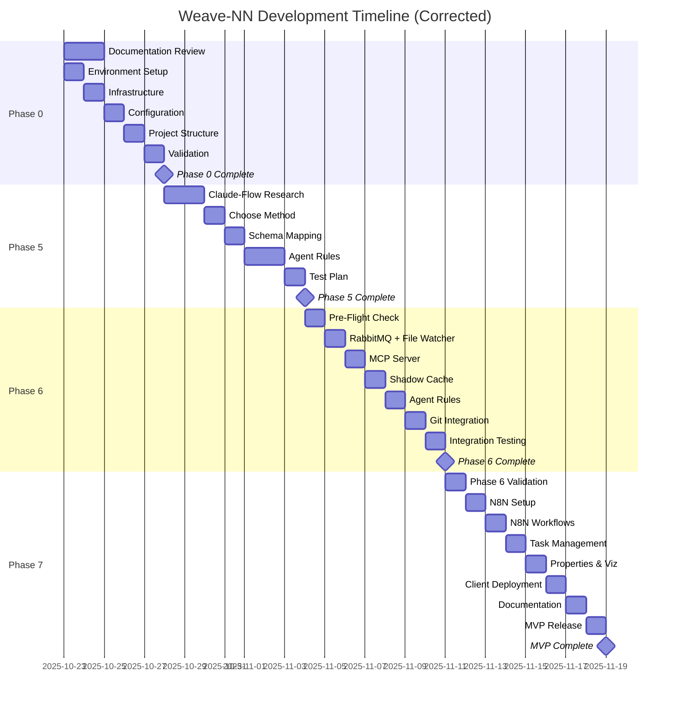
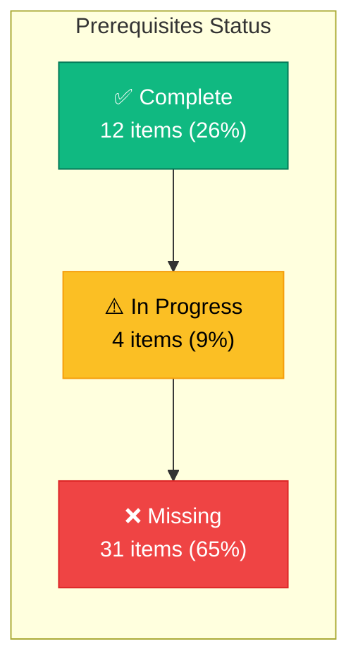
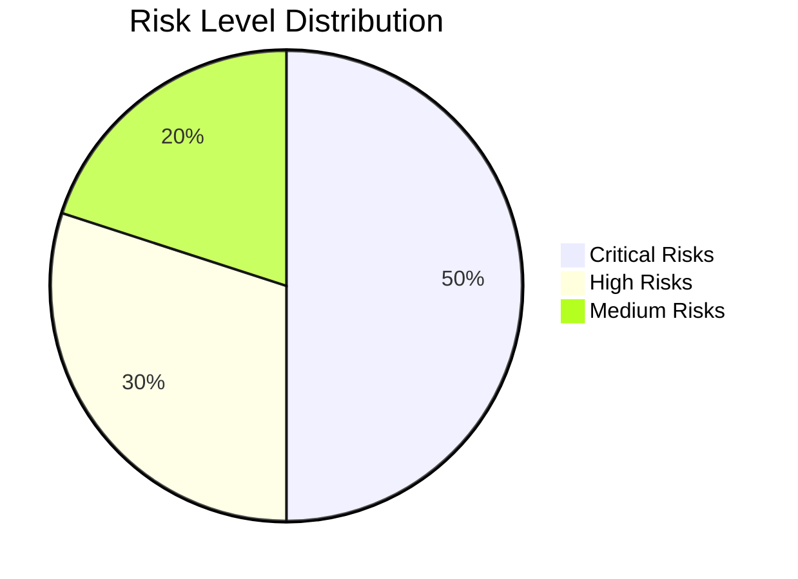
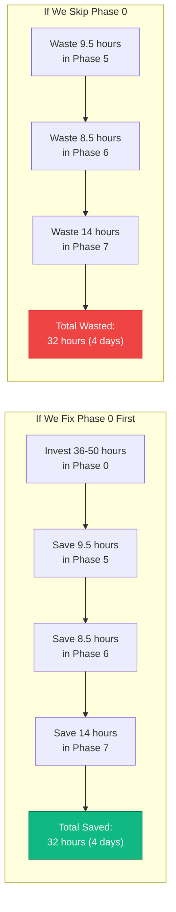
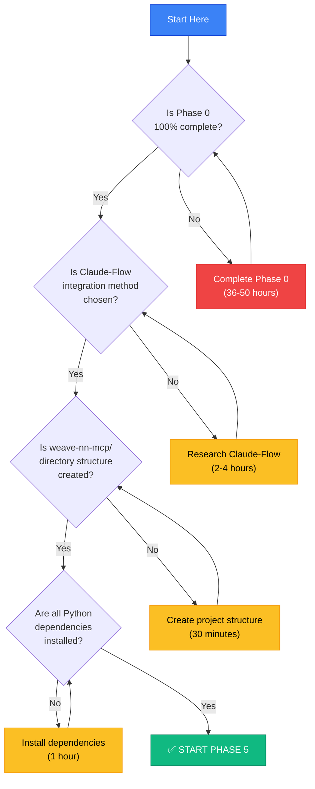
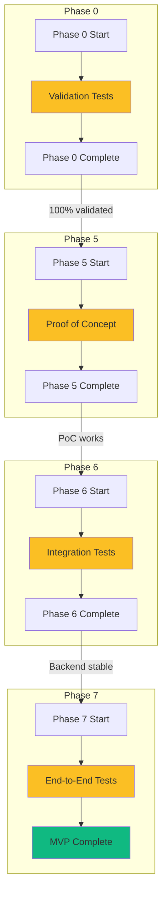

# Critical Path Diagram: Phases 0-8

**Visual representation of dependencies, blockers, and timeline**

---

## Current State (BROKEN - Do Not Use)

**Problems**:
- 🔴 Circular dependency: Phase 8 → Phase 0 → Phase 5 → ... → Phase 8
- 🔴 Phase 0 only 33% complete, blocks everything
- 🔴 Phase 5 integration method undefined
- 🔴 Missing prerequisites throughout
- 🔴 No integration testing between phases

---

## Related

[[CRITICAL-PATH-ANALYSIS-PHASES-5-8]]
## Corrected Plan (USE THIS)

**Benefits**:
- ✅ No circular dependencies
- ✅ Clear prerequisites for each phase
- ✅ Integration testing built in
- ✅ Realistic time estimates
- ✅ Phase 0 prioritized correctly

---

## Detailed Dependency Chain

---

## Critical Path Timeline

**Total Timeline**:
- Phase 0: 6 days (October 23-30)
- Phase 5: 6 days (October 31 - November 7)
- Phase 6: 7 days (November 8-16)
- Phase 7: 8 days (November 17-26)
- **MVP Complete**: November 26, 2025 (~5 weeks from today)

---

## Prerequisites Heatmap

**Breakdown by Phase**:

| Phase | Complete | In Progress | Missing | Total |
|-------|----------|-------------|---------|-------|
| Phase 0 | 12 | 4 | 10 | 26 |
| Phase 5 | 0 | 0 | 6 | 6 |
| Phase 6 | 0 | 0 | 8 | 8 |
| Phase 7 | 0 | 0 | 5 | 5 |
| Phase 8 | 0 | 0 | 2 | 2 |
| **Total** | **12** | **4** | **31** | **47** |

---

## Risk Distribution

**Risk Breakdown**:
- 🔴 **Critical (5)**: Phase 0 incomplete, Claude-Flow undefined, project structure missing, RabbitMQ complexity, no integration testing
- 🟡 **High (3)**: Obsidian REST API bugs, Python dependency conflicts, shadow cache design
- 🟢 **Medium (2)**: N8N learning curve, Obsidian properties breaking changes

---

## Time Impact Analysis

**ROI**: Investing 4-6 days in Phase 0 saves 4 days later = **100% ROI**

---

## Decision Tree

---

## Integration Testing Checkpoints

---

## Phase Completion Criteria

```mermaid
graph TB
    subgraph "Phase 0 Exit Criteria"
        P0_C1["✅ All 9 areas 100%"]
        P0_C2["✅ All validation tests pass"]
        P0_C3["✅ weave-nn-mcp/ exists"]
        P0_C4["✅ Python imports work"]
        P0_C5["✅ No broken wikilinks"]
    end

    subgraph "Phase 5 Exit Criteria"
        P5_C1["✅ 6 deliverables exist"]
        P5_C2["✅ Integration method chosen"]
        P5_C3["✅ PoC tested and works"]
        P5_C4["✅ Team review done"]
        P5_C5["✅ Test plan complete"]
    end

    subgraph "Phase 6 Exit Criteria"
        P6_C1["✅ 5 services running"]
        P6_C2["✅ Integration tests pass"]
        P6_C3["✅ Performance baselines met"]
        P6_C4["✅ Error scenarios handled"]
        P6_C5["✅ Acceptance report done"]
    end

    subgraph "Phase 7 Exit Criteria"
        P7_C1["✅ MVP tested with real client"]
        P7_C2["✅ All features working"]
        P7_C3["✅ Documentation complete"]
        P7_C4["✅ Video recorded"]
        P7_C5["✅ Git tagged v1.0.0-mvp"]
    end

    P0_C1 & P0_C2 & P0_C3 & P0_C4 & P0_C5 --> P5_START["START PHASE 5"]
    P5_C1 & P5_C2 & P5_C3 & P5_C4 & P5_C5 --> P6_START["START PHASE 6"]
    P6_C1 & P6_C2 & P6_C3 & P6_C4 & P6_C5 --> P7_START["START PHASE 7"]
    P7_C1 & P7_C2 & P7_C3 & P7_C4 & P7_C5 --> P8_START["START PHASE 8"]

    style P5_START fill:#06b6d4
    style P6_START fill:#06b6d4
    style P7_START fill:#06b6d4
    style P8_START fill:#6b7280
```

---

**Last Updated**: 2025-10-23
**Source**: CRITICAL-PATH-ANALYSIS-PHASES-5-8.md
**Usage**: Reference these diagrams when planning sprints and validating progress
