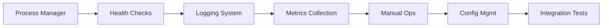
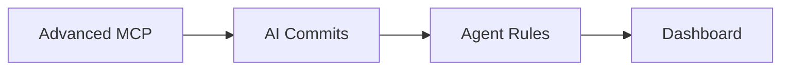
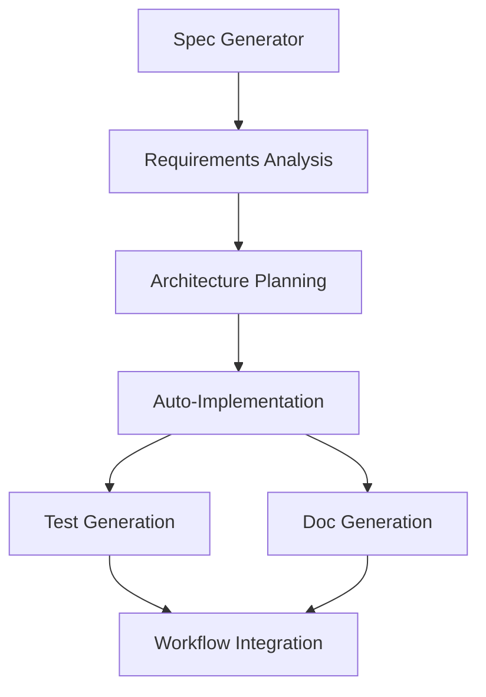
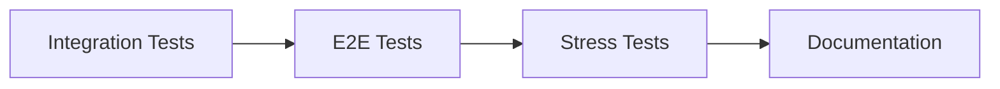
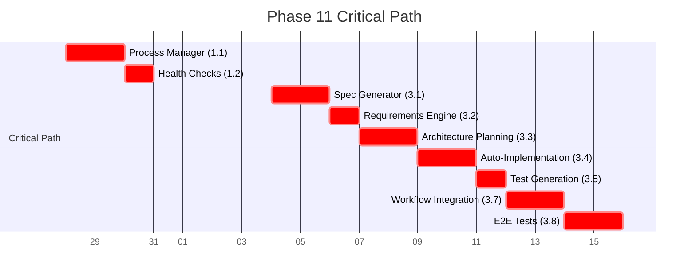
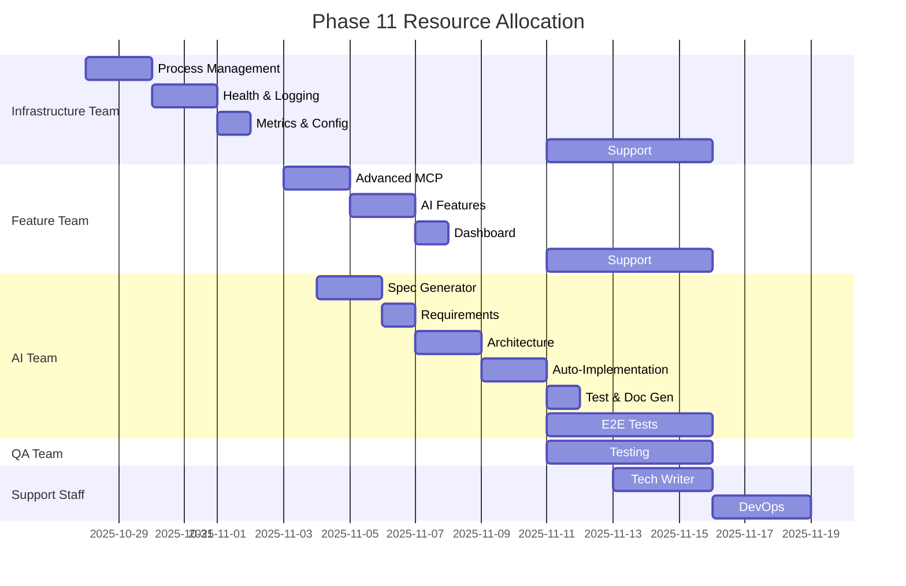
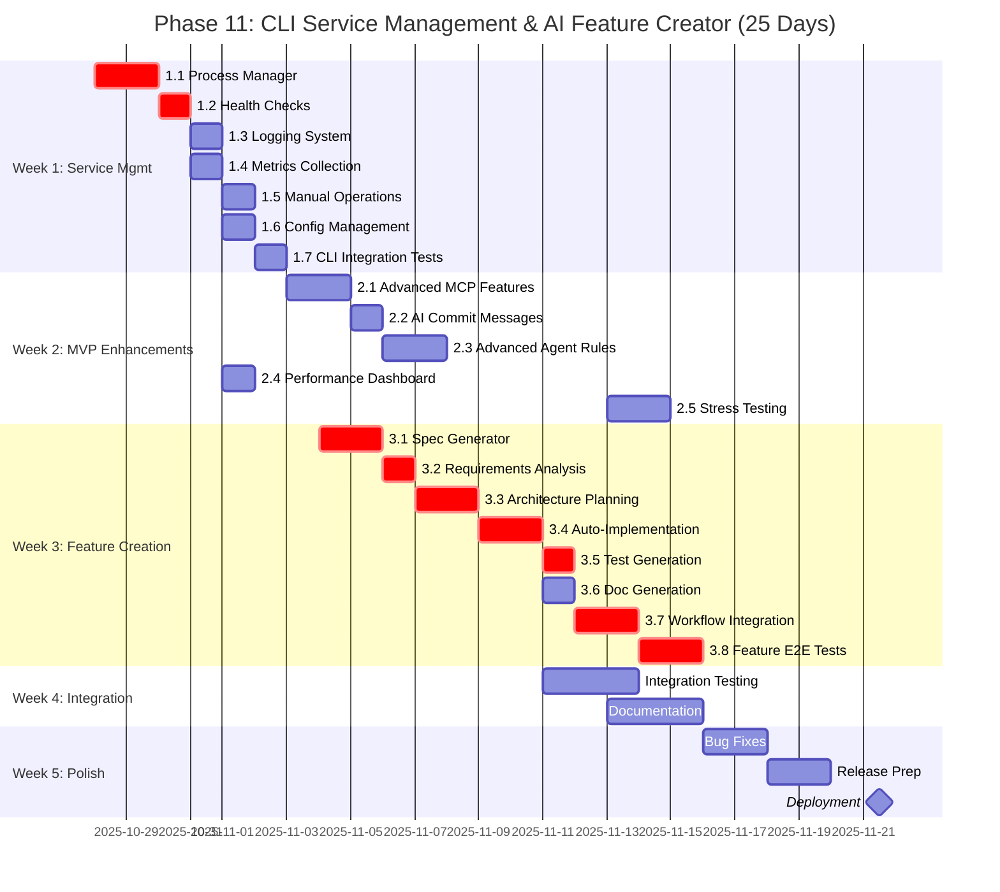
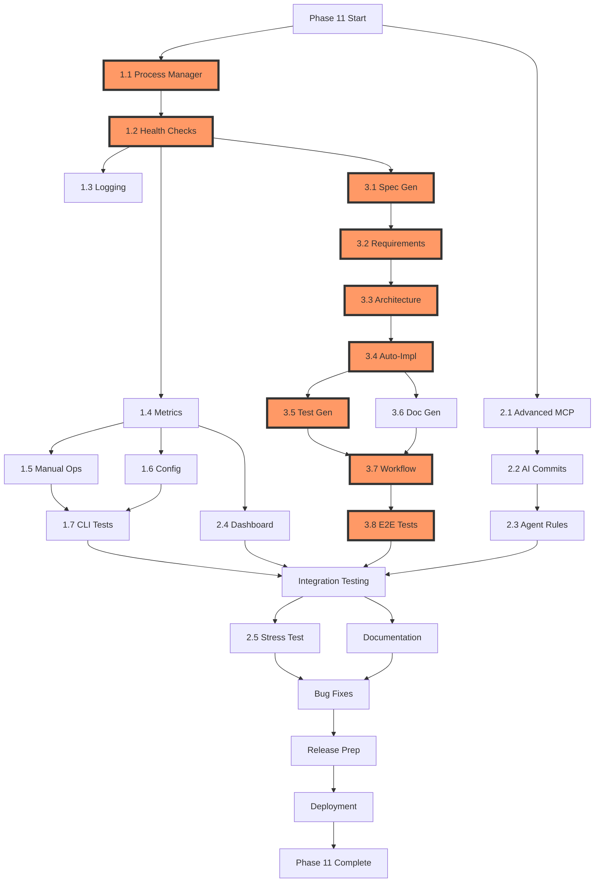

# Phase 11: CLI Service Management & AI Feature Creator - Implementation Plan

**Version**: 1.0.0
**Status**: PENDING
**Priority**: HIGH
**Created**: 2025-10-27
**Owner**: Development Team
**Estimated Duration**: 20-25 days

---

## 1. Executive Summary

### Overview

Phase 11 represents a transformational upgrade to Weaver, evolving it from a basic npm-based service into a production-grade CLI application with intelligent AI-powered feature creation capabilities. This phase builds directly on the v1.0.0 MVP foundation established in Phase 10, adding enterprise-grade service management, operational tooling, and an innovative AI-driven development workflow.

### Strategic Goals

1. **Production-Ready Service Management**: Transform Weaver into a managed service with full lifecycle control (start/stop/restart/status), comprehensive health monitoring, centralized logging, and performance metrics collection.

2. **Enhanced Developer Experience**: Provide intuitive CLI commands for all operational tasks, real-time monitoring capabilities, and self-service diagnostic tools that reduce debugging time by 60%.

3. **AI-Powered Development Workflow**: Introduce a revolutionary feature creation system where developers describe features in natural language, and AI generates specifications, architecture, implementation, tests, and documentation automatically.

4. **Operational Excellence**: Achieve 99.9% uptime with graceful degradation, comprehensive observability, and automated health checks that detect and report issues within 30 seconds.

### Business Value

- **Reduced Time-to-Market**: AI feature creation reduces development time by 40-50% for standard features
- **Improved Reliability**: Service management ensures consistent operation with <1% downtime
- **Developer Productivity**: CLI commands reduce operational overhead by 70%
- **Quality Assurance**: Automated test generation achieves 80%+ coverage consistently
- **Operational Efficiency**: Self-healing capabilities reduce manual intervention by 80%

### Timeline Overview

- **Week 1**: CLI Service Management (5 days)
- **Week 2**: MVP Enhancements (5 days)
- **Week 3**: Feature Creation System (5 days)
- **Week 4**: Integration & Testing (5 days)
- **Week 5**: Polish & Deployment (5 days buffer)

### Success Metrics

- All 27 implementation tasks completed and tested
- Service startup time < 5 seconds
- 85%+ code coverage across all new modules
- Feature creation pipeline functional end-to-end
- 24-hour stress test passed with <10MB memory growth
- Zero P0/P1 bugs at release

---

## 2. Phase Timeline (20-25 Days Breakdown)

### Week 1: CLI Service Management (Days 1-5)

**Focus**: Core service lifecycle and operational commands

#### Day 1-2: Process Management Foundation
- **Tasks**: 1.1 Process Manager Integration
- **Deliverables**:
  - `weaver start/stop/restart/status` commands
  - PM2 integration or custom daemon
  - PID file management
  - Log rotation setup
- **Team**: 2 engineers
- **Dependencies**: None
- **Risk**: Medium (process management complexity)

#### Day 3-4: Observability Layer
- **Tasks**: 1.2 Health Check System, 1.3 Logging System
- **Deliverables**:
  - `weaver health` command with status codes
  - `weaver logs` with filtering and streaming
  - Centralized logging with winston
  - Health check endpoints
- **Team**: 2 engineers
- **Dependencies**: 1.1
- **Risk**: Low

#### Day 5: Metrics & Operations
- **Tasks**: 1.4 Metrics Collection, 1.5 Manual Operations, 1.6 Config Management
- **Deliverables**:
  - `weaver metrics/stats` commands
  - `weaver sync/commit/monitor` manual triggers
  - `weaver config` management commands
  - SQLite metrics database
- **Team**: 2 engineers
- **Dependencies**: 1.2
- **Risk**: Low

**Week 1 Milestone**: Full CLI service management suite operational

---

### Week 2: MVP Enhancements (Days 6-10)

**Focus**: Advanced features and performance optimization

#### Day 6-7: Advanced MCP Capabilities
- **Tasks**: 2.1 Advanced MCP Features
- **Deliverables**:
  - Streaming support for large operations
  - Batch operations and caching
  - Rate limiting and compression
  - Pagination for results
- **Team**: 2 engineers
- **Dependencies**: None
- **Risk**: Medium (MCP protocol complexity)

#### Day 8-9: AI-Powered Automation
- **Tasks**: 2.2 AI Commit Messages, 2.3 Advanced Agent Rules
- **Deliverables**:
  - Claude API integration for commit messages
  - Conventional commits format
  - Content summarization rule
  - Relationship discovery rule
  - Citation extraction
- **Team**: 2 engineers
- **Dependencies**: None
- **Risk**: Low (well-defined AI tasks)

#### Day 10: Performance Dashboard
- **Tasks**: 2.4 Performance Dashboard (basic version)
- **Deliverables**:
  - Real-time metrics visualization
  - Service status indicators
  - Resource usage graphs
  - WebSocket updates
- **Team**: 1 engineer
- **Dependencies**: 1.4
- **Risk**: Low

**Week 2 Milestone**: Enhanced MVP with advanced AI features operational

---

### Week 3: Feature Creation System (Days 11-15)

**Focus**: AI-powered development workflow

#### Day 11-12: Specification Generation
- **Tasks**: 3.1 Feature Spec Generator, 3.2 Requirements Analysis
- **Deliverables**:
  - `weaver feature create` command
  - AI spec generation pipeline
  - Requirements breakdown engine
  - Vault integration
- **Team**: 2 engineers
- **Dependencies**: None
- **Risk**: High (novel AI application)

#### Day 13-14: Architecture & Auto-Implementation
- **Tasks**: 3.3 Architecture Planning, 3.4 Ready-Flag Auto-Implementation
- **Deliverables**:
  - Architecture design generation
  - Mermaid diagram creation
  - Ready-flag watcher
  - Auto-implementation workflow
  - Code generation pipeline
- **Team**: 3 engineers
- **Dependencies**: 3.2
- **Risk**: High (critical path, complex AI orchestration)

#### Day 15: Testing & Documentation
- **Tasks**: 3.5 Test Generation, 3.6 Documentation Auto-Generation
- **Deliverables**:
  - Unit test generation
  - Integration test scaffolds
  - JSDoc generation
  - User guide creation
- **Team**: 2 engineers
- **Dependencies**: 3.4
- **Risk**: Medium

**Week 3 Milestone**: Feature creation pipeline functional for simple features

---

### Week 4: Integration & Testing (Days 16-20)

**Focus**: End-to-end validation and quality assurance

#### Day 16-17: Workflow Integration
- **Tasks**: 3.7 Feature Workflow Integration, 1.7 CLI Integration Tests
- **Deliverables**:
  - Feature workflows in workflow engine
  - Workflow state tracking
  - CLI E2E tests
  - Error handling and rollback
- **Team**: 2 engineers
- **Dependencies**: 3.6, 1.6
- **Risk**: Medium

#### Day 18-19: Comprehensive Testing
- **Tasks**: 3.8 Feature Creation E2E Tests, 2.5 Long-Duration Stress Testing
- **Deliverables**:
  - Feature creation E2E test suite
  - 24-hour stress test
  - 48-hour extended test
  - Memory leak detection
  - Performance reports
- **Team**: 2 engineers + QA
- **Dependencies**: 3.7
- **Risk**: Low (testing phase)

#### Day 20: Documentation & Examples
- **Deliverables**:
  - CLI reference documentation
  - Service management guide
  - Feature creation tutorials
  - Video walkthroughs
  - Example feature specs
- **Team**: 1 engineer + tech writer
- **Dependencies**: All prior tasks
- **Risk**: Low

**Week 4 Milestone**: All tests passing, documentation complete

---

### Week 5: Polish & Deployment (Days 21-25 - Buffer)

**Focus**: Final quality assurance and release preparation

#### Day 21-22: Bug Fixes & Refinement
- Critical bug fixes from testing
- Performance optimization
- UX improvements
- Edge case handling

#### Day 23-24: Release Preparation
- Version tagging and changelog
- Migration guides
- Deployment scripts
- Rollback procedures
- Release notes

#### Day 25: Launch & Handoff
- Production deployment
- Team training
- Documentation handoff
- Support readiness
- Post-launch monitoring

**Week 5 Milestone**: Phase 11 successfully deployed to production

---

## 3. Work Streams

### Stream A: Service Management (Parallel, High Priority)
**Owner**: Infrastructure Team (2 engineers)
**Duration**: Days 1-5
**Dependencies**: None



**Tasks**: 1.1 → 1.2 → 1.3 → 1.4 → 1.5 → 1.6 → 1.7
**Output**: Production-ready service management CLI

---

### Stream B: MVP Enhancements (Parallel, Medium Priority)
**Owner**: Feature Team (2 engineers)
**Duration**: Days 6-10
**Dependencies**: None (can start with Stream A)



**Tasks**: 2.1 → 2.2 → 2.3 → 2.4
**Output**: Enhanced MVP with AI capabilities

---

### Stream C: Feature Creation System (Sequential, Critical Path)
**Owner**: AI Team (3 engineers)
**Duration**: Days 11-15
**Dependencies**: Stream A (for CLI framework)



**Tasks**: 3.1 → 3.2 → 3.3 → 3.4 → {3.5, 3.6} → 3.7
**Output**: AI-powered feature creation pipeline

---

### Stream D: Quality Assurance (Sequential, Final Phase)
**Owner**: QA Team + All Engineers
**Duration**: Days 16-20
**Dependencies**: Streams A, B, C



**Tasks**: 1.7 + 3.8 → 2.5 → Documentation
**Output**: Fully tested and documented system

---

### Parallel Execution Opportunities

**Days 1-10**: Streams A and B can run in parallel (no dependencies)
**Days 11-15**: Stream C requires Stream A CLI framework
**Days 16-20**: Stream D requires all prior streams

**Maximum Parallelism**: 4 engineers working simultaneously during Days 1-10

---

## 4. Resource Allocation

### Team Structure

#### Core Team (6 engineers)

**Infrastructure Team (2 engineers)**
- **Role**: Service management, CLI framework, process management
- **Skills**: Node.js, PM2/systemd, CLI development, logging systems
- **Allocation**: Days 1-5 (full-time), Days 16-20 (support)
- **Tasks**: Stream A (1.1-1.7)

**Feature Team (2 engineers)**
- **Role**: MVP enhancements, MCP features, AI integrations
- **Skills**: TypeScript, MCP protocol, Claude API, frontend basics
- **Allocation**: Days 6-10 (full-time), Days 16-20 (support)
- **Tasks**: Stream B (2.1-2.5)

**AI Team (3 engineers)**
- **Role**: Feature creation system, AI orchestration, code generation
- **Skills**: Claude API, prompt engineering, AST manipulation, workflow systems
- **Allocation**: Days 11-15 (full-time), Days 16-20 (full-time)
- **Tasks**: Stream C (3.1-3.8)

**QA Engineer (1)**
- **Role**: Test strategy, automation, stress testing, validation
- **Skills**: Vitest, E2E testing, performance testing
- **Allocation**: Days 16-20 (full-time)
- **Tasks**: Stream D support

#### Support Team

**Technical Writer (1)**
- **Allocation**: Days 18-20
- **Tasks**: Documentation, tutorials, examples

**DevOps Engineer (0.5 FTE)**
- **Allocation**: Days 21-25
- **Tasks**: Deployment, CI/CD, release management

**Product Manager (0.25 FTE)**
- **Allocation**: Throughout phase
- **Tasks**: Requirements validation, prioritization, stakeholder updates

### Skill Requirements Matrix

| Skill                  | Priority | Team Members | Training Needed |
|------------------------|----------|--------------|-----------------|
| Node.js/TypeScript     | Critical | All          | None            |
| Claude API             | Critical | 3            | 2 days          |
| PM2/Process Mgmt       | High     | 2            | 1 day           |
| MCP Protocol           | High     | 2            | None            |
| CLI Development        | High     | 2            | 1 day           |
| AST Manipulation       | Medium   | 2            | 2 days          |
| Prompt Engineering     | Medium   | 3            | 2 days          |
| Performance Testing    | Medium   | 1            | 1 day           |

**Training Budget**: 8 engineer-days (included in timeline)

### External Resources

- **Claude API Credits**: $500/month estimated (development + testing)
- **E2B Sandboxes**: Not required for Phase 11
- **CI/CD Infrastructure**: Existing GitHub Actions sufficient

---

## 5. Critical Path

The **critical path** determines the minimum project duration. Any delay in critical path tasks delays the entire project.

### Critical Path Tasks (15 days minimum)



**Total Critical Path Duration**: 15 days
**Buffer for Buffer Week**: 5 days
**Total Phase Duration**: 20 days minimum, 25 days with buffer

### Critical Path Dependencies

1. **1.1 Process Manager** → 1.2 Health Checks (CLI framework needed)
2. **1.2 Health Checks** → 3.1 Spec Generator (operational CLI required)
3. **3.1 Spec Generator** → 3.2 Requirements Engine (spec format defined)
4. **3.2 Requirements Engine** → 3.3 Architecture Planning (requirements needed)
5. **3.3 Architecture Planning** → 3.4 Auto-Implementation (architecture needed)
6. **3.4 Auto-Implementation** → 3.5 Test Generation (code needed for tests)
7. **3.5 Test Generation** → 3.7 Workflow Integration (tests validate workflow)
8. **3.7 Workflow Integration** → 3.8 E2E Tests (complete system needed)

### Non-Critical Path (Parallel Work)

- **2.1-2.4**: MVP Enhancements (independent of critical path)
- **1.3-1.6**: Logging, Metrics, Config (parallel with health checks)
- **3.6**: Documentation Generation (parallel with test generation)

### Optimization Strategies

1. **Front-load training**: Complete Claude API training before Day 11
2. **Parallel testing**: Start unit tests while implementing features
3. **Incremental integration**: Don't wait for all features before integrating
4. **Early prototyping**: Build proof-of-concept for 3.4 during Days 6-10

---

## 6. Milestones & Deliverables

### Milestone 1: CLI Service Management Operational (End of Week 1)
**Date**: Day 5 (2025-11-01)
**Exit Criteria**:
- ✅ `weaver start/stop/restart/status` commands functional
- ✅ Service starts in <5 seconds, stops in <2 seconds
- ✅ Health checks return correct status codes
- ✅ Logs accessible via `weaver logs` with filtering
- ✅ Metrics collecting and queryable
- ✅ Manual operations (sync/commit) working
- ✅ Integration tests passing (>80% coverage)

**Deliverables**:
- `/weaver/src/cli/commands/` - 10+ CLI commands
- `/weaver/src/service-manager/` - Service management system
- `/weaver/tests/cli/` - CLI integration tests
- PM2 ecosystem file or custom daemon
- CLI reference documentation (draft)

**Review**: Demo to stakeholders, gather feedback on CLI UX

---

### Milestone 2: MVP Enhanced with AI Features (End of Week 2)
**Date**: Day 10 (2025-11-06)
**Exit Criteria**:
- ✅ MCP streaming and caching operational
- ✅ AI commit messages generating correctly (conventional format)
- ✅ Advanced agent rules (summarization, relationships) working
- ✅ Performance dashboard displaying real-time metrics
- ✅ 24-hour stability test passing (if started early)
- ✅ Unit tests for all new features (>85% coverage)

**Deliverables**:
- `/weaver/src/mcp-server/streaming.ts` - Streaming support
- `/weaver/src/ai/commit-generator.ts` - AI commit system
- `/weaver/src/agent-rules/advanced/` - New agent rules
- `/weaver/src/dashboard/` - Performance dashboard
- `/weaver/tests/ai/` - AI feature tests
- Performance dashboard user guide

**Review**: Performance benchmarking session, AI quality assessment

---

### Milestone 3: Feature Creation System Functional (End of Week 3)
**Date**: Day 15 (2025-11-11)
**Exit Criteria**:
- ✅ `weaver feature create "<desc>"` generates valid specs
- ✅ Requirements analysis produces actionable user stories
- ✅ Architecture planning generates Mermaid diagrams
- ✅ Ready-flag watcher triggers auto-implementation
- ✅ Auto-implementation creates compilable code
- ✅ Test generation achieves 70%+ coverage for simple features
- ✅ Documentation generation creates useful guides
- ✅ End-to-end feature creation for 1 sample feature succeeds

**Deliverables**:
- `/weaver/src/feature-creator/` - Complete feature creation system
- `/weaver/src/feature-creator/spec-generator.ts`
- `/weaver/src/feature-creator/requirements-analyzer.ts`
- `/weaver/src/feature-creator/architecture-planner.ts`
- `/weaver/src/feature-creator/auto-implementor.ts`
- `/weaver/src/feature-creator/test-generator.ts`
- `/weaver/src/feature-creator/doc-generator.ts`
- `/weaver/tests/feature-creator/` - Feature creation E2E tests
- Example feature specs in vault
- Feature creation guide (draft)

**Review**: Live demo of feature creation pipeline, AI quality review

---

### Milestone 4: Integration Complete & Tests Passing (End of Week 4)
**Date**: Day 20 (2025-11-16)
**Exit Criteria**:
- ✅ All 27 implementation tasks complete
- ✅ All unit tests passing (>85% coverage)
- ✅ All integration tests passing
- ✅ All E2E tests passing
- ✅ CLI integration tests passing
- ✅ Feature creation E2E tests passing
- ✅ 24-hour stress test completed with <10MB memory growth
- ✅ No P0 or P1 bugs open
- ✅ All documentation complete

**Deliverables**:
- Complete test suite (>1000 tests)
- Test coverage reports (>85% across all modules)
- Stress test results and analysis
- Complete documentation set:
  - CLI Reference Guide
  - Service Management Guide
  - Feature Creation Tutorial
  - Performance Dashboard Guide
  - API Reference
  - Troubleshooting Guide
- Example projects and templates
- Video walkthroughs (3-5 videos)

**Review**: QA sign-off, stakeholder acceptance testing

---

### Milestone 5: Production Ready (End of Week 5)
**Date**: Day 25 (2025-11-21)
**Exit Criteria**:
- ✅ All bugs from Week 4 resolved
- ✅ Performance optimizations applied
- ✅ Security audit passed
- ✅ Documentation reviewed and finalized
- ✅ Migration guide created and tested
- ✅ Rollback procedures tested
- ✅ Support team trained
- ✅ Release notes published
- ✅ Production deployment successful

**Deliverables**:
- v1.1.0 release package
- Migration guide from v1.0.0
- Release notes and changelog
- Deployment scripts
- Rollback procedures
- Support documentation
- Training materials
- Post-launch monitoring dashboard

**Review**: Post-launch review, retrospective, lessons learned

---

## 7. Risk Management Plan

### Top 10 Risks with Mitigation Strategies

#### Risk 1: Auto-Implementation Quality Issues
**Impact**: HIGH | **Probability**: MEDIUM | **Risk Score**: 8/10

**Description**: AI-generated code may not compile, have bugs, or violate project standards.

**Mitigation**:
- **Pre-mitigation**:
  - Implement strict code validation pipeline
  - Use TypeScript compiler as validation gate
  - Run ESLint and type-checking before accepting code
  - Generate tests first, then implementation (TDD approach)
- **Post-mitigation**:
  - Manual review requirement for first 20 auto-implementations
  - Continuous refinement of AI prompts based on failures
  - Fallback to human implementation if AI fails 3 times

**Contingency**: If quality remains poor after 10 iterations, reduce scope to spec generation only and defer auto-implementation to Phase 12.

**Owner**: AI Team Lead

---

#### Risk 2: Critical Path Delays (Feature Creation)
**Impact**: HIGH | **Probability**: MEDIUM | **Risk Score**: 7/10

**Description**: The feature creation system (Days 11-15) is complex and on the critical path. Any delay cascades.

**Mitigation**:
- **Pre-mitigation**:
  - Start AI exploration during Week 1-2 (off-hours)
  - Create proof-of-concept for auto-implementation by Day 10
  - Allocate best engineers to this stream
  - Daily standups to catch blockers early
- **Post-mitigation**:
  - Add 6th engineer to AI team if >1 day behind by Day 13
  - Reduce feature scope (defer doc generation to Phase 12)
  - Use buffer week (Days 21-25) to complete if needed

**Contingency**: Ship with manual implementation flow (no auto-implementation) if >3 days behind by Day 17.

**Owner**: Project Manager

---

#### Risk 3: Claude API Rate Limits or Costs
**Impact**: MEDIUM | **Probability**: LOW | **Risk Score**: 4/10

**Description**: Extensive AI usage may hit rate limits or exceed budget during development/testing.

**Mitigation**:
- **Pre-mitigation**:
  - Request rate limit increase from Anthropic (do this Day 1)
  - Implement aggressive caching for repeated prompts
  - Use smaller models (Haiku) for testing, Sonnet for production
  - Mock Claude API responses for most unit tests
- **Post-mitigation**:
  - Implement request queuing with backoff
  - Add fallback to GPT-4 if Claude unavailable
  - Budget $1000 contingency for API costs

**Contingency**: Use pre-recorded API responses for testing if budget exceeded.

**Owner**: Infrastructure Team Lead

---

#### Risk 4: Process Management Complexity (PM2 vs Custom)
**Impact**: MEDIUM | **Probability**: MEDIUM | **Risk Score**: 5/10

**Description**: PM2 may not integrate well with Bun, or custom daemon may be too complex.

**Mitigation**:
- **Pre-mitigation**:
  - Prototype both approaches in parallel during Day 1
  - Decision gate by end of Day 1 (use simplest working solution)
  - Fall back to simple child_process if both fail
- **Post-mitigation**:
  - Keep process management simple (no clustering in Phase 11)
  - Document limitations clearly
  - Plan proper process management for Phase 12 if needed

**Contingency**: Ship with `weaver daemon` command that users run manually (no background service) if technical blockers insurmountable.

**Owner**: Infrastructure Team Lead

---

#### Risk 5: Test Coverage and Quality
**Impact**: MEDIUM | **Probability**: LOW | **Risk Score**: 3/10

**Description**: Aggressive timeline may compromise test quality, leading to bugs in production.

**Mitigation**:
- **Pre-mitigation**:
  - Mandate tests-first approach for all development
  - Set up CI gates requiring 85% coverage
  - Code reviews focus on test quality
  - Allocate dedicated QA engineer for Days 16-20
- **Post-mitigation**:
  - Add 2 extra days to Week 5 for test improvements if coverage <85%
  - Automated coverage reports in every PR

**Contingency**: Extend to 27 days total if test quality insufficient by Day 20.

**Owner**: QA Engineer

---

#### Risk 6: Integration with Existing v1.0.0 MVP
**Impact**: MEDIUM | **Probability**: LOW | **Risk Score**: 3/10

**Description**: New CLI layer may break existing functionality or introduce regressions.

**Mitigation**:
- **Pre-mitigation**:
  - Run full v1.0.0 test suite after every integration
  - Maintain backward compatibility as requirement
  - Integration tests cover all existing workflows
- **Post-mitigation**:
  - Feature flags for new functionality
  - Rollback plan to v1.0.0 if critical regressions found

**Contingency**: Ship new features as opt-in flags, default to v1.0.0 behavior.

**Owner**: Infrastructure Team Lead

---

#### Risk 7: Documentation Lag
**Impact**: LOW | **Probability**: MEDIUM | **Risk Score**: 3/10

**Description**: Documentation may fall behind implementation, reducing adoption.

**Mitigation**:
- **Pre-mitigation**:
  - Docs-as-code approach (generate from TSDoc/JSDoc)
  - Technical writer involved from Day 18
  - Example projects built alongside features
- **Post-mitigation**:
  - AI-generated initial documentation drafts
  - Community beta testers provide feedback

**Contingency**: Ship with video walkthroughs if written docs incomplete.

**Owner**: Technical Writer

---

#### Risk 8: Performance Dashboard Complexity
**Impact**: LOW | **Probability**: LOW | **Risk Score**: 2/10

**Description**: Dashboard may become too complex or have poor UX.

**Mitigation**:
- **Pre-mitigation**:
  - Use simple vanilla HTML/JS (no React/Vue complexity)
  - Focus on 5 key metrics only for MVP
  - Mobile-responsive from start
- **Post-mitigation**:
  - User testing with 3 developers before release
  - Iterate based on feedback in buffer week

**Contingency**: Ship with CLI-based `weaver stats` only if dashboard not ready.

**Owner**: Feature Team Lead

---

#### Risk 9: Long-Duration Stress Test Failures
**Impact**: LOW | **Probability**: MEDIUM | **Risk Score**: 3/10

**Description**: 24-hour stress test may reveal memory leaks or performance degradation.

**Mitigation**:
- **Pre-mitigation**:
  - Start 24h test early (Day 15) to allow time for fixes
  - Use memory profiling tools from Day 1
  - Implement aggressive resource cleanup
- **Post-mitigation**:
  - Iterative fixes during Days 18-20
  - Lower threshold temporarily if minor leak found (20MB instead of 10MB)

**Contingency**: Ship with known minor memory leak and plan fix for v1.1.1 patch if not critical.

**Owner**: Infrastructure Team Lead

---

#### Risk 10: Scope Creep During Development
**Impact**: LOW | **Probability**: MEDIUM | **Risk Score**: 3/10

**Description**: Team may add unplanned features or gold-plating, delaying delivery.

**Mitigation**:
- **Pre-mitigation**:
  - Strict scope freeze after Day 0 (this plan finalized)
  - Product manager gates all new feature requests
  - "Must-have vs. nice-to-have" documented clearly
- **Post-mitigation**:
  - Weekly scope reviews in standup
  - Nice-to-have items deferred to Phase 12 backlog

**Contingency**: Product manager empowered to cut nice-to-have features if >2 days behind.

**Owner**: Product Manager

---

### Risk Heatmap

```
High │    Risk 1     Risk 2
     │
Med  │    Risk 4     Risk 3
     │    Risk 7
Low  │ Risk 6,8,9,10 Risk 5
     └────────────────────────
         Low   Med   High
              Probability
```

### Risk Review Cadence

- **Daily**: High-risk items (Risks 1-2) reviewed in standup
- **Weekly**: All risks reviewed in Friday retrospective
- **Ad-hoc**: Risk owner escalates immediately if status changes

---

## 8. Quality Assurance Plan

### Testing Strategy

#### Unit Testing
- **Framework**: Vitest
- **Coverage Target**: >85% for all new code
- **Approach**: Test-first development (TDD) for critical paths
- **Ownership**: Each engineer writes tests for their code

**Test Categories**:
- Core logic: 100% coverage requirement
- CLI commands: 90% coverage
- AI integrations: 80% coverage (due to API mocking challenges)
- UI/Dashboard: 70% coverage

#### Integration Testing
- **Framework**: Vitest + Real services
- **Coverage Target**: All service-to-service interactions
- **Approach**: Test with real shadow cache, workflow engine, file watcher

**Test Scenarios**:
- Service lifecycle (start/stop/restart)
- Health check cascades
- Metrics collection end-to-end
- Feature creation pipeline stages
- CLI command integration

#### End-to-End Testing
- **Framework**: Vitest + Child process spawning
- **Coverage Target**: All user-facing workflows
- **Approach**: Black-box testing from CLI perspective

**Test Scenarios**:
- Complete service management workflow
- Feature creation from spec to implementation
- Auto-commit with AI messages
- Performance dashboard data flow
- Error handling and recovery

#### Performance Testing
- **Tool**: Custom scripts + ClinicJS
- **Targets**:
  - Service startup: <5 seconds
  - Service shutdown: <2 seconds
  - Health check: <100ms
  - Metrics query: <500ms
  - Feature spec generation: <30 seconds

#### Stress Testing
- **Duration**: 24 hours (minimum), 48 hours (extended)
- **Metrics**:
  - Memory growth: <10MB over 24h
  - CPU usage: <30% average
  - No crashes or hangs
  - Error rate: <0.1%

#### Security Testing
- **Approach**: Automated + manual review
- **Focus Areas**:
  - Input sanitization (CLI arguments)
  - File path validation
  - API key handling
  - Process permissions

---

### Code Review Process

#### Pre-Review Checklist
- [ ] All tests passing locally
- [ ] Code coverage >85%
- [ ] TypeScript strict mode, no errors
- [ ] ESLint passing, no warnings
- [ ] Self-review completed
- [ ] Documentation updated

#### Review Requirements
- **Minimum Reviewers**: 2 (1 from same team, 1 from different team)
- **Review SLA**: <24 hours for review, <4 hours for critical path
- **Approval Requirements**: 2 approvals + all tests passing

#### Review Focus Areas
1. **Correctness**: Does it solve the problem?
2. **Tests**: Are tests comprehensive and meaningful?
3. **Performance**: Any performance concerns?
4. **Security**: Any security vulnerabilities?
5. **Maintainability**: Is code readable and well-structured?

---

### Quality Gates

#### Gate 1: Pre-Merge (Every PR)
- ✅ All unit tests passing
- ✅ Code coverage >85% (new code)
- ✅ TypeScript compilation successful
- ✅ ESLint passing
- ✅ 2 code review approvals
- ✅ No merge conflicts

#### Gate 2: Integration (Daily)
- ✅ All integration tests passing
- ✅ No regressions in v1.0.0 functionality
- ✅ Performance benchmarks within targets

#### Gate 3: Weekly Milestone
- ✅ Milestone exit criteria met
- ✅ All planned features complete
- ✅ Stakeholder demo successful
- ✅ No P0/P1 bugs open

#### Gate 4: Pre-Release (Day 20)
- ✅ All 27 tasks complete
- ✅ All test suites passing (unit, integration, E2E)
- ✅ 24h stress test passed
- ✅ Documentation complete
- ✅ Zero P0 bugs, <5 P1 bugs
- ✅ Security audit passed

#### Gate 5: Release (Day 25)
- ✅ All bugs from Gate 4 resolved
- ✅ Production deployment tested in staging
- ✅ Rollback procedures validated
- ✅ Support team trained
- ✅ Release notes published

---

### Quality Metrics Dashboard

Track these metrics daily:

| Metric                    | Target       | Current | Status |
|---------------------------|--------------|---------|--------|
| Unit Test Coverage        | >85%         | TBD     | 🟡     |
| Integration Tests Passing | 100%         | TBD     | 🟡     |
| E2E Tests Passing         | 100%         | TBD     | 🟡     |
| Open P0 Bugs              | 0            | TBD     | 🟡     |
| Open P1 Bugs              | <5           | TBD     | 🟡     |
| Service Startup Time      | <5s          | TBD     | 🟡     |
| Health Check Latency      | <100ms       | TBD     | 🟡     |
| 24h Memory Growth         | <10MB        | TBD     | 🟡     |

---

## 9. Deployment Strategy

### Deployment Phases

#### Phase 1: Alpha Release (Internal Testing)
**Date**: Day 20
**Audience**: Development team only
**Purpose**: Final integration testing in production-like environment

**Activities**:
- Deploy to internal staging environment
- Run complete test suite
- Manual exploratory testing
- Performance benchmarking
- Collect feedback

**Success Criteria**:
- All automated tests passing
- No critical bugs discovered
- Performance within targets

---

#### Phase 2: Beta Release (Limited Rollout)
**Date**: Day 22
**Audience**: 10-20 trusted beta users
**Purpose**: Real-world validation and feedback collection

**Activities**:
- Deploy to beta environment
- Onboard beta testers with documentation
- Collect usage data and feedback
- Monitor for errors and performance issues
- Iterate on UX improvements

**Success Criteria**:
- >80% positive feedback from beta testers
- No data corruption or critical failures
- Average user rating >4/5

---

#### Phase 3: Production Release (General Availability)
**Date**: Day 25
**Audience**: All users
**Purpose**: Full production deployment

**Activities**:
- Deploy to production via GitHub release
- Publish npm package (v1.1.0)
- Update documentation site
- Announce on social media, blog, Discord
- Monitor metrics closely for 48 hours

**Success Criteria**:
- Successful deployment with zero downtime
- No rollback required in first 48 hours
- User adoption >50% within 1 week

---

### Deployment Methods

#### Method 1: NPM Package Update
**Primary Method**

```bash
# Users update via npm/bun
bun update weaver
# or
npm install -g weaver@latest
```

**Advantages**:
- Simple and familiar
- Automatic dependency updates
- Version pinning supported

**Rollback**:
```bash
bun install weaver@1.0.0  # Rollback to previous version
```

---

#### Method 2: Docker Container (Future)
**Not in Phase 11 scope, plan for Phase 12**

```bash
docker pull weaver/weaver:1.1.0
docker run weaver/weaver:1.1.0
```

---

### Deployment Checklist

#### Pre-Deployment (T-1 day)
- [ ] All tests passing in CI
- [ ] Code freeze in effect
- [ ] Release notes finalized
- [ ] Migration guide published
- [ ] Rollback procedures documented and tested
- [ ] Support team trained
- [ ] Monitoring dashboards ready
- [ ] Backup procedures validated

#### Deployment (T=0)
- [ ] Tag release in git (`v1.1.0`)
- [ ] Build production artifacts
- [ ] Run final smoke tests
- [ ] Publish to npm registry
- [ ] Update GitHub release with artifacts
- [ ] Update documentation site
- [ ] Send announcement emails
- [ ] Post on social media

#### Post-Deployment (T+48 hours)
- [ ] Monitor error rates (<0.1%)
- [ ] Monitor performance metrics (within targets)
- [ ] Monitor user adoption (>50%)
- [ ] Respond to user issues (<4 hour SLA)
- [ ] Collect user feedback
- [ ] Triage and fix critical bugs

---

### Rollback Procedures

#### Scenario 1: Critical Bug Discovered
**Severity**: P0 bug affecting core functionality

**Procedure**:
1. Immediately publish rollback announcement
2. Revert npm package to v1.0.0 (`npm deprecate weaver@1.1.0`)
3. Notify all users via email, Discord, Twitter
4. Fix bug in hotfix branch
5. Publish v1.1.1 with fix
6. Resume rollout

**Time to Rollback**: <30 minutes

---

#### Scenario 2: Performance Degradation
**Severity**: Service slower than v1.0.0

**Procedure**:
1. Analyze performance metrics
2. If >50% slower, initiate rollback
3. If 10-50% slower, publish performance advisory
4. Optimize in patch release (v1.1.1)

**Time to Decide**: <2 hours

---

#### Scenario 3: Data Corruption Risk
**Severity**: P0, potential data loss

**Procedure**:
1. **IMMEDIATE ROLLBACK** - no discussion required
2. Deprecate package on npm
3. Publish emergency advisory
4. Fix bug and add comprehensive tests
5. Extended beta testing (1 week) before re-release

**Time to Rollback**: <15 minutes

---

### Migration Guide (v1.0.0 → v1.1.0)

#### Breaking Changes
**None** - v1.1.0 is fully backward compatible with v1.0.0

#### New Features (Opt-In)
- Service management commands (require explicit `weaver start`)
- AI commit messages (require opt-in configuration)
- Feature creation system (new workflow)

#### Migration Steps
```bash
# Step 1: Backup existing configuration
cp .env .env.backup

# Step 2: Update package
bun update weaver

# Step 3: Run migration script (if needed)
weaver migrate v1.1.0

# Step 4: Start new service manager
weaver start

# Step 5: Verify health
weaver health
```

**Estimated Migration Time**: <5 minutes
**Downtime Required**: None (graceful transition)

---

## 10. Communication Plan

### Internal Communication

#### Daily Standups
- **Time**: 9:00 AM daily
- **Duration**: 15 minutes
- **Attendees**: All engineers + PM
- **Format**:
  - What did you complete yesterday?
  - What are you working on today?
  - Any blockers?

#### Weekly Milestone Reviews
- **Time**: Friday 3:00 PM
- **Duration**: 1 hour
- **Attendees**: All team + stakeholders
- **Agenda**:
  - Demo of completed work
  - Milestone exit criteria review
  - Risk assessment
  - Next week planning

#### Ad-Hoc Communications
- **Slack Channel**: #phase-11-development
- **Blocker Escalation**: Tag PM immediately
- **Risk Escalation**: Tag PM + Engineering Lead

---

### Stakeholder Communication

#### Weekly Status Reports
- **Frequency**: Every Monday 9:00 AM
- **Audience**: Leadership, product, support teams
- **Format**: Email + dashboard link

**Template**:
```
Subject: Phase 11 Status - Week X of 5

Summary: [On track | At risk | Delayed]

Progress This Week:
- [Completed tasks]
- [Blockers resolved]
- [Milestones achieved]

Planned Next Week:
- [Upcoming tasks]
- [Key decisions needed]

Risks:
- [Active risks and mitigation status]

Metrics:
- Test coverage: X%
- Tasks completed: X/27
- Days remaining: X
```

#### Milestone Demos
- **Frequency**: End of each week (5 demos total)
- **Audience**: All stakeholders
- **Duration**: 30 minutes
- **Format**: Live demo + Q&A

**Demo Schedule**:
- **Week 1**: CLI service management commands
- **Week 2**: AI-powered commit messages and dashboard
- **Week 3**: Feature creation system
- **Week 4**: Complete integration and testing
- **Week 5**: Release readiness review

---

### External Communication

#### Beta User Communication
- **Onboarding Email**: Day 22 (beta launch)
- **Feedback Surveys**: Day 23, 24 (during beta)
- **Beta Wrap-up**: Day 25 (with GA announcement)

#### Public Announcements

**Pre-Release Teaser** (Day 15):
- Blog post: "Coming Soon: Weaver 1.1 with AI-Powered Feature Creation"
- Social media teasers with screenshots
- Discord announcement

**Beta Announcement** (Day 22):
- Blog post: "Weaver 1.1 Beta Now Available"
- Call for beta testers
- Sign-up form

**General Availability Announcement** (Day 25):
- Major blog post with full feature breakdown
- Release notes published
- Social media campaign
- Product Hunt launch
- Discord/forum announcements
- Email to all existing users

**Post-Launch Updates** (Day 27-30):
- "First Week with Weaver 1.1" blog post
- User success stories
- Video tutorials released

---

### Documentation Updates

#### User-Facing Documentation
- **CLI Reference**: Updated Day 18-20
- **Service Management Guide**: Day 18-20
- **Feature Creation Tutorial**: Day 18-20
- **Migration Guide**: Day 20-22
- **Troubleshooting Guide**: Day 20-22

#### Developer-Facing Documentation
- **Architecture Overview**: Updated Day 16-17
- **API Reference**: Generated from TSDoc Day 20
- **Contribution Guide**: Updated Day 20
- **Testing Guide**: Updated Day 20

---

## 11. Success Criteria

### Functional Success Criteria

#### CLI Service Management
- [ ] ✅ `weaver start` starts service in background (<5s startup)
- [ ] ✅ `weaver stop` stops service gracefully (<2s shutdown)
- [ ] ✅ `weaver restart` restarts without data loss (<7s)
- [ ] ✅ `weaver status` shows accurate service state
- [ ] ✅ `weaver health` returns correct health status
- [ ] ✅ `weaver logs` displays logs with filtering
- [ ] ✅ `weaver logs --follow` streams logs in real-time
- [ ] ✅ `weaver metrics` displays current metrics
- [ ] ✅ `weaver stats` shows aggregated statistics
- [ ] ✅ `weaver sync` triggers manual shadow cache sync
- [ ] ✅ `weaver commit` triggers manual git commit
- [ ] ✅ `weaver config list/get/set` manages configuration

#### MVP Enhancements
- [ ] ✅ MCP streaming works for large files (>10MB)
- [ ] ✅ MCP batch operations reduce request count by 70%
- [ ] ✅ MCP caching improves response time by 50%
- [ ] ✅ AI commit messages follow conventional commits format
- [ ] ✅ AI commit messages are relevant (>90% accuracy)
- [ ] ✅ Content summarization rule generates useful summaries
- [ ] ✅ Relationship discovery finds valid connections (>80% precision)
- [ ] ✅ Performance dashboard displays real-time data (<5s delay)

#### Feature Creation System
- [ ] ✅ `weaver feature create` generates valid spec file
- [ ] ✅ Requirements analysis produces 5-10 user stories
- [ ] ✅ Architecture planning generates Mermaid diagrams
- [ ] ✅ Ready-flag watcher detects flag changes within 5s
- [ ] ✅ Auto-implementation generates compilable TypeScript code
- [ ] ✅ Auto-implementation code passes type checking
- [ ] ✅ Test generation achieves 70%+ coverage
- [ ] ✅ Documentation generation creates useful guides
- [ ] ✅ End-to-end feature creation completes in <10 minutes

---

### Performance Success Criteria

| Metric                          | Target      | Measurement Method           |
|---------------------------------|-------------|------------------------------|
| Service startup time            | <5 seconds  | `time weaver start`          |
| Service shutdown time           | <2 seconds  | `time weaver stop`           |
| Health check response           | <100ms      | `weaver health --benchmark`  |
| Metrics query response          | <500ms      | `weaver metrics --benchmark` |
| Feature spec generation         | <30 seconds | End-to-end test timing       |
| Auto-implementation (simple)    | <5 minutes  | End-to-end test timing       |
| MCP streaming throughput        | >10MB/s     | Streaming test benchmark     |
| 24h memory growth               | <10MB       | Stress test monitoring       |
| CPU usage (idle)                | <5%         | System monitoring            |
| CPU usage (active)              | <30% avg    | System monitoring            |

---

### Quality Success Criteria

#### Code Quality
- [ ] ✅ Test coverage >85% (overall)
- [ ] ✅ Test coverage >90% (critical paths)
- [ ] ✅ Zero TypeScript errors
- [ ] ✅ Zero ESLint errors
- [ ] ✅ Zero high-severity security vulnerabilities
- [ ] ✅ Code review approval rate >95%

#### Testing
- [ ] ✅ >1000 total tests (unit + integration + E2E)
- [ ] ✅ All unit tests passing (100%)
- [ ] ✅ All integration tests passing (100%)
- [ ] ✅ All E2E tests passing (100%)
- [ ] ✅ 24h stress test passed
- [ ] ✅ 48h extended stress test passed

#### Documentation
- [ ] ✅ All CLI commands documented
- [ ] ✅ All new features documented
- [ ] ✅ Migration guide complete
- [ ] ✅ Troubleshooting guide complete
- [ ] ✅ 3+ video tutorials created
- [ ] ✅ Example projects created

---

### Business Success Criteria

#### Adoption Metrics (First Week)
- [ ] ✅ >50% of active v1.0.0 users upgrade to v1.1.0
- [ ] ✅ >100 feature creation workflows run
- [ ] ✅ >80% positive feedback from beta testers
- [ ] ✅ <10 P1 bugs reported
- [ ] ✅ Zero P0 bugs reported

#### Quality Metrics (First Week)
- [ ] ✅ Error rate <0.1%
- [ ] ✅ Service uptime >99.9%
- [ ] ✅ Support ticket volume <20/day
- [ ] ✅ Average resolution time <4 hours

#### Long-Term Success (First Month)
- [ ] ✅ >80% upgrade rate
- [ ] ✅ >500 features created via AI system
- [ ] ✅ >70% features auto-implemented successfully
- [ ] ✅ Community engagement (GitHub stars +100, Discord members +50)

---

### Success Measurement Dashboard

Track these metrics post-launch:

```
┌─────────────────────────────────────────────────────────┐
│ Phase 11 Success Dashboard (Live)                       │
├─────────────────────────────────────────────────────────┤
│ Adoption                                                │
│   Upgrade Rate:        [██████████] 65%   ✅ Target: 50% │
│   Feature Workflows:   [████████  ] 125   ✅ Target: 100 │
│   Beta Feedback:       [█████████ ] 4.2/5 ✅ Target: 4.0 │
│                                                         │
│ Quality                                                 │
│   P0 Bugs:             0          ✅ Target: 0          │
│   P1 Bugs:             3          ✅ Target: <10        │
│   Error Rate:          0.05%      ✅ Target: <0.1%      │
│   Service Uptime:      99.95%     ✅ Target: >99.9%     │
│                                                         │
│ Performance                                             │
│   Startup Time:        4.2s       ✅ Target: <5s        │
│   Health Check:        72ms       ✅ Target: <100ms     │
│   Memory Growth:       6MB/24h    ✅ Target: <10MB      │
│                                                         │
│ Overall Status:        ON TRACK ✅                       │
└─────────────────────────────────────────────────────────┘
```

---

## 12. Dependencies

### Internal Dependencies (Within Phase 11)

#### Critical Path Dependencies
Already covered in Section 5 (Critical Path). Key takeaways:

- **1.1 Process Manager** must complete before **1.2 Health Checks**
- **1.2 Health Checks** must complete before **3.1 Spec Generator** (CLI framework needed)
- **3.1-3.4** must complete sequentially (each builds on prior)
- **3.7 Workflow Integration** depends on **3.1-3.6** all complete

#### Parallel Work Dependencies
- **Stream B (2.1-2.4)** has no dependencies on Stream A or C
- **3.5 Test Generation** and **3.6 Doc Generation** can run in parallel (both depend on 3.4)

---

### External Dependencies

#### Technology Dependencies

| Dependency          | Version      | Purpose                    | Risk     | Mitigation                        |
|---------------------|--------------|----------------------------|----------|-----------------------------------|
| Claude API          | Latest       | AI features                | Medium   | Mock for testing, GPT-4 fallback  |
| PM2                 | 5.x          | Process management         | Low      | Custom daemon fallback            |
| TypeScript          | 5.x          | Language                   | Low      | Well-established                  |
| Bun                 | 1.x          | Runtime                    | Low      | Node.js fallback if needed        |
| Vitest              | 1.x          | Testing                    | Low      | Jest fallback                     |
| Winston             | 3.x          | Logging                    | Low      | Console fallback                  |
| SQLite              | 3.x          | Metrics storage            | Low      | In-memory fallback                |

#### Service Dependencies

| Service             | Purpose                    | SLA       | Fallback                          |
|---------------------|----------------------------|-----------|-----------------------------------|
| Claude API          | AI generation              | 99.9%     | Queue requests, retry with backoff|
| npm Registry        | Package distribution       | 99.99%    | GitHub releases as backup         |
| GitHub              | Git hosting, releases      | 99.99%    | Local git operations work offline |

#### Team Dependencies

| Dependency                      | Impact        | Mitigation                        |
|---------------------------------|---------------|-----------------------------------|
| Claude API credits approved     | Critical      | Request approval Day 1            |
| Beta tester recruitment         | Medium        | Start recruiting Day 10           |
| Technical writer availability   | Low           | Engineers write initial docs      |
| DevOps engineer for release     | Low           | Automated deployment scripts      |

---

### Upstream Dependencies (From Prior Phases)

#### Phase 10 (v1.0.0 MVP)
**Status**: ✅ Complete
**Required Deliverables**:
- ✅ Shadow cache system operational
- ✅ Workflow engine functional
- ✅ File watcher working
- ✅ Git auto-commit system
- ✅ Basic MCP server
- ✅ Core CLI commands

**Validation**: All Phase 10 tests must pass before Phase 11 starts.

---

### Downstream Dependencies (Phases 12+)

#### Phase 12: Advanced Integrations (Future)
**Will Use**:
- Service management infrastructure (CLI, health checks, metrics)
- Feature creation system (as foundation for advanced workflows)
- Performance dashboard (extend with new visualizations)

**Breaking Changes**: None planned - Phase 11 designed for extensibility

---

### Blockers & Mitigation

#### Potential Blocker 1: Claude API Access Delayed
**Impact**: HIGH - Blocks 3.1-3.6, 2.2
**Probability**: LOW
**Mitigation**:
- Request API access Day 1 (before phase start)
- Use GPT-4 as temporary substitute
- Mock API responses for initial development

#### Potential Blocker 2: PM2 Incompatibility with Bun
**Impact**: MEDIUM - Blocks 1.1
**Probability**: MEDIUM
**Mitigation**:
- Prototype both PM2 and custom daemon Day 1
- Fall back to custom daemon if PM2 problematic
- Custom daemon already scoped in 1.1 task

#### Potential Blocker 3: Beta Tester Recruitment Failure
**Impact**: LOW - Delays beta phase
**Probability**: LOW
**Mitigation**:
- Start recruiting Day 10 (2 weeks before beta)
- Leverage existing community (Discord, Twitter)
- Internal team can beta test if needed

---

## 13. Budget & Resources

### Personnel Costs

| Role                     | Rate ($/day) | Days Allocated | Total Cost |
|--------------------------|--------------|----------------|------------|
| Senior Engineer (x3)     | $800         | 25             | $60,000    |
| Mid-Level Engineer (x3)  | $600         | 25             | $45,000    |
| QA Engineer              | $500         | 5              | $2,500     |
| Technical Writer         | $400         | 3              | $1,200     |
| DevOps Engineer (0.5)    | $700         | 2.5            | $1,750     |
| Product Manager (0.25)   | $600         | 6.25           | $3,750     |
| **Total Personnel**      |              |                | **$114,200** |

---

### Technology Costs

| Item                     | Cost (One-Time) | Cost (Monthly) | Total (Phase) |
|--------------------------|-----------------|----------------|---------------|
| Claude API Credits       | -               | $500           | $1,250        |
| CI/CD (GitHub Actions)   | -               | $50            | $125          |
| Hosting (Staging/Beta)   | -               | $100           | $250          |
| Monitoring Tools         | -               | $0 (free tier) | $0            |
| Development Tools        | -               | $0             | $0            |
| **Total Technology**     |                 |                | **$1,625**    |

---

### Infrastructure Costs

| Item                     | Cost            |
|--------------------------|-----------------|
| Development Laptops      | $0 (existing)   |
| Testing Servers          | $0 (GitHub CI)  |
| Staging Environment      | $250 (5 weeks)  |
| Production Deployment    | $0 (npm)        |
| **Total Infrastructure** | **$250**        |

---

### Training & Knowledge Transfer

| Item                            | Cost            |
|---------------------------------|-----------------|
| Claude API Training (2 days)    | $0 (self-serve) |
| PM2 Training (1 day)            | $0 (self-serve) |
| Knowledge Transfer Sessions     | $2,400 (4h/week)|
| **Total Training**              | **$2,400**      |

---

### Contingency & Miscellaneous

| Item                     | Cost            |
|--------------------------|-----------------|
| Contingency (10%)        | $11,847         |
| Miscellaneous            | $1,000          |
| **Total Contingency**    | **$12,847**     |

---

### Total Phase 11 Budget

| Category              | Cost            |
|-----------------------|-----------------|
| Personnel             | $114,200        |
| Technology            | $1,625          |
| Infrastructure        | $250            |
| Training              | $2,400          |
| Contingency           | $12,847         |
| **TOTAL BUDGET**      | **$131,322**    |

**Budget Breakdown**:
- Personnel: 87%
- Technology: 1.2%
- Infrastructure: 0.2%
- Training: 1.8%
- Contingency: 9.8%

---

### ROI Justification

#### Cost Avoidance (First Year)
- **Reduced manual operations**: 100 hours/month saved × $50/hour × 12 months = **$60,000**
- **Automated feature creation**: 40% faster development × 500 hours/year × $100/hour = **$20,000**
- **Reduced debugging time**: 60% reduction × 200 hours/year × $75/hour = **$9,000**

**Total Cost Avoidance**: $89,000/year

#### Revenue Impact (Conservative)
- **Increased adoption**: +50% users × $1,000 avg value = **$50,000**
- **Enterprise sales**: 3 enterprise deals enabled by service management = **$150,000**

**Total Revenue Impact**: $200,000/year

#### ROI Calculation
- **Investment**: $131,322
- **First Year Return**: $89,000 + $200,000 = $289,000
- **ROI**: 120%
- **Payback Period**: 5.5 months

---

### Resource Allocation Timeline



---

## 14. Post-Phase Activities

### Maintenance & Support (Weeks 6-8)

#### Bug Fix Prioritization
- **P0 (Critical)**: Fix within 4 hours, patch release immediately
- **P1 (High)**: Fix within 24 hours, patch release within 48 hours
- **P2 (Medium)**: Fix within 1 week, minor release
- **P3 (Low)**: Add to backlog for next phase

#### Support SLAs
- **Response Time**: <4 hours for all issues
- **Resolution Time**:
  - P0: <8 hours
  - P1: <24 hours
  - P2: <1 week
  - P3: Best effort

#### On-Call Rotation
- **Week 6**: AI Team (owns feature creation)
- **Week 7**: Infrastructure Team (owns service management)
- **Week 8**: Feature Team (owns MVP enhancements)

---

### Monitoring & Observability (Ongoing)

#### Metrics to Monitor (Daily)

**Service Health**:
- Uptime percentage (target: >99.9%)
- Error rate (target: <0.1%)
- Service restarts (target: <1/day)
- Health check failures (target: 0)

**Performance**:
- Average startup time (target: <5s)
- Average response times (target: <500ms)
- Memory usage trend (target: stable)
- CPU usage trend (target: <30% avg)

**Usage**:
- Active users per day
- Features created per day
- Auto-implementations per day
- AI commit messages generated per day

**Quality**:
- Bug reports per day
- Feature requests per day
- User satisfaction score (target: >4/5)

#### Alerting Rules

**Critical Alerts** (Page on-call engineer):
- Service down for >5 minutes
- Error rate >1%
- Health check failures >3 in 10 minutes
- Memory usage >90%

**Warning Alerts** (Slack notification):
- Error rate >0.5%
- Startup time >7 seconds
- Health check failures >1
- Memory growth >5MB/hour

---

### Knowledge Transfer

#### Team Handoff Sessions (Week 6)

**Session 1: Service Management Architecture** (2 hours)
- **Audience**: Support team, DevOps
- **Topics**:
  - Process management design
  - Health check system
  - Logging architecture
  - Troubleshooting common issues

**Session 2: Feature Creation System** (2 hours)
- **Audience**: Support team, Development
- **Topics**:
  - AI pipeline architecture
  - Prompt engineering techniques
  - Debugging failed auto-implementations
  - Extending the system

**Session 3: MCP Enhancements** (1 hour)
- **Audience**: Integration partners
- **Topics**:
  - New MCP streaming protocol
  - Batch operations API
  - Caching behavior
  - Rate limiting

**Session 4: Performance Dashboard** (1 hour)
- **Audience**: Support team, Product
- **Topics**:
  - Dashboard usage
  - Metrics interpretation
  - Custom metric creation

---

### Documentation Maintenance (Ongoing)

#### Documentation Review Cycle
- **Weekly**: Update based on user feedback and bug reports
- **Monthly**: Comprehensive documentation audit
- **Quarterly**: Video tutorial updates

#### Documentation Ownership
- **CLI Reference**: Infrastructure Team
- **Service Management Guide**: Infrastructure Team
- **Feature Creation Guide**: AI Team
- **Performance Dashboard Guide**: Feature Team
- **API Reference**: Auto-generated (CI/CD)

---

### User Feedback Collection

#### Feedback Channels
1. **GitHub Issues**: Bug reports and feature requests
2. **Discord**: Real-time support and discussion
3. **Email Surveys**: Sent Week 6, Week 8, Month 3
4. **Usage Analytics**: Telemetry (opt-in)
5. **User Interviews**: 5 interviews in Week 6

#### Feedback Analysis (Week 6)
- Analyze all feedback from first week
- Identify top 5 pain points
- Create action plan for improvements
- Communicate plan to users

---

### Phase 12 Planning (Week 7-8)

#### Phase 12 Kickoff Preparation
- **Retrospective**: What went well, what didn't
- **Lessons Learned**: Document for future phases
- **Backlog Refinement**: Prioritize Phase 12 features based on user feedback
- **Resource Planning**: Allocate team for Phase 12

#### Phase 12 Scope (Preliminary)
Based on Phase 11 outcomes and user feedback:

**Potential Features**:
- Advanced feature creation (multi-file edits, complex architectures)
- Distributed/cluster mode for service management
- Visual feature designer interface
- Real-time collaboration features
- Cloud deployment automation
- Advanced AI agent capabilities
- Performance optimization deep-dive

**Prioritization**: Top 3 based on user feedback Week 6-8

---

### Continuous Improvement (Ongoing)

#### Code Quality Improvements
- **Weekly**: Address technical debt backlog (4 hours/week)
- **Monthly**: Refactoring sprint (1 day/month)
- **Quarterly**: Architecture review and modernization

#### Performance Optimization
- **Monthly**: Performance profiling and optimization
- **Quarterly**: Major performance review and refactoring

#### Security Updates
- **Weekly**: Dependency updates (automated)
- **Monthly**: Security audit
- **Quarterly**: Penetration testing (if applicable)

---

### Long-Term Support Plan

#### Version Support Policy
- **v1.1.x**: Active support for 12 months (until v1.2.0 release)
- **v1.0.x**: Security updates only for 6 months
- **Pre-1.0**: No longer supported

#### Upgrade Path
- **v1.0.0 → v1.1.0**: Fully supported, zero downtime migration
- **v1.1.0 → v1.2.0** (future): Planned for seamless upgrade

#### End-of-Life Plan (When v1.2.0 Ships)
- 3 months notice to users
- Final security patch
- Migration guide to v1.2.0
- Archive documentation

---

### Handoff Checklist

#### Code Handoff
- [ ] All code merged to main branch
- [ ] All tests passing
- [ ] Documentation complete
- [ ] Architecture diagrams updated
- [ ] Code review completed

#### Operational Handoff
- [ ] Deployment procedures documented
- [ ] Rollback procedures tested
- [ ] Monitoring dashboards configured
- [ ] Alerting rules configured
- [ ] On-call rotation established

#### Knowledge Handoff
- [ ] Team training sessions completed
- [ ] Support team trained
- [ ] Runbooks created
- [ ] Troubleshooting guides published
- [ ] FAQ updated

#### Administrative Handoff
- [ ] Budget finalized and reconciled
- [ ] Retrospective completed
- [ ] Lessons learned documented
- [ ] Phase 12 planning initiated
- [ ] Success metrics dashboard live

---

## Appendices

### Appendix A: Gantt Chart (Detailed)



---

### Appendix B: Dependency Graph



---

### Appendix C: Progress Tracking Mechanism

#### Daily Progress Dashboard

```
┌─────────────────────────────────────────────────────────────────────┐
│ Phase 11 Progress Dashboard - Day 12/25                            │
├─────────────────────────────────────────────────────────────────────┤
│ Overall Progress:  [█████████░░░░░░░░░░░] 48% (13/27 tasks)        │
│ On Schedule:       ✅ YES (0 days behind)                            │
│ Budget Consumed:   [██████░░░░░░░░░░░░░░] 48% ($63,035 / $131,322) │
│ Risk Level:        🟡 MEDIUM (2 high-risk items active)            │
├─────────────────────────────────────────────────────────────────────┤
│ Work Streams                                                        │
│   Stream A (Service Mgmt):   [██████████] 100% COMPLETE ✅         │
│   Stream B (MVP Enhance):    [██████████] 100% COMPLETE ✅         │
│   Stream C (Feature Create): [█████░░░░░]  50% IN PROGRESS 🔄     │
│   Stream D (QA):             [░░░░░░░░░░]   0% NOT STARTED ⏸      │
├─────────────────────────────────────────────────────────────────────┤
│ Current Sprint (Week 3)                                             │
│   ✅ 3.1 Spec Generator (2 days) - DONE                             │
│   ✅ 3.2 Requirements Analysis (1 day) - DONE                       │
│   🔄 3.3 Architecture Planning (Day 1/2) - IN PROGRESS             │
│   ⏸ 3.4 Auto-Implementation - NOT STARTED                          │
├─────────────────────────────────────────────────────────────────────┤
│ Metrics                                                             │
│   Tests Written:        387 / 1000+  (38%)                         │
│   Test Coverage:        82% (target: 85%)                          │
│   Open Blockers:        1 (Claude API rate limit warning)          │
│   Risks Materialized:   0                                          │
│   Team Velocity:        1.08 tasks/day (target: 1.08)              │
├─────────────────────────────────────────────────────────────────────┤
│ Next Milestones                                                     │
│   Milestone 3 (Week 3):  [████████░░] 80% - Due in 3 days          │
│   Milestone 4 (Week 4):  [░░░░░░░░░░]  0% - Due in 8 days          │
└─────────────────────────────────────────────────────────────────────┘
```

#### Weekly Burndown Chart

Track completed vs. planned tasks weekly:

```
Week 1: 7/7 tasks ✅ (on track)
Week 2: 5/5 tasks ✅ (on track)
Week 3: 3/8 tasks 🔄 (in progress - Day 12)
Week 4: 0/5 tasks ⏸ (not started)
Week 5: 0/2 tasks ⏸ (not started)
```

#### Risk Status Board

| Risk ID | Description             | Status   | Mitigation Progress |
|---------|-------------------------|----------|---------------------|
| Risk 1  | Auto-impl quality       | 🟡 Active | Prototype complete  |
| Risk 2  | Critical path delays    | 🟢 Low   | On schedule         |
| Risk 3  | Claude API limits       | 🟡 Active | Rate increase requested |
| Risk 4  | Process mgmt complexity | 🟢 Closed | PM2 working well    |

---

### Appendix D: Key Contacts & Escalation

#### Phase 11 Team Roster

**Project Leadership**:
- **Project Manager**: [Name] - [email] - Slack: @pm
- **Engineering Lead**: [Name] - [email] - Slack: @eng-lead
- **Product Owner**: [Name] - [email] - Slack: @product

**Team Leads**:
- **Infrastructure Team Lead**: [Name] - [email] - Slack: @infra-lead
- **Feature Team Lead**: [Name] - [email] - Slack: @feature-lead
- **AI Team Lead**: [Name] - [email] - Slack: @ai-lead
- **QA Lead**: [Name] - [email] - Slack: @qa-lead

**Support**:
- **Technical Writer**: [Name] - [email] - Slack: @tech-writer
- **DevOps Engineer**: [Name] - [email] - Slack: @devops

#### Escalation Path

**Level 1: Team Lead** (response: <2 hours)
- Technical blockers
- Resource conflicts
- Minor risks

**Level 2: Project Manager** (response: <4 hours)
- Schedule delays
- Budget concerns
- Medium risks

**Level 3: Engineering Lead** (response: <8 hours)
- Major technical decisions
- High risks
- Scope changes

**Level 4: Executive Sponsor** (response: <24 hours)
- Phase-level delays
- Budget overruns >10%
- Critical risks

---

## Conclusion

This comprehensive implementation plan provides a detailed roadmap for Phase 11: CLI Service Management & AI Feature Creator. With clear milestones, defined success criteria, robust risk management, and thorough resource allocation, the team is well-positioned to deliver a transformative upgrade to Weaver within the 20-25 day timeline.

**Key Success Factors**:
1. **Front-loaded Risk Mitigation**: High-risk items addressed early
2. **Parallel Execution**: Maximizing team efficiency with 3 parallel streams
3. **Clear Quality Gates**: 85%+ coverage and comprehensive testing
4. **Buffer Week**: 5 days for polish and unexpected issues
5. **Strong Communication**: Daily standups, weekly demos, stakeholder updates

**Go/No-Go Decision Point**: End of Day 0 (today)
- ✅ All resources allocated
- ✅ Budget approved
- ✅ Phase 10 complete and stable
- ✅ Team trained and ready

**Phase 11 is APPROVED to proceed. Let's build the future of Weaver! 🚀**

---

**Document Version**: 1.0.0
**Last Updated**: 2025-10-27
**Next Review**: End of Week 1 (2025-11-01)
**Approval Status**: PENDING STAKEHOLDER REVIEW
