# Phase 11: CLI Service Management & AI Feature Creator - Technical Specification

## 1. Overview

Phase 11 introduces advanced service management capabilities and AI-powered feature creation to the Weaver framework. This phase transforms Weaver from a task execution tool into a comprehensive development platform with production-grade service orchestration and intelligent feature generation.

**Key Capabilities:**
- **CLI Service Management**: Complete lifecycle management for MCP servers and Weaver services
- **Process Management**: Robust daemon control with PM2 integration for production reliability
- **Health Monitoring**: Real-time service health checks with automatic degradation detection
- **Metrics Collection**: Performance tracking and resource usage monitoring
- **AI Feature Creator**: Intelligent specification generation and automated implementation
- **Production Readiness**: 24/7 operation support with log rotation, crash recovery, and alerting

**Integration Points:**
- Extends Phase 10's agentic workflow foundations
- Leverages Phase 6's constitutional governance for AI feature validation
- Builds on Phase 5's MCP integration for service discovery
- Utilizes Phase 8's shadow cache for performance optimization

---

## 2. Scope

### 2.1 In Scope

**CLI Service Management:**
- ✅ Start/stop/restart individual services and service groups
- ✅ Real-time status monitoring with health checks
- ✅ Log viewing and filtering (tail, grep, level-based)
- ✅ Performance metrics collection and reporting
- ✅ Service statistics dashboard
- ✅ Automatic service synchronization
- ✅ Git commit automation for service changes
- ✅ Live monitoring with auto-refresh

**Process Management:**
- ✅ PM2 integration for production environments
- ✅ PID file management for lightweight deployments
- ✅ Automatic restart on crash
- ✅ Log rotation and compression
- ✅ Resource limit enforcement (CPU, memory)
- ✅ Graceful shutdown handling
- ✅ Inter-process communication (IPC)

**Health & Metrics:**
- ✅ HTTP/TCP health check endpoints
- ✅ Service dependency validation
- ✅ Performance metric collection (CPU, memory, response time)
- ✅ Anomaly detection and alerting
- ✅ Historical metrics storage
- ✅ Prometheus-compatible metrics export

**AI Feature Creator:**
- ✅ Natural language requirement parsing
- ✅ Automated specification generation
- ✅ Architecture planning with dependency analysis
- ✅ Ready-flag triggered auto-implementation
- ✅ Test generation with coverage targets
- ✅ Documentation generation (API, user guides)
- ✅ Constitutional validation of AI-generated features

**MVP Future Enhancements:**
- ✅ Advanced MCP service discovery and registration
- ✅ AI-powered commit message generation
- ✅ Advanced agent rule engine
- ✅ Real-time performance dashboard
- ✅ 24-hour stress testing framework

### 2.2 Out of Scope

- ❌ Kubernetes orchestration (use existing K8s tooling)
- ❌ Multi-host distributed management (single-node focus)
- ❌ Custom load balancing (use nginx/HAProxy)
- ❌ Database administration tools (use pgAdmin, etc.)
- ❌ Full CI/CD pipeline (integrate with existing tools)
- ❌ Container image building (use Docker/Buildah)

### 2.3 Assumptions

1. Node.js 18+ runtime available
2. PM2 installed for production deployments
3. Git repository initialized for commit automation
4. File system permissions for PID/log directories
5. MCP servers follow standard protocol conventions
6. Services expose health check endpoints
7. PostgreSQL/SQLite available for metrics storage

---

## 3. Technical Specification

### 3.1 CLI Service Management System

#### 3.1.1 Command Structure

```typescript
// Core service lifecycle commands
interface ServiceCommands {
  start: {
    command: 'weaver service start <name> [options]';
    options: {
      '--watch'?: boolean;           // Auto-restart on file changes
      '--env'?: string;              // Environment file path
      '--port'?: number;             // Override default port
      '--max-memory'?: string;       // Memory limit (e.g., '512M')
      '--max-restarts'?: number;     // Max auto-restart attempts
      '--log-level'?: 'debug' | 'info' | 'warn' | 'error';
    };
  };

  stop: {
    command: 'weaver service stop <name> [options]';
    options: {
      '--force'?: boolean;           // Kill immediately (no graceful)
      '--timeout'?: number;          // Graceful shutdown timeout (ms)
    };
  };

  restart: {
    command: 'weaver service restart <name> [options]';
    options: {
      '--zero-downtime'?: boolean;   // Rolling restart
      '--wait'?: number;             // Wait between restarts (ms)
    };
  };

  status: {
    command: 'weaver service status [name] [options]';
    options: {
      '--json'?: boolean;            // JSON output
      '--verbose'?: boolean;         // Include full details
      '--refresh'?: number;          // Auto-refresh interval (s)
    };
  };

  logs: {
    command: 'weaver service logs <name> [options]';
    options: {
      '--follow'?: boolean;          // Tail mode
      '--lines'?: number;            // Number of lines
      '--level'?: string;            // Filter by log level
      '--since'?: string;            // Show logs since timestamp
      '--grep'?: string;             // Filter by pattern
      '--json'?: boolean;            // JSON output
    };
  };

  health: {
    command: 'weaver service health [name] [options]';
    options: {
      '--timeout'?: number;          // Health check timeout (ms)
      '--interval'?: number;         // Check interval (ms)
      '--retries'?: number;          // Retry attempts
    };
  };

  metrics: {
    command: 'weaver service metrics [name] [options]';
    options: {
      '--duration'?: string;         // Time window (e.g., '1h', '24h')
      '--format'?: 'table' | 'json' | 'prometheus';
      '--export'?: string;           // Export file path
    };
  };

  stats: {
    command: 'weaver service stats [options]';
    options: {
      '--format'?: 'table' | 'json';
      '--sort-by'?: 'cpu' | 'memory' | 'uptime' | 'restarts';
    };
  };

  sync: {
    command: 'weaver service sync [options]';
    options: {
      '--dry-run'?: boolean;         // Show what would be synced
      '--force'?: boolean;           // Override conflicts
    };
  };

  commit: {
    command: 'weaver service commit <message> [options]';
    options: {
      '--auto'?: boolean;            // AI-generated message
      '--scope'?: string;            // Commit scope (feat, fix, etc.)
    };
  };

  monitor: {
    command: 'weaver service monitor [options]';
    options: {
      '--refresh'?: number;          // Update interval (ms)
      '--alerts'?: boolean;          // Enable alert notifications
    };
  };
}
```

#### 3.1.2 Service Configuration Schema

```typescript
interface ServiceConfig {
  name: string;
  type: 'mcp-server' | 'weaver-agent' | 'custom';
  enabled: boolean;

  // Execution configuration
  script: string;                    // Entry point script
  interpreter?: string;              // Node, Bun, Python, etc.
  args?: string[];                   // CLI arguments
  cwd?: string;                      // Working directory
  env?: Record<string, string>;      // Environment variables

  // Process management
  instances?: number;                // Number of instances (cluster mode)
  exec_mode?: 'fork' | 'cluster';
  max_memory_restart?: string;       // Auto-restart on memory limit
  max_restarts?: number;             // Max restart attempts
  min_uptime?: number;               // Minimum uptime before considered stable
  restart_delay?: number;            // Delay between restarts (ms)

  // Health checks
  health?: {
    enabled: boolean;
    endpoint?: string;               // HTTP health check URL
    tcp_port?: number;               // TCP port health check
    interval: number;                // Check interval (ms)
    timeout: number;                 // Check timeout (ms)
    retries: number;                 // Retry attempts
    startup_delay?: number;          // Delay before first check (ms)
  };

  // Logging
  logs?: {
    directory: string;               // Log file directory
    stdout_file?: string;            // STDOUT log file
    stderr_file?: string;            // STDERR log file
    max_size?: string;               // Max log file size
    max_files?: number;              // Number of rotated files
    compress?: boolean;              // Compress rotated logs
  };

  // Metrics
  metrics?: {
    enabled: boolean;
    port?: number;                   // Metrics HTTP port
    endpoint?: string;               // Metrics endpoint path
    collect_interval?: number;       // Collection interval (ms)
  };

  // Dependencies
  dependencies?: string[];           // Service dependencies
  wait_for?: {
    service: string;
    timeout: number;
  }[];

  // Metadata
  version?: string;
  description?: string;
  tags?: string[];
  created_at?: string;
  updated_at?: string;
}
```

#### 3.1.3 Service Registry

```typescript
interface ServiceRegistry {
  services: Map<string, ServiceInstance>;
  groups: Map<string, ServiceGroup>;

  // Service instance tracking
  register(config: ServiceConfig): Promise<void>;
  unregister(name: string): Promise<void>;
  get(name: string): ServiceInstance | undefined;
  list(filter?: ServiceFilter): ServiceInstance[];

  // Group management
  createGroup(name: string, services: string[]): Promise<void>;
  getGroup(name: string): ServiceGroup | undefined;
  addToGroup(group: string, service: string): Promise<void>;
  removeFromGroup(group: string, service: string): Promise<void>;
}

interface ServiceInstance {
  config: ServiceConfig;
  status: ServiceStatus;
  process?: ProcessInfo;
  health?: HealthStatus;
  metrics?: ServiceMetrics;
  events: ServiceEvent[];
}

interface ServiceStatus {
  state: 'stopped' | 'starting' | 'running' | 'stopping' | 'errored';
  uptime?: number;
  restarts: number;
  last_restart?: Date;
  last_error?: string;
}

interface ProcessInfo {
  pid: number;
  ppid?: number;
  cpu_percent: number;
  memory_mb: number;
  threads: number;
  fd_count?: number;
}

interface ServiceGroup {
  name: string;
  services: string[];
  start_order: string[];             // Dependency-ordered list
  stop_order: string[];              // Reverse dependency order
}
```

### 3.2 Process Manager Integration

#### 3.2.1 PM2 Adapter

```typescript
class PM2ProcessManager implements ProcessManager {
  private pm2: PM2.Client;

  async start(config: ServiceConfig): Promise<ProcessInfo> {
    const pm2Config = {
      name: config.name,
      script: config.script,
      args: config.args,
      cwd: config.cwd,
      interpreter: config.interpreter || 'node',
      env: config.env,

      // PM2-specific options
      instances: config.instances || 1,
      exec_mode: config.exec_mode || 'fork',
      max_memory_restart: config.max_memory_restart,
      max_restarts: config.max_restarts || 10,
      min_uptime: config.min_uptime || 5000,
      autorestart: true,

      // Logging
      out_file: config.logs?.stdout_file,
      error_file: config.logs?.stderr_file,
      log_date_format: 'YYYY-MM-DD HH:mm:ss Z',
      merge_logs: true,

      // Advanced
      kill_timeout: 5000,
      listen_timeout: 3000,
      shutdown_with_message: true,
    };

    return new Promise((resolve, reject) => {
      this.pm2.start(pm2Config, (err, proc) => {
        if (err) return reject(err);
        resolve(this.toProcessInfo(proc));
      });
    });
  }

  async stop(name: string, force = false): Promise<void> {
    return new Promise((resolve, reject) => {
      const method = force ? 'kill' : 'stop';
      this.pm2[method](name, (err) => {
        if (err) return reject(err);
        resolve();
      });
    });
  }

  async restart(name: string): Promise<void> {
    return new Promise((resolve, reject) => {
      this.pm2.restart(name, (err) => {
        if (err) return reject(err);
        resolve();
      });
    });
  }

  async getStatus(name: string): Promise<ServiceStatus> {
    return new Promise((resolve, reject) => {
      this.pm2.describe(name, (err, list) => {
        if (err) return reject(err);
        const proc = list[0];
        resolve({
          state: this.mapPM2Status(proc.pm2_env.status),
          uptime: Date.now() - proc.pm2_env.pm_uptime,
          restarts: proc.pm2_env.restart_time,
          last_restart: new Date(proc.pm2_env.pm_uptime),
        });
      });
    });
  }

  async getLogs(
    name: string,
    options: LogOptions
  ): Promise<LogEntry[]> {
    // Read from PM2 log files with filtering
    const logPath = options.stderr
      ? `/path/to/logs/${name}-error.log`
      : `/path/to/logs/${name}-out.log`;

    const logs = await this.readLogs(logPath, options);
    return this.parseLogs(logs);
  }

  private mapPM2Status(status: string): ServiceStatus['state'] {
    const map: Record<string, ServiceStatus['state']> = {
      'online': 'running',
      'stopping': 'stopping',
      'stopped': 'stopped',
      'launching': 'starting',
      'errored': 'errored',
      'one-launch-status': 'running',
    };
    return map[status] || 'stopped';
  }
}
```

#### 3.2.2 Custom Daemon Adapter

```typescript
class CustomProcessManager implements ProcessManager {
  private processes: Map<string, ChildProcess>;
  private pidDir: string = '/var/run/weaver';

  async start(config: ServiceConfig): Promise<ProcessInfo> {
    // Fork process with detached mode for daemon-like behavior
    const child = spawn(config.interpreter || 'node', [
      config.script,
      ...(config.args || [])
    ], {
      detached: true,
      stdio: ['ignore', 'pipe', 'pipe'],
      cwd: config.cwd,
      env: { ...process.env, ...config.env },
    });

    // Write PID file
    const pidFile = path.join(this.pidDir, `${config.name}.pid`);
    await fs.writeFile(pidFile, child.pid.toString());

    // Setup log streams
    if (config.logs?.stdout_file) {
      const outStream = createWriteStream(config.logs.stdout_file, { flags: 'a' });
      child.stdout.pipe(outStream);
    }

    if (config.logs?.stderr_file) {
      const errStream = createWriteStream(config.logs.stderr_file, { flags: 'a' });
      child.stderr.pipe(errStream);
    }

    // Monitor process
    this.monitorProcess(config.name, child, config);

    this.processes.set(config.name, child);

    return {
      pid: child.pid,
      cpu_percent: 0,
      memory_mb: 0,
      threads: 1,
    };
  }

  private async monitorProcess(
    name: string,
    child: ChildProcess,
    config: ServiceConfig
  ): Promise<void> {
    let restarts = 0;

    child.on('exit', async (code, signal) => {
      console.log(`Service ${name} exited with code ${code}, signal ${signal}`);

      // Auto-restart logic
      if (code !== 0 && restarts < (config.max_restarts || 10)) {
        restarts++;
        const delay = config.restart_delay || 1000;

        console.log(`Restarting ${name} in ${delay}ms (attempt ${restarts})`);
        await new Promise(resolve => setTimeout(resolve, delay));

        await this.start(config);
      } else {
        // Cleanup PID file
        const pidFile = path.join(this.pidDir, `${name}.pid`);
        await fs.unlink(pidFile).catch(() => {});
        this.processes.delete(name);
      }
    });
  }

  async stop(name: string, force = false): Promise<void> {
    const child = this.processes.get(name);
    if (!child) {
      throw new Error(`Service ${name} is not running`);
    }

    if (force) {
      child.kill('SIGKILL');
    } else {
      // Graceful shutdown
      child.kill('SIGTERM');

      // Wait for process to exit
      await new Promise<void>((resolve) => {
        const timeout = setTimeout(() => {
          console.log(`Force killing ${name} after timeout`);
          child.kill('SIGKILL');
          resolve();
        }, 5000);

        child.once('exit', () => {
          clearTimeout(timeout);
          resolve();
        });
      });
    }

    this.processes.delete(name);

    // Cleanup PID file
    const pidFile = path.join(this.pidDir, `${name}.pid`);
    await fs.unlink(pidFile).catch(() => {});
  }

  async getStatus(name: string): Promise<ServiceStatus> {
    const pidFile = path.join(this.pidDir, `${name}.pid`);

    try {
      const pid = parseInt(await fs.readFile(pidFile, 'utf-8'));

      // Check if process is still running
      try {
        process.kill(pid, 0); // Signal 0 checks existence

        return {
          state: 'running',
          uptime: await this.getProcessUptime(pid),
          restarts: 0, // TODO: track restarts
        };
      } catch {
        return { state: 'stopped', uptime: 0, restarts: 0 };
      }
    } catch {
      return { state: 'stopped', uptime: 0, restarts: 0 };
    }
  }

  private async getProcessUptime(pid: number): Promise<number> {
    const stat = await fs.readFile(`/proc/${pid}/stat`, 'utf-8');
    const parts = stat.split(' ');
    const startTime = parseInt(parts[21]);
    const uptime = await fs.readFile('/proc/uptime', 'utf-8');
    const systemUptime = parseFloat(uptime.split(' ')[0]) * 1000;
    const clockTicks = 100; // sysconf(_SC_CLK_TCK)

    return systemUptime - (startTime / clockTicks * 1000);
  }
}
```

### 3.3 Health Check System

#### 3.3.1 Health Check Engine

```typescript
interface HealthCheck {
  name: string;
  type: 'http' | 'tcp' | 'script' | 'dependency';
  config: HealthCheckConfig;
  schedule: HealthCheckSchedule;
}

interface HealthCheckConfig {
  // HTTP check
  url?: string;
  method?: 'GET' | 'POST' | 'HEAD';
  headers?: Record<string, string>;
  expected_status?: number[];
  expected_body?: string | RegExp;

  // TCP check
  host?: string;
  port?: number;

  // Script check
  script?: string;
  args?: string[];
  expected_exit_code?: number;

  // Dependency check
  dependency?: string;

  // Common settings
  timeout: number;
  retries: number;
  retry_delay: number;
}

interface HealthCheckSchedule {
  interval: number;              // Check interval (ms)
  startup_delay: number;         // Delay before first check (ms)
  degradation_threshold: number; // Failed checks before degraded
  failure_threshold: number;     // Failed checks before unhealthy
}

class HealthCheckEngine {
  private checks: Map<string, HealthCheck>;
  private results: Map<string, HealthCheckResult[]>;
  private timers: Map<string, NodeJS.Timer>;

  async registerCheck(
    serviceName: string,
    check: HealthCheck
  ): Promise<void> {
    this.checks.set(serviceName, check);

    // Schedule periodic checks
    const timer = setInterval(
      () => this.runCheck(serviceName),
      check.schedule.interval
    );

    this.timers.set(serviceName, timer);

    // Run initial check after startup delay
    setTimeout(
      () => this.runCheck(serviceName),
      check.schedule.startup_delay
    );
  }

  private async runCheck(serviceName: string): Promise<void> {
    const check = this.checks.get(serviceName);
    if (!check) return;

    const startTime = Date.now();
    let result: HealthCheckResult;

    try {
      switch (check.type) {
        case 'http':
          result = await this.httpCheck(check.config);
          break;
        case 'tcp':
          result = await this.tcpCheck(check.config);
          break;
        case 'script':
          result = await this.scriptCheck(check.config);
          break;
        case 'dependency':
          result = await this.dependencyCheck(check.config);
          break;
      }
    } catch (error) {
      result = {
        status: 'unhealthy',
        message: error.message,
        timestamp: new Date(),
        duration: Date.now() - startTime,
      };
    }

    // Store result
    const results = this.results.get(serviceName) || [];
    results.push(result);

    // Keep last 100 results
    if (results.length > 100) {
      results.shift();
    }

    this.results.set(serviceName, results);

    // Emit health status change events
    this.evaluateHealthStatus(serviceName, results);
  }

  private async httpCheck(
    config: HealthCheckConfig
  ): Promise<HealthCheckResult> {
    const response = await fetch(config.url, {
      method: config.method || 'GET',
      headers: config.headers,
      signal: AbortSignal.timeout(config.timeout),
    });

    const healthy =
      (config.expected_status?.includes(response.status) ?? response.ok);

    if (config.expected_body) {
      const body = await response.text();
      const bodyMatches = typeof config.expected_body === 'string'
        ? body.includes(config.expected_body)
        : config.expected_body.test(body);

      if (!bodyMatches) {
        return {
          status: 'unhealthy',
          message: 'Response body does not match expected pattern',
          timestamp: new Date(),
          duration: 0,
          details: { status: response.status, body },
        };
      }
    }

    return {
      status: healthy ? 'healthy' : 'unhealthy',
      message: healthy ? 'OK' : `HTTP ${response.status}`,
      timestamp: new Date(),
      duration: 0,
      details: { status: response.status },
    };
  }

  private async tcpCheck(
    config: HealthCheckConfig
  ): Promise<HealthCheckResult> {
    return new Promise((resolve) => {
      const socket = new Socket();
      const startTime = Date.now();

      socket.setTimeout(config.timeout);

      socket.connect(config.port, config.host, () => {
        socket.end();
        resolve({
          status: 'healthy',
          message: 'TCP connection successful',
          timestamp: new Date(),
          duration: Date.now() - startTime,
        });
      });

      socket.on('error', (error) => {
        resolve({
          status: 'unhealthy',
          message: `TCP connection failed: ${error.message}`,
          timestamp: new Date(),
          duration: Date.now() - startTime,
        });
      });

      socket.on('timeout', () => {
        socket.destroy();
        resolve({
          status: 'unhealthy',
          message: 'TCP connection timeout',
          timestamp: new Date(),
          duration: Date.now() - startTime,
        });
      });
    });
  }

  private async scriptCheck(
    config: HealthCheckConfig
  ): Promise<HealthCheckResult> {
    const startTime = Date.now();

    const { stdout, stderr, exitCode } = await execPromise(
      config.script,
      config.args,
      { timeout: config.timeout }
    );

    const healthy = exitCode === (config.expected_exit_code ?? 0);

    return {
      status: healthy ? 'healthy' : 'unhealthy',
      message: healthy ? 'Script check passed' : `Exit code ${exitCode}`,
      timestamp: new Date(),
      duration: Date.now() - startTime,
      details: { exitCode, stdout, stderr },
    };
  }

  private evaluateHealthStatus(
    serviceName: string,
    results: HealthCheckResult[]
  ): void {
    const check = this.checks.get(serviceName);
    if (!check) return;

    // Count recent failures
    const recentResults = results.slice(-10);
    const failureCount = recentResults.filter(
      r => r.status !== 'healthy'
    ).length;

    let overallStatus: HealthStatus['status'];

    if (failureCount === 0) {
      overallStatus = 'healthy';
    } else if (failureCount < check.schedule.degradation_threshold) {
      overallStatus = 'healthy';
    } else if (failureCount < check.schedule.failure_threshold) {
      overallStatus = 'degraded';
    } else {
      overallStatus = 'unhealthy';
    }

    // Emit status change event
    this.emitHealthStatus(serviceName, {
      status: overallStatus,
      last_check: results[results.length - 1],
      check_count: results.length,
      failure_count: failureCount,
      uptime_percent: ((recentResults.length - failureCount) / recentResults.length) * 100,
    });
  }
}
```

### 3.4 Metrics Collection

#### 3.4.1 Metrics Collector

```typescript
interface Metric {
  name: string;
  type: 'counter' | 'gauge' | 'histogram' | 'summary';
  value: number;
  timestamp: Date;
  labels?: Record<string, string>;
}

interface ServiceMetrics {
  // Process metrics
  cpu_percent: number;
  memory_mb: number;
  memory_percent: number;
  open_files: number;
  threads: number;

  // Application metrics
  requests_per_second?: number;
  response_time_ms?: number;
  error_rate?: number;

  // Health metrics
  health_status: 'healthy' | 'degraded' | 'unhealthy';
  uptime_seconds: number;
  restart_count: number;

  // Custom metrics
  custom?: Record<string, number>;
}

class MetricsCollector {
  private db: Database;
  private collectors: Map<string, MetricCollector>;

  async collectMetrics(serviceName: string): Promise<ServiceMetrics> {
    const collectors = this.collectors.get(serviceName);
    if (!collectors) {
      throw new Error(`No metrics collector for service ${serviceName}`);
    }

    // Collect from multiple sources
    const [processMetrics, appMetrics, healthMetrics] = await Promise.all([
      this.collectProcessMetrics(serviceName),
      this.collectApplicationMetrics(serviceName),
      this.collectHealthMetrics(serviceName),
    ]);

    const metrics: ServiceMetrics = {
      ...processMetrics,
      ...appMetrics,
      ...healthMetrics,
    };

    // Store in database
    await this.storeMetrics(serviceName, metrics);

    return metrics;
  }

  private async collectProcessMetrics(
    serviceName: string
  ): Promise<Partial<ServiceMetrics>> {
    const pidFile = `/var/run/weaver/${serviceName}.pid`;
    const pid = parseInt(await fs.readFile(pidFile, 'utf-8'));

    // Read from /proc filesystem
    const stat = await fs.readFile(`/proc/${pid}/stat`, 'utf-8');
    const statm = await fs.readFile(`/proc/${pid}/statm`, 'utf-8');
    const status = await fs.readFile(`/proc/${pid}/status`, 'utf-8');

    // Parse CPU usage
    const statParts = stat.split(' ');
    const utime = parseInt(statParts[13]);
    const stime = parseInt(statParts[14]);
    const cpuPercent = this.calculateCPUPercent(utime, stime);

    // Parse memory usage
    const statmParts = statm.split(' ');
    const rss = parseInt(statmParts[1]) * 4096; // Pages to bytes
    const memoryMb = rss / 1024 / 1024;

    // Parse thread count
    const threadsMatch = status.match(/Threads:\s+(\d+)/);
    const threads = threadsMatch ? parseInt(threadsMatch[1]) : 1;

    // Parse open files
    const fdDir = `/proc/${pid}/fd`;
    const fds = await fs.readdir(fdDir);

    return {
      cpu_percent: cpuPercent,
      memory_mb: memoryMb,
      memory_percent: (rss / os.totalmem()) * 100,
      open_files: fds.length,
      threads,
    };
  }

  private async collectApplicationMetrics(
    serviceName: string
  ): Promise<Partial<ServiceMetrics>> {
    // Query service's metrics endpoint
    const config = await this.getServiceConfig(serviceName);
    if (!config.metrics?.enabled) {
      return {};
    }

    const metricsUrl = `http://localhost:${config.metrics.port}${config.metrics.endpoint}`;

    try {
      const response = await fetch(metricsUrl, {
        signal: AbortSignal.timeout(5000)
      });
      const metrics = await response.json();

      return {
        requests_per_second: metrics.rps,
        response_time_ms: metrics.response_time,
        error_rate: metrics.error_rate,
        custom: metrics.custom,
      };
    } catch (error) {
      console.warn(`Failed to collect app metrics for ${serviceName}:`, error);
      return {};
    }
  }

  async queryMetrics(
    serviceName: string,
    options: MetricsQueryOptions
  ): Promise<MetricDataPoint[]> {
    const { duration, metric_names, aggregation } = options;

    const since = new Date(Date.now() - parseDuration(duration));

    const query = `
      SELECT
        timestamp,
        ${metric_names.map(m => aggregation === 'avg'
          ? `AVG(${m}) as ${m}`
          : `${aggregation}(${m}) as ${m}`
        ).join(', ')}
      FROM service_metrics
      WHERE service_name = ? AND timestamp > ?
      GROUP BY timestamp
      ORDER BY timestamp ASC
    `;

    return this.db.query(query, [serviceName, since]);
  }

  async exportPrometheus(): Promise<string> {
    const services = await this.getActiveServices();
    let output = '';

    for (const service of services) {
      const metrics = await this.collectMetrics(service.name);

      output += `# HELP weaver_service_cpu_percent CPU usage percentage\n`;
      output += `# TYPE weaver_service_cpu_percent gauge\n`;
      output += `weaver_service_cpu_percent{service="${service.name}"} ${metrics.cpu_percent}\n\n`;

      output += `# HELP weaver_service_memory_mb Memory usage in MB\n`;
      output += `# TYPE weaver_service_memory_mb gauge\n`;
      output += `weaver_service_memory_mb{service="${service.name}"} ${metrics.memory_mb}\n\n`;

      // ... more metrics
    }

    return output;
  }
}
```

### 3.5 AI Feature Creator System

#### 3.5.1 Feature Specification Generator

```typescript
interface FeatureRequest {
  description: string;           // Natural language description
  type: 'feature' | 'enhancement' | 'bugfix' | 'refactor';
  priority: 'low' | 'medium' | 'high' | 'critical';
  scope?: string[];              // Affected modules/files
  constraints?: string[];        // Technical constraints
  examples?: string[];           // Usage examples
}

interface GeneratedSpecification {
  // Core specification
  title: string;
  description: string;
  scope: {
    included: string[];
    excluded: string[];
    assumptions: string[];
  };

  // Technical design
  architecture: {
    components: ComponentSpec[];
    data_models: DataModelSpec[];
    api_endpoints: APISpec[];
    dependencies: DependencySpec[];
  };

  // Implementation plan
  implementation: {
    phases: ImplementationPhase[];
    estimated_effort: string;
    risks: RiskAssessment[];
  };

  // Testing strategy
  testing: {
    unit_tests: TestSpec[];
    integration_tests: TestSpec[];
    e2e_tests: TestSpec[];
    coverage_target: number;
  };

  // Documentation
  documentation: {
    api_docs: string[];
    user_guides: string[];
    architectural_diagrams: string[];
  };

  // Constitutional validation
  constitutional_compliance: {
    validated: boolean;
    issues: string[];
    recommendations: string[];
  };
}

class AIFeatureCreator {
  private llm: LLMClient;
  private constitutionValidator: ConstitutionValidator;
  private specGenerator: SpecificationGenerator;

  async createFeature(request: FeatureRequest): Promise<GeneratedSpecification> {
    // Phase 1: Requirement Analysis
    console.log('📋 Analyzing requirements...');
    const requirements = await this.analyzeRequirements(request);

    // Phase 2: Architecture Planning
    console.log('🏗️  Planning architecture...');
    const architecture = await this.planArchitecture(requirements);

    // Phase 3: Constitutional Validation
    console.log('⚖️  Validating against constitution...');
    const compliance = await this.validateConstitution(architecture);

    if (!compliance.validated) {
      throw new Error(
        `Constitutional validation failed:\n${compliance.issues.join('\n')}`
      );
    }

    // Phase 4: Generate Implementation Plan
    console.log('📝 Generating implementation plan...');
    const implementation = await this.generateImplementationPlan(
      requirements,
      architecture
    );

    // Phase 5: Generate Test Strategy
    console.log('🧪 Planning test strategy...');
    const testing = await this.generateTestStrategy(architecture);

    // Phase 6: Generate Documentation Plan
    console.log('📚 Planning documentation...');
    const documentation = await this.generateDocumentationPlan(architecture);

    // Combine into full specification
    const spec: GeneratedSpecification = {
      title: this.generateTitle(request),
      description: requirements.description,
      scope: requirements.scope,
      architecture,
      implementation,
      testing,
      documentation,
      constitutional_compliance: compliance,
    };

    // Phase 7: Save specification
    await this.saveSpecification(spec);

    return spec;
  }

  private async analyzeRequirements(
    request: FeatureRequest
  ): Promise<Requirements> {
    const prompt = `
Analyze the following feature request and extract structured requirements:

${request.description}

Type: ${request.type}
Priority: ${request.priority}
${request.scope ? `Scope: ${request.scope.join(', ')}` : ''}
${request.constraints ? `Constraints: ${request.constraints.join(', ')}` : ''}

Provide a detailed requirements analysis including:
1. Functional requirements (what the feature must do)
2. Non-functional requirements (performance, security, usability)
3. Technical requirements (languages, frameworks, tools)
4. User stories (if applicable)
5. Acceptance criteria
6. Edge cases and error scenarios
7. Scope boundaries (what's included, excluded, assumptions)

Format as JSON.
    `;

    const response = await this.llm.complete(prompt, {
      temperature: 0.3,
      response_format: { type: 'json_object' },
    });

    return JSON.parse(response.content);
  }

  private async planArchitecture(
    requirements: Requirements
  ): Promise<Architecture> {
    const prompt = `
Based on these requirements, design the software architecture:

${JSON.stringify(requirements, null, 2)}

Consider the existing codebase structure and patterns.

Design the architecture including:
1. Components (classes, modules, services)
2. Data models (schemas, types, interfaces)
3. API endpoints (if applicable)
4. Dependencies (internal and external)
5. Integration points
6. Data flow diagrams
7. Sequence diagrams for key interactions

Follow SOLID principles and the project's coding standards.
Format as JSON with Mermaid diagram syntax for visualizations.
    `;

    const response = await this.llm.complete(prompt, {
      temperature: 0.4,
      response_format: { type: 'json_object' },
    });

    return JSON.parse(response.content);
  }

  private async validateConstitution(
    architecture: Architecture
  ): Promise<ConstitutionalCompliance> {
    // Load project constitution (Phase 6)
    const constitution = await this.constitutionValidator.loadConstitution();

    // Validate architecture against constitutional rules
    const validation = await this.constitutionValidator.validate(
      architecture,
      constitution
    );

    return {
      validated: validation.passed,
      issues: validation.violations.map(v => v.message),
      recommendations: validation.recommendations,
    };
  }

  private async generateImplementationPlan(
    requirements: Requirements,
    architecture: Architecture
  ): Promise<Implementation> {
    const prompt = `
Create a detailed implementation plan for this architecture:

Requirements:
${JSON.stringify(requirements, null, 2)}

Architecture:
${JSON.stringify(architecture, null, 2)}

Break down the implementation into phases with:
1. Phase name and description
2. Specific tasks for each phase
3. Dependencies between phases
4. Estimated effort (hours or story points)
5. Required skills/expertise
6. Risks and mitigation strategies
7. Rollback procedures

Format as JSON.
    `;

    const response = await this.llm.complete(prompt, {
      temperature: 0.3,
      response_format: { type: 'json_object' },
    });

    return JSON.parse(response.content);
  }

  async autoImplement(
    spec: GeneratedSpecification,
    options: AutoImplementOptions
  ): Promise<ImplementationResult> {
    // Wait for ready flag
    if (options.wait_for_ready) {
      console.log('⏳ Waiting for ready flag...');
      await this.waitForReadyFlag(spec);
    }

    console.log('🚀 Starting auto-implementation...');

    // Phase 1: Generate code
    const code = await this.generateCode(spec);

    // Phase 2: Generate tests
    const tests = await this.generateTests(spec);

    // Phase 3: Generate documentation
    const docs = await this.generateDocumentation(spec);

    // Phase 4: Create files
    await this.createFiles(code, tests, docs);

    // Phase 5: Run tests
    const testResults = await this.runTests();

    if (!testResults.passed) {
      console.error('❌ Tests failed, rolling back...');
      await this.rollback();
      throw new Error('Auto-implementation tests failed');
    }

    console.log('✅ Auto-implementation complete!');

    return {
      success: true,
      files_created: [...code, ...tests, ...docs].map(f => f.path),
      test_results: testResults,
    };
  }

  private async generateCode(
    spec: GeneratedSpecification
  ): Promise<CodeFile[]> {
    const files: CodeFile[] = [];

    for (const component of spec.architecture.components) {
      const prompt = `
Generate TypeScript code for this component:

${JSON.stringify(component, null, 2)}

Follow these guidelines:
- Use TypeScript with strict typing
- Include comprehensive error handling
- Add JSDoc comments
- Follow the project's coding style
- Import dependencies correctly
- Export public interfaces

Return only the code, no explanations.
      `;

      const response = await this.llm.complete(prompt, {
        temperature: 0.2,
      });

      files.push({
        path: component.file_path,
        content: response.content,
        language: 'typescript',
      });
    }

    return files;
  }

  private async generateTests(
    spec: GeneratedSpecification
  ): Promise<CodeFile[]> {
    const files: CodeFile[] = [];

    for (const testSpec of spec.testing.unit_tests) {
      const prompt = `
Generate Jest unit tests for:

${JSON.stringify(testSpec, null, 2)}

Include:
- Setup and teardown
- Happy path tests
- Error case tests
- Edge case tests
- Mock dependencies
- Assertions

Aim for ${spec.testing.coverage_target}% coverage.
Return only the test code.
      `;

      const response = await this.llm.complete(prompt, {
        temperature: 0.2,
      });

      files.push({
        path: testSpec.file_path,
        content: response.content,
        language: 'typescript',
      });
    }

    return files;
  }

  private async waitForReadyFlag(spec: GeneratedSpecification): Promise<void> {
    const flagPath = `/tmp/weaver-ready-${spec.title.toLowerCase().replace(/\s/g, '-')}`;

    while (true) {
      try {
        await fs.access(flagPath);
        console.log('✅ Ready flag detected!');
        await fs.unlink(flagPath); // Clean up
        return;
      } catch {
        await new Promise(resolve => setTimeout(resolve, 5000)); // Check every 5s
      }
    }
  }
}
```

#### 3.5.2 Constitutional Validator Integration

```typescript
interface ConstitutionRule {
  id: string;
  category: 'security' | 'performance' | 'architecture' | 'quality';
  severity: 'error' | 'warning' | 'info';
  description: string;
  validator: (architecture: Architecture) => ValidationResult;
}

class ConstitutionValidator {
  private rules: ConstitutionRule[] = [];

  async loadConstitution(): Promise<Constitution> {
    // Load from Phase 6 vault
    const constitutionPath = '/home/aepod/dev/weave-nn/weave-nn/_planning/specs/phase-6-vault-initialization/constitution.md';
    const content = await fs.readFile(constitutionPath, 'utf-8');

    return this.parseConstitution(content);
  }

  async validate(
    architecture: Architecture,
    constitution: Constitution
  ): Promise<ValidationResult> {
    const violations: Violation[] = [];
    const warnings: Warning[] = [];
    const recommendations: string[] = [];

    // Apply all constitutional rules
    for (const rule of constitution.rules) {
      const result = await this.applyRule(rule, architecture);

      if (result.violated) {
        if (rule.severity === 'error') {
          violations.push({
            rule_id: rule.id,
            message: result.message,
            location: result.location,
          });
        } else {
          warnings.push({
            rule_id: rule.id,
            message: result.message,
          });
        }
      }

      if (result.recommendation) {
        recommendations.push(result.recommendation);
      }
    }

    return {
      passed: violations.length === 0,
      violations,
      warnings,
      recommendations,
    };
  }

  private async applyRule(
    rule: ConstitutionRule,
    architecture: Architecture
  ): Promise<RuleResult> {
    // Example rules
    switch (rule.id) {
      case 'no-hardcoded-secrets':
        return this.validateNoHardcodedSecrets(architecture);

      case 'max-component-complexity':
        return this.validateComponentComplexity(architecture);

      case 'required-error-handling':
        return this.validateErrorHandling(architecture);

      case 'dependency-version-pinning':
        return this.validateDependencyPinning(architecture);

      default:
        return { violated: false };
    }
  }

  private validateNoHardcodedSecrets(
    architecture: Architecture
  ): RuleResult {
    const secretPatterns = [
      /api[_-]?key\s*=\s*['"][\w-]+['"]/i,
      /password\s*=\s*['"][^'"]+['"]/i,
      /secret\s*=\s*['"][^'"]+['"]/i,
      /token\s*=\s*['"][^'"]+['"]/i,
    ];

    for (const component of architecture.components) {
      for (const pattern of secretPatterns) {
        if (pattern.test(component.code || '')) {
          return {
            violated: true,
            message: `Potential hardcoded secret found in ${component.name}`,
            location: component.file_path,
            recommendation: 'Use environment variables or a secrets manager',
          };
        }
      }
    }

    return { violated: false };
  }

  private validateComponentComplexity(
    architecture: Architecture
  ): RuleResult {
    const maxComplexity = 15;

    for (const component of architecture.components) {
      const complexity = this.calculateCyclomaticComplexity(component);

      if (complexity > maxComplexity) {
        return {
          violated: true,
          message: `Component ${component.name} has cyclomatic complexity ${complexity} (max: ${maxComplexity})`,
          location: component.file_path,
          recommendation: 'Break down into smaller functions or use design patterns',
        };
      }
    }

    return { violated: false };
  }
}
```

---

## 4. Architecture

### 4.1 System Components


### 4.2 Component Descriptions

**CLI Command Parser**: Parses and validates CLI commands, routes to appropriate handlers.

**Service Manager**: Core orchestration layer, coordinates all service operations.

**Process Manager**: Abstracts PM2 or custom daemon, handles process lifecycle.

**Service Registry**: Maintains service configurations and state in memory/database.

**Health Checker**: Periodic health checks with configurable endpoints and thresholds.

**Metrics Collector**: Collects and aggregates service metrics, exports to Prometheus format.

**AI Feature Creator**: Orchestrates specification generation and auto-implementation.

**Spec Generator**: Uses LLM to analyze requirements and generate specifications.

**Constitution Validator**: Validates against Phase 6 constitutional rules.

**Code Generator**: Generates implementation code from specifications.

**Test Generator**: Generates comprehensive test suites.

**Doc Generator**: Generates API documentation and user guides.

### 4.3 Data Flow


---

## 5. API Design

### 5.1 CLI Commands

#### Service Lifecycle
```bash
# Start a service
weaver service start <name> [--watch] [--env <file>] [--port <port>]

# Stop a service
weaver service stop <name> [--force] [--timeout <ms>]

# Restart a service
weaver service restart <name> [--zero-downtime]

# Start all services
weaver service start --all

# Stop services by group
weaver service stop --group <group-name>
```

#### Monitoring
```bash
# View service status
weaver service status [name] [--json] [--verbose] [--refresh <seconds>]

# View service logs
weaver service logs <name> [--follow] [--lines <n>] [--level <level>] [--grep <pattern>]

# Check health
weaver service health [name] [--timeout <ms>] [--retries <n>]

# View metrics
weaver service metrics [name] [--duration <time>] [--format <table|json|prometheus>]

# Live monitoring dashboard
weaver service monitor [--refresh <ms>] [--alerts]
```

#### Management
```bash
# View statistics
weaver service stats [--format <table|json>] [--sort-by <cpu|memory|uptime>]

# Sync service configuration
weaver service sync [--dry-run] [--force]

# Commit service changes
weaver service commit <message> [--auto] [--scope <type>]
```

#### AI Feature Creator
```bash
# Create new feature from natural language
weaver feature create "<description>" [--type <type>] [--priority <priority>]

# Generate specification
weaver feature spec "<description>" [--output <file>]

# Auto-implement feature (with ready flag)
weaver feature implement <spec-file> [--wait-for-ready] [--dry-run]

# Validate against constitution
weaver feature validate <spec-file>
```

### 5.2 Programmatic API

```typescript
import { ServiceManager } from '@weaver/service-manager';

const manager = new ServiceManager();

// Start service
await manager.start('my-service', {
  watch: true,
  env: { PORT: '3000' },
  max_memory: '512M',
});

// Get status
const status = await manager.getStatus('my-service');
console.log(status); // { state: 'running', uptime: 12345, ... }

// Stream logs
const logStream = manager.logs('my-service', { follow: true });
logStream.on('data', (log) => console.log(log));

// Collect metrics
const metrics = await manager.getMetrics('my-service', {
  duration: '1h',
  metrics: ['cpu_percent', 'memory_mb'],
});
```

---

## 6. Data Models

### 6.1 Service Configuration

```sql
CREATE TABLE services (
  id UUID PRIMARY KEY DEFAULT gen_random_uuid(),
  name VARCHAR(255) UNIQUE NOT NULL,
  type VARCHAR(50) NOT NULL,
  enabled BOOLEAN DEFAULT true,

  -- Execution
  script TEXT NOT NULL,
  interpreter VARCHAR(50),
  args JSONB,
  cwd TEXT,
  env JSONB,

  -- Process management
  instances INTEGER DEFAULT 1,
  exec_mode VARCHAR(20) DEFAULT 'fork',
  max_memory_restart VARCHAR(20),
  max_restarts INTEGER DEFAULT 10,
  min_uptime INTEGER DEFAULT 5000,
  restart_delay INTEGER DEFAULT 1000,

  -- Health checks
  health_config JSONB,

  -- Logging
  logs_config JSONB,

  -- Metrics
  metrics_config JSONB,

  -- Dependencies
  dependencies TEXT[],

  -- Metadata
  version VARCHAR(50),
  description TEXT,
  tags TEXT[],
  created_at TIMESTAMP DEFAULT NOW(),
  updated_at TIMESTAMP DEFAULT NOW()
);

CREATE INDEX idx_services_name ON services(name);
CREATE INDEX idx_services_type ON services(type);
CREATE INDEX idx_services_enabled ON services(enabled);
```

### 6.2 Service Metrics

```sql
CREATE TABLE service_metrics (
  id UUID PRIMARY KEY DEFAULT gen_random_uuid(),
  service_name VARCHAR(255) NOT NULL,
  timestamp TIMESTAMP NOT NULL,

  -- Process metrics
  cpu_percent NUMERIC(5,2),
  memory_mb NUMERIC(10,2),
  memory_percent NUMERIC(5,2),
  open_files INTEGER,
  threads INTEGER,

  -- Application metrics
  requests_per_second NUMERIC(10,2),
  response_time_ms NUMERIC(10,2),
  error_rate NUMERIC(5,4),

  -- Health metrics
  health_status VARCHAR(20),
  uptime_seconds BIGINT,
  restart_count INTEGER,

  -- Custom metrics
  custom_metrics JSONB,

  FOREIGN KEY (service_name) REFERENCES services(name) ON DELETE CASCADE
);

CREATE INDEX idx_metrics_service_time ON service_metrics(service_name, timestamp DESC);
CREATE INDEX idx_metrics_timestamp ON service_metrics(timestamp DESC);
```

### 6.3 Health Check Results

```sql
CREATE TABLE health_checks (
  id UUID PRIMARY KEY DEFAULT gen_random_uuid(),
  service_name VARCHAR(255) NOT NULL,
  timestamp TIMESTAMP NOT NULL,

  status VARCHAR(20) NOT NULL, -- healthy, degraded, unhealthy
  message TEXT,
  duration_ms INTEGER,
  details JSONB,

  FOREIGN KEY (service_name) REFERENCES services(name) ON DELETE CASCADE
);

CREATE INDEX idx_health_service_time ON health_checks(service_name, timestamp DESC);
```

### 6.4 Service Events

```sql
CREATE TABLE service_events (
  id UUID PRIMARY KEY DEFAULT gen_random_uuid(),
  service_name VARCHAR(255) NOT NULL,
  timestamp TIMESTAMP NOT NULL,

  event_type VARCHAR(50) NOT NULL, -- started, stopped, restarted, crashed, degraded, healthy
  severity VARCHAR(20), -- info, warning, error, critical
  message TEXT,
  metadata JSONB,

  FOREIGN KEY (service_name) REFERENCES services(name) ON DELETE CASCADE
);

CREATE INDEX idx_events_service_time ON service_events(service_name, timestamp DESC);
CREATE INDEX idx_events_type ON service_events(event_type);
```

### 6.5 Generated Specifications

```sql
CREATE TABLE generated_specifications (
  id UUID PRIMARY KEY DEFAULT gen_random_uuid(),
  title VARCHAR(255) NOT NULL,
  description TEXT,
  type VARCHAR(50), -- feature, enhancement, bugfix, refactor
  priority VARCHAR(20),

  -- Specification content
  scope JSONB,
  architecture JSONB,
  implementation JSONB,
  testing JSONB,
  documentation JSONB,

  -- Constitutional validation
  constitutional_compliance JSONB,

  -- Status
  status VARCHAR(50) DEFAULT 'draft', -- draft, validated, implementing, completed, failed
  ready_flag_path TEXT,

  -- Implementation results
  implementation_result JSONB,

  -- Metadata
  created_at TIMESTAMP DEFAULT NOW(),
  updated_at TIMESTAMP DEFAULT NOW(),
  created_by VARCHAR(255),

  -- File references
  spec_file_path TEXT,
  code_files TEXT[],
  test_files TEXT[],
  doc_files TEXT[]
);

CREATE INDEX idx_specs_status ON generated_specifications(status);
CREATE INDEX idx_specs_type ON generated_specifications(type);
```

---

## 7. Security Considerations

### 7.1 Authentication & Authorization

```typescript
interface ServiceSecurity {
  // User authentication for CLI
  auth: {
    method: 'token' | 'oauth' | 'local';
    token_path?: string;
    oauth_provider?: string;
  };

  // Role-based access control
  rbac: {
    roles: {
      admin: string[];      // Full access
      operator: string[];   // Start/stop/restart
      viewer: string[];     // Read-only
    };
    permissions: {
      'service:start': string[];
      'service:stop': string[];
      'service:restart': string[];
      'service:logs': string[];
      'service:metrics': string[];
      'service:commit': string[];
    };
  };

  // Service-level security
  service_isolation: {
    run_as_user?: string;
    run_as_group?: string;
    chroot?: string;
    capabilities?: string[]; // Linux capabilities
  };
}
```

### 7.2 Secrets Management

```typescript
class SecretsManager {
  // Never store secrets in service config
  async getSecret(key: string): Promise<string> {
    // Option 1: Environment variables
    if (process.env[key]) {
      return process.env[key];
    }

    // Option 2: HashiCorp Vault
    if (this.vaultEnabled) {
      return this.vaultClient.read(`secret/data/${key}`);
    }

    // Option 3: AWS Secrets Manager
    if (this.awsEnabled) {
      return this.awsSecretsClient.getSecretValue({ SecretId: key });
    }

    // Option 4: Encrypted file
    return this.decryptFromFile(key);
  }

  // Inject secrets into service environment
  async injectSecrets(config: ServiceConfig): Promise<Record<string, string>> {
    const env = { ...config.env };

    // Replace {{secret:key}} placeholders
    for (const [key, value] of Object.entries(env)) {
      if (typeof value === 'string' && value.startsWith('{{secret:')) {
        const secretKey = value.slice(9, -2);
        env[key] = await this.getSecret(secretKey);
      }
    }

    return env;
  }
}
```

### 7.3 Input Validation

```typescript
class InputValidator {
  validateServiceName(name: string): void {
    // Only alphanumeric, dash, underscore
    if (!/^[a-zA-Z0-9_-]+$/.test(name)) {
      throw new ValidationError('Invalid service name');
    }

    // Length check
    if (name.length > 255) {
      throw new ValidationError('Service name too long');
    }
  }

  validateCommand(command: string): void {
    // Prevent command injection
    const dangerous = [';', '&&', '||', '|', '`', '$', '(', ')'];
    if (dangerous.some(char => command.includes(char))) {
      throw new ValidationError('Potentially dangerous command');
    }
  }

  validatePath(path: string): void {
    // Prevent directory traversal
    const normalized = path.normalize(path);
    if (normalized.includes('..')) {
      throw new ValidationError('Path traversal detected');
    }

    // Must be within allowed directories
    const allowed = ['/var/run/weaver', '/var/log/weaver', '/opt/weaver'];
    if (!allowed.some(dir => normalized.startsWith(dir))) {
      throw new ValidationError('Path outside allowed directories');
    }
  }
}
```

### 7.4 Audit Logging

```typescript
class AuditLogger {
  async logAction(action: AuditAction): Promise<void> {
    const entry = {
      timestamp: new Date(),
      user: action.user,
      action: action.type,
      service: action.service,
      details: action.details,
      ip_address: action.ip,
      success: action.success,
      error: action.error,
    };

    // Log to database
    await this.db.insert('audit_log', entry);

    // Log to file for backup
    await this.fileLogger.write(JSON.stringify(entry) + '\n');

    // Send to SIEM if configured
    if (this.siemEnabled) {
      await this.siemClient.send(entry);
    }
  }
}
```

---

## 8. Performance Requirements

### 8.1 Response Time Targets

| Operation | Target | Max Acceptable |
|-----------|--------|----------------|
| Start service | < 2s | < 5s |
| Stop service | < 1s | < 3s |
| Status check | < 100ms | < 500ms |
| Health check | < 1s | < 3s |
| Metrics query | < 500ms | < 2s |
| Log query | < 1s | < 5s |
| AI spec generation | < 30s | < 120s |
| Auto-implementation | < 5min | < 15min |

### 8.2 Resource Limits

```typescript
interface ResourceLimits {
  // Per-service limits
  service: {
    max_memory: '512M',      // Default memory limit
    max_cpu_percent: 80,     // Max CPU usage
    max_open_files: 1024,    // Max file descriptors
    max_processes: 10,       // Max child processes
  };

  // System-wide limits
  system: {
    max_services: 100,       // Max concurrent services
    max_log_size: '1G',      // Max log storage per service
    max_metrics_days: 30,    // Metrics retention
    max_events_days: 90,     // Event log retention
  };

  // Database limits
  database: {
    max_connections: 20,
    query_timeout: 5000,     // 5 seconds
    max_result_rows: 10000,
  };
}
```

### 8.3 Scalability

- Support 100+ concurrent services on a single node
- Handle 1000+ metrics data points per minute
- Store 30 days of historical metrics
- Process 10+ AI feature requests per hour
- Support 10+ simultaneous CLI users

### 8.4 Optimization Strategies

```typescript
class PerformanceOptimizer {
  // Cache service status for 5 seconds
  private statusCache = new LRUCache<string, ServiceStatus>({
    max: 100,
    ttl: 5000,
  });

  // Batch metrics collection
  async collectMetricsBatch(services: string[]): Promise<void> {
    const batches = chunk(services, 10);

    for (const batch of batches) {
      await Promise.all(batch.map(s => this.collectMetrics(s)));
    }
  }

  // Lazy load logs on demand
  async getLogs(service: string, options: LogOptions): Promise<LogEntry[]> {
    // Only read requested lines, not entire file
    return this.logReader.readRange(
      service,
      options.offset || 0,
      options.limit || 100
    );
  }

  // Connection pooling
  private dbPool = new Pool({
    max: 20,
    idleTimeoutMillis: 30000,
    connectionTimeoutMillis: 2000,
  });
}
```

---

## 9. Testing Strategy

### 9.1 Unit Tests

```typescript
describe('ServiceManager', () => {
  let manager: ServiceManager;
  let mockProcessManager: MockProcessManager;

  beforeEach(() => {
    mockProcessManager = new MockProcessManager();
    manager = new ServiceManager(mockProcessManager);
  });

  describe('start', () => {
    it('should start a service successfully', async () => {
      const config = createMockConfig('test-service');

      await manager.start('test-service', config);

      expect(mockProcessManager.start).toHaveBeenCalledWith(config);
      const status = await manager.getStatus('test-service');
      expect(status.state).toBe('running');
    });

    it('should handle start failure gracefully', async () => {
      mockProcessManager.start.mockRejectedValue(new Error('Start failed'));

      await expect(manager.start('test-service', config))
        .rejects.toThrow('Start failed');

      const status = await manager.getStatus('test-service');
      expect(status.state).toBe('errored');
    });

    it('should not start if dependencies are not running', async () => {
      const config = createMockConfig('test-service', {
        dependencies: ['dep-service'],
      });

      await expect(manager.start('test-service', config))
        .rejects.toThrow('Dependency dep-service is not running');
    });
  });

  describe('stop', () => {
    it('should stop a running service gracefully', async () => {
      await manager.start('test-service', config);
      await manager.stop('test-service');

      expect(mockProcessManager.stop).toHaveBeenCalledWith('test-service', false);
      const status = await manager.getStatus('test-service');
      expect(status.state).toBe('stopped');
    });

    it('should force kill if graceful stop times out', async () => {
      mockProcessManager.stop.mockImplementation(async () => {
        await delay(6000); // Simulate timeout
      });

      await manager.stop('test-service', { timeout: 5000 });

      expect(mockProcessManager.stop).toHaveBeenCalledWith('test-service', true);
    });
  });
});
```

### 9.2 Integration Tests

```typescript
describe('Service Lifecycle Integration', () => {
  let testService: TestService;
  let manager: ServiceManager;

  beforeAll(async () => {
    // Start real process manager
    manager = new ServiceManager(new PM2ProcessManager());

    // Create test service
    testService = await createTestService({
      name: 'integration-test-service',
      port: 9876,
      healthEndpoint: '/health',
    });
  });

  afterAll(async () => {
    await manager.stop('integration-test-service', { force: true });
    await testService.cleanup();
  });

  it('should complete full service lifecycle', async () => {
    // Start service
    await manager.start('integration-test-service', testService.config);
    await delay(2000); // Wait for startup

    // Verify running
    let status = await manager.getStatus('integration-test-service');
    expect(status.state).toBe('running');
    expect(status.uptime).toBeGreaterThan(0);

    // Check health
    const health = await manager.checkHealth('integration-test-service');
    expect(health.status).toBe('healthy');

    // Restart service
    await manager.restart('integration-test-service');
    await delay(2000);

    status = await manager.getStatus('integration-test-service');
    expect(status.state).toBe('running');
    expect(status.restarts).toBe(1);

    // Stop service
    await manager.stop('integration-test-service');

    status = await manager.getStatus('integration-test-service');
    expect(status.state).toBe('stopped');
  });

  it('should auto-restart on crash', async () => {
    await manager.start('integration-test-service', {
      ...testService.config,
      max_restarts: 3,
    });

    // Simulate crash
    await testService.crash();

    // Wait for auto-restart
    await waitFor(
      async () => {
        const status = await manager.getStatus('integration-test-service');
        return status.state === 'running' && status.restarts > 0;
      },
      10000
    );

    const status = await manager.getStatus('integration-test-service');
    expect(status.restarts).toBeGreaterThan(0);
  });
});
```

### 9.3 E2E Tests

```typescript
describe('CLI End-to-End', () => {
  it('should execute complete service management workflow', async () => {
    // Start service via CLI
    const startResult = await execCLI('weaver service start test-service');
    expect(startResult.exitCode).toBe(0);
    expect(startResult.stdout).toContain('Service started');

    // Check status
    const statusResult = await execCLI('weaver service status test-service --json');
    const status = JSON.parse(statusResult.stdout);
    expect(status.state).toBe('running');

    // View logs
    const logsResult = await execCLI('weaver service logs test-service --lines 10');
    expect(logsResult.stdout).toContain('Service initialized');

    // Check metrics
    const metricsResult = await execCLI('weaver service metrics test-service --format json');
    const metrics = JSON.parse(metricsResult.stdout);
    expect(metrics.cpu_percent).toBeGreaterThanOrEqual(0);

    // Stop service
    const stopResult = await execCLI('weaver service stop test-service');
    expect(stopResult.exitCode).toBe(0);
  });

  it('should create and implement AI-generated feature', async () => {
    // Generate spec
    const specResult = await execCLI(
      'weaver feature spec "Add rate limiting middleware" --output /tmp/rate-limit-spec.json'
    );
    expect(specResult.exitCode).toBe(0);

    const spec = JSON.parse(await fs.readFile('/tmp/rate-limit-spec.json', 'utf-8'));
    expect(spec.title).toContain('Rate Limiting');
    expect(spec.architecture.components).toBeInstanceOf(Array);

    // Validate constitution
    const validateResult = await execCLI('weaver feature validate /tmp/rate-limit-spec.json');
    expect(validateResult.exitCode).toBe(0);
    expect(validateResult.stdout).toContain('Constitutional validation passed');

    // Set ready flag
    await fs.writeFile('/tmp/weaver-ready-rate-limiting', '');

    // Auto-implement
    const implementResult = await execCLI(
      'weaver feature implement /tmp/rate-limit-spec.json --wait-for-ready'
    );
    expect(implementResult.exitCode).toBe(0);
    expect(implementResult.stdout).toContain('Auto-implementation complete');

    // Verify files created
    const files = JSON.parse(implementResult.stdout).files_created;
    expect(files.length).toBeGreaterThan(0);

    for (const file of files) {
      expect(await fs.access(file)).not.toThrow();
    }
  });
});
```

### 9.4 Load/Stress Tests

```typescript
describe('Load Tests', () => {
  it('should handle 100 concurrent services', async () => {
    const services = Array.from({ length: 100 }, (_, i) => ({
      name: `load-test-${i}`,
      config: createMockConfig(`load-test-${i}`),
    }));

    // Start all services in parallel
    const startTime = Date.now();
    await Promise.all(services.map(s => manager.start(s.name, s.config)));
    const startDuration = Date.now() - startTime;

    expect(startDuration).toBeLessThan(30000); // < 30 seconds

    // Verify all running
    const statuses = await Promise.all(
      services.map(s => manager.getStatus(s.name))
    );

    const runningCount = statuses.filter(s => s.state === 'running').length;
    expect(runningCount).toBe(100);

    // Collect metrics from all
    const metricsTime = Date.now();
    await Promise.all(services.map(s => manager.getMetrics(s.name)));
    const metricsDuration = Date.now() - metricsTime;

    expect(metricsDuration).toBeLessThan(10000); // < 10 seconds

    // Stop all
    await Promise.all(services.map(s => manager.stop(s.name, { force: true })));
  });

  it('should maintain performance under sustained load', async () => {
    // Run for 24 hours
    const duration = 24 * 60 * 60 * 1000;
    const startTime = Date.now();

    const metrics = [];

    while (Date.now() - startTime < duration) {
      // Collect metrics
      const beforeMetrics = await manager.getSystemMetrics();

      // Simulate operations
      await Promise.all([
        manager.start('stress-test-1', config),
        manager.getStatus('stress-test-1'),
        manager.getLogs('stress-test-1', { lines: 100 }),
        manager.restart('stress-test-2'),
        manager.checkHealth('stress-test-3'),
      ]);

      const afterMetrics = await manager.getSystemMetrics();

      metrics.push({
        timestamp: new Date(),
        memory_usage: afterMetrics.memory_mb,
        cpu_usage: afterMetrics.cpu_percent,
        response_time: afterMetrics.avg_response_time,
      });

      // Assert no degradation
      expect(afterMetrics.memory_mb).toBeLessThan(1024); // < 1GB
      expect(afterMetrics.cpu_percent).toBeLessThan(80);
      expect(afterMetrics.avg_response_time).toBeLessThan(500);

      await delay(60000); // Check every minute
    }

    // Generate report
    await this.generateStressTestReport(metrics);
  });
});
```

### 9.5 Test Coverage Targets

- **Unit Tests**: 85% code coverage
- **Integration Tests**: Critical paths 100% covered
- **E2E Tests**: All CLI commands covered
- **Load Tests**: 100 concurrent services
- **Stress Tests**: 24-hour continuous operation
- **Security Tests**: OWASP Top 10 covered

---

## 10. Deployment

### 10.1 Installation

```bash
# Global installation
npm install -g @weaver/cli

# Verify installation
weaver --version

# Initialize service management
weaver service init

# This creates:
# - /var/run/weaver (PID files)
# - /var/log/weaver (log files)
# - ~/.weaver (config files)
# - Database schema for metrics

# Install PM2 for production
npm install -g pm2

# Configure PM2 startup
pm2 startup
```

### 10.2 Configuration

```typescript
// ~/.weaver/config.json
{
  "version": "2.0.0",

  "process_manager": {
    "type": "pm2", // or "custom"
    "pm2": {
      "daemon_mode": true,
      "log_date_format": "YYYY-MM-DD HH:mm:ss Z"
    },
    "custom": {
      "pid_dir": "/var/run/weaver",
      "log_dir": "/var/log/weaver"
    }
  },

  "database": {
    "type": "postgresql", // or "sqlite"
    "postgresql": {
      "host": "localhost",
      "port": 5432,
      "database": "weaver",
      "user": "weaver",
      "password": "{{secret:db_password}}"
    },
    "sqlite": {
      "path": "~/.weaver/weaver.db"
    }
  },

  "health_checks": {
    "default_interval": 10000,
    "default_timeout": 5000,
    "default_retries": 3,
    "degradation_threshold": 3,
    "failure_threshold": 5
  },

  "metrics": {
    "collection_interval": 30000,
    "retention_days": 30,
    "prometheus_export": true,
    "prometheus_port": 9090
  },

  "ai_feature_creator": {
    "llm_provider": "anthropic", // or "openai"
    "model": "claude-3-5-sonnet-20241022",
    "api_key": "{{secret:anthropic_api_key}}",
    "max_tokens": 4096,
    "temperature": 0.3,
    "constitution_path": "../weave-nn/_planning/specs/phase-6-vault-initialization/constitution.md"
  },

  "security": {
    "auth_method": "token",
    "token_path": "~/.weaver/token",
    "rbac_enabled": true,
    "audit_log_enabled": true
  },

  "limits": {
    "max_services": 100,
    "max_log_size": "1G",
    "max_metrics_days": 30,
    "max_events_days": 90
  }
}
```

### 10.3 Service Registration

```typescript
// /etc/weaver/services/my-mcp-server.json
{
  "name": "my-mcp-server",
  "type": "mcp-server",
  "enabled": true,

  "script": "node",
  "args": ["dist/index.js"],
  "cwd": "/opt/my-mcp-server",
  "env": {
    "NODE_ENV": "production",
    "PORT": "3000",
    "LOG_LEVEL": "info"
  },

  "instances": 2,
  "exec_mode": "cluster",
  "max_memory_restart": "512M",
  "max_restarts": 10,

  "health": {
    "enabled": true,
    "endpoint": "http://localhost:3000/health",
    "interval": 10000,
    "timeout": 5000,
    "retries": 3
  },

  "logs": {
    "directory": "/var/log/weaver/my-mcp-server",
    "max_size": "100M",
    "max_files": 10,
    "compress": true
  },

  "metrics": {
    "enabled": true,
    "port": 9091,
    "endpoint": "/metrics"
  },

  "dependencies": ["postgresql", "redis"]
}
```

### 10.4 Rollout Strategy

**Phase 1: Development (Week 1)**
- Deploy to development environment
- Test with 5-10 services
- Validate all CLI commands
- Run integration tests

**Phase 2: Staging (Week 2)**
- Deploy to staging environment
- Test with 20-30 services
- Run 24-hour stress test
- Validate metrics and health checks
- Test AI feature creator

**Phase 3: Production Pilot (Week 3)**
- Deploy to production subset (10% of services)
- Monitor for 1 week
- Collect user feedback
- Fix any issues

**Phase 4: Production Rollout (Week 4)**
- Gradual rollout to 50% of services
- Monitor performance and errors
- Full rollout to 100% if stable

**Phase 5: Post-Deployment (Week 5+)**
- Monitor production metrics
- Iterate on feedback
- Optimize performance
- Add enhancements

---

## 11. Monitoring & Observability

### 11.1 Logging

```typescript
// Structured logging format
interface LogEntry {
  timestamp: string;
  level: 'debug' | 'info' | 'warn' | 'error';
  service: string;
  message: string;
  context?: Record<string, any>;
  error?: {
    name: string;
    message: string;
    stack: string;
  };
}

// Example log entries
{
  "timestamp": "2025-01-15T10:30:45.123Z",
  "level": "info",
  "service": "service-manager",
  "message": "Service started successfully",
  "context": {
    "service_name": "my-mcp-server",
    "pid": 12345,
    "uptime": 0
  }
}

{
  "timestamp": "2025-01-15T10:31:00.456Z",
  "level": "error",
  "service": "health-checker",
  "message": "Health check failed",
  "context": {
    "service_name": "my-mcp-server",
    "endpoint": "http://localhost:3000/health",
    "status_code": 503,
    "retry_count": 3
  },
  "error": {
    "name": "HealthCheckError",
    "message": "Service unavailable",
    "stack": "..."
  }
}
```

### 11.2 Metrics

```typescript
// Prometheus metrics format
weaver_service_cpu_percent{service="my-mcp-server"} 45.2
weaver_service_memory_mb{service="my-mcp-server"} 256.8
weaver_service_uptime_seconds{service="my-mcp-server"} 3600
weaver_service_restarts_total{service="my-mcp-server"} 2

weaver_health_check_status{service="my-mcp-server",status="healthy"} 1
weaver_health_check_duration_ms{service="my-mcp-server"} 45

weaver_request_total{service="my-mcp-server",method="GET",status="200"} 1234
weaver_request_duration_ms{service="my-mcp-server",method="GET",quantile="0.5"} 25
weaver_request_duration_ms{service="my-mcp-server",method="GET",quantile="0.95"} 120
weaver_request_duration_ms{service="my-mcp-server",method="GET",quantile="0.99"} 250

weaver_error_total{service="my-mcp-server",type="timeout"} 5
```

### 11.3 Alerting

```typescript
interface AlertRule {
  name: string;
  condition: string;
  threshold: number;
  duration: string;
  severity: 'info' | 'warning' | 'critical';
  notification: {
    channels: ('email' | 'slack' | 'pagerduty')[];
    message: string;
  };
}

// Example alert rules
const alertRules: AlertRule[] = [
  {
    name: 'High CPU Usage',
    condition: 'weaver_service_cpu_percent > threshold',
    threshold: 80,
    duration: '5m',
    severity: 'warning',
    notification: {
      channels: ['slack'],
      message: 'Service {{service}} CPU usage is {{value}}%',
    },
  },
  {
    name: 'Service Down',
    condition: 'weaver_health_check_status{status="healthy"} == 0',
    threshold: 1,
    duration: '1m',
    severity: 'critical',
    notification: {
      channels: ['slack', 'pagerduty'],
      message: 'Service {{service}} is unhealthy!',
    },
  },
  {
    name: 'High Error Rate',
    condition: 'rate(weaver_error_total[5m]) > threshold',
    threshold: 10,
    duration: '5m',
    severity: 'critical',
    notification: {
      channels: ['slack', 'email'],
      message: 'Service {{service}} error rate is {{value}}/min',
    },
  },
];
```

### 11.4 Dashboards

```typescript
// Grafana dashboard configuration
{
  "dashboard": {
    "title": "Weaver Service Management",
    "panels": [
      {
        "title": "Service Status Overview",
        "type": "stat",
        "targets": [
          {
            "expr": "count(weaver_service_uptime_seconds > 0)",
            "legendFormat": "Running Services"
          },
          {
            "expr": "count(weaver_health_check_status{status='healthy'} == 1)",
            "legendFormat": "Healthy Services"
          }
        ]
      },
      {
        "title": "CPU Usage by Service",
        "type": "graph",
        "targets": [
          {
            "expr": "weaver_service_cpu_percent",
            "legendFormat": "{{service}}"
          }
        ]
      },
      {
        "title": "Memory Usage by Service",
        "type": "graph",
        "targets": [
          {
            "expr": "weaver_service_memory_mb",
            "legendFormat": "{{service}}"
          }
        ]
      },
      {
        "title": "Health Check Status",
        "type": "table",
        "targets": [
          {
            "expr": "weaver_health_check_status",
            "format": "table"
          }
        ]
      },
      {
        "title": "Request Rate",
        "type": "graph",
        "targets": [
          {
            "expr": "rate(weaver_request_total[5m])",
            "legendFormat": "{{service}}"
          }
        ]
      },
      {
        "title": "P95 Response Time",
        "type": "graph",
        "targets": [
          {
            "expr": "weaver_request_duration_ms{quantile='0.95'}",
            "legendFormat": "{{service}}"
          }
        ]
      }
    ]
  }
}
```

---

## 12. Rollback & Recovery

### 12.1 Rollback Procedures

```typescript
class RollbackManager {
  async createBackup(): Promise<string> {
    const timestamp = new Date().toISOString();
    const backupDir = `/var/backups/weaver/${timestamp}`;

    // Backup service configurations
    await fs.cp('/etc/weaver/services', `${backupDir}/services`, { recursive: true });

    // Backup database
    await this.backupDatabase(backupDir);

    // Backup code files
    await fs.cp('/opt/weaver', `${backupDir}/code`, { recursive: true });

    return backupDir;
  }

  async rollback(backupId: string): Promise<void> {
    const backupDir = `/var/backups/weaver/${backupId}`;

    console.log('🔄 Starting rollback...');

    // Stop all services
    const services = await this.serviceManager.listServices();
    for (const service of services) {
      await this.serviceManager.stop(service.name, { force: true });
    }

    // Restore service configurations
    await fs.rm('/etc/weaver/services', { recursive: true });
    await fs.cp(`${backupDir}/services`, '/etc/weaver/services', { recursive: true });

    // Restore database
    await this.restoreDatabase(backupDir);

    // Restore code files
    await fs.rm('/opt/weaver', { recursive: true });
    await fs.cp(`${backupDir}/code`, '/opt/weaver', { recursive: true });

    // Restart services
    for (const service of services) {
      if (service.enabled) {
        await this.serviceManager.start(service.name, service.config);
      }
    }

    console.log('✅ Rollback complete!');
  }
}
```

### 12.2 Error Recovery

```typescript
class ErrorRecovery {
  async handleServiceCrash(
    serviceName: string,
    error: Error
  ): Promise<void> {
    console.error(`Service ${serviceName} crashed:`, error);

    // Log crash event
    await this.auditLogger.log({
      type: 'service_crash',
      service: serviceName,
      error: error.message,
      stack: error.stack,
    });

    // Collect crash dump
    await this.collectCrashDump(serviceName);

    // Check restart policy
    const config = await this.getServiceConfig(serviceName);
    const status = await this.getServiceStatus(serviceName);

    if (status.restarts < config.max_restarts) {
      console.log(`Auto-restarting ${serviceName} (attempt ${status.restarts + 1})`);
      await this.restartService(serviceName);
    } else {
      console.error(`Max restarts exceeded for ${serviceName}, marking as failed`);
      await this.markServiceFailed(serviceName);

      // Send alert
      await this.alertManager.send({
        severity: 'critical',
        message: `Service ${serviceName} has failed after ${status.restarts} restart attempts`,
      });
    }
  }

  async handleHealthCheckFailure(
    serviceName: string,
    health: HealthStatus
  ): Promise<void> {
    if (health.status === 'unhealthy') {
      // Try to restart service
      console.log(`Health check failed for ${serviceName}, attempting restart`);
      await this.restartService(serviceName);

      // Wait for service to stabilize
      await delay(10000);

      // Check health again
      const newHealth = await this.checkHealth(serviceName);

      if (newHealth.status === 'healthy') {
        console.log(`Service ${serviceName} recovered after restart`);
      } else {
        console.error(`Service ${serviceName} still unhealthy after restart`);
        await this.escalateIncident(serviceName);
      }
    }
  }

  async handleDependencyFailure(
    serviceName: string,
    dependency: string
  ): Promise<void> {
    console.log(`Dependency ${dependency} failed for ${serviceName}`);

    // Stop dependent service
    await this.stopService(serviceName);

    // Try to restart dependency
    await this.restartService(dependency);

    // Wait for dependency to be healthy
    await this.waitForHealthy(dependency, 30000);

    // Restart dependent service
    await this.startService(serviceName);
  }
}
```

### 12.3 Data Recovery

```typescript
class DataRecovery {
  async recoverMetrics(since: Date): Promise<void> {
    console.log('🔄 Recovering metrics data...');

    // Check for backup metrics files
    const backupFiles = await this.findMetricBackups(since);

    for (const file of backupFiles) {
      const metrics = await this.parseMetricFile(file);

      // Insert into database
      await this.db.insertMany('service_metrics', metrics);
    }

    console.log(`✅ Recovered ${backupFiles.length} metric files`);
  }

  async recoverLogs(serviceName: string, since: Date): Promise<void> {
    console.log(`🔄 Recovering logs for ${serviceName}...`);

    // Check for rotated log files
    const logFiles = await this.findRotatedLogs(serviceName, since);

    // Decompress if needed
    const decompressed = await Promise.all(
      logFiles.map(file => this.decompressLog(file))
    );

    // Merge into main log file
    await this.mergeLogs(serviceName, decompressed);

    console.log(`✅ Recovered ${logFiles.length} log files`);
  }
}
```

---

## 13. Dependencies

### 13.1 New Packages

```json
{
  "dependencies": {
    // Process management
    "pm2": "^5.3.0",

    // Database
    "pg": "^8.11.0",
    "better-sqlite3": "^9.4.0",

    // HTTP/networking
    "node-fetch": "^3.3.2",
    "ws": "^8.16.0",

    // CLI
    "commander": "^11.1.0",
    "inquirer": "^9.2.12",
    "chalk": "^5.3.0",
    "ora": "^7.0.1",
    "cli-table3": "^0.6.3",

    // Monitoring
    "prom-client": "^15.1.0",
    "winston": "^3.11.0",
    "winston-daily-rotate-file": "^4.7.1",

    // AI/LLM
    "@anthropic-ai/sdk": "^0.17.0",
    "openai": "^4.26.0",

    // Utils
    "date-fns": "^3.0.6",
    "lodash": "^4.17.21",
    "lru-cache": "^10.1.0",
    "node-cron": "^3.0.3"
  },
  "devDependencies": {
    "@types/node": "^20.11.0",
    "@types/pg": "^8.10.9",
    "@types/ws": "^8.5.10",
    "vitest": "^1.2.0",
    "tsx": "^4.7.0"
  }
}
```

### 13.2 System Dependencies

```bash
# Required system packages
sudo apt-get install -y \
  nodejs \
  npm \
  postgresql-client \
  logrotate \
  procps

# Optional for advanced features
sudo apt-get install -y \
  prometheus \
  grafana
```

---

## 14. Migration Path

### 14.1 From v1.0.0 to Phase 11

```typescript
class MigrationManager {
  async migrateToPhase11(): Promise<void> {
    console.log('🚀 Starting migration to Phase 11...');

    // Step 1: Backup existing data
    const backupId = await this.createBackup();
    console.log(`✅ Backup created: ${backupId}`);

    // Step 2: Create database schema
    await this.createDatabaseSchema();
    console.log('✅ Database schema created');

    // Step 3: Migrate existing service configs
    const configs = await this.loadExistingConfigs();
    for (const config of configs) {
      await this.migrateServiceConfig(config);
    }
    console.log(`✅ Migrated ${configs.length} service configs`);

    // Step 4: Import historical metrics (if available)
    if (await this.hasHistoricalMetrics()) {
      await this.importHistoricalMetrics();
      console.log('✅ Imported historical metrics');
    }

    // Step 5: Setup health checks
    await this.setupHealthChecks();
    console.log('✅ Health checks configured');

    // Step 6: Install PM2 (if not installed)
    if (!await this.isPM2Installed()) {
      console.log('📦 Installing PM2...');
      await this.installPM2();
    }

    // Step 7: Migrate running services to PM2
    await this.migrateToPM2();
    console.log('✅ Services migrated to PM2');

    // Step 8: Setup monitoring
    await this.setupPrometheusExporter();
    console.log('✅ Prometheus exporter configured');

    // Step 9: Verify migration
    const verification = await this.verifyMigration();
    if (!verification.success) {
      console.error('❌ Migration verification failed!');
      console.error(verification.errors);

      // Rollback
      console.log('🔄 Rolling back...');
      await this.rollback(backupId);
      throw new Error('Migration failed');
    }

    console.log('✅ Migration to Phase 11 complete!');
  }

  private async migrateServiceConfig(
    oldConfig: any
  ): Promise<void> {
    // Convert old format to new format
    const newConfig: ServiceConfig = {
      name: oldConfig.name,
      type: oldConfig.type || 'custom',
      enabled: oldConfig.enabled ?? true,

      script: oldConfig.command || oldConfig.script,
      args: oldConfig.args || [],
      cwd: oldConfig.cwd || process.cwd(),
      env: oldConfig.env || {},

      instances: 1,
      exec_mode: 'fork',
      max_restarts: 10,
      min_uptime: 5000,

      health: oldConfig.healthCheck ? {
        enabled: true,
        endpoint: oldConfig.healthCheck.url,
        interval: oldConfig.healthCheck.interval || 10000,
        timeout: oldConfig.healthCheck.timeout || 5000,
        retries: 3,
      } : undefined,

      logs: {
        directory: `/var/log/weaver/${oldConfig.name}`,
        max_size: '100M',
        max_files: 10,
        compress: true,
      },

      metrics: {
        enabled: true,
        collect_interval: 30000,
      },
    };

    // Save to new location
    await this.saveServiceConfig(newConfig);
  }
}
```

### 14.2 Compatibility

- **Backward Compatible**: All v1.0.0 CLI commands still work
- **Graceful Upgrade**: Services can be migrated incrementally
- **Configuration Migration**: Automatic conversion of old config format
- **Data Preservation**: Metrics and logs retained during migration

---

## 15. Success Metrics

### 15.1 Key Performance Indicators

| Metric | Target | Measurement |
|--------|--------|-------------|
| Service Start Time | < 2s | Average time from `start` command to healthy status |
| Service Reliability | > 99.9% | Uptime percentage across all services |
| Health Check Accuracy | > 99% | Correct health status detection rate |
| Metrics Collection Overhead | < 5% | CPU overhead from metrics collection |
| AI Spec Generation Accuracy | > 90% | Specs pass constitutional validation |
| Auto-Implementation Success Rate | > 80% | Generated code passes tests |
| CLI Response Time | < 100ms | P95 response time for status queries |
| User Adoption | > 80% | Percentage of users using new features |

### 15.2 Operational Metrics

```typescript
interface OperationalMetrics {
  // Service management
  services_managed: number;
  services_healthy: number;
  services_degraded: number;
  services_unhealthy: number;
  total_restarts: number;

  // Performance
  avg_cpu_usage: number;
  avg_memory_usage: number;
  p95_response_time: number;

  // Reliability
  uptime_percent: number;
  mtbf: number; // Mean time between failures
  mttr: number; // Mean time to recovery

  // AI Features
  specs_generated: number;
  specs_validated: number;
  specs_implemented: number;
  implementation_success_rate: number;

  // User engagement
  active_users: number;
  cli_commands_per_day: number;
  ai_features_per_week: number;
}
```

### 15.3 Business Metrics

- **Development Velocity**: 30% increase in feature delivery speed
- **Bug Rate**: 50% reduction in production bugs
- **Time to Production**: 40% reduction in deployment time
- **Developer Satisfaction**: > 8/10 rating
- **Cost Savings**: 25% reduction in operational costs

---

## 16. Risks & Mitigation

### 16.1 Technical Risks

| Risk | Impact | Likelihood | Mitigation |
|------|--------|------------|------------|
| PM2 dependency failure | High | Low | Implement custom fallback process manager |
| Database performance issues | Medium | Medium | Add connection pooling, query optimization, caching |
| AI-generated code quality | High | Medium | Constitutional validation, comprehensive testing, human review |
| Health check false positives | Medium | Medium | Multiple check retries, degradation thresholds |
| Log file size explosion | Medium | High | Implement aggressive rotation, compression |
| Metrics database growth | Medium | High | Automatic cleanup, configurable retention |
| Process manager race conditions | High | Low | Proper locking, state synchronization |
| Security vulnerabilities | High | Medium | Regular audits, dependency scanning, least privilege |

### 16.2 Operational Risks

| Risk | Impact | Likelihood | Mitigation |
|------|--------|------------|------------|
| Service conflicts (port binding) | High | Medium | Port allocation registry, conflict detection |
| Resource exhaustion | High | Medium | Resource limits, alerting, auto-scaling |
| Configuration errors | Medium | High | Validation, dry-run mode, rollback support |
| User permission issues | Medium | Medium | Clear documentation, setup wizard |
| Network connectivity loss | High | Low | Retry logic, offline mode, queue operations |

### 16.3 Business Risks

| Risk | Impact | Likelihood | Mitigation |
|------|--------|------------|------------|
| Low user adoption | High | Medium | Training, documentation, migration guides |
| Resistance to AI features | Medium | Medium | Make AI optional, focus on value proposition |
| Competition | Medium | Low | Continuous innovation, community engagement |
| Maintenance burden | Medium | High | Automated testing, good documentation |

---

## 17. Future Considerations

### 17.1 Phase 11.5 Enhancements

**Advanced MCP Integration:**
- Automatic MCP server discovery via DNS-SD
- MCP server health monitoring with auto-restart
- MCP protocol version negotiation
- MCP server marketplace integration

**AI Commit Messages:**
```typescript
class AICommitGenerator {
  async generateCommitMessage(
    changes: GitChanges
  ): Promise<string> {
    const prompt = `
Analyze these git changes and generate a conventional commit message:

${changes.diff}

Files changed: ${changes.files.join(', ')}

Follow conventional commits format:
<type>(<scope>): <subject>

<body>

<footer>

Types: feat, fix, docs, style, refactor, test, chore
    `;

    const message = await this.llm.complete(prompt);
    return message;
  }
}

// Usage
weaver service commit --auto
// Generated: "feat(service-manager): add health check degradation detection"
```

**Advanced Agent Rules:**
```typescript
interface AgentRule {
  id: string;
  trigger: 'event' | 'schedule' | 'condition';
  condition: string;
  actions: AgentAction[];
  priority: number;
}

// Example rules
const rules: AgentRule[] = [
  {
    id: 'auto-scale-on-load',
    trigger: 'condition',
    condition: 'avg(cpu_percent) > 80 for 5m',
    actions: [
      { type: 'spawn_agent', agent_type: 'optimizer' },
      { type: 'scale_up', instances: 2 },
    ],
    priority: 10,
  },
  {
    id: 'auto-fix-degraded-service',
    trigger: 'event',
    condition: 'health_status == "degraded"',
    actions: [
      { type: 'spawn_agent', agent_type: 'diagnostics' },
      { type: 'collect_logs', lines: 1000 },
      { type: 'analyze_errors' },
      { type: 'apply_fix' },
    ],
    priority: 20,
  },
];
```

**Performance Dashboard:**
- Real-time service status visualization
- Interactive metrics charts
- Alert history and resolution
- Service dependency graph
- Resource usage heatmaps

**24-Hour Stress Testing:**
```typescript
class StressTestFramework {
  async run24HourTest(): Promise<StressTestReport> {
    const scenarios = [
      { name: 'Baseline', load: 'normal', duration: '4h' },
      { name: 'Peak Load', load: 'high', duration: '2h' },
      { name: 'Spike', load: 'burst', duration: '30m' },
      { name: 'Sustained', load: 'high', duration: '8h' },
      { name: 'Recovery', load: 'low', duration: '2h' },
      { name: 'Chaos', load: 'chaos', duration: '1h' },
      { name: 'Cooldown', load: 'normal', duration: '6.5h' },
    ];

    const results = [];

    for (const scenario of scenarios) {
      console.log(`Running ${scenario.name} scenario...`);
      const result = await this.runScenario(scenario);
      results.push(result);

      // Verify system stability
      await this.verifySystemHealth();
    }

    return this.generateReport(results);
  }
}
```

### 17.2 Phase 12 Preview: Enterprise Features

**Multi-Node Clustering:**
- Service distribution across multiple nodes
- Shared state via distributed cache (Redis/etcd)
- Leader election for singleton services
- Cross-node health checks and metrics

**Advanced Observability:**
- Distributed tracing with OpenTelemetry
- Log aggregation with Elasticsearch
- APM integration (New Relic, Datadog)
- Custom dashboards and reports

**Security Enhancements:**
- mTLS for inter-service communication
- Secrets rotation automation
- Compliance reporting (SOC2, HIPAA)
- Security scanning and vulnerability alerts

**DevOps Integration:**
- GitOps workflow automation
- CI/CD pipeline templates
- Canary deployments
- Blue-green deployments
- Feature flags

### 17.3 Research Areas

**AI/ML Enhancements:**
- Predictive failure detection
- Anomaly detection in metrics
- Intelligent log analysis
- Auto-tuning of service parameters
- Natural language service debugging

**Performance Optimization:**
- eBPF-based process monitoring
- Zero-copy log streaming
- Metrics compression
- Query result caching
- Adaptive sampling

**User Experience:**
- Web-based UI for service management
- VS Code extension
- Mobile app for on-call
- Voice-controlled operations
- AR/VR visualization (experimental)

---

## Appendix A: Code Examples

### A.1 Service Configuration Example

```json
{
  "name": "weaver-mcp-server",
  "type": "mcp-server",
  "enabled": true,

  "script": "bun",
  "args": ["run", "src/mcp-server/index.ts"],
  "cwd": "/home/aepod/dev/weave-nn/weaver",
  "env": {
    "NODE_ENV": "production",
    "LOG_LEVEL": "info",
    "DATABASE_URL": "{{secret:database_url}}"
  },

  "instances": 2,
  "exec_mode": "cluster",
  "max_memory_restart": "512M",
  "max_restarts": 10,
  "min_uptime": 5000,
  "restart_delay": 1000,

  "health": {
    "enabled": true,
    "endpoint": "http://localhost:3000/health",
    "interval": 10000,
    "timeout": 5000,
    "retries": 3,
    "startup_delay": 5000
  },

  "logs": {
    "directory": "/var/log/weaver/weaver-mcp-server",
    "stdout_file": "out.log",
    "stderr_file": "error.log",
    "max_size": "100M",
    "max_files": 10,
    "compress": true
  },

  "metrics": {
    "enabled": true,
    "port": 9091,
    "endpoint": "/metrics",
    "collect_interval": 30000
  },

  "dependencies": ["postgresql"],
  "wait_for": [
    {
      "service": "postgresql",
      "timeout": 30000
    }
  ],

  "version": "1.0.0",
  "description": "Weaver MCP Server for Claude Code integration",
  "tags": ["mcp", "weaver", "production"]
}
```

### A.2 AI Feature Request Example

```bash
weaver feature create "Add webhook support to notify external services when tasks complete. Include retry logic, authentication headers, and payload customization."

# Generated specification includes:
# - Architecture: WebhookManager class, WebhookQueue, WebhookRetry
# - API: POST /webhooks/register, DELETE /webhooks/:id
# - Data model: webhooks table with url, headers, retry_config
# - Tests: Unit tests for WebhookManager, integration tests for HTTP delivery
# - Docs: API documentation, user guide for webhook setup
```

### A.3 Health Check Configuration

```typescript
// HTTP health check
{
  type: 'http',
  config: {
    url: 'http://localhost:3000/health',
    method: 'GET',
    expected_status: [200],
    expected_body: /status.*ok/i,
    timeout: 5000,
    retries: 3,
    retry_delay: 1000,
  },
  schedule: {
    interval: 10000,
    startup_delay: 5000,
    degradation_threshold: 3,
    failure_threshold: 5,
  },
}

// TCP health check
{
  type: 'tcp',
  config: {
    host: 'localhost',
    port: 5432,
    timeout: 3000,
    retries: 3,
  },
  schedule: {
    interval: 5000,
    startup_delay: 1000,
    degradation_threshold: 2,
    failure_threshold: 4,
  },
}

// Script health check
{
  type: 'script',
  config: {
    script: '/usr/local/bin/check-service.sh',
    args: ['--service', 'my-service'],
    expected_exit_code: 0,
    timeout: 10000,
  },
  schedule: {
    interval: 30000,
    startup_delay: 0,
    degradation_threshold: 1,
    failure_threshold: 3,
  },
}
```

---

## Appendix B: Mermaid Diagrams

### B.1 Service Lifecycle State Machine


### B.2 AI Feature Creation Flow

```mermaid
sequenceDiagram
    participant User
    participant CLI
    participant AIFeatureCreator
    participant SpecGenerator
    participant ConstitutionValidator
    participant CodeGenerator
    participant TestRunner

    User->>CLI: weaver feature create "description"
    CLI->>AIFeatureCreator: createFeature(request)

    AIFeatureCreator->>SpecGenerator: analyzeRequirements()
    SpecGenerator->>SpecGenerator: LLM analysis
    SpecGenerator-->>AIFeatureCreator: requirements

    AIFeatureCreator->>SpecGenerator: planArchitecture()
    SpecGenerator->>SpecGenerator: LLM architecture design
    SpecGenerator-->>AIFeatureCreator: architecture

    AIFeatureCreator->>ConstitutionValidator: validate(architecture)
    ConstitutionValidator->>ConstitutionValidator: apply rules
    ConstitutionValidator-->>AIFeatureCreator: validation result

    alt validation passed
        AIFeatureCreator->>CodeGenerator: generateCode(spec)
        CodeGenerator->>CodeGenerator: LLM code generation
        CodeGenerator-->>AIFeatureCreator: code files

        AIFeatureCreator->>CodeGenerator: generateTests(spec)
        CodeGenerator-->>AIFeatureCreator: test files

        AIFeatureCreator->>TestRunner: runTests()
        TestRunner-->>AIFeatureCreator: test results

        alt tests passed
            AIFeatureCreator-->>CLI: success
            CLI-->>User: Feature implemented ✅
        else tests failed
            AIFeatureCreator->>AIFeatureCreator: rollback()
            AIFeatureCreator-->>CLI: failure
            CLI-->>User: Tests failed ❌
        end
    else validation failed
        AIFeatureCreator-->>CLI: validation errors
        CLI-->>User: Constitutional validation failed ⚖️
    end
```



### B.3 Metrics Collection Architecture


---

## Appendix C: Configuration Templates

### C.1 Minimal Service Configuration

```json
{
  "name": "simple-service",
  "script": "node index.js",
  "enabled": true
}
```

### C.2 Production Service Configuration

```json
{
  "name": "production-api",
  "type": "mcp-server",
  "enabled": true,

  "script": "node",
  "args": ["dist/server.js"],
  "cwd": "/opt/production-api",
  "interpreter": "node",
  "env": {
    "NODE_ENV": "production",
    "PORT": "8080",
    "LOG_LEVEL": "info",
    "DATABASE_URL": "{{secret:prod_database_url}}",
    "REDIS_URL": "{{secret:prod_redis_url}}"
  },

  "instances": 4,
  "exec_mode": "cluster",
  "max_memory_restart": "1G",
  "max_restarts": 5,
  "min_uptime": 10000,
  "restart_delay": 5000,

  "health": {
    "enabled": true,
    "endpoint": "http://localhost:8080/health",
    "method": "GET",
    "expected_status": [200],
    "interval": 15000,
    "timeout": 10000,
    "retries": 3,
    "startup_delay": 10000
  },

  "logs": {
    "directory": "/var/log/weaver/production-api",
    "stdout_file": "app.log",
    "stderr_file": "error.log",
    "max_size": "500M",
    "max_files": 30,
    "compress": true
  },

  "metrics": {
    "enabled": true,
    "port": 9100,
    "endpoint": "/metrics",
    "collect_interval": 60000
  },

  "dependencies": ["postgresql", "redis", "elasticsearch"],
  "wait_for": [
    { "service": "postgresql", "timeout": 60000 },
    { "service": "redis", "timeout": 30000 }
  ],

  "version": "2.1.0",
  "description": "Production API server",
  "tags": ["api", "production", "critical"]
}
```

---

## Document Control

- **Version**: 1.0.0
- **Status**: Draft
- **Author**: AI Base Template Generator
- **Created**: 2025-01-15
- **Last Updated**: 2025-01-15
- **Review Cycle**: Every 2 weeks
- **Approvers**: Engineering Lead, DevOps Lead, Security Lead

---

**End of Technical Specification**
