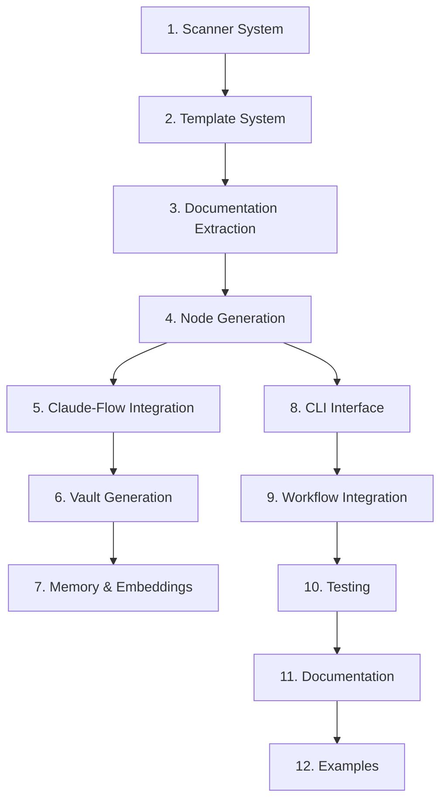

# Vault Initialization System - Task Breakdown

**Phase ID**: PHASE-6
**Status**: pending
**Priority**: high
**Total Tasks**: 63
**Estimated Effort**: 15-20 days

---

## Overview

Comprehensive task breakdown for implementing the Vault Initialization System. Tasks are organized hierarchically with clear dependencies, effort estimates, and acceptance criteria.

---

## 1. Project Codebase Scanner (Days 1-3)

### 1.1 Framework Detection
**Effort**: 4 hours | **Priority**: High | **Dependencies**: None

Implement multi-framework detection system supporting Next.js, React, Express, Django, FastAPI, and Flask.

**Acceptance Criteria**:
- [ ] Detect package.json framework dependencies (Next.js, React, Express)
- [ ] Detect requirements.txt framework dependencies (Django, FastAPI, Flask)
- [ ] Parse framework-specific config files (next.config.js, tsconfig.json, etc.)
- [ ] Return framework type + version
- [ ] Handle multiple frameworks in monorepos
- [ ] Unit tests with 90%+ coverage

**Implementation Notes**:
- Use AST parsing for accurate detection
- Check both direct and transitive dependencies
- Support workspace/monorepo structures

---

### 1.2 Directory Tree Scanner
**Effort**: 6 hours | **Priority**: High | **Dependencies**: 1.1

Build recursive directory tree scanner with intelligent ignore patterns.

**Acceptance Criteria**:
- [ ] Recursive directory traversal
- [ ] Respect .gitignore patterns
- [ ] Support custom ignore patterns (node_modules, .git, dist, build)
- [ ] Return tree structure with file metadata (size, type, modified date)
- [ ] Handle symbolic links safely
- [ ] Performance: <1s for repositories with 10k+ files
- [ ] Unit tests for edge cases (circular symlinks, permissions)

**Implementation Notes**:
- Use streaming for large directories
- Implement depth limits to prevent infinite recursion
- Cache results for performance

---

### 1.3 TypeScript/JavaScript Component Extractor
**Effort**: 8 hours | **Priority**: High | **Dependencies**: 1.2

Extract components, hooks, and utilities from TypeScript/JavaScript codebases using Babel/TS AST.

**Acceptance Criteria**:
- [ ] Parse TypeScript and JavaScript files
- [ ] Extract React components (functional, class-based)
- [ ] Extract custom hooks (use* pattern)
- [ ] Extract utility functions and modules
- [ ] Capture JSDoc comments and type definitions
- [ ] Identify component dependencies and imports
- [ ] Handle JSX/TSX syntax
- [ ] Unit tests with real-world component examples

**Implementation Notes**:
- Use @babel/parser for AST generation
- Use @typescript/parser for TS-specific features
- Handle both default and named exports

---

### 1.4 Python Module Extractor
**Effort**: 6 hours | **Priority**: High | **Dependencies**: 1.2

Extract classes, functions, and modules from Python codebases using AST.

**Acceptance Criteria**:
- [ ] Parse Python files with AST module
- [ ] Extract classes with methods
- [ ] Extract standalone functions
- [ ] Capture docstrings (Google, NumPy, Sphinx formats)
- [ ] Identify module-level imports
- [ ] Handle type hints and decorators
- [ ] Subprocess-based execution for safety
- [ ] Unit tests with Django/FastAPI/Flask examples

**Implementation Notes**:
- Run Python AST parsing in isolated subprocess
- Support Python 3.8+ syntax
- Handle async functions and decorators

---

### 1.5 Configuration File Parser
**Effort**: 4 hours | **Priority**: Medium | **Dependencies**: 1.1

Parse project configuration files for metadata extraction.

**Acceptance Criteria**:
- [ ] Parse package.json (scripts, dependencies, engines)
- [ ] Parse requirements.txt with version constraints
- [ ] Parse tsconfig.json (compiler options, paths)
- [ ] Parse pyproject.toml (build system, dependencies)
- [ ] Extract environment variables from .env files
- [ ] Validate JSON/YAML/TOML syntax
- [ ] Unit tests for malformed configs

**Implementation Notes**:
- Use Zod for schema validation
- Handle comments in JSON files (JSON5)
- Support multiple config file formats

---

### 1.6 Scanner Integration Tests
**Effort**: 4 hours | **Priority**: High | **Dependencies**: 1.1-1.5

Create comprehensive integration tests for the scanner system.

**Acceptance Criteria**:
- [ ] End-to-end tests with real repositories
- [ ] Test fixtures for each framework type
- [ ] Performance benchmarks (10k+ files)
- [ ] Error handling tests (corrupted files, permissions)
- [ ] Cross-platform compatibility (Linux, macOS, Windows)
- [ ] Code coverage 85%+

**Implementation Notes**:
- Use vitest for testing
- Create fixture repositories for each framework
- Mock file system for edge cases

---

## 2. Template System (Days 4-5)

### 2.1 Template Schema Definition
**Effort**: 3 hours | **Priority**: High | **Dependencies**: None

Create YAML schema for vault initialization templates.

**Acceptance Criteria**:
- [ ] Define template schema with Zod
- [ ] Support variable substitution ({{projectName}}, {{framework}})
- [ ] Define template metadata (name, version, framework)
- [ ] Support conditional sections (if framework === 'nextjs')
- [ ] Validate template structure on load
- [ ] Document schema with examples

**Implementation Notes**:
- Use YAML for template definitions
- Handlebars-style template syntax
- Support nested templates

---

### 2.2 Create 5 Core Templates
**Effort**: 8 hours | **Priority**: High | **Dependencies**: 2.1

Define templates for Next.js, React, Express, Django, and FastAPI projects.

**Acceptance Criteria**:
- [ ] **Next.js Template**: App Router, API routes, components, pages
- [ ] **React Template**: Components, hooks, utilities, state management
- [ ] **Express Template**: Routes, middleware, controllers, models
- [ ] **Django Template**: Apps, models, views, templates, admin
- [ ] **FastAPI Template**: Routes, models (Pydantic), dependencies, background tasks
- [ ] Each template includes directory structure mapping
- [ ] Each template defines node types (concept, technical, feature)

**Implementation Notes**:
- Templates stored in `src/templates/`
- Each template has metadata + structure definition
- Support both TypeScript and JavaScript variants

---

### 2.3 Handlebars Template Engine
**Effort**: 6 hours | **Priority**: High | **Dependencies**: 2.1

Implement Handlebars templates for each document type (concept, technical, feature).

**Acceptance Criteria**:
- [ ] Concept node template with frontmatter
- [ ] Technical node template with code examples
- [ ] Feature node template with acceptance criteria
- [ ] Architecture diagram template (Mermaid)
- [ ] Research note template
- [ ] Support custom Handlebars helpers (wikilink, tag, diagram)
- [ ] Unit tests for each template

**Implementation Notes**:
- Use Handlebars.js for templating
- Create custom helpers for Obsidian-specific features
- Templates stored in `src/templates/handlebars/`

---

### 2.4 Template Loader & Validator
**Effort**: 4 hours | **Priority**: High | **Dependencies**: 2.2, 2.3

Implement template loading system with validation.

**Acceptance Criteria**:
- [ ] Load templates from file system
- [ ] Validate template schema with Zod
- [ ] Cache compiled templates
- [ ] Support template inheritance (base + framework-specific)
- [ ] Detailed error messages for invalid templates
- [ ] Hot reload templates in development mode

**Implementation Notes**:
- Lazy load templates on demand
- Cache compiled Handlebars templates
- Watch template files in dev mode

---

### 2.5 Template System Tests
**Effort**: 3 hours | **Priority**: High | **Dependencies**: 2.1-2.4

Write comprehensive tests for template system.

**Acceptance Criteria**:
- [ ] Unit tests for schema validation
- [ ] Integration tests for template rendering
- [ ] Test variable substitution
- [ ] Test conditional sections
- [ ] Test custom Handlebars helpers
- [ ] Code coverage 90%+

**Implementation Notes**:
- Test with fixture data for each framework
- Snapshot testing for rendered output
- Edge case testing (missing variables, invalid syntax)

---

## 3. Documentation Extraction (Days 6-7)

### 3.1 README Parser
**Effort**: 4 hours | **Priority**: High | **Dependencies**: 1.2

Extract structured information from README.md files.

**Acceptance Criteria**:
- [ ] Parse README.md with markdown AST
- [ ] Extract sections (Overview, Features, Installation, Usage)
- [ ] Identify technology stack mentions
- [ ] Extract code examples
- [ ] Capture badges and links
- [ ] Handle multiple README files (root, subdirectories)
- [ ] Unit tests with real README examples

**Implementation Notes**:
- Use remark/unified for markdown parsing
- Create structured representation of README content
- Support CommonMark + GitHub Flavored Markdown

---

### 3.2 JSDoc Comment Extractor
**Effort**: 5 hours | **Priority**: Medium | **Dependencies**: 1.3

Extract JSDoc comments from TypeScript/JavaScript files.

**Acceptance Criteria**:
- [ ] Parse JSDoc comments from function/class definitions
- [ ] Extract @param, @returns, @example tags
- [ ] Capture @deprecated, @see, @link tags
- [ ] Associate comments with corresponding code elements
- [ ] Handle multi-line comments
- [ ] Support TypeScript type annotations
- [ ] Unit tests with various JSDoc formats

**Implementation Notes**:
- Use @babel/parser to locate comments
- Parse JSDoc tags with doctrine or jsdoc-parse
- Associate comments with AST nodes

---

### 3.3 Python Docstring Extractor
**Effort**: 4 hours | **Priority**: Medium | **Dependencies**: 1.4

Extract Python docstrings with support for multiple formats.

**Acceptance Criteria**:
- [ ] Parse docstrings from functions, classes, modules
- [ ] Support Google-style docstrings
- [ ] Support NumPy-style docstrings
- [ ] Support Sphinx-style docstrings
- [ ] Extract parameter descriptions and types
- [ ] Extract return value documentation
- [ ] Unit tests for each docstring format

**Implementation Notes**:
- Use Python AST to locate docstrings
- Parse structured formats with regex patterns
- Run in subprocess for safety

---

### 3.4 OpenAPI/Swagger Spec Parser
**Effort**: 6 hours | **Priority**: Medium | **Dependencies**: 1.5

Parse OpenAPI/Swagger specifications if present.

**Acceptance Criteria**:
- [ ] Detect openapi.json, openapi.yaml, swagger.json
- [ ] Parse OpenAPI 3.x specifications
- [ ] Extract API endpoints (paths, methods, parameters)
- [ ] Extract data models (schemas, components)
- [ ] Capture endpoint descriptions and examples
- [ ] Validate OpenAPI spec structure
- [ ] Unit tests with real API specs

**Implementation Notes**:
- Use openapi-typescript or swagger-parser
- Support both YAML and JSON formats
- Handle $ref references

---

### 3.5 Claude-Flow Concept Extraction
**Effort**: 8 hours | **Priority**: High | **Dependencies**: 3.1-3.4

Use Claude-Flow MCP tools to extract high-level concepts from documentation.

**Acceptance Criteria**:
- [ ] Send documentation to Claude-Flow for analysis
- [ ] Extract key concepts and terminology
- [ ] Identify relationships between concepts
- [ ] Generate concept descriptions (2-3 sentences)
- [ ] Handle large documents with chunking
- [ ] Cache results to avoid duplicate API calls
- [ ] Rate limiting and error handling
- [ ] Integration tests with Claude-Flow

**Implementation Notes**:
- Use mcp__claude-flow__memory_usage for caching
- Implement retry logic with exponential backoff
- Chunk large documents (max 8k tokens per chunk)

---

### 3.6 Documentation Integration Tests
**Effort**: 3 hours | **Priority**: High | **Dependencies**: 3.1-3.5

End-to-end tests for documentation extraction pipeline.

**Acceptance Criteria**:
- [ ] Test with real project repositories
- [ ] Verify extracted concepts are accurate
- [ ] Test Claude-Flow integration with mocks
- [ ] Test offline fallback mode
- [ ] Performance tests (large documentation sets)
- [ ] Code coverage 85%+

**Implementation Notes**:
- Mock Claude-Flow API calls for tests
- Use fixture projects with known documentation
- Test graceful degradation without API access

---

## 4. Node Generation (Days 8-10)

### 4.1 Taxonomy Mapper
**Effort**: 6 hours | **Priority**: High | **Dependencies**: 2.4

Map application structure to vault directory taxonomy.

**Acceptance Criteria**:
- [ ] Map framework types to vault directories (concepts/, technical/, features/)
- [ ] Define node type rules (component → technical, hook → technical, model → feature)
- [ ] Support custom taxonomy overrides
- [ ] Generate directory structure recommendations
- [ ] Handle edge cases (mixed concerns, unclear categorization)
- [ ] Unit tests for all framework types

**Implementation Notes**:
- Define taxonomy rules in YAML config
- Use template definitions for directory structure
- Support user-defined taxonomy extensions

---

### 4.2 Node Type Generators
**Effort**: 10 hours | **Priority**: High | **Dependencies**: 2.3, 4.1

Create specialized generators for each node type (concept, technical, feature, research, architecture).

**Acceptance Criteria**:
- [ ] **Concept Node Generator**: High-level ideas, terminology, theory
- [ ] **Technical Node Generator**: Components, APIs, libraries, frameworks
- [ ] **Feature Node Generator**: User-facing functionality, requirements
- [ ] **Research Node Generator**: Analysis, findings, decisions
- [ ] **Architecture Node Generator**: System design, diagrams, patterns
- [ ] Each generator produces valid frontmatter + content
- [ ] Each generator handles missing data gracefully
- [ ] Unit tests for each generator

**Implementation Notes**:
- Each generator extends base NodeGenerator class
- Use Handlebars templates for content
- Generate wikilinks during node creation

---

### 4.3 Wikilink Relationship Builder
**Effort**: 8 hours | **Priority**: High | **Dependencies**: 4.2

Build bi-directional wikilink relationships between nodes.

**Acceptance Criteria**:
- [ ] Identify relationships between nodes (component → hook, feature → component)
- [ ] Generate wikilinks in markdown content
- [ ] Create relationship metadata (parent, child, related)
- [ ] Support relationship types (depends-on, implements, uses)
- [ ] Validate wikilink targets exist
- [ ] Generate relationship graph data
- [ ] Unit tests for relationship detection

**Implementation Notes**:
- Analyze imports/dependencies for relationships
- Use graph structure to represent relationships
- Store relationships in frontmatter metadata

---

### 4.4 Mermaid Diagram Generator
**Effort**: 6 hours | **Priority**: Medium | **Dependencies**: 4.3

Generate Mermaid architecture diagrams from node relationships.

**Acceptance Criteria**:
- [ ] Generate component dependency diagrams
- [ ] Generate system architecture diagrams
- [ ] Generate data flow diagrams
- [ ] Support different diagram types (flowchart, sequence, class)
- [ ] Include node descriptions in diagrams
- [ ] Generate concept-map.md with full project graph
- [ ] Unit tests with diagram validation

**Implementation Notes**:
- Use Mermaid syntax for diagrams
- Embed diagrams in architecture nodes
- Generate interactive diagrams (clickable nodes)

---

### 4.5 Frontmatter Generator
**Effort**: 4 hours | **Priority**: High | **Dependencies**: 4.2

Generate YAML frontmatter for each node with metadata.

**Acceptance Criteria**:
- [ ] Generate consistent frontmatter structure
- [ ] Include node type, tags, creation date
- [ ] Include relationships (links, parent, children)
- [ ] Include framework-specific metadata
- [ ] Support custom metadata fields
- [ ] Validate frontmatter with Zod schema
- [ ] Unit tests for all node types

**Implementation Notes**:
- Use YAML library for safe serialization
- Define frontmatter schema per node type
- Include wikilinks in frontmatter

---

### 4.6 Node Generation Integration Tests
**Effort**: 4 hours | **Priority**: High | **Dependencies**: 4.1-4.5

End-to-end tests for node generation pipeline.

**Acceptance Criteria**:
- [ ] Test complete node generation for each framework
- [ ] Verify frontmatter validity
- [ ] Verify wikilinks are correct
- [ ] Verify diagrams render correctly
- [ ] Test with real project data
- [ ] Code coverage 85%+

**Implementation Notes**:
- Use fixture projects for testing
- Validate generated markdown syntax
- Test Obsidian graph view compatibility

---

## 5. Claude-Flow Integration (Days 11-12)

### 5.1 MCP Tool Integration
**Effort**: 6 hours | **Priority**: High | **Dependencies**: None

Integrate Claude-Flow MCP tools for AI-powered content generation.

**Acceptance Criteria**:
- [ ] Configure mcp__claude-flow__memory_usage for caching
- [ ] Configure mcp__claude-flow__neural_patterns for concept extraction
- [ ] Configure mcp__claude-flow__task_orchestrate for workflow
- [ ] Handle MCP tool errors gracefully
- [ ] Implement retry logic with backoff
- [ ] Unit tests with mocked MCP responses

**Implementation Notes**:
- Use @modelcontextprotocol/sdk for MCP communication
- Store MCP configuration in .env
- Implement circuit breaker for API failures

---

### 5.2 Content Generation Prompts
**Effort**: 8 hours | **Priority**: High | **Dependencies**: 5.1

Create specialized prompts for each document type.

**Acceptance Criteria**:
- [ ] Concept node prompt (extract key ideas)
- [ ] Technical node prompt (document APIs, usage)
- [ ] Feature node prompt (describe functionality)
- [ ] Architecture prompt (explain system design)
- [ ] Each prompt produces consistent output format
- [ ] Prompts include context from scanned code
- [ ] Integration tests with Claude-Flow

**Implementation Notes**:
- Store prompts in `src/prompts/` directory
- Use prompt templates with variable substitution
- Include code examples in prompts for context

---

### 5.3 Content Caching System
**Effort**: 4 hours | **Priority**: Medium | **Dependencies**: 5.1

Implement caching to avoid duplicate Claude-Flow API calls.

**Acceptance Criteria**:
- [ ] Cache Claude-Flow responses by content hash
- [ ] Set TTL for cached content (24 hours default)
- [ ] Store cache in SQLite database
- [ ] Invalidate cache on source file changes
- [ ] CLI flag to force cache refresh
- [ ] Unit tests for cache hit/miss scenarios

**Implementation Notes**:
- Use better-sqlite3 for cache storage
- Hash input content with SHA-256
- Implement LRU eviction for cache size limits

---

### 5.4 Offline Fallback Mode
**Effort**: 4 hours | **Priority**: Medium | **Dependencies**: 3.6

Implement offline mode using only extracted data (no AI generation).

**Acceptance Criteria**:
- [ ] Detect when Claude-Flow is unavailable
- [ ] Generate content from extracted data only
- [ ] Use templates without AI enrichment
- [ ] Display warning when in offline mode
- [ ] CLI flag to force offline mode
- [ ] Integration tests for offline mode

**Implementation Notes**:
- Use extracted JSDoc/docstrings for descriptions
- Generate basic content from code structure
- Gracefully degrade AI features

---

### 5.5 Claude-Flow Integration Tests
**Effort**: 4 hours | **Priority**: High | **Dependencies**: 5.1-5.4

Comprehensive tests for Claude-Flow integration.

**Acceptance Criteria**:
- [ ] Integration tests with real Claude-Flow API
- [ ] Mock tests for offline testing
- [ ] Test error handling and retries
- [ ] Test cache behavior
- [ ] Test offline fallback
- [ ] Code coverage 85%+

**Implementation Notes**:
- Use environment variable for test API key
- Mock MCP responses for CI/CD
- Test rate limiting behavior

---

## 6. Vault Structure Generation (Days 13-14)

### 6.1 Markdown File Writer
**Effort**: 4 hours | **Priority**: High | **Dependencies**: 4.5

Implement markdown file writer with validation.

**Acceptance Criteria**:
- [ ] Write markdown files with frontmatter
- [ ] Ensure UTF-8 encoding
- [ ] Validate markdown syntax before writing
- [ ] Handle file write conflicts (existing files)
- [ ] Atomic file writes (temp + rename)
- [ ] Unit tests for edge cases (permissions, disk space)

**Implementation Notes**:
- Use Node.js fs promises for async I/O
- Validate markdown with remark
- Implement rollback on write failures

---

### 6.2 Shadow Cache Population
**Effort**: 6 hours | **Priority**: High | **Dependencies**: 6.1

Populate Weaver's shadow cache with generated files.

**Acceptance Criteria**:
- [ ] Store file metadata in shadow cache SQLite database
- [ ] Track frontmatter fields (tags, links, type)
- [ ] Index wikilinks for graph queries
- [ ] Store file content hashes for change detection
- [ ] Batch insert for performance
- [ ] Integration tests with Weaver

**Implementation Notes**:
- Use better-sqlite3 for cache database
- Follow Weaver's cache schema
- Implement transaction batching for performance

---

### 6.3 Git Repository Initialization
**Effort**: 3 hours | **Priority**: Medium | **Dependencies**: 6.1

Initialize Git repository with appropriate .gitignore.

**Acceptance Criteria**:
- [ ] Run `git init` in vault directory
- [ ] Create .gitignore with appropriate patterns (.obsidian/, .trash/)
- [ ] Create initial commit with generated files
- [ ] Set up Git hooks (optional, based on config)
- [ ] Handle existing Git repositories gracefully
- [ ] Unit tests for Git operations

**Implementation Notes**:
- Use simple-git library
- Check for existing .git directory
- Don't override existing .gitignore

---

### 6.4 Vault README Generation
**Effort**: 4 hours | **Priority**: Medium | **Dependencies**: 4.4

Generate comprehensive README.md for the vault.

**Acceptance Criteria**:
- [ ] Include project overview (from scanned data)
- [ ] Include directory structure explanation
- [ ] Include navigation guide
- [ ] Include technology stack summary
- [ ] Include links to key nodes
- [ ] Include Mermaid diagram preview
- [ ] Use Handlebars template

**Implementation Notes**:
- Use template from `src/templates/vault-readme.hbs`
- Include statistics (node count, file count)
- Link to concept-map.md

---

### 6.5 Concept Map Generation
**Effort**: 6 hours | **Priority**: High | **Dependencies**: 4.4

Generate concept-map.md with comprehensive Mermaid diagram.

**Acceptance Criteria**:
- [ ] Include all major nodes in diagram
- [ ] Show relationships between nodes
- [ ] Use appropriate Mermaid diagram type
- [ ] Include diagram legend
- [ ] Make nodes clickable (wikilinks)
- [ ] Generate graph statistics
- [ ] Integration tests with Obsidian graph view

**Implementation Notes**:
- Use graph data from relationship builder
- Limit diagram size (max 50-100 nodes for readability)
- Group nodes by type/category

---

### 6.6 Vault Generation End-to-End Tests
**Effort**: 4 hours | **Priority**: High | **Dependencies**: 6.1-6.5

Complete end-to-end tests for vault generation.

**Acceptance Criteria**:
- [ ] Test complete vault generation for each framework
- [ ] Verify all files are created correctly
- [ ] Verify shadow cache is populated
- [ ] Verify Git repository is initialized
- [ ] Verify README and concept-map are valid
- [ ] Test with real project repositories
- [ ] Code coverage 85%+

**Implementation Notes**:
- Use temp directories for test vaults
- Validate with Obsidian vault checker (if available)
- Test cleanup on failure

---

## 7. Memory & Embeddings (Days 15-16)

### 7.1 Project Overview Memory Storage
**Effort**: 3 hours | **Priority**: Medium | **Dependencies**: 3.1

Store project overview in Claude-Flow memory with namespace.

**Acceptance Criteria**:
- [ ] Use namespace pattern: `project:{app-name}`
- [ ] Store project name, description, version
- [ ] Store framework type and version
- [ ] Store directory structure summary
- [ ] Store technology stack
- [ ] Use mcp__claude-flow__memory_usage tool
- [ ] Unit tests for memory operations

**Implementation Notes**:
- Namespace format: `project:weave-nn:overview`
- Store as JSON for structured queries
- Set appropriate TTL for cache

---

### 7.2 Technical Stack Memory Storage
**Effort**: 3 hours | **Priority**: Medium | **Dependencies**: 1.5, 7.1

Store technical stack information in memory.

**Acceptance Criteria**:
- [ ] Store dependencies (runtime, dev)
- [ ] Store framework versions
- [ ] Store build tools configuration
- [ ] Store environment requirements
- [ ] Use namespace: `project:{app-name}:stack`
- [ ] Integration tests with memory retrieval

**Implementation Notes**:
- Extract from package.json, requirements.txt
- Include version ranges
- Store as structured JSON

---

### 7.3 Embedding Generation
**Effort**: 6 hours | **Priority**: Medium | **Dependencies**: 4.2

Generate embeddings for all vault nodes using OpenAI API.

**Acceptance Criteria**:
- [ ] Generate embeddings for node content (text-embedding-ada-002)
- [ ] Batch embedding requests (max 100 per request)
- [ ] Store embeddings with node metadata
- [ ] Handle rate limits gracefully
- [ ] Cache embeddings in database
- [ ] Unit tests with mocked OpenAI API

**Implementation Notes**:
- Use OpenAI SDK for embeddings
- Combine frontmatter + content for embedding
- Store in SQLite with node ID reference

---

### 7.4 Claude-Flow Embedding Storage
**Effort**: 4 hours | **Priority**: Medium | **Dependencies**: 7.3

Store embeddings in Claude-Flow for semantic search.

**Acceptance Criteria**:
- [ ] Upload embeddings to Claude-Flow
- [ ] Use mcp__claude-flow__neural_patterns tool
- [ ] Associate embeddings with node IDs
- [ ] Enable vector similarity search
- [ ] Test semantic queries
- [ ] Integration tests with Claude-Flow

**Implementation Notes**:
- Use neural patterns API for vector storage
- Implement batch upload for performance
- Test similarity queries

---

### 7.5 Semantic Search Integration
**Effort**: 4 hours | **Priority**: Low | **Dependencies**: 7.4

Enable semantic search via Claude-Flow neural patterns.

**Acceptance Criteria**:
- [ ] Implement semantic search CLI command
- [ ] Query embeddings by natural language
- [ ] Return top-k similar nodes
- [ ] Include similarity scores
- [ ] Test with example queries
- [ ] Integration tests

**Implementation Notes**:
- Use mcp__claude-flow__neural_predict for queries
- Combine with keyword search for hybrid results
- Display results with context snippets

---

## 8. CLI Interface (Day 17)

### 8.1 Commander CLI Setup
**Effort**: 4 hours | **Priority**: High | **Dependencies**: None

Create CLI interface with Commander.js.

**Acceptance Criteria**:
- [ ] Main command: `weaver init-vault <app-path>`
- [ ] Options: --template, --output, --dry-run, --offline
- [ ] Version command: `weaver --version`
- [ ] Help command: `weaver init-vault --help`
- [ ] Auto-detect framework if not specified
- [ ] Colorized output (success, error, warning)
- [ ] Unit tests for CLI parsing

**Implementation Notes**:
- Use commander package
- Use chalk for colors
- Store CLI in `src/cli/init-vault.ts`

---

### 8.2 Interactive Prompts
**Effort**: 4 hours | **Priority**: Medium | **Dependencies**: 8.1

Implement interactive prompts for configuration.

**Acceptance Criteria**:
- [ ] Prompt for vault output path
- [ ] Prompt for template selection (if multiple match)
- [ ] Confirm before overwriting existing vault
- [ ] Show configuration summary before execution
- [ ] Support --yes flag to skip prompts
- [ ] Unit tests with mocked stdin

**Implementation Notes**:
- Use inquirer or prompts package
- Store answers in config object
- Validate user inputs

---

### 8.3 Progress Reporting
**Effort**: 4 hours | **Priority**: Medium | **Dependencies**: 8.1

Add progress indicators and logging.

**Acceptance Criteria**:
- [ ] Show spinner during long operations
- [ ] Show progress bar for file processing
- [ ] Display operation steps (Scanning, Extracting, Generating, Writing)
- [ ] Log detailed output in debug mode (--verbose)
- [ ] Color-coded success/error messages
- [ ] Unit tests for progress display

**Implementation Notes**:
- Use ora for spinners
- Use cli-progress for progress bars
- Use winston for logging

---

### 8.4 Dry-Run Mode
**Effort**: 3 hours | **Priority**: Medium | **Dependencies**: 8.1

Implement dry-run mode to preview changes without writing.

**Acceptance Criteria**:
- [ ] Flag: --dry-run or -d
- [ ] Show files that would be created
- [ ] Show directory structure preview
- [ ] Show memory keys that would be stored
- [ ] Show API calls that would be made
- [ ] No actual file writes or API calls

**Implementation Notes**:
- Mock file write operations
- Mock MCP tool calls
- Display detailed preview output

---

### 8.5 Error Handling & Rollback
**Effort**: 6 hours | **Priority**: High | **Dependencies**: 8.1

Implement comprehensive error handling and rollback.

**Acceptance Criteria**:
- [ ] Catch and handle all error types
- [ ] Display user-friendly error messages
- [ ] Rollback partial vault on failure
- [ ] Log detailed errors to file
- [ ] Exit with appropriate status codes
- [ ] Unit tests for error scenarios

**Implementation Notes**:
- Implement transaction-like behavior
- Store temp files before committing
- Clean up on SIGINT (Ctrl+C)

---

### 8.6 CLI Integration Tests
**Effort**: 3 hours | **Priority**: High | **Dependencies**: 8.1-8.5

End-to-end tests for CLI interface.

**Acceptance Criteria**:
- [ ] Test CLI with real project repositories
- [ ] Test all CLI flags and options
- [ ] Test interactive prompts (mocked input)
- [ ] Test error scenarios
- [ ] Test dry-run mode
- [ ] Code coverage 85%+

**Implementation Notes**:
- Use child_process to spawn CLI
- Mock stdin for interactive tests
- Verify exit codes and output

---

## 9. Workflow Integration (Day 18)

### 9.1 Workflow Definition
**Effort**: 4 hours | **Priority**: Medium | **Dependencies**: None

Create vault-initialization workflow for Weaver workflow engine.

**Acceptance Criteria**:
- [ ] Define workflow steps (scan, extract, generate, write)
- [ ] Define workflow inputs (appPath, template, outputPath)
- [ ] Define workflow outputs (vaultPath, nodeCount, status)
- [ ] Include error handling steps
- [ ] Support workflow resume on failure
- [ ] YAML workflow definition

**Implementation Notes**:
- Store in `workflows/vault-initialization.yaml`
- Follow Weaver workflow schema
- Include validation steps

---

### 9.2 Workflow Engine Integration
**Effort**: 4 hours | **Priority**: Medium | **Dependencies**: 9.1

Integrate with Weaver's existing workflow engine.

**Acceptance Criteria**:
- [ ] Register vault-initialization workflow
- [ ] Execute workflow via Weaver CLI
- [ ] Track workflow execution state
- [ ] Store workflow results in database
- [ ] Support workflow cancellation
- [ ] Integration tests with workflow engine

**Implementation Notes**:
- Use Weaver's workflow API
- Implement workflow handlers for each step
- Store state in workflow database

---

### 9.3 Execution Tracking
**Effort**: 3 hours | **Priority**: Low | **Dependencies**: 9.2

Add execution tracking and metrics.

**Acceptance Criteria**:
- [ ] Track execution time per step
- [ ] Track API call count and cost
- [ ] Track files generated count
- [ ] Track errors and warnings
- [ ] Store metrics in database
- [ ] Display metrics summary on completion

**Implementation Notes**:
- Use performance.now() for timing
- Track token usage from Claude-Flow
- Store in execution_metrics table

---

### 9.4 MCP Tool: trigger_vault_initialization
**Effort**: 4 hours | **Priority**: Medium | **Dependencies**: 9.2

Create MCP tool for triggering vault initialization.

**Acceptance Criteria**:
- [ ] MCP tool name: `trigger_vault_initialization`
- [ ] Parameters: appPath, template, outputPath, options
- [ ] Returns: vaultPath, nodeCount, status, errors
- [ ] Async execution support
- [ ] Progress updates via MCP notifications
- [ ] Integration tests with MCP client

**Implementation Notes**:
- Implement in Weaver MCP server
- Use workflow engine for execution
- Send progress notifications

---

## 10. Testing & Quality (Day 19)

### 10.1 Unit Test Suite
**Effort**: 6 hours | **Priority**: High | **Dependencies**: All implementation tasks

Comprehensive unit tests for all modules.

**Acceptance Criteria**:
- [ ] Unit tests for all scanner modules
- [ ] Unit tests for template system
- [ ] Unit tests for node generators
- [ ] Unit tests for CLI interface
- [ ] Code coverage 80%+ overall
- [ ] All tests pass in CI/CD

**Implementation Notes**:
- Use vitest for testing
- Mock external dependencies (file system, APIs)
- Use test fixtures for data

---

### 10.2 End-to-End Test Suite
**Effort**: 6 hours | **Priority**: High | **Dependencies**: 10.1

E2E tests with real application repositories.

**Acceptance Criteria**:
- [ ] E2E test for Next.js project
- [ ] E2E test for React project
- [ ] E2E test for Express project
- [ ] E2E test for Django project
- [ ] E2E test for FastAPI project
- [ ] Validate generated vault structure
- [ ] Validate Obsidian compatibility

**Implementation Notes**:
- Create fixture repositories for each framework
- Run full vault initialization
- Validate with Obsidian if possible

---

### 10.3 Test Fixtures
**Effort**: 4 hours | **Priority**: Medium | **Dependencies**: 10.2

Create comprehensive test fixtures for all templates.

**Acceptance Criteria**:
- [ ] Fixture projects for each framework
- [ ] Sample documentation (README, JSDoc, docstrings)
- [ ] Sample configuration files
- [ ] Expected output vault structures
- [ ] Fixture data for unit tests
- [ ] Document fixture usage

**Implementation Notes**:
- Store in `tests/fixtures/` directory
- Include minimal but representative code
- Version control fixtures

---

### 10.4 Performance Testing
**Effort**: 4 hours | **Priority**: Low | **Dependencies**: 10.1

Measure and optimize initialization performance.

**Acceptance Criteria**:
- [ ] Benchmark initialization time by project size
- [ ] Measure memory usage
- [ ] Measure API call count and cost
- [ ] Target: <30s for small projects (<100 files)
- [ ] Target: <5min for large projects (1000+ files)
- [ ] Identify and optimize bottlenecks

**Implementation Notes**:
- Use benchmark.js or custom timing
- Profile with Node.js --prof
- Test with various project sizes

---

## 11. Documentation (Day 20)

### 11.1 User Guide
**Effort**: 4 hours | **Priority**: High | **Dependencies**: 8.6

Write comprehensive user guide for vault initialization.

**Acceptance Criteria**:
- [ ] Installation instructions
- [ ] Quick start guide
- [ ] CLI usage examples
- [ ] Template selection guide
- [ ] Troubleshooting section
- [ ] FAQ
- [ ] Screenshots and examples

**Implementation Notes**:
- Store in `docs/user-guide/vault-initialization.md`
- Include real command examples
- Link to generated example vaults

---

### 11.2 Developer Guide
**Effort**: 4 hours | **Priority**: Medium | **Dependencies**: 11.1

Write developer guide for extending and customizing.

**Acceptance Criteria**:
- [ ] Architecture overview
- [ ] Module documentation
- [ ] Template creation guide
- [ ] Custom node generator guide
- [ ] API reference
- [ ] Contributing guidelines

**Implementation Notes**:
- Store in `docs/developer-guide/vault-initialization.md`
- Include code examples
- Document extension points

---

### 11.3 Template Documentation
**Effort**: 3 hours | **Priority**: Medium | **Dependencies**: 2.2

Document all 5 templates in detail.

**Acceptance Criteria**:
- [ ] Document Next.js template structure
- [ ] Document React template structure
- [ ] Document Express template structure
- [ ] Document Django template structure
- [ ] Document FastAPI template structure
- [ ] Include example outputs for each

**Implementation Notes**:
- Store in `docs/templates/` directory
- Include template YAML and generated output
- Show vault directory structures

---

### 11.4 API Reference
**Effort**: 3 hours | **Priority**: Low | **Dependencies**: 11.2

Generate API reference documentation.

**Acceptance Criteria**:
- [ ] Document all exported functions
- [ ] Document all CLI commands
- [ ] Document all MCP tools
- [ ] Include TypeScript type definitions
- [ ] Include usage examples
- [ ] Auto-generate from JSDoc

**Implementation Notes**:
- Use TypeDoc or similar tool
- Generate from source code comments
- Host on docs site

---

### 11.5 Inline Code Documentation
**Effort**: 4 hours | **Priority**: Medium | **Dependencies**: All implementation

Add comprehensive JSDoc comments to all code.

**Acceptance Criteria**:
- [ ] JSDoc for all exported functions
- [ ] JSDoc for all classes and methods
- [ ] Type annotations for all parameters
- [ ] Usage examples in complex functions
- [ ] Document error conditions
- [ ] Document side effects

**Implementation Notes**:
- Follow TSDoc conventions
- Use @example tags for usage
- Document thrown errors

---

## 12. Examples & Validation (Day 20)

### 12.1 Example Vault Generation
**Effort**: 4 hours | **Priority**: Medium | **Dependencies**: 6.6

Generate example vaults for each template.

**Acceptance Criteria**:
- [ ] Generate Next.js example vault
- [ ] Generate React example vault
- [ ] Generate Express example vault
- [ ] Generate Django example vault
- [ ] Generate FastAPI example vault
- [ ] Include in repository for reference

**Implementation Notes**:
- Use real open-source projects as sources
- Store in `examples/vaults/` directory
- Document source project used

---

### 12.2 Example Vault Validation
**Effort**: 3 hours | **Priority**: Medium | **Dependencies**: 12.1

Validate all example vaults are valid and complete.

**Acceptance Criteria**:
- [ ] All wikilinks resolve correctly
- [ ] All frontmatter is valid YAML
- [ ] All Mermaid diagrams render
- [ ] Obsidian graph view works
- [ ] No broken links or missing files
- [ ] Automated validation script

**Implementation Notes**:
- Create validation script
- Check with Obsidian CLI (if available)
- Validate markdown syntax

---

### 12.3 Documentation Integration
**Effort**: 2 hours | **Priority**: Low | **Dependencies**: 12.2

Add example vaults to documentation.

**Acceptance Criteria**:
- [ ] Link to examples from user guide
- [ ] Include screenshots of generated vaults
- [ ] Show Obsidian graph views
- [ ] Highlight key features in examples
- [ ] Provide download links

**Implementation Notes**:
- Take screenshots with Obsidian
- Create interactive demos if possible
- Host examples for browsing

---

### 12.4 Comparison Screenshots
**Effort**: 2 hours | **Priority**: Low | **Dependencies**: 12.1

Create comparison screenshots for documentation.

**Acceptance Criteria**:
- [ ] Before/after comparison (empty vault vs initialized)
- [ ] Framework comparison (different templates side-by-side)
- [ ] Graph view comparisons
- [ ] Node detail comparisons
- [ ] High-quality screenshots

**Implementation Notes**:
- Use Obsidian for screenshots
- Annotate screenshots with highlights
- Include in documentation

---

## Critical Path

**Critical Dependencies**:
1. Scanner System (Days 1-3) → Foundation for all extraction
2. Template System (Days 4-5) → Required for node generation
3. Node Generation (Days 8-10) → Core output functionality
4. CLI Interface (Day 17) → User-facing interface
5. Testing (Day 19) → Quality validation

**Parallel Work Opportunities**:
- Documentation Extraction (Days 6-7) can run parallel to Template System
- CLI Interface (Day 17) can start after Node Generation completes
- Memory & Embeddings (Days 15-16) can run parallel to CLI development

---

## Effort Summary

| Phase | Tasks | Estimated Effort | Priority |
|-------|-------|-----------------|----------|
| 1. Scanner System | 6 | 32 hours (4 days) | High |
| 2. Template System | 5 | 24 hours (3 days) | High |
| 3. Documentation Extraction | 6 | 30 hours (3.75 days) | High |
| 4. Node Generation | 6 | 38 hours (4.75 days) | High |
| 5. Claude-Flow Integration | 5 | 26 hours (3.25 days) | High |
| 6. Vault Generation | 6 | 27 hours (3.4 days) | High |
| 7. Memory & Embeddings | 5 | 20 hours (2.5 days) | Medium |
| 8. CLI Interface | 6 | 24 hours (3 days) | High |
| 9. Workflow Integration | 4 | 15 hours (1.9 days) | Medium |
| 10. Testing & Quality | 4 | 20 hours (2.5 days) | High |
| 11. Documentation | 5 | 18 hours (2.25 days) | High |
| 12. Examples & Validation | 4 | 11 hours (1.4 days) | Medium |
| **TOTAL** | **63** | **285 hours (35.6 days)** | |

**Realistic Timeline**: 15-20 working days with focused effort and some parallel execution.

---

## Success Metrics

- [ ] All 63 tasks completed
- [ ] Code coverage 85%+
- [ ] All E2E tests passing
- [ ] Documentation complete
- [ ] 5 example vaults generated
- [ ] CLI fully functional
- [ ] Performance targets met
- [ ] Zero critical bugs
- [ ] Passes typecheck + lint
- [ ] Successfully integrated with Weaver

---

## Risk Mitigation

| Risk | Impact | Mitigation |
|------|--------|------------|
| Claude-Flow API failures | High | Implement offline fallback mode |
| Complex codebase scanning | High | Start with simple projects, add complexity |
| Template inflexibility | Medium | Support custom templates early |
| Performance issues | Medium | Implement caching and batching |
| Obsidian compatibility | Medium | Test with real Obsidian early |
| Scope creep | Low | Strict adherence to specification |

---

## Next Steps

1. Review this task breakdown with stakeholders
2. Set up project structure and dependencies
3. Begin implementation with Scanner System (Task 1.1)
4. Implement parallel work streams where possible
5. Run daily standup to track progress
6. Update task status in phase document regularly

---

**Generated**: 2025-10-24
**Total Tasks**: 63
**Estimated Effort**: 15-20 days
**Method**: AI-powered task breakdown (Spec-Kit /speckit.tasks)
