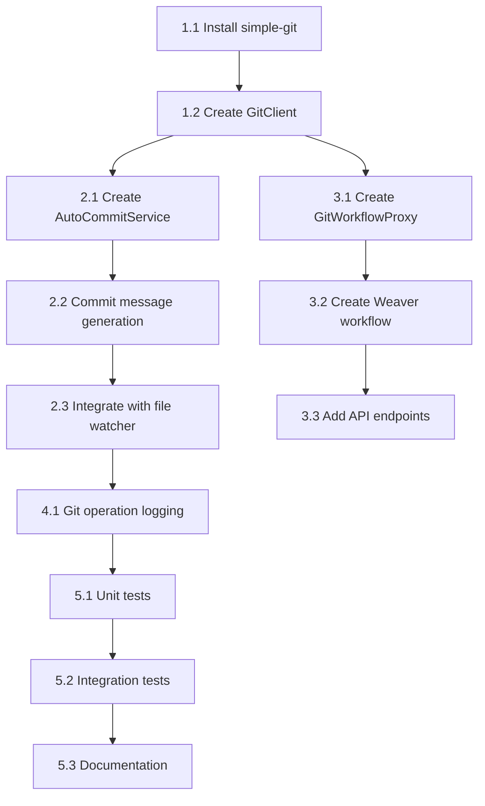

# Git Automation & Workflow Proxy - Task Breakdown

**Phase ID**: PHASE-8
**Status**: pending
**Priority**: medium
**Total Tasks**: 12
**Estimated Effort**: 2 days

---

## Overview

Comprehensive task breakdown for implementing Git automation with simple-git, Claude-powered commit messages, and Weaver workflow proxy integration.

---

## Related

[[constitution]]
## Related

[[phase-7-agent-tasks]]
## Related

[[specification]]
## Related

[[phase-5-mcp-tasks]]
## Related

[[phase-9-testing-tasks]]
## Related

[[phase-6-vault-tasks]]
## 1. Git Client Setup (Day 1 - Morning)

### 1.1 Install simple-git library
**Effort**: 0.5 hours | **Priority**: High | **Dependencies**: None

Install `simple-git` package and add TypeScript type definitions.

**Acceptance Criteria**:
- [ ] `simple-git` package installed (v3.24.0+)
- [ ] TypeScript types included (@types/simple-git if needed)
- [ ] Package listed in package.json dependencies
- [ ] Lock file updated (bun.lock)
- [ ] Can import `simpleGit` in TypeScript

**Files to Create/Modify**:
- `/home/aepod/dev/weave-nn/weaver/package.json` - Add dependency
- `/home/aepod/dev/weave-nn/weaver/bun.lock` - Lock dependency

**Implementation Notes**:
- Use bun for package management
- Verify TypeScript types are available
- Check compatibility with Node.js 18+

---

### 1.2 Create GitClient wrapper class
**Effort**: 2 hours | **Priority**: High | **Dependencies**: 1.1

Create `GitClient` class wrapping simple-git for all git operations.

**Acceptance Criteria**:
- [ ] `GitClient` class created in `src/git/git-client.ts`
- [ ] Constructor accepts `repoPath: string`
- [ ] Methods: `init()`, `status()`, `add()`, `commit()`, `addAndCommit()`, `log()`, `diff()`
- [ ] Initialize git repo if not exists (`git init`)
- [ ] Configure git user from .env (GIT_USER_NAME, GIT_USER_EMAIL)
- [ ] Defaults: `Weave-NN`, `weave-nn@local` if .env not set
- [ ] All methods return Promises
- [ ] Error handling for all git operations

**Files to Create/Modify**:
- `/home/aepod/dev/weave-nn/weaver/src/git/git-client.ts` - GitClient class

**Implementation Notes**:
- Use `simpleGit(repoPath)` for initialization
- Check `checkIsRepo()` before operations
- Use `addConfig()` for git user setup
- Handle errors gracefully (repo doesn't exist, corrupted index)

---

### 1.3 Add git configuration to .env
**Effort**: 0.5 hours | **Priority**: Medium | **Dependencies**: 1.2

Add git-related configuration to .env.example and documentation.

**Acceptance Criteria**:
- [ ] `.env.example` includes git configuration section
- [ ] Variables: GIT_USER_NAME, GIT_USER_EMAIL, GIT_AUTO_COMMIT_ENABLED, GIT_COMMIT_DEBOUNCE_MS
- [ ] Sensible defaults documented
- [ ] README.md updated with git configuration section
- [ ] Configuration validation in config loader

**Files to Create/Modify**:
- `/home/aepod/dev/weave-nn/weaver/.env.example` - Add git config
- `/home/aepod/dev/weave-nn/weaver/README.md` - Document configuration
- `/home/aepod/dev/weave-nn/weaver/src/config/index.ts` - Add config validation

**Implementation Notes**:
- Default debounce: 300000ms (5 minutes)
- Default auto-commit: true
- Use Zod for config validation

---

## 2. Auto-Commit Service (Day 1 - Afternoon)

### 2.1 Create AutoCommitService class
**Effort**: 3 hours | **Priority**: High | **Dependencies**: 1.2

Implement auto-commit service with debouncing and batching.

**Acceptance Criteria**:
- [ ] `AutoCommitService` class created in `src/git/auto-commit.ts`
- [ ] Constructor accepts `GitClient`, `ClaudeClient`, `debounceMs`
- [ ] Method: `onFileEvent(event: FileEvent): void` - Queue file change
- [ ] Method: `forceCommit(): Promise<void>` - Bypass debounce
- [ ] Debounce timer resets on each file event
- [ ] Pending changes stored in Set<string> (deduplicated)
- [ ] Execute commit after debounce window expires
- [ ] Ignore delete events (type === 'unlink')

**Files to Create/Modify**:
- `/home/aepod/dev/weave-nn/weaver/src/git/auto-commit.ts` - AutoCommitService class

**Implementation Notes**:
- Use `setTimeout` for debouncing
- Store pending changes in `Set<string>` for deduplication
- Clear timeout on each new file event
- Log all auto-commit operations

---

### 2.2 Implement commit message generation
**Effort**: 2 hours | **Priority**: High | **Dependencies**: 2.1

Generate semantic commit messages using Claude API based on changed files.

**Acceptance Criteria**:
- [ ] `generateCommitMessage(files: string[]): Promise<string>` method in AutoCommitService
- [ ] Send file list to Claude with specialized prompt
- [ ] Prompt requests conventional commit format: `type(scope): description`
- [ ] Parse Claude response for commit message
- [ ] Fallback to generic message if Claude API fails
- [ ] Timeout: 3 seconds max
- [ ] Handle edge cases: single file, many files (100+)

**Files to Create/Modify**:
- `/home/aepod/dev/weave-nn/weaver/src/git/auto-commit.ts` - Add generateCommitMessage method

**Implementation Notes**:
- Use existing `ClaudeClient` from Phase 7
- Prompt template: "Generate a conventional commit message for these vault changes: <file list>"
- Fallback messages: `docs: update N files` or `docs: update path/to/file.md`
- Handle very long file lists by summarizing directory

---

### 2.3 Integrate auto-commit with file watcher
**Effort**: 1.5 hours | **Priority**: High | **Dependencies**: 2.1, 2.2

Connect auto-commit service to file watcher event stream.

**Acceptance Criteria**:
- [ ] Update `EventProcessor` to instantiate `AutoCommitService`
- [ ] Call `autoCommit.onFileEvent(event)` for every file change
- [ ] Auto-commit disabled if `GIT_AUTO_COMMIT_ENABLED=false`
- [ ] No blocking of file watcher event loop
- [ ] Auto-commit runs after shadow cache update
- [ ] Log auto-commit initialization

**Files to Create/Modify**:
- `/home/aepod/dev/weave-nn/weaver/src/watcher/event-processor.ts` - Add auto-commit integration

**Implementation Notes**:
- Check config flag before enabling auto-commit
- Pass existing ClaudeClient instance to AutoCommitService
- Ensure auto-commit is non-blocking (async)
- Log when auto-commit is enabled/disabled

---

## 3. Weaver Workflow Proxy (Day 2 - Morning)

### 3.1 Create GitWorkflowProxy class
**Effort**: 2 hours | **Priority**: Medium | **Dependencies**: 1.2

Implement workflow proxy to trigger git operations via Weaver.

**Acceptance Criteria**:
- [ ] `GitWorkflowProxy` class created in `src/git/workflow-proxy.ts`
- [ ] Constructor accepts `WeaverClient`
- [ ] Method: `commit(files: string[], message: string): Promise<void>`
- [ ] Method: `push(remote?: string, branch?: string): Promise<void>` (optional)
- [ ] Send `WeaverEvent` to Weaver webhook
- [ ] Event type: `note-updated` with metadata `operation: 'git-commit'`
- [ ] Return immediately (fire-and-forget)

**Files to Create/Modify**:
- `/home/aepod/dev/weave-nn/weaver/src/git/workflow-proxy.ts` - GitWorkflowProxy class

**Implementation Notes**:
- Reuse existing `WeaverClient` from Phase 6
- Use `sendEvent()` method to trigger workflow
- Include files and message in event metadata
- Handle Weaver unavailability gracefully

---

### 3.2 Create Weaver git-commit workflow
**Effort**: 1.5 hours | **Priority**: Medium | **Dependencies**: 3.1

Define Weaver workflow for executing git commits.

**Acceptance Criteria**:
- [ ] Workflow file created in `workflows/git-commit.yaml`
- [ ] Trigger: `event.type === 'note-updated'` && `event.metadata.operation === 'git-commit'`
- [ ] Input: `{ files: string[], message: string }`
- [ ] Actions: 1) Validate files (no .env, .git), 2) git add, 3) git commit, 4) log SHA
- [ ] Workflow is idempotent (safe to retry)
- [ ] Error handling step (log failure, notify admin)

**Files to Create/Modify**:
- `/home/aepod/dev/weave-nn/weaver/workflows/git-commit.yaml` - Workflow definition

**Implementation Notes**:
- Use Weaver workflow schema
- Include validation step to prevent committing sensitive files
- Log commit SHA to workflow execution log
- Make workflow resumable on failure

---

### 3.3 Add git proxy API endpoints
**Effort**: 2 hours | **Priority**: Medium | **Dependencies**: 3.1

Expose HTTP API endpoints for git operations and diagnostics.

**Acceptance Criteria**:
- [ ] `POST /git/proxy/commit` - Trigger workflow commit
- [ ] `GET /admin/git/status` - Get git status (staged, unstaged, untracked)
- [ ] `GET /admin/git/logs` - Get recent commit log (last 20 commits)
- [ ] `POST /admin/git/force-commit` - Force immediate commit (bypass debounce)
- [ ] All endpoints return JSON responses
- [ ] Input validation with error messages
- [ ] Error handling (git repo not initialized, invalid input)

**Files to Create/Modify**:
- `/home/aepod/dev/weave-nn/weaver/src/server.ts` - Add git proxy routes

**Implementation Notes**:
- Use Hono router for HTTP endpoints
- Validate request body with Zod schemas
- Return appropriate HTTP status codes (200, 400, 500)
- Add admin authentication (future: JWT)

---

## 4. Logging & Observability (Day 2 - Afternoon)

### 4.1 Implement git operation logging
**Effort**: 1.5 hours | **Priority**: High | **Dependencies**: 2.2

Log all git operations for audit and debugging.

**Acceptance Criteria**:
- [ ] Create `logs/git-operations.log` file
- [ ] Log format: JSON lines (JSONL)
- [ ] Fields: timestamp, operation, sha, files, message, duration, status
- [ ] Log after every commit (success and failure)
- [ ] Daily rotation, max 7 days retention
- [ ] Log levels: INFO (success), ERROR (failure), WARN (retry)

**Files to Create/Modify**:
- `/home/aepod/dev/weave-nn/weaver/src/git/auto-commit.ts` - Add logging
- `/home/aepod/dev/weave-nn/weaver/src/git/git-logger.ts` - Logger utility (optional)

**Implementation Notes**:
- Use winston or pino for logging
- Log to file and console (development mode)
- Include operation duration (performance tracking)
- Rotate logs daily to prevent disk fill

---

### 4.2 Add git metrics endpoint
**Effort**: 1 hour | **Priority**: Low | **Dependencies**: 4.1

Expose git metrics for monitoring and debugging.

**Acceptance Criteria**:
- [ ] `GET /admin/git/metrics` endpoint
- [ ] Return JSON with: total commits, commits today, avg message length, failure rate
- [ ] Calculate metrics from git-operations.log
- [ ] Cache metrics (update every 5 minutes)
- [ ] Include in health check endpoint

**Files to Create/Modify**:
- `/home/aepod/dev/weave-nn/weaver/src/server.ts` - Add metrics endpoint
- `/home/aepod/dev/weave-nn/weaver/src/git/metrics.ts` - Metrics calculation

**Implementation Notes**:
- Parse git-operations.log for metrics
- Cache results to avoid re-reading log on every request
- Return metrics in Prometheus format (future)

---

## 5. Testing & Documentation (Day 2 - End)

### 5.1 Write unit tests for GitClient
**Effort**: 1.5 hours | **Priority**: High | **Dependencies**: 1.2

Create comprehensive unit tests for GitClient class.

**Acceptance Criteria**:
- [ ] Test suite in `tests/git/git-client.test.ts`
- [ ] Test repo initialization (`init()`)
- [ ] Test git operations (add, commit, log, diff)
- [ ] Test error handling (not a repo, corrupted index)
- [ ] Use temp directories for test isolation
- [ ] Code coverage 85%+
- [ ] All tests passing

**Files to Create/Modify**:
- `/home/aepod/dev/weave-nn/weaver/tests/git/git-client.test.ts` - Unit tests

**Implementation Notes**:
- Use vitest for testing
- Create temp directories with `fs.mkdtemp()`
- Clean up temp directories after tests
- Mock file system operations for edge cases

---

### 5.2 Write integration tests for auto-commit
**Effort**: 2 hours | **Priority**: High | **Dependencies**: 2.3

End-to-end tests for auto-commit workflow.

**Acceptance Criteria**:
- [ ] Test suite in `tests/git/auto-commit.test.ts`
- [ ] Test debounce behavior (rapid changes batched)
- [ ] Test commit message generation with Claude (mocked)
- [ ] Test fallback messages when Claude fails
- [ ] Test force commit (bypass debounce)
- [ ] Verify git commits created correctly
- [ ] Code coverage 85%+

**Files to Create/Modify**:
- `/home/aepod/dev/weave-nn/weaver/tests/git/auto-commit.test.ts` - Integration tests

**Implementation Notes**:
- Mock ClaudeClient for predictable responses
- Use short debounce (1 second) for faster tests
- Create real git repo in temp directory
- Verify commit SHA and message

---

### 5.3 Update documentation
**Effort**: 1 hour | **Priority**: Medium | **Dependencies**: 5.1, 5.2

Document git automation setup and usage.

**Acceptance Criteria**:
- [ ] Update README.md with git automation section
- [ ] Document .env configuration options
- [ ] Document API endpoints (POST /git/proxy/commit, etc.)
- [ ] Add troubleshooting guide (common errors)
- [ ] Include examples of auto-commit in action
- [ ] Document workflow proxy integration

**Files to Create/Modify**:
- `/home/aepod/dev/weave-nn/weaver/README.md` - Add git automation section
- `/home/aepod/dev/weave-nn/weaver/docs/git-automation.md` - Detailed guide (optional)

**Implementation Notes**:
- Include code examples and curl commands
- Show example commit messages
- Document how to disable auto-commit
- Link to git workflow definition

---

## Critical Path

**Critical Dependencies**:
1. GitClient setup (1.1-1.2) → Foundation for all git operations
2. AutoCommitService (2.1-2.2) → Core auto-commit functionality
3. File watcher integration (2.3) → Trigger auto-commits
4. Testing (5.1-5.2) → Quality validation

**Parallel Work Opportunities**:
- Workflow proxy (3.1-3.3) can run parallel to auto-commit integration (2.3)
- Logging (4.1-4.2) can run parallel to testing (5.1-5.2)
- Documentation (5.3) can start early and continue throughout

---

## Effort Summary

| Task Group | Tasks | Estimated Effort | Priority |
|------------|-------|-----------------|----------|
| 1. Git Client Setup | 3 | 3 hours | High |
| 2. Auto-Commit Service | 3 | 6.5 hours | High |
| 3. Workflow Proxy | 3 | 5.5 hours | Medium |
| 4. Logging & Observability | 2 | 2.5 hours | High |
| 5. Testing & Documentation | 3 | 4.5 hours | High |
| **TOTAL** | **12** | **22 hours (2.75 days)** | |

**Realistic Timeline**: 2 days with focused effort and minimal interruptions.

---

## Success Metrics

- [ ] All 12 tasks completed
- [ ] Code coverage 85%+
- [ ] All tests passing (unit + integration)
- [ ] Auto-commit works end-to-end
- [ ] Commit messages semantic (95%+ compliance)
- [ ] Workflow proxy triggers Weaver workflows
- [ ] Git operations logged
- [ ] Documentation complete
- [ ] Zero linting errors
- [ ] TypeScript strict mode passing

---

## Risk Mitigation

| Risk | Impact | Mitigation |
|------|--------|------------|
| Claude API failures | High | Implement fallback commit messages |
| Debounce tuning | Medium | Make debounce configurable, test with different values |
| Git conflicts | Medium | Handle gracefully, log errors, notify user |
| Weaver unavailability | Low | Fall back to direct git commits |
| Performance issues | Low | Use async operations, debouncing prevents spam |

---

## Next Steps

1. Review this task breakdown with team
2. Set up git module structure (`src/git/`)
3. Begin implementation with Task 1.1 (Install simple-git)
4. Implement tasks sequentially, testing as you go
5. Run integration tests after each major milestone
6. Update task status in phase document regularly

---

**Generated**: 2025-10-26
**Total Tasks**: 12
**Estimated Effort**: 2 days
**Method**: AI-powered task breakdown (Spec-Kit)
