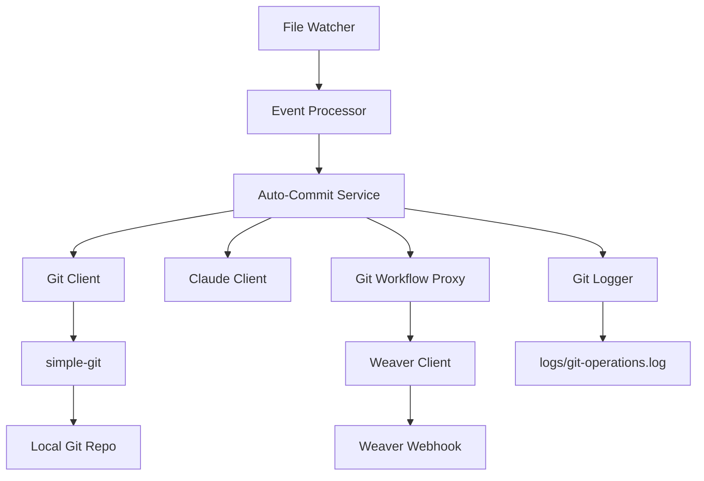
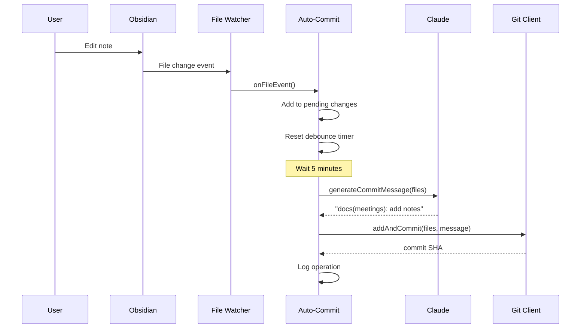

# Specification - Git Automation & Workflow Proxy

**Phase ID**: PHASE-8
**Status**: pending
**Priority**: medium
**Generated**: 2025-10-26

---

## 📋 Overview

This specification defines the requirements for implementing automated git version control for the Obsidian vault, including intelligent auto-commit, AI-powered commit message generation, and Weaver workflow proxy integration.

**Duration**: 2 days
**Dependencies**: Phase 7 (Agent Rules & MCP Tool)
**Deliverables**: Git automation service, commit message generator, workflow proxy, admin API

---


## Related

[[specification]]
## Related

[[constitution]]
## Related

[[phase-8-git-tasks]]
## 🎯 Functional Requirements

### FR-1: Git Client Wrapper

**Requirement**: Implement `GitClient` class wrapping `simple-git` for all git operations.

**Acceptance Criteria**:
- [ ] GitClient class in `src/git/git-client.ts`
- [ ] Methods: `init()`, `status()`, `add()`, `commit()`, `addAndCommit()`, `log()`, `diff()`
- [ ] Initialize git repo if not exists
- [ ] Configure git user from `.env` (GIT_USER_NAME, GIT_USER_EMAIL)
- [ ] Defaults: `Weave-NN`, `weave-nn@local`
- [ ] Handle git errors gracefully (not a repo, corrupted index)

**Input**:
- `repoPath: string` - Absolute path to vault directory

**Output**:
- Initialized GitClient instance ready for operations

**Edge Cases**:
- Vault directory doesn't exist → Create it
- Git repo exists but corrupted → Attempt repair or reinit
- Git user not configured → Use defaults from .env

---

### FR-2: Auto-Commit Service

**Requirement**: Implement `AutoCommitService` that listens to file watcher events and auto-commits changes.

**Acceptance Criteria**:
- [ ] AutoCommitService class in `src/git/auto-commit.ts`
- [ ] Listen to `FileEvent` from Phase 6 file watcher
- [ ] Debounce commits (5-minute window, configurable)
- [ ] Batch related changes into single commit
- [ ] Ignore delete events (commit separately)
- [ ] Handle rapid changes (reset debounce timer)
- [ ] Provide `forceCommit()` method for immediate commit

**Input**:
- `FileEvent` stream from file watcher

**Output**:
- Git commits with batched changes

**Edge Cases**:
- No changes to commit → No-op
- Git add fails (file deleted between detect and commit) → Log error, skip file
- Commit fails (repo locked) → Retry after 5 seconds, max 3 retries

---

### FR-3: Commit Message Generation

**Requirement**: Generate semantic commit messages using Claude API based on changed files.

**Acceptance Criteria**:
- [ ] `generateCommitMessage()` method in AutoCommitService
- [ ] Send file paths to Claude with prompt
- [ ] Prompt format: "Generate conventional commit message for: <files>"
- [ ] Parse response for `type(scope): description` format
- [ ] Fallback to generic message if Claude fails
- [ ] Timeout: 3 seconds max
- [ ] Cache messages for identical change sets (1 hour TTL)

**Input**:
- `files: string[]` - Array of changed file paths (relative to vault root)

**Output**:
- Commit message string (e.g., `docs(meetings): add project kickoff notes`)

**Edge Cases**:
- Claude API failure → Fallback: `docs: update N files`
- Single file → `docs: update path/to/file.md`
- Empty file list → Skip commit
- Very long file list (100+) → Summarize: `docs: update 120 notes in meetings/`

---

### FR-4: Weaver Workflow Proxy

**Requirement**: Create workflow proxy to trigger git operations via Weaver durable workflows.

**Acceptance Criteria**:
- [ ] GitWorkflowProxy class in `src/git/workflow-proxy.ts`
- [ ] Method: `commit(files: string[], message: string)`
- [ ] Method: `push(remote?: string, branch?: string)` (optional)
- [ ] Send WeaverEvent to Weaver webhook
- [ ] Event type: `note-updated` with metadata `operation: 'git-commit'`
- [ ] Return immediately (async execution)

**Input**:
- `files: string[]` - Files to commit
- `message: string` - Commit message

**Output**:
- Queued workflow event (fire-and-forget)

**Edge Cases**:
- Weaver unavailable → Log error, fall back to direct git commit
- Workflow execution fails → Logged in Weaver, retried automatically
- Duplicate events → Idempotent, safe to retry

---

### FR-5: Git Proxy API Endpoints

**Requirement**: Expose HTTP API endpoints for git operations and diagnostics.

**Acceptance Criteria**:
- [ ] `POST /git/proxy/commit` - Trigger workflow commit
- [ ] `GET /admin/git/status` - Get git status (staged, unstaged, untracked)
- [ ] `GET /admin/git/logs` - Get recent commit log (last 20 commits)
- [ ] `POST /admin/git/force-commit` - Force immediate commit (bypass debounce)
- [ ] All endpoints require admin authentication (future: JWT)
- [ ] Return JSON responses

**Input** (POST /git/proxy/commit):
```json
{
  "files": ["path/to/file.md"],
  "message": "docs(scope): description"
}
```

**Output**:
```json
{
  "status": "queued",
  "workflow": "git-commit"
}
```

**Edge Cases**:
- Missing files parameter → 400 error
- Invalid git repo → 500 error
- Empty file list → 400 error

---

### FR-6: Git Operation Logging

**Requirement**: Log all git operations for audit and debugging.

**Acceptance Criteria**:
- [ ] Log file: `logs/git-operations.log`
- [ ] Log format: JSON lines (JSONL)
- [ ] Fields: timestamp, operation, sha, files, message, duration, status
- [ ] Rotation: Daily, max 7 days retention
- [ ] Log levels: INFO (success), ERROR (failure), WARN (retry)

**Input**:
- Git operation result

**Output**:
- Log entry written to file

**Log Entry Example**:
```json
{
  "timestamp": "2025-10-26T10:30:00Z",
  "operation": "commit",
  "sha": "abc123def",
  "files": ["meetings/project-kickoff.md"],
  "message": "docs(meetings): add project kickoff notes",
  "duration": 234,
  "status": "success"
}
```

---

### FR-7: File Watcher Integration

**Requirement**: Integrate auto-commit service with existing Phase 6 file watcher.

**Acceptance Criteria**:
- [ ] EventProcessor calls `autoCommit.onFileEvent(event)` for every file change
- [ ] Auto-commit disabled if `GIT_AUTO_COMMIT_ENABLED=false` in .env
- [ ] File events processed after shadow cache update
- [ ] No blocking of file watcher event loop

**Input**:
- `FileEvent` from file watcher

**Output**:
- Auto-commit triggered (asynchronously)

---

## 🔧 Non-Functional Requirements

### NFR-1: Performance

**Requirements**:
- Auto-commit latency: Max 5 minutes (configurable via `GIT_COMMIT_DEBOUNCE_MS`)
- Commit message generation: Max 3 seconds (Claude API timeout)
- Workflow proxy response: Max 1 second (queue operation, return ID)
- Git status check: Max 500ms (local operation)

**Measurement**:
- Log operation duration in git-operations.log
- Monitor via admin endpoint: `GET /admin/git/metrics`

---

### NFR-2: Reliability

**Requirements**:
- Auto-commit failure rate: < 1% (excluding user errors)
- Retry failed commits: Max 3 retries with exponential backoff
- Graceful degradation: Continue operation even if Claude API fails
- No data loss: All file changes eventually committed

**Monitoring**:
- Log all errors to git-operations.log
- Track retry count and success rate

---

### NFR-3: Security

**Requirements**:
- MUST ignore sensitive files: `.env`, `credentials.*`, `.git/`
- MUST validate file paths (prevent directory traversal)
- MUST sanitize commit messages (remove API keys, passwords)
- MUST use environment variables for git user config

**Validation**:
- Pre-commit hooks validate file list
- Regex patterns detect sensitive data in messages

---

### NFR-4: Maintainability

**Requirements**:
- Code coverage: 85%+ for git module
- TypeScript strict mode enabled
- All public methods documented with JSDoc
- Integration tests with real git repositories

**Quality Gates**:
- Linting: Zero errors
- Type checking: Zero errors
- Tests: All passing

---

### NFR-5: Observability

**Requirements**:
- All git operations logged to `logs/git-operations.log`
- Admin endpoint exposes git metrics (commit count, avg message length)
- Health check endpoint: `GET /health` includes git status
- Prometheus metrics (future): commit_total, commit_duration_seconds

**Metrics**:
- Total commits per day
- Average commit message length
- Commit failure rate
- Claude API usage (calls per day)

---

## 📊 Data Models

### GitClient

```typescript
class GitClient {
  constructor(repoPath: string);
  async init(): Promise<void>;
  async status(): Promise<StatusResult>;
  async add(files: string[]): Promise<void>;
  async commit(message: string): Promise<string>; // Returns SHA
  async addAndCommit(files: string[], message: string): Promise<string>;
  async log(maxCount?: number): Promise<LogResult>;
  async diff(file?: string): Promise<string>;
}
```

---

### AutoCommitService

```typescript
class AutoCommitService {
  constructor(
    git: GitClient,
    claude: ClaudeClient,
    debounceMs?: number
  );

  onFileEvent(event: FileEvent): void;
  async forceCommit(): Promise<void>;
  private scheduleCommit(): void;
  private async executeCommit(): Promise<void>;
  private async generateCommitMessage(files: string[]): Promise<string>;
  private fallbackMessage(files: string[]): string;
}
```

---

### GitWorkflowProxy

```typescript
class GitWorkflowProxy {
  constructor(weaver: WeaverClient);

  async commit(files: string[], message: string): Promise<void>;
  async push(remote?: string, branch?: string): Promise<void>;
}
```

---

## 🏗️ Architecture

### Component Diagram



---

### Data Flow



---

## 🧪 Testing Requirements

### Unit Tests

1. **GitClient**:
   - Test repo initialization
   - Test git operations (add, commit, log, diff)
   - Test error handling (not a repo, corrupted index)

2. **AutoCommitService**:
   - Test debounce behavior
   - Test batching of rapid changes
   - Test commit message generation
   - Test fallback messages

3. **GitWorkflowProxy**:
   - Test event formatting
   - Test Weaver client integration
   - Test error handling

---

### Integration Tests

1. **End-to-End**:
   - Create temp vault
   - Edit files
   - Wait for auto-commit
   - Verify commit exists with correct message
   - Verify files staged and committed

2. **Workflow Proxy**:
   - Trigger workflow via API
   - Verify Weaver receives event
   - Verify workflow executes successfully

3. **Admin API**:
   - Test all endpoints with valid/invalid inputs
   - Verify JSON responses
   - Test error handling

---

### Manual Testing

1. **Auto-Commit**:
   - Edit note in Obsidian
   - Wait 5 minutes
   - Check `git log` for commit
   - Verify commit message is semantic

2. **Workflow Proxy**:
   - POST to `/git/proxy/commit`
   - Check Weaver logs for workflow execution
   - Verify files committed

3. **Admin Endpoints**:
   - GET `/admin/git/status` → Verify git status
   - GET `/admin/git/logs` → Verify commit log

---

## 🔌 Integration Points

### Phase 6 (Vault Initialization)

- **File Watcher**: Listen to file change events
- **Shadow Cache**: Read file metadata for commit context

### Phase 7 (Agent Rules & MCP Tool)

- **ClaudeClient**: Use for commit message generation
- **Agent Rules**: Apply rules to commit validation

### Weaver

- **WeaverClient**: Send workflow events
- **Workflows**: Execute git operations durably

---

## 📝 Configuration

### Environment Variables

```bash
# Git Configuration
GIT_USER_NAME=Weave-NN
GIT_USER_EMAIL=weave-nn@local
GIT_AUTO_COMMIT_ENABLED=true
GIT_COMMIT_DEBOUNCE_MS=300000  # 5 minutes

# Workflow Proxy (Optional)
GIT_WORKFLOW_PROXY_ENABLED=false
WEAVER_WEBHOOK_URL=http://localhost:3001/webhook

# Claude API (from Phase 7)
ANTHROPIC_API_KEY=sk-...
```

---

## 🚀 Deployment

### Dependencies

**npm packages**:
```json
{
  "dependencies": {
    "simple-git": "^3.24.0",
    "hono": "^4.0.0"
  }
}
```

**Runtime**:
- Node.js 18+
- Git CLI installed on system
- Weaver running (for workflow proxy)

---

### File Structure

```
weave-nn-mcp/
├── src/
│   ├── git/
│   │   ├── git-client.ts         # GitClient class
│   │   ├── auto-commit.ts        # AutoCommitService
│   │   ├── workflow-proxy.ts     # GitWorkflowProxy
│   │   └── commit-message.ts     # Commit message helpers
│   ├── watcher/
│   │   └── event-processor.ts    # Updated with auto-commit integration
│   └── server.ts                 # Updated with git proxy routes
├── logs/
│   └── git-operations.log        # Git operation audit log
├── tests/
│   └── git/
│       ├── git-client.test.ts
│       ├── auto-commit.test.ts
│       └── workflow-proxy.test.ts
└── .env                          # Configuration
```

---

## 📈 Success Metrics

### Technical Validation

- [ ] File changes auto-commit within 5 minutes
- [ ] Commit messages follow conventional format (95%+ compliance)
- [ ] Rapid changes batched into single commit
- [ ] Workflow proxy triggers Weaver workflows
- [ ] Git operations logged with SHA and timestamp
- [ ] Code coverage 85%+
- [ ] All tests passing

### User Experience

- [ ] No manual commits required
- [ ] Meaningful commit history (not "update" messages)
- [ ] Easy to review git logs via admin endpoint
- [ ] No performance degradation during auto-commit

### Performance

- Auto-commit latency: 5 minutes (configurable)
- Commit message generation: < 3 seconds (95th percentile)
- Workflow proxy response: < 1 second
- Git status check: < 500ms

---

## 🔮 Future Enhancements (Phase 9+)

### GitHub Integration

1. **Issue Sync**: Auto-create issues from `#bug` or `#feature` tags
2. **Pull Requests**: Trigger PR creation when branch created
3. **Code Review**: Link commits to GitHub PRs

### Advanced Workflows

1. **Branch Automation**: Auto-create feature branches for large changes
2. **Conflict Resolution**: Detect merge conflicts, notify user
3. **Semantic Versioning**: Tag releases based on commit history

### Analytics

1. **Commit Analytics**: Track writing patterns (commits per day, time of day)
2. **Content Analysis**: Most edited topics, longest sessions
3. **Productivity Metrics**: Lines written per session

---

**Status**: ⏳ **PENDING** (blocked by Phase 7)
**Dependencies**: Phase 7 (Agent Rules & MCP Tool)
**Next Phase**: [[phase-9-testing-documentation|Phase 9: Testing & Documentation]]
