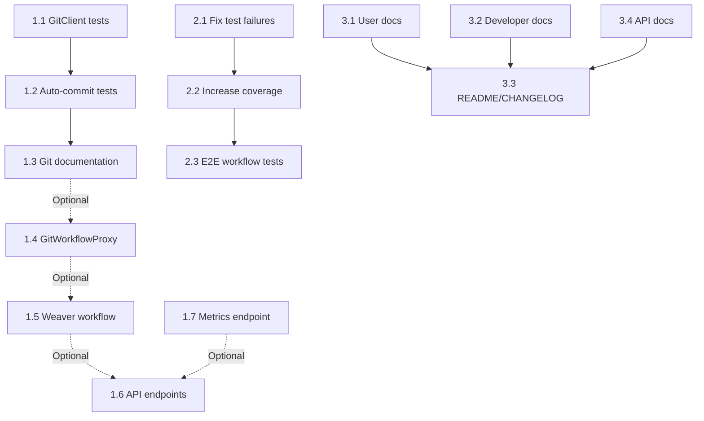

# Phase 9: Testing & Documentation + Phase 8 Completion - Task Breakdown

**Phase ID**: PHASE-9
**Status**: pending
**Priority**: high
**Total Tasks**: 14
**Estimated Effort**: 3-4 days

---

## Overview

This phase combines comprehensive testing and documentation for the entire Weaver system PLUS completion of optional Phase 8 tasks. This ensures the MVP is fully tested, well-documented, and feature-complete before Phase 10 (MVP launch).

**Includes**:
- Complete test coverage (unit, integration, E2E)
- User and developer documentation
- Phase 8 optional features (workflow proxy, API endpoints)
- Phase 8 missing tests and documentation

---

## Related

[[phase-6-vault-tasks]]
## Related

[[phase-7-agent-tasks]]
## Related

[[phase-9-testing-documentation]]
## Related

[[phase-8-git-tasks]]
## Section 1: Phase 8 Completion (Day 1) - 11 hours

### 1.1: Write unit tests for GitClient
**Effort**: 1.5 hours | **Priority**: High | **Dependencies**: None

Write comprehensive unit tests for the GitClient wrapper class.

**Acceptance Criteria**:
- [ ] Test suite in `tests/git/git-client.test.ts`
- [ ] Test repo initialization (`init()`)
- [ ] Test git operations (add, commit, log, diff, status)
- [ ] Test error handling (not a repo, corrupted index)
- [ ] Use temp directories for test isolation (`fs.mkdtemp()`)
- [ ] Code coverage 85%+
- [ ] All tests passing

**Files to Create/Modify**:
- `/home/aepod/dev/weave-nn/weaver/tests/git/git-client.test.ts` - Unit tests

**Implementation Notes**:
- Use vitest for testing
- Create temp directories with `fs.mkdtemp()`
- Clean up temp directories after tests
- Mock file system operations for edge cases
- Test both success and failure paths

---

### 1.2: Write integration tests for auto-commit
**Effort**: 2 hours | **Priority**: High | **Dependencies**: 1.1

End-to-end tests for auto-commit workflow with debouncing and AI messages.

**Acceptance Criteria**:
- [ ] Test suite in `tests/git/auto-commit.test.ts`
- [ ] Test debounce behavior (rapid changes batched)
- [ ] Test commit message generation with Claude (mocked)
- [ ] Test fallback messages when Claude fails/times out
- [ ] Test force commit (bypass debounce)
- [ ] Verify git commits created correctly (SHA, message, files)
- [ ] Code coverage 85%+
- [ ] All tests passing

**Files to Create/Modify**:
- `/home/aepod/dev/weave-nn/weaver/tests/git/auto-commit.test.ts` - Integration tests

**Implementation Notes**:
- Mock ClaudeClient for predictable responses
- Use short debounce (1 second) for faster tests
- Create real git repo in temp directory
- Verify commit SHA and message format
- Test timeout behavior (3s AI generation limit)

---

### 1.3: Update git documentation
**Effort**: 1 hour | **Priority**: Medium | **Dependencies**: 1.1, 1.2

Document git automation setup and usage for users and developers.

**Acceptance Criteria**:
- [ ] Update `README.md` with git automation section
- [ ] Document `.env` configuration options
- [ ] Add troubleshooting guide (common errors)
- [ ] Include examples of auto-commit in action
- [ ] Document how to disable auto-commit
- [ ] API endpoints documented (if Task 1.6 complete)

**Files to Create/Modify**:
- `/home/aepod/dev/weave-nn/weaver/README.md` - Add git automation section
- `/home/aepod/dev/weave-nn/weaver/docs/git-automation.md` - Detailed guide (optional)

**Implementation Notes**:
- Include code examples and configuration snippets
- Show example commit messages (AI-generated)
- Document debounce behavior
- Link to git configuration in .env.example

---

### 1.4: Create GitWorkflowProxy class
**Effort**: 2 hours | **Priority**: Low (Optional) | **Dependencies**: None

Implement workflow proxy to trigger git operations via Weaver workflows.

**Acceptance Criteria**:
- [ ] `GitWorkflowProxy` class created in `src/git/workflow-proxy.ts`
- [ ] Constructor accepts `WeaverClient`
- [ ] Method: `commit(files: string[], message: string): Promise<void>`
- [ ] Method: `push(remote?: string, branch?: string): Promise<void>` (optional)
- [ ] Send `WeaverEvent` to Weaver webhook
- [ ] Event type: `note-updated` with metadata `operation: 'git-commit'`
- [ ] Return immediately (fire-and-forget)

**Files to Create/Modify**:
- `/home/aepod/dev/weave-nn/weaver/src/git/workflow-proxy.ts` - GitWorkflowProxy class

**Implementation Notes**:
- Reuse existing workflow engine from Phase 6
- Use event-driven architecture
- Include files and message in event metadata
- Handle Weaver unavailability gracefully

---

### 1.5: Create Weaver git-commit workflow
**Effort**: 1.5 hours | **Priority**: Low (Optional) | **Dependencies**: 1.4

Define Weaver workflow for executing git commits via workflow engine.

**Acceptance Criteria**:
- [ ] Workflow file created in `workflows/git-commit.yaml` or TypeScript
- [ ] Trigger: `event.type === 'note-updated'` && `event.metadata.operation === 'git-commit'`
- [ ] Input: `{ files: string[], message: string }`
- [ ] Actions: 1) Validate files (no .env, .git), 2) git add, 3) git commit, 4) log SHA
- [ ] Workflow is idempotent (safe to retry)
- [ ] Error handling step (log failure, notify admin)

**Files to Create/Modify**:
- `/home/aepod/dev/weave-nn/weaver/workflows/git-commit.ts` - Workflow definition

**Implementation Notes**:
- Use existing workflow engine API
- Include validation step to prevent committing sensitive files
- Log commit SHA to workflow execution log
- Make workflow resumable on failure

---

### 1.6: Add git proxy API endpoints
**Effort**: 2 hours | **Priority**: Low (Optional) | **Dependencies**: 1.4, 1.5

Expose HTTP API endpoints for git operations and diagnostics.

**Acceptance Criteria**:
- [ ] `POST /git/proxy/commit` - Trigger workflow commit
- [ ] `GET /admin/git/status` - Get git status (staged, unstaged, untracked)
- [ ] `GET /admin/git/logs` - Get recent commit log (last 20 commits)
- [ ] `POST /admin/git/force-commit` - Force immediate commit (bypass debounce)
- [ ] All endpoints return JSON responses
- [ ] Input validation with error messages
- [ ] Error handling (git repo not initialized, invalid input)

**Files to Create/Modify**:
- `/home/aepod/dev/weave-nn/weaver/src/server.ts` - Add git proxy routes
- `/home/aepod/dev/weave-nn/weaver/src/git/http-routes.ts` - HTTP route handlers (optional)

**Implementation Notes**:
- Use Hono router for HTTP endpoints
- Validate request body with Zod schemas
- Return appropriate HTTP status codes (200, 400, 500)
- Add admin authentication (future: JWT)

---

### 1.7: Add git metrics endpoint
**Effort**: 1 hour | **Priority**: Low (Optional) | **Dependencies**: None

Expose git metrics for monitoring and debugging.

**Acceptance Criteria**:
- [ ] `GET /admin/git/metrics` endpoint
- [ ] Return JSON with: total commits, commits today, avg message length, failure rate
- [ ] Calculate metrics from `git-operations.log`
- [ ] Cache metrics (update every 5 minutes)
- [ ] Include in health check endpoint

**Files to Create/Modify**:
- `/home/aepod/dev/weave-nn/weaver/src/server.ts` - Add metrics endpoint
- `/home/aepod/dev/weave-nn/weaver/src/git/metrics.ts` - Metrics calculation

**Implementation Notes**:
- Parse `git-operations-YYYY-MM-DD.log` for metrics
- Cache results to avoid re-reading log on every request
- Return metrics in JSON format
- Consider Prometheus format (future)

---

## Section 2: Core Testing (Day 2) - 8 hours

### 2.1: Fix existing test failures
**Effort**: 2 hours | **Priority**: Critical | **Dependencies**: None

Fix all failing tests identified in Phase 1-7 review.

**Acceptance Criteria**:
- [ ] MCP E2E workflow integration tests (4 failing) - Fixed
- [ ] Directory scanner test infrastructure (16 failing) - Fixed
- [ ] Framework detector edge cases (2 failing) - Fixed
- [ ] Auto-tagging/auto-linking edge cases (3 failing) - Fixed
- [ ] All 360+ tests passing
- [ ] No test infrastructure race conditions

**Files to Modify**:
- `/home/aepod/dev/weave-nn/weaver/tests/integration/mcp-server-e2e.test.ts`
- `/home/aepod/dev/weave-nn/weaver/tests/vault-init/directory-scanner.test.ts`
- `/home/aepod/dev/weave-nn/weaver/tests/vault-init/framework-detector.test.ts`
- `/home/aepod/dev/weave-nn/weaver/tests/agents/rules/auto-tag-rule.test.ts`
- `/home/aepod/dev/weave-nn/weaver/tests/agents/rules/auto-link-rule.test.ts`

**Implementation Notes**:
- Fix workflow engine mock integration issues
- Improve test fixture cleanup
- Fix error message format assertions
- Fix tsconfig.json glob pattern parsing
- Improve tag search in tests

---

### 2.2: Increase test coverage to 90%+
**Effort**: 3 hours | **Priority**: High | **Dependencies**: 2.1

Add missing tests to achieve 90%+ coverage across all modules.

**Acceptance Criteria**:
- [ ] Shadow cache: 90%+ coverage
- [ ] MCP tools: 90%+ coverage
- [ ] Workflow engine: 85%+ coverage
- [ ] Rules engine: 90%+ coverage
- [ ] Git client: 85%+ coverage
- [ ] File watcher: 80%+ coverage
- [ ] Overall: 90%+ coverage

**Files to Create/Modify**:
- Add missing test cases to existing test files
- Create new test files for untested modules

**Implementation Notes**:
- Use vitest coverage reports to identify gaps
- Focus on critical paths and error handling
- Mock external dependencies (Obsidian API, Claude API)
- Use test fixtures for consistent data

---

### 2.3: Create E2E workflow tests
**Effort**: 3 hours | **Priority**: High | **Dependencies**: 2.1

End-to-end tests for complete workflows (file change → auto-commit → logged).

**Acceptance Criteria**:
- [ ] `tests/e2e/auto-tag-workflow.test.ts` (Create note → auto-tag)
- [ ] `tests/e2e/auto-link-workflow.test.ts` (Update note → auto-link)
- [ ] `tests/e2e/daily-note-workflow.test.ts` (Create daily note → template)
- [ ] `tests/e2e/auto-commit-workflow.test.ts` (Edit note → git commit)
- [ ] All workflows complete successfully
- [ ] Test real file system operations
- [ ] Test real git operations (temp repos)

**Files to Create/Modify**:
- `/home/aepod/dev/weave-nn/weaver/tests/e2e/auto-tag-workflow.test.ts`
- `/home/aepod/dev/weave-nn/weaver/tests/e2e/auto-link-workflow.test.ts`
- `/home/aepod/dev/weave-nn/weaver/tests/e2e/daily-note-workflow.test.ts`
- `/home/aepod/dev/weave-nn/weaver/tests/e2e/auto-commit-workflow.test.ts`

**Implementation Notes**:
- Use temp directories for test vaults
- Wait for async workflows to complete
- Verify side effects (git commits, file modifications)
- Test with real dependencies (no mocking)

---

## Section 3: Documentation (Day 3) - 6 hours

### 3.1: Write user documentation
**Effort**: 2 hours | **Priority**: High | **Dependencies**: None

Create comprehensive user guides for setup and usage.

**Acceptance Criteria**:
- [ ] `docs/user-guide/QUICKSTART.md` (5-minute setup guide)
- [ ] `docs/user-guide/INSTALLATION.md` (Step-by-step install)
- [ ] `docs/user-guide/CONFIGURATION.md` (.env reference)
- [ ] `docs/user-guide/TROUBLESHOOTING.md` (Common issues)
- [ ] Non-technical user can set up in < 15 minutes
- [ ] Screenshots/examples included

**Files to Create**:
- `/home/aepod/dev/weave-nn/weaver/docs/user-guide/QUICKSTART.md`
- `/home/aepod/dev/weave-nn/weaver/docs/user-guide/INSTALLATION.md`
- `/home/aepod/dev/weave-nn/weaver/docs/user-guide/CONFIGURATION.md`
- `/home/aepod/dev/weave-nn/weaver/docs/user-guide/TROUBLESHOOTING.md`

**Implementation Notes**:
- Use clear, simple language
- Include command-line examples
- Document all .env variables
- Cover top 10 common issues

---

### 3.2: Write developer documentation
**Effort**: 2 hours | **Priority**: High | **Dependencies**: None

Create technical documentation for contributors and maintainers.

**Acceptance Criteria**:
- [ ] `docs/developer/ARCHITECTURE.md` (System overview)
- [ ] `docs/developer/API-REFERENCE.md` (MCP tools, HTTP endpoints)
- [ ] `docs/developer/CONTRIBUTING.md` (How to add rules, tools)
- [ ] `docs/developer/TESTING.md` (How to run tests, add tests)
- [ ] Developer can add new agent rule in < 1 hour
- [ ] All APIs documented

**Files to Create**:
- `/home/aepod/dev/weave-nn/weaver/docs/developer/ARCHITECTURE.md`
- `/home/aepod/dev/weave-nn/weaver/docs/developer/API-REFERENCE.md`
- `/home/aepod/dev/weave-nn/weaver/docs/developer/CONTRIBUTING.md`
- `/home/aepod/dev/weave-nn/weaver/docs/developer/TESTING.md`

**Implementation Notes**:
- Include architecture diagrams (mermaid)
- Document all MCP tools with examples
- Provide code templates for new features
- Document test patterns

---

### 3.3: Create README and changelog
**Effort**: 1 hour | **Priority**: High | **Dependencies**: 3.1, 3.2

Update root README and create version history.

**Acceptance Criteria**:
- [ ] Update root `README.md` with project overview
- [ ] Add features list, badges, quick links
- [ ] Create `CHANGELOG.md` with version history
- [ ] Document MVP v1.0.0 features
- [ ] GitHub repo looks professional
- [ ] Include contribution guidelines

**Files to Modify/Create**:
- `/home/aepod/dev/weave-nn/weaver/README.md` - Update
- `/home/aepod/dev/weave-nn/weaver/CHANGELOG.md` - Create

**Implementation Notes**:
- Use shields.io for badges
- Follow Conventional Commits format
- Include project roadmap
- Link to documentation

---

### 3.4: Create API documentation
**Effort**: 1 hour | **Priority**: Medium | **Dependencies**: 3.2

Generate comprehensive API documentation for all tools and endpoints.

**Acceptance Criteria**:
- [ ] All MCP tools documented with schemas
- [ ] All HTTP endpoints documented with examples
- [ ] Request/response examples included
- [ ] Error codes documented
- [ ] Auto-generated from TypeScript types (if possible)

**Files to Create**:
- `/home/aepod/dev/weave-nn/weaver/docs/api/MCP-TOOLS.md`
- `/home/aepod/dev/weave-nn/weaver/docs/api/HTTP-API.md`

**Implementation Notes**:
- Use TypeDoc or similar for type docs
- Include curl examples for HTTP endpoints
- Document authentication (when implemented)
- Link to MCP specification

---

## Critical Path

**Critical Dependencies**:
1. Phase 8 completion (1.1-1.3) → Ensures git features fully tested
2. Test fixes (2.1) → Foundation for coverage increase
3. Documentation (3.1-3.3) → User onboarding and developer contributions

**Parallel Work Opportunities**:
- Phase 8 optional features (1.4-1.7) can run parallel to testing (2.1-2.3)
- Documentation tasks (3.1-3.4) can run in parallel
- Git tests (1.1-1.2) can run parallel to test fixes (2.1)

---

## Effort Summary

| Task Group | Tasks | Estimated Effort | Priority |
|------------|-------|-----------------|----------|
| 1. Phase 8 Completion | 7 | 11 hours | High (1.1-1.3), Low (1.4-1.7) |
| 2. Core Testing | 3 | 8 hours | Critical-High |
| 3. Documentation | 4 | 6 hours | High |
| **TOTAL** | **14** | **25 hours (3.1 days)** | |

**Realistic Timeline**: 3-4 days with focused effort and minimal interruptions.

**Priority Breakdown**:
- **Critical**: 2 hours (test fixes)
- **High**: 13.5 hours (tests + docs)
- **Medium**: 2 hours (API docs)
- **Low (Optional)**: 7.5 hours (workflow proxy features)

---

## Success Metrics

**Phase 8 Completion**:
- [ ] GitClient tests: 85%+ coverage
- [ ] Auto-commit tests: 85%+ coverage
- [ ] Git documentation: Complete
- [ ] Optional features: Implemented (if time permits)

**Testing**:
- [ ] All existing tests: Passing (360+)
- [ ] Code coverage: 90%+
- [ ] E2E workflows: All passing
- [ ] No critical bugs

**Documentation**:
- [ ] User setup: < 15 minutes
- [ ] Developer onboarding: < 1 hour to add feature
- [ ] README: Professional
- [ ] Changelog: Complete version history

**Quality**:
- [ ] TypeScript strict mode: Passing
- [ ] Linting: Zero errors
- [ ] All workflows: Tested end-to-end

---

## Risk Mitigation

| Risk | Impact | Mitigation |
|------|--------|------------|
| Test infrastructure issues | High | Fix early (Task 2.1) |
| Coverage gaps | Medium | Prioritize critical paths |
| Documentation time overrun | Low | Use templates and examples |
| Optional features delay | Low | Clearly marked as optional |
| E2E test flakiness | Medium | Use deterministic test data |

---

## Next Steps

1. Review this task breakdown
2. Start with critical test fixes (Task 2.1)
3. Complete Phase 8 tests and docs (Tasks 1.1-1.3)
4. Increase test coverage (Task 2.2)
5. Create E2E tests (Task 2.3)
6. Write documentation (Tasks 3.1-3.4)
7. Optional: Implement Phase 8 features (Tasks 1.4-1.7)

---

**Generated**: 2025-10-26
**Total Tasks**: 14
**Estimated Effort**: 3-4 days
**Method**: Manual task breakdown with Phase 8 integration
