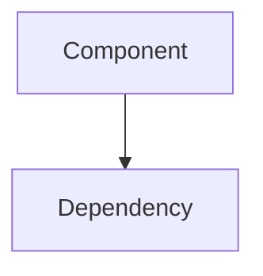

# System Architecture

Comprehensive architecture documentation for Weave-NN platform.

---

## Subdirectories

### /layers
Architectural layers (presentation, business, data, etc.)

### /components
System components and their interactions

### /services
Service architecture and boundaries

### /systems
System-level architecture diagrams and documentation

### /analysis
Architecture analysis and decision records

## Documentation Standards

Each architecture document should include:
- Component/layer overview
- Responsibilities
- Dependencies
- Interfaces
- Diagrams (Mermaid)
- Design decisions

## Example Structure

```markdown
# Component Name

**Layer**: Presentation/Business/Data/Infrastructure
**Status**: Implemented/Planned

## Overview
What does this component do?

## Responsibilities
- Responsibility 1
- Responsibility 2

## Dependencies
- Dependency 1
- Dependency 2

## Interfaces
```typescript
interface ComponentAPI {
  method(): void;
}
```

## Diagram

```

---

**Status**: Active
**Last Updated**: $(date +%Y-%m-%d)
