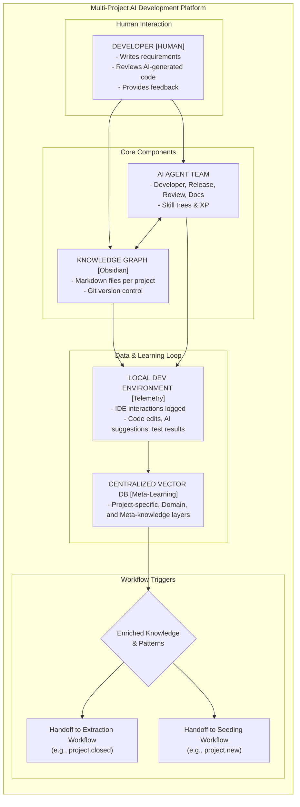
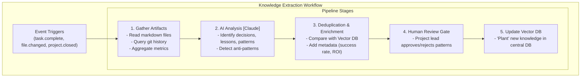

# Multi-Project AI Development Platform Architecture

This document outlines the architecture of the multi-project AI development platform, broken down into three key areas: the main architecture, the knowledge extraction workflow, and the project seeding/deployment workflow.

## 1. Main System Architecture

This diagram shows the primary components and the core learning loop. The system is designed around a continuous flow of information between human developers, the AI agent team, and the knowledge graph, with all interactions feeding a centralized meta-learning database.



## 2. Knowledge Extraction Workflow

This workflow is triggered by events such as task completion or project closure. Its purpose is to extract, process, and store reusable knowledge from completed work into the centralized vector database. Each stage can be implemented as a microservice, orchestrated by RabbitMQ.



## 3. Project Seeding & Deployment Workflow

This workflow is initiated when a new project is started, an existing one is imported, or a project needs a refresh with the latest knowledge. It seeds the project with relevant patterns and best practices from the centralized database before development begins.

```mermaid
graph TD
    subgraph "Project Seeding & Deployment Workflow"
        T1["Trigger: New Project [Empty]"]
        T2["Trigger: Import Existing Project"]
        T3["Trigger: Refresh Project"]

        subgraph "Seeding Stages"
            S1["1. Requirements Analysis<br/>- Classify project type (e-commerce, SaaS)"]
            S2["2. Vector DB Query<br/>- Adaptive retrieval of relevant patterns"]
            S3["3. Agent Specialization<br/>- Identify skill gaps<br/>- Pre-load patterns into agent memory"]
            S4["4. Knowledge Graph Initialization<br/>- Generate suggested-patterns.md"]
        end

        subgraph "Deployment"
            H["SDLC WORKFLOW<br/>Dev → Staging → Production<br/>Safety gates at each stage"]
        end
        
        T1 --> S1
        T2 --> S1
        T3 --> S1
        S1 --> S2 --> S3 --> S4 --> H
    end
