# Knowledge Graph Visualization

Generated: 2025-10-28T14:45:30.213Z

## Summary

- **Total Files**: 377
- **Total Links**: 3288
- **Orphaned Files**: 27
- **Hub Documents**: 10


## Legend

- 🔴 **Red**: Orphaned files (0 connections)
- 🟡 **Yellow**: Weakly connected (<2 total links)
- **Gray**: Moderately connected (2-4 links)
- 🟢 **Green**: Well connected (5-9 links)
- 🔵 **Blue**: Hub documents (10+ inbound links)


## Hub Documents View

This view shows the main hub documents and their key connections.

```mermaid
graph LR

  %% Hub Documents
  hub0["🌟 concepts/weave-nn<br/>(33 links)"]
  style hub0 fill:#4444ff,stroke:#0000cc,color:#fff
  hub1["🌟 docs/WEAVER-COMPLETE-IMPLEMENTATION-GUIDE<br/>(33 links)"]
  style hub1 fill:#4444ff,stroke:#0000cc,color:#fff
  hub2["🌟 concepts/knowledge-graph<br/>(30 links)"]
  style hub2 fill:#4444ff,stroke:#0000cc,color:#fff
  hub3["🌟 docs/local-first-architecture-overview<br/>(24 links)"]
  style hub3 fill:#4444ff,stroke:#0000cc,color:#fff
  hub4["🌟 docs/PHASE-12-LEARNING-LOOP-BLUEPRINT<br/>(23 links)"]
  style hub4 fill:#4444ff,stroke:#0000cc,color:#fff

  %% Connected Documents
  conn0["daily-logs/2025-10-20"]
  style conn0 fill:#4444ff,stroke:#0000cc,color:#fff
  conn0 --> hub0
  conn1["daily-logs/2025-10-20"]
  style conn1 fill:#4444ff,stroke:#0000cc,color:#fff
  conn1 --> hub0
  conn2["phases/navigation-optimization-analysis"]
  style conn2 fill:#4444ff,stroke:#0000cc,color:#fff
  conn2 --> hub0
  conn3["phases/navigation-optimization-analysis"]
  style conn3 fill:#4444ff,stroke:#0000cc,color:#fff
  conn3 --> hub0
  conn4["phases/phase-1-knowledge-graph-transformation"]
  style conn4 fill:#4444ff,stroke:#0000cc,color:#fff
  conn4 --> hub0
  conn5["phases/phase-13-master-plan"]
  style conn5 fill:#4444ff,stroke:#0000cc,color:#fff
  conn5 --> hub1
  conn6["phases/phase-14-obsidian-integration"]
  style conn6 fill:#4444ff,stroke:#0000cc,color:#fff
  conn6 --> hub1
  conn7["docs/ARCHIVE-INDEX"]
  style conn7 fill:#4444ff,stroke:#0000cc,color:#fff
  conn7 --> hub1
  conn8["docs/ARCHIVE-INDEX"]
  style conn8 fill:#4444ff,stroke:#0000cc,color:#fff
  conn8 --> hub1
  conn9["docs/ARCHIVE-INDEX"]
  style conn9 fill:#4444ff,stroke:#0000cc,color:#fff
  conn9 --> hub1
  conn10["daily-logs/2025-10-20"]
  style conn10 fill:#4444ff,stroke:#0000cc,color:#fff
  conn10 --> hub2
  conn11["daily-logs/2025-10-20"]
  style conn11 fill:#4444ff,stroke:#0000cc,color:#fff
  conn11 --> hub2
  conn12["phases/navigation-optimization-analysis"]
  style conn12 fill:#4444ff,stroke:#0000cc,color:#fff
  conn12 --> hub2
  conn13["phases/navigation-optimization-analysis"]
  style conn13 fill:#4444ff,stroke:#0000cc,color:#fff
  conn13 --> hub2
  conn14["phases/phase-1-knowledge-graph-transformation"]
  style conn14 fill:#4444ff,stroke:#0000cc,color:#fff
  conn14 --> hub2
  conn15["phases/navigation-optimization-analysis"]
  style conn15 fill:#4444ff,stroke:#0000cc,color:#fff
  conn15 --> hub3
  conn16["architecture/architecture-overview-hub"]
  style conn16 fill:#4444ff,stroke:#0000cc,color:#fff
  conn16 --> hub3
  conn17["business/business-overview-hub"]
  style conn17 fill:#4444ff,stroke:#0000cc,color:#fff
  conn17 --> hub3
  conn18["concept-map"]
  style conn18 fill:#4444ff,stroke:#0000cc,color:#fff
  conn18 --> hub3
  conn19["concepts/durable-workflows"]
  style conn19 fill:#4444ff,stroke:#0000cc,color:#fff
  conn19 --> hub3
  conn20["phases/phase-13-master-plan"]
  style conn20 fill:#4444ff,stroke:#0000cc,color:#fff
  conn20 --> hub4
  conn21["phases/phase-14-obsidian-integration"]
  style conn21 fill:#4444ff,stroke:#0000cc,color:#fff
  conn21 --> hub4
  conn22["docs/CHUNKING-IMPLEMENTATION-DESIGN"]
  style conn22 fill:#4444ff,stroke:#0000cc,color:#fff
  conn22 --> hub4
  conn23["docs/CHUNKING-STRATEGY-SYNTHESIS"]
  style conn23 fill:#4444ff,stroke:#0000cc,color:#fff
  conn23 --> hub4
  conn24["docs/DOCS-DIRECTORY-HUB"]
  style conn24 fill:#4444ff,stroke:#0000cc,color:#fff
  conn24 --> hub4
```



## Directory Cluster View

This view shows documents grouped by directory with key interconnections.

```mermaid
graph TD

  subgraph docs["📁 docs"]
    node0["docs/ARCHIVE-INDEX"]
    style node0 fill:#4444ff,stroke:#0000cc,color:#fff
    node1["docs/ARCHIVE-INTEGRATION-COMPLETE"]
    style node1 fill:#4444ff,stroke:#0000cc,color:#fff
    node2["docs/BACKEND-IMPLEMENTATION-COMPLETE"]
    style node2 fill:#ffaa00,stroke:#cc8800,color:#000
    node3["docs/BACKEND-QUICK-REFERENCE"]
    style node3 fill:#ffaa00,stroke:#cc8800,color:#000
    node4["docs/CHUNKING-IMPLEMENTATION-DESIGN"]
    style node4 fill:#4444ff,stroke:#0000cc,color:#fff
    node5["docs/CHUNKING-STRATEGY-SYNTHESIS"]
    style node5 fill:#4444ff,stroke:#0000cc,color:#fff
    node6["docs/DOCS-DIRECTORY-HUB"]
    style node6 fill:#4444ff,stroke:#0000cc,color:#fff
    node7["docs/KNOWLEDGE-GRAPH-RECONNECTION-REPORT"]
    style node7 fill:#44ff44,stroke:#00cc00,color:#000
    node8["docs/MARKDOWN-ASYNC-WORKFLOW-ARCHITECTURE"]
    style node8 fill:#4444ff,stroke:#0000cc,color:#fff
    node9["docs/MARKDOWN-WORKFLOW-EXAMPLES"]
    style node9 fill:#ffaa00,stroke:#cc8800,color:#000
    node10["docs/MARKDOWN-WORKFLOW-IMPLEMENTATION-SUMMARY"]
    style node10 fill:#ffaa00,stroke:#cc8800,color:#000
    node11["docs/METADATA-ADDITION-SUMMARY"]
    style node11 fill:#ffaa00,stroke:#cc8800,color:#000
    node12["docs/PHASE-12-ANALYSIS-COMPLETE"]
    style node12 fill:#aaaaaa,stroke:#888888,color:#000
    node13["docs/PHASE-12-COMPLETE-PLAN"]
    style node13 fill:#4444ff,stroke:#0000cc,color:#fff
    node14["docs/PHASE-12-EXECUTIVE-SUMMARY"]
    style node14 fill:#4444ff,stroke:#0000cc,color:#fff
    moredocs["... 56 more files"]
    style moredocs fill:#f0f0f0,stroke:#ccc
  end

  subgraph planning_phases["📁 phases"]
    node15["phases/PHASE-4B-COMPLETION-REPORT"]
    style node15 fill:#aaaaaa,stroke:#888888,color:#000
    node16["phases/file-naming-standardization"]
    style node16 fill:#44ff44,stroke:#00cc00,color:#000
    node17["phases/folder-taxonomy-validation"]
    style node17 fill:#ffaa00,stroke:#cc8800,color:#000
    node18["phases/metadata-cleanup-analysis"]
    style node18 fill:#ffaa00,stroke:#cc8800,color:#000
    node19["phases/navigation-optimization-analysis"]
    style node19 fill:#4444ff,stroke:#0000cc,color:#fff
    node20["phases/phase-1-knowledge-graph-transformation"]
    style node20 fill:#4444ff,stroke:#0000cc,color:#fff
    node21["phases/phase-10-final-validation"]
    style node21 fill:#ff4444,stroke:#cc0000,color:#fff
    node22["phases/phase-10-mvp-readiness-launch"]
    style node22 fill:#44ff44,stroke:#00cc00,color:#000
    node23["phases/phase-11-cli-service-management"]
    style node23 fill:#aaaaaa,stroke:#888888,color:#000
    node24["phases/phase-12-four-pillar-autonomous-agents"]
    style node24 fill:#aaaaaa,stroke:#888888,color:#000
    node25["phases/phase-13-enhanced-agent-intelligence"]
    style node25 fill:#aaaaaa,stroke:#888888,color:#000
    node26["phases/phase-13-master-plan"]
    style node26 fill:#4444ff,stroke:#0000cc,color:#fff
    node27["phases/phase-14-obsidian-integration"]
    style node27 fill:#4444ff,stroke:#0000cc,color:#fff
    node28["phases/phase-2-documentation-capture"]
    style node28 fill:#4444ff,stroke:#0000cc,color:#fff
    node29["phases/phase-3-node-expansion"]
    style node29 fill:#4444ff,stroke:#0000cc,color:#fff
    moreplanning_phases["... 8 more files"]
    style moreplanning_phases fill:#f0f0f0,stroke:#ccc
  end

  subgraph concepts["📁 concepts"]
    node30["concepts/ai-generated-documentation"]
    style node30 fill:#4444ff,stroke:#0000cc,color:#fff
    node31["concepts/betweenness-centrality"]
    style node31 fill:#4444ff,stroke:#0000cc,color:#fff
    node32["concepts/cognitive-variability"]
    style node32 fill:#4444ff,stroke:#0000cc,color:#fff
    node33["concepts/concepts-overview-hub"]
    style node33 fill:#4444ff,stroke:#0000cc,color:#fff
    node34["concepts/durable-workflows"]
    style node34 fill:#4444ff,stroke:#0000cc,color:#fff
    node35["concepts/ecological-thinking"]
    style node35 fill:#4444ff,stroke:#0000cc,color:#fff
    node36["concepts/graph-topology-analysis"]
    style node36 fill:#4444ff,stroke:#0000cc,color:#fff
    node37["concepts/knowledge-graph"]
    style node37 fill:#4444ff,stroke:#0000cc,color:#fff
    node38["concepts/local-first-architecture"]
    style node38 fill:#4444ff,stroke:#0000cc,color:#fff
    node39["concepts/neural-network-junction"]
    style node39 fill:#4444ff,stroke:#0000cc,color:#fff
    node40["concepts/sparse-memory-finetuning"]
    style node40 fill:#4444ff,stroke:#0000cc,color:#fff
    node41["concepts/structural-gap-detection"]
    style node41 fill:#4444ff,stroke:#0000cc,color:#fff
    node42["concepts/temporal-queries"]
    style node42 fill:#4444ff,stroke:#0000cc,color:#fff
    node43["concepts/weave-nn"]
    style node43 fill:#4444ff,stroke:#0000cc,color:#fff
    node44["concepts/weaver"]
    style node44 fill:#4444ff,stroke:#0000cc,color:#fff
    moreconcepts["... 1 more files"]
    style moreconcepts fill:#f0f0f0,stroke:#ccc
  end

  subgraph technical["📁 technical"]
    node45["technical/chokidar"]
    style node45 fill:#44ff44,stroke:#00cc00,color:#000
    node46["technical/claude-flow"]
    style node46 fill:#4444ff,stroke:#0000cc,color:#fff
    node47["technical/hono"]
    style node47 fill:#aaaaaa,stroke:#888888,color:#000
    node48["technical/jest-testing-framework"]
    style node48 fill:#4444ff,stroke:#0000cc,color:#fff
    node49["technical/modelcontextprotocol-sdk"]
    style node49 fill:#44ff44,stroke:#00cc00,color:#000
    node50["technical/nodejs"]
    style node50 fill:#44ff44,stroke:#00cc00,color:#000
    node51["technical/obsidian-api-client"]
    style node51 fill:#4444ff,stroke:#0000cc,color:#fff
    node52["technical/obsidian-local-rest-api-plugin"]
    style node52 fill:#4444ff,stroke:#0000cc,color:#fff
    node53["technical/obsidian-tasks-plugin"]
    style node53 fill:#4444ff,stroke:#0000cc,color:#fff
    node54["technical/rest-api-integration"]
    style node54 fill:#4444ff,stroke:#0000cc,color:#fff
    node55["technical/simple-git"]
    style node55 fill:#44ff44,stroke:#00cc00,color:#000
    node56["technical/sqlite"]
    style node56 fill:#4444ff,stroke:#0000cc,color:#fff
    node57["technical/technical-overview-hub"]
    style node57 fill:#4444ff,stroke:#0000cc,color:#fff
    node58["technical/typescript"]
    style node58 fill:#44ff44,stroke:#00cc00,color:#000
    node59["technical/weaver"]
    style node59 fill:#4444ff,stroke:#0000cc,color:#fff
    moretechnical["... 1 more files"]
    style moretechnical fill:#f0f0f0,stroke:#ccc
  end

  subgraph decisions_technical["📁 technical"]
    node60["technical/adopt-weaver-workflow-proxy"]
    style node60 fill:#4444ff,stroke:#0000cc,color:#fff
    node61["technical/caching-strategy"]
    style node61 fill:#4444ff,stroke:#0000cc,color:#fff
    node62["technical/day-11-properties-visualization"]
    style node62 fill:#44ff44,stroke:#00cc00,color:#000
    node63["technical/day-2-rest-api-client"]
    style node63 fill:#44ff44,stroke:#00cc00,color:#000
    node64["technical/day-4-agent-rules"]
    style node64 fill:#44ff44,stroke:#00cc00,color:#000
    node65["technical/event-driven-architecture"]
    style node65 fill:#4444ff,stroke:#0000cc,color:#fff
    node66["technical/git-library-choice"]
    style node66 fill:#ffaa00,stroke:#cc8800,color:#000
    node67["technical/javascript-typescript-stack-pivot"]
    style node67 fill:#4444ff,stroke:#0000cc,color:#fff
    node68["technical/singleton-pattern-choice"]
    style node68 fill:#4444ff,stroke:#0000cc,color:#fff
    node69["technical/sqlite-library-choice"]
    style node69 fill:#ffaa00,stroke:#cc8800,color:#000
    node70["technical/test-strategy-full-report"]
    style node70 fill:#4444ff,stroke:#0000cc,color:#fff
    node71["technical/test-strategy-summary"]
    style node71 fill:#4444ff,stroke:#0000cc,color:#fff
    node72["technical/testing-framework-choice"]
    style node72 fill:#ffaa00,stroke:#cc8800,color:#000
    node73["technical/web-framework-choice"]
    style node73 fill:#ffaa00,stroke:#cc8800,color:#000
  end

  subgraph templates["📁 templates"]
    node74["templates/concept-node-template"]
    style node74 fill:#44ff44,stroke:#00cc00,color:#000
    node75["templates/daily-log-example"]
    style node75 fill:#4444ff,stroke:#0000cc,color:#fff
    node76["templates/daily-log"]
    style node76 fill:#4444ff,stroke:#0000cc,color:#fff
    node77["templates/decision-node-template"]
    style node77 fill:#4444ff,stroke:#0000cc,color:#fff
    node78["templates/feature-node-template"]
    style node78 fill:#4444ff,stroke:#0000cc,color:#fff
    node79["templates/planning-node-template"]
    style node79 fill:#4444ff,stroke:#0000cc,color:#fff
    node80["templates/platform-node-template"]
    style node80 fill:#44ff44,stroke:#00cc00,color:#000
    node81["templates/question-node-template"]
    style node81 fill:#4444ff,stroke:#0000cc,color:#fff
    node82["templates/research-note"]
    style node82 fill:#4444ff,stroke:#0000cc,color:#fff
    node83["templates/task-log-template"]
    style node83 fill:#4444ff,stroke:#0000cc,color:#fff
    node84["templates/technical-node-template"]
    style node84 fill:#44ff44,stroke:#00cc00,color:#000
    node85["templates/templates-catalog-hub"]
    style node85 fill:#4444ff,stroke:#0000cc,color:#fff
    node86["templates/workflow-node-template"]
    style node86 fill:#4444ff,stroke:#0000cc,color:#fff
  end

  subgraph mcp["📁 mcp"]
    node87["mcp/MCP-DIRECTORY-UPDATE-PLAN"]
    style node87 fill:#aaaaaa,stroke:#888888,color:#000
    node88["mcp/agent-rules-workflows"]
    style node88 fill:#4444ff,stroke:#0000cc,color:#fff
    node89["mcp/agent-rules"]
    style node89 fill:#4444ff,stroke:#0000cc,color:#fff
    node90["mcp/ai-agent-integration"]
    style node90 fill:#4444ff,stroke:#0000cc,color:#fff
    node91["mcp/ai-model-configuration"]
    style node91 fill:#aaaaaa,stroke:#888888,color:#000
    node92["mcp/claude-flow-memory-visualization"]
    style node92 fill:#4444ff,stroke:#0000cc,color:#fff
    node93["mcp/claude-flow-schema-mapping"]
    style node93 fill:#4444ff,stroke:#0000cc,color:#fff
    node94["mcp/claude-flow-tight-coupling"]
    style node94 fill:#4444ff,stroke:#0000cc,color:#fff
    node95["mcp/mcp-integration-hub"]
    style node95 fill:#ff4444,stroke:#cc0000,color:#fff
    node96["mcp/model-context-protocol"]
    style node96 fill:#4444ff,stroke:#0000cc,color:#fff
    node97["mcp/weaver-mcp-tools"]
    style node97 fill:#4444ff,stroke:#0000cc,color:#fff
  end

  subgraph workflows["📁 workflows"]
    node98["workflows/canvas-creation-process"]
    style node98 fill:#4444ff,stroke:#0000cc,color:#fff
    node99["workflows/decision-making-process"]
    style node99 fill:#4444ff,stroke:#0000cc,color:#fff
    node100["workflows/heading-style-guide"]
    style node100 fill:#ffaa00,stroke:#cc8800,color:#000
    node101["workflows/node-creation-process"]
    style node101 fill:#4444ff,stroke:#0000cc,color:#fff
    node102["workflows/obsidian-properties-groups"]
    style node102 fill:#44ff44,stroke:#00cc00,color:#000
    node103["workflows/obsidian-properties-standard"]
    style node103 fill:#4444ff,stroke:#0000cc,color:#fff
    node104["workflows/phase-management"]
    style node104 fill:#4444ff,stroke:#0000cc,color:#fff
    node105["workflows/suggestion-pattern"]
    style node105 fill:#4444ff,stroke:#0000cc,color:#fff
    node106["workflows/task-workflow-test"]
    style node106 fill:#ff4444,stroke:#cc0000,color:#fff
    node107["workflows/version-control-integration"]
    style node107 fill:#44ff44,stroke:#00cc00,color:#000
    node108["workflows/workflows-overview-hub"]
    style node108 fill:#4444ff,stroke:#0000cc,color:#fff
  end

  subgraph features["📁 features"]
    node109["features/agent-automation"]
    style node109 fill:#4444ff,stroke:#0000cc,color:#fff
    node110["features/ai-integration-component"]
    style node110 fill:#4444ff,stroke:#0000cc,color:#fff
    node111["features/auto-linking"]
    style node111 fill:#4444ff,stroke:#0000cc,color:#fff
    node112["features/daily-log-automation"]
    style node112 fill:#4444ff,stroke:#0000cc,color:#fff
    node113["features/decision-tracking"]
    style node113 fill:#4444ff,stroke:#0000cc,color:#fff
    node114["features/features-overview-hub"]
    style node114 fill:#4444ff,stroke:#0000cc,color:#fff
    node115["features/git-integration"]
    style node115 fill:#4444ff,stroke:#0000cc,color:#fff
    node116["features/rabbitmq-message-queue"]
    style node116 fill:#4444ff,stroke:#0000cc,color:#fff
    node117["features/rest-api-integration"]
    style node117 fill:#4444ff,stroke:#0000cc,color:#fff
    node118["features/weaver-workflow-automation"]
    style node118 fill:#4444ff,stroke:#0000cc,color:#fff
  end

  subgraph research["📁 research"]
    node119["research/architecture-analysis"]
    style node119 fill:#4444ff,stroke:#0000cc,color:#fff
    node120["research/day-2-4-11-research-findings"]
    style node120 fill:#44ff44,stroke:#00cc00,color:#000
    node121["research/fastmcp-research-findings"]
    style node121 fill:#aaaaaa,stroke:#888888,color:#000
    node122["research/infranodus-analysis-comprehensive"]
    style node122 fill:#4444ff,stroke:#0000cc,color:#fff
    node123["research/mcp-sdk-integration-status"]
    style node123 fill:#aaaaaa,stroke:#888888,color:#000
    node124["research/memory-design"]
    style node124 fill:#aaaaaa,stroke:#888888,color:#000
    node125["research/memory-networks-research"]
    style node125 fill:#44ff44,stroke:#00cc00,color:#000
    node126["research/multi-graph-knowledge-systems"]
    style node126 fill:#ffaa00,stroke:#cc8800,color:#000
    node127["research/multi-project-platform"]
    style node127 fill:#4444ff,stroke:#0000cc,color:#fff
    node128["research/research-overview-hub"]
    style node128 fill:#4444ff,stroke:#0000cc,color:#fff
  end

  %% Key connections
  node16 --> node16
  node16 --> node16
  node16 --> node16
  node19 --> node19
  node19 --> node19
  node22 --> node22
  node23 --> node23
  node24 --> node24
  node25 --> node25
  node26 --> node26
  node26 --> node24
  node26 --> node26
  node27 --> node27
  node27 --> node27
  node27 --> node27
  node28 --> node28
  node28 --> node28
  node29 --> node27
  node29 --> node29
  node29 --> node29
  node30 --> node19
  node30 --> node19
  node30 --> node19
  node31 --> node19
  node31 --> node19
  node31 --> node19
  node32 --> node19
  node32 --> node19
  node32 --> node32
  node33 --> node19
  node33 --> node19
  node34 --> node34
  node34 --> node34
  node34 --> node34
  node35 --> node31
  node35 --> node31
  node35 --> node19
  node36 --> node19
  node36 --> node19
  node36 --> node19
  node37 --> node19
  node37 --> node19
  node38 --> node34
  node38 --> node38
  node38 --> node19
  node39 --> node34
  node39 --> node39
  node39 --> node19
  node40 --> node19
  node40 --> node40
  node40 --> node19
```



## Orphaned Files View

🔴 These files have no connections and need to be integrated into the graph.

```mermaid
graph TD

  subgraph ["📁 ."]
    orphan0["🔴 PHASE-12-DELIVERABLES"]
    style orphan0 fill:#ff4444,stroke:#cc0000,color:#fff
    orphan1["🔴 PHASE-13-TEST-DELIVERABLES"]
    style orphan1 fill:#ff4444,stroke:#cc0000,color:#fff
  end
  subgraph files["📁 _files"]
    orphan2["🔴 _files/knowledge-graph-integration-architecture"]
    style orphan2 fill:#ff4444,stroke:#cc0000,color:#fff
  end
  subgraph log_tasks["📁 tasks"]
    orphan3["🔴 tasks/test_task.implement_proof_workflows.abc123"]
    style orphan3 fill:#ff4444,stroke:#cc0000,color:#fff
  end
  subgraph planning_phases["📁 phases"]
    orphan4["🔴 phases/phase-10-final-validation"]
    style orphan4 fill:#ff4444,stroke:#cc0000,color:#fff
    orphan5["🔴 phases/phase-4b-task-completion-log"]
    style orphan5 fill:#ff4444,stroke:#cc0000,color:#fff
  end
  subgraph sops["📁 _sops"]
    orphan6["🔴 _sops/SOP-004-debugging"]
    style orphan6 fill:#ff4444,stroke:#cc0000,color:#fff
    orphan7["🔴 _sops/SOP-005-documentation"]
    style orphan7 fill:#ff4444,stroke:#cc0000,color:#fff
    orphan8["🔴 _sops/SOP-006-markdown-management"]
    style orphan8 fill:#ff4444,stroke:#cc0000,color:#fff
    orphan9["🔴 _sops/SOP-007-code-review"]
    style orphan9 fill:#ff4444,stroke:#cc0000,color:#fff
    orphan10["🔴 _sops/SOP-008-performance-analysis"]
    style orphan10 fill:#ff4444,stroke:#cc0000,color:#fff
  end
  subgraph examples["📁 examples"]
    orphan11["🔴 examples/contextual-overlap-example"]
    style orphan11 fill:#ff4444,stroke:#cc0000,color:#fff
  end
  subgraph guides["📁 guides"]
    orphan12["🔴 guides/guides-index-hub"]
    style orphan12 fill:#ff4444,stroke:#cc0000,color:#fff
  end
  subgraph mcp["📁 mcp"]
    orphan13["🔴 mcp/mcp-integration-hub"]
    style orphan13 fill:#ff4444,stroke:#cc0000,color:#fff
  end
  subgraph metrics["📁 metrics"]
    orphan14["🔴 metrics/baseline-2025-10-23.md"]
    style orphan14 fill:#ff4444,stroke:#cc0000,color:#fff
  end
  subgraph protocols["📁 protocols"]
    orphan15["🔴 protocols/protocols-overview-hub"]
    style orphan15 fill:#ff4444,stroke:#cc0000,color:#fff
  end
  subgraph queries["📁 queries"]
    orphan16["🔴 queries/cognitive-variability-analysis"]
    style orphan16 fill:#ff4444,stroke:#cc0000,color:#fff
  end
  subgraph research_devops_networking["📁 devops-networking"]
    orphan17["🔴 devops-networking/quick-reference-guide"]
    style orphan17 fill:#ff4444,stroke:#cc0000,color:#fff
    orphan18["🔴 devops-networking/service-mesh-networking-recommendations"]
    style orphan18 fill:#ff4444,stroke:#cc0000,color:#fff
  end
  subgraph schemas["📁 schemas"]
    orphan19["🔴 schemas/schemas-catalog-hub"]
    style orphan19 fill:#ff4444,stroke:#cc0000,color:#fff
  end
  more["... 7 more orphans"]
  style more fill:#f0f0f0,stroke:#ccc
```
