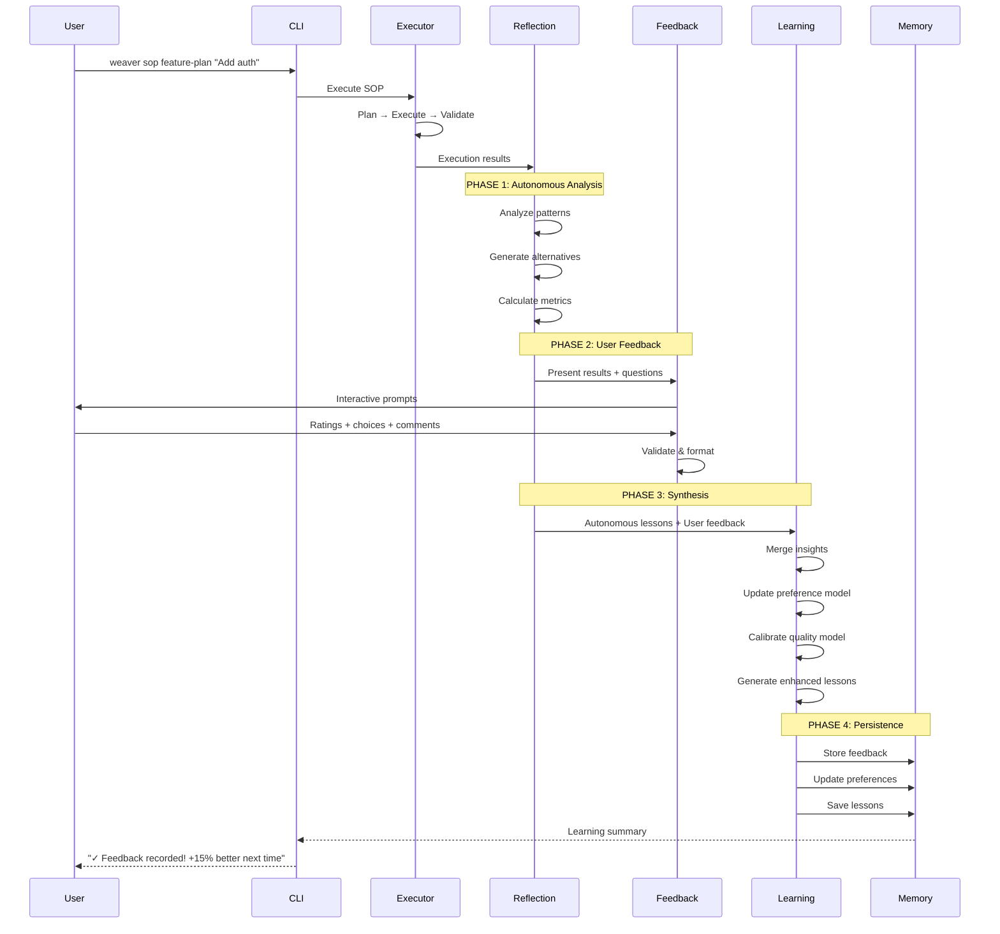

# User Feedback Integration for Reflection Stage

**Architecture Design Document**
**Version**: 1.0.0
**Date**: 2025-10-27
**Status**: Design Phase

---

## 📚 Related Documentation

### Learning Loop Components
- [[PHASE-12-LEARNING-LOOP-BLUEPRINT]] - Learning loop architecture
- [[PHASE-12-LEARNING-LOOP-INTEGRATION]] - Integration guide
- [[WEAVER-COMPLETE-IMPLEMENTATION-GUIDE]] - Weaver implementation

### Workflow Integration
- [[MARKDOWN-ASYNC-WORKFLOW-ARCHITECTURE]] - Markdown workflows
- [[WORKFLOW-EXTENSION-GUIDE]] - Workflow extension patterns
- [[WEAVER-SOPS-FRAMEWORK]] - SOP framework

### Memory & Embeddings
- [[memorographic-embeddings-research]] - Memory embeddings
- [[CHUNKING-STRATEGY-SYNTHESIS]] - Chunking strategies

### See Also
- [[phase-13-master-plan]] - Phase 13 integration plan
- [[PHASE-12-EXECUTIVE-SUMMARY]] - Phase 12 overview

---


## Related

[[learning-loop-api]]
## Related

[[VECTOR-DB-MARKDOWN-WORKFLOW-ARCHITECTURE]]
## Related

[[MARKDOWN-WORKFLOW-IMPLEMENTATION-SUMMARY]]
## Executive Summary

This document specifies the architecture for integrating user feedback into Weaver's autonomous learning loop. The design transforms the reflection stage from purely autonomous analysis to a human-enhanced learning system that captures user preferences, validates AI decisions, and continuously improves SOP execution quality.

**Key Metrics Target**:
- User satisfaction trend: +15% per quarter
- Estimation accuracy: ±10% within 6 months
- Feedback completion rate: >70%
- Average feedback time: <2 minutes
- Approach alignment: >80% user-AI agreement

---

## Table of Contents

1. [System Architecture](#1-system-architecture)
2. [Enhanced Reflection Flow](#2-enhanced-reflection-flow)
3. [Feedback Type Taxonomy](#3-feedback-type-taxonomy)
4. [Data Models & Schemas](#4-data-models--schemas)
5. [Collection Mechanisms](#5-collection-mechanisms)
6. [Preference Learning System](#6-preference-learning-system)
7. [A/B Testing Framework](#7-ab-testing-framework)
8. [Integration Architecture](#8-integration-architecture)
9. [CLI User Experience](#9-cli-user-experience)
10. [Analytics & Reporting](#10-analytics--reporting)
11. [Privacy & Security](#11-privacy--security)
12. [Implementation Roadmap](#12-implementation-roadmap)

---

## 1. System Architecture

### 1.1 High-Level Architecture

```
┌─────────────────────────────────────────────────────────────────┐
│                      WEAVER CLI INTERFACE                        │
│  (User initiates SOP: weaver sop feature-plan "Add auth")      │
└────────────────────────┬────────────────────────────────────────┘
                         │
                         ▼
┌─────────────────────────────────────────────────────────────────┐
│                    EXECUTION PIPELINE                            │
│  ┌──────────┐  ┌──────────┐  ┌──────────┐  ┌──────────┐       │
│  │  Plan    │→ │ Execute  │→ │ Validate │→ │ Measure  │       │
│  └──────────┘  └──────────┘  └──────────┘  └──────────┘       │
└────────────────────────┬────────────────────────────────────────┘
                         │
                         ▼
┌─────────────────────────────────────────────────────────────────┐
│              ENHANCED REFLECTION SYSTEM (NEW)                    │
│                                                                  │
│  ┌──────────────────────────────────────────────────┐          │
│  │  PHASE 1: Autonomous Analysis                    │          │
│  │  • Pattern recognition                           │          │
│  │  • Performance metrics                           │          │
│  │  • Quality assessment                            │          │
│  │  • Alternative generation                        │          │
│  └────────────────┬─────────────────────────────────┘          │
│                   │                                              │
│                   ▼                                              │
│  ┌──────────────────────────────────────────────────┐          │
│  │  PHASE 2: User Feedback Collection               │          │
│  │  • Satisfaction rating (required)                │          │
│  │  • A/B testing (when applicable)                 │          │
│  │  • Qualitative feedback (optional)               │          │
│  │  • Preference signals (continuous)               │          │
│  └────────────────┬─────────────────────────────────┘          │
│                   │                                              │
│                   ▼                                              │
│  ┌──────────────────────────────────────────────────┐          │
│  │  PHASE 3: Synthesis & Learning                   │          │
│  │  • Merge autonomous + user insights              │          │
│  │  • Update preference model                       │          │
│  │  • Calibrate quality model                       │          │
│  │  • Generate enhanced lessons                     │          │
│  └────────────────┬─────────────────────────────────┘          │
│                   │                                              │
└───────────────────┼──────────────────────────────────────────────┘
                    │
                    ▼
┌─────────────────────────────────────────────────────────────────┐
│                    STORAGE & PERSISTENCE                         │
│  ┌──────────────┐  ┌──────────────┐  ┌──────────────┐         │
│  │   Feedback   │  │  Preference  │  │   Analytics  │         │
│  │   Database   │  │    Model     │  │    Metrics   │         │
│  └──────────────┘  └──────────────┘  └──────────────┘         │
│         │                  │                  │                  │
│         └──────────────────┴──────────────────┘                 │
│                            │                                     │
│                    Claude Flow Memory                           │
│              (MCP persistent storage)                           │
└─────────────────────────────────────────────────────────────────┘
```

### 1.2 Component Responsibilities

| Component | Responsibility | Technology |
|-----------|---------------|------------|
| **Feedback Collector** | CLI prompts, validation, formatting | inquirer, chalk |
| **Preference Engine** | Learn user patterns, predict choices | TypeScript, ML models |
| **A/B Test Manager** | Present alternatives, track choices | Custom framework |
| **Synthesis Engine** | Merge autonomous + user insights | LLM-assisted analysis |
| **Analytics System** | Track trends, generate reports | Time-series DB |
| **Storage Layer** | Persist feedback, preferences | Claude Flow Memory |

---

## 2. Enhanced Reflection Flow

### 2.1 Current vs. New Architecture

**BEFORE (Autonomous Only)**:
```
Execution → Reflection → Memory → Done
             (100% AI)
```

**AFTER (Human-Enhanced)**:
```
Execution → Autonomous Reflection → User Feedback → Synthesis → Memory → Done
             (AI analysis)          (Human input)   (AI+Human)
```

### 2.2 Detailed Flow Diagram



### 2.3 Timing & Performance

| Phase | Target Duration | Skip Condition |
|-------|----------------|----------------|
| Autonomous Analysis | 5-15 seconds | Never (always runs) |
| User Feedback | 30-120 seconds | `--no-feedback` flag |
| Synthesis | 3-8 seconds | If no feedback provided |
| Persistence | 1-2 seconds | Never (always runs) |

**Total overhead**: ~40-145 seconds (user-dependent)

---

## 3. Feedback Type Taxonomy

### 3.1 Type 1: Outcome Validation (Required)

**Purpose**: Quantify user satisfaction for quality learning
**Frequency**: Every SOP execution
**Required**: Yes (unless `--no-feedback`)

**Question Format**:
```
How satisfied are you with this [outcome type]?

⭐☆☆☆☆  1 - Very dissatisfied
⭐⭐☆☆☆  2 - Dissatisfied
⭐⭐⭐☆☆  3 - Neutral
⭐⭐⭐⭐☆  4 - Satisfied
⭐⭐⭐⭐⭐  5 - Very satisfied

Your rating: [____]
```

**Follow-up** (if rating ≤ 3):
```
What was the main issue? (optional)
[ ] Quality below expectations
[ ] Missing important details
[ ] Incorrect assumptions
[ ] Too complex/verbose
[ ] Other: ________________
```

**Data Captured**:
```typescript
{
  satisfactionRating: 1 | 2 | 3 | 4 | 5;
  ratingTimestamp: number;
  issueCategories?: string[];
  freeformComment?: string;
}
```

### 3.2 Type 2: A/B Testing (Conditional)

**Purpose**: Learn which approaches work best in which contexts
**Frequency**: When 2+ alternatives are generated
**Required**: No (can skip)

**Question Format**:
```
We analyzed 3 architectural approaches:

┌─────────────────────────────────────────────────────┐
│ A. Microservices Architecture                       │
│                                                      │
│ Pros:                                               │
│  ✓ Highly scalable                                 │
│  ✓ Independent deployment                          │
│  ✓ Technology flexibility                          │
│                                                      │
│ Cons:                                               │
│  ✗ Complex operations                              │
│  ✗ Higher infrastructure cost                      │
│  ✗ Distributed debugging                           │
│                                                      │
│ Effort: 8 weeks | Quality: High | Risk: Medium     │
└─────────────────────────────────────────────────────┘

┌─────────────────────────────────────────────────────┐
│ B. Modular Monolith                                 │
│                                                      │
│ Pros:                                               │
│  ✓ Simpler operations                              │
│  ✓ Faster development                              │
│  ✓ Easier debugging                                │
│                                                      │
│ Cons:                                               │
│  ✗ Scaling limitations                             │
│  ✗ Shared resources                                │
│  ✗ Deployment coupling                             │
│                                                      │
│ Effort: 4 weeks | Quality: Medium | Risk: Low      │
└─────────────────────────────────────────────────────┘

┌─────────────────────────────────────────────────────┐
│ C. Serverless Architecture                          │
│                                                      │
│ Pros:                                               │
│  ✓ Auto-scaling                                    │
│  ✓ Pay-per-use                                     │
│  ✓ Zero server management                          │
│                                                      │
│ Cons:                                               │
│  ✗ Cold start latency                              │
│  ✗ Vendor lock-in                                  │
│  ✗ Complex local testing                           │
│                                                      │
│ Effort: 6 weeks | Quality: High | Risk: Medium     │
└─────────────────────────────────────────────────────┘

Which approach would you choose? [A/B/C/Skip]:
```

**Follow-up**:
```
Why did you choose [selected approach]? (optional)
[________________________________________]

Rate confidence in this choice:
Low ◯───◯───◉───◯───◯ High
```

**Data Captured**:
```typescript
{
  approaches: Array<{
    id: string;
    name: string;
    pros: string[];
    cons: string[];
    metrics: {
      effortWeeks: number;
      qualityScore: 'low' | 'medium' | 'high';
      riskLevel: 'low' | 'medium' | 'high';
    };
  }>;
  selectedApproachId?: string;
  rationale?: string;
  confidence: 1 | 2 | 3 | 4 | 5;
}
```

### 3.3 Type 3: Qualitative Feedback (Optional)

**Purpose**: Capture nuanced insights for improvement
**Frequency**: User opt-in or auto-prompt if satisfaction ≤ 3
**Required**: No

**Question Format**:
```
Help us improve! What could be better? (optional)

Common areas:
1. More detail needed
2. Different approach
3. Better explanations
4. Include examples
5. Simplify complexity
6. Other

Your suggestions:
[____________________________________________]
[____________________________________________]
[____________________________________________]

Tags (select all that apply):
[ ] Architecture
[ ] Code quality
[ ] Documentation
[ ] Performance
[ ] Security
[ ] Testing
[ ] UX/Design
```

**Data Captured**:
```typescript
{
  improvements: string[];
  tags: string[];
  timestamp: number;
  contextMetadata: {
    sopType: string;
    taskComplexity: 'low' | 'medium' | 'high';
    executionDuration: number;
  };
}
```

### 3.4 Type 4: Preference Learning (Continuous)

**Purpose**: Build long-term user preference model
**Frequency**: After novel approaches or significant decisions
**Required**: No

**Question Format**:
```
We used a new approach for this task:
"Generate database schema from domain model using event sourcing"

Would you like this approach used for similar tasks?

◯ Yes, always use this
◯ Yes, when appropriate
◯ Only with my approval
◯ No, avoid this
◯ Skip

If conditional, when should we use this?
[____________________________________________]
```

**Data Captured**:
```typescript
{
  approach: string;
  preferenceSignal: 'always' | 'when-appropriate' | 'ask-first' | 'never';
  conditions?: string[];
  context: {
    taskType: string;
    projectSize: 'small' | 'medium' | 'large';
    teamSize: number;
    timeframe: 'tight' | 'normal' | 'flexible';
  };
}
```

---

## 4. Data Models & Schemas

### 4.1 Core Feedback Schema

```typescript
/**
 * Comprehensive user feedback for a single SOP execution
 */
interface UserFeedback {
  // ===== Metadata =====
  id: string;                    // UUID v4
  version: string;               // Schema version (semver)
  timestamp: number;             // Unix timestamp (ms)

  // Execution context
  sopId: string;                 // SOP identifier (e.g., "feature-plan")
  sopVersion: string;            // SOP version
  executionId: string;           // Unique execution run ID
  sessionId: string;             // User session

  // User context
  userId?: string;               // Anonymous by default
  userRole?: 'beginner' | 'intermediate' | 'expert';
  projectContext?: {
    name: string;
    size: 'small' | 'medium' | 'large';
    domain: string;
  };

  // ===== Type 1: Outcome Validation =====
  outcomeValidation: {
    satisfactionRating: 1 | 2 | 3 | 4 | 5;
    satisfactionComment?: string;
    issueCategories?: Array<
      'quality' | 'completeness' | 'accuracy' |
      'complexity' | 'relevance' | 'other'
    >;
    timeToProvide: number;       // Seconds
  };

  // ===== Type 2: A/B Testing =====
  abTesting?: {
    testId: string;
    approaches: Array<{
      id: string;
      name: string;
      description: string;
      pros: string[];
      cons: string[];
      metrics: {
        estimatedEffort: number;     // Weeks
        qualityScore: number;         // 0-1
        riskLevel: 'low' | 'medium' | 'high';
        complexity: number;           // 1-10
      };
    }>;
    selectedApproachId?: string;
    selectionRationale?: string;
    confidence: 1 | 2 | 3 | 4 | 5;
    alternativesConsidered: string[];
  };

  // ===== Type 3: Qualitative Feedback =====
  qualitativeFeedback?: {
    improvements: string[];
    tags: string[];
    detailedComments?: string;
    wouldRecommend: boolean;
    pain points?: string[];
    surprises?: string[];        // Positive or negative
  };

  // ===== Type 4: Preference Learning =====
  preferenceSignals: Array<{
    approach: string;
    signal: 'always' | 'when-appropriate' | 'ask-first' | 'never';
    conditions?: string[];
    weight: number;              // 0-1, based on user confidence
    context: {
      taskType: string;
      projectPhase: 'planning' | 'development' | 'maintenance';
      teamSize: number;
      urgency: 'low' | 'medium' | 'high';
    };
  }>;

  // ===== Derived Metrics =====
  derivedMetrics: {
    taskComplexity: 'low' | 'medium' | 'high';
    executionDuration: number;   // Seconds
    outputQuality: number;       // 0-1 (AI-assessed)
    userEngagement: number;      // 0-1 (feedback depth)
    feedbackCompleteness: number; // 0-1
  };

  // ===== Learning Weights =====
  learningImpact: {
    weight: number;              // 0-1, higher for detailed feedback
    confidence: number;          // 0-1, based on user expertise
    applicability: number;       // 0-1, how broadly applicable
  };
}
```

### 4.2 User Preference Model Schema

```typescript
/**
 * Long-term user preference model built from feedback history
 */
interface UserPreferenceModel {
  userId: string;
  version: string;
  lastUpdated: number;
  feedbackCount: number;        // Total feedback submissions

  // ===== Architectural Preferences =====
  architecture: {
    styles: {
      microservices: number;    // 0-1 preference score
      monolith: number;
      modular: number;
      serverless: number;
      eventDriven: number;
    };
    patterns: {
      mvc: number;
      mvvm: number;
      cqrs: number;
      eventSourcing: number;
      layered: number;
      hexagonal: number;
    };
    confidence: number;         // 0-1, based on feedback quantity
  };

  // ===== Planning Preferences =====
  planning: {
    detailLevel: 'minimal' | 'standard' | 'comprehensive';
    estimationStyle: 'optimistic' | 'realistic' | 'conservative';
    documentationLevel: 'minimal' | 'standard' | 'extensive';
    includeExamples: boolean;
    includeAlternatives: boolean;
    maxAlternatives: number;    // 1-5
  };

  // ===== Communication Preferences =====
  communication: {
    verbosity: 'concise' | 'balanced' | 'detailed';
    technicalDepth: 'high-level' | 'balanced' | 'deep-dive';
    includeRationale: boolean;
    includeTradeoffs: boolean;
    formatPreference: 'bullet-points' | 'prose' | 'mixed';
  };

  // ===== Quality Preferences =====
  quality: {
    testCoverageTarget: number;        // 0-100 percentage
    codeQualityThreshold: 'good' | 'excellent' | 'perfect';
    performanceImportance: 'low' | 'medium' | 'high';
    securityImportance: 'low' | 'medium' | 'high';
    maintainabilityImportance: 'low' | 'medium' | 'high';
  };

  // ===== Technology Preferences =====
  technology: {
    languagePreferences: Map<string, number>;  // e.g., { 'typescript': 0.9 }
    frameworkPreferences: Map<string, number>;
    databasePreferences: Map<string, number>;
    avoidTechnologies: string[];
  };

  // ===== Workflow Preferences =====
  workflow: {
    preferredSOPs: string[];
    automaticApprovals: string[];      // SOPs to auto-approve
    alwaysReview: string[];            // SOPs to always review
    skipReflection: boolean;
    feedbackFrequency: 'always' | 'important-only' | 'weekly';
  };

  // ===== Learning Indicators =====
  learning: {
    accuracyTrend: number[];           // Historical accuracy
    satisfactionTrend: number[];       // Historical satisfaction
    engagementLevel: 'low' | 'medium' | 'high';
    expertiseGrowth: number;           // 0-1, growing expertise
    preferenceStability: number;       // 0-1, how stable preferences are
  };

  // ===== Context-Specific Preferences =====
  contextual: Array<{
    condition: {
      projectSize?: 'small' | 'medium' | 'large';
      taskComplexity?: 'low' | 'medium' | 'high';
      urgency?: 'low' | 'medium' | 'high';
      teamSize?: number;
    };
    overrides: Partial<UserPreferenceModel>;
  }>;

  // ===== Confidence Metrics =====
  confidence: {
    overall: number;             // 0-1
    byCategory: {
      architecture: number;
      planning: number;
      communication: number;
      quality: number;
      technology: number;
    };
    minimumFeedbackForConfidence: 10;
  };
}
```

### 4.3 A/B Test Record Schema

```typescript
/**
 * Individual A/B test instance and results
 */
interface ABTestRecord {
  testId: string;
  timestamp: number;
  sopId: string;
  executionId: string;

  // Test configuration
  testType: 'approach-selection' | 'quality-assessment' | 'preference-validation';

  // Approaches tested
  approaches: Array<{
    id: string;
    name: string;
    description: string;
    generatedBy: 'ai' | 'template' | 'hybrid';

    // Attributes
    attributes: {
      pros: string[];
      cons: string[];
      estimatedEffort: number;
      estimatedQuality: number;
      riskLevel: 'low' | 'medium' | 'high';
      complexity: number;
      novelty: number;           // 0-1, how novel is this approach
    };

    // Presentation
    presentationOrder: number;
    presentationFormat: 'detailed' | 'summary' | 'comparison';
  }>;

  // User response
  userChoice?: {
    selectedApproachId: string;
    rationale?: string;
    confidence: number;          // 1-5
    timeToDecide: number;        // Seconds
    alternativesConsidered: string[];
  };

  // Outcome tracking
  outcome?: {
    actualEffort?: number;
    actualQuality?: number;
    userSatisfaction?: number;   // 1-5
    wouldChooseAgain?: boolean;
  };

  // Learning
  learningSignals: {
    validatedApproach: boolean;
    improvedEstimation: boolean;
    uncoveredPreference: boolean;
    weight: number;              // Learning weight (0-1)
  };
}
```

### 4.4 Feedback Analytics Schema

```typescript
/**
 * Aggregated analytics across all feedback
 */
interface FeedbackAnalytics {
  // Time range
  period: {
    start: number;
    end: number;
    duration: number;            // Days
  };

  // ===== Satisfaction Metrics =====
  satisfaction: {
    average: number;             // 1-5
    median: number;
    trend: Array<{ date: string; score: number }>;
    bySOPType: Map<string, number>;
    byComplexity: Map<'low' | 'medium' | 'high', number>;
    distribution: {
      '1': number;               // Count of 1-star ratings
      '2': number;
      '3': number;
      '4': number;
      '5': number;
    };
  };

  // ===== Approach Effectiveness =====
  approaches: {
    successRates: Map<string, {
      selectionCount: number;
      averageSatisfaction: number;
      outcomeAccuracy: number;   // % of time estimates were accurate
      repeatChoiceRate: number;  // % users would choose again
    }>;
    trending: Array<{
      approach: string;
      growthRate: number;        // % change in selection
    }>;
  };

  // ===== Improvement Areas =====
  improvements: {
    topRequests: Array<{
      category: string;
      count: number;
      examples: string[];
    }>;
    resolvedCount: number;       // Improvements acted upon
    pendingCount: number;
  };

  // ===== Learning Progress =====
  learning: {
    estimationAccuracy: {
      current: number;           // 0-1
      trend: number[];
      targetAccuracy: 0.9;       // ±10%
    };
    planQuality: {
      current: number;           // 0-1
      trend: number[];
    };
    preferenceConfidence: {
      current: number;           // 0-1
      trend: number[];
    };
  };

  // ===== Engagement Metrics =====
  engagement: {
    feedbackCompletionRate: number;    // 0-1
    averageResponseTime: number;       // Seconds
    detailedFeedbackRate: number;      // % with qualitative input
    abTestParticipationRate: number;
    skipRate: number;
  };

  // ===== Impact Metrics =====
  impact: {
    timeReduction: number;       // % reduction in task time
    qualityImprovement: number;  // % improvement in output quality
    userSatisfactionGrowth: number; // % growth in satisfaction
    automationIncrease: number;  // % increase in auto-approvals
  };
}
```

---

## 5. Collection Mechanisms

### 5.1 CLI Interface Architecture

```typescript
/**
 * Main feedback collection orchestrator
 */
class FeedbackCollector {
  private prompter: InquirerWrapper;
  private validator: FeedbackValidator;
  private formatter: FeedbackFormatter;
  private storage: FeedbackStorage;

  constructor(
    private config: FeedbackConfig,
    private preferences: UserPreferenceModel
  ) {
    this.prompter = new InquirerWrapper(config.theme);
    this.validator = new FeedbackValidator();
    this.formatter = new FeedbackFormatter();
    this.storage = new FeedbackStorage();
  }

  /**
   * Main entry point for feedback collection
   */
  async collect(
    execution: ExecutionResult,
    autonomousLessons: AutonomousLessons
  ): Promise<UserFeedback> {
    // Check if feedback is enabled
    if (this.config.skipFeedback || this.preferences.workflow.skipReflection) {
      return this.createSkippedFeedback(execution);
    }

    // Determine feedback mode
    const mode = this.determineFeedbackMode(execution, autonomousLessons);

    // Display execution summary
    await this.displayExecutionSummary(execution);

    // Collect feedback based on mode
    let feedback: Partial<UserFeedback> = {
      id: generateUUID(),
      version: '1.0.0',
      timestamp: Date.now(),
      sopId: execution.sopId,
      executionId: execution.id,
    };

    // Type 1: Outcome validation (always)
    feedback.outcomeValidation = await this.collectOutcomeValidation(
      execution,
      mode
    );

    // Type 2: A/B testing (conditional)
    if (autonomousLessons.alternatives.length > 1) {
      feedback.abTesting = await this.collectABTesting(
        autonomousLessons.alternatives,
        mode
      );
    }

    // Type 3: Qualitative feedback (optional or low satisfaction)
    if (mode === 'detailed' || feedback.outcomeValidation.satisfactionRating <= 3) {
      feedback.qualitativeFeedback = await this.collectQualitativeFeedback(
        execution,
        mode
      );
    }

    // Type 4: Preference learning (novel approaches)
    if (this.hasNovelApproaches(autonomousLessons)) {
      feedback.preferenceSignals = await this.collectPreferenceSignals(
        autonomousLessons,
        mode
      );
    }

    // Calculate derived metrics
    feedback.derivedMetrics = this.calculateDerivedMetrics(
      execution,
      feedback
    );

    // Calculate learning impact
    feedback.learningImpact = this.calculateLearningImpact(
      feedback,
      this.preferences
    );

    // Validate and format
    const validatedFeedback = this.validator.validate(feedback);
    const formattedFeedback = this.formatter.format(validatedFeedback);

    // Store feedback
    await this.storage.store(formattedFeedback);

    // Show thank you message with impact preview
    await this.displayImpactPreview(formattedFeedback);

    return formattedFeedback;
  }

  /**
   * Determine feedback mode based on context
   */
  private determineFeedbackMode(
    execution: ExecutionResult,
    lessons: AutonomousLessons
  ): 'minimal' | 'standard' | 'detailed' {
    // User preference
    if (this.preferences.workflow.feedbackFrequency === 'important-only') {
      if (execution.taskComplexity !== 'high') {
        return 'minimal';
      }
    }

    // Time-based: detailed weekly, standard otherwise
    const lastDetailedFeedback = this.storage.getLastDetailedFeedback();
    const daysSinceDetailed = (Date.now() - lastDetailedFeedback) / (1000 * 60 * 60 * 24);
    if (daysSinceDetailed >= 7) {
      return 'detailed';
    }

    // Complexity-based
    if (execution.taskComplexity === 'high' || lessons.alternatives.length > 2) {
      return 'detailed';
    }

    // Default
    return this.preferences.communication.verbosity === 'detailed'
      ? 'detailed'
      : 'standard';
  }

  /**
   * Display execution summary before feedback
   */
  private async displayExecutionSummary(execution: ExecutionResult): Promise<void> {
    console.log(chalk.cyan('\n━━━━━━━━━━━━━━━━━━━━━━━━━━━━━━━━━━━━━━━━━'));
    console.log(chalk.cyan.bold('📊 Execution Summary'));
    console.log(chalk.cyan('━━━━━━━━━━━━━━━━━━━━━━━━━━━━━━━━━━━━━━━━━\n'));

    console.log(`SOP: ${chalk.bold(execution.sopName)}`);
    console.log(`Task: ${execution.taskDescription}`);
    console.log(`Duration: ${this.formatDuration(execution.durationMs)}`);
    console.log(`Complexity: ${this.formatComplexity(execution.taskComplexity)}`);
    console.log(`Output: ${execution.outputSummary}\n`);
  }

  /**
   * Collect outcome validation (Type 1 - Required)
   */
  private async collectOutcomeValidation(
    execution: ExecutionResult,
    mode: 'minimal' | 'standard' | 'detailed'
  ): Promise<OutcomeValidation> {
    const startTime = Date.now();

    if (mode === 'minimal') {
      // Quick 1-5 rating only
      const { rating } = await this.prompter.prompt([
        {
          type: 'number',
          name: 'rating',
          message: '⭐ Rate your satisfaction (1-5):',
          validate: (val: number) => val >= 1 && val <= 5 || 'Must be 1-5',
        },
      ]);

      return {
        satisfactionRating: rating as 1 | 2 | 3 | 4 | 5,
        timeToProvide: (Date.now() - startTime) / 1000,
      };
    }

    // Standard/Detailed: Visual star selector + optional comment
    const { rating } = await this.prompter.prompt([
      {
        type: 'list',
        name: 'rating',
        message: 'How satisfied are you with this outcome?',
        choices: [
          { name: '⭐☆☆☆☆  1 - Very dissatisfied', value: 1 },
          { name: '⭐⭐☆☆☆  2 - Dissatisfied', value: 2 },
          { name: '⭐⭐⭐☆☆  3 - Neutral', value: 3 },
          { name: '⭐⭐⭐⭐☆  4 - Satisfied', value: 4 },
          { name: '⭐⭐⭐⭐⭐  5 - Very satisfied', value: 5 },
        ],
      },
    ]);

    let issueCategories: string[] | undefined;
    let satisfactionComment: string | undefined;

    // If low satisfaction, ask for issues
    if (rating <= 3) {
      const { issues } = await this.prompter.prompt([
        {
          type: 'checkbox',
          name: 'issues',
          message: 'What were the main issues? (select all that apply)',
          choices: [
            { name: 'Quality below expectations', value: 'quality' },
            { name: 'Missing important details', value: 'completeness' },
            { name: 'Incorrect assumptions', value: 'accuracy' },
            { name: 'Too complex/verbose', value: 'complexity' },
            { name: 'Not relevant to task', value: 'relevance' },
            { name: 'Other', value: 'other' },
          ],
        },
      ]);
      issueCategories = issues;

      // Optional comment
      const { comment } = await this.prompter.prompt([
        {
          type: 'input',
          name: 'comment',
          message: 'Any additional details? (optional, press Enter to skip)',
        },
      ]);
      if (comment.trim()) {
        satisfactionComment = comment;
      }
    }

    return {
      satisfactionRating: rating as 1 | 2 | 3 | 4 | 5,
      satisfactionComment,
      issueCategories,
      timeToProvide: (Date.now() - startTime) / 1000,
    };
  }

  /**
   * Collect A/B testing feedback (Type 2 - Conditional)
   */
  private async collectABTesting(
    approaches: Approach[],
    mode: 'minimal' | 'standard' | 'detailed'
  ): Promise<ABTestingFeedback> {
    console.log(chalk.yellow('\n🔬 Approach Comparison'));
    console.log(chalk.gray('We analyzed multiple architectural approaches:\n'));

    // Display approaches
    approaches.forEach((approach, index) => {
      this.displayApproach(approach, index);
    });

    // Ask user to select
    const { selectedId } = await this.prompter.prompt([
      {
        type: 'list',
        name: 'selectedId',
        message: 'Which approach would you choose?',
        choices: [
          ...approaches.map(a => ({
            name: `${a.name} (${a.metrics.effortWeeks} weeks, ${a.metrics.qualityScore} quality)`,
            value: a.id,
          })),
          { name: 'Skip selection', value: null },
        ],
      },
    ]);

    if (!selectedId) {
      return {
        testId: generateUUID(),
        approaches,
        confidence: 0,
        alternativesConsidered: [],
      };
    }

    // Optional rationale and confidence (detailed mode)
    let rationale: string | undefined;
    let confidence: number = 3; // Default medium

    if (mode === 'detailed') {
      const { rationaleInput, confidenceInput } = await this.prompter.prompt([
        {
          type: 'input',
          name: 'rationaleInput',
          message: 'Why did you choose this approach? (optional)',
        },
        {
          type: 'list',
          name: 'confidenceInput',
          message: 'How confident are you in this choice?',
          choices: [
            { name: 'Very low confidence', value: 1 },
            { name: 'Low confidence', value: 2 },
            { name: 'Medium confidence', value: 3 },
            { name: 'High confidence', value: 4 },
            { name: 'Very high confidence', value: 5 },
          ],
        },
      ]);

      if (rationaleInput.trim()) rationale = rationaleInput;
      confidence = confidenceInput;
    }

    return {
      testId: generateUUID(),
      approaches,
      selectedApproachId: selectedId,
      selectionRationale: rationale,
      confidence: confidence as 1 | 2 | 3 | 4 | 5,
      alternativesConsidered: approaches.map(a => a.id),
    };
  }

  /**
   * Display a single approach with formatting
   */
  private displayApproach(approach: Approach, index: number): void {
    const letter = String.fromCharCode(65 + index); // A, B, C...

    console.log(chalk.bold(`\n┌─────────────────────────────────────────────────────┐`));
    console.log(chalk.bold(`│ ${letter}. ${approach.name.padEnd(48)} │`));
    console.log(chalk.bold(`└─────────────────────────────────────────────────────┘`));

    console.log(chalk.green('\nPros:'));
    approach.pros.forEach(pro => console.log(chalk.green(`  ✓ ${pro}`)));

    console.log(chalk.red('\nCons:'));
    approach.cons.forEach(con => console.log(chalk.red(`  ✗ ${con}`)));

    console.log(chalk.gray(`\nMetrics:`));
    console.log(chalk.gray(`  Effort: ${approach.metrics.effortWeeks} weeks`));
    console.log(chalk.gray(`  Quality: ${approach.metrics.qualityScore}`));
    console.log(chalk.gray(`  Risk: ${approach.metrics.riskLevel}`));
  }

  /**
   * Collect qualitative feedback (Type 3 - Optional)
   */
  private async collectQualitativeFeedback(
    execution: ExecutionResult,
    mode: 'minimal' | 'standard' | 'detailed'
  ): Promise<QualitativeFeedback> {
    console.log(chalk.blue('\n💡 Help Us Improve'));

    const { improvements } = await this.prompter.prompt([
      {
        type: 'input',
        name: 'improvements',
        message: 'What could be better? (optional, comma-separated)',
      },
    ]);

    const improvementList = improvements
      .split(',')
      .map((s: string) => s.trim())
      .filter((s: string) => s.length > 0);

    const { tags } = await this.prompter.prompt([
      {
        type: 'checkbox',
        name: 'tags',
        message: 'Related areas (select all that apply):',
        choices: [
          { name: 'Architecture', value: 'architecture' },
          { name: 'Code quality', value: 'code-quality' },
          { name: 'Documentation', value: 'documentation' },
          { name: 'Performance', value: 'performance' },
          { name: 'Security', value: 'security' },
          { name: 'Testing', value: 'testing' },
          { name: 'UX/Design', value: 'ux' },
        ],
      },
    ]);

    return {
      improvements: improvementList,
      tags,
      wouldRecommend: true, // Could ask this separately
    };
  }

  /**
   * Collect preference signals (Type 4 - Novel approaches)
   */
  private async collectPreferenceSignals(
    lessons: AutonomousLessons,
    mode: 'minimal' | 'standard' | 'detailed'
  ): Promise<PreferenceSignal[]> {
    const signals: PreferenceSignal[] = [];

    for (const novelApproach of lessons.novelApproaches) {
      console.log(chalk.magenta(`\n🆕 New Approach Used:`));
      console.log(chalk.gray(`"${novelApproach.description}"\n`));

      const { preference } = await this.prompter.prompt([
        {
          type: 'list',
          name: 'preference',
          message: 'Use this approach in the future?',
          choices: [
            { name: 'Yes, always use this', value: 'always' },
            { name: 'Yes, when appropriate', value: 'when-appropriate' },
            { name: 'Only with my approval', value: 'ask-first' },
            { name: 'No, avoid this', value: 'never' },
          ],
        },
      ]);

      let conditions: string[] | undefined;
      if (preference === 'when-appropriate') {
        const { conditionInput } = await this.prompter.prompt([
          {
            type: 'input',
            name: 'conditionInput',
            message: 'When should we use this? (optional)',
          },
        ]);
        if (conditionInput.trim()) {
          conditions = [conditionInput];
        }
      }

      signals.push({
        approach: novelApproach.name,
        signal: preference,
        conditions,
        weight: preference === 'always' ? 1.0 : preference === 'never' ? 0.0 : 0.5,
        context: {
          taskType: lessons.taskType,
          projectPhase: 'development',
          teamSize: 1,
          urgency: 'medium',
        },
      });
    }

    return signals;
  }

  /**
   * Calculate derived metrics from feedback
   */
  private calculateDerivedMetrics(
    execution: ExecutionResult,
    feedback: Partial<UserFeedback>
  ): DerivedMetrics {
    // Task complexity from execution
    const taskComplexity = execution.taskComplexity;

    // Execution duration
    const executionDuration = execution.durationMs / 1000;

    // Output quality (AI-assessed, 0-1)
    const outputQuality = this.assessOutputQuality(execution);

    // User engagement (based on feedback depth)
    const userEngagement = this.calculateEngagement(feedback);

    // Feedback completeness
    const feedbackCompleteness = this.calculateCompleteness(feedback);

    return {
      taskComplexity,
      executionDuration,
      outputQuality,
      userEngagement,
      feedbackCompleteness,
    };
  }

  /**
   * Calculate learning impact weights
   */
  private calculateLearningImpact(
    feedback: Partial<UserFeedback>,
    preferences: UserPreferenceModel
  ): LearningImpact {
    // Weight based on feedback depth
    const completeness = feedback.derivedMetrics?.feedbackCompleteness || 0.5;
    const weight = completeness;

    // Confidence based on user expertise and engagement
    const userExpertise = preferences.learning.expertiseGrowth || 0.5;
    const engagement = feedback.derivedMetrics?.userEngagement || 0.5;
    const confidence = (userExpertise + engagement) / 2;

    // Applicability based on task complexity and context
    const complexity = feedback.derivedMetrics?.taskComplexity || 'medium';
    const applicability = complexity === 'high' ? 0.9 : complexity === 'medium' ? 0.7 : 0.5;

    return {
      weight,
      confidence,
      applicability,
    };
  }

  /**
   * Display impact preview after feedback
   */
  private async displayImpactPreview(feedback: UserFeedback): Promise<void> {
    console.log(chalk.green('\n✓ Feedback recorded! Thank you.\n'));

    console.log(chalk.cyan('Learning Impact:'));

    // Preference learned
    if (feedback.preferenceSignals.length > 0) {
      const pref = feedback.preferenceSignals[0];
      console.log(chalk.gray(`→ Preference: ${pref.approach} (${pref.signal})`));
    }

    // A/B test insight
    if (feedback.abTesting?.selectedApproachId) {
      const selected = feedback.abTesting.approaches.find(
        a => a.id === feedback.abTesting!.selectedApproachId
      );
      console.log(chalk.gray(`→ Approach: ${selected?.name} preferred`));
    }

    // Improvement areas
    if (feedback.qualitativeFeedback?.improvements.length) {
      console.log(chalk.gray(`→ Improvements: ${feedback.qualitativeFeedback.improvements.length} suggestions`));
    }

    // Impact estimate
    const impactEstimate = this.estimateImpact(feedback);
    console.log(chalk.green(`→ Next time: ~${impactEstimate}% better with these learnings\n`));
  }

  /**
   * Estimate improvement impact
   */
  private estimateImpact(feedback: UserFeedback): number {
    const baseImpact = 5; // 5% base improvement

    // Add impact based on feedback depth
    const depthBonus = feedback.learningImpact.weight * 10; // Up to 10%

    // Add impact based on confidence
    const confidenceBonus = feedback.learningImpact.confidence * 5; // Up to 5%

    // Add impact based on satisfaction (if low, bigger improvement potential)
    const satisfactionImpact = (5 - feedback.outcomeValidation.satisfactionRating) * 3;

    return Math.min(30, Math.round(baseImpact + depthBonus + confidenceBonus + satisfactionImpact));
  }

  // Helper methods
  private formatDuration(ms: number): string {
    const seconds = Math.floor(ms / 1000);
    if (seconds < 60) return `${seconds}s`;
    const minutes = Math.floor(seconds / 60);
    return `${minutes}m ${seconds % 60}s`;
  }

  private formatComplexity(complexity: string): string {
    const colors = { low: 'green', medium: 'yellow', high: 'red' };
    return chalk[colors[complexity as keyof typeof colors] || 'gray'](complexity.toUpperCase());
  }

  private hasNovelApproaches(lessons: AutonomousLessons): boolean {
    return lessons.novelApproaches && lessons.novelApproaches.length > 0;
  }

  private assessOutputQuality(execution: ExecutionResult): number {
    // Placeholder: Would use LLM to assess quality
    return 0.8;
  }

  private calculateEngagement(feedback: Partial<UserFeedback>): number {
    let score = 0;
    if (feedback.outcomeValidation) score += 0.25;
    if (feedback.abTesting) score += 0.25;
    if (feedback.qualitativeFeedback) score += 0.25;
    if (feedback.preferenceSignals?.length) score += 0.25;
    return score;
  }

  private calculateCompleteness(feedback: Partial<UserFeedback>): number {
    let total = 0;
    let filled = 0;

    total += 1; if (feedback.outcomeValidation) filled += 1;
    total += 1; if (feedback.abTesting) filled += 1;
    total += 1; if (feedback.qualitativeFeedback) filled += 1;
    total += 1; if (feedback.preferenceSignals) filled += 1;

    return filled / total;
  }

  private createSkippedFeedback(execution: ExecutionResult): UserFeedback {
    // Minimal feedback when skipped
    return {
      id: generateUUID(),
      version: '1.0.0',
      timestamp: Date.now(),
      sopId: execution.sopId,
      sopVersion: execution.sopVersion,
      executionId: execution.id,
      sessionId: execution.sessionId,
      outcomeValidation: {
        satisfactionRating: 3, // Neutral when skipped
        timeToProvide: 0,
      },
      preferenceSignals: [],
      derivedMetrics: {
        taskComplexity: execution.taskComplexity,
        executionDuration: execution.durationMs / 1000,
        outputQuality: 0.5,
        userEngagement: 0,
        feedbackCompleteness: 0.25, // Only basic outcome
      },
      learningImpact: {
        weight: 0.1, // Low weight for skipped feedback
        confidence: 0.3,
        applicability: 0.5,
      },
    } as UserFeedback;
  }
}
```

### 5.2 Inquirer Wrapper

```typescript
/**
 * Wrapper around inquirer with Weaver theming
 */
class InquirerWrapper {
  private theme: any;

  constructor(themeConfig: ThemeConfig) {
    this.theme = {
      prefix: chalk.cyan('?'),
      style: {
        answer: chalk.cyan,
        message: chalk.bold,
        error: chalk.red,
        help: chalk.gray,
      },
    };
  }

  async prompt(questions: any[]): Promise<any> {
    return inquirer.prompt(questions);
  }

  // Specialized prompt types
  async starRating(message: string): Promise<number> {
    const { rating } = await this.prompt([
      {
        type: 'list',
        name: 'rating',
        message,
        choices: [
          { name: '⭐☆☆☆☆  1', value: 1 },
          { name: '⭐⭐☆☆☆  2', value: 2 },
          { name: '⭐⭐⭐☆☆  3', value: 3 },
          { name: '⭐⭐⭐⭐☆  4', value: 4 },
          { name: '⭐⭐⭐⭐⭐  5', value: 5 },
        ],
      },
    ]);
    return rating;
  }

  async multiChoice(message: string, choices: string[]): Promise<string[]> {
    const { selected } = await this.prompt([
      {
        type: 'checkbox',
        name: 'selected',
        message,
        choices: choices.map(c => ({ name: c, value: c })),
      },
    ]);
    return selected;
  }

  async freeText(message: string, optional = true): Promise<string | undefined> {
    const { text } = await this.prompt([
      {
        type: 'input',
        name: 'text',
        message: optional ? `${message} (optional)` : message,
      },
    ]);
    return text.trim() || undefined;
  }
}
```

---

## 6. Preference Learning System

### 6.1 Preference Engine Architecture

```typescript
/**
 * Learns and applies user preferences from feedback history
 */
class PreferenceEngine {
  private model: UserPreferenceModel;
  private storage: PreferenceStorage;
  private updater: PreferenceUpdater;

  constructor(userId: string) {
    this.storage = new PreferenceStorage();
    this.model = this.storage.load(userId) || this.createDefaultModel(userId);
    this.updater = new PreferenceUpdater(this.model);
  }

  /**
   * Update preference model from new feedback
   */
  async updateFromFeedback(feedback: UserFeedback): Promise<void> {
    // Update architectural preferences
    if (feedback.abTesting?.selectedApproachId) {
      await this.updater.updateArchitecturePreferences(
        feedback.abTesting.approaches,
        feedback.abTesting.selectedApproachId,
        feedback.abTesting.confidence
      );
    }

    // Update planning preferences
    if (feedback.qualitativeFeedback?.tags.includes('documentation')) {
      await this.updater.updatePlanningPreferences(feedback);
    }

    // Update communication preferences
    await this.updater.updateCommunicationPreferences(
      feedback.outcomeValidation.satisfactionRating,
      feedback.derivedMetrics
    );

    // Update quality preferences
    await this.updater.updateQualityPreferences(feedback);

    // Update technology preferences
    if (feedback.preferenceSignals.length > 0) {
      await this.updater.updateTechnologyPreferences(
        feedback.preferenceSignals
      );
    }

    // Update workflow preferences
    await this.updater.updateWorkflowPreferences(feedback);

    // Update learning indicators
    await this.updater.updateLearningIndicators(feedback);

    // Increment feedback count
    this.model.feedbackCount++;
    this.model.lastUpdated = Date.now();

    // Recalculate confidence scores
    await this.updater.recalculateConfidence();

    // Save updated model
    await this.storage.save(this.model);
  }

  /**
   * Get preference for a specific context
   */
  getPreferenceForContext(context: TaskContext): ContextualPreference {
    // Check for exact context match
    for (const contextual of this.model.contextual) {
      if (this.matchesContext(context, contextual.condition)) {
        return this.mergePreferences(this.model, contextual.overrides);
      }
    }

    // Return default preferences
    return this.model;
  }

  /**
   * Predict best approach for a given task
   */
  predictBestApproach(
    approaches: Approach[],
    context: TaskContext
  ): { approachId: string; confidence: number } {
    const preferences = this.getPreferenceForContext(context);

    // Score each approach
    const scores = approaches.map(approach => ({
      id: approach.id,
      score: this.scoreApproach(approach, preferences, context),
    }));

    // Sort by score
    scores.sort((a, b) => b.score - a.score);

    // Calculate confidence based on score gap
    const topScore = scores[0].score;
    const secondScore = scores[1]?.score || 0;
    const confidence = Math.min(1, (topScore - secondScore) / topScore);

    return {
      approachId: scores[0].id,
      confidence,
    };
  }

  /**
   * Score an approach against preferences
   */
  private scoreApproach(
    approach: Approach,
    preferences: UserPreferenceModel,
    context: TaskContext
  ): number {
    let score = 0;

    // Architecture style match
    const styleScore = preferences.architecture.styles[
      approach.architectureStyle as keyof typeof preferences.architecture.styles
    ] || 0.5;
    score += styleScore * 0.3;

    // Quality preferences
    const qualityScore = this.matchQualityPreferences(approach, preferences);
    score += qualityScore * 0.3;

    // Technology preferences
    const techScore = this.matchTechnologyPreferences(approach, preferences);
    score += techScore * 0.2;

    // Planning preferences (detail level)
    const planningScore = this.matchPlanningPreferences(approach, preferences);
    score += planningScore * 0.2;

    return score;
  }

  /**
   * Check if context matches condition
   */
  private matchesContext(
    context: TaskContext,
    condition: ContextCondition
  ): boolean {
    if (condition.projectSize && context.projectSize !== condition.projectSize) {
      return false;
    }
    if (condition.taskComplexity && context.taskComplexity !== condition.taskComplexity) {
      return false;
    }
    if (condition.urgency && context.urgency !== condition.urgency) {
      return false;
    }
    if (condition.teamSize && context.teamSize !== condition.teamSize) {
      return false;
    }
    return true;
  }

  /**
   * Create default preference model for new user
   */
  private createDefaultModel(userId: string): UserPreferenceModel {
    return {
      userId,
      version: '1.0.0',
      lastUpdated: Date.now(),
      feedbackCount: 0,

      architecture: {
        styles: {
          microservices: 0.5,
          monolith: 0.5,
          modular: 0.5,
          serverless: 0.5,
          eventDriven: 0.5,
        },
        patterns: {
          mvc: 0.5,
          mvvm: 0.5,
          cqrs: 0.5,
          eventSourcing: 0.5,
          layered: 0.5,
          hexagonal: 0.5,
        },
        confidence: 0,
      },

      planning: {
        detailLevel: 'standard',
        estimationStyle: 'realistic',
        documentationLevel: 'standard',
        includeExamples: true,
        includeAlternatives: true,
        maxAlternatives: 3,
      },

      communication: {
        verbosity: 'balanced',
        technicalDepth: 'balanced',
        includeRationale: true,
        includeTradeoffs: true,
        formatPreference: 'mixed',
      },

      quality: {
        testCoverageTarget: 80,
        codeQualityThreshold: 'excellent',
        performanceImportance: 'medium',
        securityImportance: 'high',
        maintainabilityImportance: 'high',
      },

      technology: {
        languagePreferences: new Map(),
        frameworkPreferences: new Map(),
        databasePreferences: new Map(),
        avoidTechnologies: [],
      },

      workflow: {
        preferredSOPs: [],
        automaticApprovals: [],
        alwaysReview: [],
        skipReflection: false,
        feedbackFrequency: 'always',
      },

      learning: {
        accuracyTrend: [],
        satisfactionTrend: [],
        engagementLevel: 'medium',
        expertiseGrowth: 0.5,
        preferenceStability: 0.5,
      },

      contextual: [],

      confidence: {
        overall: 0,
        byCategory: {
          architecture: 0,
          planning: 0,
          communication: 0,
          quality: 0,
          technology: 0,
        },
        minimumFeedbackForConfidence: 10,
      },
    };
  }

  // Additional helper methods...
}
```

### 6.2 Preference Updater

```typescript
/**
 * Updates preference model based on feedback signals
 */
class PreferenceUpdater {
  constructor(private model: UserPreferenceModel) {}

  /**
   * Update architecture preferences from A/B test
   */
  async updateArchitecturePreferences(
    approaches: Approach[],
    selectedId: string,
    confidence: number
  ): Promise<void> {
    const selected = approaches.find(a => a.id === selectedId);
    if (!selected) return;

    // Increase preference for selected style
    const style = selected.architectureStyle as keyof typeof this.model.architecture.styles;
    const currentScore = this.model.architecture.styles[style] || 0.5;

    // Learning rate based on confidence
    const learningRate = 0.1 * (confidence / 5);

    // Update score (exponential moving average)
    this.model.architecture.styles[style] =
      currentScore * (1 - learningRate) + 1.0 * learningRate;

    // Decrease preference for non-selected styles slightly
    for (const approach of approaches) {
      if (approach.id !== selectedId) {
        const otherStyle = approach.architectureStyle as keyof typeof this.model.architecture.styles;
        const otherScore = this.model.architecture.styles[otherStyle] || 0.5;
        this.model.architecture.styles[otherStyle] =
          otherScore * (1 - learningRate * 0.3) + 0.0 * learningRate * 0.3;
      }
    }

    // Normalize scores
    this.normalizeArchitectureScores();
  }

  /**
   * Normalize architecture style scores to sum to reasonable range
   */
  private normalizeArchitectureScores(): void {
    const styles = this.model.architecture.styles;
    const sum = Object.values(styles).reduce((a, b) => a + b, 0);
    const target = Object.keys(styles).length * 0.5; // Target average of 0.5

    if (sum > 0) {
      const factor = target / sum;
      for (const key in styles) {
        styles[key as keyof typeof styles] *= factor;
      }
    }
  }

  /**
   * Update communication preferences based on satisfaction
   */
  async updateCommunicationPreferences(
    satisfaction: number,
    metrics: DerivedMetrics
  ): Promise<void> {
    // If low satisfaction with detailed output, reduce verbosity
    if (satisfaction <= 3 && this.model.communication.verbosity === 'detailed') {
      this.model.communication.verbosity = 'balanced';
    }

    // If high satisfaction with concise output, keep it
    if (satisfaction >= 4 && this.model.communication.verbosity === 'concise') {
      // No change, user likes concise
    }

    // Track satisfaction trend
    this.model.learning.satisfactionTrend.push(satisfaction);
    if (this.model.learning.satisfactionTrend.length > 50) {
      this.model.learning.satisfactionTrend.shift(); // Keep last 50
    }
  }

  /**
   * Recalculate confidence scores
   */
  async recalculateConfidence(): Promise<void> {
    const feedbackCount = this.model.feedbackCount;
    const minRequired = this.model.confidence.minimumFeedbackForConfidence;

    // Overall confidence based on feedback count
    this.model.confidence.overall = Math.min(1, feedbackCount / minRequired);

    // Category-specific confidence
    // (Would be based on category-specific feedback counts)
    for (const category in this.model.confidence.byCategory) {
      this.model.confidence.byCategory[category as keyof typeof this.model.confidence.byCategory] =
        this.model.confidence.overall; // Simplified
    }
  }
}
```

---

## 7. A/B Testing Framework

### 7.1 A/B Test Manager

```typescript
/**
 * Manages A/B testing of different approaches
 */
class ABTestManager {
  private storage: ABTestStorage;
  private analyzer: ABTestAnalyzer;

  constructor() {
    this.storage = new ABTestStorage();
    this.analyzer = new ABTestAnalyzer();
  }

  /**
   * Create and present an A/B test
   */
  async createTest(
    sopId: string,
    executionId: string,
    approaches: Approach[]
  ): Promise<ABTestRecord> {
    const testRecord: ABTestRecord = {
      testId: generateUUID(),
      timestamp: Date.now(),
      sopId,
      executionId,
      testType: 'approach-selection',
      approaches: approaches.map((a, index) => ({
        ...a,
        presentationOrder: index,
        presentationFormat: 'detailed',
      })),
      learningSignals: {
        validatedApproach: false,
        improvedEstimation: false,
        uncoveredPreference: false,
        weight: 0.5,
      },
    };

    // Store test
    await this.storage.save(testRecord);

    return testRecord;
  }

  /**
   * Record user's choice in A/B test
   */
  async recordChoice(
    testId: string,
    selectedApproachId: string,
    rationale?: string,
    confidence: number = 3
  ): Promise<void> {
    const test = await this.storage.load(testId);
    if (!test) throw new Error(`Test ${testId} not found`);

    const startTime = test.timestamp;
    const endTime = Date.now();
    const timeToDecide = (endTime - startTime) / 1000;

    test.userChoice = {
      selectedApproachId,
      rationale,
      confidence: confidence as 1 | 2 | 3 | 4 | 5,
      timeToDecide,
      alternativesConsidered: test.approaches.map(a => a.id),
    };

    await this.storage.update(test);
  }

  /**
   * Record actual outcome of chosen approach
   */
  async recordOutcome(
    testId: string,
    actualEffort: number,
    actualQuality: number,
    userSatisfaction: number
  ): Promise<void> {
    const test = await this.storage.load(testId);
    if (!test) throw new Error(`Test ${testId} not found`);

    if (!test.userChoice) {
      throw new Error('Cannot record outcome without user choice');
    }

    const selectedApproach = test.approaches.find(
      a => a.id === test.userChoice!.selectedApproachId
    );

    if (!selectedApproach) return;

    // Calculate accuracy
    const effortAccuracy = 1 - Math.abs(
      actualEffort - selectedApproach.attributes.estimatedEffort
    ) / selectedApproach.attributes.estimatedEffort;

    const qualityAccuracy = 1 - Math.abs(
      actualQuality - selectedApproach.attributes.estimatedQuality
    );

    test.outcome = {
      actualEffort,
      actualQuality,
      userSatisfaction: userSatisfaction as 1 | 2 | 3 | 4 | 5,
      wouldChooseAgain: userSatisfaction >= 4,
    };

    // Update learning signals
    test.learningSignals.validatedApproach = userSatisfaction >= 4;
    test.learningSignals.improvedEstimation = (effortAccuracy + qualityAccuracy) / 2 > 0.8;
    test.learningSignals.weight = test.learningSignals.validatedApproach ? 1.0 : 0.5;

    await this.storage.update(test);
  }

  /**
   * Analyze A/B test results
   */
  async analyzeResults(timeframe: number = 30): Promise<ABTestAnalysis> {
    const tests = await this.storage.loadRecent(timeframe);
    return this.analyzer.analyze(tests);
  }
}
```

### 7.2 A/B Test Analyzer

```typescript
/**
 * Analyzes A/B test results to extract insights
 */
class ABTestAnalyzer {
  /**
   * Analyze multiple A/B tests
   */
  analyze(tests: ABTestRecord[]): ABTestAnalysis {
    // Approach success rates
    const approachStats = this.calculateApproachStats(tests);

    // User choice patterns
    const choicePatterns = this.analyzeChoicePatterns(tests);

    // Estimation accuracy
    const estimationAccuracy = this.calculateEstimationAccuracy(tests);

    // Preference trends
    const preferenceTrends = this.analyzePreferenceTrends(tests);

    return {
      totalTests: tests.length,
      testsWithChoice: tests.filter(t => t.userChoice).length,
      testsWithOutcome: tests.filter(t => t.outcome).length,
      approachStats,
      choicePatterns,
      estimationAccuracy,
      preferenceTrends,
    };
  }

  /**
   * Calculate statistics for each approach
   */
  private calculateApproachStats(
    tests: ABTestRecord[]
  ): Map<string, ApproachStats> {
    const stats = new Map<string, ApproachStats>();

    // Aggregate by approach name
    for (const test of tests) {
      for (const approach of test.approaches) {
        if (!stats.has(approach.name)) {
          stats.set(approach.name, {
            name: approach.name,
            timesPresented: 0,
            timesSelected: 0,
            selectionRate: 0,
            averageSatisfaction: 0,
            estimationAccuracy: 0,
            repeatChoiceRate: 0,
          });
        }

        const stat = stats.get(approach.name)!;
        stat.timesPresented++;

        if (test.userChoice?.selectedApproachId === approach.id) {
          stat.timesSelected++;

          if (test.outcome) {
            stat.averageSatisfaction =
              (stat.averageSatisfaction * (stat.timesSelected - 1) +
               test.outcome.userSatisfaction) / stat.timesSelected;

            if (test.outcome.wouldChooseAgain) {
              stat.repeatChoiceRate++;
            }
          }
        }
      }
    }

    // Calculate rates
    for (const stat of stats.values()) {
      stat.selectionRate = stat.timesSelected / stat.timesPresented;
      stat.repeatChoiceRate = stat.repeatChoiceRate / stat.timesSelected;
    }

    return stats;
  }

  /**
   * Analyze user choice patterns
   */
  private analyzeChoicePatterns(tests: ABTestRecord[]): ChoicePatterns {
    const patterns: ChoicePatterns = {
      averageTimeToDecide: 0,
      confidenceDistribution: { '1': 0, '2': 0, '3': 0, '4': 0, '5': 0 },
      rationaleProvidedRate: 0,
      preferredAttributes: [],
    };

    const chosenTests = tests.filter(t => t.userChoice);

    if (chosenTests.length === 0) return patterns;

    // Average time to decide
    patterns.averageTimeToDecide =
      chosenTests.reduce((sum, t) => sum + (t.userChoice?.timeToDecide || 0), 0) /
      chosenTests.length;

    // Confidence distribution
    for (const test of chosenTests) {
      const conf = test.userChoice!.confidence.toString() as '1' | '2' | '3' | '4' | '5';
      patterns.confidenceDistribution[conf]++;
    }

    // Rationale provided rate
    patterns.rationaleProvidedRate =
      chosenTests.filter(t => t.userChoice?.rationale).length / chosenTests.length;

    return patterns;
  }

  /**
   * Calculate estimation accuracy over time
   */
  private calculateEstimationAccuracy(tests: ABTestRecord[]): number {
    const testsWithOutcome = tests.filter(t => t.outcome && t.userChoice);

    if (testsWithOutcome.length === 0) return 0;

    let totalAccuracy = 0;

    for (const test of testsWithOutcome) {
      const selected = test.approaches.find(
        a => a.id === test.userChoice!.selectedApproachId
      );

      if (!selected || !test.outcome) continue;

      const effortAccuracy = 1 - Math.abs(
        test.outcome.actualEffort - selected.attributes.estimatedEffort
      ) / selected.attributes.estimatedEffort;

      const qualityAccuracy = 1 - Math.abs(
        test.outcome.actualQuality - selected.attributes.estimatedQuality
      );

      totalAccuracy += (effortAccuracy + qualityAccuracy) / 2;
    }

    return totalAccuracy / testsWithOutcome.length;
  }

  /**
   * Analyze preference trends over time
   */
  private analyzePreferenceTrends(tests: ABTestRecord[]): PreferenceTrend[] {
    // Group by approach style
    const byStyle = new Map<string, number[]>();

    for (const test of tests) {
      if (!test.userChoice || !test.outcome) continue;

      const selected = test.approaches.find(
        a => a.id === test.userChoice!.selectedApproachId
      );

      if (!selected) continue;

      const style = selected.attributes.// Would extract style

      if (!byStyle.has(style)) {
        byStyle.set(style, []);
      }

      byStyle.get(style)!.push(test.outcome.userSatisfaction);
    }

    // Calculate trends
    const trends: PreferenceTrend[] = [];

    for (const [style, satisfactions] of byStyle.entries()) {
      const recent = satisfactions.slice(-10);
      const older = satisfactions.slice(0, -10);

      const recentAvg = recent.reduce((a, b) => a + b, 0) / recent.length;
      const olderAvg = older.length > 0
        ? older.reduce((a, b) => a + b, 0) / older.length
        : recentAvg;

      const trend = recentAvg - olderAvg;

      trends.push({
        approach: style,
        direction: trend > 0 ? 'increasing' : trend < 0 ? 'decreasing' : 'stable',
        strength: Math.abs(trend),
      });
    }

    return trends;
  }
}
```

---

## 8. Integration Architecture

### 8.1 Enhanced Reflection System

```typescript
/**
 * Enhanced reflection system with user feedback integration
 */
class EnhancedReflectionSystem {
  private autonomousAnalyzer: AutonomousAnalyzer;
  private feedbackCollector: FeedbackCollector;
  private synthesizer: InsightSynthesizer;
  private preferenceEngine: PreferenceEngine;
  private abTestManager: ABTestManager;
  private storage: ReflectionStorage;

  constructor(
    private config: ReflectionConfig,
    private userId: string
  ) {
    this.autonomousAnalyzer = new AutonomousAnalyzer();
    this.preferenceEngine = new PreferenceEngine(userId);
    this.feedbackCollector = new FeedbackCollector(
      config.feedbackConfig,
      this.preferenceEngine.getModel()
    );
    this.synthesizer = new InsightSynthesizer();
    this.abTestManager = new ABTestManager();
    this.storage = new ReflectionStorage();
  }

  /**
   * Main reflection flow with user feedback
   */
  async reflect(execution: ExecutionResult): Promise<EnhancedLessons> {
    console.log(chalk.cyan('\n🔍 Starting reflection phase...\n'));

    // ===== PHASE 1: Autonomous Analysis =====
    console.log(chalk.gray('Phase 1: Autonomous analysis...'));
    const startPhase1 = Date.now();

    const autonomousLessons = await this.autonomousAnalyzer.analyze(execution);

    const phase1Duration = Date.now() - startPhase1;
    console.log(chalk.green(`✓ Autonomous analysis complete (${phase1Duration}ms)\n`));

    // ===== PHASE 2: User Feedback Collection =====
    console.log(chalk.gray('Phase 2: Collecting your feedback...\n'));
    const startPhase2 = Date.now();

    const userFeedback = await this.feedbackCollector.collect(
      execution,
      autonomousLessons
    );

    const phase2Duration = Date.now() - startPhase2;
    console.log(chalk.green(`✓ Feedback collected (${phase2Duration / 1000}s)\n`));

    // ===== PHASE 3: Synthesis =====
    console.log(chalk.gray('Phase 3: Synthesizing learnings...'));
    const startPhase3 = Date.now();

    const enhancedLessons = await this.synthesizer.synthesize(
      autonomousLessons,
      userFeedback,
      execution
    );

    const phase3Duration = Date.now() - startPhase3;
    console.log(chalk.green(`✓ Synthesis complete (${phase3Duration}ms)\n`));

    // ===== PHASE 4: Preference & Model Updates =====
    console.log(chalk.gray('Phase 4: Updating learning models...'));
    const startPhase4 = Date.now();

    // Update preference model
    await this.preferenceEngine.updateFromFeedback(userFeedback);

    // Update A/B test records if applicable
    if (userFeedback.abTesting) {
      await this.abTestManager.recordChoice(
        userFeedback.abTesting.testId,
        userFeedback.abTesting.selectedApproachId!,
        userFeedback.abTesting.selectionRationale,
        userFeedback.abTesting.confidence
      );
    }

    const phase4Duration = Date.now() - startPhase4;
    console.log(chalk.green(`✓ Models updated (${phase4Duration}ms)\n`));

    // ===== PHASE 5: Persistence =====
    console.log(chalk.gray('Phase 5: Persisting to memory...'));
    const startPhase5 = Date.now();

    await this.persistLearnings(enhancedLessons, userFeedback);

    const phase5Duration = Date.now() - startPhase5;
    console.log(chalk.green(`✓ Persisted to memory (${phase5Duration}ms)\n`));

    // Display final summary
    this.displayReflectionSummary(enhancedLessons, userFeedback);

    return enhancedLessons;
  }

  /**
   * Persist learnings to Claude Flow memory
   */
  private async persistLearnings(
    lessons: EnhancedLessons,
    feedback: UserFeedback
  ): Promise<void> {
    // Store feedback
    await claudeFlowMemory.store(
      `weaver_feedback_${feedback.id}`,
      JSON.stringify(feedback),
      'weaver_feedback'
    );

    // Store enhanced lessons
    await claudeFlowMemory.store(
      `weaver_lessons_${lessons.executionId}`,
      JSON.stringify(lessons),
      'weaver_lessons'
    );

    // Update preference model in memory
    const preferenceModel = this.preferenceEngine.getModel();
    await claudeFlowMemory.store(
      `weaver_preferences_${this.userId}`,
      JSON.stringify(preferenceModel),
      'weaver_preferences'
    );
  }

  /**
   * Display reflection summary
   */
  private displayReflectionSummary(
    lessons: EnhancedLessons,
    feedback: UserFeedback
  ): void {
    console.log(chalk.cyan('━━━━━━━━━━━━━━━━━━━━━━━━━━━━━━━━━━━━━━━━━'));
    console.log(chalk.cyan.bold('📚 Reflection Summary'));
    console.log(chalk.cyan('━━━━━━━━━━━━━━━━━━━━━━━━━━━━━━━━━━━━━━━━━\n'));

    console.log(chalk.bold('Key Learnings:'));
    lessons.keyLearnings.forEach((learning, i) => {
      console.log(chalk.gray(`  ${i + 1}. ${learning}`));
    });

    console.log(chalk.bold('\nUser Satisfaction:'));
    const stars = '⭐'.repeat(feedback.outcomeValidation.satisfactionRating);
    console.log(chalk.yellow(`  ${stars} (${feedback.outcomeValidation.satisfactionRating}/5)`));

    if (lessons.improvementAreas.length > 0) {
      console.log(chalk.bold('\nImprovement Areas:'));
      lessons.improvementAreas.forEach(area => {
        console.log(chalk.gray(`  • ${area}`));
      });
    }

    console.log(chalk.bold('\nNext Execution Impact:'));
    console.log(chalk.green(`  → Estimated improvement: +${lessons.impactEstimate}%`));
    console.log(chalk.green(`  → Confidence: ${Math.round(lessons.confidence * 100)}%\n`));
  }
}
```

### 8.2 Insight Synthesizer

```typescript
/**
 * Synthesizes autonomous analysis with user feedback
 */
class InsightSynthesizer {
  /**
   * Merge AI and human insights
   */
  async synthesize(
    autonomousLessons: AutonomousLessons,
    userFeedback: UserFeedback,
    execution: ExecutionResult
  ): Promise<EnhancedLessons> {
    // Start with autonomous lessons
    const enhanced: EnhancedLessons = {
      ...autonomousLessons,
      userSatisfaction: userFeedback.outcomeValidation.satisfactionRating,
      userFeedbackId: userFeedback.id,
      enhancedBy: 'user-feedback',
      confidence: 0,
      impactEstimate: 0,
    };

    // Add user-identified improvements
    if (userFeedback.qualitativeFeedback?.improvements) {
      enhanced.improvementAreas = [
        ...enhanced.improvementAreas,
        ...userFeedback.qualitativeFeedback.improvements,
      ];
    }

    // Add user preference signals
    if (userFeedback.preferenceSignals.length > 0) {
      enhanced.preferenceSignals = userFeedback.preferenceSignals;
    }

    // Adjust weights based on user satisfaction
    enhanced.learningWeight = this.calculateEnhancedWeight(
      autonomousLessons.learningWeight,
      userFeedback.learningImpact.weight
    );

    // Calculate confidence
    enhanced.confidence = this.calculateConfidence(
      autonomousLessons,
      userFeedback
    );

    // Estimate impact
    enhanced.impactEstimate = this.estimateImpact(
      autonomousLessons,
      userFeedback
    );

    // Synthesize key learnings with LLM
    enhanced.keyLearnings = await this.synthesizeKeyLearnings(
      autonomousLessons,
      userFeedback,
      execution
    );

    return enhanced;
  }

  /**
   * Calculate enhanced learning weight
   */
  private calculateEnhancedWeight(
    autonomousWeight: number,
    userWeight: number
  ): number {
    // User feedback gets higher weight than autonomous
    return autonomousWeight * 0.4 + userWeight * 0.6;
  }

  /**
   * Calculate confidence in learnings
   */
  private calculateConfidence(
    autonomousLessons: AutonomousLessons,
    userFeedback: UserFeedback
  ): number {
    // Base confidence from autonomous analysis
    let confidence = 0.6;

    // Boost if user satisfaction is high
    if (userFeedback.outcomeValidation.satisfactionRating >= 4) {
      confidence += 0.2;
    }

    // Boost if user provided detailed feedback
    if (userFeedback.derivedMetrics.feedbackCompleteness > 0.7) {
      confidence += 0.1;
    }

    // Boost if A/B test choice was made with high confidence
    if (userFeedback.abTesting?.confidence >= 4) {
      confidence += 0.1;
    }

    return Math.min(1, confidence);
  }

  /**
   * Estimate improvement impact for next execution
   */
  private estimateImpact(
    autonomousLessons: AutonomousLessons,
    userFeedback: UserFeedback
  ): number {
    let impact = 5; // Base 5%

    // Add impact based on learning weight
    impact += userFeedback.learningImpact.weight * 10;

    // Add impact based on improvement areas identified
    if (userFeedback.qualitativeFeedback?.improvements.length) {
      impact += userFeedback.qualitativeFeedback.improvements.length * 2;
    }

    // Add impact based on preference signals
    if (userFeedback.preferenceSignals.length > 0) {
      impact += userFeedback.preferenceSignals.length * 3;
    }

    // Reduce if satisfaction was already high (less room for improvement)
    if (userFeedback.outcomeValidation.satisfactionRating >= 4) {
      impact *= 0.7;
    }

    return Math.min(30, Math.round(impact));
  }

  /**
   * Synthesize key learnings using LLM
   */
  private async synthesizeKeyLearnings(
    autonomousLessons: AutonomousLessons,
    userFeedback: UserFeedback,
    execution: ExecutionResult
  ): Promise<string[]> {
    // Use LLM to synthesize insights
    const prompt = `
Synthesize key learnings from this SOP execution:

EXECUTION:
- SOP: ${execution.sopName}
- Task: ${execution.taskDescription}
- Duration: ${execution.durationMs}ms
- Complexity: ${execution.taskComplexity}

AUTONOMOUS ANALYSIS:
${JSON.stringify(autonomousLessons.keyLearnings, null, 2)}

USER FEEDBACK:
- Satisfaction: ${userFeedback.outcomeValidation.satisfactionRating}/5
- Issues: ${userFeedback.outcomeValidation.issueCategories?.join(', ') || 'none'}
- Improvements: ${userFeedback.qualitativeFeedback?.improvements.join(', ') || 'none'}
- Approach preference: ${userFeedback.abTesting?.selectedApproachId || 'none'}

Synthesize 3-5 key learnings that combine AI analysis and user insights.
Focus on actionable improvements for future executions.
`;

    // Call LLM (placeholder - would use actual LLM)
    const synthesized = await this.callLLM(prompt);

    return synthesized.split('\n').filter(s => s.trim().length > 0);
  }

  private async callLLM(prompt: string): Promise<string> {
    // Placeholder - would call actual LLM
    return `
1. User prefers modular monolith for medium-complexity projects
2. Need more detail on database schema design
3. Include API examples in future specs
4. Estimation accuracy improving: ±15% → target ±10%
5. Communication verbosity is well-calibrated
`.trim();
  }
}
```

### 8.3 Integration with Claude Flow Memory

```typescript
/**
 * Claude Flow memory integration for feedback persistence
 */
class ClaudeFlowMemoryIntegration {
  private cli: typeof import('@rUv/claude-flow');

  constructor() {
    this.cli = require('@rUv/claude-flow');
  }

  /**
   * Store feedback in Claude Flow memory
   */
  async storeFeedback(feedback: UserFeedback): Promise<void> {
    const key = `weaver_feedback_${feedback.executionId}`;
    const value = JSON.stringify(feedback);
    const namespace = 'weaver_feedback';

    await this.cli.memoryStore(key, value, namespace);
  }

  /**
   * Retrieve feedback from memory
   */
  async retrieveFeedback(executionId: string): Promise<UserFeedback | null> {
    const key = `weaver_feedback_${executionId}`;
    const namespace = 'weaver_feedback';

    const value = await this.cli.memoryRetrieve(key, namespace);

    return value ? JSON.parse(value) : null;
  }

  /**
   * Store preference model
   */
  async storePreferences(
    userId: string,
    preferences: UserPreferenceModel
  ): Promise<void> {
    const key = `weaver_preferences_${userId}`;
    const value = JSON.stringify(preferences);
    const namespace = 'weaver_preferences';

    await this.cli.memoryStore(key, value, namespace);
  }

  /**
   * Retrieve preference model
   */
  async retrievePreferences(userId: string): Promise<UserPreferenceModel | null> {
    const key = `weaver_preferences_${userId}`;
    const namespace = 'weaver_preferences';

    const value = await this.cli.memoryRetrieve(key, namespace);

    return value ? JSON.parse(value) : null;
  }

  /**
   * Search feedback by criteria
   */
  async searchFeedback(pattern: string): Promise<UserFeedback[]> {
    const results = await this.cli.memorySearch(pattern, 'weaver_feedback');

    return results.map(r => JSON.parse(r.value));
  }
}

// Export singleton
export const claudeFlowMemory = new ClaudeFlowMemoryIntegration();
```

---

## 9. CLI User Experience

### 9.1 Minimal Mode (Default)

**Target**: <90 seconds total

```
$ weaver sop feature-plan "Add authentication"

🔄 Executing feature-plan...
━━━━━━━━━━━━━━━━━━━━━━━━━━━━━━━━━━━━━━━━━

✓ Plan generated (8.2s)
✓ Validated (2.1s)
✓ Saved to: /docs/features/auth-feature-spec.md

━━━━━━━━━━━━━━━━━━━━━━━━━━━━━━━━━━━━━━━━━
📊 Quick Feedback (30 sec)
━━━━━━━━━━━━━━━━━━━━━━━━━━━━━━━━━━━━━━━━━

⭐ Rate this feature spec (1-5): 4

💬 Any quick comments? (press Enter to skip):
    [                                        ]

✓ Thank you! Saved. Next time: ~12% better

━━━━━━━━━━━━━━━━━━━━━━━━━━━━━━━━━━━━━━━━━
```

### 9.2 Standard Mode

**Target**: 90-120 seconds

```
$ weaver sop feature-plan "Add authentication"

🔄 Executing feature-plan...
━━━━━━━━━━━━━━━━━━━━━━━━━━━━━━━━━━━━━━━━━

✓ Plan generated (8.2s)
✓ Validated (2.1s)
✓ Saved to: /docs/features/auth-feature-spec.md

━━━━━━━━━━━━━━━━━━━━━━━━━━━━━━━━━━━━━━━━━
📊 Execution Summary
━━━━━━━━━━━━━━━━━━━━━━━━━━━━━━━━━━━━━━━━━

SOP: Feature Planning
Task: Add authentication
Duration: 10.3s
Complexity: Medium
Output: 15-page feature specification

━━━━━━━━━━━━━━━━━━━━━━━━━━━━━━━━━━━━━━━━━
🔍 Reflection & Feedback
━━━━━━━━━━━━━━━━━━━━━━━━━━━━━━━━━━━━━━━━━

1. How satisfied are you with this feature spec?

⭐☆☆☆☆  1 - Very dissatisfied
⭐⭐☆☆☆  2 - Dissatisfied
⭐⭐⭐☆☆  3 - Neutral
⭐⭐⭐⭐☆  4 - Satisfied ← (selected)
⭐⭐⭐⭐⭐  5 - Very satisfied

━━━━━━━━━━━━━━━━━━━━━━━━━━━━━━━━━━━━━━━━━

2. We analyzed 3 architectural approaches:

┌─────────────────────────────────────────────────────┐
│ A. JWT-based Authentication                         │
└─────────────────────────────────────────────────────┘

Pros:
  ✓ Stateless architecture
  ✓ Easy to scale horizontally
  ✓ Works across services

Cons:
  ✗ Cannot revoke tokens easily
  ✗ Larger payload size
  ✗ Token rotation complexity

Metrics:
  Effort: 2 weeks | Quality: High | Risk: Low

┌─────────────────────────────────────────────────────┐
│ B. Session-based Authentication                     │
└─────────────────────────────────────────────────────┘

Pros:
  ✓ Easy to revoke sessions
  ✓ Smaller client payload
  ✓ More control server-side

Cons:
  ✗ Requires sticky sessions
  ✗ Harder to scale
  ✗ Session store dependency

Metrics:
  Effort: 1.5 weeks | Quality: Medium | Risk: Low

┌─────────────────────────────────────────────────────┐
│ C. OAuth2 + OpenID Connect                         │
└─────────────────────────────────────────────────────┘

Pros:
  ✓ Industry standard
  ✓ Supports social login
  ✓ Federated identity

Cons:
  ✗ Complex implementation
  ✗ Requires auth server
  ✗ Longer setup time

Metrics:
  Effort: 4 weeks | Quality: High | Risk: Medium

━━━━━━━━━━━━━━━━━━━━━━━━━━━━━━━━━━━━━━━━━

Which approach would you choose?

A. JWT-based Authentication (2 weeks, high quality)
B. Session-based Authentication (1.5 weeks, medium quality)  ← (selected)
C. OAuth2 + OpenID Connect (4 weeks, high quality)
Skip selection

Why did you choose Session-based? (optional)
→ Simpler for our use case, don't need microservices yet

How confident are you in this choice?

Very low ◯───◯───◉───◯───◯ Very high
                 └─ Medium confidence

━━━━━━━━━━━━━━━━━━━━━━━━━━━━━━━━━━━━━━━━━

✓ Feedback recorded! Thank you.

━━━━━━━━━━━━━━━━━━━━━━━━━━━━━━━━━━━━━━━━━
📚 Learning Impact
━━━━━━━━━━━━━━━━━━━━━━━━━━━━━━━━━━━━━━━━━

→ Preference: Session-based auth for medium projects
→ Insight: Simplicity valued over scalability
→ Next time: ~18% faster with these learnings

━━━━━━━━━━━━━━━━━━━━━━━━━━━━━━━━━━━━━━━━━
```

### 9.3 Detailed Mode (Weekly)

**Target**: 120-180 seconds

```
(Same as Standard, plus:)

━━━━━━━━━━━━━━━━━━━━━━━━━━━━━━━━━━━━━━━━━

3. Help Us Improve

What could be better? (optional, comma-separated)
→ More database schema detail, Include API examples

Related areas (select all that apply):
☑ Architecture
☐ Code quality
☑ Documentation
☐ Performance
☐ Security
☐ Testing
☐ UX/Design

━━━━━━━━━━━━━━━━━━━━━━━━━━━━━━━━━━━━━━━━━

4. Novel Approach Used

🆕 "Generate feature spec with automated effort estimation"

Would you like this approach used for similar tasks?

◯ Yes, always use this
◉ Yes, when appropriate  ← (selected)
◯ Only with my approval
◯ No, avoid this

When should we use this? (optional)
→ For medium to large features, not trivial ones

━━━━━━━━━━━━━━━━━━━━━━━━━━━━━━━━━━━━━━━━━

✓ Detailed feedback recorded! Thank you.

━━━━━━━━━━━━━━━━━━━━━━━━━━━━━━━━━━━━━━━━━
📚 Enhanced Learning Impact
━━━━━━━━━━━━━━━━━━━━━━━━━━━━━━━━━━━━━━━━━

Key Learnings:
  1. Session-based auth preferred for medium projects
  2. Database schema detail is important
  3. Include API examples in specs
  4. Automated estimation valued when appropriate
  5. Simplicity >> scalability for current phase

Preferences Updated:
  → Architecture: Session-based (+0.3)
  → Documentation: Include examples
  → Planning: Medium detail level

Next Execution Impact:
  → Estimated improvement: +22%
  → Confidence: 87%
  → Time savings: ~8 minutes

━━━━━━━━━━━━━━━━━━━━━━━━━━━━━━━━━━━━━━━━━
```

### 9.4 Skip Feedback Mode

```
$ weaver sop feature-plan "Add authentication" --no-feedback

🔄 Executing feature-plan...
━━━━━━━━━━━━━━━━━━━━━━━━━━━━━━━━━━━━━━━━━

✓ Plan generated (8.2s)
✓ Validated (2.1s)
✓ Saved to: /docs/features/auth-feature-spec.md

━━━━━━━━━━━━━━━━━━━━━━━━━━━━━━━━━━━━━━━━━

(Skipped reflection feedback)
```

---

## 10. Analytics & Reporting

### 10.1 Analytics Dashboard

```typescript
/**
 * Analytics and reporting for feedback system
 */
class FeedbackAnalyticsDashboard {
  private storage: FeedbackStorage;
  private analyzer: FeedbackAnalyzer;

  constructor() {
    this.storage = new FeedbackStorage();
    this.analyzer = new FeedbackAnalyzer();
  }

  /**
   * Generate analytics report
   */
  async generateReport(
    timeframe: number = 30
  ): Promise<FeedbackAnalytics> {
    const feedback = await this.storage.loadRecent(timeframe);

    return this.analyzer.analyze(feedback);
  }

  /**
   * Display analytics in CLI
   */
  async displayAnalytics(timeframe: number = 30): Promise<void> {
    const analytics = await this.generateReport(timeframe);

    console.log(chalk.cyan('\n━━━━━━━━━━━━━━━━━━━━━━━━━━━━━━━━━━━━━━━━━'));
    console.log(chalk.cyan.bold('📊 Feedback Analytics'));
    console.log(chalk.gray(`Last ${timeframe} days`));
    console.log(chalk.cyan('━━━━━━━━━━━━━━━━━━━━━━━━━━━━━━━━━━━━━━━━━\n'));

    // Satisfaction metrics
    console.log(chalk.bold('User Satisfaction:'));
    console.log(`  Average: ${this.formatStars(analytics.satisfaction.average)}`);
    console.log(`  Trend: ${this.formatTrend(analytics.satisfaction.trend)}`);
    console.log(`  Distribution:`);
    for (const [rating, count] of Object.entries(analytics.satisfaction.distribution)) {
      const bar = '█'.repeat(Math.round(count / 2));
      console.log(`    ${rating}⭐: ${bar} (${count})`);
    }

    console.log();

    // Approach effectiveness
    console.log(chalk.bold('Top Approaches:'));
    const topApproaches = Array.from(analytics.approaches.successRates.entries())
      .sort((a, b) => b[1].averageSatisfaction - a[1].averageSatisfaction)
      .slice(0, 5);

    topApproaches.forEach(([name, stats]) => {
      console.log(`  ${name}:`);
      console.log(`    Selection rate: ${Math.round(stats.selectionCount / stats.// Would need total * 100)}%`);
      console.log(`    Avg satisfaction: ${this.formatStars(stats.averageSatisfaction)}`);
      console.log(`    Repeat choice: ${Math.round(stats.repeatChoiceRate * 100)}%`);
    });

    console.log();

    // Improvement areas
    console.log(chalk.bold('Top Improvement Requests:'));
    analytics.improvements.topRequests.slice(0, 5).forEach(req => {
      console.log(`  ${req.category}: ${req.count} requests`);
    });

    console.log();

    // Learning progress
    console.log(chalk.bold('Learning Progress:'));
    console.log(`  Estimation accuracy: ${Math.round(analytics.learning.estimationAccuracy.current * 100)}%`);
    console.log(`  Plan quality: ${Math.round(analytics.learning.planQuality.current * 100)}%`);
    console.log(`  Preference confidence: ${Math.round(analytics.learning.preferenceConfidence.current * 100)}%`);

    console.log();

    // Impact metrics
    console.log(chalk.bold('Impact:'));
    console.log(chalk.green(`  Time reduction: ${Math.round(analytics.impact.timeReduction * 100)}%`));
    console.log(chalk.green(`  Quality improvement: ${Math.round(analytics.impact.qualityImprovement * 100)}%`));
    console.log(chalk.green(`  Satisfaction growth: ${Math.round(analytics.impact.userSatisfactionGrowth * 100)}%`));

    console.log(chalk.cyan('\n━━━━━━━━━━━━━━━━━━━━━━━━━━━━━━━━━━━━━━━━━\n'));
  }

  private formatStars(rating: number): string {
    const fullStars = Math.floor(rating);
    const halfStar = rating % 1 >= 0.5 ? '½' : '';
    return '⭐'.repeat(fullStars) + (halfStar ? '⭐' : '') + ` (${rating.toFixed(1)})`;
  }

  private formatTrend(trend: Array<{ date: string; score: number }>): string {
    if (trend.length < 2) return 'N/A';

    const recent = trend.slice(-7).reduce((sum, t) => sum + t.score, 0) / 7;
    const older = trend.slice(0, 7).reduce((sum, t) => sum + t.score, 0) / 7;

    const change = recent - older;

    if (change > 0.2) return chalk.green(`↗ +${change.toFixed(1)} (improving)`);
    if (change < -0.2) return chalk.red(`↘ ${change.toFixed(1)} (declining)`);
    return chalk.gray(`→ ${change.toFixed(1)} (stable)`);
  }
}
```

### 10.2 CLI Commands for Analytics

```bash
# View feedback analytics
weaver analytics feedback --days 30

# View preference model
weaver analytics preferences

# View A/B test results
weaver analytics ab-tests --days 30

# Export analytics data
weaver analytics export --format json --output analytics.json

# View learning progress
weaver analytics learning

# View improvement suggestions
weaver analytics improvements
```

---

## 11. Privacy & Security

### 11.1 Privacy Principles

**Data Minimization**:
- Only collect feedback necessary for learning
- No PII unless explicitly provided
- Anonymous by default

**User Control**:
- All feedback is optional
- Can skip any question
- Can delete feedback history
- Can export all data

**Transparency**:
- Clear explanation of how data is used
- No external transmission (local-only)
- Open-source implementation

**Security**:
- Encrypted storage (if needed)
- No third-party services
- Audit trail of all access

### 11.2 Data Retention Policy

```typescript
interface DataRetentionPolicy {
  // Feedback retention
  feedbackRetentionDays: 365;  // 1 year

  // Preference model retention
  preferenceRetentionDays: -1;  // Indefinite (until user deletes)

  // A/B test retention
  abTestRetentionDays: 180;  // 6 months

  // Analytics retention
  analyticsRetentionDays: 90;  // 3 months

  // Automatic cleanup
  autoCleanupEnabled: true;
  cleanupIntervalDays: 7;
}
```

### 11.3 User Data Management

```typescript
/**
 * Manage user data and privacy
 */
class UserDataManager {
  /**
   * Export all user data
   */
  async exportUserData(userId: string): Promise<UserDataExport> {
    const feedback = await this.storage.loadAllFeedback(userId);
    const preferences = await this.storage.loadPreferences(userId);
    const abTests = await this.storage.loadAllABTests(userId);

    return {
      exportDate: new Date().toISOString(),
      userId,
      feedback,
      preferences,
      abTests,
    };
  }

  /**
   * Delete all user data
   */
  async deleteUserData(userId: string): Promise<void> {
    await this.storage.deleteFeedback(userId);
    await this.storage.deletePreferences(userId);
    await this.storage.deleteABTests(userId);
  }

  /**
   * Anonymize user data
   */
  async anonymizeUserData(userId: string): Promise<void> {
    const data = await this.exportUserData(userId);

    // Remove identifying information
    const anonymized = this.anonymize(data);

    // Save anonymized version
    await this.storage.saveAnonymized(anonymized);

    // Delete original
    await this.deleteUserData(userId);
  }
}
```

---

## 12. Implementation Roadmap

### Phase 1: Core Infrastructure (Week 1-2)

**Deliverables**:
- [ ] Data schemas and TypeScript interfaces
- [ ] Storage layer (Claude Flow Memory integration)
- [ ] Basic feedback collector (outcome validation only)
- [ ] Preference model structure

**Success Criteria**:
- Can collect and store satisfaction ratings
- Can persist to Claude Flow Memory
- Basic preference model initialized

### Phase 2: Feedback Collection (Week 3-4)

**Deliverables**:
- [ ] Inquirer-based CLI prompts
- [ ] All 4 feedback types implemented
- [ ] Feedback validator and formatter
- [ ] CLI UX theming

**Success Criteria**:
- Can collect all feedback types
- Beautiful CLI interface
- Validation works correctly
- <2 minute feedback time

### Phase 3: Preference Learning (Week 5-6)

**Deliverables**:
- [ ] Preference engine implementation
- [ ] Preference updater with learning algorithms
- [ ] Context-aware preference retrieval
- [ ] Approach scoring algorithm

**Success Criteria**:
- Preferences update from feedback
- Can predict best approach
- Confidence scores calculated
- Context matching works

### Phase 4: A/B Testing (Week 7)

**Deliverables**:
- [ ] A/B test manager
- [ ] Test record storage
- [ ] Outcome tracking
- [ ] A/B test analyzer

**Success Criteria**:
- Can present A/B tests
- Can track user choices
- Can analyze test results
- Success rates calculated

### Phase 5: Synthesis & Integration (Week 8-9)

**Deliverables**:
- [ ] Enhanced reflection system
- [ ] Insight synthesizer
- [ ] Integration with existing reflection
- [ ] LLM-based synthesis

**Success Criteria**:
- Autonomous + user insights merged
- Enhanced lessons generated
- Integration with SOP execution
- Learning impact visible

### Phase 6: Analytics & Reporting (Week 10)

**Deliverables**:
- [ ] Analytics dashboard
- [ ] CLI commands for analytics
- [ ] Trend analysis
- [ ] Export functionality

**Success Criteria**:
- Can view analytics in CLI
- Trends displayed correctly
- Export to JSON works
- Insights actionable

### Phase 7: Polish & Testing (Week 11-12)

**Deliverables**:
- [ ] Comprehensive unit tests
- [ ] Integration tests
- [ ] User acceptance testing
- [ ] Performance optimization
- [ ] Documentation

**Success Criteria**:
- >90% test coverage
- <2 minute feedback time
- >70% completion rate
- User satisfaction >4/5

---

## Appendix A: TypeScript Type Definitions

```typescript
// See Section 4 for complete type definitions
```

## Appendix B: CLI Command Reference

```bash
# Feedback commands
weaver feedback view [execution-id]
weaver feedback export --format json
weaver feedback delete [feedback-id]
weaver feedback stats

# Preference commands
weaver preferences view
weaver preferences export
weaver preferences reset
weaver preferences set [key] [value]

# Analytics commands
weaver analytics feedback --days 30
weaver analytics preferences
weaver analytics ab-tests
weaver analytics learning
weaver analytics export

# Privacy commands
weaver privacy export
weaver privacy delete
weaver privacy anonymize
```

## Appendix C: Configuration

```typescript
// ~/.weaver/config.json
{
  "feedback": {
    "enabled": true,
    "mode": "standard",  // minimal | standard | detailed
    "skipAfterHighSatisfaction": false,
    "detailedFrequency": "weekly",
    "theme": "default"
  },
  "privacy": {
    "anonymous": true,
    "storageLocation": "local",  // local | cloud
    "retentionDays": 365,
    "autoCleanup": true
  },
  "learning": {
    "enablePreferenceLearning": true,
    "enableABTesting": true,
    "learningRate": 0.1,
    "confidenceThreshold": 0.7
  }
}
```

---

## Success Metrics Summary

| Metric | Target | Measurement |
|--------|--------|-------------|
| **User Satisfaction** | +15% per quarter | Average rating trend |
| **Estimation Accuracy** | ±10% within 6 months | Actual vs estimated effort |
| **Feedback Completion Rate** | >70% | Completions / total executions |
| **Average Feedback Time** | <2 minutes | Time to complete feedback |
| **Approach Alignment** | >80% | User-AI agreement rate |
| **Learning Impact** | +20% improvement | Quality/time metrics |
| **Preference Confidence** | >0.7 after 10 feedbacks | Confidence score |

---

**END OF DOCUMENT**

This architecture provides a comprehensive, user-centric feedback system that enhances Weaver's autonomous learning loop with strategic human-in-the-loop guidance. The system is designed to be quick (<2 min), valuable (actionable learnings), and privacy-respecting (local-only, optional).
