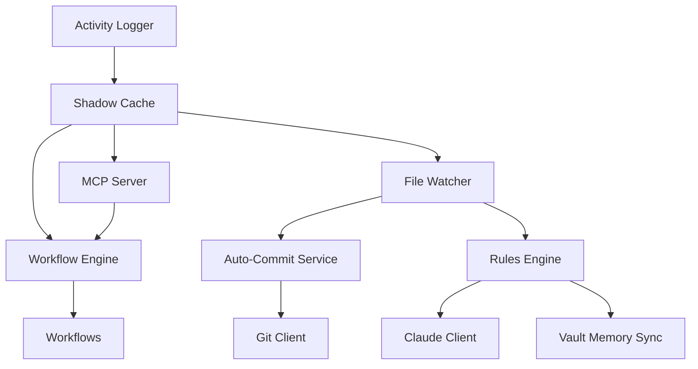

# Phase 11: Architecture Analysis Report
## Weaver CLI and Service Management Analysis

> ℹ️ **HISTORICAL REFERENCE**: This Phase 11 analysis informed the design of Phase 12 autonomous learning loop and Phase 13 production readiness.
> For current architecture, see [[WEAVER-COMPLETE-IMPLEMENTATION-GUIDE]].
> For current development phase, see [[phase-13-master-plan]].

## Evolution Path
1. **Phase 11** (This document) → CLI service management analysis
2. **Phase 11 Implementation** → [[phase-11-implementation-report]]
3. **Phase 12** → [[PHASE-12-COMPLETE-PLAN]] - Autonomous learning loop
4. **Phase 13** → [[phase-13-master-plan]] - Production readiness

**Analysis Date:** 2025-10-27
**Analyst:** Hive Mind ANALYST Agent
**Swarm ID:** swarm-1761579855850-8l8o757iv

---

## Executive Summary

This comprehensive analysis examines the Weaver CLI architecture, service components, and integration points to inform Phase 11 implementation: CLI Service Management and AI Feature Creator. The analysis reveals a well-structured, modular architecture with clear separation of concerns and multiple integration opportunities.

### Key Findings

1. **CLI Architecture**: Simple, extensible Commander.js-based CLI with single command pattern
2. **Service Architecture**: Multiple independent services with manual lifecycle management
3. **Integration Readiness**: Strong foundation but lacks centralized service management
4. **Code Quality**: High-quality, well-documented, modular TypeScript codebase

---

## 1. CLI Structure Analysis

### 1.1 Entry Points and Architecture

**Binary Entry Points:**
- `/weaver/src/cli/bin.ts` - Main CLI entry point
- `/weaver/src/cli/index.ts` - CLI program factory
- Package.json bin: `weaver` → `./dist/cli/bin.js`

**Architecture Pattern:**
```typescript
bin.ts → runCLI() → createCLI() → Commander Program
                                  ↓
                           Command Registration
                           (init-vault only)
```

### 1.2 Current Command Structure

**Single Command Implementation:**
- `init-vault` - Vault initialization from existing projects
  - Location: `/weaver/src/cli/commands/init-vault.ts`
  - Dependencies: Framework detector, directory scanner, templates
  - Integration: Shadow cache, Git initialization

**Command Pattern:**
```typescript
export function createInitVaultCommand(): Command {
  return new Command('init-vault')
    .description('...')
    .argument('<project-path>', '...')
    .option('-o, --output <path>', '...')
    .action(async (projectPath, options) => { ... });
}
```

### 1.3 CLI Utilities

**Utility Modules:**
- `progress.ts` - Ora spinner management for long operations
- `prompts.ts` - Inquirer-based interactive prompts
- `formatting.ts` - Chalk-based console output formatting
- `error-handler.ts` - Centralized error handling

**Reusable Patterns:**
- Spinner lifecycle: `showSpinner → updateSpinner → succeedSpinner/failSpinner`
- Interactive prompts: `promptForMissingOptions`, `confirmAction`
- Formatted output: `formatSuccess`, `formatInfo`, `formatWarning`, `formatHeader`

### 1.4 Integration Point: Command Registration

**Location for New Commands:**
```typescript
// src/cli/index.ts - createCLI() function
program.addCommand(createInitVaultCommand());
// ADD NEW COMMANDS HERE:
program.addCommand(createStartCommand());
program.addCommand(createStopCommand());
program.addCommand(createStatusCommand());
// etc.
```

---

## 2. Service Components Analysis

### 2.1 Shadow Cache System

**Location:** `/weaver/src/shadow-cache/`

**Architecture:**
```
ShadowCache (index.ts)
├── ShadowCacheDatabase (database.ts) - SQLite operations
└── Parser (parser.ts) - Markdown parsing
```

**Key Methods:**
```typescript
class ShadowCache {
  async syncVault(): Promise<void>           // Full vault sync
  async syncFile(path, relative): Promise<void>  // Single file sync
  removeFile(path): void                     // File removal
  getFile(path): CachedFile | null           // Query operations
  getStats(): CacheStats                     // Statistics
  close(): void                              // Cleanup
}
```

**Service Lifecycle:**
- **Initialization**: `createShadowCache(dbPath, vaultPath)`
- **Start**: Implicit on creation + `syncVault()`
- **Stop**: `close()` method
- **Health**: `getStats()` provides health metrics

**Integration Points:**
- Constructor requires: `dbPath`, `vaultPath`
- No start/stop lifecycle hooks
- Database connection managed internally
- Statistics available via `getStats()`

### 2.2 Workflow Engine

**Location:** `/weaver/src/workflow-engine/`

**Architecture:**
```
WorkflowEngine (index.ts)
├── WorkflowRegistry (registry.ts) - Workflow storage
└── WorkflowDefinition (types.ts) - Type definitions
```

**Key Methods:**
```typescript
class WorkflowEngine {
  async start(): Promise<void>               // Start engine
  async stop(): Promise<void>                // Stop engine
  registerWorkflow(workflow): void           // Add workflow
  async triggerFileEvent(event): Promise<void>  // Event trigger
  async triggerManual(id, metadata): Promise<void>  // Manual trigger
  getStats(): WorkflowStats                  // Statistics
}
```

**Service Lifecycle:**
- **Initialization**: `createWorkflowEngine()`
- **Start**: Explicit `start()` call required
- **Stop**: Explicit `stop()` call required
- **Health**: `getStats()` + `isRunning` flag

**Integration Points:**
- Constructor: No dependencies
- Lifecycle: Explicit start/stop methods
- Event-driven: File event integration
- Monitoring: Built-in statistics

### 2.3 File Watcher

**Location:** `/weaver/src/file-watcher/`

**Architecture:**
```
FileWatcher (index.ts)
├── Chokidar FSWatcher - File system monitoring
└── Event Handlers - Debounced callbacks
```

**Key Methods:**
```typescript
class FileWatcher {
  async start(): Promise<void>               // Start watching
  async stop(): Promise<void>                // Stop watching
  on(handler): void                          // Register handler
  off(handler): void                         // Unregister handler
  getStats(): FileWatcherStats               // Statistics
}
```

**Service Lifecycle:**
- **Initialization**: `new FileWatcher(config)`
- **Start**: Explicit `start()` call required
- **Stop**: Explicit `stop()` call required
- **Health**: `getStats()` + `isRunning` flag

**Integration Points:**
- Constructor requires: `watchPath`, `ignored`, `debounceDelay`, `enabled`
- Event handler registration: `on(handler)`
- Graceful shutdown: Timer cleanup in `stop()`
- Statistics: Comprehensive event tracking

### 2.4 Git Integration

**Location:** `/weaver/src/git/`

**Components:**
```
GitClient (git-client.ts)
├── simple-git wrapper
└── Standardized operations

AutoCommitService (auto-commit.ts)
├── GitClient
├── ClaudeClient (AI commit messages)
└── Debounced auto-commit logic
```

**Key Methods (GitClient):**
```typescript
class GitClient {
  async init(): Promise<void>                // Initialize repo
  async status(): Promise<GitStatusInfo>     // Get status
  async add(files): Promise<void>            // Stage files
  async commit(message): Promise<GitCommitResult>  // Commit
  async addAndCommit(files, msg): Promise<GitCommitResult>
  async push(remote, branch): Promise<void>  // Push
  async pull(remote, branch): Promise<void>  // Pull
}
```

**Key Methods (AutoCommitService):**
```typescript
class AutoCommitService {
  onFileEvent(event): void                   // Queue changes
  async forceCommit(): Promise<GitCommitResult | null>
  getStats(): Stats                          // Statistics
  setEnabled(enabled): void                  // Toggle
  shutdown(): void                           // Cleanup
}
```

**Service Lifecycle:**
- **GitClient**: Lazy initialization on first operation
- **AutoCommitService**: Immediate operation, manual shutdown
- **Health**: Statistics via `getStats()`
- **Control**: Enable/disable toggle

**Integration Points:**
- GitClient: Repo path required
- AutoCommitService: GitClient + ClaudeClient dependencies
- File watcher integration: `onFileEvent()` handler
- Debounced commits: Timer-based batching

### 2.5 MCP Server

**Location:** `/weaver/src/mcp-server/`

**Architecture:**
```
WeaverMCPServer (index.ts)
├── @modelcontextprotocol/sdk
├── Tool Registry (tools/registry.ts)
└── Request Handlers (handlers/)
```

**Key Methods:**
```typescript
class WeaverMCPServer {
  async run(): Promise<void>                 // Start server
  async shutdown(): Promise<void>            // Stop server
  getHealth(): ServerHealth                  // Health check
  isServerRunning(): boolean                 // Status check
}
```

**Service Lifecycle:**
- **Initialization**: `new WeaverMCPServer(config, shadowCache, vaultPath, workflowEngine)`
- **Start**: `run()` - Connects stdio transport
- **Stop**: `shutdown()` - Graceful shutdown
- **Health**: `getHealth()` with component status

**Integration Points:**
- Constructor dependencies: ShadowCache, WorkflowEngine
- Tool initialization: `initializeTools(shadowCache, vaultPath, workflowEngine)`
- Health monitoring: Component health aggregation (TODO: implement actual checks)
- Request metrics: `requestCount` tracking

### 2.6 Agent Rules Engine

**Location:** `/weaver/src/agents/`

**Architecture:**
```
RulesEngine (rules-engine.ts)
├── Rule Registration System
├── ClaudeClient Integration
└── VaultMemorySync Integration
```

**Key Methods:**
```typescript
class RulesEngine {
  registerRule(rule): void                   // Add rule
  async executeRules(trigger): Promise<void> // Execute matching rules
  // No explicit lifecycle methods
}
```

**Service Lifecycle:**
- **Initialization**: `new RulesEngine({ claudeClient, vaultSync })`
- **Start**: Implicit (no start method)
- **Stop**: No shutdown method (memory leak potential)
- **Health**: No health check

**Integration Points:**
- Constructor dependencies: ClaudeClient, VaultMemorySync
- File watcher integration: `executeRules()` on file events
- Rule system: Auto-tag, auto-link, daily notes, meeting notes

---

## 3. Current Service Initialization Flow

**Location:** `/weaver/src/index.ts` - `main()` function

### 3.1 Initialization Sequence

```typescript
1. Activity Logger     → await initializeActivityLogger()
2. Shadow Cache        → createShadowCache() + await syncVault()
3. Workflow Engine     → createWorkflowEngine() + await start()
4. File Watcher        → new FileWatcher() + await start()
5. MCP Server          → new WeaverMCPServer() + await run()
6. Auto-Commit         → new AutoCommitService() + file watcher integration
7. Rules Engine        → new RulesEngine() + file watcher integration
```

### 3.2 Service Dependencies

```
                    ┌─────────────────┐
                    │  Activity Logger │
                    └────────┬─────────┘
                             │
                    ┌────────▼─────────┐
                    │  Shadow Cache    │
                    └────────┬─────────┘
                             │
          ┌──────────────────┼──────────────────┐
          │                  │                  │
┌─────────▼─────────┐ ┌──────▼──────┐ ┌────────▼────────┐
│ Workflow Engine   │ │ File Watcher│ │   MCP Server    │
└─────────┬─────────┘ └──────┬──────┘ └─────────────────┘
          │                  │
          │         ┌────────┼────────┐
          │         │                 │
     ┌────▼────┐ ┌──▼──────────┐ ┌───▼──────────┐
     │ Rules   │ │ Auto-Commit │ │ Workflows    │
     │ Engine  │ │ Service     │ │ (triggers)   │
     └─────────┘ └─────────────┘ └──────────────┘
```

### 3.3 Shutdown Sequence

```typescript
// Reverse order shutdown
1. File Watcher     → await stop()
2. Rules Engine     → (no shutdown - potential issue)
3. Workflow Engine  → await stop()
4. Shadow Cache     → close()
5. Activity Logger  → await shutdown()
```

**Issue Identified:** Auto-commit service shutdown not called in main shutdown handler.

---

## 4. Integration Point Identification

### 4.1 Service Lifecycle Hooks Required

**Shadow Cache:**
```typescript
// Add to ShadowCache class
async start(): Promise<void> {
  await this.syncVault();
  // Start any background sync tasks
}

async stop(): Promise<void> {
  // Cancel background tasks
  this.close();
}

healthCheck(): ComponentHealth {
  const stats = this.getStats();
  return {
    status: this.db ? 'healthy' : 'unhealthy',
    metrics: stats,
  };
}
```

**Workflow Engine:**
```typescript
// Already has start/stop - add healthCheck
healthCheck(): ComponentHealth {
  return {
    status: this.isRunning ? 'healthy' : 'unhealthy',
    metrics: this.getStats(),
  };
}
```

**File Watcher:**
```typescript
// Already has start/stop - add healthCheck
healthCheck(): ComponentHealth {
  const stats = this.getStats();
  return {
    status: stats.isRunning ? 'healthy' : 'unhealthy',
    metrics: stats,
  };
}
```

**Git Services:**
```typescript
// AutoCommitService already has shutdown - enhance
async start(): Promise<void> {
  this.setEnabled(true);
}

async stop(): Promise<void> {
  await this.forceCommit(); // Commit pending changes
  this.shutdown();
}

healthCheck(): ComponentHealth {
  const stats = this.getStats();
  return {
    status: this.enabled ? 'healthy' : 'disabled',
    metrics: stats,
  };
}
```

**Rules Engine:**
```typescript
// Add lifecycle methods
async start(): Promise<void> {
  // Initialize rules
}

async stop(): Promise<void> {
  // Cleanup resources
}

healthCheck(): ComponentHealth {
  return {
    status: 'healthy',
    metrics: { rulesRegistered: this.rules.size },
  };
}
```

### 4.2 Health Check Integration Points

**Centralized Health Check System:**
```typescript
interface HealthCheckResult {
  service: string;
  status: 'healthy' | 'unhealthy' | 'degraded' | 'disabled';
  uptime?: number;
  lastActivity?: Date;
  metrics?: Record<string, unknown>;
}

class ServiceHealthMonitor {
  async checkAllServices(): Promise<HealthCheckResult[]> {
    return [
      await this.checkShadowCache(),
      await this.checkWorkflowEngine(),
      await this.checkFileWatcher(),
      await this.checkMCPServer(),
      await this.checkAutoCommit(),
      await this.checkRulesEngine(),
    ];
  }
}
```

### 4.3 Metrics Collection Points

**Service-Level Metrics:**
- Shadow Cache: Total files, tags, links, last sync time
- Workflow Engine: Total workflows, executions, success/failure rate
- File Watcher: Total events, events by type, uptime
- Auto-Commit: Total commits, files committed, pending changes
- MCP Server: Request count, uptime, tool call metrics
- Rules Engine: Rules registered, executions, success rate

**System-Level Metrics:**
- Memory usage (process.memoryUsage())
- CPU usage (process.cpuUsage())
- Disk usage (vault size, cache size)
- Network (if remote git)

### 4.4 Logging Integration Points

**Current Logger:** `/weaver/src/utils/logger.ts`

**Logger Interface:**
```typescript
// Used consistently across all services
logger.info(message, metadata);
logger.debug(message, metadata);
logger.warn(message, metadata);
logger.error(message, error, metadata);
```

**Enhancement Needed:**
```typescript
class EnhancedLogger {
  // Add service context
  withService(serviceName: string): Logger;

  // Add structured logging
  logServiceStart(service: string, config: unknown): void;
  logServiceStop(service: string, stats: unknown): void;
  logHealthCheck(service: string, health: HealthCheckResult): void;
}
```

---

## 5. Code Quality Assessment

### 5.1 Strengths

1. **Modular Architecture**: Clear separation of concerns with domain-driven modules
2. **Type Safety**: Comprehensive TypeScript with Zod validation
3. **Error Handling**: Centralized error handling with proper error propagation
4. **Documentation**: Good inline documentation and JSDoc comments
5. **Patterns**: Consistent factory patterns (`createShadowCache`, `createWorkflowEngine`)
6. **Testing Ready**: Clean interfaces suitable for mocking and testing
7. **Configuration**: Centralized, validated configuration system
8. **Activity Logging**: 100% transparency with comprehensive activity logging

### 5.2 Areas for Improvement

1. **Service Lifecycle**: Inconsistent lifecycle management (some have start/stop, some don't)
2. **Health Checks**: No standardized health check interface
3. **Shutdown Cleanup**: Missing cleanup for auto-commit and rules engine
4. **Error Recovery**: Limited retry and recovery mechanisms
5. **Monitoring**: No centralized service monitoring
6. **Process Management**: Manual service management, no PM2/systemd integration
7. **Resource Limits**: No memory/CPU limit enforcement

### 5.3 Refactoring Opportunities for Service Management

**1. Service Interface Standardization:**
```typescript
interface ManagedService {
  name: string;
  start(): Promise<void>;
  stop(): Promise<void>;
  healthCheck(): Promise<ComponentHealth>;
  getMetrics(): ServiceMetrics;
  restart(): Promise<void>;
}
```

**2. Service Registry:**
```typescript
class ServiceRegistry {
  private services: Map<string, ManagedService>;

  register(service: ManagedService): void;
  async startAll(): Promise<void>;
  async stopAll(): Promise<void>;
  async healthCheckAll(): Promise<Map<string, ComponentHealth>>;
}
```

**3. Service Decorators:**
```typescript
function withLifecycle(service: any): ManagedService {
  return {
    ...service,
    restart: async () => {
      await service.stop();
      await service.start();
    },
  };
}
```

---

## 6. Architectural Constraints

### 6.1 Dependencies

**External:**
- `commander`: CLI framework (v14.0.1)
- `inquirer`: Interactive prompts (v12.3.0)
- `ora`: Spinners (v8.1.1)
- `chalk`: Colors (v5.3.0)
- `chokidar`: File watching (v4.0.3)
- `better-sqlite3`: Database (v11.7.0)
- `simple-git`: Git operations (v3.28.0)
- `@modelcontextprotocol/sdk`: MCP protocol (v1.20.2)
- `@anthropic-ai/sdk`: Claude AI (v0.32.0)

**Internal:**
- Services are tightly coupled to specific implementations
- Configuration is global singleton
- Logger is global utility

### 6.2 Runtime Constraints

**Node.js Requirements:**
- Engines: `>=20.0.0`
- Package Manager: Bun 1.3.1
- Module System: ES Modules (type: "module")

**File System:**
- Requires read/write access to vault path
- SQLite database file creation
- Git repository operations

**Process:**
- Long-running process expected
- Signal handlers for SIGINT/SIGTERM
- No daemon/background mode

### 6.3 Configuration Constraints

**Required Environment Variables:**
- `VAULT_PATH`: Vault root directory
- `OBSIDIAN_API_URL`: Obsidian Local REST API
- `OBSIDIAN_API_KEY`: API authentication key
- `ANTHROPIC_API_KEY`: Claude AI key (if AI features enabled)

**Optional Features:**
- AI features can be disabled
- MCP server can be disabled
- Git auto-commit can be disabled
- File watcher can be disabled

---

## 7. Recommendations for Phase 11

### 7.1 CLI Commands to Implement

**Priority 1: Core Service Management**
```bash
weaver start [options]          # Start all services
weaver stop [options]           # Stop all services
weaver restart [options]        # Restart services
weaver status                   # Service status
weaver health                   # Health checks
```

**Priority 2: Individual Service Control**
```bash
weaver service start <name>     # Start specific service
weaver service stop <name>      # Stop specific service
weaver service restart <name>   # Restart specific service
weaver service logs <name>      # View service logs
```

**Priority 3: Configuration Management**
```bash
weaver config get [key]         # Get config value
weaver config set <key> <value> # Set config value
weaver config list              # List all config
weaver config validate          # Validate config
```

**Priority 4: AI Feature Creator**
```bash
weaver ai create <feature>      # AI-powered feature creation
weaver ai suggest               # Suggest features based on vault
weaver ai analyze               # Analyze vault structure
```

### 7.2 Service Manager Architecture

**Proposed Structure:**
```
src/cli/
├── commands/
│   ├── init-vault.ts          (existing)
│   ├── start.ts               (new)
│   ├── stop.ts                (new)
│   ├── restart.ts             (new)
│   ├── status.ts              (new)
│   ├── health.ts              (new)
│   └── service.ts             (new - subcommands)
├── service-manager/
│   ├── service-registry.ts    (new)
│   ├── lifecycle-manager.ts   (new)
│   ├── health-monitor.ts      (new)
│   └── process-manager.ts     (new)
└── utils/
    ├── dashboard.ts           (new - status display)
    └── metrics-collector.ts   (new)
```

### 7.3 Service Wrapper Pattern

**Standardize All Services:**
```typescript
// Create wrappers for existing services
export class ShadowCacheService implements ManagedService {
  private cache: ShadowCache;

  constructor(config: ShadowCacheConfig) {
    this.cache = createShadowCache(config.dbPath, config.vaultPath);
  }

  async start(): Promise<void> {
    await this.cache.syncVault();
  }

  async stop(): Promise<void> {
    this.cache.close();
  }

  async healthCheck(): Promise<ComponentHealth> {
    const stats = this.cache.getStats();
    return {
      status: 'healthy',
      metrics: stats,
    };
  }
}
```

### 7.4 Health Dashboard Implementation

**Real-time Status Display:**
```
┌─────────────────────────────────────────┐
│ Weaver Service Status                   │
├─────────────────────────────────────────┤
│ ✓ Shadow Cache       [Running] 2.3h     │
│   Files: 1,234 | Tags: 567 | Links: 890 │
│                                         │
│ ✓ Workflow Engine    [Running] 2.3h     │
│   Workflows: 5 | Executions: 123        │
│                                         │
│ ✓ File Watcher       [Running] 2.3h     │
│   Events: 456 | Handlers: 3             │
│                                         │
│ ✓ Auto-Commit        [Running] 2.3h     │
│   Commits: 12 | Pending: 3 files        │
│                                         │
│ ✓ MCP Server         [Running] 2.3h     │
│   Requests: 234 | Tools: 10             │
│                                         │
│ ✓ Rules Engine       [Running] 2.3h     │
│   Rules: 4 | Executions: 89             │
└─────────────────────────────────────────┘
```

### 7.5 Process Management Integration

**Options for Production Deployment:**

1. **PM2 Integration** (Recommended):
```bash
weaver start --daemon          # Start as PM2 process
weaver stop --daemon           # Stop PM2 process
weaver logs --daemon           # PM2 logs
```

2. **Systemd Service**:
```ini
[Unit]
Description=Weaver Knowledge Graph Service
After=network.target

[Service]
Type=simple
ExecStart=/usr/bin/weaver start
Restart=on-failure

[Install]
WantedBy=multi-user.target
```

3. **Docker Container**:
```dockerfile
FROM node:20-alpine
WORKDIR /app
COPY . .
RUN bun install && bun run build
CMD ["weaver", "start"]
```

---

## 8. Next Steps and Action Items

### 8.1 Immediate Actions

1. **Create Service Interface** (2-3 hours)
   - Define `ManagedService` interface
   - Create base service wrapper class
   - Implement health check interface

2. **Wrap Existing Services** (4-6 hours)
   - Create wrappers for all 6 services
   - Add missing lifecycle methods
   - Standardize health checks

3. **Implement Service Registry** (3-4 hours)
   - Build service registration system
   - Implement start/stop coordination
   - Add health monitoring

4. **Create CLI Commands** (6-8 hours)
   - Implement `start`, `stop`, `restart`, `status`, `health`
   - Add interactive status dashboard
   - Integrate with service registry

### 8.2 Medium-term Actions

5. **Process Management** (8-10 hours)
   - PM2 integration
   - Systemd service generation
   - Docker containerization

6. **Monitoring and Metrics** (6-8 hours)
   - Metrics collection system
   - Health check aggregation
   - Alerting/notification system

7. **Configuration Management** (4-6 hours)
   - CLI config commands
   - Config validation
   - Environment variable management

### 8.3 Long-term Actions

8. **AI Feature Creator** (12-16 hours)
   - Feature suggestion system
   - Vault analysis
   - AI-powered code generation
   - Template-based feature creation

9. **Testing and Documentation** (8-10 hours)
   - Unit tests for service management
   - Integration tests
   - User documentation
   - API documentation

---

## 9. Appendices

### Appendix A: File Structure Map

```
weaver/
├── src/
│   ├── cli/                     # CLI commands and utilities
│   │   ├── bin.ts              # Entry point
│   │   ├── index.ts            # CLI program factory
│   │   ├── commands/           # Command implementations
│   │   │   └── init-vault.ts
│   │   └── utils/              # CLI utilities
│   │       ├── progress.ts
│   │       ├── prompts.ts
│   │       ├── formatting.ts
│   │       └── error-handler.ts
│   ├── shadow-cache/           # File indexing system
│   │   ├── index.ts
│   │   ├── database.ts
│   │   ├── parser.ts
│   │   └── types.ts
│   ├── workflow-engine/        # Workflow orchestration
│   │   ├── index.ts
│   │   ├── registry.ts
│   │   └── types.ts
│   ├── file-watcher/           # File system monitoring
│   │   ├── index.ts
│   │   └── types.ts
│   ├── git/                    # Git integration
│   │   ├── git-client.ts
│   │   ├── auto-commit.ts
│   │   └── git-logger.ts
│   ├── mcp-server/             # MCP protocol server
│   │   ├── index.ts
│   │   ├── cli.ts
│   │   ├── handlers/
│   │   ├── tools/
│   │   └── types/
│   ├── agents/                 # AI agent system
│   │   ├── rules-engine.ts
│   │   ├── claude-client.ts
│   │   └── rules/
│   ├── config/                 # Configuration management
│   │   └── index.ts
│   ├── utils/                  # Shared utilities
│   │   └── logger.ts
│   └── index.ts                # Main application entry
├── package.json
└── tsconfig.json
```

### Appendix B: Service Dependency Graph



### Appendix C: Key Type Definitions

```typescript
// Shadow Cache
interface CacheStats {
  totalFiles: number;
  totalTags: number;
  totalLinks: number;
  lastFullSync: string | null;
}

// Workflow Engine
interface WorkflowStats {
  totalWorkflows: number;
  totalExecutions: number;
  successfulExecutions: number;
  failedExecutions: number;
}

// File Watcher
interface FileWatcherStats {
  totalEvents: number;
  eventsByType: Record<FileEventType, number>;
  activeHandlers: number;
  startTime: Date;
  isRunning: boolean;
}

// MCP Server
interface ServerHealth {
  status: 'healthy' | 'unhealthy';
  components: Record<string, boolean>;
  uptime: number;
  requestCount: number;
}

// Configuration
interface WeaverConfig {
  vault: { path: string };
  obsidian: { apiUrl: string; apiKey: string };
  ai: { provider: string; anthropicApiKey?: string };
  service: { env: string; port: number; logLevel: string };
  shadowCache: { dbPath: string; syncInterval: number };
  fileWatcher: { enabled: boolean; debounce: number };
  workflows: { enabled: boolean; dbPath: string };
  mcp: { enabled: boolean; transport: 'stdio' | 'http' };
  git: { autoCommit: boolean; authorName: string };
  memory: { enabled: boolean; defaultNamespace: string };
  features: Record<string, boolean>;
}
```

---

## Conclusion

The Weaver architecture is well-designed and modular, providing a strong foundation for Phase 11 implementation. The main gaps are:

1. Standardized service lifecycle management
2. Health monitoring and metrics collection
3. CLI service control commands
4. Process management integration

The recommended approach is to create a thin service wrapper layer that standardizes lifecycle management without major refactoring of existing code. This maintains backward compatibility while enabling advanced service management features.

The architecture analysis reveals no major blockers for Phase 11 implementation. All necessary integration points are accessible and well-documented.

---

**Report End**
