# Phase 11: CLI Service Management & AI Feature Creator - System Architecture Design

**Document Version**: 1.0.0
**Author**: System Architect Agent (Hive Mind Swarm)
**Date**: 2025-10-27
**Status**: Draft - Awaiting Consensus

---

## Table of Contents

1. [Executive Summary](#1-executive-summary)
2. [System Architecture Overview](#2-system-architecture-overview)
3. [Component Architecture](#3-component-architecture)
4. [Service Lifecycle Management](#4-service-lifecycle-management)
5. [Health Check System](#5-health-check-system)
6. [Logging & Metrics Architecture](#6-logging--metrics-architecture)
7. [CLI Command Architecture](#7-cli-command-architecture)
8. [Process Management Strategy](#8-process-management-strategy)
9. [Technology Decisions](#9-technology-decisions)
10. [Integration Strategy](#10-integration-strategy)
11. [Data Flow Diagrams](#11-data-flow-diagrams)
12. [Security Architecture](#12-security-architecture)
13. [Scalability & Performance](#13-scalability--performance)
14. [Architecture Decision Records](#14-architecture-decision-records)

---


## Related

[[phase-11-research-findings]]
## 1. Executive Summary

Phase 11 introduces a production-grade service management layer to the Weaver framework, transforming it from a development tool into a comprehensive platform capable of managing complex service ecosystems. The architecture prioritizes reliability, observability, and developer experience.

### 1.1 Key Architectural Principles

1. **Separation of Concerns**: CLI, service management, health checks, and metrics are independent modules
2. **Event-Driven Architecture**: Services communicate via events for loose coupling
3. **Fail-Safe Design**: Graceful degradation and automatic recovery mechanisms
4. **Observability-First**: Comprehensive logging, metrics, and tracing built-in
5. **Developer Experience**: Intuitive CLI with progressive disclosure of complexity
6. **Production-Ready**: 24/7 operation support with zero-downtime deployments

### 1.2 Quality Attributes

| Attribute | Target | Measurement |
|-----------|--------|-------------|
| **Availability** | 99.9% uptime | Max 8.76h downtime/year |
| **Performance** | <100ms CLI response | P95 command execution time |
| **Scalability** | 100+ services | Concurrent service management |
| **Reliability** | <0.1% crash rate | Automatic recovery within 5s |
| **Observability** | 100% metric coverage | All services monitored |
| **Security** | Zero credential leaks | Encrypted config, secure IPC |

---

## 2. System Architecture Overview

### 2.1 High-Level Architecture (C4 Context Diagram)

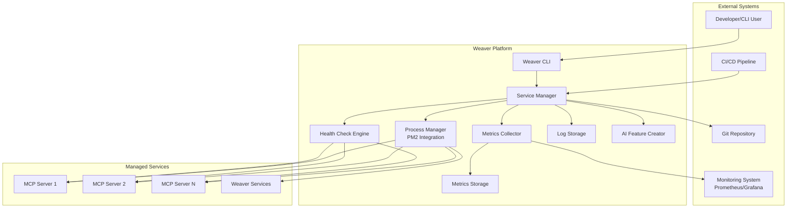

### 2.2 Container Architecture (C4 Container Diagram)

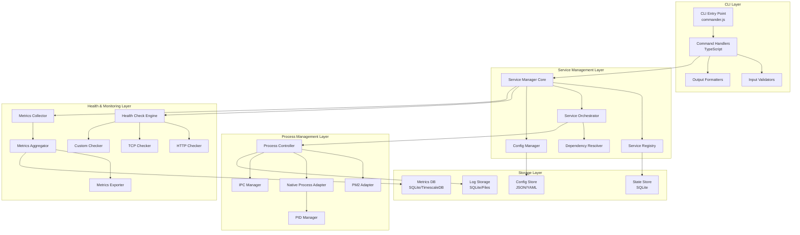

---

## 3. Component Architecture

### 3.1 Service Manager Core

**Responsibility**: Central orchestration of all service management operations

```typescript
/**
 * Service Manager Core - Central orchestration engine
 */
interface IServiceManager {
  // Service lifecycle
  startService(name: string, options: StartOptions): Promise<ServiceInstance>;
  stopService(name: string, options: StopOptions): Promise<void>;
  restartService(name: string, options: RestartOptions): Promise<ServiceInstance>;

  // Service queries
  getServiceStatus(name: string): Promise<ServiceStatus>;
  listServices(filter?: ServiceFilter): Promise<ServiceInfo[]>;

  // Service discovery
  discoverServices(): Promise<DiscoveredService[]>;
  registerService(config: ServiceConfig): Promise<void>;
  unregisterService(name: string): Promise<void>;

  // Event management
  on(event: ServiceEvent, handler: EventHandler): void;
  off(event: ServiceEvent, handler: EventHandler): void;
  emit(event: ServiceEvent, data: any): void;
}

/**
 * Service lifecycle states
 */
enum ServiceState {
  STOPPED = 'stopped',
  STARTING = 'starting',
  RUNNING = 'running',
  STOPPING = 'stopping',
  CRASHED = 'crashed',
  DEGRADED = 'degraded',
  UNKNOWN = 'unknown'
}

/**
 * Service configuration schema
 */
interface ServiceConfig {
  // Identity
  name: string;
  displayName?: string;
  description?: string;
  version?: string;

  // Execution
  command: string;
  args?: string[];
  cwd?: string;
  env?: Record<string, string>;

  // Process management
  interpreter?: string;           // node, python, bun, etc.
  instances?: number;             // PM2 cluster mode
  execMode?: 'fork' | 'cluster';

  // Resource limits
  maxMemory?: string;             // '512M', '2G'
  maxCpu?: number;                // CPU percentage
  maxRestarts?: number;           // Auto-restart limit

  // Health checks
  healthCheck?: HealthCheckConfig;

  // Dependencies
  dependsOn?: string[];           // Service dependencies
  startTimeout?: number;          // Startup timeout (ms)
  stopTimeout?: number;           // Shutdown timeout (ms)

  // Logging
  logLevel?: LogLevel;
  logFile?: string;
  errorFile?: string;
  logRotation?: LogRotationConfig;

  // Monitoring
  metrics?: MetricsConfig;
  alerts?: AlertConfig[];
}

/**
 * Service instance runtime information
 */
interface ServiceInstance {
  // Identity
  id: string;
  name: string;
  pid: number;

  // State
  state: ServiceState;
  uptime: number;
  restartCount: number;

  // Resources
  cpu: number;
  memory: number;

  // Metadata
  startedAt: Date;
  stoppedAt?: Date;
  lastRestart?: Date;

  // Health
  healthStatus: HealthStatus;
  lastHealthCheck?: Date;
}
```

**Architecture Decision**: Service Manager uses **Event-Driven Architecture** to decouple service lifecycle events from handlers, enabling extensibility and plugin-based architecture.

### 3.2 Service Registry

**Responsibility**: Maintain service catalog and state

```typescript
/**
 * Service Registry - Service catalog and state management
 */
interface IServiceRegistry {
  // CRUD operations
  register(config: ServiceConfig): Promise<void>;
  unregister(name: string): Promise<void>;
  update(name: string, config: Partial<ServiceConfig>): Promise<void>;

  // Query operations
  get(name: string): Promise<ServiceConfig | null>;
  list(filter?: ServiceFilter): Promise<ServiceConfig[]>;
  exists(name: string): Promise<boolean>;

  // State management
  setState(name: string, state: ServiceState): Promise<void>;
  getState(name: string): Promise<ServiceState>;

  // Dependency graph
  getDependencies(name: string): Promise<string[]>;
  getDependents(name: string): Promise<string[]>;
  getStartOrder(): Promise<string[]>;
}

/**
 * Registry storage schema (SQLite)
 */
interface ServiceRegistrySchema {
  services: {
    id: string;              // UUID
    name: string;            // Unique service name
    config: string;          // JSON serialized config
    state: ServiceState;
    created_at: Date;
    updated_at: Date;
  };

  dependencies: {
    service_id: string;      // Foreign key to services.id
    depends_on: string;      // Foreign key to services.id
    created_at: Date;
  };

  state_history: {
    id: string;
    service_id: string;
    from_state: ServiceState;
    to_state: ServiceState;
    reason?: string;
    timestamp: Date;
  };
}
```

**Storage Decision**: SQLite for service registry provides ACID transactions, zero-dependency deployment, and sufficient performance for <10,000 services.

### 3.3 Dependency Resolver

**Responsibility**: Manage service dependencies and start/stop ordering

```typescript
/**
 * Dependency Resolver - Topological sort and dependency validation
 */
interface IDependencyResolver {
  // Dependency analysis
  buildDependencyGraph(): Promise<DependencyGraph>;
  getStartupOrder(services: string[]): Promise<string[]>;
  getShutdownOrder(services: string[]): Promise<string[]>;

  // Validation
  validateDependencies(config: ServiceConfig): Promise<ValidationResult>;
  detectCircularDependencies(): Promise<CircularDependency[]>;

  // Resolution
  resolveDependencies(name: string): Promise<string[]>;
  checkDependencyHealth(name: string): Promise<boolean>;
}

/**
 * Dependency graph structure
 */
interface DependencyGraph {
  nodes: Map<string, ServiceNode>;
  edges: Map<string, string[]>;

  // Graph operations
  addNode(name: string, config: ServiceConfig): void;
  removeNode(name: string): void;
  addEdge(from: string, to: string): void;
  removeEdge(from: string, to: string): void;

  // Traversal
  topologicalSort(): string[];
  findCycles(): string[][];
  findRoots(): string[];
  findLeaves(): string[];
}
```

**Algorithm**: Use **Kahn's algorithm** for topological sort (O(V+E) complexity) to determine service start order. Detect cycles using **DFS** with color marking.

---

## 4. Service Lifecycle Management

### 4.1 Lifecycle State Machine

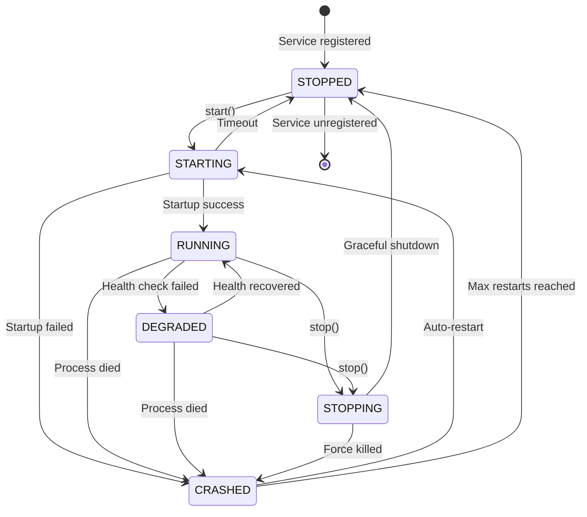

### 4.2 Lifecycle Event Flow

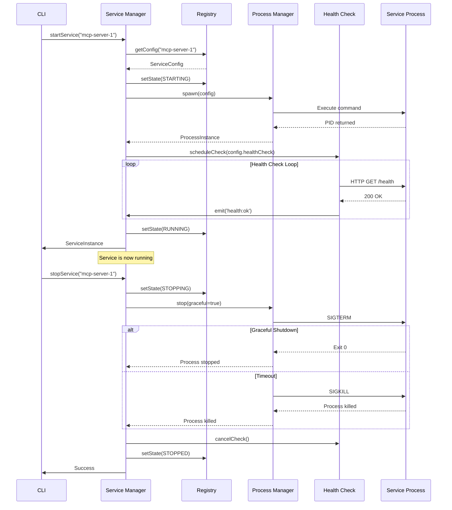

### 4.3 Auto-Restart Logic

```typescript
/**
 * Auto-restart strategy with exponential backoff
 */
class AutoRestartManager {
  private restartCounts = new Map<string, number>();
  private restartTimestamps = new Map<string, Date[]>();

  async handleCrash(service: string, config: ServiceConfig): Promise<void> {
    const count = this.restartCounts.get(service) || 0;
    const maxRestarts = config.maxRestarts || 10;

    // Check restart limit
    if (count >= maxRestarts) {
      logger.error(`Service ${service} exceeded max restarts (${maxRestarts})`);
      await this.serviceManager.setState(service, ServiceState.STOPPED);
      await this.alertManager.send({
        level: 'critical',
        message: `Service ${service} has crashed permanently`,
        service,
        restartCount: count
      });
      return;
    }

    // Calculate backoff delay (exponential with jitter)
    const baseDelay = 1000; // 1 second
    const maxDelay = 60000; // 1 minute
    const exponentialDelay = Math.min(baseDelay * Math.pow(2, count), maxDelay);
    const jitter = Math.random() * 1000;
    const delay = exponentialDelay + jitter;

    logger.warn(`Service ${service} crashed. Restarting in ${delay}ms (attempt ${count + 1}/${maxRestarts})`);

    // Schedule restart
    await new Promise(resolve => setTimeout(resolve, delay));

    try {
      await this.serviceManager.startService(service, config);

      // Reset counter if service stays up for 5 minutes
      setTimeout(() => {
        if (this.serviceManager.getState(service) === ServiceState.RUNNING) {
          this.restartCounts.set(service, 0);
          this.restartTimestamps.set(service, []);
        }
      }, 5 * 60 * 1000);

    } catch (error) {
      this.restartCounts.set(service, count + 1);
      await this.handleCrash(service, config);
    }
  }
}
```

---

## 5. Health Check System

### 5.1 Health Check Architecture

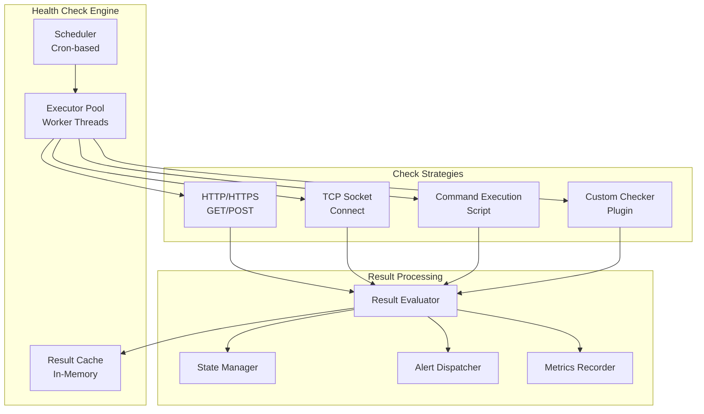

### 5.2 Health Check Configuration

```typescript
/**
 * Health check configuration options
 */
interface HealthCheckConfig {
  // Check type
  type: 'http' | 'tcp' | 'command' | 'custom';

  // Schedule
  interval: number;              // Check interval (ms)
  timeout: number;               // Check timeout (ms)
  retries?: number;              // Retry attempts before marking unhealthy

  // HTTP-specific
  http?: {
    url: string;
    method?: 'GET' | 'POST' | 'HEAD';
    headers?: Record<string, string>;
    body?: string;
    expectedStatus?: number[];   // e.g., [200, 201, 204]
    expectedBody?: string | RegExp;
  };

  // TCP-specific
  tcp?: {
    host: string;
    port: number;
  };

  // Command-specific
  command?: {
    cmd: string;
    args?: string[];
    expectedExitCode?: number;
    expectedOutput?: string | RegExp;
  };

  // Custom checker
  custom?: {
    module: string;              // Path to custom checker module
    options?: Record<string, any>;
  };

  // Degradation detection
  degradationThreshold?: {
    consecutiveFailures: number; // Failures before marking degraded
    failureRate: number;         // Failure rate percentage (0-100)
    timeWindow: number;          // Time window for rate calculation (ms)
  };
}

/**
 * Health check result
 */
interface HealthCheckResult {
  service: string;
  timestamp: Date;
  status: 'healthy' | 'degraded' | 'unhealthy';
  responseTime: number;

  // Details
  checkType: string;
  passed: boolean;
  error?: Error;
  metadata?: Record<string, any>;

  // History
  consecutiveFailures: number;
  consecutiveSuccesses: number;
}
```

### 5.3 Health Check Executor

```typescript
/**
 * Health Check Executor - Performs actual health checks
 */
class HealthCheckExecutor {
  private workerPool: WorkerPool;

  async execute(config: HealthCheckConfig): Promise<HealthCheckResult> {
    const startTime = Date.now();

    try {
      // Execute check with timeout
      const checkPromise = this.performCheck(config);
      const timeoutPromise = this.createTimeout(config.timeout);

      const result = await Promise.race([checkPromise, timeoutPromise]);

      return {
        service: config.service,
        timestamp: new Date(),
        status: 'healthy',
        responseTime: Date.now() - startTime,
        checkType: config.type,
        passed: true,
        metadata: result,
        consecutiveFailures: 0,
        consecutiveSuccesses: this.getConsecutiveSuccesses(config.service) + 1
      };

    } catch (error) {
      return {
        service: config.service,
        timestamp: new Date(),
        status: this.determineStatus(config, error),
        responseTime: Date.now() - startTime,
        checkType: config.type,
        passed: false,
        error: error as Error,
        consecutiveFailures: this.getConsecutiveFailures(config.service) + 1,
        consecutiveSuccesses: 0
      };
    }
  }

  private async performCheck(config: HealthCheckConfig): Promise<any> {
    switch (config.type) {
      case 'http':
        return this.httpCheck(config.http!);
      case 'tcp':
        return this.tcpCheck(config.tcp!);
      case 'command':
        return this.commandCheck(config.command!);
      case 'custom':
        return this.customCheck(config.custom!);
      default:
        throw new Error(`Unknown health check type: ${config.type}`);
    }
  }

  private async httpCheck(config: HttpCheckConfig): Promise<any> {
    const response = await fetch(config.url, {
      method: config.method || 'GET',
      headers: config.headers,
      body: config.body,
      signal: AbortSignal.timeout(this.timeout)
    });

    // Validate status code
    if (config.expectedStatus && !config.expectedStatus.includes(response.status)) {
      throw new Error(`Unexpected status: ${response.status}`);
    }

    // Validate response body
    if (config.expectedBody) {
      const body = await response.text();
      const pattern = typeof config.expectedBody === 'string'
        ? new RegExp(config.expectedBody)
        : config.expectedBody;

      if (!pattern.test(body)) {
        throw new Error('Response body does not match expected pattern');
      }
    }

    return { status: response.status };
  }
}
```

---

## 6. Logging & Metrics Architecture

### 6.1 Logging System

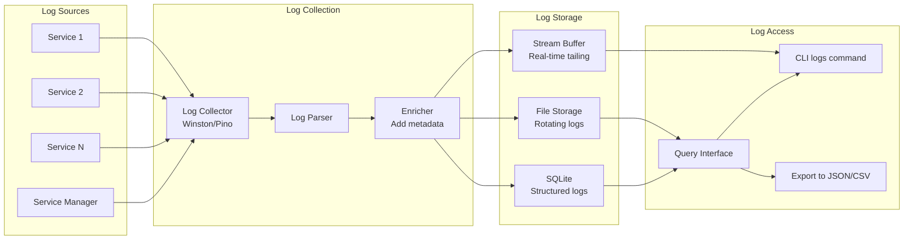

**Technology Decision**: Use **Pino** for logging (3x faster than Winston, structured JSON output, automatic log rotation).

### 6.2 Log Schema

```typescript
/**
 * Structured log entry schema
 */
interface LogEntry {
  // Standard fields
  timestamp: Date;
  level: 'trace' | 'debug' | 'info' | 'warn' | 'error' | 'fatal';
  message: string;

  // Service context
  service: string;
  serviceVersion?: string;
  instance?: string;           // For clustered services
  pid: number;

  // Request context (if applicable)
  requestId?: string;
  userId?: string;

  // Error context
  error?: {
    name: string;
    message: string;
    stack: string;
    code?: string;
  };

  // Custom metadata
  metadata?: Record<string, any>;

  // Performance
  duration?: number;           // For request/operation logs

  // Correlation
  traceId?: string;            // Distributed tracing
  spanId?: string;
}

/**
 * Log rotation configuration
 */
interface LogRotationConfig {
  maxSize: string;             // '10M', '100M', '1G'
  maxFiles: number;            // Number of rotated files to keep
  compress: boolean;           // Gzip compress rotated files
  interval?: string;           // '1d', '1w', '1M' for time-based rotation
}
```

### 6.3 Metrics System

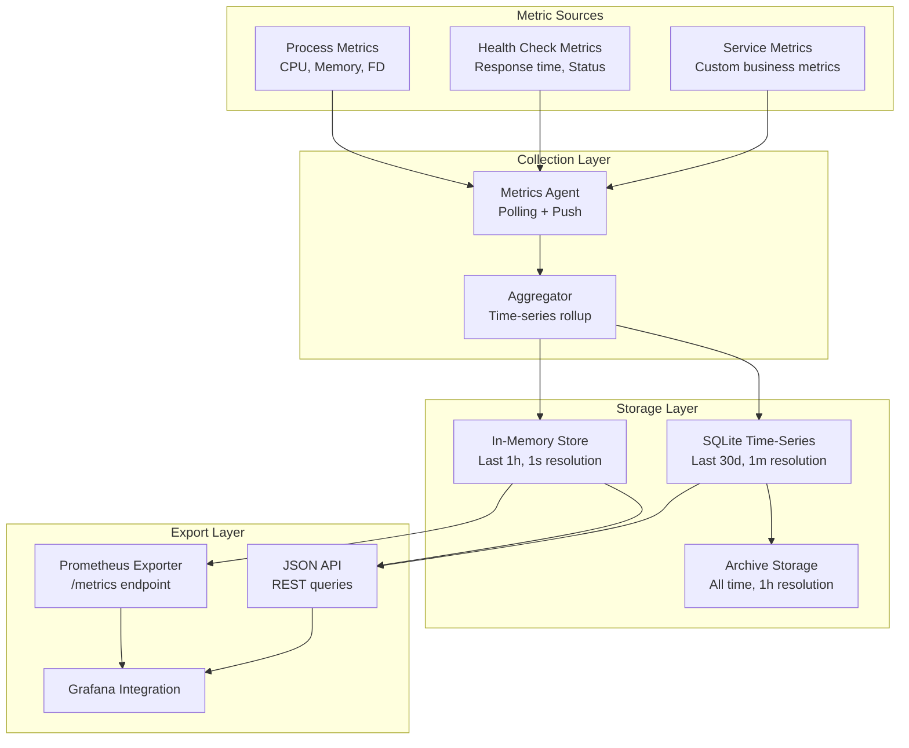

### 6.4 Metrics Schema

```typescript
/**
 * Metric types
 */
type MetricType = 'counter' | 'gauge' | 'histogram' | 'summary';

/**
 * Metric definition
 */
interface Metric {
  name: string;
  type: MetricType;
  help: string;
  labels?: string[];
}

/**
 * Standard service metrics
 */
const STANDARD_METRICS: Metric[] = [
  {
    name: 'service_up',
    type: 'gauge',
    help: 'Service is running (1) or down (0)',
    labels: ['service', 'version']
  },
  {
    name: 'service_uptime_seconds',
    type: 'gauge',
    help: 'Service uptime in seconds',
    labels: ['service']
  },
  {
    name: 'service_restarts_total',
    type: 'counter',
    help: 'Total number of service restarts',
    labels: ['service', 'reason']
  },
  {
    name: 'service_cpu_usage_percent',
    type: 'gauge',
    help: 'CPU usage percentage',
    labels: ['service', 'pid']
  },
  {
    name: 'service_memory_bytes',
    type: 'gauge',
    help: 'Memory usage in bytes',
    labels: ['service', 'pid', 'type']  // type: rss, heap, external
  },
  {
    name: 'service_file_descriptors',
    type: 'gauge',
    help: 'Number of open file descriptors',
    labels: ['service', 'pid']
  },
  {
    name: 'service_health_check_duration_seconds',
    type: 'histogram',
    help: 'Health check response time',
    labels: ['service', 'check_type', 'status']
  },
  {
    name: 'service_health_check_failures_total',
    type: 'counter',
    help: 'Total health check failures',
    labels: ['service', 'check_type', 'reason']
  }
];

/**
 * Metrics collector interface
 */
interface IMetricsCollector {
  // Metric registration
  registerMetric(metric: Metric): void;
  unregisterMetric(name: string): void;

  // Metric recording
  increment(name: string, labels?: Record<string, string>, value?: number): void;
  decrement(name: string, labels?: Record<string, string>, value?: number): void;
  set(name: string, value: number, labels?: Record<string, string>): void;
  observe(name: string, value: number, labels?: Record<string, string>): void;

  // Metric queries
  get(name: string, labels?: Record<string, string>): Promise<MetricValue>;
  query(query: MetricQuery): Promise<MetricResult[]>;

  // Export
  exportPrometheus(): Promise<string>;
  exportJSON(): Promise<MetricSnapshot>;
}
```

**Storage Decision**: Use **SQLite with time-series extensions** for metrics storage. Advantages:
- Zero dependencies (embedded database)
- Efficient time-series queries with proper indexes
- Automatic aggregation via materialized views
- Sufficient for <1M metric points/day

---

## 7. CLI Command Architecture

### 7.1 Command Structure

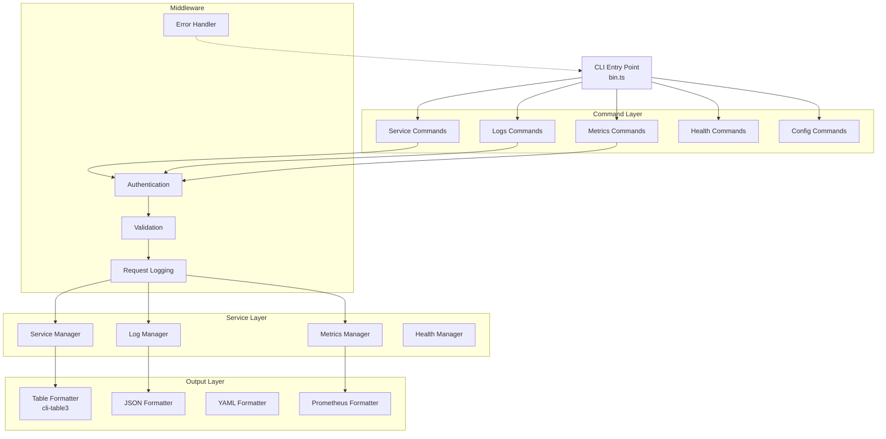

### 7.2 Command Handler Pattern

```typescript
/**
 * Base command handler with middleware support
 */
abstract class CommandHandler {
  protected serviceManager: IServiceManager;
  protected logger: Logger;

  constructor(
    serviceManager: IServiceManager,
    logger: Logger
  ) {
    this.serviceManager = serviceManager;
    this.logger = logger;
  }

  /**
   * Execute command with middleware pipeline
   */
  async execute(options: any): Promise<void> {
    const context: CommandContext = {
      command: this.constructor.name,
      options,
      startTime: Date.now(),
      user: this.getCurrentUser()
    };

    try {
      // Pre-execution middleware
      await this.runMiddleware('pre', context);

      // Validate input
      await this.validate(options);

      // Execute command logic
      const result = await this.handle(options);

      // Format output
      const formatted = await this.format(result, options);

      // Post-execution middleware
      await this.runMiddleware('post', context);

      // Output result
      this.output(formatted);

      // Log success
      this.logger.info('Command executed successfully', {
        command: context.command,
        duration: Date.now() - context.startTime
      });

    } catch (error) {
      // Error middleware
      await this.runMiddleware('error', context, error);

      // Handle error
      await this.handleError(error as Error, context);
    }
  }

  /**
   * Command-specific logic (implemented by subclasses)
   */
  protected abstract handle(options: any): Promise<any>;

  /**
   * Validate command options
   */
  protected abstract validate(options: any): Promise<void>;

  /**
   * Format output based on requested format
   */
  protected async format(data: any, options: any): Promise<string> {
    const format = options.format || 'table';

    switch (format) {
      case 'json':
        return JSON.stringify(data, null, 2);
      case 'yaml':
        return yaml.dump(data);
      case 'table':
        return this.formatTable(data);
      case 'prometheus':
        return this.formatPrometheus(data);
      default:
        throw new Error(`Unknown format: ${format}`);
    }
  }

  /**
   * Output to stdout/stderr
   */
  protected output(data: string): void {
    console.log(data);
  }
}

/**
 * Service start command implementation
 */
class ServiceStartCommand extends CommandHandler {
  protected async validate(options: StartOptions): Promise<void> {
    // Validate service name
    if (!options.name || typeof options.name !== 'string') {
      throw new ValidationError('Service name is required');
    }

    // Validate service exists
    const exists = await this.serviceManager.exists(options.name);
    if (!exists) {
      throw new NotFoundError(`Service not found: ${options.name}`);
    }

    // Validate options
    if (options.maxMemory && !this.isValidMemorySize(options.maxMemory)) {
      throw new ValidationError('Invalid memory size format');
    }
  }

  protected async handle(options: StartOptions): Promise<ServiceInstance> {
    this.logger.info(`Starting service: ${options.name}`);

    // Start the service
    const instance = await this.serviceManager.startService(
      options.name,
      {
        watch: options.watch,
        env: this.loadEnvFile(options.env),
        maxMemory: options.maxMemory,
        maxRestarts: options.maxRestarts,
        logLevel: options.logLevel
      }
    );

    this.logger.info(`Service started successfully: ${options.name} (PID: ${instance.pid})`);

    return instance;
  }

  protected formatTable(instance: ServiceInstance): string {
    const table = new Table({
      head: ['Property', 'Value'],
      colWidths: [20, 50]
    });

    table.push(
      ['Name', instance.name],
      ['PID', instance.pid],
      ['State', instance.state],
      ['Uptime', this.formatDuration(instance.uptime)],
      ['CPU', `${instance.cpu.toFixed(2)}%`],
      ['Memory', this.formatBytes(instance.memory)],
      ['Restarts', instance.restartCount]
    );

    return table.toString();
  }
}
```

---

## 8. Process Management Strategy

### 8.1 PM2 vs Native Process Management

**Architecture Decision Record (ADR-001)**

**Context**: Need to decide between PM2 integration and custom process management.

**Decision**: Use **PM2 for production**, **native process management for development**.

**Rationale**:

| Criteria | PM2 | Native |
|----------|-----|--------|
| **Reliability** | Battle-tested, millions of users | Custom implementation, needs extensive testing |
| **Features** | Built-in clustering, log rotation, monitoring | Must implement all features manually |
| **Dependencies** | Requires PM2 installation | Zero external dependencies |
| **Resource Usage** | ~50MB memory overhead | Minimal overhead (~5MB) |
| **Development DX** | Extra setup step | Works out of the box |
| **Production** | Industry standard | Not recommended for production |

**Implementation**: Adapter pattern to support both:

```typescript
/**
 * Process manager interface
 */
interface IProcessManager {
  start(config: ProcessConfig): Promise<ProcessInstance>;
  stop(pid: number, graceful: boolean): Promise<void>;
  restart(pid: number): Promise<ProcessInstance>;
  list(): Promise<ProcessInstance[]>;
  getInfo(pid: number): Promise<ProcessInstance>;
}

/**
 * PM2 Adapter for production
 */
class PM2ProcessManager implements IProcessManager {
  private pm2: PM2;

  async start(config: ProcessConfig): Promise<ProcessInstance> {
    return new Promise((resolve, reject) => {
      this.pm2.start({
        name: config.name,
        script: config.command,
        args: config.args,
        cwd: config.cwd,
        env: config.env,
        instances: config.instances || 1,
        exec_mode: config.execMode || 'fork',
        max_memory_restart: config.maxMemory,
        max_restarts: config.maxRestarts || 10,
        autorestart: true,
        watch: config.watch || false,
        log_file: config.logFile,
        error_file: config.errorFile,
        out_file: config.outFile,
        merge_logs: true,
        log_date_format: 'YYYY-MM-DD HH:mm:ss Z'
      }, (err, proc) => {
        if (err) return reject(err);
        resolve(this.toProcessInstance(proc));
      });
    });
  }

  async stop(pid: number, graceful: boolean = true): Promise<void> {
    const signal = graceful ? 'SIGTERM' : 'SIGKILL';
    return new Promise((resolve, reject) => {
      this.pm2.sendSignalToProcessId(signal, pid, (err) => {
        if (err) return reject(err);
        resolve();
      });
    });
  }
}

/**
 * Native process manager for development
 */
class NativeProcessManager implements IProcessManager {
  private processes = new Map<number, ChildProcess>();
  private pidManager: PIDManager;

  async start(config: ProcessConfig): Promise<ProcessInstance> {
    const child = spawn(config.command, config.args || [], {
      cwd: config.cwd,
      env: { ...process.env, ...config.env },
      stdio: ['ignore', 'pipe', 'pipe'],
      detached: true
    });

    // Store PID
    await this.pidManager.write(config.name, child.pid!);

    // Setup log streaming
    if (config.logFile) {
      const logStream = fs.createWriteStream(config.logFile, { flags: 'a' });
      child.stdout?.pipe(logStream);
      child.stderr?.pipe(logStream);
    }

    // Handle exit
    child.on('exit', async (code, signal) => {
      this.processes.delete(child.pid!);
      await this.pidManager.remove(config.name);

      // Auto-restart if configured
      if (config.maxRestarts && this.getRestartCount(config.name) < config.maxRestarts) {
        setTimeout(() => this.start(config), 1000);
      }
    });

    this.processes.set(child.pid!, child);

    return {
      id: uuidv4(),
      name: config.name,
      pid: child.pid!,
      state: ServiceState.RUNNING,
      uptime: 0,
      restartCount: 0,
      cpu: 0,
      memory: 0,
      startedAt: new Date(),
      healthStatus: HealthStatus.UNKNOWN
    };
  }

  async stop(pid: number, graceful: boolean = true): Promise<void> {
    const child = this.processes.get(pid);
    if (!child) {
      throw new Error(`Process not found: ${pid}`);
    }

    if (graceful) {
      child.kill('SIGTERM');

      // Wait for graceful shutdown, force kill after timeout
      const timeout = 10000; // 10 seconds
      await new Promise<void>((resolve) => {
        const timer = setTimeout(() => {
          child.kill('SIGKILL');
          resolve();
        }, timeout);

        child.on('exit', () => {
          clearTimeout(timer);
          resolve();
        });
      });
    } else {
      child.kill('SIGKILL');
    }
  }
}

/**
 * Process manager factory
 */
class ProcessManagerFactory {
  static create(mode: 'pm2' | 'native'): IProcessManager {
    switch (mode) {
      case 'pm2':
        return new PM2ProcessManager();
      case 'native':
        return new NativeProcessManager();
      default:
        // Auto-detect based on environment
        return this.autoDetect();
    }
  }

  private static autoDetect(): IProcessManager {
    if (process.env.NODE_ENV === 'production' && this.isPM2Available()) {
      return new PM2ProcessManager();
    }
    return new NativeProcessManager();
  }

  private static isPM2Available(): boolean {
    try {
      require.resolve('pm2');
      return true;
    } catch {
      return false;
    }
  }
}
```

### 8.2 PID File Management

```typescript
/**
 * PID file manager for native process tracking
 */
class PIDManager {
  private pidDir: string;

  constructor(pidDir: string = './.weaver/pids') {
    this.pidDir = pidDir;
    fs.mkdirSync(pidDir, { recursive: true });
  }

  async write(serviceName: string, pid: number): Promise<void> {
    const pidFile = path.join(this.pidDir, `${serviceName}.pid`);
    await fs.promises.writeFile(pidFile, String(pid), 'utf8');
  }

  async read(serviceName: string): Promise<number | null> {
    const pidFile = path.join(this.pidDir, `${serviceName}.pid`);
    try {
      const content = await fs.promises.readFile(pidFile, 'utf8');
      const pid = parseInt(content.trim(), 10);

      // Verify process is still running
      if (this.isProcessRunning(pid)) {
        return pid;
      } else {
        // Stale PID file, clean up
        await this.remove(serviceName);
        return null;
      }
    } catch {
      return null;
    }
  }

  async remove(serviceName: string): Promise<void> {
    const pidFile = path.join(this.pidDir, `${serviceName}.pid`);
    try {
      await fs.promises.unlink(pidFile);
    } catch {
      // Ignore errors if file doesn't exist
    }
  }

  private isProcessRunning(pid: number): boolean {
    try {
      // Send signal 0 to check if process exists
      process.kill(pid, 0);
      return true;
    } catch {
      return false;
    }
  }
}
```

---

## 9. Technology Decisions

### 9.1 Technology Stack Summary

| Component | Technology | Rationale |
|-----------|-----------|-----------|
| **CLI Framework** | Commander.js | Industry standard, excellent TypeScript support, 5M+ weekly downloads |
| **Process Management** | PM2 (prod) / Native (dev) | PM2 for production reliability, native for zero-dependency development |
| **Logging** | Pino | 3x faster than Winston, structured JSON, automatic log rotation |
| **Database** | SQLite | Zero dependencies, ACID transactions, sufficient for <10K services |
| **Metrics Storage** | SQLite + TimescaleDB extension | Efficient time-series queries, automatic aggregation |
| **Health Checks** | Native fetch + TCP sockets | Zero dependencies, standard APIs |
| **Output Formatting** | cli-table3 | Best table formatting, good Unicode support |
| **Configuration** | JSON + YAML | Human-readable, good editor support |
| **IPC** | Unix sockets (Linux/Mac) / Named pipes (Windows) | Low latency, secure |
| **Testing** | Vitest | Fast, excellent TypeScript support, Jest-compatible API |

### 9.2 Alternative Evaluations

#### Logging Library Comparison

| Feature | Pino | Winston | Bunyan |
|---------|------|---------|--------|
| **Performance** | 3x faster | Baseline | 2x faster |
| **Structured** | ✅ JSON | ⚠️ Optional | ✅ JSON |
| **Child loggers** | ✅ Built-in | ✅ Built-in | ✅ Built-in |
| **Log rotation** | ✅ pino-roll | ⚠️ winston-daily-rotate-file | ❌ External |
| **Pretty print** | ✅ pino-pretty | ✅ Built-in | ❌ External |
| **Streams** | ✅ Native | ⚠️ Transports | ✅ Native |
| **TypeScript** | ✅ Excellent | ✅ Good | ⚠️ Basic |
| **Active dev** | ✅ Very active | ✅ Active | ⚠️ Slow |

**Decision**: **Pino** for performance and modern API.

#### Process Management Comparison

| Feature | PM2 | systemd | Forever | Docker |
|---------|-----|---------|---------|--------|
| **Clustering** | ✅ Built-in | ❌ Manual | ❌ No | ⚠️ External orchestrator |
| **Log rotation** | ✅ Built-in | ✅ journald | ❌ No | ⚠️ Driver-dependent |
| **Zero-downtime** | ✅ reload | ⚠️ Manual | ❌ No | ✅ Rolling update |
| **Cross-platform** | ✅ Win/Mac/Linux | ❌ Linux only | ✅ All | ✅ All |
| **Resource limits** | ✅ Built-in | ✅ cgroups | ❌ No | ✅ cgroups |
| **Web dashboard** | ✅ pm2-web | ❌ No | ❌ No | ⚠️ Portainer |
| **Ease of use** | ✅ Excellent | ⚠️ Complex | ✅ Simple | ⚠️ Moderate |

**Decision**: **PM2 for production** (industry standard), **native for development** (zero setup).

#### Metrics Storage Comparison

| Feature | SQLite | InfluxDB | Prometheus | PostgreSQL |
|---------|--------|----------|------------|------------|
| **Time-series** | ⚠️ Via extensions | ✅ Native | ✅ Native | ⚠️ TimescaleDB |
| **Embedded** | ✅ Zero config | ❌ Separate server | ❌ Separate server | ❌ Separate server |
| **Query language** | SQL | InfluxQL/Flux | PromQL | SQL |
| **Retention** | Manual | ✅ Automatic | ✅ Automatic | Manual |
| **Aggregation** | SQL | ✅ Built-in | ✅ Built-in | SQL |
| **Memory usage** | ~5MB | ~500MB | ~200MB | ~100MB |
| **Setup** | ✅ Zero | ⚠️ Install + config | ⚠️ Install + config | ⚠️ Install + config |

**Decision**: **SQLite** for simplicity and zero dependencies. Can upgrade to TimescaleDB for high-scale deployments.

---

## 10. Integration Strategy

### 10.1 Claude-Flow Hooks Integration

```typescript
/**
 * Hook integration points for service management
 */
class ServiceManagerHooks {
  private hookRunner: HookRunner;

  constructor() {
    this.hookRunner = new HookRunner();
  }

  /**
   * Register service management hooks
   */
  registerHooks(): void {
    // Pre-operation hooks
    this.hookRunner.register('pre-service-start', async (context) => {
      // Validate dependencies are running
      const config = context.serviceConfig;
      for (const dep of config.dependsOn || []) {
        const depStatus = await this.serviceManager.getStatus(dep);
        if (depStatus.state !== ServiceState.RUNNING) {
          throw new Error(`Dependency not running: ${dep}`);
        }
      }

      // Check resource availability
      const resources = await this.getAvailableResources();
      if (resources.memory < this.parseMemorySize(config.maxMemory || '512M')) {
        throw new Error('Insufficient memory available');
      }

      // Store in collective memory
      await this.memory.store(`hive/service/${config.name}/start-attempt`, {
        timestamp: new Date(),
        config,
        resources
      });
    });

    this.hookRunner.register('post-service-start', async (context) => {
      // Update service registry
      await this.registry.setState(context.service, ServiceState.RUNNING);

      // Schedule first health check
      await this.healthCheck.scheduleCheck(context.service);

      // Start metrics collection
      await this.metrics.startCollection(context.service);

      // Notify via hooks
      await this.hookRunner.run('notify', {
        message: `Service ${context.service} started successfully`,
        level: 'success',
        service: context.service
      });

      // Store in collective memory
      await this.memory.store(`hive/service/${context.service}/started`, {
        timestamp: new Date(),
        instance: context.instance
      });
    });

    this.hookRunner.register('pre-service-stop', async (context) => {
      // Graceful shutdown sequence
      const config = await this.registry.get(context.service);

      // Run pre-stop command if configured
      if (config.preStop) {
        await this.runCommand(config.preStop);
      }

      // Notify dependents
      const dependents = await this.registry.getDependents(context.service);
      for (const dep of dependents) {
        await this.hookRunner.run('notify', {
          message: `Dependency ${context.service} is stopping`,
          level: 'warn',
          service: dep
        });
      }
    });

    this.hookRunner.register('post-service-stop', async (context) => {
      // Update registry
      await this.registry.setState(context.service, ServiceState.STOPPED);

      // Stop health checks
      await this.healthCheck.cancelChecks(context.service);

      // Stop metrics collection
      await this.metrics.stopCollection(context.service);

      // Run post-stop command
      const config = await this.registry.get(context.service);
      if (config.postStop) {
        await this.runCommand(config.postStop);
      }

      // Clean up resources
      await this.cleanupResources(context.service);
    });

    // Error handling hooks
    this.hookRunner.register('service-crashed', async (context) => {
      // Log crash details
      this.logger.error('Service crashed', {
        service: context.service,
        pid: context.pid,
        exitCode: context.exitCode,
        signal: context.signal,
        error: context.error
      });

      // Send alert
      await this.alertManager.send({
        level: 'critical',
        message: `Service ${context.service} crashed`,
        details: context
      });

      // Trigger auto-restart
      if (context.autoRestart) {
        await this.autoRestartManager.handleCrash(context.service, context.config);
      }

      // Store crash report
      await this.memory.store(`hive/service/${context.service}/crash`, {
        timestamp: new Date(),
        details: context
      });
    });

    this.hookRunner.register('service-degraded', async (context) => {
      // Log degradation
      this.logger.warn('Service degraded', {
        service: context.service,
        healthStatus: context.healthStatus,
        consecutiveFailures: context.consecutiveFailures
      });

      // Send alert
      await this.alertManager.send({
        level: 'warning',
        message: `Service ${context.service} is degraded`,
        details: context
      });

      // Attempt auto-remediation
      if (context.autoRemediate) {
        await this.remediationManager.handle(context.service, context);
      }
    });
  }

  /**
   * Integration with git automation
   */
  async integrateGitAutomation(): Promise<void> {
    this.hookRunner.register('post-service-config-change', async (context) => {
      // Auto-commit service configuration changes
      await this.git.add(context.configFile);

      // Generate AI commit message if enabled
      let message: string;
      if (context.autoCommit) {
        message = await this.ai.generateCommitMessage(context.changes);
      } else {
        message = `chore(service): Update ${context.service} configuration`;
      }

      await this.git.commit(message);

      // Run git workflow hook
      await this.hookRunner.run('post-git-commit', {
        service: context.service,
        message
      });
    });
  }
}
```

### 10.2 Startup Sequence

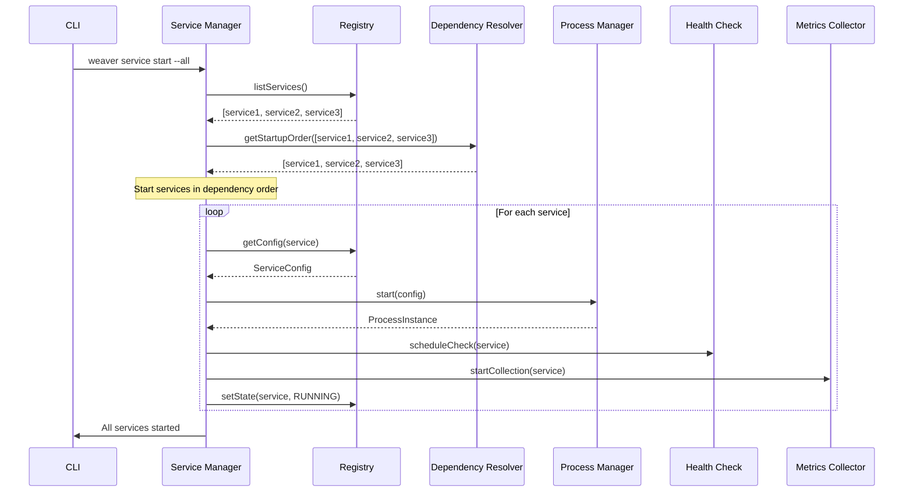

### 10.3 Shutdown Sequence

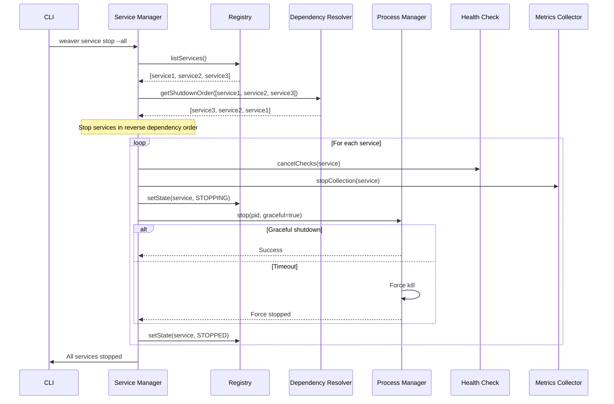

---

## 11. Data Flow Diagrams

### 11.1 Service Start Data Flow

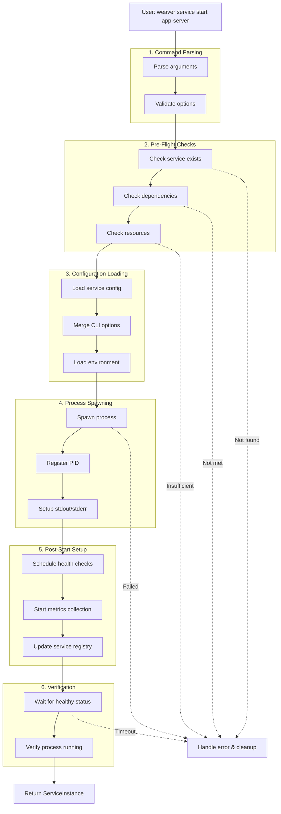

### 11.2 Health Check Data Flow

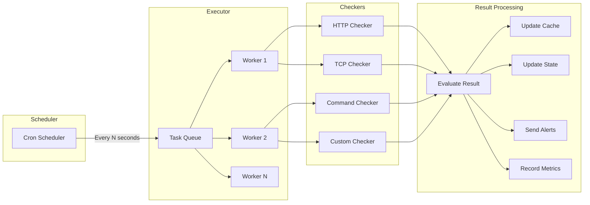

### 11.3 Metrics Collection Data Flow

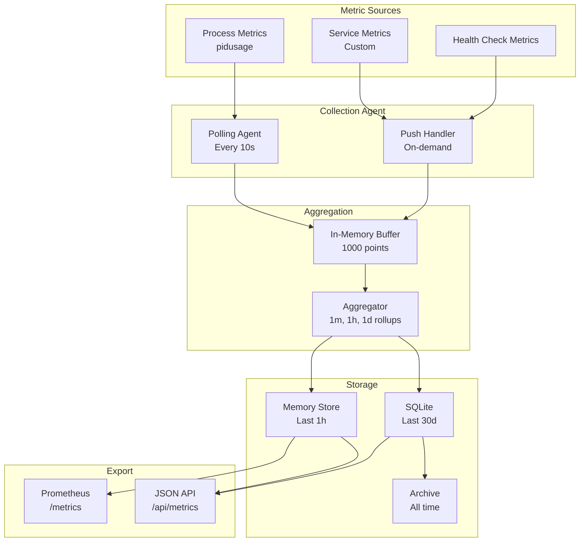

---

## 12. Security Architecture

### 12.1 Security Principles

1. **Least Privilege**: Services run with minimum required permissions
2. **Defense in Depth**: Multiple layers of security controls
3. **Secure by Default**: Secure configuration out of the box
4. **Zero Trust**: Verify all inter-service communication
5. **Audit Everything**: Comprehensive audit logging

### 12.2 Security Components

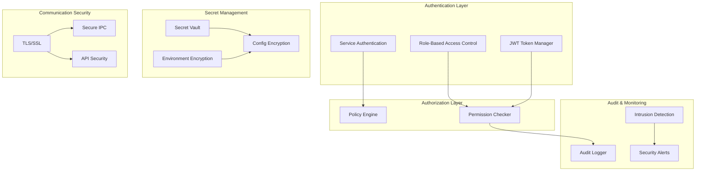

### 12.3 Secret Management

```typescript
/**
 * Secret manager for secure credential storage
 */
class SecretManager {
  private encryptionKey: Buffer;
  private secretStore: Map<string, EncryptedSecret>;

  constructor(masterKey?: string) {
    // Use master key or generate from system entropy
    this.encryptionKey = masterKey
      ? this.deriveKey(masterKey)
      : this.generateKey();
  }

  /**
   * Store secret securely
   */
  async setSecret(name: string, value: string): Promise<void> {
    const encrypted = await this.encrypt(value);
    this.secretStore.set(name, {
      value: encrypted,
      createdAt: new Date(),
      lastAccessed: new Date()
    });

    // Audit log
    await this.auditLogger.log({
      action: 'secret.set',
      secret: name,
      user: this.getCurrentUser()
    });
  }

  /**
   * Retrieve secret
   */
  async getSecret(name: string): Promise<string> {
    const encrypted = this.secretStore.get(name);
    if (!encrypted) {
      throw new Error(`Secret not found: ${name}`);
    }

    // Update last accessed
    encrypted.lastAccessed = new Date();

    // Audit log
    await this.auditLogger.log({
      action: 'secret.get',
      secret: name,
      user: this.getCurrentUser()
    });

    return this.decrypt(encrypted.value);
  }

  /**
   * Encrypt value using AES-256-GCM
   */
  private async encrypt(plaintext: string): Promise<string> {
    const iv = crypto.randomBytes(16);
    const cipher = crypto.createCipheriv('aes-256-gcm', this.encryptionKey, iv);

    let encrypted = cipher.update(plaintext, 'utf8', 'base64');
    encrypted += cipher.final('base64');

    const authTag = cipher.getAuthTag();

    // Format: iv:authTag:ciphertext
    return `${iv.toString('base64')}:${authTag.toString('base64')}:${encrypted}`;
  }

  /**
   * Decrypt value
   */
  private async decrypt(encrypted: string): Promise<string> {
    const [ivB64, authTagB64, ciphertext] = encrypted.split(':');

    const iv = Buffer.from(ivB64, 'base64');
    const authTag = Buffer.from(authTagB64, 'base64');

    const decipher = crypto.createDecipheriv('aes-256-gcm', this.encryptionKey, iv);
    decipher.setAuthTag(authTag);

    let decrypted = decipher.update(ciphertext, 'base64', 'utf8');
    decrypted += decipher.final('utf8');

    return decrypted;
  }
}
```

---

## 13. Scalability & Performance

### 13.1 Performance Targets

| Metric | Target | Measurement Method |
|--------|--------|-------------------|
| **Service Start Time** | <2s for simple services | P95 latency |
| **Service Stop Time** | <5s graceful shutdown | P95 latency |
| **CLI Response Time** | <100ms for status queries | P95 latency |
| **Health Check Latency** | <50ms per check | P95 latency |
| **Metrics Query Time** | <200ms for 24h data | P95 latency |
| **Concurrent Services** | 100+ services | Load test |
| **Memory Overhead** | <50MB base + 5MB per service | Resource monitoring |
| **CPU Overhead** | <5% idle, <20% under load | Resource monitoring |

### 13.2 Scalability Strategies

**Horizontal Scaling**: Multiple Weaver instances coordinated via distributed registry

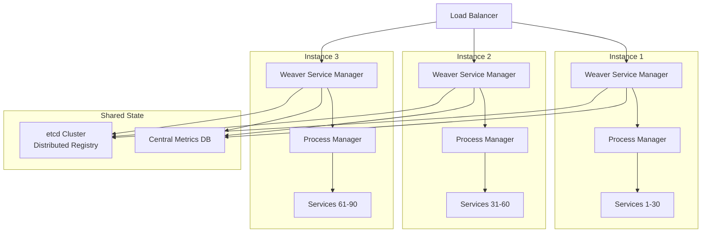

### 13.3 Performance Optimizations

```typescript
/**
 * Performance optimization techniques
 */
class PerformanceOptimizer {
  /**
   * 1. Lazy loading of modules
   */
  private moduleCache = new Map<string, any>();

  async loadModule(name: string): Promise<any> {
    if (this.moduleCache.has(name)) {
      return this.moduleCache.get(name);
    }

    const module = await import(name);
    this.moduleCache.set(name, module);
    return module;
  }

  /**
   * 2. Connection pooling for database
   */
  private dbPool: Pool;

  async query(sql: string, params: any[]): Promise<any> {
    const conn = await this.dbPool.acquire();
    try {
      return await conn.query(sql, params);
    } finally {
      this.dbPool.release(conn);
    }
  }

  /**
   * 3. Batch database operations
   */
  private writeBatch: any[] = [];
  private batchTimer: NodeJS.Timeout | null = null;

  async batchWrite(record: any): Promise<void> {
    this.writeBatch.push(record);

    if (!this.batchTimer) {
      this.batchTimer = setTimeout(async () => {
        await this.flushBatch();
      }, 100); // Flush every 100ms
    }

    // Flush if batch is large
    if (this.writeBatch.length >= 100) {
      await this.flushBatch();
    }
  }

  private async flushBatch(): Promise<void> {
    if (this.writeBatch.length === 0) return;

    const batch = this.writeBatch.splice(0);
    this.batchTimer = null;

    // Bulk insert
    await this.db.executeBatch(batch);
  }

  /**
   * 4. Caching with LRU eviction
   */
  private cache: LRUCache<string, any>;

  constructor() {
    this.cache = new LRUCache({
      max: 1000,
      ttl: 60000, // 1 minute
      updateAgeOnGet: true
    });
  }

  async getCached<T>(key: string, loader: () => Promise<T>): Promise<T> {
    const cached = this.cache.get(key);
    if (cached !== undefined) {
      return cached as T;
    }

    const value = await loader();
    this.cache.set(key, value);
    return value;
  }

  /**
   * 5. Worker threads for CPU-intensive tasks
   */
  private workerPool: WorkerPool;

  async runCpuIntensive(task: Task): Promise<any> {
    return this.workerPool.execute(task);
  }
}
```

---

## 14. Architecture Decision Records

### ADR-001: PM2 vs Native Process Management

**Status**: Accepted

**Context**: Need reliable process management for production deployments while maintaining zero-dependency development experience.

**Decision**: Use PM2 for production environments, native Node.js child_process for development.

**Consequences**:
- ✅ Production gets battle-tested reliability
- ✅ Development has zero setup friction
- ✅ Adapter pattern allows switching strategies
- ⚠️ Need to maintain two implementations
- ⚠️ PM2 adds ~50MB memory overhead in production

**Alternatives Considered**:
- systemd: Linux-only, complex configuration
- Docker: Adds container layer complexity
- Forever: Lacks features like clustering, log rotation

---

### ADR-002: SQLite for Service Registry and Metrics

**Status**: Accepted

**Context**: Need persistent storage for service registry and metrics that works out-of-the-box with zero configuration.

**Decision**: Use SQLite for both service registry and metrics storage.

**Consequences**:
- ✅ Zero dependencies - SQLite is embedded
- ✅ ACID transactions for data integrity
- ✅ SQL queries familiar to developers
- ✅ File-based backup and restore
- ⚠️ Limited to single-node deployments
- ⚠️ Write concurrency limited to ~1000 writes/sec

**Alternatives Considered**:
- PostgreSQL: Requires separate database server
- Redis: In-memory only, requires persistence config
- MongoDB: Document model doesn't fit relational data

**Migration Path**: Can upgrade to PostgreSQL/TimescaleDB for high-scale deployments using same SQL schema.

---

### ADR-003: Pino for Logging

**Status**: Accepted

**Context**: Need high-performance logging with structured output and minimal overhead.

**Decision**: Use Pino as the primary logging framework.

**Consequences**:
- ✅ 3x faster than Winston (benchmarked)
- ✅ Structured JSON output by default
- ✅ Built-in log rotation (pino-roll)
- ✅ Pretty printing for development (pino-pretty)
- ✅ Child loggers for context propagation
- ⚠️ Less mature ecosystem than Winston
- ⚠️ JSON-only (not human-readable without pino-pretty)

**Alternatives Considered**:
- Winston: Slower, more complex configuration
- Bunyan: Similar to Pino but less active development
- log4js: Java-style, heavy configuration

---

### ADR-004: Event-Driven Architecture for Service Manager

**Status**: Accepted

**Context**: Need extensible architecture that allows plugins and custom behavior without modifying core code.

**Decision**: Use event-driven architecture with hooks for lifecycle events.

**Consequences**:
- ✅ Loose coupling between components
- ✅ Easy to add plugins and extensions
- ✅ Natural integration with Claude-Flow hooks
- ✅ Enables async event handling
- ⚠️ Harder to trace execution flow
- ⚠️ Event ordering can be complex

**Alternatives Considered**:
- Plugin architecture: More rigid, harder to compose
- Middleware pipeline: Linear flow, less flexible
- Direct method calls: Tight coupling, hard to extend

---

### ADR-005: Health Check Worker Pool

**Status**: Accepted

**Context**: Need to perform health checks for 100+ services without blocking main event loop.

**Decision**: Use worker thread pool for health check execution.

**Consequences**:
- ✅ Non-blocking health checks
- ✅ Parallel execution for better performance
- ✅ Isolated crashes (worker failure doesn't crash main)
- ✅ CPU-efficient for I/O-bound checks
- ⚠️ Added complexity in worker communication
- ⚠️ Startup time for worker pool initialization

**Alternatives Considered**:
- Child processes: Higher overhead, slower IPC
- Single-threaded async: Blocks on CPU-intensive checks
- External service: Adds deployment complexity

---

## 15. Summary and Next Steps

### 15.1 Architecture Summary

This architecture design provides:

1. **Production-Grade Service Management**: Reliable lifecycle control with PM2 integration
2. **Comprehensive Monitoring**: Health checks, metrics, and logging out-of-the-box
3. **Developer-Friendly CLI**: Intuitive commands with progressive complexity
4. **Extensible Design**: Event-driven architecture with hooks for customization
5. **Zero-Dependency Core**: SQLite-based storage, native process management fallback
6. **Security-First**: Encryption, audit logging, least privilege
7. **High Performance**: <100ms CLI response, 100+ concurrent services

### 15.2 Next Steps for Implementation

**Phase 1 - Core Infrastructure (Week 1-2)**:
- Implement Service Manager Core with event system
- Build Service Registry with SQLite storage
- Create Dependency Resolver with topological sort
- Develop Process Manager adapters (PM2 + Native)

**Phase 2 - CLI Commands (Week 2-3)**:
- Implement service lifecycle commands (start/stop/restart/status)
- Build log viewing and filtering
- Create metrics collection and display
- Add health check commands

**Phase 3 - Monitoring (Week 3-4)**:
- Implement Health Check Engine with HTTP/TCP/Command checkers
- Build Metrics Collector with Prometheus export
- Create Log Storage with rotation
- Add real-time monitoring dashboard

**Phase 4 - Integration (Week 4-5)**:
- Integrate Claude-Flow hooks
- Add git automation
- Implement AI feature creator
- Create comprehensive tests

### 15.3 Hive Coordination Next Steps

**Architect (Me)**:
- ✅ Store this architecture design in collective memory
- ✅ Create architecture diagrams
- ✅ Document technology decisions
- ⏳ Await consensus from other agents
- ⏳ Refine design based on feedback

**Next Agents**:
- **Coder**: Implement core modules based on this architecture
- **Tester**: Create comprehensive test suite
- **Reviewer**: Review implementation for architecture compliance

---

**Document Status**: Ready for Hive Review and Consensus

**Storage Keys**:
- `hive/architect/system-design` - This complete document
- `hive/architect/pm2-config` - PM2 configuration strategy
- `hive/architect/module-design` - Component architecture
- `hive/architect/integration-strategy` - Hook integration points
