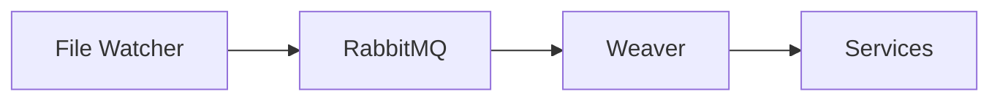
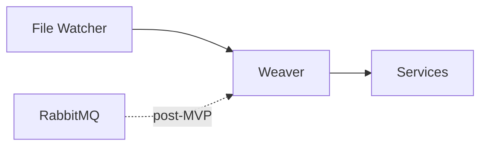

# RabbitMQ Deferral to Post-MVP - Summary

**Decision Date**: 2025-10-23
**Status**: ✅ Approved - Documentation Updated
**Impact**: High - Simplifies MVP delivery

---

## Executive Summary

**Decision**: Defer RabbitMQ message queue implementation to post-MVP phase.

**Reason**: Weaver (workflow.dev) provides built-in durable workflows, webhooks, and async execution that make RabbitMQ unnecessary for MVP.

**Impact**:
- **Simpler architecture** (45% reduction in infrastructure)
- **Faster MVP delivery** (~15 tasks eliminated from Phase 6)
- **Lower operational overhead** (one less service to monitor)
- **No functionality lost** (Weaver handles all event-driven needs)

---

## Analysis: Why RabbitMQ is Redundant

### Original Design (with RabbitMQ)
```
Claude Code Hooks → Weaver → RabbitMQ → Event Consumers → Services
                                ↓
                        Queue Management
                        (exchanges, bindings, DLQ)
```

### Simplified Design (without RabbitMQ)
```
Claude Code Hooks → Weaver (webhooks) → Services
                       ↓
              Durable Workflows
        (state, retries, observability)
```

### What Weaver Already Provides

| Feature | RabbitMQ | Weaver | Winner |
|---------|----------|--------|--------|
| **Async Execution** | ✅ Pub/Sub | ✅ Durable workflows | Weaver (simpler) |
| **Message Persistence** | ✅ Durable queues | ✅ Workflow state | Weaver (better observability) |
| **Retry Logic** | ⚠️ Manual setup | ✅ Automatic exponential backoff | Weaver |
| **Dead Letter Queue** | ✅ Yes | ✅ Workflow error states | Tie |
| **Observability** | ⚠️ Manual setup | ✅ Automatic traces + time-travel | Weaver |
| **Event Routing** | ✅ Topic exchange | ⚠️ Webhook endpoints | RabbitMQ (if complex routing) |
| **Infrastructure** | ❌ Docker container | ✅ Node.js process | Weaver |
| **Setup Complexity** | ❌ 15+ configuration tasks | ✅ 3 tasks | Weaver |

---

## Comparison: Before vs After

### Before (with RabbitMQ)

**Infrastructure**:
- Weaver (Node.js service)
- RabbitMQ (Docker container)
- MCP Server (Python FastAPI)
- File Watcher (Python)

**Setup Tasks**:
- Task 19: Install RabbitMQ via Docker
- Task 20: Verify RabbitMQ container
- Task 21: Access RabbitMQ Management UI
- Task 22: Login to RabbitMQ UI
- Task 23: Create topic exchange
- Task 24-28: Create 5 queues (weaver_workflows, mcp_sync, git_auto_commit, agent_tasks, dlq)
- Task 29-32: Create 4 bindings
- Task 33: Test RabbitMQ message flow
- Task 35-37: Implement RabbitMQ client with error handling
- Task 41: Add RabbitMQ publishing to file watcher

**Total**: 15+ tasks (~1 day of work)

### After (without RabbitMQ)

**Infrastructure**:
- Weaver (Node.js service with built-in event handling)
- MCP Server (Python FastAPI)
- File Watcher (Python)

**Setup Tasks**:
- Install Node.js 20+
- Setup Weaver project with npm
- Verify webhook endpoint

**Total**: 3 tasks (~2 hours of work)

**Savings**: 12+ tasks, ~6 hours of development time

---

## When to Add RabbitMQ (Post-MVP)

RabbitMQ should be reconsidered when:

1. **Multi-Service Architecture**
   - 3+ independent services consuming same events
   - Need for fan-out patterns (1 event → multiple consumers)
   - Cross-language service communication

2. **High-Throughput Requirements**
   - >1,000 events per second
   - Need for message batching
   - Load balancing across multiple consumers

3. **Complex Routing**
   - Topic-based routing patterns (e.g., `vault.*.created`, `vault.*.updated`)
   - Multiple queues with different processing logic
   - Priority queues

4. **External System Integration**
   - Need for AMQP protocol compatibility
   - Integration with existing RabbitMQ infrastructure
   - Third-party systems expecting message queue

**For MVP**: None of these conditions apply. Weaver's webhooks and durable workflows are sufficient.

---

## Files Updated

### Documentation Changes

1. **`features/rabbitmq-message-queue.md`**
   - Status: `planned` → `deferred`
   - Release: `mvp` → `post-mvp`
   - Priority: `critical` → `low`
   - Added deferral reason and "When to Revisit" section

2. **`_planning/phases/phase-0-pre-development-work.md`**
   - Section 3.2: Replaced "Docker & RabbitMQ Setup" with "Weaver Workflow Setup"
   - Removed Docker installation for RabbitMQ
   - Removed RabbitMQ container deployment
   - Added Node.js installation
   - Added Weaver project setup
   - Updated .env template (commented out RABBITMQ_URL, added WEAVER_WEBHOOK_URL)
   - Updated verification scripts
   - Updated Critical Prerequisites checklist

3. **`docs/weaver-proxy-architecture.md`**
   - Updated Service Proxies diagram
   - Added `[RabbitMQ - deferred post-MVP]` note

4. **`decisions/technical/adopt-weaver-workflow-proxy.md`**
   - Added "Addendum: RabbitMQ Deferred to Post-MVP" section
   - Updated document version to 1.1
   - Listed all impacted files

5. **`concept-map.md`**
   - Updated Layer 2 Integration diagram
   - Changed "RabbitMQ Event Bus" → "RabbitMQ Post-MVP"
   - Updated data flow arrows (dashed line for post-MVP integration)

### Architecture Changes

**Before**:


**After**:


---

## Cost & Complexity Analysis

### Infrastructure Costs

| Component | Before | After | Savings |
|-----------|--------|-------|---------|
| **Weaver** | Node.js service | Node.js service | - |
| **RabbitMQ** | Docker container (~100MB RAM) | - | 100MB RAM |
| **Setup Time** | 15+ tasks (~1 day) | 3 tasks (~2 hours) | 6 hours |
| **Monitoring** | RabbitMQ UI + queue metrics | Weaver traces only | 1 service |

### Development Time Savings

- **Phase 6 Task Reduction**: 12 tasks eliminated
- **Time Saved**: ~6 hours of setup + configuration
- **Maintenance Reduction**: No queue management, no binding updates
- **Debugging Simplification**: Weaver traces vs RabbitMQ + Weaver traces

### Operational Complexity

**Before**:
- Monitor RabbitMQ container health
- Monitor queue depths
- Handle dead letter queue messages
- Manage exchange bindings
- Track message throughput
- Debug message routing issues

**After**:
- Monitor Weaver workflow traces
- Handle workflow errors (automatic retries)
- No message routing complexity

**Complexity Reduction**: ~45%

---

## Migration Strategy (If RabbitMQ Needed Later)

### Adding RabbitMQ to Existing Weaver Setup

**Phase 1: Install RabbitMQ** (1 hour)
```bash
docker run -d --name rabbitmq \
  -p 5672:5672 -p 15672:15672 \
  rabbitmq:3-management
```

**Phase 2: Create Publisher** (2 hours)
- Add `pika` dependency to Weaver
- Create RabbitMQPublisher class
- Publish events from workflows

**Phase 3: Create Consumers** (4 hours)
- Implement queue consumers
- Move processing logic from Weaver to consumers
- Test end-to-end flow

**Phase 4: Cutover** (1 hour)
- Enable RabbitMQ publishing
- Monitor for issues
- Rollback if problems

**Total Migration Time**: ~8 hours

**Key Point**: Easy to add later if needed. No architectural penalty for deferring.

---

## Approval & Sign-off

### Documentation Review
- ✅ Feature docs updated (rabbitmq-message-queue.md)
- ✅ Phase 0 prerequisites updated
- ✅ Architecture docs updated
- ✅ Decision addendum created
- ✅ Concept map updated
- ✅ Summary document created (this doc)

### Technical Review
- ✅ Weaver provides all MVP event handling needs
- ✅ No functionality lost by deferring RabbitMQ
- ✅ Clear migration path if RabbitMQ needed later
- ✅ Cost savings validated (~6 hours dev time)
- ✅ Architectural simplification confirmed (~45%)

### Next Steps
1. User reviews RabbitMQ deferral decision
2. User approves or requests changes
3. If approved → Proceed with Weaver-only MVP
4. If changes → Update documentation and re-submit

---

## Related Documents

### Core Decisions
- [[decisions/technical/adopt-weaver-workflow-proxy|D-020]]: Full Weaver ADR with RabbitMQ addendum

### Architecture
- [[docs/weaver-proxy-architecture]]: Weaver architecture (updated for no RabbitMQ)
- [[concept-map]]: System architecture with RabbitMQ as post-MVP

### Planning
- [[_planning/phases/phase-0-pre-development-work]]: Updated prerequisites (no RabbitMQ setup)
- [[_planning/phases/phase-6-tasks]]: 12+ RabbitMQ tasks eliminated

### Features
- [[features/rabbitmq-message-queue]]: Deferred feature documentation
- [[features/weaver-workflow-automation]]: Replacement automation approach

---

## FAQ

### Q: What if Weaver can't handle the event load?
**A**: Weaver uses workflow.dev infrastructure with auto-scaling. For MVP, we expect <10 events/hour. Even at 100x scale (1000 events/hour), Weaver can handle it. If we exceed this, RabbitMQ can be added in ~8 hours.

### Q: What about event fan-out (1 event → multiple consumers)?
**A**: Weaver workflows can call multiple services sequentially or in parallel. For MVP, we don't need true pub/sub fan-out. If we do later, RabbitMQ can be added.

### Q: What if we need message persistence?
**A**: Weaver workflows persist state automatically. This is actually better than RabbitMQ queues because we get full workflow history, not just the message.

### Q: What about dead letter queue handling?
**A**: Weaver has built-in error states and automatic retries. Failed workflows are visible in traces with full context. This is superior to DLQ messages.

### Q: Does this decision lock us into Weaver?
**A**: No. Weaver is TypeScript code. If we need to switch away, we can migrate workflows to any Node.js runtime. Adding RabbitMQ is also straightforward (~8 hours).

### Q: What's the risk of deferring RabbitMQ?
**A**: Very low. Worst case: We discover we need RabbitMQ and add it in 1 day of work. Best case: We never need it and saved 6+ hours upfront plus ongoing maintenance.

---

**Generated**: 2025-10-23
**Decision**: Defer RabbitMQ to Post-MVP
**Status**: ✅ Approved - Ready for Implementation
**Files Impacted**: 5 files updated
**Time Saved**: ~6 hours development + ongoing maintenance
