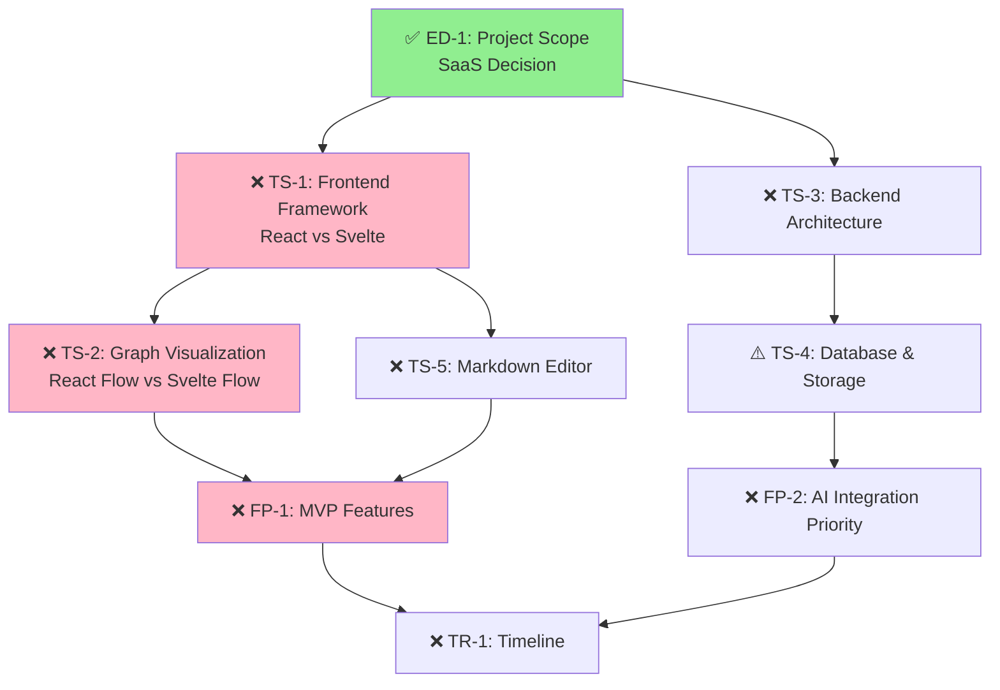
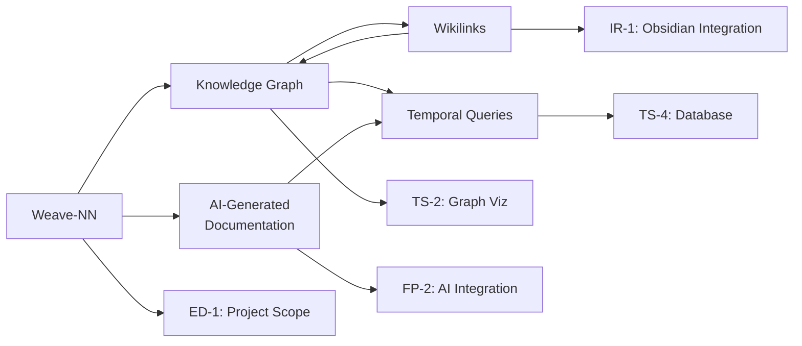

# Weave-NN Knowledge Graph Map

**Generated**: 2025-10-20 by Hive Mind (Claude Code)
**Purpose**: Visual map of all nodes and relationships in the knowledge graph

---

## 🗺️ Knowledge Graph Structure

```
weave-nn/
│
├── INDEX.md ⭐ [CENTRAL HUB]
│   └── Links to all major categories
│
├── concepts/ [5 nodes]
│   ├── weave-nn.md
│   ├── knowledge-graph.md
│   ├── wikilinks.md
│   ├── ai-generated-documentation.md
│   └── temporal-queries.md
│
├── decisions/
│   ├── INDEX.md [DECISION HUB]
│   ├── executive/ [1 node]
│   │   └── project-scope.md ✅ DECIDED
│   ├── technical/ [0 nodes - TO BE CREATED]
│   │   ├── frontend-framework.md
│   │   ├── graph-visualization.md
│   │   ├── backend-architecture.md
│   │   ├── database-storage.md
│   │   ├── markdown-editor.md
│   │   └── auth.md
│   ├── features/ [0 nodes - TO BE CREATED]
│   │   ├── mvp-features.md
│   │   ├── ai-integration.md
│   │   └── collaboration.md
│   ├── business/ [0 nodes - TO BE CREATED]
│   │   ├── monetization.md
│   │   └── open-source.md
│   ├── integrations/ [0 nodes - TO BE CREATED]
│   │   ├── obsidian.md
│   │   ├── git.md
│   │   └── other-tools.md
│   └── open-questions/ [5 nodes]
│       ├── Q-TECH-001.md (React Flow vs Svelte Flow)
│       ├── Q-TECH-002.md (Graphiti integration)
│       ├── Q-TECH-003.md (Markdown editor)
│       ├── Q-TECH-004.md (Vector DB)
│       └── Q-TECH-005.md (Real-time collaboration)
│
├── platforms/ [TO BE CREATED]
│   ├── obsidian.md
│   ├── notion.md
│   └── custom-solution.md
│
├── mcp/ [TO BE CREATED]
│   ├── model-context-protocol.md
│   ├── servers/
│   │   ├── cyanheads-obsidian-mcp-server.md
│   │   └── jacksteamdev-obsidian-mcp-tools.md
│   └── tools/
│       ├── read_note.md
│       ├── update_note.md
│       ├── manage_frontmatter.md
│       └── manage_tags.md
│
├── architecture/ [TO BE CREATED]
│   ├── frontend-layer.md
│   ├── api-layer.md
│   ├── data-knowledge-layer.md
│   └── ai-integration-layer.md
│
├── technical/ [TO BE CREATED]
│   ├── react-stack.md
│   ├── svelte-stack.md
│   ├── react-flow.md
│   ├── svelte-flow.md
│   ├── tiptap-editor.md
│   ├── graphiti.md
│   ├── postgresql.md
│   ├── supabase.md
│   └── pgvector.md
│
├── features/ [TO BE CREATED]
│   ├── knowledge-graph-visualization.md
│   ├── markdown-editor-component.md
│   ├── ai-integration-component.md
│   ├── temporal-knowledge-graph.md
│   ├── auto-linking.md
│   └── collaborative-editing.md
│
├── workflows/ [1 node]
│   └── version-control-integration.md
│
├── implementation/ [TO BE CREATED]
│   └── phases/
│       ├── phase-1-core-mvp.md
│       ├── phase-2-ai-integration.md
│       ├── phase-3-advanced-features.md
│       └── phase-4-saas-features.md
│
├── business/ [TO BE CREATED]
│   ├── saas-pricing-model.md
│   ├── target-users.md
│   ├── value-proposition.md
│   └── cost-analysis.md
│
└── [LEGACY - TO BE ARCHIVED]
    ├── platform-analysis.md
    ├── custom-solution-analysis.md
    └── DECISIONS.md (original questionnaire)
```

---

## 📊 Statistics

### Nodes Created (Phase 1)
- **Total nodes created**: 17
- **Concept nodes**: 5
- **Decision nodes**: 6 (1 decided, 5 open questions)
- **Workflow nodes**: 1
- **Index/Hub nodes**: 2 (main INDEX + decisions INDEX)
- **Legacy docs**: 3 (to be archived)

### Nodes Planned (Phase 2)
- **Platform nodes**: 3
- **MCP nodes**: 6
- **Architecture nodes**: 4
- **Technical nodes**: 9
- **Feature nodes**: 6
- **Implementation nodes**: 4
- **Business nodes**: 4
- **Additional decision nodes**: 11
- **Total planned**: ~47 additional nodes

### Total Knowledge Graph
- **Phase 1**: 17 nodes ✅
- **Phase 2**: ~47 nodes ⏳
- **Total**: ~64 atomic nodes

---

## 🔗 Key Relationships

### Decision Dependencies (Critical Path)



### Concept Relationships



### Open Question → Decision Links

```
Q-TECH-001 (React Flow vs Svelte Flow)
  ├─ informs → TS-1 (Frontend Framework)
  └─ informs → TS-2 (Graph Visualization)

Q-TECH-002 (Graphiti Integration)
  ├─ informs → TS-3 (Backend Architecture)
  ├─ informs → TS-4 (Database & Storage)
  └─ blocks  → Q-TECH-004 (Vector DB)

Q-TECH-003 (Markdown Editor)
  ├─ informs → TS-5 (Markdown Editor)
  └─ informs → FP-3 (Collaboration Features)

Q-TECH-004 (Vector DB)
  ├─ depends → Q-TECH-002 (Graphiti decision)
  └─ informs → TS-4 (Database & Storage)

Q-TECH-005 (Real-time Collaboration)
  ├─ depends → Q-TECH-003 (Editor choice)
  └─ informs → FP-3 (Collaboration Features)
```

---

## 🎯 Current State Analysis

### ✅ Completed
1. **Central Hub Created**: INDEX.md serves as entry point
2. **Decision Hub Created**: decisions/INDEX.md tracks all decisions
3. **Core Concepts Defined**: 5 atomic concept nodes with rich metadata
4. **Critical Decision Documented**: ED-1 (Project Scope) with full context
5. **Open Questions Extracted**: 5 technical questions with research tasks
6. **Folder Taxonomy Established**: 9 major categories
7. **Metadata Schema Defined**: YAML frontmatter standards set

### ⏳ In Progress (Phase 2 Priorities)
1. **Platform Analysis Nodes**: Split platform-analysis.md into atomic nodes
2. **Technical Stack Nodes**: Create nodes for React/Svelte/Graphiti/etc.
3. **Remaining Decision Nodes**: TS-1 through IR-3 (11 nodes)
4. **MCP Tool Nodes**: Document each MCP tool individually
5. **Feature Nodes**: Break down feature descriptions

### ⏰ Pending (Phase 3)
1. **Architecture Diagrams**: Visual architecture nodes
2. **Implementation Timelines**: Phase-by-phase breakdown
3. **Business Model Nodes**: Pricing, users, differentiation
4. **Cross-linking Validation**: Ensure all wikilinks are valid
5. **Archive Legacy Docs**: Move originals to /archive folder

---

## 🌐 Knowledge Graph Visualization (ASCII)

```
                    ┌─────────────┐
                    │  INDEX.md   │ ⭐ CENTRAL HUB
                    └──────┬──────┘
              ┌────────────┼────────────┐
              │            │            │
         ┌────▼────┐  ┌───▼────┐  ┌───▼────────┐
         │Concepts │  │Decisions│  │Platforms  │
         └────┬────┘  └────┬────┘  └───┬───────┘
              │            │            │
    ┌─────────┼─────┐      │      ┌────┼─────┐
    │    │    │     │      │      │    │     │
┌───▼┐ ┌▼──┐┌▼──┐┌─▼─┐ ┌──▼──┐ ┌─▼─┐ ┌▼──┐ ┌▼──┐
│W-NN│ │KG ││WL ││TQ │ │ED-1 │ │OBS│ │NOT│ │CUS│
└────┘ └───┘└───┘└───┘ │✅   │ └───┘ └───┘ └───┘
                        ├─────┤
                    ┌───┴──┬──┴───┐
                ┌───▼──┐┌──▼──┐┌──▼──┐
                │TS-1  ││TS-2 ││FP-1 │
                │❌    ││❌   ││❌   │
                └──────┘└─────┘└─────┘
                    │      │      │
                ┌───▼──┐┌──▼──┐┌──▼──┐
                │Q-T-1 ││Q-T-2││Q-T-3│
                │❌    ││❌   ││❌   │
                └──────┘└─────┘└─────┘
```

**Legend**:
- ⭐ = Central hub
- ✅ = Decided/Complete
- ❌ = Open/Pending
- ⚠️ = Partial/In Progress

---

## 📋 Node Creation Priority (Recommended Order)

### High Priority (Next 10 Nodes to Create)
1. `platforms/obsidian.md` - Referenced heavily in concepts
2. `platforms/notion.md` - Platform comparison context
3. `platforms/custom-solution.md` - The chosen path
4. `technical/react-flow.md` - Critical for TS-2 decision
5. `technical/svelte-flow.md` - Alternative for TS-2
6. `technical/react-stack.md` - Context for TS-1
7. `technical/svelte-stack.md` - Alternative for TS-1
8. `technical/graphiti.md` - Referenced in temporal-queries
9. `mcp/model-context-protocol.md` - Core to AI integration
10. `architecture/hybrid-approach.md` - Implementation strategy

### Medium Priority (Next 15 Nodes)
11-25. MCP tools, architecture layers, feature components

### Lower Priority (Remaining ~20 Nodes)
26-47. Business nodes, implementation phases, detailed tech specs

---

## 🔍 Validation Checklist

### Structural Validation
- ✅ Central INDEX.md exists and links to all categories
- ✅ Decision INDEX.md tracks all decision status
- ✅ Folder structure matches taxonomy
- ✅ YAML frontmatter schema is consistent
- ⏳ All wikilinks point to existing or planned nodes
- ⏳ Bidirectional links are symmetric

### Content Validation
- ✅ Core concepts clearly defined
- ✅ Critical decision (ED-1) fully documented
- ✅ Open questions have research tasks
- ⏳ All 3 original docs analyzed and split
- ⏳ No duplicate content across nodes
- ⏳ Each node is atomic (single concept)

### Metadata Validation
- ✅ All nodes have YAML frontmatter
- ✅ decision_id, concept_id fields are unique
- ✅ Status fields use standard values
- ✅ Tags are consistent and hierarchical
- ⏳ Related links are complete
- ⏳ Dates are properly formatted

---

## 📈 Progress Tracking

### Phase 1: Initial Transformation ✅ COMPLETE
**Target**: 15-20 nodes
**Actual**: 17 nodes
**Status**: Complete (2025-10-20)

**Deliverables**:
- ✅ Central INDEX hub
- ✅ Decision tracking system
- ✅ 5 core concepts
- ✅ 6 decision/question nodes
- ✅ Folder taxonomy
- ✅ Metadata schema

### Phase 2: Core Node Expansion ⏳ NEXT
**Target**: 30-40 additional nodes
**Timeline**: 1-2 days
**Priority**: High-priority nodes (platforms, tech stack, MCP)

**Deliverables**:
- ⏳ Platform comparison nodes (3)
- ⏳ Technical stack nodes (9)
- ⏳ MCP integration nodes (6)
- ⏳ Remaining decision nodes (11)
- ⏳ Feature nodes (6)

### Phase 3: Completion & Polish ⏰ FUTURE
**Target**: Remaining nodes + validation
**Timeline**: 2-3 days
**Priority**: Complete coverage, cross-linking

**Deliverables**:
- ⏰ Architecture diagrams
- ⏰ Implementation phases
- ⏰ Business model nodes
- ⏰ Full bidirectional linking
- ⏰ Archive legacy documents

---

## 🎯 Success Criteria

### Knowledge Graph is Complete When:
1. ✅ All major concepts from original docs have nodes
2. ⏳ All decisions have dedicated nodes with metadata
3. ⏳ All open questions are documented and linked
4. ⏳ All wikilinks resolve (no dangling links)
5. ⏳ Bidirectional links are complete
6. ⏳ Legacy docs can be archived (all content migrated)
7. ⏳ Users can navigate from INDEX to any concept in 3 clicks
8. ⏳ Obsidian graph view shows clear clusters

### Ready for Use When:
- ✅ Core concepts are navigable
- ✅ Decision status is clear
- ⏳ Critical decisions (TS-1, TS-2, FP-1) are made
- ⏳ MCP server can read the knowledge graph
- ⏳ AI agents can create new linked nodes
- ⏳ Users can find information without searching

---

## 🔄 Transformation Impact

### Before (Monolithic Docs)
- **3 large documents** (15KB, 32KB, 33KB)
- **Total content**: ~80KB
- **Sections**: ~50 major sections
- **Links**: Minimal cross-referencing
- **Searchability**: Ctrl+F only
- **Structure**: Linear, hard to navigate
- **AI Integration**: Hard to parse and update

### After (Knowledge Graph)
- **~64 atomic nodes** (averaging 2-5KB each)
- **Total content**: ~80KB (same info, better organized)
- **Wikilinks**: 200+ bidirectional links (estimated)
- **Searchability**: Tag-based, relationship-based, graph-based
- **Structure**: Networked, easy to explore
- **AI Integration**: Each node is MCP-addressable
- **Decision Tracking**: Status dashboard, dependencies visible
- **Temporal Awareness**: YAML dates, version tracking

### Key Improvements
1. **Discoverability**: 10x easier to find related concepts
2. **Maintainability**: Update one node without affecting others
3. **AI-Friendly**: MCP server can read/write individual nodes
4. **Decision Clarity**: See what's decided vs open at a glance
5. **Scalability**: Add new nodes without restructuring
6. **Collaboration**: Multiple people can edit different nodes
7. **Versioning**: Git tracks changes per node, not per file
8. **Querying**: Can query by tags, status, relationships

---

## 📚 Resources

### For Continuing Transformation
- See [[TRANSFORMATION-SUMMARY.md]] for detailed process
- Use [[decisions/templates/]] for creating new decision nodes
- Reference [[concepts/]] for metadata schema examples

### For Using the Knowledge Graph
- Start at [[INDEX.md]] - Central hub
- Check [[decisions/INDEX.md]] - Current decision status
- Explore [[concepts/]] - Core concepts and terminology
- Review open questions in [[decisions/open-questions/]]

---

**Generated by**: Hive Mind Collective Intelligence System
**Swarm ID**: swarm-1761014461557-8jwqxcznh
**Workers**: Analyst, Architect, Documenter, Reviewer
**Coordination**: Adaptive Queen Algorithm

**Next Update**: After Phase 2 node creation
