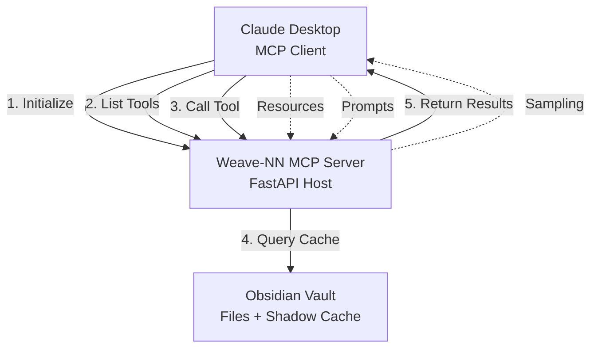

# MCP Protocol (Model Context Protocol)

**Category**: Communication Protocol
**Status**: In Use (MVP)
**First Used**: Phase 5 Day 2 (Week 1)

---

## Overview

Model Context Protocol (MCP) is an open standard developed by Anthropic that enables AI assistants like Claude to securely interact with external data sources and tools. It provides a standardized way for LLMs to access context beyond their training data.

**Official Site**: https://modelcontextprotocol.io/
**Documentation**: https://modelcontextprotocol.io/docs/
**Specification**: https://spec.modelcontextprotocol.io/

---

## Why We Use It

MCP enables Claude to directly query and interact with Weave-NN's Obsidian vault, turning the AI into a native vault assistant that can search files, analyze relationships, suggest tags, and execute agent rules.

**Primary Purpose**: Bi-directional communication protocol between Claude (client) and Weave-NN MCP Server (host), enabling vault introspection and manipulation.

**Specific Use Cases**:
- **Tools**: Claude can search vault, analyze files, trigger agent rules in [[../architecture/mcp-server]]
- **Resources**: Expose vault files as readable resources for Claude's context
- **Prompts**: Define pre-configured prompt templates for common vault operations
- **Sampling**: Allow MCP server to request LLM completions for agent rules

---

## Key Capabilities

- **Tools (Functions)**: Define callable functions that Claude can execute - enables vault search, file analysis, tag suggestion, link extraction
- **Resources**: Expose external data (files, databases) as readable context - Claude can read any vault file via MCP resource URIs
- **Prompts**: Pre-defined prompt templates with variables - standardizes common vault queries (e.g., "Summarize this note")
- **Sampling**: MCP server can request LLM completions - enables autonomous agent rules that call Claude
- **Security Model**: Explicit user permission for each operation - user must approve before Claude modifies vault files

---

## Integration Points

**Used By**:
- [[../architecture/mcp-server]] - FastAPI server implementing MCP specification
- [[../architecture/claude-desktop]] - Claude Desktop app as MCP client
- [[../features/semantic-search]] - Exposed as MCP tool `search_vault`
- [[../features/auto-tagging]] - Exposed as MCP tool `suggest_tags`

**Integrates With**:
- [[fastapi]] - HTTP transport layer for MCP protocol
- [[sqlite]] - Shadow cache queried by MCP tools
- [[rabbitmq]] - MCP tools publish events for agent processing

**Enables Features**:
- [[../features/vault-introspection]] - Claude can query vault structure
- [[../features/agent-rules]] - MCP tools trigger autonomous agents
- [[../features/collaborative-editing]] - Claude suggests edits via MCP

---

## MCP Protocol Architecture

### Core Concepts



### MCP Message Flow

```json
// 1. Client initializes connection
{
  "jsonrpc": "2.0",
  "method": "initialize",
  "params": {
    "protocolVersion": "2024-11-05",
    "capabilities": {
      "tools": {},
      "resources": {},
      "prompts": {}
    },
    "clientInfo": {
      "name": "claude-desktop",
      "version": "1.0.0"
    }
  },
  "id": 1
}

// 2. Server responds with capabilities
{
  "jsonrpc": "2.0",
  "result": {
    "protocolVersion": "2024-11-05",
    "capabilities": {
      "tools": {},
      "resources": { "subscribe": true },
      "prompts": {}
    },
    "serverInfo": {
      "name": "weave-nn-mcp-server",
      "version": "0.1.0"
    }
  },
  "id": 1
}

// 3. Client lists available tools
{
  "jsonrpc": "2.0",
  "method": "tools/list",
  "id": 2
}

// 4. Server returns tool definitions
{
  "jsonrpc": "2.0",
  "result": {
    "tools": [
      {
        "name": "search_vault",
        "description": "Search Obsidian vault using full-text or semantic search",
        "inputSchema": {
          "type": "object",
          "properties": {
            "query": { "type": "string" },
            "search_type": { "enum": ["full-text", "semantic"] }
          },
          "required": ["query"]
        }
      }
    ]
  },
  "id": 2
}

// 5. Client calls tool
{
  "jsonrpc": "2.0",
  "method": "tools/call",
  "params": {
    "name": "search_vault",
    "arguments": {
      "query": "obsidian knowledge graph",
      "search_type": "full-text"
    }
  },
  "id": 3
}

// 6. Server returns tool result
{
  "jsonrpc": "2.0",
  "result": {
    "content": [
      {
        "type": "text",
        "text": "Found 5 matching notes:\n1. [[projects/weave-nn]] - Knowledge graph for Obsidian\n2. [[concepts/graph-database]] - Graph data structures..."
      }
    ]
  },
  "id": 3
}
```

---

## Configuration

### MCP Server Implementation (FastAPI)

```python
from fastapi import FastAPI, Request
from pydantic import BaseModel
from typing import List, Dict, Any, Optional
import json

app = FastAPI()

# MCP Tool Definitions
class Tool(BaseModel):
    name: str
    description: str
    inputSchema: Dict[str, Any]

class ToolCallRequest(BaseModel):
    name: str
    arguments: Dict[str, Any]

# Initialize MCP Server
@app.post("/mcp/initialize")
async def initialize(request: Request):
    """Handle MCP initialization."""
    body = await request.json()

    return {
        "jsonrpc": "2.0",
        "result": {
            "protocolVersion": "2024-11-05",
            "capabilities": {
                "tools": {},
                "resources": {"subscribe": True},
                "prompts": {},
                "sampling": {}
            },
            "serverInfo": {
                "name": "weave-nn-mcp-server",
                "version": "0.1.0"
            }
        },
        "id": body["id"]
    }

# List Available Tools
@app.post("/mcp/tools/list")
async def list_tools(request: Request):
    """Return list of available MCP tools."""
    body = await request.json()

    tools = [
        {
            "name": "search_vault",
            "description": "Search Obsidian vault using full-text or semantic search",
            "inputSchema": {
                "type": "object",
                "properties": {
                    "query": {"type": "string", "description": "Search query"},
                    "search_type": {"type": "string", "enum": ["full-text", "semantic"], "default": "full-text"},
                    "limit": {"type": "integer", "default": 10}
                },
                "required": ["query"]
            }
        },
        {
            "name": "get_backlinks",
            "description": "Get all notes that link to a specific note",
            "inputSchema": {
                "type": "object",
                "properties": {
                    "file_path": {"type": "string", "description": "Path to note (e.g., 'projects/weave-nn.md')"}
                },
                "required": ["file_path"]
            }
        },
        {
            "name": "suggest_tags",
            "description": "Analyze note content and suggest relevant tags",
            "inputSchema": {
                "type": "object",
                "properties": {
                    "file_path": {"type": "string", "description": "Path to note"},
                    "content": {"type": "string", "description": "Note content (if not providing file_path)"}
                }
            }
        },
        {
            "name": "analyze_note_structure",
            "description": "Analyze note structure (headings, links, tags, word count)",
            "inputSchema": {
                "type": "object",
                "properties": {
                    "file_path": {"type": "string", "description": "Path to note"}
                },
                "required": ["file_path"]
            }
        }
    ]

    return {
        "jsonrpc": "2.0",
        "result": {"tools": tools},
        "id": body["id"]
    }

# Call Tool
@app.post("/mcp/tools/call")
async def call_tool(request: Request):
    """Execute MCP tool."""
    body = await request.json()
    tool_name = body["params"]["name"]
    arguments = body["params"]["arguments"]

    # Route to appropriate tool handler
    if tool_name == "search_vault":
        result = await search_vault_tool(arguments)
    elif tool_name == "get_backlinks":
        result = await get_backlinks_tool(arguments)
    elif tool_name == "suggest_tags":
        result = await suggest_tags_tool(arguments)
    elif tool_name == "analyze_note_structure":
        result = await analyze_note_structure_tool(arguments)
    else:
        return {
            "jsonrpc": "2.0",
            "error": {"code": -32601, "message": f"Tool not found: {tool_name}"},
            "id": body["id"]
        }

    return {
        "jsonrpc": "2.0",
        "result": {"content": [{"type": "text", "text": result}]},
        "id": body["id"]
    }


async def search_vault_tool(args: Dict[str, Any]) -> str:
    """Search vault using shadow cache."""
    query = args["query"]
    search_type = args.get("search_type", "full-text")
    limit = args.get("limit", 10)

    # Query shadow cache (SQLite)
    from database import ShadowCacheDB
    db = ShadowCacheDB('/data/shadow-cache.db')

    with db.get_connection() as conn:
        if search_type == "full-text":
            from database import search_vault
            results = search_vault(conn, query, limit)
        else:
            # Semantic search (requires embeddings)
            from embeddings import get_query_embedding, semantic_search
            query_emb = get_query_embedding(query)
            results = semantic_search(conn, query_emb, limit)

    # Format results
    output = f"Found {len(results)} results for '{query}':\n\n"
    for i, result in enumerate(results, 1):
        output += f"{i}. [[{result['file_path']}]] - {result['title']}\n"
        if 'snippet' in result:
            output += f"   {result['snippet']}\n"
        output += "\n"

    return output
```

### Claude Desktop Configuration

```json
// ~/.config/claude/config.json
{
  "mcpServers": {
    "weave-nn": {
      "url": "http://localhost:8000/mcp",
      "transport": "http",
      "capabilities": ["tools", "resources", "prompts"],
      "headers": {
        "Authorization": "Bearer ${WEAVE_NN_API_KEY}"
      }
    }
  }
}
```

### Docker Compose Integration

```yaml
mcp-server:
  build: ./services/mcp-server
  container_name: weave-mcp-server
  volumes:
    - ./vault:/vault:ro
    - ./data/shadow-cache.db:/data/shadow-cache.db
  environment:
    VAULT_PATH: /vault
    SQLITE_DB_PATH: /data/shadow-cache.db
    MCP_SERVER_HOST: 0.0.0.0
    MCP_SERVER_PORT: 8000
    # Authentication
    API_KEY: ${WEAVE_NN_API_KEY}
  ports:
    - "8000:8000"
  depends_on:
    - rabbitmq
  restart: unless-stopped
```

---

## Code Examples

### Complete MCP Tool Implementation

```python
# services/mcp-server/tools/vault_search.py

from typing import Dict, Any, List
from database import ShadowCacheDB

class VaultSearchTool:
    """MCP tool for searching Obsidian vault."""

    def __init__(self, db: ShadowCacheDB):
        self.db = db

    def get_definition(self) -> Dict[str, Any]:
        """Return MCP tool definition."""
        return {
            "name": "search_vault",
            "description": "Search Obsidian vault using full-text or semantic search. Returns list of matching notes with snippets.",
            "inputSchema": {
                "type": "object",
                "properties": {
                    "query": {
                        "type": "string",
                        "description": "Search query (keywords for full-text, natural language for semantic)"
                    },
                    "search_type": {
                        "type": "string",
                        "enum": ["full-text", "semantic"],
                        "default": "full-text",
                        "description": "Full-text (keyword) or semantic (meaning-based) search"
                    },
                    "limit": {
                        "type": "integer",
                        "default": 10,
                        "minimum": 1,
                        "maximum": 50,
                        "description": "Maximum number of results"
                    },
                    "filters": {
                        "type": "object",
                        "properties": {
                            "tags": {"type": "array", "items": {"type": "string"}},
                            "date_from": {"type": "string", "format": "date"},
                            "date_to": {"type": "string", "format": "date"}
                        },
                        "description": "Optional filters (tags, date range)"
                    }
                },
                "required": ["query"]
            }
        }

    async def execute(self, arguments: Dict[str, Any]) -> str:
        """Execute search tool."""
        query = arguments["query"]
        search_type = arguments.get("search_type", "full-text")
        limit = arguments.get("limit", 10)
        filters = arguments.get("filters", {})

        # Validate inputs
        if not query or not query.strip():
            return "Error: Query cannot be empty"

        # Execute search
        with self.db.get_connection() as conn:
            if search_type == "full-text":
                results = self._full_text_search(conn, query, limit, filters)
            else:
                results = self._semantic_search(conn, query, limit, filters)

        # Format results
        return self._format_results(results, query, search_type)

    def _full_text_search(self, conn, query: str, limit: int, filters: Dict) -> List[Dict]:
        """Perform FTS5 full-text search."""
        # Build SQL with filters
        sql = """
            SELECT
                f.file_path,
                f.title,
                f.tags,
                f.modified_at,
                snippet(files_fts, 2, '<mark>', '</mark>', '...', 64) as snippet,
                rank
            FROM files_fts
            JOIN files f ON files_fts.rowid = f.id
            WHERE files_fts MATCH ?
        """
        params = [query]

        # Apply tag filter
        if filters.get("tags"):
            tags_filter = " OR ".join([f"f.tags LIKE '%{tag}%'" for tag in filters["tags"]])
            sql += f" AND ({tags_filter})"

        # Apply date filter
        if filters.get("date_from"):
            sql += " AND f.modified_at >= ?"
            params.append(filters["date_from"])
        if filters.get("date_to"):
            sql += " AND f.modified_at <= ?"
            params.append(filters["date_to"])

        sql += " ORDER BY rank LIMIT ?"
        params.append(limit)

        results = conn.execute(sql, params).fetchall()
        return [dict(row) for row in results]

    def _semantic_search(self, conn, query: str, limit: int, filters: Dict) -> List[Dict]:
        """Perform semantic similarity search using embeddings."""
        from embeddings import get_query_embedding, semantic_search

        # Get query embedding
        query_emb = get_query_embedding(query)

        # Search (applies filters internally)
        results = semantic_search(conn, query_emb, limit, filters)
        return results

    def _format_results(self, results: List[Dict], query: str, search_type: str) -> str:
        """Format search results as markdown."""
        if not results:
            return f"No results found for '{query}' ({search_type} search)."

        output = f"Found {len(results)} results for '{query}' ({search_type} search):\n\n"

        for i, result in enumerate(results, 1):
            output += f"### {i}. [[{result['file_path']}]]\n"
            output += f"**Title**: {result['title']}\n"

            if result.get('tags'):
                output += f"**Tags**: {result['tags']}\n"

            if result.get('snippet'):
                output += f"\n{result['snippet']}\n"
            elif result.get('chunk_text'):
                output += f"\n{result['chunk_text'][:200]}...\n"

            if search_type == "semantic" and result.get('similarity'):
                output += f"*Similarity: {result['similarity']:.2%}*\n"

            output += "\n---\n\n"

        return output
```

### MCP Resources (Expose Vault Files)

```python
# List Resources
@app.post("/mcp/resources/list")
async def list_resources(request: Request):
    """List all vault files as MCP resources."""
    body = await request.json()

    db = ShadowCacheDB('/data/shadow-cache.db')
    with db.get_connection() as conn:
        files = conn.execute("SELECT file_path, title, modified_at FROM files").fetchall()

    resources = [
        {
            "uri": f"vault://{file['file_path']}",
            "name": file['title'],
            "mimeType": "text/markdown",
            "description": f"Note: {file['title']} (modified {file['modified_at']})"
        }
        for file in files
    ]

    return {
        "jsonrpc": "2.0",
        "result": {"resources": resources},
        "id": body["id"]
    }

# Read Resource
@app.post("/mcp/resources/read")
async def read_resource(request: Request):
    """Read vault file content."""
    body = await request.json()
    uri = body["params"]["uri"]

    # Parse URI (e.g., "vault://projects/weave-nn.md")
    if not uri.startswith("vault://"):
        return {
            "jsonrpc": "2.0",
            "error": {"code": -32602, "message": "Invalid URI scheme"},
            "id": body["id"]
        }

    file_path = uri[8:]  # Remove "vault://" prefix
    full_path = os.path.join("/vault", file_path)

    # Read file
    if not os.path.exists(full_path):
        return {
            "jsonrpc": "2.0",
            "error": {"code": -32602, "message": f"File not found: {file_path}"},
            "id": body["id"]
        }

    with open(full_path, 'r', encoding='utf-8') as f:
        content = f.read()

    return {
        "jsonrpc": "2.0",
        "result": {
            "contents": [
                {
                    "uri": uri,
                    "mimeType": "text/markdown",
                    "text": content
                }
            ]
        },
        "id": body["id"]
    }
```

---

## Trade-offs

**Pros** (Why we chose it):
- ✅ **Standard Protocol**: Open specification ensures interoperability
- ✅ **Claude Integration**: Native support in Claude Desktop and API
- ✅ **Security Model**: Explicit user permission for each operation
- ✅ **Extensibility**: Easy to add new tools, resources, prompts
- ✅ **Bidirectional**: Server can request LLM completions (sampling)

**Cons** (What we accepted):
- ⚠️ **Experimental**: Protocol is new (2024), may change - acceptable because we control both client and server
- ⚠️ **HTTP Only**: No WebSocket support yet for real-time updates - acceptable for MVP (polling is sufficient)
- ⚠️ **Limited Tooling**: Few libraries/SDKs available - mitigated by implementing from specification

---

## Alternatives Considered

**Compared With**:

### REST API only
- **Pros**: Well-understood, mature ecosystem, many libraries
- **Cons**: No standardized tool/resource schema, no Claude integration, manual API design
- **Decision**: Rejected - MCP provides standardized Claude integration out-of-the-box

### GraphQL
- **Pros**: Flexible querying, type system, subscriptions for real-time
- **Cons**: No Claude integration, requires separate LLM function-calling layer, more complex
- **Decision**: Rejected - MCP is purpose-built for LLM-tool integration

### gRPC
- **Pros**: Fast binary protocol, strong typing, streaming support
- **Cons**: No Claude integration, requires protobuf compilation, more complex deployment
- **Decision**: Rejected - HTTP/JSON is simpler for MVP, performance is not bottleneck

---

## Decision History

**Decision Record**: [[../decisions/technical/mcp-integration-strategy]]

**Key Reasoning**:
> "MCP is the natural choice for Claude integration. The protocol is designed specifically for LLM-external tool communication, providing standardized tool definitions, resource access, and security guardrails. While experimental, the protocol is maintained by Anthropic (Claude's creator), ensuring long-term compatibility. For Weave-NN's goal of making Claude a native Obsidian assistant, MCP is the only protocol that provides this level of integration."

**Date Decided**: 2025-10-15 (Phase 5 Day 2)
**Decided By**: System Architect

---

## Phase Usage

### Phase 5 Day 2 (MVP Week 1) - **Active**
- **Implementation**: FastAPI MCP server with basic tool endpoints
- **Tools**: `search_vault`, `get_backlinks`, `analyze_note_structure`
- **Resources**: Expose vault files as readable MCP resources
- **Testing**: Manual testing with Claude Desktop

### Phase 5 Day 3-5 (MVP Week 1) - **Enhanced**
- **Additional Tools**: `suggest_tags`, `find_orphans`, `detect_duplicates`
- **Prompts**: Pre-defined prompt templates for common operations
- **Error Handling**: Robust error responses and logging

### Phase 6 (MVP Week 2) - **Production**
- **Authentication**: API key-based auth for MCP requests
- **Rate Limiting**: Prevent abuse of expensive operations (semantic search)
- **Monitoring**: Track tool usage and performance

### Phase 7 (v1.0) - **Extended**
- **Sampling**: MCP server can request LLM completions for agent rules
- **Subscriptions**: Real-time resource updates via Server-Sent Events
- **Multi-User**: User-scoped MCP sessions for collaborative editing

---

## Learning Resources

**Official Documentation**:
- [MCP Specification](https://spec.modelcontextprotocol.io/) - Complete protocol spec
- [MCP Documentation](https://modelcontextprotocol.io/docs/) - Implementation guide
- [MCP GitHub](https://github.com/modelcontextprotocol) - Reference implementations

**Tutorials**:
- [Building MCP Servers](https://modelcontextprotocol.io/docs/building-servers) - Quickstart guide
- [MCP with Claude Desktop](https://modelcontextprotocol.io/docs/claude-desktop) - Client integration

**Best Practices**:
- [MCP Security](https://modelcontextprotocol.io/docs/security) - Authentication and authorization
- [Tool Design](https://modelcontextprotocol.io/docs/tool-design) - Effective tool definitions

**Community**:
- [MCP Discord](https://discord.gg/modelcontextprotocol) - Community discussion
- [GitHub Discussions](https://github.com/modelcontextprotocol/spec/discussions) - Protocol discussions

---

## Monitoring & Troubleshooting

**Health Checks**:
```bash
# Check MCP server is running
curl http://localhost:8000/health

# Test MCP initialization
curl -X POST http://localhost:8000/mcp/initialize \
  -H "Content-Type: application/json" \
  -d '{"jsonrpc":"2.0","method":"initialize","params":{"protocolVersion":"2024-11-05"},"id":1}'

# List available tools
curl -X POST http://localhost:8000/mcp/tools/list \
  -H "Content-Type: application/json" \
  -d '{"jsonrpc":"2.0","method":"tools/list","id":2}'

# Call search tool
curl -X POST http://localhost:8000/mcp/tools/call \
  -H "Content-Type: application/json" \
  -d '{"jsonrpc":"2.0","method":"tools/call","params":{"name":"search_vault","arguments":{"query":"obsidian"}},"id":3}'
```

**Common Issues**:

1. **Issue**: Claude Desktop not finding MCP server
   **Solution**:
   - Check `~/.config/claude/config.json` has correct URL
   - Verify MCP server is running: `curl http://localhost:8000/health`
   - Check Docker container: `docker ps | grep weave-mcp-server`

2. **Issue**: Tools return empty results
   **Solution**:
   - Check shadow cache is populated: `sqlite3 /data/shadow-cache.db "SELECT COUNT(*) FROM files"`
   - Verify file watcher is running and publishing events
   - Manually trigger cache rebuild

3. **Issue**: "Tool not found" errors
   **Solution**:
   - Check tool name spelling in request
   - Verify tool is registered in `list_tools()` endpoint
   - Review MCP server logs for registration errors

4. **Issue**: Semantic search is slow (> 5 seconds)
   **Solution**:
   - This is expected with SQLite (see [[sqlite]] limitations)
   - Reduce embedding count or limit results
   - **Migrate to PostgreSQL with pgvector** for production

---

## Related Nodes

**Architecture**:
- [[../architecture/mcp-server]] - FastAPI implementation of MCP protocol
- [[../architecture/claude-integration]] - How Claude Desktop connects to MCP

**Features**:
- [[../features/vault-introspection]] - Claude queries vault via MCP tools
- [[../features/agent-rules]] - MCP tools trigger autonomous agents
- [[../features/semantic-search]] - Exposed as MCP tool

**Decisions**:
- [[../decisions/technical/mcp-integration-strategy]] - Why MCP over REST/GraphQL
- [[../decisions/technical/mcp-security-model]] - Authentication and authorization

**Other Primitives**:
- [[fastapi]] - HTTP transport layer for MCP
- [[sqlite]] - Shadow cache queried by MCP tools
- [[rabbitmq]] - MCP tools publish events for agent processing

---

## Revisit Criteria

**Reconsider this technology if**:
- MCP protocol undergoes breaking changes (monitor spec updates)
- Claude Desktop drops MCP support (unlikely - Anthropic maintains it)
- Superior LLM-tool integration protocol emerges (e.g., OpenAI's equivalent)
- Need for non-Claude LLM integration arises (may need REST fallback)

**Scheduled Review**: Every 6 months (protocol is experimental, monitor for updates)

---

**Back to**: [[README|Technical Primitives Index]]
