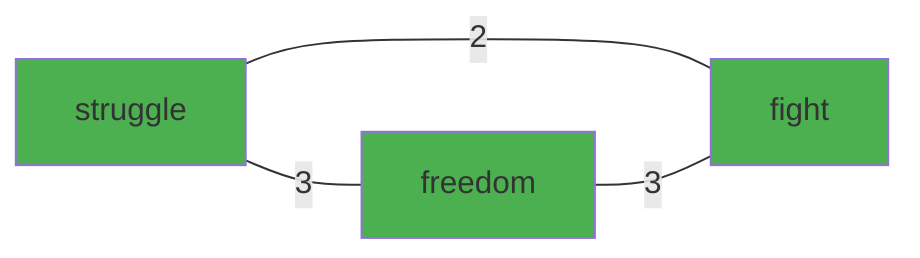
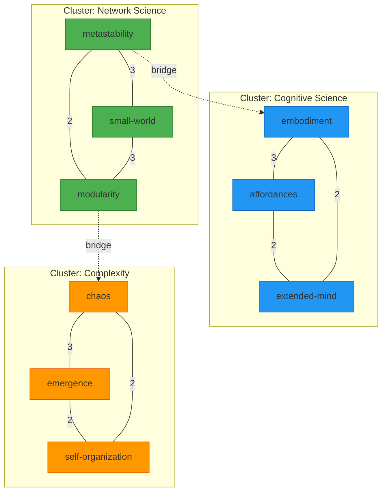

# InfraNodus Whitepapers: Comprehensive Analysis for Weave-NN Implementation

**Research Analysis Date**: 2025-10-23
**Analyzed By**: Research Agent
**Coordination**: claude-flow hooks integration
**Target Implementation**: Obsidian Weave-NN vault

---

## Executive Summary

This analysis examines three InfraNodus whitepapers to extract graph topology techniques, text-to-graph methodologies, and network analysis approaches applicable to Weave-NN implementation in Obsidian using wikilinks, frontmatter, and the Mermaid plugin ecosystem.

**Key Finding**: InfraNodus provides a mature, battle-tested framework (20,000+ users as of 2018) for converting text into network graphs using co-occurrence analysis, community detection, and structural gap identification - all implementable in Obsidian's native graph structure.

---

## Paper 1: InfraNodus - Generating Insight Using Text Network Analysis (WWW '19)

**Citation**: Paranyushkin, D. (2019). InfraNodus: Generating Insight Using Text Network Analysis. WWW '19, San Francisco, USA.

### 1.1 Core Graph Topology Techniques

#### **Text-to-Network Conversion Algorithm**

**Method**: Directed graph construction from word co-occurrence

```
Step 1: Text Normalization
- Convert words to lemmas (morphological root)
- Remove syntax markers (punctuation)
- Retain paragraph structure

Step 2: Stop Words Removal
- Filter liaison words ("is", "are", "the")
- User-adjustable stopword lists
- Optional tf-idf automated generation

Step 3: Network Graph Construction
- Nodes = lemmatized words
- Edges = co-occurrences with weighted proximity

Weighting Scheme:
- Adjacent words (bigrams): weight = 3
- 1 word apart (in 4-gram window): weight = 2
- 2 words apart (in 4-gram window): weight = 1
- Optional paragraph linking: weight = 1
```

**Obsidian Implementation**:
```yaml
# Frontmatter for node metadata
---
word: "struggle"
lemma: "struggle"
betweenness_centrality: 0.42
degree: 15
community: "topic_1"
weight_total: 47
---

# Wikilinks for edges (co-occurrence)
The [[struggle]] for [[freedom]] involves [[ahimsa]]

# Could encode weights via link aliases
[[freedom|weight:3]] [[ahimsa|weight:2]]
```

#### **Betweenness Centrality for Keyword Extraction**

**Algorithm**: Identify nodes (words) appearing most frequently on shortest paths between any two random nodes

**Purpose**: These words are "meaning junctions" - central for discourse circulation

**Example from Gandhi's "Quit India" speech**:
- Top keywords: `struggle`, `ahimsa`, `people`, `freedom`
- These connect different discourse topics

**Obsidian Implementation**:
```dataview
TABLE
  betweenness_centrality as "Influence",
  degree as "Connections",
  community as "Topic Cluster"
FROM #concept
SORT betweenness_centrality DESC
LIMIT 10
```

#### **Community Detection via Modularity Algorithm**

**Method**: Blondel et al. (2008) Fast Unfolding algorithm

**Process**:
1. Identify groups of nodes more densely connected within than to rest of network
2. Iterative algorithm detects topical clusters
3. Apply Force-Atlas layout to visualize communities

**Gandhi Speech Topics Identified**:
1. Green cluster: `struggle`, `freedom`, `fight`
2. Brown cluster: `people`, `british`, `hatred`
3. Light green: `ahimsa`, `resolution`, `faith`
4. Orange: `india`, `present`, `big`

**Obsidian Implementation**:
```yaml
# Frontmatter community assignment
---
community: "topic_1_struggle_freedom"
community_id: 1
modularity_score: 0.42
community_size: 23
---

# Use tags for community membership
#topic/struggle-freedom #cluster/green

# Mermaid visualization


#### **Discourse Structure and Bias Measurement**

**Metrics Used**:

1. **Modularity (M)**: M > 0.4 indicates pronounced community structure
2. **Concentration (C)**: Percentage of words in largest cluster or main component
3. **Entropy (E)**: Shannon entropy of top 4 keyword community distribution

**Discourse States Classification**:

```
DISPERSED:
- High modularity (M > 0.65)
- C < 50% and E >= 1.5
- Multiple weakly related topics

DIVERSIFIED:
- Medium-high modularity (0.6 >= M > 0.4)
- C < 50% and E >= 1.5
- Several well-connected topics

FOCUSED:
- Medium modularity (0.4 > M >= 0.2, E > 0.5)
- OR (M > 0.4, C >= 0.5, 0.25 < E < 0.75)
- One dominant perspective

BIASED:
- Low modularity (M < 0.2)
- No detectable communities
- Single subject dominance
```

**Obsidian Implementation**:
```yaml
# Vault-level discourse analysis frontmatter
---
vault_modularity: 0.58
vault_concentration: 0.42
vault_entropy: 1.7
discourse_state: "diversified"
bias_level: "low"
topic_count: 6
interconnection_quality: "high"
---
```

#### **Structural Gaps for Insight Generation**

**Concept**: Gaps between disconnected communities indicate potential for new ideas (Burt 2009, Noy et al 2012)

**Method**:
1. Identify distinct communities with low inter-community connections
2. Propose bridging concepts to connect gaps
3. Generate insight by linking previously unconnected topics

**Gandhi Example Gap**:
- Cluster A: `british`, `people`, `hatred` (nationalist sentiment)
- Cluster B: `struggle`, `freedom`, `fight` (revolutionary action)
- **Gap Insight**: Tension between hatred for British vs. non-violent revolutionary ideals

**Obsidian Implementation**:
```yaml
# Structural gap note frontmatter
---
note_type: "structural_gap"
community_a: "nationalism_sentiment"
community_b: "revolutionary_action"
gap_strength: 0.73
potential_bridges: ["non-violence", "civil-disobedience", "moral-authority"]
insight_rating: "high"
---

# Content explores the gap
This structural gap reveals tension between [[emotional-nationalism]]
and [[principled-revolution]], bridgeable through [[ahimsa]] philosophy.

# Dataview query to find gaps
```dataview
TABLE
  community_a,
  community_b,
  gap_strength
FROM #structural-gap
WHERE gap_strength > 0.5
SORT gap_strength DESC
```

### 1.2 Advantages Over LDA/word2vec

**Key Differentiators**:

1. **No Training Required**: Works on single documents in real-time
2. **Structural Insight**: Provides topology information (connectivity, gaps, bias)
3. **Intuitive Visualization**: Direct graph representation vs. probability distributions
4. **Narrative Structure**: Shows topic relationships, not just topic clusters
5. **Accessible Math**: Graph theory more intuitive than probabilistic models
6. **Complementary**: Can enhance LDA results with topology data

**Note**: InfraNodus also offers LDA and keyword extraction for comparison

### 1.3 Implementation Stack

**Original InfraNodus**:
- Backend: Node.js, Neo4j graph database
- Frontend: Sigma.js, Cytoscape, Graphology libraries
- Platform: Desktop hosted or cloud-based (infranodus.com)
- License: GPL open-source

**Weave-NN Obsidian Adaptation**:
- Native: Obsidian graph view + Dataview plugin
- Visualization: Mermaid plugin
- Computation: Dataview queries + custom plugins
- Storage: Markdown frontmatter + wikilinks

---

## Paper 2: Direct Visual Feedback on Ideation using Text Network Graphs (2018)

**Citation**: Paranyushkin, D. (2018). Direct Visual Feedback on the Process of Ideation using Text Network Graphs Encourages a more Coherent Expression of Ideas. Nodus Labs.

### 2.1 Research Finding: Graph Visualization Increases Cognitive Coherence

**Experimental Setup** (17 participants, 20-58 age range):

**Stage 1a**: Subjects talk about interest without seeing graph (20 min)
**Stage 1b**: Review text only, can modify
→ Result: 2/17 added content, 2/17 edited

**Stage 1c**: Show graph visualization, can modify
→ Result: 9/17 added content, 5/17 edited
→ **2.5x increase in engagement when seeing graph**

**Stage 2**: Talk about new subject WITH live graph visualization (30 min)
→ Result: All 17 participants actively used graph to guide ideation

### 2.2 Key Behavioral Observations

#### **Filling the Gaps**
When shown graph, participants focused on:
1. **Connecting disconnected clusters**: Adding statements linking separate topic communities
2. **Emphasizing underrepresented nodes**: Strengthening important-but-small concepts

**Quantitative Analysis**:
- Graph density increased after visualization
- Average node degree increased
- **Conclusion**: Visual feedback → increased connectivity

#### **Better Overview**
- 15/17 participants used graph as "objective" representation to compare against subjective intent
- 13/17 reported formulating thoughts more precisely with graph
- 10/17 said **process** of building graph informed understanding more than end result
- 6/17 reported visual shapes provided additional cognitive inspiration

#### **Coherence Metrics**

**Consistent Graph Properties** across participants (mean ± 1 SD):

| Metric | Mean | Std Dev | Interpretation |
|--------|------|---------|----------------|
| Modularity | 0.42 | 0.05 | Distinct communities present |
| Avg Degree | 5.7 | 1.2 | Well-connected nodes |
| Density | 0.25 | 0.04 | Balance of clustering + integration |
| Clustering | 0.42 | 0.08 | High local connectivity |
| Components | 1 | 0 | Fully connected graph |

**Insight**: Well-formed discourse has **small-world topology**:
- High local clustering (distinct topics)
- Short path length (global integration)
- Modularity ≈ 0.4-0.5 (topics distinct but connected)

### 2.3 Implications for Weave-NN

**Real-time Feedback Loop**:
```
User writes → Graph updates → User sees gaps → User connects ideas → More coherent vault
```

**Obsidian Implementation Strategy**:

1. **Live Graph View Integration**
   - Obsidian's native graph already provides real-time visualization
   - Add community detection overlay (custom plugin or CSS)
   - Highlight structural gaps with color coding

2. **Coherence Dashboard**
   ```yaml
   # Daily note frontmatter with vault coherence metrics
   ---
   date: 2025-10-23
   vault_modularity: 0.44
   vault_density: 0.28
   avg_note_degree: 6.2
   discourse_state: "diversified"
   structural_gaps: 3
   recommendations:
     - "Connect [[cognitive-science]] cluster to [[network-analysis]] cluster"
     - "Expand [[embodiment]] concept (only 2 connections)"
   ---
   ```

3. **Gap Detection Automation**
   - Dataview query to identify weakly connected communities
   - Suggest bridging notes based on semantic similarity
   - Track gap-filling progress over time

**Example Dataview Query**:
```dataview
TABLE
  length(file.outlinks) as "Outlinks",
  length(file.inlinks) as "Inlinks",
  community,
  WITHOUT ID file.link
FROM #concept
WHERE length(file.outlinks) + length(file.inlinks) < 3
SORT length(file.outlinks) + length(file.inlinks) ASC
```

### 2.4 Cognitive Benefits of Network Representation

**From Linear to Network Thinking**:

| Text (Linear) | Graph (Network) |
|---------------|-----------------|
| Sequential reading | Spatial navigation |
| One path through content | Multiple reading paths |
| Hidden structure | Visible topology |
| Implicit connections | Explicit relationships |
| Subjective coherence | Measurable coherence |

**Semantic Priming Effect**:
- Words occurring near each other → recognized faster together
- Graph visualization → enhances semantic priming
- Result: Better comprehension + memory retention

**Research Support**:
- Concept maps improve student performance (Hwang et al 2014)
- Mind maps aid learning (Liu et al 2014)
- Network schemas facilitate group learning (Wang et al 2017)

---

## Paper 3: Metastability of Cognition in Body-Mind-Environment Network (2012)

**Citation**: Paranyushkin, D. (2012). Metastability of Cognition in Body-Mind-Environment Network. Nodus Labs.

### 3.1 Core Theoretical Framework

**Metastability**: The ability to maintain several distinct stable states simultaneously while allowing for global integration

**Application Domains**:
1. **Neural Networks**: Brain synchronization patterns
2. **Body Movement**: Coordinated motion dynamics
3. **Social Networks**: Community structures
4. **Cognitive Networks**: Extended mind including environment

### 3.2 Small-World Network Topology

**Brain Network Properties**:
- **High modularity**: Distinct functional regions
- **High local clustering**: Dense intra-module connections
- **Short average path**: Efficient global communication
- **Hub nodes**: Key connectors between modules

**Enables Metastability Through**:
1. **Degeneracy**: Multiple pathways to perform same function (robustness)
2. **Synchronization**: Neural assemblies coordinate via oscillation
3. **Decoupling**: Modules can operate independently
4. **Global integration**: Modules sync across brain for conscious tasks

**Evolution of Brain Networks**:
```
Childhood → Adolescence → Adulthood
Local modules → Bridge building → Distributed integration
High local density → Long-range connections → Balanced topology
Segregation → Integration → Metastability
```

### 3.3 Synchronization as Communication Mechanism

**Frequency Bands**:

| Frequency | Range | Function | State |
|-----------|-------|----------|-------|
| Delta | 1.5-6 Hz | Motivation, inhibition | Deep sleep, meditation |
| Theta | 4-8 Hz | Memory, emotion | Drowsiness, meditation |
| Alpha | 8-12 Hz | Relaxation, attention gate | Wakeful rest |
| Beta | 12-30 Hz | Active thinking, focus | Alert, working |
| Gamma | 30-80 Hz | Conscious integration | Perception, motor response |

**Cognitive Tasks**:
- **Resting state**: Low-frequency ongoing activity (continuous fluctuation)
- **Face recognition**: High gamma synchronization across long distances
- **Motor response**: Gamma spike + temporary desynchronization for state transition
- **Sleep/REM**: Lower frequencies for memory consolidation

**Metastable Dynamics**:
```
State 1 (cognitive task) → Desynchronization → State 2 (motor response)
              ↑                                           ↓
              ←── Chaotic itinerancy (variability) ───────┘
```

### 3.4 Psychological Disorders as Topology Disruptions

**Small-World Breakdown**:

| Condition | Topology Change | Effect |
|-----------|----------------|---------|
| Schizophrenia | → Random (lower clustering, shorter path) | Disconnection syndrome, reduced segregation/integration balance |
| Alzheimer's | → Random (randomization) | Loss of modularity, global sync failure |
| Autism | → Regular (high local, low global) | Over-clustering, reduced integration |
| ADHD | → Regular (increased local, decreased global) | Local efficiency up, global efficiency down |
| Depression | Delta ↑, Beta ↓ | Inhibition up, active state down |
| Anxiety | Alpha ↑, Delta ↓ | Breaking between frequencies |

**Drug Effects on Topology**:

**MDMA**:
- Delta (1.5-6 Hz) ↓ (disinhibition in frontal cortex)
- Beta-3 (21.5-30 Hz) ↑ (attention, vigilance)
- Long-term: Disrupts synchronization, neuronal damage

**Cannabis**:
- Clustering ↑ (more local connections)
- Global efficiency ↓ (less inter-community sync)
- Effect: Enhanced intra-regional focus, reduced integration (short-term memory issues)

### 3.5 Extended Cognition: Body-Mind-Environment Network

**Key Concepts**:

1. **Affordances** (Gibson 1979): Environmental features that afford action possibilities
   - Relations between abilities and environment features
   - Dynamically perceived, not internally represented
   - "The world is its own best model" (Brooks)

2. **Embodied Cognition**:
   - Concepts are sensorimotor neural activation patterns
   - Body morphology aids cognition (e.g., soft fingertips = tactile processing)
   - Thinking occurs through movement and interaction

3. **Extended Mind** (Clark 2008):
   - Cognitive processes include environment manipulation
   - Tools, symbols, social interactions = parts of cognitive network
   - "We self-engineer ourselves to think better in our worlds"

4. **Actor-Network Theory** (Latour):
   - Social includes human relations + objects + concepts
   - Each element is a network interacting with other networks
   - Focus on relationships, not entities

**Chaotic Dynamics in Body**:
- Standing still: Chaotic swaying (1/f pink noise) → optimal information receptivity
- Cognitive tasks: 1/f fluctuations maintained
- Emotional distress: Shift to white noise (decoupling, seeking new equilibrium)
- Healthy heartbeat: Chaotic variability

### 3.6 Social Networks and Metastability

**Small-World Social Networks Enable**:
- **Endemic opinions**: Distinct communities retain different beliefs
- **Global mobilization**: Short paths allow network-wide coordination
- **Robustness**: Modularity limits rumor spread, prevents global oscillations

**Optimal Structure**:
```
Multiple distinct groups (communities)
     ↓
Connected via hub + peripheral bridges
     ↓
Enables heterogeneity + integration
     ↓
Metastability: multiple stable states + global sync capability
```

**Problems with Over-Connection** (Singularity):
- Scale-free topology (few superhubs, many weak nodes)
- **Filter bubbles**: Dense intra-community, hub-mediated inter-community
- Homogeneous opinions within communities
- Reduced metastability, prone to rapid global shifts
- **Comparable to schizophrenia topology in brain networks**

**Polysingularity Proposal**:
- Embrace ubiquitous computing BUT maintain small-world topology
- Preserve distinct communities with heterogeneity
- Enable global integration without hub dependence
- **Use body/physical limitations as "space constraint" to prevent over-connection**

### 3.7 Implications for Weave-NN

**Vault as Extended Cognitive Network**:

```
Neural Network (thoughts)
       ↓
Body (movement, embodiment practices)
       ↓
Environment (affordances, tools, social context)
       ↓
Obsidian Vault (externalized network topology)
```

**Design Principles**:

1. **Maintain Small-World Topology**
   ```yaml
   # Vault health metrics
   ---
   modularity: 0.45  # Sweet spot: 0.4-0.6
   avg_clustering: 0.38
   avg_path_length: 3.2
   communities: 8
   largest_component: 0.48  # < 50% for metastability
   topology_state: "diversified"
   ---
   ```

2. **Prevent Over-Connection**
   - Limit notes to 5-10 outgoing wikilinks (mimics space/energy constraints)
   - Encourage distinct topic communities (folders/tags)
   - Build inter-community bridges thoughtfully, not exhaustively

3. **Enable Chaotic Variability**
   - Rotate between different note-taking contexts (topics)
   - Allow temporary disconnection (unlinked notes) before integration
   - Use daily notes for "ongoing activity" (like resting brain state)

4. **Cognitive Rhythm Awareness**
   ```yaml
   # Session metadata
   ---
   cognitive_state: "focused_work"  # vs "exploratory", "integrative"
   frequency_band: "beta"  # Active thinking
   vault_interaction: "deep_dive"  # vs "broad_survey", "bridge_building"
   ---
   ```

5. **Structural Gap Tracking**
   - Identify disconnected communities (potential insights)
   - Track "white noise" periods (emotional/cognitive distress) as disconnect-and-search phases
   - Facilitate "creative leaps" by bridging gaps

**Example Implementation**:
```yaml
# Note: cognitive-load-theory.md
---
community: "psychology"
degree: 7
betweenness: 0.31
structural_gaps:
  - target_community: "network_science"
    potential_bridges: ["small-world-networks", "information-theory"]
  - target_community: "embodied_cognition"
    potential_bridges: ["working-memory", "sensorimotor"]
chaos_metric: 0.72  # 1/f noise indicator
connection_rhythm: "exploring"  # vs "consolidating"
---

## Cognitive Load Theory

[[working-memory]] capacity limits...

## Potential Bridges
- How do [[small-world-networks]] relate to working memory distribution?
- Connection to [[embodied-cognition]]: physical constraints shape cognitive load
```

---

## Implementation Roadmap for Weave-NN

### Phase 1: Foundation (Manual Process)

**Frontmatter Schema**:
```yaml
---
# Node properties
word: "metastability"
lemma: "metastable"
note_type: "concept"  # vs "structural_gap", "bridge", "hub"

# Network metrics (manually assessed initially)
degree: 8
community: "network_science"
community_id: 3

# Text network properties
co_occurs_with: ["synchronization", "modularity", "chaos"]
weight_total: 23

# Coherence tracking
last_review: 2025-10-23
connection_quality: "well-integrated"  # vs "isolated", "over-connected"
---
```

**Manual Workflow**:
1. Write note with wikilinks for co-occurrence
2. Use Obsidian graph view to visually assess clustering
3. Update frontmatter based on observation
4. Use Dataview to query structural gaps

### Phase 2: Automation (Plugin Development)

**Plugin: "Weave-NN Topology Analyzer"**

Features:
1. **Automatic Metrics Calculation**
   - Parse vault graph structure
   - Calculate betweenness centrality, degree, modularity
   - Detect communities (Louvain algorithm)
   - Update frontmatter automatically

2. **Discourse State Dashboard**
   - Display vault-wide coherence metrics
   - Classify state: dispersed/diversified/focused/biased
   - Highlight structural gaps on graph
   - Suggest bridging notes

3. **Real-time Feedback**
   - As you type, show co-occurring concepts
   - Visualize which community note belongs to
   - Alert when note is isolated (low degree)
   - Celebrate bridge-building (connecting communities)

4. **Metastability Monitor**
   - Track evolution of vault topology over time
   - Alert if modularity drifting toward random (over-connection) or regular (isolation)
   - Suggest notes to add/remove links based on optimal range

### Phase 3: Enhanced Visualization (Mermaid + Custom CSS)

**Community Detection Visualization**:


**Structural Gap Highlight**:
- Use CSS to color-code communities in Obsidian graph view
- Animate weakly-connected community bridges
- Size nodes by betweenness centrality

### Phase 4: Integration with Thought Tools

**Connections**:
- **Zettelkasten**: Each note = node with unique ID, wikilinks = edges
- **MOCs**: MOCs become hub nodes (high betweenness centrality)
- **Daily Notes**: Resting state "ongoing activity" - feeds into main graph
- **Literature Notes**: Source material nodes with community affiliations

**Workflow Enhancement**:
```
Read literature → Create lit note → Tag community →
Link to existing concepts → Plugin detects community →
Suggests structural gaps → You bridge gap → Insight generated
```

---

## Key Takeaways for Obsidian Implementation

### **1. Text-to-Graph via Wikilinks**
- **Wikilinks = co-occurrence edges** (proximity weight implicit in sentence/paragraph)
- **Frontmatter = node metadata** (degree, centrality, community)
- **Tags = community membership** (#topic/network-science)

### **2. Community Detection**
- Use Obsidian's native graph clustering
- Enhance with plugin: Louvain/Blondel algorithm for modularity detection
- Visualize with color-coded communities (Mermaid + CSS)

### **3. Betweenness Centrality**
- Identify hub notes connecting multiple communities
- These are "meaning junctions" = MOCs or key concepts
- Query with Dataview: `WHERE betweenness > threshold`

### **4. Structural Gaps = Insight Opportunities**
- Look for weakly connected communities
- Plugin highlights potential bridges
- Creating gap-bridging notes → creative leaps

### **5. Discourse Coherence Metrics**
- **Modularity ~0.4-0.6**: Optimal (diversified discourse)
- **Modularity <0.3**: Biased (single perspective dominates)
- **Modularity >0.7**: Dispersed (disconnected topics)

### **6. Real-time Feedback Loop**
- **17-person study showed 2.5x engagement** with graph visualization
- Live graph → encourages connection-making → more coherent vault
- Process of building > end result

### **7. Metastability Principles**
- **Small-world topology**: High local clustering + short global paths
- **Distinct communities + integration**: Enables multiple stable states
- **Avoid over-connection**: Preserve heterogeneity (polysingularity not singularity)
- **Space constraints**: Limit links per note (mimics brain's physical constraints)

### **8. Extended Cognition**
- Vault = externalized cognitive network
- Notes + body practices + environment = integrated system
- Track cognitive states (frontmatter: `cognitive_state`, `frequency_band`)
- Use chaos metrics (1/f noise during focus, white noise during stress)

---

## Recommended Next Steps

1. **Implement Frontmatter Schema** (this week)
   - Add network metadata template to all new notes
   - Backfill key existing notes

2. **Create Dataview Queries** (this week)
   - Top concepts by centrality
   - Isolated notes (degree < 3)
   - Community membership summaries

3. **Manual Community Tagging** (next 2 weeks)
   - Review graph view, identify natural clusters
   - Tag notes with community membership
   - Document structural gaps

4. **Develop Topology Plugin** (next month)
   - Auto-calculate metrics
   - Community detection algorithm
   - Gap identification + bridge suggestions

5. **Build Coherence Dashboard** (next month)
   - Vault-wide metrics display
   - Evolution tracking over time
   - Metastability monitoring

6. **Enhanced Visualization** (next 2 months)
   - Mermaid templates for community graphs
   - CSS for graph view community coloring
   - Animation for structural gaps

---

## References

**InfraNodus Papers**:
1. Paranyushkin, D. (2019). InfraNodus: Generating Insight Using Text Network Analysis. WWW '19.
2. Paranyushkin, D. (2018). Direct Visual Feedback on the Process of Ideation. Nodus Labs.
3. Paranyushkin, D. (2012). Metastability of Cognition in Body-Mind-Environment Network. Nodus Labs.

**Key Algorithms**:
- Blondel et al. (2008): Fast Unfolding Community Detection
- Brandes (2001): Betweenness Centrality Algorithm
- Jacomy et al. (2009): ForceAtlas2 Layout

**Theoretical Foundation**:
- Gibson (1979): Ecological Approach, Affordances
- Clark (2008): Extended Mind Thesis
- Latour (2011): Actor-Network Theory
- Burt (2009): Structural Holes
- Noy et al. (2012): Creative Leaps

**Network Science**:
- Watts & Strogatz (1998): Small-World Networks
- Barabási (2006): Network Science
- Sporns (2010): Networks of the Brain

---

**Analysis completed**: 2025-10-23
**Coordination session**: task-1761202166492-tkx95jyi9
**Next action**: Review with coordination system + planning agent
