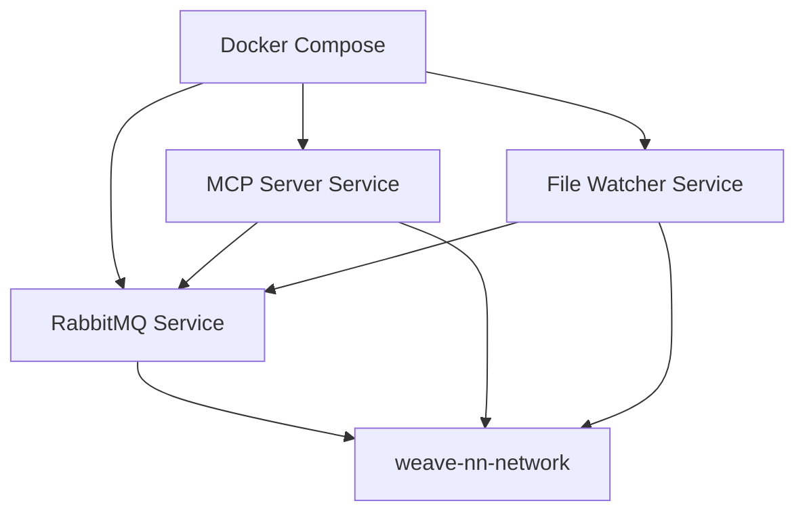

# Docker Compose

## Overview

Multi-container orchestration tool for defining and running multi-service Docker applications. Replaces Kubernetes complexity for Weave-NN MVP local deployment.

## Category

**Tool / Container Orchestration**

## Why We Use It

**Primary reasons**:
1. **Single-file configuration** - `docker-compose.yml` defines entire stack
2. **Service dependencies** - Ensures RabbitMQ starts before MCP server
3. **Network isolation** - Automatic service discovery via DNS
4. **Volume management** - Named volumes for persistence
5. **Development workflow** - `docker-compose up` starts everything

**Specific to Weave-NN MVP**:
- Orchestrates 3 services: RabbitMQ, MCP server, file watcher
- Manages inter-service networking
- Configures persistent volumes
- Simplifies client deployment (single command)

## Key Capabilities

### Core Features
- **Service definitions** - Declarative multi-container apps
- **Dependency management** - `depends_on` ensures startup order
- **Environment variables** - `.env` file support
- **Health checks** - Wait for service readiness
- **Logging** - Centralized log aggregation
- **Scaling** - `docker-compose up --scale mcp=3` (future)

### Developer Experience
- **Single command deployment** - `docker-compose up -d`
- **Easy updates** - `docker-compose pull && docker-compose up -d`
- **Debugging** - `docker-compose logs -f <service>`
- **Cleanup** - `docker-compose down -v` removes everything

## Integration Points



**Integration with**:
- [[docker]] - Container runtime
- [[rabbitmq]] - Message broker service
- [[mcp-server]] - API server service
- [[watchdog-file-monitoring]] - File watcher service

## Configuration

### Phase 7: docker-compose.yml

```yaml
version: '3.8'

services:
  rabbitmq:
    image: rabbitmq:3.12-management
    container_name: weave-nn-rabbitmq
    restart: unless-stopped
    ports:
      - "5672:5672"   # AMQP
      - "15672:15672" # Management UI
    environment:
      RABBITMQ_DEFAULT_USER: ${RABBITMQ_USER:-admin}
      RABBITMQ_DEFAULT_PASS: ${RABBITMQ_PASS:-weave-nn-2025}
    volumes:
      - rabbitmq_data:/var/lib/rabbitmq
    networks:
      - weave-nn-network
    healthcheck:
      test: ["CMD", "rabbitmq-diagnostics", "ping"]
      interval: 30s
      timeout: 10s
      retries: 5

  mcp-server:
    build:
      context: .
      dockerfile: Dockerfile.mcp
    container_name: weave-nn-mcp
    restart: unless-stopped
    ports:
      - "8000:8000"
    environment:
      RABBITMQ_URL: amqp://${RABBITMQ_USER:-admin}:${RABBITMQ_PASS:-weave-nn-2025}@rabbitmq:5672
      OBSIDIAN_API_URL: ${OBSIDIAN_API_URL}
      OBSIDIAN_API_KEY: ${OBSIDIAN_API_KEY}
      VAULT_PATH: /vault
      SHADOW_CACHE_DB: /cache/metadata.db
    volumes:
      - ${VAULT_PATH}:/vault:ro
      - shadow_cache:/cache
    networks:
      - weave-nn-network
    depends_on:
      rabbitmq:
        condition: service_healthy
    healthcheck:
      test: ["CMD", "curl", "-f", "http://localhost:8000/health"]
      interval: 30s
      timeout: 10s
      retries: 3

  file-watcher:
    build:
      context: .
      dockerfile: Dockerfile.watcher
    container_name: weave-nn-file-watcher
    restart: unless-stopped
    environment:
      RABBITMQ_URL: amqp://${RABBITMQ_USER:-admin}:${RABBITMQ_PASS:-weave-nn-2025}@rabbitmq:5672
      VAULT_PATH: /vault
    volumes:
      - ${VAULT_PATH}:/vault:ro
    networks:
      - weave-nn-network
    depends_on:
      rabbitmq:
        condition: service_healthy

volumes:
  rabbitmq_data:
    driver: local
  shadow_cache:
    driver: local

networks:
  weave-nn-network:
    driver: bridge
```

### .env File

```bash
# weave-nn/.env
VAULT_PATH=/home/aepod/dev/weave-nn/weave-nn
OBSIDIAN_API_URL=https://localhost:27124
OBSIDIAN_API_KEY=your-api-key-here

RABBITMQ_USER=admin
RABBITMQ_PASS=weave-nn-2025
```

### Deployment Commands

```bash
# Start all services
docker-compose up -d

# View logs
docker-compose logs -f          # All services
docker-compose logs -f mcp-server  # Single service

# Check status
docker-compose ps

# Restart service
docker-compose restart mcp-server

# Stop all services
docker-compose stop

# Remove containers and volumes
docker-compose down -v

# Pull latest images
docker-compose pull

# Rebuild images
docker-compose build --no-cache
```

## Alternatives Considered

### Kubernetes
- **Pro**: Enterprise-grade, auto-scaling, self-healing
- **Con**: Massive overkill for MVP (single-user, 3 services)
- **Verdict**: Rejected - Docker Compose is 100x simpler for MVP

### Systemd Services
- **Pro**: Native Linux service management
- **Con**: Not cross-platform, manual dependency management
- **Verdict**: Rejected - Need macOS/Windows support

### Shell Scripts
- **Pro**: Simple, no dependencies
- **Con**: No declarative config, difficult to maintain
- **Verdict**: Rejected - Docker Compose is more robust

### Kubernetes (K3s/Minikube)
- **Pro**: Lighter than full K8s, better than shell scripts
- **Con**: Still overkill for 3 services on single machine
- **Verdict**: Rejected - Docker Compose is sufficient

## Decision Reference

**[[mvp-local-first-architecture]]** - Deployment Strategy
> "Docker Compose for MVP deployment (RabbitMQ, MCP server, file watcher)"

**[[phase-4a-decision-closure]]** - Technology Choices
> "Use Docker Compose (not Kubernetes) for local-first MVP"

**Rationale**: Kubernetes is overkill for single-user, local deployment with 3 services. Docker Compose provides 90% of the benefits with 10% of the complexity.

## Learning Resources

### Official Documentation
- Docker Compose Docs: https://docs.docker.com/compose/
- Compose File Reference: https://docs.docker.com/compose/compose-file/
- Environment Variables: https://docs.docker.com/compose/environment-variables/
- Networking: https://docs.docker.com/compose/networking/

### Tutorials
- Get Started Guide: https://docs.docker.com/compose/gettingstarted/
- Multi-Container Apps: https://docs.docker.com/compose/wordpress/
- Production Guide: https://docs.docker.com/compose/production/

### Best Practices
- Health Checks: https://docs.docker.com/compose/compose-file/compose-file-v3/#healthcheck
- Secrets Management: https://docs.docker.com/compose/use-secrets/
- Performance Tuning: https://docs.docker.com/compose/performance/

## Phase Usage

### Phase 7: MVP Week 2 - Automation & Deployment
- **Day 1**: Create docker-compose.yml
- **Day 2**: Add health checks and dependencies
- **Day 3**: Test deployment workflow
- **Day 4**: Client deployment documentation
- **Day 5**: Production configuration

## Service Dependency Graph

```
rabbitmq (starts first)
    ↓ (waits for health check)
mcp-server (starts second)
    ↓ (depends on rabbitmq)
file-watcher (starts third)
    ↓ (depends on rabbitmq)
```

## Client Deployment

```bash
# Clone repository
git clone https://github.com/user/weave-nn.git
cd weave-nn

# Configure environment
cp .env.example .env
nano .env  # Edit OBSIDIAN_API_KEY, VAULT_PATH

# Deploy
docker-compose up -d

# Verify
docker-compose ps
curl http://localhost:8000/health
curl http://localhost:15672  # RabbitMQ UI
```

## Migration Path

**Current (MVP)**: Docker Compose on single machine
**Future (v1.0)**: Still Docker Compose (add monitoring stack)
**Future (v2.0)**: Kubernetes if scaling to multi-user SaaS

## Notes

- **Health checks are critical** - Prevents cascading failures
- **Named volumes persist data** - Use `-v` flag carefully in `down`
- **Service names are DNS** - MCP server can connect to `rabbitmq:5672`
- **Rebuild after Dockerfile changes** - `docker-compose build`
- **Use .env for secrets** - Never commit credentials to git
