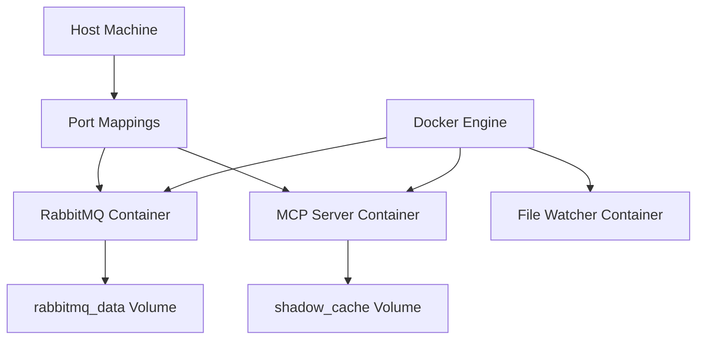

# Docker

## Overview

Containerization platform for packaging and deploying applications with dependencies. Used for RabbitMQ deployment and optional MCP server containerization in Weave-NN MVP.

## Category

**Platform / Containerization**

## Why We Use It

**Primary reasons**:
1. **RabbitMQ deployment** - Clean, reproducible message broker setup
2. **Dependency isolation** - No conflicts with system packages
3. **Easy deployment** - Single `docker run` command
4. **Cross-platform** - Works on Linux, macOS, Windows (WSL2)
5. **Production-ready** - Same containers in dev and prod

**Specific to Weave-NN**:
- RabbitMQ message broker (Docker container)
- Optional: MCP server containerization (Phase 7)
- Optional: File watcher service (Phase 7)
- Future: Docker Compose for multi-service orchestration

## Key Capabilities

### Core Features
- **Image-based deployment** - Pre-built, versioned containers
- **Volume mounting** - Persistent data storage
- **Port mapping** - Expose services to host
- **Restart policies** - Auto-recovery on failure
- **Resource limits** - CPU and memory constraints
- **Networking** - Container-to-container communication

### Developer Experience
- **Fast startup** - Containers launch in seconds
- **Immutable infrastructure** - Rebuild vs patch
- **Version control** - Image tags (rabbitmq:3-management)
- **Easy cleanup** - `docker rm` removes everything

## Integration Points



**Integration with**:
- [[rabbitmq]] - Primary use case (message broker)
- [[docker-compose]] - Multi-service orchestration
- [[mcp-server]] - Optional containerization
- [[watchdog-file-monitoring]] - Optional containerization

## Configuration

### Phase 0: Docker Installation

```bash
# Install Docker (Ubuntu/WSL2)
curl -fsSL https://get.docker.com -o get-docker.sh
sudo sh get-docker.sh

# Add user to docker group (avoid sudo)
sudo usermod -aG docker $USER
newgrp docker

# Verify installation
docker --version
docker run hello-world
```

### Phase 0: RabbitMQ Deployment

```bash
# Deploy RabbitMQ with management UI
docker run -d \
  --name rabbitmq \
  --restart unless-stopped \
  -p 5672:5672 \
  -p 15672:15672 \
  -e RABBITMQ_DEFAULT_USER=admin \
  -e RABBITMQ_DEFAULT_PASS=weave-nn-2025 \
  -v rabbitmq_data:/var/lib/rabbitmq \
  rabbitmq:3-management

# Verify deployment
docker ps | grep rabbitmq
docker logs rabbitmq
curl http://localhost:15672  # Management UI
```

### Phase 7: MCP Server Containerization (Optional)

```dockerfile
# Dockerfile for MCP server
FROM python:3.11-slim

WORKDIR /app

# Install dependencies
COPY requirements.txt .
RUN pip install --no-cache-dir -r requirements.txt

# Copy application code
COPY weave-nn-mcp/ ./weave-nn-mcp/

# Expose MCP server port
EXPOSE 8000

# Run server
CMD ["uvicorn", "weave-nn-mcp.server.main:app", "--host", "0.0.0.0", "--port", "8000"]
```

```bash
# Build and run MCP server container
docker build -t weave-nn-mcp:latest .
docker run -d \
  --name weave-nn-mcp \
  --restart unless-stopped \
  -p 8000:8000 \
  -v $(pwd)/vault:/vault:ro \
  -v shadow_cache:/app/cache \
  --env-file .env \
  weave-nn-mcp:latest
```

### Docker Compose (Phase 7)

See [[docker-compose]] for multi-service orchestration with RabbitMQ + MCP server + File watcher.

## Alternatives Considered

### Podman
- **Pro**: Rootless, daemonless, Docker-compatible
- **Con**: Less mature on macOS/Windows, smaller ecosystem
- **Verdict**: Considered for future, Docker is safer bet for MVP

### Native Installation
- **Pro**: No containerization overhead
- **Con**: Difficult to reproduce environment, version conflicts
- **Verdict**: Rejected - Docker isolation is worth minimal overhead

### Kubernetes
- **Pro**: Enterprise-grade orchestration
- **Con**: Massive overkill for MVP (single-user, local deployment)
- **Verdict**: Rejected - Use Docker Compose instead

### Systemd Services
- **Pro**: Native Linux service management
- **Con**: Platform-specific, no Windows/macOS support
- **Verdict**: Rejected - Need cross-platform solution

## Decision Reference

**[[phase-0-pre-development-work]]** - Prerequisites
> "Deploy RabbitMQ using Docker container"

**[[mvp-local-first-architecture]]** - Deployment Strategy
> "Docker Compose for MVP deployment (RabbitMQ, MCP server, file watcher)"

**Rationale**: Docker provides clean, reproducible deployments without the complexity of Kubernetes or fragility of native installations. RabbitMQ official Docker images are well-maintained and production-ready.

## Learning Resources

### Official Documentation
- Docker Docs: https://docs.docker.com/
- Docker CLI Reference: https://docs.docker.com/engine/reference/commandline/cli/
- Dockerfile Best Practices: https://docs.docker.com/develop/develop-images/dockerfile_best-practices/
- Docker Volumes: https://docs.docker.com/storage/volumes/

### Getting Started
- Docker Tutorial: https://docs.docker.com/get-started/
- Docker for Python: https://docs.docker.com/language/python/
- Multi-stage Builds: https://docs.docker.com/build/building/multi-stage/

### Production Best Practices
- Security: https://docs.docker.com/engine/security/
- Logging: https://docs.docker.com/config/containers/logging/
- Health Checks: https://docs.docker.com/engine/reference/builder/#healthcheck

## Phase Usage

### Phase 0: Pre-Development Work
- Install Docker Desktop or Docker Engine
- Verify Docker is running
- Deploy RabbitMQ container
- Test port mappings and volumes

### Phase 5: Claude-Flow MCP Integration
- Validate RabbitMQ container is healthy
- Use `docker logs` for debugging
- Access RabbitMQ management UI

### Phase 6: MVP Week 1 - Backend Infrastructure
- Optional: Containerize MCP server
- Create Dockerfile with best practices
- Test container builds locally

### Phase 7: MVP Week 2 - Automation & Deployment
- Create Docker Compose configuration
- Set up restart policies
- Configure logging drivers
- Production deployment testing

## Common Commands

```bash
# List running containers
docker ps

# View container logs
docker logs rabbitmq -f  # Follow logs

# Execute command in container
docker exec -it rabbitmq bash

# Stop container
docker stop rabbitmq

# Start stopped container
docker start rabbitmq

# Remove container
docker rm -f rabbitmq

# View container resource usage
docker stats rabbitmq

# Inspect container details
docker inspect rabbitmq

# View volumes
docker volume ls
docker volume inspect rabbitmq_data
```

## Volume Management

```bash
# Create named volume
docker volume create rabbitmq_data

# Backup volume
docker run --rm \
  -v rabbitmq_data:/data \
  -v $(pwd):/backup \
  busybox tar czf /backup/rabbitmq-backup.tar.gz /data

# Restore volume
docker run --rm \
  -v rabbitmq_data:/data \
  -v $(pwd):/backup \
  busybox tar xzf /backup/rabbitmq-backup.tar.gz -C /
```

## Debugging

### Container Won't Start
```bash
# Check container logs
docker logs rabbitmq

# Check Docker daemon status
sudo systemctl status docker

# View all containers (including stopped)
docker ps -a
```

### Port Conflicts
```bash
# Check what's using port 5672
sudo lsof -i :5672

# Use different port mapping
docker run -p 5673:5672 rabbitmq:3-management
```

### Volume Permissions
```bash
# Check volume mount
docker inspect rabbitmq | grep -A 10 Mounts

# Fix permissions
docker exec -it rabbitmq chown -R rabbitmq:rabbitmq /var/lib/rabbitmq
```

## Performance Characteristics

- **Overhead**: <5% CPU, <100MB memory per container
- **Startup time**: 2-5 seconds for typical containers
- **Network**: Near-native performance with bridge networking
- **Disk I/O**: Slightly slower than native (use volumes for perf)

**For Weave-NN MVP**:
- RabbitMQ container: ~200MB memory
- MCP server container: ~100MB memory
- Negligible performance impact for <1000 events/day

## Migration Path

**Current (MVP)**: Docker containers with manual deployment
**Future (v1.0)**: Docker Compose for multi-service orchestration
**Future (v2.0)**: Kubernetes if scaling to multi-user SaaS

## Notes

- **Use named volumes for persistence** - Never store data in containers
- **Set restart policies** - `--restart unless-stopped` for services
- **Pin image versions** - `rabbitmq:3.12-management` not `latest`
- **Use .dockerignore** - Exclude .venv, node_modules, .git
- **Multi-stage builds** - Keep images small (separate build and runtime stages)
- **Health checks** - Add HEALTHCHECK to Dockerfiles for monitoring
