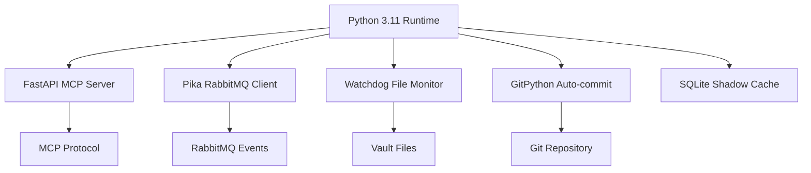

# Python 3.11+

## Overview

Python 3.11 is the runtime environment for the entire Weave-NN backend infrastructure, chosen for its async capabilities, mature ecosystem, and MCP SDK support.

## Category

**Language / Runtime Environment**

## Why We Use It

**Primary reasons**:
1. **MCP SDK support** - Official Python SDK for Model Context Protocol
2. **Async/await native** - Critical for concurrent file watching, event processing, and API handling
3. **Mature ecosystem** - Rich libraries for FastAPI, RabbitMQ (Pika), Git (GitPython), file watching (Watchdog)
4. **Type hints** - Better IDE support and early error detection
5. **Performance** - Python 3.11 is 10-60% faster than 3.10 (PEP 659)

**Specific to Weave-NN**:
- All MCP server code
- Claude-Flow agent orchestration
- File system monitoring
- Event processing
- Git automation
- Shadow cache management

## Key Capabilities

- **Async I/O** - `asyncio` for concurrent operations
- **Type annotations** - `typing` module for static type checking
- **Standard library** - Comprehensive built-in modules (pathlib, json, yaml)
- **Package ecosystem** - PyPI with 450,000+ packages
- **Cross-platform** - Linux, macOS, Windows support
- **Virtual environments** - `.venv` for dependency isolation

## Integration Points



**Integration with**:
- [[fastapi]] - Web framework for MCP server
- [[pika-rabbitmq-client]] - Message queue client
- [[watchdog-file-monitoring]] - File system events
- [[gitpython]] - Git automation
- [[sqlite]] - Embedded database

## Configuration

### Phase 0: Environment Setup

```bash
# Install Python 3.11+
sudo apt install python3.11 python3.11-venv python3.11-dev

# Verify version
python3.11 --version  # Should show 3.11.0 or higher

# Create virtual environment
cd /home/aepod/dev/weave-nn/weave-nn
python3.11 -m venv .venv

# Activate virtual environment
source .venv/bin/activate

# Upgrade pip
pip install --upgrade pip setuptools wheel
```

### Phase 5: Core Dependencies

```bash
# Install MVP dependencies
pip install \
  fastapi==0.104.1 \
  uvicorn[standard]==0.24.0 \
  pika==1.3.2 \
  watchdog==3.0.0 \
  gitpython==3.1.40 \
  pyyaml==6.0.1 \
  python-dotenv==1.0.0 \
  fastmcp==0.1.0
```

### Development Tools

```bash
# Install dev dependencies
pip install \
  black==23.11.0 \
  isort==5.12.0 \
  pylint==3.0.2 \
  mypy==1.7.0 \
  pytest==7.4.3 \
  pytest-asyncio==0.21.1
```

## Alternatives Considered

### Node.js/TypeScript
- **Pro**: Better WebSocket support, frontend/backend code sharing
- **Con**: MCP SDK less mature, async I/O more complex than Python
- **Verdict**: Rejected - Python's MCP SDK is official and well-documented

### Go
- **Pro**: Superior performance, built-in concurrency
- **Con**: No official MCP SDK, smaller ecosystem for AI/ML tools
- **Verdict**: Rejected - Not worth building custom MCP implementation

### Rust
- **Pro**: Best performance, memory safety
- **Con**: Steeper learning curve, no MCP SDK, slower development
- **Verdict**: Rejected - Overkill for MVP, premature optimization

## Decision Reference

**[[phase-4a-decision-closure]]** - Decision TS-3: Backend Architecture
> "TS-3: Backend Architecture → Python FastAPI + MCP ✅"

**Rationale**: Python's official MCP SDK, combined with FastAPI's async capabilities and mature ecosystem (Pika, Watchdog, GitPython), made it the clear choice for rapid MVP development.

## Learning Resources

### Official Documentation
- Python 3.11 Docs: https://docs.python.org/3.11/
- What's New in 3.11: https://docs.python.org/3.11/whatsnew/3.11.html
- Async I/O Guide: https://docs.python.org/3.11/library/asyncio.html

### Ecosystem Resources
- FastAPI Tutorial: https://fastapi.tiangolo.com/tutorial/
- Pika Documentation: https://pika.readthedocs.io/
- Watchdog Guide: https://python-watchdog.readthedocs.io/
- GitPython Docs: https://gitpython.readthedocs.io/

### Performance & Best Practices
- PEP 659 (Specializing Adaptive Interpreter): https://peps.python.org/pep-0659/
- Python Async Best Practices: https://realpython.com/async-io-python/
- Type Hints Cheat Sheet: https://mypy.readthedocs.io/en/stable/cheat_sheet_py3.html

## Phase Usage

### Phase 0: Pre-Development Work
- Install Python 3.11+
- Create virtual environment
- Install core dependencies
- Validate environment

### Phase 5: Claude-Flow MCP Integration
- Implement MCP server core
- Set up FastAPI application
- Configure async event loop
- Implement type-hinted interfaces

### Phase 6: MVP Week 1 - Backend Infrastructure
- File system monitoring with async handlers
- RabbitMQ event publishers/consumers
- Git automation workflows
- Shadow cache queries

### Phase 7: MVP Week 2 - Automation & Deployment
- Test suite (pytest)
- Linting and type checking (mypy)
- Docker container packaging
- Production deployment scripts

## Version Requirements

- **Minimum**: Python 3.11.0
- **Recommended**: Python 3.11.6+ (latest bugfix release)
- **Maximum**: Python 3.12.x (compatibility tested)
- **Blocked**: Python 3.10 or earlier (missing performance optimizations)

## Migration Path

**Current (MVP)**: Python 3.11 with standard library + FastAPI
**Future (v1.0)**: Same stack, add advanced libraries (SQLAlchemy, Celery)
**Future (v2.0)**: Consider Python 3.13 for additional performance gains

## Notes

- **Virtual environment is REQUIRED** - Never install packages globally
- **Activate .venv before any pip commands** - Prevents dependency conflicts
- **Use requirements.txt** - Pin exact versions for reproducibility
- **Type hints everywhere** - Enables mypy static analysis
- **Async by default** - Use `async def` for I/O operations
