# Phase 6 Architecture - Visual Diagrams

## System Architecture (High-Level)

## Data Flow

```mermaid
sequenceDiagram
    participant User
    participant CLI
    participant Detector
    participant Scanner
    participant Parser
    participant Analyzer
    participant Generator
    participant Writer
    participant Cache
    participant Git

    User->>CLI: weaver-init init
    CLI->>Detector: Detect framework
    Detector-->>CLI: Next.js detected

    CLI->>Scanner: Scan directory
    Scanner-->>CLI: File list (1000 files)

    CLI->>Parser: Parse TypeScript files
    Parser-->>CLI: AST nodes (150 components)

    CLI->>Analyzer: Analyze relationships
    Analyzer-->>CLI: Dependency graph

    CLI->>Generator: Generate vault nodes
    Generator-->>CLI: 200 markdown nodes

    CLI->>Writer: Write vault
    Writer->>Cache: Populate shadow cache
    Writer->>Git: Initialize repository
    Writer-->>CLI: Success (200 files)

    CLI-->>User: ✅ Vault created at ./vault
```

## Module Architecture (C4 Container Diagram)

## Component Interaction

## Critical Path Timeline

## Agent Coordination Map

## Template Structure Flow

## Vault Structure Hierarchy

## MCP Integration Architecture

## Error Handling & Fallback Strategy

```mermaid
graph TB
    Start[Start Vault Init]

    Start --> DetectFW{Framework<br/>Detected?}
    DetectFW -->|Yes| Scan[Scan Directory]
    DetectFW -->|No| Fallback1[Use Generic Template]

    Scan --> Parse{Parse<br/>Success?}
    Parse -->|Yes| Analyze[Analyze Code]
    Parse -->|No| Fallback2[Extract from Config Only]

    Analyze --> Generate{Generate<br/>Nodes?}
    Generate -->|Yes| Write[Write Vault]
    Generate -->|No| Fallback3[Create Minimal Vault]

    Write --> Cache{Shadow Cache<br/>Available?}
    Cache -->|Yes| Populate[Populate Cache]
    Cache -->|No| Skip1[Skip Cache]

    Populate --> Git{Git<br/>Available?}
    Skip1 --> Git
    Git -->|Yes| InitGit[Initialize Repo]
    Git -->|No| Skip2[Skip Git]

    InitGit --> Success[✅ Success]
    Skip2 --> Success
    Fallback1 --> Success
    Fallback2 --> Success
    Fallback3 --> Success

    style Success fill:#50C878,color:#fff
    style Fallback1 fill:#FFD700,color:#000
    style Fallback2 fill:#FFD700,color:#000
    style Fallback3 fill:#FFD700,color:#000
```

---

## Usage Examples

### CLI Usage Flow

```mermaid
sequenceDiagram
    participant User
    participant CLI
    participant System

    User->>CLI: weaver-init init
    CLI->>User: 🔍 Detecting framework...
    CLI->>User: ✅ Next.js detected
    CLI->>User: 📂 Scanning directory...
    CLI->>User: ✅ Found 1,234 files
    CLI->>User: 🔬 Analyzing code...
    CLI->>User: ✅ Extracted 156 components
    CLI->>User: 📝 Generating vault nodes...
    CLI->>User: ✅ Created 218 markdown files
    CLI->>User: 💾 Populating shadow cache...
    CLI->>User: ✅ Cache updated
    CLI->>User: 🔧 Initializing git...
    CLI->>User: ✅ Repository initialized
    CLI->>User: 🎉 Vault created at ./vault
    User->>System: Open Obsidian
    System->>User: 📊 Knowledge graph ready
```

### MCP Tool Flow

---

**Reference**:
- Full Architecture: `/home/aepod/dev/weave-nn/weaver/docs/PHASE-6-ARCHITECTURE.md`
- Summary: `/home/aepod/dev/weave-nn/weaver/docs/PHASE-6-ARCHITECTURE-SUMMARY.md`
- Diagrams: `/home/aepod/dev/weave-nn/weaver/docs/PHASE-6-ARCHITECTURE-DIAGRAM.md`
