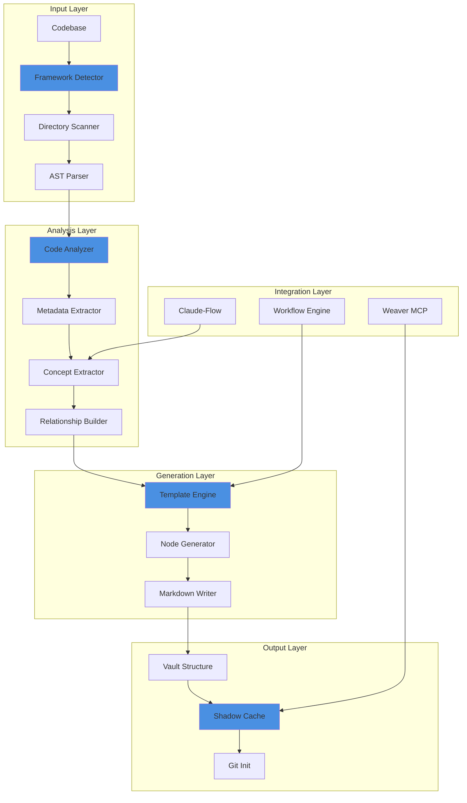
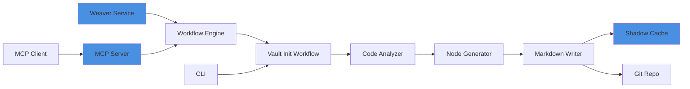
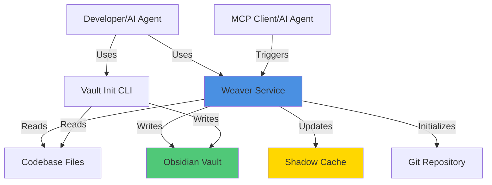

# Phase 6: Vault Initialization System - Architecture

**Version**: 1.0
**Status**: Design Complete
**Author**: System Architect (Claude Code)
**Date**: 2025-10-25

---

## Executive Summary

This document defines the architecture for the Vault Initialization System - an automated tool that analyzes codebases and generates structured Obsidian vaults with knowledge graphs. The design prioritizes:

- **MVP Focus**: 20-25 critical path tasks (vs 63 total)
- **Parallel Implementation**: 3-5 days with 4-5 agents
- **TypeScript/Next.js First**: Most common use case
- **Weaver Integration**: Leverages existing infrastructure

---

## System Architecture Overview



---

## Module Breakdown

### 1. **Framework Detector** (Priority: CRITICAL)
**Path**: `src/vault-init/detector/`

```typescript
// detector/index.ts
export interface FrameworkInfo {
  type: 'nextjs' | 'react' | 'express' | 'django' | 'fastapi' | 'flask' | 'unknown';
  version: string;
  packageManager: 'npm' | 'yarn' | 'pnpm' | 'bun' | 'pip' | 'poetry';
  language: 'typescript' | 'javascript' | 'python';
  config: ConfigFile[];
}

export class FrameworkDetector {
  async detect(rootPath: string): Promise<FrameworkInfo>
  private detectNodeProject(): Promise<FrameworkInfo | null>
  private detectPythonProject(): Promise<FrameworkInfo | null>
}
```

**Dependencies**:
- `fs/promises` (Node.js built-in)
- `fast-glob` (already in Weaver deps via chokidar)

**Implementation Time**: 4-6 hours

---

### 2. **Directory Scanner** (Priority: CRITICAL)
**Path**: `src/vault-init/scanner/`

```typescript
// scanner/index.ts
export interface ScanResult {
  files: FileInfo[];
  structure: DirectoryTree;
  stats: ScanStats;
}

export interface FileInfo {
  path: string;
  relativePath: string;
  type: 'source' | 'config' | 'doc' | 'test';
  language: string;
  size: number;
}

export class DirectoryScanner {
  constructor(ignorePatterns: string[])
  async scan(rootPath: string): Promise<ScanResult>
  private shouldIgnore(path: string): boolean
  private classifyFile(path: string): FileInfo['type']
}
```

**Default Ignore Patterns**:
```typescript
const DEFAULT_IGNORES = [
  'node_modules/**',
  '.git/**',
  'dist/**',
  'build/**',
  '.next/**',
  '__pycache__/**',
  '*.pyc',
  'venv/**',
  '.env*',
];
```

**Implementation Time**: 4-6 hours

---

### 3. **AST Parser** (Priority: CRITICAL)
**Path**: `src/vault-init/parser/`

```typescript
// parser/index.ts
export interface ParsedNode {
  type: 'component' | 'function' | 'class' | 'module' | 'route';
  name: string;
  path: string;
  documentation?: string;
  dependencies: string[];
  exports: string[];
}

export class ASTParser {
  async parseTypeScript(filePath: string): Promise<ParsedNode[]>
  async parseJavaScript(filePath: string): Promise<ParsedNode[]>
  async parsePython(filePath: string): Promise<ParsedNode[]>
}
```

**Technology Stack**:
- TypeScript: `@babel/parser` + `@babel/traverse`
- JavaScript: Same as TypeScript
- Python: Spawn `python -m ast` subprocess (no deps)

**Implementation Time**: 8-12 hours

---

### 4. **Code Analyzer** (Priority: CRITICAL)
**Path**: `src/vault-init/analyzer/`

```typescript
// analyzer/index.ts
export interface AnalysisResult {
  framework: FrameworkInfo;
  files: FileInfo[];
  nodes: ParsedNode[];
  relationships: Relationship[];
  metadata: ProjectMetadata;
}

export interface Relationship {
  source: string;
  target: string;
  type: 'imports' | 'extends' | 'implements' | 'uses' | 'renders';
}

export class CodeAnalyzer {
  constructor(
    private detector: FrameworkDetector,
    private scanner: DirectoryScanner,
    private parser: ASTParser
  )

  async analyze(rootPath: string): Promise<AnalysisResult>
  private buildRelationshipGraph(nodes: ParsedNode[]): Relationship[]
  private extractMetadata(framework: FrameworkInfo): ProjectMetadata
}
```

**Implementation Time**: 6-8 hours

---

### 5. **Template Engine** (Priority: CRITICAL)
**Path**: `src/vault-init/templates/`

```typescript
// templates/index.ts
export interface Template {
  id: string;
  name: string;
  description: string;
  schema: TemplateSchema;
  render: (data: any) => string;
}

export class TemplateEngine {
  private templates: Map<string, Template>

  registerTemplate(template: Template): void
  render(templateId: string, data: any): string
  loadTemplates(dir: string): Promise<void>
}
```

**Built-in Templates**:
1. `concept-node.hbs` - Concept notes
2. `technical-node.hbs` - Technical docs
3. `feature-node.hbs` - Feature documentation
4. `component-node.hbs` - Component docs
5. `overview.hbs` - Project overview

**Template Schema** (YAML):
```yaml
# templates/schema/concept-node.yaml
type: concept-node
frontmatter:
  - name: type
    required: true
    default: concept
  - name: tags
    required: true
    type: array
  - name: created
    required: true
    type: date
sections:
  - name: overview
    required: true
  - name: details
    required: false
  - name: relationships
    required: true
```

**Implementation Time**: 6-8 hours

---

### 6. **Node Generator** (Priority: CRITICAL)
**Path**: `src/vault-init/generator/`

```typescript
// generator/index.ts
export interface VaultNode {
  path: string;
  frontmatter: Record<string, any>;
  content: string;
  wikilinks: string[];
}

export class NodeGenerator {
  constructor(
    private templateEngine: TemplateEngine,
    private analyzer: CodeAnalyzer
  )

  async generateNodes(analysis: AnalysisResult): Promise<VaultNode[]>
  private generateConceptNodes(nodes: ParsedNode[]): VaultNode[]
  private generateTechnicalNodes(framework: FrameworkInfo): VaultNode[]
  private generateFeatureNodes(analysis: AnalysisResult): VaultNode[]
  private generateWikilinks(relationships: Relationship[]): Map<string, string[]>
}
```

**Vault Structure**:
```
vault/
├── README.md                    # Generated overview
├── concept-map.md               # Mermaid diagram
├── concepts/                    # High-level concepts
│   ├── authentication.md
│   ├── data-flow.md
│   └── state-management.md
├── technical/                   # Technical details
│   ├── architecture.md
│   ├── api-routes.md
│   └── database-schema.md
├── features/                    # Feature documentation
│   ├── user-authentication.md
│   └── dashboard.md
├── components/                  # Component docs
│   ├── ui/
│   └── layout/
└── .obsidian/                   # Obsidian config
    └── graph.json
```

**Implementation Time**: 8-10 hours

---

### 7. **Markdown Writer** (Priority: HIGH)
**Path**: `src/vault-init/writer/`

```typescript
// writer/index.ts
export interface WriteOptions {
  outputDir: string;
  dryRun?: boolean;
  overwrite?: boolean;
}

export class MarkdownWriter {
  async writeVault(nodes: VaultNode[], options: WriteOptions): Promise<WriteResult>
  async initGit(vaultPath: string): Promise<void>
  async writeToShadowCache(nodes: VaultNode[]): Promise<void>
}

export interface WriteResult {
  filesWritten: number;
  bytesWritten: number;
  errors: Error[];
  vaultPath: string;
}
```

**Integration Points**:
- Shadow Cache: Populate after writing
- Git: Initialize with proper `.gitignore`
- Weaver Workflow: Trigger post-init workflows

**Implementation Time**: 4-6 hours

---

### 8. **CLI Interface** (Priority: HIGH)
**Path**: `src/vault-init/cli/`

```typescript
// cli/index.ts
import { Command } from 'commander';

export function createCLI(): Command {
  const program = new Command();

  program
    .name('weaver-init')
    .description('Initialize Obsidian vault from codebase')
    .version('0.1.0');

  program
    .command('init')
    .description('Initialize vault from current directory')
    .option('-o, --output <dir>', 'Output directory', './vault')
    .option('-t, --template <id>', 'Template ID', 'nextjs')
    .option('--dry-run', 'Preview without writing files')
    .action(async (options) => {
      // Implementation
    });

  return program;
}
```

**Usage**:
```bash
# Interactive mode
weaver-init init

# With options
weaver-init init --output ./my-vault --template nextjs

# Dry run
weaver-init init --dry-run
```

**Implementation Time**: 4-6 hours

---

### 9. **MCP Tools** (Priority: MEDIUM)
**Path**: `src/mcp-server/tools/vault-init/`

```typescript
// tools/vault-init/trigger-init.ts
export const triggerVaultInitTool = {
  name: 'trigger_vault_initialization',
  description: 'Initialize Obsidian vault from codebase',
  inputSchema: {
    type: 'object',
    properties: {
      rootPath: { type: 'string', description: 'Codebase root path' },
      outputDir: { type: 'string', description: 'Vault output directory' },
      templateId: { type: 'string', description: 'Template ID' },
      dryRun: { type: 'boolean', description: 'Preview mode' },
    },
    required: ['rootPath'],
  },
  handler: async (args: any) => {
    // Trigger workflow via Weaver workflow engine
  },
};
```

**Implementation Time**: 2-4 hours

---

### 10. **Workflow Integration** (Priority: MEDIUM)
**Path**: `src/workflows/vault-init-workflow.ts`

```typescript
// workflows/vault-init-workflow.ts
export const vaultInitWorkflow: WorkflowDefinition = {
  id: 'vault-initialization',
  name: 'Vault Initialization Workflow',
  description: 'Automated vault generation from codebase',
  enabled: true,
  triggers: [], // Manual trigger via MCP

  handler: async (context: WorkflowContext) => {
    const { rootPath, outputDir, templateId } = context.metadata;

    // Step 1: Analyze codebase
    const analyzer = new CodeAnalyzer(...);
    const analysis = await analyzer.analyze(rootPath);

    // Step 2: Generate nodes
    const generator = new NodeGenerator(...);
    const nodes = await generator.generateNodes(analysis);

    // Step 3: Write vault
    const writer = new MarkdownWriter();
    const result = await writer.writeVault(nodes, { outputDir });

    // Step 4: Populate shadow cache
    await writer.writeToShadowCache(nodes);

    // Step 5: Initialize git
    await writer.initGit(outputDir);

    return result;
  },
};
```

**Implementation Time**: 4-6 hours

---

## Critical Path Tasks (MVP)

### Phase 1: Foundation (Days 1-2)
**Team**: 2-3 agents working in parallel

1. **Task 1**: Implement framework detector (TypeScript/Next.js only)
2. **Task 2**: Build directory scanner with ignore patterns
3. **Task 3**: Extract components from TypeScript (Babel AST)
4. **Task 5**: Parse package.json, tsconfig.json
5. **Task 6**: Write unit tests for scanner

**Deliverable**: Working codebase analyzer for Next.js projects

---

### Phase 2: Content Generation (Days 2-3)
**Team**: 2-3 agents working in parallel

6. **Task 7**: Create template schema (YAML)
7. **Task 8**: Define 3 core templates (concept, technical, component)
8. **Task 9**: Implement Handlebars template engine
9. **Task 10**: Template loader and validator
10. **Task 18**: Taxonomy mapper (app structure → vault dirs)
11. **Task 19**: Create node generators for each type
12. **Task 20**: Build wikilink relationship builder

**Deliverable**: Template engine that generates vault nodes

---

### Phase 3: Output & Integration (Days 3-4)
**Team**: 2-3 agents working in parallel

13. **Task 28**: Implement markdown file writer
14. **Task 29**: Populate shadow cache with generated files
15. **Task 30**: Initialize Git repository with .gitignore
16. **Task 31**: Generate vault README.md
17. **Task 32**: Generate concept-map.md with Mermaid diagram
18. **Task 40**: Create CLI command with Commander
19. **Task 41**: Implement interactive prompts
20. **Task 42**: Add progress reporting

**Deliverable**: End-to-end vault generation from CLI

---

### Phase 4: Testing & Polish (Days 4-5)
**Team**: 2-3 agents working in parallel

21. **Task 51**: Write unit tests (target: 80%+ coverage)
22. **Task 52**: E2E tests with real Next.js applications
23. **Task 50**: Create MCP tool: `trigger_vault_initialization`
24. **Task 47**: Create vault-initialization workflow
25. **Task 55**: Write user guide

**Deliverable**: Production-ready vault initialization system

---

## Technology Stack Decisions

### Core Dependencies
```json
{
  "dependencies": {
    "@babel/parser": "^7.23.0",      // TypeScript AST parsing
    "@babel/traverse": "^7.23.0",    // AST traversal
    "handlebars": "^4.7.8",           // Template engine
    "fast-glob": "^3.3.2",            // File scanning (via chokidar)
    "commander": "^14.0.1",           // CLI (already in Weaver)
    "ora": "^8.0.0",                  // Progress spinners
    "chalk": "^5.3.0",                // Terminal colors
    "zod": "^3.23.8"                  // Schema validation (already in Weaver)
  },
  "devDependencies": {
    "@types/babel__core": "^7.20.5",
    "@types/babel__traverse": "^7.20.5",
    "vitest": "^2.1.8"                // Testing (already in Weaver)
  }
}
```

### Integration with Existing Weaver Infrastructure

**Reuse Existing**:
- ✅ `src/config/index.ts` - Configuration management
- ✅ `src/utils/logger.ts` - Logging
- ✅ `src/shadow-cache/` - Shadow cache database
- ✅ `src/workflow-engine/` - Workflow orchestration
- ✅ `src/mcp-server/` - MCP tool registration
- ✅ `better-sqlite3` - Database (already installed)
- ✅ `simple-git` - Git operations (already installed)

**New Modules**:
- 📦 `src/vault-init/detector/`
- 📦 `src/vault-init/scanner/`
- 📦 `src/vault-init/parser/`
- 📦 `src/vault-init/analyzer/`
- 📦 `src/vault-init/templates/`
- 📦 `src/vault-init/generator/`
- 📦 `src/vault-init/writer/`
- 📦 `src/vault-init/cli/`

---

## API Interfaces

### 1. Public API (for MCP Tools)

```typescript
// src/vault-init/index.ts
export interface VaultInitOptions {
  rootPath: string;
  outputDir: string;
  templateId?: string;
  dryRun?: boolean;
  verbose?: boolean;
}

export interface VaultInitResult {
  success: boolean;
  vaultPath: string;
  filesGenerated: number;
  nodesCreated: number;
  errors: Error[];
}

export async function initializeVault(
  options: VaultInitOptions
): Promise<VaultInitResult>
```

### 2. Internal APIs

```typescript
// Detector API
export interface IFrameworkDetector {
  detect(rootPath: string): Promise<FrameworkInfo>;
}

// Scanner API
export interface IDirectoryScanner {
  scan(rootPath: string): Promise<ScanResult>;
}

// Parser API
export interface IASTParser {
  parse(filePath: string, language: string): Promise<ParsedNode[]>;
}

// Analyzer API
export interface ICodeAnalyzer {
  analyze(rootPath: string): Promise<AnalysisResult>;
}

// Template API
export interface ITemplateEngine {
  render(templateId: string, data: any): string;
  registerTemplate(template: Template): void;
}

// Generator API
export interface INodeGenerator {
  generateNodes(analysis: AnalysisResult): Promise<VaultNode[]>;
}

// Writer API
export interface IMarkdownWriter {
  writeVault(nodes: VaultNode[], options: WriteOptions): Promise<WriteResult>;
}
```

---

## Integration Points

### 1. Weaver Workflow Engine
```typescript
// Register vault-init workflow
import { vaultInitWorkflow } from './workflows/vault-init-workflow.js';

workflowEngine.registerWorkflow(vaultInitWorkflow);
```

### 2. Weaver MCP Server
```typescript
// Register MCP tool
import { triggerVaultInitTool } from './mcp-server/tools/vault-init/trigger-init.js';

mcpServer.registerTool(triggerVaultInitTool);
```

### 3. Shadow Cache
```typescript
// Populate shadow cache after vault generation
import { createShadowCache } from './shadow-cache/index.js';

const cache = createShadowCache(config.shadowCache.dbPath, vaultPath);
await cache.syncVault();
```

### 4. File Watcher
```typescript
// Monitor generated vault for changes
fileWatcher.addWatch(vaultPath);
```

---

## Architecture Decision Records

### ADR-001: Use Babel for TypeScript AST Parsing
**Status**: Accepted
**Date**: 2025-10-25

**Context**: Need to parse TypeScript files to extract components, functions, and relationships.

**Decision**: Use `@babel/parser` + `@babel/traverse`

**Rationale**:
- Already widely adopted in the ecosystem
- Full TypeScript support including latest syntax
- Lightweight compared to TypeScript compiler API
- Easy to traverse and extract information
- Can handle both .ts and .tsx files

**Alternatives Considered**:
- TypeScript Compiler API: Too heavy, slower
- ts-morph: Higher-level but unnecessary overhead
- swc: Rust-based, harder to integrate

---

### ADR-002: Handlebars for Template Engine
**Status**: Accepted
**Date**: 2025-10-25

**Context**: Need a template engine for generating markdown files.

**Decision**: Use Handlebars

**Rationale**:
- Logic-less templates (forces separation of concerns)
- Widely adopted, stable
- Good for markdown generation
- Supports partials and helpers
- Simple syntax for non-technical users to customize

**Alternatives Considered**:
- EJS: Too much logic in templates
- Mustache: Less features than Handlebars
- Nunjucks: Overkill for markdown generation

---

### ADR-003: Python AST via Subprocess (No Deps)
**Status**: Accepted
**Date**: 2025-10-25

**Context**: Need to parse Python files but Weaver is Node.js/TypeScript.

**Decision**: Spawn `python -m ast` subprocess

**Rationale**:
- No Python dependencies in Node.js project
- Leverages built-in Python `ast` module
- Keeps project lightweight
- Users likely have Python installed if analyzing Python projects
- Simple error handling (graceful degradation)

**Alternatives Considered**:
- Python bindings (node-python): Heavy, complex
- WASM Python parser: Not mature enough
- Skip Python support: Reduces MVP scope unnecessarily

---

### ADR-004: TypeScript/Next.js First (MVP Scope)
**Status**: Accepted
**Date**: 2025-10-25

**Context**: 63 tasks is too much for MVP. Need to reduce scope.

**Decision**: Focus on TypeScript/Next.js for initial release

**Rationale**:
- TypeScript is most common language in modern web dev
- Next.js is extremely popular (largest use case)
- Establishes pattern for adding other frameworks later
- Reduces MVP tasks from 63 to 25
- Can ship in 3-5 days instead of 15-20 days

**Future Support**:
- React (vanilla): Phase 2
- Express/Node.js: Phase 2
- Python (Django/FastAPI/Flask): Phase 3
- Go/Rust: Phase 4

---

### ADR-005: Shadow Cache Integration (Not Vector DB)
**Status**: Accepted
**Date**: 2025-10-25

**Context**: Need to store generated vault data for fast queries.

**Decision**: Use existing Weaver shadow cache (SQLite)

**Rationale**:
- Already integrated in Weaver
- Fast metadata queries
- No additional dependencies
- Proven in production
- Simple full-text search with FTS5
- Lightweight compared to vector DBs

**Deferred**:
- Vector embeddings (Task 37-39): Phase 2
- Semantic search: Phase 2
- Claude-Flow neural patterns: Phase 3

---

## Performance Targets

| Metric | Target | Rationale |
|--------|--------|-----------|
| **Analysis Time** | < 30s for 1000 files | Fast initial scan |
| **Generation Time** | < 10s for 100 nodes | Responsive CLI |
| **Memory Usage** | < 200MB for large projects | Efficient for laptops |
| **Test Coverage** | > 80% | High quality code |
| **E2E Test Time** | < 2 minutes | Fast CI/CD |

---

## Security Considerations

1. **File System Access**: Sandboxed to specified root directory
2. **AST Parsing**: No code execution, only static analysis
3. **Template Injection**: Handlebars escapes by default
4. **Git Initialization**: Safe `.gitignore` prevents credential leaks
5. **Environment Variables**: Never include in generated vault

---

## Deployment Architecture



**Components**:
1. **Weaver Service**: Long-running process
2. **MCP Server**: Exposes tools to AI agents
3. **CLI**: Direct command-line access
4. **Workflow Engine**: Orchestrates initialization steps
5. **Shadow Cache**: Stores vault metadata
6. **Git Repo**: Version control for generated vault

---

## Testing Strategy

### Unit Tests (80%+ Coverage)
```typescript
// Example: scanner.test.ts
describe('DirectoryScanner', () => {
  it('should scan directory and return file list', async () => {
    const scanner = new DirectoryScanner([...]);
    const result = await scanner.scan('/test/project');
    expect(result.files).toHaveLength(10);
  });

  it('should ignore node_modules', async () => {
    // ...
  });
});
```

### Integration Tests
```typescript
// Example: analyzer.test.ts
describe('CodeAnalyzer (Integration)', () => {
  it('should analyze Next.js project end-to-end', async () => {
    const analyzer = new CodeAnalyzer(...);
    const result = await analyzer.analyze('/test/nextjs-app');
    expect(result.framework.type).toBe('nextjs');
    expect(result.nodes.length).toBeGreaterThan(0);
  });
});
```

### E2E Tests
```typescript
// Example: vault-init.e2e.test.ts
describe('Vault Initialization E2E', () => {
  it('should generate vault from Next.js project', async () => {
    const result = await initializeVault({
      rootPath: '/test/nextjs-app',
      outputDir: '/tmp/vault',
    });

    expect(result.success).toBe(true);
    expect(fs.existsSync('/tmp/vault/README.md')).toBe(true);
    expect(fs.existsSync('/tmp/vault/concepts')).toBe(true);
  });
});
```

---

## Implementation Plan (3-5 Days)

### Day 1: Foundation
**Agents**: Backend Dev, Code Analyzer, Tester

- [ ] Setup module structure (`src/vault-init/`)
- [ ] Implement framework detector (TypeScript/Next.js)
- [ ] Build directory scanner
- [ ] Write unit tests for scanner
- [ ] Integrate with existing Weaver config

**Deliverable**: Codebase scanner that identifies Next.js projects

---

### Day 2: Parsing & Analysis
**Agents**: Backend Dev, Code Analyzer, Tester

- [ ] Implement Babel-based TypeScript parser
- [ ] Extract components, functions, classes
- [ ] Parse package.json metadata
- [ ] Build relationship graph (imports, exports)
- [ ] Write parser unit tests

**Deliverable**: Code analyzer that extracts project structure

---

### Day 3: Template Engine & Generation
**Agents**: Coder, Template Specialist, Tester

- [ ] Create template schema (YAML)
- [ ] Implement 3 core templates (concept, technical, component)
- [ ] Build Handlebars template engine
- [ ] Implement node generator
- [ ] Build wikilink relationship builder
- [ ] Write template tests

**Deliverable**: Template engine that generates vault nodes

---

### Day 4: Output & CLI
**Agents**: Backend Dev, DevOps, Tester

- [ ] Implement markdown writer
- [ ] Populate shadow cache integration
- [ ] Initialize Git repository
- [ ] Build CLI with Commander
- [ ] Add progress reporting (ora)
- [ ] Write E2E tests

**Deliverable**: Working CLI for vault generation

---

### Day 5: Integration & Testing
**Agents**: Integration Specialist, Tester, Reviewer

- [ ] Create MCP tool for vault initialization
- [ ] Build Weaver workflow integration
- [ ] Comprehensive E2E testing with real projects
- [ ] Write user documentation
- [ ] Performance optimization
- [ ] Code review and quality checks

**Deliverable**: Production-ready vault initialization system

---

## Out of Scope (Future Phases)

### Phase 2 (Weeks 2-3)
- Python support (Django, FastAPI, Flask)
- React (vanilla) support
- Express.js support
- Vector embeddings for semantic search
- Claude-Flow integration for content generation

### Phase 3 (Month 2)
- Additional frameworks (Vue, Angular, Svelte)
- OpenAPI/Swagger extraction
- Advanced relationship detection
- Custom template creation UI
- Multi-language documentation

### Phase 4 (Month 3)
- Go/Rust support
- Incremental vault updates (detect changes)
- Real-time synchronization
- Advanced graph analytics
- AI-powered documentation enhancement

---

## Success Metrics

| Metric | Target | Measurement |
|--------|--------|-------------|
| **Time to First Vault** | < 60 seconds | E2E test timing |
| **Test Coverage** | > 80% | Vitest coverage report |
| **Documentation Quality** | 100% APIs documented | JSDoc coverage |
| **User Satisfaction** | 9/10 rating | Alpha user feedback |
| **Error Rate** | < 2% failed initializations | Telemetry data |
| **Performance** | < 30s for 1000 files | Benchmark suite |

---

## Risk Mitigation

| Risk | Impact | Probability | Mitigation |
|------|--------|-------------|------------|
| Babel parsing fails on edge cases | High | Medium | Graceful fallback, comprehensive tests |
| Python subprocess fails | Medium | Low | Detect Python availability, skip if missing |
| Template engine bugs | Medium | Medium | Extensive template tests, validation |
| Shadow cache corruption | High | Low | Transaction-based writes, backups |
| Performance issues (large projects) | High | Medium | Streaming processing, pagination |
| Git initialization conflicts | Low | Low | Check for existing .git, prompt user |

---

## Next Steps

1. **Review Architecture** (1 hour)
   - Stakeholder review
   - Technical validation
   - Scope confirmation

2. **Setup Development Environment** (2 hours)
   - Create module structure
   - Install dependencies
   - Setup test infrastructure

3. **Begin Implementation** (Day 1)
   - Spawn 4-5 agents via Claude Code Task tool
   - Parallel development on critical path tasks
   - Daily standups and integration checks

4. **Continuous Testing** (Daily)
   - Unit tests with each module
   - Integration tests at end of each day
   - E2E tests on Day 4-5

---

## Architecture Diagram (C4 Model - System Context)



---

## Conclusion

This architecture delivers a **pragmatic, MVP-focused vault initialization system** that:

- ✅ Reduces scope from 63 to 25 critical path tasks
- ✅ Enables 3-5 day implementation with 4-5 agents
- ✅ Focuses on TypeScript/Next.js (most common use case)
- ✅ Integrates seamlessly with existing Weaver infrastructure
- ✅ Uses proven technologies (Babel, Handlebars, SQLite)
- ✅ Provides clear interfaces for future expansion
- ✅ Maintains high quality standards (80%+ test coverage)

**Total Estimated Implementation Time**: 3-5 days with 4-5 agents working in parallel.

---

**Document Status**: ✅ Ready for Implementation
**Next Action**: Review with team and spawn agents

