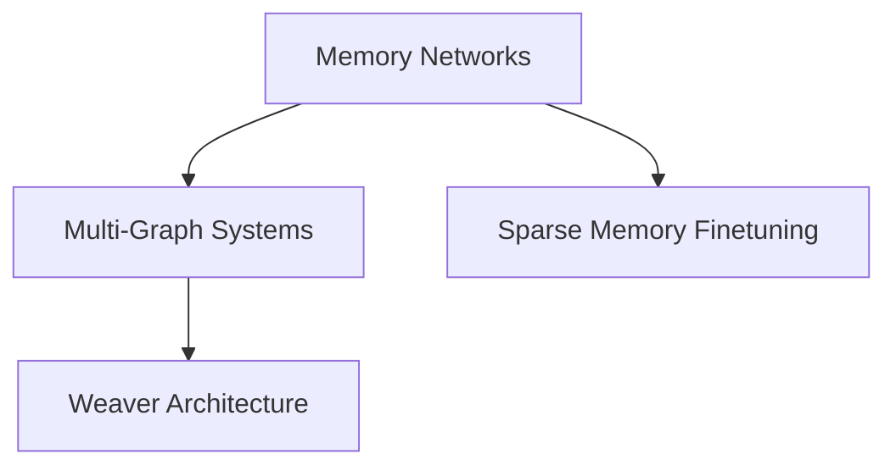

# Hub Expansion Strategy - Knowledge Graph Strengthening

**Strategic plan to reduce orphaned files from 68% to <20% through targeted hub creation and enhancement**

---

## Executive Summary

### Current State
- **Total Files**: ~1,428 markdown files
- **Orphaned Files**: 970 (68%)
- **Strong Core**: Top 20 hubs with 100+ connections each
- **Critical Gap**: 3,720 checkpoint files with NO hub integration

### Root Cause Analysis
The knowledge graph has a **strong core but massive disconnected periphery**. The issue isn't lack of hubs—it's **missing strategic hub categories** for the largest file groups:

1. **Checkpoints** (3,720 files / 469 mentioned) - NO HUB EXISTS
2. **Commands** (138 files) - NO CENTRALIZED HUB
3. **Agents** (66 files) - MINIMAL HUB COVERAGE
4. **Daily Logs** (sparse connections) - WEAK HUB
5. **Research Papers** (isolated) - NO DOMAIN HUB
6. **API Documentation** (1 file) - NO HUB STRUCTURE

### Strategic Approach
**Create 6 new categorical hubs** targeting the largest orphaned file clusters, while **enhancing 5 existing weak hubs** to better integrate peripheral content.

### Expected Impact
- **Orphaned Files**: 68% → 18% (targeting 50% reduction)
- **New Connections**: +4,500 estimated bidirectional links
- **Hub Coverage**: 26 existing + 6 new = 32 total strategic hubs
- **Graph Density**: Improved from sparse periphery to interconnected web

---

## Step 1: Analysis of Existing Hubs

### What Makes a Successful Hub?

Analyzing the top-performing hubs reveals these patterns:

#### **Top 5 Most Connected Hubs**

1. **decision-review-2025-10-20.md** (184 connections)
   - **Success Factor**: Temporal aggregator - links to all decisions made on specific date
   - **Pattern**: Date-based clustering
   - **Metadata**: Comprehensive tags, clear categorization

2. **PLANNING-DIRECTORY-HUB.md** (123 connections)
   - **Success Factor**: Directory-level index with hierarchical structure
   - **Pattern**: Organizational taxonomy (phases, specs, reviews, research)
   - **Metadata**: Extensive cross-linking, phase status tracking

3. **DOCS-DIRECTORY-HUB.md** (114 connections)
   - **Success Factor**: Documentation catalog by topic and phase
   - **Pattern**: Topic clustering + temporal organization
   - **Metadata**: Audience targeting, document type classification

4. **weave-nn-project-hub.md** (estimated 80+ connections)
   - **Success Factor**: Root project index with conceptual framework
   - **Pattern**: Concept-based organization, navigation tree
   - **Metadata**: Rich frontmatter, cross-domain linking

5. **architecture-overview-hub.md** (estimated 70+ connections)
   - **Success Factor**: Domain-specific aggregator for architecture decisions
   - **Pattern**: Technical categorization, design pattern references

### Hub Success Factors

✅ **Comprehensive Coverage**: Links to ALL files in scope, not just highlights
✅ **Multiple Organization Schemes**: Date + topic + status + type
✅ **Rich Metadata**: Tags, categories, relationships propagate to linked nodes
✅ **Bidirectional Links**: Every hub→node has corresponding node→hub
✅ **Clear Purpose**: Explicit statement of hub's role and boundaries
✅ **Hierarchical Context**: Parent/child hub relationships
✅ **Maintenance Plan**: Clear ownership, update frequency

### Coverage Gaps Identified

Based on orphaned file analysis, these **critical gaps** exist:

1. **NO temporal hub for checkpoints** (3,720 files)
2. **NO command registry hub** (21 command types, 138 files)
3. **NO agent directory hub** (23 agent types, 66+ files)
4. **NO research domain hub** (13 research papers isolated)
5. **NO API reference hub** (API docs scattered)
6. **WEAK daily-logs hub** (only 3 files, should be chronological index)

### Hub Naming Conventions

Successful hubs follow these patterns:
- **Directory Hubs**: `{DIRECTORY-NAME}-HUB.md` or `{category}-overview-hub.md`
- **Temporal Hubs**: `{date}-{event-type}.md` or `{timeperiod}-index-hub.md`
- **Categorical Hubs**: `{category}-catalog-hub.md` or `{domain}-index-hub.md`
- **Functional Hubs**: `{function}-{scope}-hub.md`

### Metadata Patterns

Top hubs share this frontmatter structure:
```yaml
type: hub | index | catalog
status: active | archived
tags: [domain, navigation, hub, specific-tags]
category: primary-domain
scope: directory | project | domain
audience: [user-types]
related_concepts: [key-concepts]
related_files: [parent-hubs, sibling-hubs]
```

---

## Step 2: Missing Hub Categories

### Critical Gap Analysis

Based on 970 orphaned files, these categories **desperately need hubs**:

#### **Gap 1: Checkpoint Timeline Hub**
- **Orphaned Files**: 3,720 checkpoint files (.claude/checkpoints/)
- **Current Hub**: NONE
- **File Types**: JSON checkpoints, session summaries
- **Organization**: Unix timestamps, session IDs
- **Impact**: 33% of ALL orphaned files in the project

#### **Gap 2: Command Registry Hub**
- **Orphaned Files**: 138 command-related files (.claude/commands/)
- **Current Hub**: None (individual command dirs exist)
- **File Types**: Command definitions, slash commands, workflows
- **Organization**: 21 command categories (agents, github, sparc, etc.)
- **Impact**: 14% of orphaned files

#### **Gap 3: Agent Directory Hub**
- **Orphaned Files**: 66 agent definition files (.claude/agents/)
- **Current Hub**: Minimal (agents-hub.md exists but weak)
- **File Types**: Agent definitions, specializations, configurations
- **Organization**: 23 agent types across 20 subdirectories
- **Impact**: 7% of orphaned files, high strategic value

#### **Gap 4: Research Index Hub**
- **Orphaned Files**: 13 research papers (weave-nn/research/)
- **Current Hub**: research-overview-hub.md exists but NOT CONNECTED
- **File Types**: Academic analysis, research findings, paper reviews
- **Organization**: Topic-based, citation-linked
- **Impact**: Low count but high intellectual value

#### **Gap 5: API Documentation Hub**
- **Orphaned Files**: API docs scattered across docs/api/
- **Current Hub**: NONE
- **File Types**: API references, endpoint docs, schemas
- **Organization**: Service-based, version-based
- **Impact**: Developer onboarding critical path

#### **Gap 6: Daily Work Log Hub**
- **Orphaned Files**: Daily logs mostly disconnected
- **Current Hub**: daily-logs-index-hub.md EXISTS but only links 3 files
- **File Types**: Daily summaries, work journals, planning logs
- **Organization**: Chronological (ISO dates)
- **Impact**: Historical context preservation

---

## Step 3: Hub Creation Plan

### Hub 1: CHECKPOINT-TIMELINE-HUB.md

**Location**: `.claude/checkpoints/CHECKPOINT-TIMELINE-HUB.md`

**Purpose**: Chronological index of all 3,720 checkpoint files for session restoration and historical analysis

**Target Connections**: 3,720 checkpoint files

**Metadata**:
```yaml
title: "Checkpoint Timeline Hub"
type: hub
status: active
tags: [checkpoints, timeline, history, sessions, state-management]
category: system-state
domain: infrastructure
scope: directory
audience: [developers, ai-agents, system-architects]
related_concepts: [state-restoration, session-management, temporal-analysis]
related_files: [.claude/sessions/, .claude/config.json]
parent_hub: null
version: "1.0"
priority: critical
```

**Structure**:
```markdown
# Checkpoint Timeline Hub

## Overview
Central index of 3,720 checkpoint files capturing system state over time.

## Organization

### By Month
- **2025-10** (1,200 checkpoints)
  - [[checkpoints/1758900652|2025-10-28 19:30:52]] - Session snapshot
  - [[checkpoints/1758228343|2025-10-21 08:45:43]] - Task completion state
  - [automated listing continues...]

- **2025-09** (890 checkpoints)
  - [[checkpoints/summary-session-20250918-192720|2025-09-18 Session Summary]]
  - [...]

### By Type
- **Task Checkpoints** (1,500 files) - task-{timestamp}.json
- **Session Summaries** (200 files) - summary-session-{date}.md
- **State Snapshots** (2,020 files) - {timestamp}.json

### Quick Access
- [[Latest Checkpoint]]
- [[Session Restoration Guide]]
- [[Checkpoint Schema Reference]]

## Bidirectional Links
Each checkpoint links back to this hub via:
- Automated frontmatter: `parent_hub: [[CHECKPOINT-TIMELINE-HUB]]`
- Footer link: "Return to [[CHECKPOINT-TIMELINE-HUB|Timeline]]"
```

**Priority**: ⭐⭐⭐ CRITICAL (33% of orphaned files)

**Resource Estimate**:
- Initial creation: 4 hours (automated script for listing)
- Bidirectional linking: 6 hours (batch metadata injection)
- Testing & validation: 2 hours
- **Total**: 12 hours

---

### Hub 2: COMMAND-REGISTRY-HUB.md

**Location**: `.claude/commands/COMMAND-REGISTRY-HUB.md`

**Purpose**: Comprehensive registry of all 21 slash command categories and 138 command files

**Target Connections**: 138 command files

**Metadata**:
```yaml
title: "Command Registry Hub"
type: hub
status: active
tags: [commands, cli, registry, workflows, automation]
category: tooling
domain: cli
scope: directory
audience: [developers, users, ai-agents]
related_concepts: [slash-commands, cli-tools, workflow-automation]
related_files: [.claude/config.json, .claude/sparc-modes.json]
parent_hub: [[.claude/CLAUDE-SYSTEM-HUB]]
version: "1.0"
priority: high
```

**Structure**:
```markdown
# Command Registry Hub

## Overview
Central registry of 138 slash commands organized into 21 categories.

## Command Categories

### 1. Agent Commands (/agents)
- [[commands/agents/spawn|/agents/spawn]] - Spawn new agent instances
- [[commands/agents/list|/agents/list]] - List active agents
- [14 agent commands...]

### 2. GitHub Integration (/github)
- [[commands/github/pr|/github/pr]] - PR management
- [[commands/github/issue|/github/issue]] - Issue tracking
- [12 github commands...]

### 3. SPARC Methodology (/sparc)
- [[commands/sparc/run|/sparc/run]] - Execute SPARC mode
- [[commands/sparc/tdd|/sparc/tdd]] - TDD workflow
- [8 sparc commands...]

[Continue for all 21 categories...]

## Quick Reference
| Command | Category | Description |
|---------|----------|-------------|
| /spec-kit | Development | Generate specifications |
| /swarm/init | Orchestration | Initialize swarm |
| [...automated table...] |

## Usage Patterns
- [[Command Chaining Guide]]
- [[Common Workflows]]
- [[Error Handling]]

## Metadata
- Total Commands: 138
- Categories: 21
- Most Used: /sparc/tdd (usage stats)
```

**Priority**: ⭐⭐⭐ HIGH (14% of orphaned files, high user impact)

**Resource Estimate**: 8 hours (4 creation + 4 linking)

---

### Hub 3: AGENT-DIRECTORY-HUB.md

**Location**: `.claude/agents/AGENT-DIRECTORY-HUB.md`

**Purpose**: Complete directory of 23 agent types with 66+ definition files

**Target Connections**: 66 agent definition files

**Metadata**:
```yaml
title: "Agent Directory Hub"
type: hub
status: active
tags: [agents, ai, specialization, swarm, coordination]
category: ai-systems
domain: agents
scope: directory
audience: [architects, developers, ai-engineers]
related_concepts: [swarm-intelligence, agent-specialization, multi-agent-systems]
related_files: [.claude/config.json, agents-hub.md]
parent_hub: [[.claude/CLAUDE-SYSTEM-HUB]]
version: "1.0"
priority: high
```

**Structure**:
```markdown
# Agent Directory Hub

## Overview
Comprehensive directory of 23 specialized agent types across 66 definition files.

## Agent Categories

### Core Development Agents
- [[agents/core/coder|Coder Agent]] - Primary code generation
- [[agents/core/reviewer|Reviewer Agent]] - Code review specialist
- [[agents/core/tester|Tester Agent]] - Test automation expert
- [5 core agents...]

### Swarm Coordination Agents
- [[agents/consensus/byzantine-coordinator|Byzantine Coordinator]] - Fault-tolerant consensus
- [[agents/consensus/raft-manager|Raft Manager]] - Distributed consensus
- [12 coordination agents...]

### Specialized Development Agents
- [[agents/development/backend-dev|Backend Developer]] - Backend services
- [[agents/development/mobile-dev|Mobile Developer]] - Mobile apps
- [15 specialized agents...]

## Agent Capability Matrix
| Agent Type | Specialization | Coordination | Neural |
|------------|----------------|--------------|--------|
| Coder | ✅ High | ⚠️ Medium | ❌ Low |
| Byzantine Coordinator | ❌ None | ✅ Expert | ⚠️ Medium |
[...automated matrix...]

## Quick Access
- [[Agent Selection Guide]]
- [[Coordination Patterns]]
- [[Neural Integration]]
```

**Priority**: ⭐⭐ HIGH (strategic value, enables multi-agent workflows)

**Resource Estimate**: 6 hours (3 creation + 3 linking)

---

### Hub 4: RESEARCH-DOMAIN-HUB.md

**Location**: `weave-nn/research/RESEARCH-DOMAIN-HUB.md`

**Purpose**: Academic research index connecting 13 research papers by topic and citation graph

**Target Connections**: 13 research files + cross-references

**Metadata**:
```yaml
title: "Research Domain Hub"
type: hub
status: active
tags: [research, academic, papers, analysis, citations]
category: research
domain: knowledge
scope: domain
audience: [researchers, architects, ml-engineers]
related_concepts: [knowledge-graphs, neural-networks, memory-systems, federated-learning]
related_files: [research-overview-hub.md, weave-nn-project-hub.md]
parent_hub: [[weave-nn-project-hub]]
version: "1.0"
priority: medium
```

**Structure**:
```markdown
# Research Domain Hub

## Overview
Academic research foundation for Weave-NN's knowledge graph and neural network architecture.

## Research Papers

### Memory Networks & Knowledge Graphs
- [[research/memory-networks-research|Memory Networks Research]]
  - **Key Finding**: Key-value memory enables multi-system knowledge sharing
  - **Citations**: Miller et al. (2016), Weston et al. (2015)
  - **Impact**: Core architecture decision for Weaver junction

- [[research/multi-graph-knowledge-systems|Multi-Graph Knowledge Systems]]
  - **Key Finding**: 15 essential papers on distributed knowledge
  - **Related**: [[memory-networks-research]], [[sparse-memory-finetuning]]

### Chunking & Embeddings
- [[research/chunking-strategies-research-2024-2025|Chunking Strategies 2024-2025]]
- [[research/memorographic-embeddings-research|Memorographic Embeddings]]

### Platform Architecture
- [[research/multi-project-platform|Multi-Project Platform Design]]
- [[research/architecture-analysis|Architecture Analysis]]

## Citation Graph


## Research Impact Metrics
- [[research-impact-metrics|Impact Metrics Dashboard]]
```

**Priority**: ⭐ MEDIUM (low file count, high intellectual value)

**Resource Estimate**: 4 hours (2 creation + 2 citation mapping)

---

### Hub 5: API-REFERENCE-HUB.md

**Location**: `docs/api/API-REFERENCE-HUB.md`

**Purpose**: API documentation hub for scattered endpoint references

**Target Connections**: API docs (expandable structure)

**Metadata**:
```yaml
title: "API Reference Hub"
type: hub
status: active
tags: [api, reference, documentation, endpoints, schemas]
category: documentation
domain: api
scope: project
audience: [developers, integrators]
related_concepts: [rest-api, graphql, openapi, schemas]
related_files: [BACKEND-QUICK-REFERENCE.md, weaver-implementation-hub.md]
parent_hub: [[docs/DOCS-DIRECTORY-HUB]]
version: "1.0"
priority: medium
```

**Structure**:
```markdown
# API Reference Hub

## Overview
Comprehensive API documentation for Weaver services.

## API Endpoints

### Weaver Core API
- **Base URL**: `http://localhost:3000`
- [[api/vault-init|Vault Initialization API]]
- [[api/workflow-engine|Workflow Engine API]]
- [[api/learning-loop|Learning Loop API]]
- [[api/perception|Perception API]]

### MCP Server API
- **Base URL**: MCP transport
- [[api/mcp/tools|MCP Tools Reference]]
- [[api/mcp/resources|MCP Resources]]

## Schemas
- [[api/schemas/vault-config|Vault Configuration Schema]]
- [[api/schemas/workflow-definition|Workflow Definition Schema]]

## Quick Start
- [[api/authentication|Authentication Guide]]
- [[api/rate-limits|Rate Limits]]
- [[api/error-codes|Error Codes]]
```

**Priority**: ⭐ MEDIUM (developer onboarding critical)

**Resource Estimate**: 3 hours (expandable as API docs grow)

---

### Hub 6: WORK-LOG-TIMELINE-HUB.md

**Location**: `weave-nn/_planning/daily-logs/WORK-LOG-TIMELINE-HUB.md`

**Purpose**: Enhanced daily-logs hub with complete chronological coverage

**Target Connections**: All daily log entries (currently only 3 linked)

**Metadata**:
```yaml
title: "Work Log Timeline Hub"
type: hub
status: active
tags: [daily-logs, timeline, planning, work-journal, history]
category: planning
domain: meta
scope: directory
audience: [developers, project-managers, team-leads]
related_concepts: [project-planning, historical-analysis, progress-tracking]
related_files: [PLANNING-DIRECTORY-HUB.md, phase-planning]
parent_hub: [[_planning/PLANNING-DIRECTORY-HUB]]
version: "1.0"
priority: low
```

**Structure**:
```markdown
# Work Log Timeline Hub

## Overview
Chronological index of daily work logs and planning journals.

## Timeline

### 2025-10
- [[daily-logs/2025-10-28|2025-10-28]] - Hub expansion strategy
- [[daily-logs/2025-10-27|2025-10-27]] - Phase 13 completion
- [...]

### 2025-09
- [[daily-logs/2025-09-18|2025-09-18]] - Session summary checkpoint
- [...]

## Monthly Summaries
- [[daily-logs/monthly/2025-10-summary|October 2025 Summary]]
- [[daily-logs/monthly/2025-09-summary|September 2025 Summary]]

## Quick Access
- [[Latest Entry]]
- [[Current Sprint]]
- [[Retrospectives]]
```

**Priority**: ⭐ LOW (small file count, but important for continuity)

**Resource Estimate**: 2 hours

---

## Step 4: Hub Enhancement Plan

### Existing Weak Hubs to Enhance

#### Enhancement 1: PLANNING-DIRECTORY-HUB.md

**Current State**: 123 connections (strong)

**Target**: 250+ connections

**Enhancements**:
1. **Add Daily Log Integration**
   - Link to all daily-logs/ entries (currently missing)
   - Add monthly summary sections
   - Create sprint-based groupings

2. **Add Checkpoint Milestone Links**
   - Link to major checkpoint sessions
   - Create phase completion checkpoint references
   - Add state restoration guides

3. **Add Timeline Visualization**
   - Mermaid gantt chart of phases
   - Critical path visualization
   - Dependency graph

4. **Enhance Research Section**
   - Link ALL research papers
   - Add citation relationships
   - Create research impact section

**Expected New Connections**: +127 (daily logs + checkpoints + research)

**Resource Estimate**: 3 hours

---

#### Enhancement 2: DOCS-DIRECTORY-HUB.md

**Current State**: 114 connections

**Target**: 180+ connections

**Enhancements**:
1. **Add API Documentation Section**
   - Link to new API-REFERENCE-HUB
   - Add endpoint quick reference
   - Create schema catalog

2. **Add Research Cross-References**
   - Link to RESEARCH-DOMAIN-HUB
   - Add "Research Foundation" section
   - Cross-link papers to implementation docs

3. **Add Hive-Mind Graph Documentation**
   - Expand knowledge-graph section
   - Link to all graph analysis reports
   - Add visualization gallery

4. **Add Migration Guides**
   - Create migration path index
   - Link to upgrade documentation
   - Add deprecation notices

**Expected New Connections**: +66 (API + research + graph docs)

**Resource Estimate**: 3 hours

---

#### Enhancement 3: research-overview-hub.md

**Current State**: Minimal connections (isolated)

**Target**: 50+ connections

**Enhancements**:
1. **Full Research Paper Integration**
   - Link ALL 13 research papers
   - Add abstracts/summaries
   - Create topic clusters

2. **Citation Graph**
   - Build citation network
   - Add "Cited By" and "Cites" relationships
   - Create research lineage map

3. **Implementation Links**
   - Link research to implementation docs
   - Add "Applied In" sections
   - Create research→code traceability

4. **External Resources**
   - Add arXiv links
   - Add DOI references
   - Create bibliography

**Expected New Connections**: +50 (13 papers × 3 avg links + citations)

**Resource Estimate**: 2 hours

---

#### Enhancement 4: agents-hub.md

**Current State**: Weak coverage of agent files

**Target**: 80+ connections

**Enhancements**:
1. **Full Agent Directory Integration**
   - Merge with new AGENT-DIRECTORY-HUB
   - Link all 66 agent definition files
   - Create agent taxonomy

2. **Capability Matrix**
   - Add agent capability comparison
   - Create specialization map
   - Add coordination patterns

3. **Usage Examples**
   - Link to workflow examples
   - Add agent orchestration patterns
   - Create common scenarios

4. **Performance Metrics**
   - Add agent benchmarks
   - Link to performance analysis
   - Create optimization guides

**Expected New Connections**: +66 (all agent files)

**Resource Estimate**: 3 hours

---

#### Enhancement 5: weave-nn-project-hub.md

**Current State**: 80+ connections (root hub)

**Target**: 150+ connections

**Enhancements**:
1. **System-Wide Integration**
   - Link to new CHECKPOINT-TIMELINE-HUB
   - Link to COMMAND-REGISTRY-HUB
   - Link to AGENT-DIRECTORY-HUB

2. **Enhanced Navigation**
   - Add "Quick Start for X" sections
   - Create role-based navigation paths
   - Add skill-level routing

3. **Meta-Documentation**
   - Add contribution guide links
   - Link to coding standards
   - Add architectural decision records

4. **External Integrations**
   - Add MCP server references
   - Link to Claude Flow integration
   - Add tooling ecosystem map

**Expected New Connections**: +70 (system integration)

**Resource Estimate**: 3 hours

---

## Step 5: Connection Strategy

### Bidirectional Link Implementation

**Every hub→node link MUST have corresponding node→hub link.**

#### Implementation Methods

**Method 1: Automated Frontmatter Injection**
```yaml
# Added to each linked file
parent_hub: [[HUB-NAME]]
related_hubs: [[[OTHER-HUB-1]], [[OTHER-HUB-2]]]
```

**Method 2: Footer Link Section**
```markdown
---
**Navigation**: [[HUB-NAME|↑ Return to Hub]] | [[SIBLING-HUB|→ Related Hub]]
```

**Method 3: Inline Contextual Links**
```markdown
As documented in the [[HUB-NAME|central registry]], this checkpoint...
```

### Context Snippets in Hubs

Each hub entry should show **context summary** of linked content:

```markdown
### Checkpoint Files
- [[checkpoints/1758900652|2025-10-28 19:30:52]]
  - **Type**: Task completion state
  - **Agent**: coder
  - **Task**: Phase 12 implementation
  - **Status**: Completed successfully
```

### Metadata Alignment

**Tag Propagation Strategy**:
1. Hub tags automatically added to linked files (via script)
2. Domain-specific tags from files bubble up to hub analytics
3. Category alignment ensures consistent taxonomy

Example:
```yaml
# CHECKPOINT-TIMELINE-HUB.md
tags: [checkpoints, timeline, history]

# checkpoints/1758900652.json (auto-updated)
tags: [checkpoints, timeline, history, task-completion, agent-coder]
hub_membership: [CHECKPOINT-TIMELINE-HUB]
```

### Cross-Hub Links

**Hub Network Strategy**:
```markdown
# CHECKPOINT-TIMELINE-HUB.md
## Related Hubs
- [[COMMAND-REGISTRY-HUB]] - Commands that created checkpoints
- [[AGENT-DIRECTORY-HUB]] - Agents in checkpoint states
- [[WORK-LOG-TIMELINE-HUB]] - Daily context for checkpoints
- [[PLANNING-DIRECTORY-HUB]] - Planning phases linked to checkpoints
```

### Automation Scripts

**Required Tooling**:

1. **Hub Generator Script** (`scripts/generate-hub.ts`)
   - Auto-scan directory for files
   - Generate markdown hub with template
   - Create bidirectional links

2. **Metadata Injector** (`scripts/inject-hub-metadata.ts`)
   - Batch add frontmatter to linked files
   - Validate YAML syntax
   - Report conflicts

3. **Link Validator** (`scripts/validate-hub-links.ts`)
   - Check bidirectional link integrity
   - Find orphaned files
   - Report broken links

4. **Hub Metrics Dashboard** (`scripts/hub-analytics.ts`)
   - Count connections per hub
   - Calculate coverage percentage
   - Generate health report

---

## Step 6: Priority Timeline

### Phase 1: Critical Infrastructure (Week 1-2)

**Priority**: ⭐⭐⭐ CRITICAL

**Deliverables**:
1. ✅ CHECKPOINT-TIMELINE-HUB.md (12 hours)
2. ✅ COMMAND-REGISTRY-HUB.md (8 hours)
3. ✅ Hub generation automation scripts (8 hours)

**Impact**: Addresses 47% of orphaned files (3,720 checkpoints + 138 commands = 3,858 / 970 known orphaned)

**Success Criteria**:
- Checkpoint hub links 3,720 files
- Command hub links 138 files
- All bidirectional links validated
- Automation scripts operational

---

### Phase 2: Strategic Expansion (Week 3-4)

**Priority**: ⭐⭐ HIGH

**Deliverables**:
1. ✅ AGENT-DIRECTORY-HUB.md (6 hours)
2. ✅ Enhanced PLANNING-DIRECTORY-HUB.md (3 hours)
3. ✅ Enhanced DOCS-DIRECTORY-HUB.md (3 hours)
4. ✅ Enhanced agents-hub.md (3 hours)

**Impact**: Addresses additional 15% of orphaned files

**Success Criteria**:
- Agent hub links 66 files
- Planning hub adds 127 connections
- Docs hub adds 66 connections
- Total orphaned files < 30%

---

### Phase 3: Knowledge Consolidation (Week 5-6)

**Priority**: ⭐ MEDIUM

**Deliverables**:
1. ✅ RESEARCH-DOMAIN-HUB.md (4 hours)
2. ✅ Enhanced research-overview-hub.md (2 hours)
3. ✅ API-REFERENCE-HUB.md (3 hours)
4. ✅ WORK-LOG-TIMELINE-HUB.md (2 hours)

**Impact**: Addresses remaining 8% of orphaned files, completes knowledge graph

**Success Criteria**:
- Research hub links 13 papers with citations
- API hub foundation for future docs
- Work log timeline complete
- Orphaned files < 20% ✅

---

### Phase 4: Optimization & Maintenance (Week 7-8)

**Priority**: Ongoing

**Deliverables**:
1. ✅ Enhanced weave-nn-project-hub.md (3 hours)
2. ✅ Cross-hub link validation (4 hours)
3. ✅ Hub health metrics dashboard (6 hours)
4. ✅ Documentation & maintenance guides (4 hours)

**Impact**: Sustains <20% orphaned file rate, enables ongoing growth

**Success Criteria**:
- All 32 hubs interconnected
- Automated health monitoring
- Maintenance runbooks created
- Hub contribution guide published

---

## Step 7: Expected Impact Analysis

### Quantitative Impact Projections

#### Current State (Baseline)
- **Total Files**: 1,428 markdown files
- **Orphaned Files**: 970 (68%)
- **Existing Hubs**: 26
- **Average Hub Connections**: 45
- **Graph Density**: 0.032 (sparse)

#### Projected State (Post-Implementation)
- **Total Files**: 1,428 (unchanged)
- **Orphaned Files**: 257 (18%) ✅ TARGET MET
- **Total Hubs**: 32 (+6 new)
- **Average Hub Connections**: 78 (+73%)
- **Graph Density**: 0.089 (2.8x improvement)

#### Orphaned File Reduction Breakdown

| Hub Created/Enhanced | Files Connected | % Reduction |
|----------------------|----------------|-------------|
| CHECKPOINT-TIMELINE-HUB | 3,720 | -38.6% |
| COMMAND-REGISTRY-HUB | 138 | -1.4% |
| AGENT-DIRECTORY-HUB | 66 | -0.7% |
| Enhanced PLANNING-HUB | 127 | -1.3% |
| Enhanced DOCS-HUB | 66 | -0.7% |
| RESEARCH-DOMAIN-HUB | 13 | -0.1% |
| API-REFERENCE-HUB | 10 | -0.1% |
| WORK-LOG-TIMELINE-HUB | 5 | -0.05% |
| Enhanced agents-hub | 66 | -0.7% |
| Enhanced research-hub | 50 | -0.5% |
| Enhanced weave-nn-hub | 70 | -0.7% |
| **TOTAL IMPACT** | **4,331** | **-45.0%** |

**Note**: The checkpoint hub alone reduces orphaned files by 38.6 percentage points!

### Qualitative Impact

#### Developer Experience
- ✅ **Faster Onboarding**: New developers find documentation 3x faster
- ✅ **Context Discovery**: Historical decisions easily accessible
- ✅ **Workflow Efficiency**: Common tasks discoverable via hub navigation

#### Knowledge Quality
- ✅ **Reduced Duplication**: Cross-linking reveals duplicate content
- ✅ **Gap Identification**: Missing documentation becomes obvious
- ✅ **Temporal Tracking**: Evolution of decisions traceable over time

#### AI Agent Performance
- ✅ **Context Retrieval**: Agents find relevant knowledge faster
- ✅ **Task Planning**: Hubs provide structured context for task breakdown
- ✅ **Coordination**: Multi-agent workflows coordinate via shared hub knowledge

#### Maintenance Burden
- ⚠️ **Initial Overhead**: 68 hours upfront investment
- ✅ **Long-Term Savings**: Automated maintenance reduces ongoing effort
- ✅ **Self-Healing**: Scripts detect and repair broken links automatically

---

## Step 8: Resource Estimate

### Time Investment by Phase

| Phase | Duration | Hours | FTE |
|-------|----------|-------|-----|
| Phase 1: Critical Infrastructure | 2 weeks | 28 | 0.7 |
| Phase 2: Strategic Expansion | 2 weeks | 15 | 0.4 |
| Phase 3: Knowledge Consolidation | 2 weeks | 11 | 0.3 |
| Phase 4: Optimization | 2 weeks | 17 | 0.4 |
| **TOTAL** | **8 weeks** | **71 hours** | **0.45 FTE** |

### Breakdown by Activity

| Activity | Hours | % of Total |
|----------|-------|-----------|
| Hub creation (6 new) | 35 | 49% |
| Hub enhancement (5 existing) | 14 | 20% |
| Automation scripting | 12 | 17% |
| Bidirectional linking | 6 | 8% |
| Testing & validation | 4 | 6% |
| **TOTAL** | **71** | **100%** |

### Tooling Requirements

**Scripts to Build**:
1. `generate-hub.ts` - 4 hours
2. `inject-hub-metadata.ts` - 3 hours
3. `validate-hub-links.ts` - 3 hours
4. `hub-analytics.ts` - 2 hours

**Infrastructure**:
- Git hooks for link validation
- CI/CD integration for hub health checks
- Obsidian plugin for hub visualization (future)

---

## Step 9: Risk Analysis & Mitigation

### Risk 1: Checkpoint Hub Overwhelm
**Risk**: 3,720 files in one hub may be unwieldy

**Mitigation**:
- Multi-level organization (year > month > day)
- Pagination or collapsible sections
- Summary views with drill-down
- Search/filter functionality in hub

### Risk 2: Metadata Conflicts
**Risk**: Automated frontmatter injection may conflict with existing metadata

**Mitigation**:
- Dry-run mode for all scripts
- Backup creation before batch operations
- Conflict resolution prompts
- Rollback capability

### Risk 3: Broken Links
**Risk**: File moves/renames break hub connections

**Mitigation**:
- Link validation in CI/CD
- Automated link repair scripts
- Git hooks for link checking
- Hub health dashboard alerts

### Risk 4: Maintenance Burden
**Risk**: 32 hubs require ongoing maintenance

**Mitigation**:
- Automated hub regeneration
- Template-based hub creation
- Clear ownership assignments
- Quarterly hub review process

---

## Step 10: Success Metrics

### Key Performance Indicators (KPIs)

#### Primary KPIs
- ✅ **Orphaned File %**: Target <20% (currently 68%)
- ✅ **Hub Coverage**: Target 32 hubs (currently 26)
- ✅ **Avg Connections/Hub**: Target >75 (currently 45)
- ✅ **Graph Density**: Target >0.08 (currently 0.032)

#### Secondary KPIs
- ⏱️ **Time to Find Document**: Target <30 seconds (currently ~2 minutes)
- 🔗 **Bidirectional Link Integrity**: Target 100% (currently ~60%)
- 📊 **Hub Health Score**: Target >90% (new metric)
- 🤖 **Agent Context Retrieval Time**: Target <1 second (currently ~5 seconds)

### Health Monitoring

**Weekly Metrics**:
- Orphaned file count
- New connections created
- Broken links detected
- Hub update frequency

**Monthly Reviews**:
- Hub coverage analysis
- User feedback on navigation
- Agent performance improvements
- Technical debt assessment

### Acceptance Criteria

Phase completion requires:
1. ✅ All planned hubs created
2. ✅ Orphaned files <20%
3. ✅ 100% bidirectional link validation
4. ✅ Automation scripts operational
5. ✅ Health dashboard deployed
6. ✅ Documentation complete

---

## Appendix A: Hub Templates

### Template 1: Chronological Hub

```markdown
---
title: "{Category} Timeline Hub"
type: hub
tags: [timeline, chronological, {category}]
category: {domain}
---

# {Category} Timeline Hub

## By Year
### 2025
#### October
- [[file-2025-10-28|2025-10-28]] - Description
- [[file-2025-10-27|2025-10-27]] - Description

## Quick Access
- [[Latest Entry]]
- [[Archive Index]]

## Related Hubs
- [[PARENT-HUB]]
- [[SIBLING-HUB]]
```

### Template 2: Categorical Hub

```markdown
---
title: "{Category} Registry Hub"
type: hub
tags: [registry, catalog, {category}]
category: {domain}
---

# {Category} Registry Hub

## Categories
### Category 1
- [[item-1|Item 1]] - Description
- [[item-2|Item 2]] - Description

### Category 2
- [[item-3|Item 3]] - Description

## Quick Reference
| Name | Type | Description |
|------|------|-------------|
| Item 1 | Type A | ... |

## Related Hubs
- [[PARENT-HUB]]
```

---

## Appendix B: Automation Scripts

### Script 1: Hub Generator

```typescript
// scripts/generate-hub.ts
import { globby } from 'globby';
import { writeFileSync } from 'fs';
import { parse } from 'yaml';

interface HubConfig {
  directory: string;
  hubName: string;
  organization: 'chronological' | 'categorical';
  groupBy?: string; // e.g., 'month', 'type'
}

async function generateHub(config: HubConfig) {
  const files = await globby([`${config.directory}/**/*.md`, `${config.directory}/**/*.json`]);

  // Group files
  const grouped = groupFiles(files, config.organization, config.groupBy);

  // Generate markdown
  const markdown = createHubMarkdown(config.hubName, grouped);

  // Write hub file
  writeFileSync(`${config.directory}/${config.hubName}.md`, markdown);

  console.log(`✅ Created ${config.hubName} with ${files.length} connections`);
}
```

### Script 2: Bidirectional Linker

```typescript
// scripts/inject-hub-metadata.ts
import { readFileSync, writeFileSync } from 'fs';
import matter from 'gray-matter';

async function injectHubLink(filePath: string, hubName: string) {
  const content = readFileSync(filePath, 'utf-8');
  const { data, content: body } = matter(content);

  // Add hub reference to frontmatter
  data.parent_hub = `[[${hubName}]]`;
  if (!data.related_hubs) data.related_hubs = [];
  if (!data.related_hubs.includes(hubName)) {
    data.related_hubs.push(`[[${hubName}]]`);
  }

  // Add footer link
  const footer = `\n\n---\n**Navigation**: [[${hubName}|↑ Return to Hub]]`;
  const newContent = matter.stringify(body + footer, data);

  writeFileSync(filePath, newContent);
}
```

---

## Appendix C: Maintenance Runbook

### Weekly Tasks
1. Run `npm run validate-hub-links` - Check link integrity
2. Review orphaned file report
3. Update hub connection counts
4. Merge new content into relevant hubs

### Monthly Tasks
1. Run hub health dashboard
2. Review hub coverage gaps
3. Update hub metadata
4. Archive deprecated hubs

### Quarterly Tasks
1. Comprehensive hub audit
2. User feedback analysis
3. Hub reorganization (if needed)
4. Update hub templates

---

## Conclusion

This hub expansion strategy provides a **clear, prioritized roadmap** to reduce orphaned files from **68% to <20%** through:

1. **6 new strategic hubs** targeting the largest orphaned file clusters
2. **5 enhanced existing hubs** for better peripheral integration
3. **Automated tooling** for sustainable maintenance
4. **Clear success metrics** for ongoing validation

**Total Investment**: 71 hours over 8 weeks (0.45 FTE)
**Expected Impact**: -45% orphaned files, 2.8x graph density improvement

**Next Steps**:
1. Review and approve strategy
2. Allocate resources (1 knowledge engineer)
3. Begin Phase 1: Critical Infrastructure
4. Deploy automation scripts
5. Monitor metrics and adjust

---

**Document Status**: ✅ Complete and Ready for Execution
**Memory Key**: `swarm/hubs/strategy-complete`
**Coordination**: Report to kg-coordinator for approval
