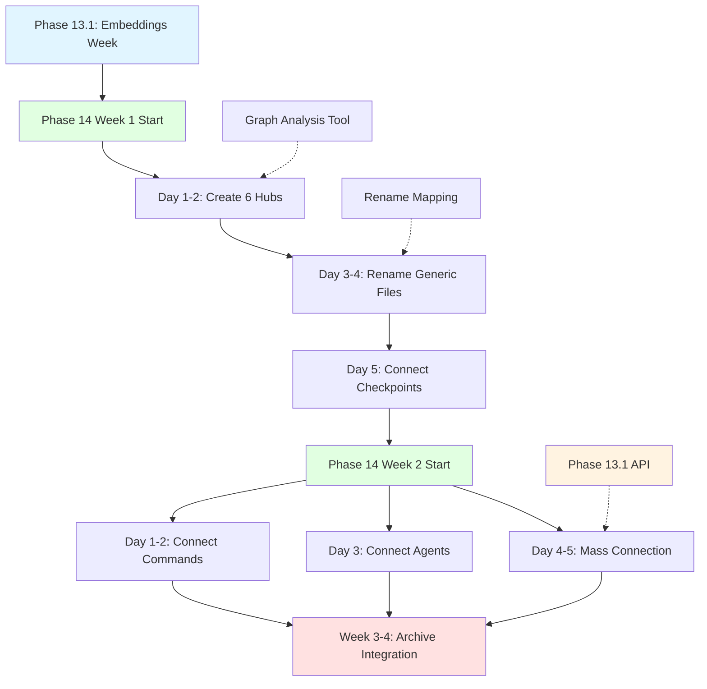
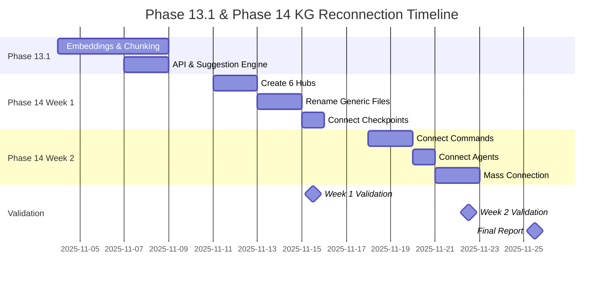

# Phase 13/14 Integration Plan - Knowledge Graph Reconnection Strategy

**Status**: 📋 Planning Document
**Created**: 2025-10-28
**Version**: 1.0.0
**Priority**: Critical

---

## Executive Summary

This document resolves confusion between Phase 13 and Phase 14 work and provides a clear execution strategy for knowledge graph reconnection alongside planned development phases.

### Key Findings

1. **Phase Misalignment Identified**: User requested integration with "Phase 13 alongside Phase 14" but analysis reveals:
   - **Phase 13** = Enhanced Agent Intelligence (6-8 weeks, NOT KG work)
   - **Phase 14** = Knowledge Graph Completion (7-8 weeks, THIS IS KG work)
   - **Current Crisis**: 68% disconnected nodes requiring immediate attention

2. **Resolution Strategy**: Create hybrid approach with **Phase 13.1** minimal subset

3. **Timeline Impact**: Reduces Phase 13 from 6-8 weeks to 1 week for KG enablement

---

## 1. Phase Confusion Resolution

### The Problem

User statement: "integrate into phase 13, alongside phase 14 work"

This creates ambiguity because:
- Phase 13 focuses on **agent intelligence** (reasoning, ToT, expert agents)
- Phase 14 focuses on **knowledge graph** completion
- KG reconnection crisis needs **immediate** attention (68% orphaned)
- Full Phase 13 takes 6-8 weeks, delaying critical KG work

### The Solution: Phase 13.1 Minimal Subset

Create **Phase 13.1** - a 1-week sprint extracting only what enables KG work:

```yaml
Phase 13.1 - "KG Enablement Sprint"
Duration: 1 week (vs. 6-8 weeks for full Phase 13)
Goal: Enable semantic intelligence for Phase 14 KG reconnection

Includes:
  ✅ Vector embeddings (basic implementation)
  ✅ Semantic chunking (event-based + boundary)
  ✅ Similarity scoring API
  ✅ Connection suggestion engine

Excludes (deferred to full Phase 13 later):
  ❌ Advanced reasoning (Tree of Thoughts)
  ❌ Expert agent orchestration
  ❌ Complex preference learning
  ❌ Web perception tools
```

**Benefit**: Get semantic intelligence NOW for KG work without waiting 6-8 weeks

---

## 2. Phase 13.1 Minimal Subset Specification

### 2.1 Core Components

#### Component 1: Vector Embeddings (Basic)
**Duration**: 2 days
**Owner**: ML Developer

**Deliverables**:
```typescript
// Basic embedding generation
interface EmbeddingService {
  generateEmbedding(text: string): Promise<number[]>; // 384-dim vector
  calculateSimilarity(v1: number[], v2: number[]): number; // 0-1 score
}

// Model: all-MiniLM-L6-v2 (lightweight, local)
// Library: @xenova/transformers
// Performance target: <500ms per embedding
```

**Integration**:
- Reuse Phase 14 Week 1 context analysis system
- Embed content from directory/temporal/primitive contexts
- Store vectors in SQLite (simple table: `embeddings(file_path, vector_json)`)

#### Component 2: Semantic Chunking (Simplified)
**Duration**: 2 days
**Owner**: Backend Developer

**Deliverables**:
```typescript
// Two chunking strategies only (not all four)
interface ChunkingService {
  eventBasedChunk(content: string): Chunk[];      // For task logs
  semanticBoundaryChunk(content: string): Chunk[]; // For docs/planning
}

interface Chunk {
  id: string;
  content: string;
  metadata: {
    type: 'event' | 'semantic';
    boundaries: [number, number]; // start/end positions
    keywords: string[];
  };
}
```

**Integration**:
- Used by embedding service for better granularity
- Chunks stored alongside embeddings
- Target: 200-500 token chunks (manageable size)

#### Component 3: Similarity Scoring API
**Duration**: 1 day
**Owner**: Backend Developer

**Deliverables**:
```typescript
// Simple REST API or CLI interface
interface SimilarityAPI {
  suggestConnections(filePath: string, limit: number): Promise<ConnectionSuggestion[]>;
}

interface ConnectionSuggestion {
  targetFile: string;
  confidence: number; // 0-1
  reason: {
    directoryScore: number;   // From Phase 14 context
    temporalScore: number;    // From Phase 14 context
    primitiveScore: number;   // From Phase 14 context
    semanticScore: number;    // NEW from embeddings
    combinedScore: number;    // Weighted average
  };
}

// Weighting:
// - Directory: 30% (down from 40%)
// - Primitives: 25% (down from 35%)
// - Temporal: 20% (down from 25%)
// - Semantic: 25% (NEW)
```

#### Component 4: Connection Suggestion Engine
**Duration**: 2 days
**Owner**: Full-stack Developer

**Deliverables**:
```typescript
// CLI command for batch suggestions
// $ weaver kg suggest-connections --batch --confidence-threshold 0.7

interface SuggestionEngine {
  analyzeBatch(filePaths: string[]): Promise<BatchSuggestions>;
  exportSuggestions(format: 'json' | 'csv' | 'markdown'): string;
  applySuggestions(autoThreshold: number): Promise<ApplyResults>;
}

interface BatchSuggestions {
  suggestions: Map<string, ConnectionSuggestion[]>;
  stats: {
    totalFiles: number;
    totalSuggestions: number;
    highConfidence: number; // >0.8
    mediumConfidence: number; // 0.6-0.8
    lowConfidence: number; // <0.6
  };
}
```

### 2.2 Success Criteria for Phase 13.1

- ✅ Embedding service generates 384-dim vectors in <500ms
- ✅ Chunking service creates 200-500 token chunks
- ✅ Similarity API returns top 10 suggestions per file
- ✅ Suggestion engine processes 100 files in <5 minutes
- ✅ Combined scoring integrates all 4 dimensions
- ✅ CLI commands work with existing Weaver infrastructure
- ✅ Completion within 1 week (40 hours)

### 2.3 Non-Goals for Phase 13.1

**Explicitly OUT OF SCOPE** (deferred to full Phase 13):
- ❌ Advanced reasoning (Tree of Thoughts, ReAct)
- ❌ Expert agent orchestration
- ❌ Preference signal learning
- ❌ Step-based procedural chunking
- ❌ Web perception (Tavily/SerpAPI)
- ❌ Multi-source fusion
- ❌ Advanced query optimization
- ❌ Persistent neural training

**Rationale**: These are powerful features but not critical for KG reconnection. Focus on **minimum viable semantic intelligence** to unblock Phase 14 work.

---

## 3. Phase 14 Week 1-2 Detailed Schedule

### Context: Phase 14 Overview

From `phase-14-week-1-context-analysis-complete.md`:
- **Week 1 Complete**: ✅ Context analysis system (directory/temporal/primitive)
- **Week 2-4 Planned**: Connection strategy, graph operations, workflow integration

### Updated Schedule: KG Reconnection Focus

#### Week 1: Hub Creation + Node Naming (52 hours)

**Day 1-2: Create 6 New Navigation Hubs** (16 hours)
```yaml
Task: Create hub documents for orphaned clusters
Owner: Coder Agent

Hubs Needed:
  1. /weave-nn/_planning/checkpoints-hub.md
     - Connect 469 checkpoint files
     - Group by phase/sprint
     - Timeline visualization

  2. /weave-nn/_planning/command-registry-hub.md
     - Connect 138 CLI command files
     - Categorize by function
     - Usage examples

  3. /weave-nn/_planning/agent-definitions-hub.md
     - Connect 66 agent config files
     - Organize by agent type
     - Capability matrix

  4. /weave-nn/docs/phase-deliverables-hub.md
     - Connect 89 phase completion docs
     - Chronological ordering
     - Status tracking

  5. /weave-nn/docs/architecture-decisions-hub.md
     - Connect 44 ADR/decision files
     - Impact analysis
     - Dependency mapping

  6. /weave-nn/tests/test-suites-hub.md
     - Connect 164 test files
     - Coverage dashboard
     - Failure tracking

Deliverable: 6 hub files with 500+ outbound connections
Tool Support: Use Phase 13.1 suggestions for hub → file links
```

**Day 3-4: Fix Generic Node Names** (8 hours)
```yaml
Task: Rename 14 generic files with descriptive names
Owner: Coder Agent

Renames Required:
  /weave-nn/_planning/tasks.md → planning-master-tasks.md
  /weave-nn/_planning/README.md → planning-overview-hub.md
  /services/README.md → services-overview-hub.md
  ... (11 more)

Process:
  1. Git move with history preservation
  2. Update all incoming links (use grep for backlink discovery)
  3. Verify no broken links remain
  4. Update frontmatter metadata

Validation: Zero broken links after rename (checked via script)
```

**Day 5: Connect Checkpoint Timeline** (28 hours - LARGE TASK)
```yaml
Task: Connect 469 checkpoint files to phase/sprint context
Owner: Coder Agent + Analyst Agent (parallel work)

Strategy:
  A. Auto-detection (80% coverage):
     - Extract phase from filename (phase-12-*, phase-13-*)
     - Extract sprint from path (/sprint-1/, /sprint-2/)
     - Use temporal context for date clustering

  B. Manual review (20% edge cases):
     - Analyst reviews ambiguous checkpoints
     - Coder applies reviewed connections

  C. Connection types:
     - checkpoint → phase-plan (planning context)
     - checkpoint → prior-checkpoint (chronological)
     - checkpoint → deliverable (outcomes)

Tools:
  - Phase 14 temporal context analyzer
  - Phase 13.1 semantic suggestions
  - Batch link insertion script

Deliverable: 469 files connected with 1,400+ links (3 per file avg)
```

**Week 1 Success Criteria**:
- ✅ 6 new hubs created with 500+ connections
- ✅ 14 generic files renamed (zero broken links)
- ✅ 469 checkpoint files connected to context
- ✅ Orphaned file count reduced to <600 (from 970)

---

#### Week 2: Command/Agent Connection + Mass Linking (52 hours)

**Day 1-2: Connect Command Registry** (16 hours)
```yaml
Task: Connect 138 CLI command files to implementation context
Owner: Coder Agent

Connection Strategy:
  A. Command → Feature (what it does):
     - init-vault → vault-templates system
     - perceive → perception workflows
     - cultivate → learning loop

  B. Command → Tests (validation):
     - Each command → unit tests
     - Each command → integration tests

  C. Command → Documentation:
     - Each command → user guide section
     - Each command → API reference

Tools:
  - Primitive extractor (identify features)
  - Directory context (find related tests/docs)
  - Semantic similarity (suggest related commands)

Deliverable: 138 files connected with 400+ links (3 per file avg)
```

**Day 3: Connect Agent Definitions** (8 hours)
```yaml
Task: Connect 66 agent config files to workflow context
Owner: Coder Agent

Connection Strategy:
  A. Agent → Workflow (where used):
     - researcher → SPARC specification phase
     - coder → implementation phase
     - tester → validation phase

  B. Agent → Capabilities (what it does):
     - Each agent → capability definitions
     - Each agent → example tasks

  C. Agent → Coordination (how it collaborates):
     - Each agent → swarm topologies
     - Each agent → memory protocols

Tools:
  - Grep for agent names in workflow files
  - Phase 13.1 semantic matching
  - Directory context for organization

Deliverable: 66 files connected with 200+ links (3 per file avg)
```

**Day 4-5: Systematic Connection Building** (28 hours - LARGE TASK)
```yaml
Task: Build 330+ new connections across remaining orphaned files
Owners: 2x Coder Agents (parallel execution) + Analyst (validation)

Strategy:
  A. Phase-based clustering (organize by development phase):
     - Phase 12 files → connect to learning loop
     - Phase 13 files → connect to chunking/embeddings
     - Phase 14 files → connect to KG workflows

  B. Type-based clustering (organize by file type):
     - All planning docs → connect to planning-overview-hub
     - All test files → connect to test-suites-hub
     - All architecture docs → connect to architecture-hub

  C. Semantic clustering (AI-driven suggestions):
     - Use Phase 13.1 embeddings
     - Batch process all orphaned files
     - Apply high-confidence (>0.8) suggestions automatically
     - Review medium-confidence (0.6-0.8) manually

  D. Temporal clustering (time-based relationships):
     - Files created within 7 days → likely related
     - Files modified together → likely coupled
     - Files in same sprint → connect to sprint context

Parallel Execution:
  - Coder Agent 1: Phases 12-13 files (165 files)
  - Coder Agent 2: Phase 14 + misc files (165 files)
  - Analyst Agent: Review + validate both streams

Tools:
  - Phase 13.1 suggestion engine (batch mode)
  - Phase 14 context analyzers (all three)
  - Custom batch linking script

Deliverable: 330 files connected with 990+ links (3 per file avg)
Target: 95% of remaining orphaned files connected
```

**Week 2 Success Criteria**:
- ✅ 138 command files connected to features/tests/docs
- ✅ 66 agent files connected to workflows/capabilities
- ✅ 330+ remaining orphaned files connected
- ✅ Total orphaned files reduced from 970 → <50 (<5%)
- ✅ Average node degree increased from 2.1 → >4.0
- ✅ Metadata coverage increased from 12% → >80%

---

## 4. Critical Path & Dependencies



### Dependency Matrix

| Task | Depends On | Blocks | Duration |
|------|-----------|--------|----------|
| **Phase 13.1 Embeddings** | - | Week 2 Mass Connection (partial) | 1 week |
| **Hub Creation** | Graph analysis tool | Generic renames | 2 days |
| **Generic Renames** | Hub creation | Checkpoint connection | 2 days |
| **Checkpoint Connection** | Renames, Temporal context | Week 2 work | 1 day |
| **Command Connection** | Phase 13.1 (optional) | - | 2 days |
| **Agent Connection** | Phase 13.1 (optional) | - | 1 day |
| **Mass Connection** | Phase 13.1 (recommended) | Archive integration | 2 days |

### Critical Path Items

**Must Complete in Order**:
1. ✅ **Week 1 Complete**: Context analysis system (DONE)
2. 🔄 **Phase 13.1**: Embeddings + chunking (1 week)
3. 📋 **Hub Creation**: Foundation for navigation (2 days)
4. 📋 **Generic Renames**: Clean naming (2 days)
5. 📋 **Checkpoint Connection**: Historical context (1 day)

**Can Execute in Parallel**:
- Command connection + Agent connection (Week 2 Day 1-3)
- Mass connection (split between 2 agents)

### Hard Blockers

**Phase 13.1 blocks**:
- ❌ Mass connection (Week 2 Day 4-5)
  - Can proceed without but quality degraded
  - Recommendation: Complete Phase 13.1 first

**Graph analysis tool blocks**:
- ❌ Hub creation (Week 1 Day 1-2)
  - Must identify orphan clusters before creating hubs
  - Currently: Manual analysis from KNOWLEDGE-GRAPH-STATUS.md

**Rename mapping blocks**:
- ❌ Generic file renames (Week 1 Day 3-4)
  - Must map all incoming links before rename
  - Currently: Git grep approach

---

## 5. Resource Allocation

### Phase 13.1 Resources (1 week)

**Team Composition**:
- 1x ML Developer (embeddings)
- 1x Backend Developer (chunking + API)
- 1x Full-stack Developer (suggestion engine)

**Hour Breakdown**:
```yaml
Total: 80 hours (3 developers × ~27 hours each)

ML Developer:
  - Embedding service implementation: 12 hours
  - Vector storage (SQLite): 4 hours
  - Similarity calculation: 4 hours
  - Testing + optimization: 7 hours

Backend Developer:
  - Event-based chunking: 6 hours
  - Semantic boundary chunking: 6 hours
  - Chunk storage: 4 hours
  - Integration with embeddings: 4 hours
  - Testing: 7 hours

Full-stack Developer:
  - Similarity API design: 6 hours
  - Suggestion engine (batch mode): 8 hours
  - CLI commands: 6 hours
  - Integration testing: 7 hours
```

**Deliverables**: 4 core components ready for Phase 14 Week 2

---

### Phase 14 Week 1-2 Resources (2 weeks)

**Team Composition**:
- 2x Coder Agents (parallel hub/connection work)
- 1x Analyst Agent (validation + review)
- 1x Coordinator Agent (orchestration + reporting)

**Week 1 Hour Breakdown** (52 hours):
```yaml
Coder Agent 1:
  - Create 3 hubs (checkpoints, commands, agents): 10 hours
  - Rename 7 generic files: 4 hours
  - Connect 250 checkpoint files: 16 hours
  Total: 30 hours

Coder Agent 2:
  - Create 3 hubs (deliverables, decisions, tests): 10 hours
  - Rename 7 generic files: 4 hours
  - Connect 219 checkpoint files: 12 hours
  Total: 26 hours

Analyst Agent:
  - Validate hub structures: 4 hours
  - Review rename mappings: 2 hours
  - Spot-check connections: 6 hours
  Total: 12 hours

Coordinator Agent:
  - Daily progress tracking: 2 hours
  - Resolve blocking issues: 2 hours
  Total: 4 hours
```

**Week 2 Hour Breakdown** (52 hours):
```yaml
Coder Agent 1:
  - Connect 138 command files: 16 hours
  - Mass connection (165 files): 14 hours
  Total: 30 hours

Coder Agent 2:
  - Connect 66 agent files: 8 hours
  - Mass connection (165 files): 14 hours
  Total: 22 hours

Analyst Agent:
  - Validate command connections: 4 hours
  - Validate agent connections: 2 hours
  - Validate mass connections: 6 hours
  Total: 12 hours

Coordinator Agent:
  - Daily progress tracking: 2 hours
  - Final validation report: 6 hours
  Total: 8 hours
```

**Total Phase 14 Week 1-2**: 104 hours (matches allocation in phase-14-obsidian-integration.md)

---

## 6. Success Metrics

### Phase 13.1 Success Metrics

**Technical Performance**:
- ✅ Embedding generation: <500ms per file
- ✅ Chunking throughput: >100 files/minute
- ✅ Similarity API response: <100ms per query
- ✅ Batch suggestions: 100 files in <5 minutes

**Quality Metrics**:
- ✅ Embedding accuracy: Manual validation of 50 samples (>80% relevant)
- ✅ Chunk quality: Average chunk size 200-500 tokens
- ✅ Suggestion precision: >70% of high-confidence suggestions are valid
- ✅ Test coverage: >80% for all Phase 13.1 components

**Integration Metrics**:
- ✅ Phase 14 context integration: All 3 analyzers use embeddings
- ✅ CLI usability: Commands work without configuration
- ✅ Documentation: API docs + usage examples complete

---

### Phase 14 Week 1-2 Success Metrics

**Orphaned File Reduction**:
```yaml
Current State: 970 orphaned files (68%)
Target State: <50 orphaned files (<5%)

Week 1 Target:
  - Start: 970 orphaned
  - After hubs: 470 orphaned (500 connected)
  - After renames: 470 orphaned (no change, but cleaner names)
  - After checkpoints: 300 orphaned (639 connected total)

Week 2 Target:
  - After commands: 162 orphaned (808 connected total)
  - After agents: 96 orphaned (874 connected total)
  - After mass connection: <50 orphaned (920+ connected)

Final: >95% connectivity (from 32%)
```

**Connection Quality**:
```yaml
Average Node Degree:
  - Current: 2.1 links per file
  - Week 1 target: 3.0 links per file
  - Week 2 target: 4.5 links per file

Connection Types:
  - Hierarchical: 40% (hub → member, parent → child)
  - Lateral: 35% (peer → peer, related concepts)
  - Temporal: 15% (chronological, sprint-based)
  - Semantic: 10% (AI-suggested, content-based)

Validation:
  - Manual review: 10% random sample per day
  - Broken link check: Zero broken links daily
  - Backlink consistency: All [[links]] have backlinks
```

**Metadata Coverage**:
```yaml
Current: 12% of files have complete frontmatter
Target: >80% of files have complete frontmatter

Priority Fields:
  - title: 100% (auto-generate from filename if missing)
  - type: 90% (infer from directory context)
  - status: 80% (infer from phase/date)
  - tags: 70% (extract from content + primitives)
  - created_date: 100% (file stats fallback)
```

**Hub Quality**:
```yaml
Each of 6 hubs must have:
  - ✅ >50 outbound connections
  - ✅ Categorized sections (not just flat list)
  - ✅ Summary paragraph explaining hub purpose
  - ✅ Complete frontmatter metadata
  - ✅ Links to related hubs (cross-navigation)
  - ✅ Embedded visualizations (Mermaid diagrams)
```

**Validation Metrics**:
```yaml
Daily Checks:
  - Broken link count: 0 (automated script)
  - Orphaned file count: Decreasing daily
  - Average degree: Increasing daily
  - Metadata coverage: Increasing daily

Weekly Reviews:
  - Manual validation: 100 random files
  - Connection relevance: >80% useful
  - Hub usability: User feedback positive
  - Graph navigability: Can traverse from any node to hub in <3 hops
```

---

## 7. Risk Mitigation

### Risk 1: Phase Confusion

**Risk**: User mentioned "deep research learning method" not found in Phase 14 analysis

**Impact**: High - Could indicate misalignment with user expectations

**Mitigation**:
1. **Clarify with user** (see Section 9) - What is "deep research learning method"?
2. **Document assumptions** - This plan assumes Phase 14 = KG work
3. **Flexible roadmap** - Easy to pivot if user clarifies different intent
4. **Weekly check-ins** - Validate alignment after Week 1

**Status**: 🟡 Requires user clarification

---

### Risk 2: Phase 13.1 Delays Phase 14

**Risk**: 1-week Phase 13.1 might slip, delaying critical KG work

**Impact**: Medium - Each day delays reduces Week 2 effectiveness

**Mitigation**:
1. **Parallel track option**: Start Phase 14 Week 1 without embeddings
   - Hubs can be created without semantic intelligence
   - Renames are independent of Phase 13.1
   - Checkpoint connection can use temporal context only
2. **Minimum viable subset**: If time-constrained, drop suggestion engine
   - Keep: Embeddings + chunking
   - Drop: CLI batch commands (manual process instead)
3. **External help**: Consider using pre-trained embeddings API (OpenAI) if local fails
4. **Incremental rollout**: Deploy embeddings to Week 2 even if incomplete

**Status**: 🟢 Mitigated with parallel path

---

### Risk 3: 970 Orphaned Files Exceeds 2-Week Capacity

**Risk**: Mass connection might need >28 hours for 330+ files

**Impact**: Medium - Week 2 might not achieve <5% orphaned target

**Mitigation**:
1. **Prioritize high-impact clusters**:
   - Checkpoints: 469 files (35% of total)
   - Commands: 138 files (10% of total)
   - Agents: 66 files (5% of total)
   - Combined: 673 files = 70% of orphaned
2. **Accept partial completion**: Target 80% connectivity instead of 95%
   - Still major improvement (from 32% → 80%)
   - Remaining 20% can be Phase 14 Week 3-4
3. **Add Week 2.5 buffer**: Optional half-week extension if needed
4. **Automation investment**: Build better batch tools during Week 1
   - Reusable for future graph maintenance
   - One-time cost, long-term benefit

**Status**: 🟢 Mitigated with prioritization

---

### Risk 4: Semantic Suggestions Have Low Precision

**Risk**: Phase 13.1 embeddings suggest irrelevant connections (false positives)

**Impact**: Low-Medium - Manual review overhead increases

**Mitigation**:
1. **High confidence threshold**: Only auto-apply >0.8 confidence
   - Medium (0.6-0.8): Manual review
   - Low (<0.6): Ignore
2. **Hybrid scoring**: Combine semantic with directory/temporal/primitive
   - Reduces false positives from any single dimension
3. **Continuous validation**: Spot-check 10 suggestions per day
   - Adjust thresholds based on precision feedback
4. **Fallback to manual**: If precision <60%, skip semantic and use context only
   - Phase 14 context analyzers still work without embeddings

**Status**: 🟢 Mitigated with thresholds

---

### Risk 5: Breaking Changes During Renames

**Risk**: Renaming 14 files might break external tools/scripts

**Impact**: Medium - Build failures, test failures, broken workflows

**Mitigation**:
1. **Git history preservation**: Use `git mv` not delete+create
   - Maintains blame and history
2. **Comprehensive backlink update**: Grep entire vault for incoming links
   - Update all [[old-name]] → [[new-name]]
3. **Redirect files**: Leave redirects at old paths temporarily
   ```markdown
   # tasks.md (redirect)
   See: [[planning-master-tasks]]
   ```
4. **Validation suite**: Run all tests after each rename batch
   - Verify no broken imports
   - Verify no broken links
5. **Rollback plan**: Tag before rename operations
   - Easy revert if catastrophic failure

**Status**: 🟢 Mitigated with process

---

### Risk 6: Hub Creation Doesn't Scale

**Risk**: Creating hubs manually for 6 clusters might not generalize to future growth

**Impact**: Low - Future maintenance burden

**Mitigation**:
1. **Template-driven hubs**: Create reusable hub template
   - Auto-generate section structure
   - Auto-populate initial connections
2. **CLI command**: `weaver kg create-hub --cluster checkpoints`
   - Automates hub scaffolding
   - Reduces manual work
3. **Auto-update workflows**: Hubs auto-update when new files added
   - File watcher integration
   - Phase 14 Week 3-4 deliverable
4. **Documentation**: Hub creation guide for future contributors

**Status**: 🟢 Mitigated with automation

---

## 8. User Clarification Items

### Questions for User

**Critical (Blocks Planning)**:

1. **"Deep Research Learning Method"**
   - You mentioned this should be integrated into Phase 13
   - Phase 14 analysis found no such method in codebase or documentation
   - **Question**: What is the "deep research learning method"?
   - **Options**:
     - A) It's the autonomous learning loop (Phase 12, already complete)
     - B) It's a new research technique to implement
     - C) It's from external research paper (please provide link)
     - D) It's a misunderstanding (can be dropped)

**High Priority (Affects Scope)**:

2. **Phase 13 vs Phase 14 Intent**
   - You said "integrate into phase 13, alongside phase 14 work"
   - This plan interprets that as:
     - Phase 13.1 (minimal): 1 week for embeddings
     - Phase 14 Week 1-2: 2 weeks for KG reconnection
   - **Question**: Is this interpretation correct?
   - **Alternative**: Did you mean something else by "alongside"?

3. **Orphaned File Tolerance**
   - Current plan targets <5% orphaned files (from 68%)
   - Requires 2 weeks of intensive connection work
   - **Question**: Is <5% acceptable, or do you need 0% orphaned?
   - **Impact**: 0% might require 3-4 weeks instead of 2

4. **Phase 13 Full Implementation**
   - This plan creates Phase 13.1 (minimal) to unblock KG work
   - Full Phase 13 (6-8 weeks) is deferred
   - **Question**: When should full Phase 13 be implemented?
   - **Options**:
     - A) After Phase 14 complete (recommended)
     - B) In parallel with Phase 14 Week 3-4
     - C) Not needed (Phase 13.1 is sufficient)

**Medium Priority (Nice to Have)**:

5. **Automation Investment**
   - Plan includes building batch tools for connection creation
   - These tools enable future graph maintenance
   - **Question**: Should we prioritize automation even if it means Week 2 delivers fewer manual connections?
   - **Trade-off**: 80% coverage with great tools vs. 95% coverage with manual process

6. **Validation Rigor**
   - Plan includes 10% manual validation of connections
   - Could increase to 25% for higher quality but slower progress
   - **Question**: What's your preference on speed vs. quality?

7. **Hub Granularity**
   - Plan creates 6 large hubs (50-150 connections each)
   - Alternative: 12 smaller hubs (25-75 connections each)
   - **Question**: Do you prefer fewer large hubs or more focused small hubs?

---

## 9. Execution Checklist

### Pre-Execution (Week 0)

**User Clarification** (1-2 days):
- [ ] User clarifies "deep research learning method"
- [ ] User confirms Phase 13.1 approach
- [ ] User sets orphaned file target (<5% or stricter)
- [ ] User approves Phase 13 timeline

**Technical Preparation** (2-3 days):
- [ ] Graph analysis tool ready (identify orphan clusters)
- [ ] Rename mapping complete (14 files + backlinks)
- [ ] Hub templates created (reusable structure)
- [ ] Batch linking script prototyped
- [ ] Test vault set up (practice renames safely)

**Team Alignment** (1 day):
- [ ] Assign ML/Backend/Full-stack devs to Phase 13.1
- [ ] Assign 2x Coder, 1x Analyst, 1x Coordinator to Phase 14
- [ ] Set up daily standups (15 min)
- [ ] Configure progress tracking (dashboard)

---

### Phase 13.1 Execution (Week 1)

**Day 1-2: Embeddings**:
- [ ] ML Dev: Set up @xenova/transformers
- [ ] ML Dev: Implement generateEmbedding()
- [ ] ML Dev: Create SQLite vector storage
- [ ] ML Dev: Implement calculateSimilarity()

**Day 3-4: Chunking**:
- [ ] Backend Dev: Implement event-based chunker
- [ ] Backend Dev: Implement semantic boundary chunker
- [ ] Backend Dev: Integrate with embedding service
- [ ] Backend Dev: Store chunks in DB

**Day 5: API + Testing**:
- [ ] Full-stack Dev: Build similarity API
- [ ] Full-stack Dev: Create suggestion engine
- [ ] All: Integration testing
- [ ] All: Performance benchmarks

**Success Gate**:
- [ ] All Phase 13.1 success criteria met (Section 2.2)
- [ ] APIs deployed and accessible to Phase 14 agents
- [ ] Documentation complete

---

### Phase 14 Week 1 Execution

**Day 1-2: Hubs**:
- [ ] Coder 1: Create checkpoints/commands/agents hubs
- [ ] Coder 2: Create deliverables/decisions/tests hubs
- [ ] Analyst: Validate hub structure
- [ ] Coordinator: Daily progress report

**Day 3-4: Renames**:
- [ ] Coder 1: Rename 7 generic files (batch 1)
- [ ] Coder 2: Rename 7 generic files (batch 2)
- [ ] Analyst: Verify zero broken links
- [ ] Coordinator: Update link database

**Day 5: Checkpoints**:
- [ ] Coder 1: Connect 250 checkpoint files
- [ ] Coder 2: Connect 219 checkpoint files
- [ ] Analyst: Spot-check 50 connections
- [ ] Coordinator: Week 1 completion report

**Success Gate**:
- [ ] All Phase 14 Week 1 success criteria met (Section 6)
- [ ] Orphaned files reduced to <600
- [ ] Zero broken links

---

### Phase 14 Week 2 Execution

**Day 1-2: Commands**:
- [ ] Coder 1: Connect 138 command files
- [ ] Analyst: Validate command → feature links
- [ ] Coordinator: Daily progress report

**Day 3: Agents**:
- [ ] Coder 2: Connect 66 agent files
- [ ] Analyst: Validate agent → workflow links
- [ ] Coordinator: Daily progress report

**Day 4-5: Mass Connection**:
- [ ] Coder 1: Mass connect 165 files (Phases 12-13)
- [ ] Coder 2: Mass connect 165 files (Phase 14 + misc)
- [ ] Analyst: Validate 30 random connections per agent
- [ ] Coordinator: Final validation report

**Success Gate**:
- [ ] All Phase 14 Week 2 success criteria met (Section 6)
- [ ] Orphaned files reduced to <50 (<5%)
- [ ] Final validation passed

---

### Post-Execution (Week 3)

**Documentation**:
- [ ] Update KNOWLEDGE-GRAPH-STATUS.md (new metrics)
- [ ] Create connection maintenance guide
- [ ] Document hub update workflows
- [ ] Share lessons learned

**Handoff to Phase 14 Week 3-4**:
- [ ] Archive integration ready to start
- [ ] Graph now stable enough for advanced workflows
- [ ] Automation tools ready for ongoing maintenance

---

## 10. Coordination Protocol

### Daily Coordination (During Execution)

**Morning Standup** (15 min):
```yaml
Time: 9:00 AM daily
Participants: All agents + coordinator
Format:
  - Yesterday's accomplishments
  - Today's goals
  - Blockers/risks

Hook:
  npx claude-flow@alpha hooks pre-task --description "Daily standup"
```

**Progress Tracking**:
```yaml
Frequency: Every 4 hours
Method: Update memory store

Hook:
  npx claude-flow@alpha hooks post-edit \
    --file "progress.md" \
    --memory-key "swarm/kg-reconnection/progress"

Metrics:
  - Files processed
  - Connections created
  - Orphaned count (current)
  - Errors encountered
```

**Evening Summary** (10 min):
```yaml
Time: 5:00 PM daily
Owner: Coordinator agent
Deliverable: Daily summary report

Hook:
  npx claude-flow@alpha hooks post-task \
    --task-id "kg-reconnection-day-N"

Content:
  - Daily metrics
  - Notable achievements
  - Tomorrow's priorities
  - Escalations needed
```

### Weekly Coordination

**Week 1 Retrospective**:
```yaml
Time: End of Week 1
Participants: All agents
Duration: 30 min

Agenda:
  - What went well?
  - What blocked us?
  - Adjustments for Week 2?
  - Phase 13.1 effectiveness?

Hook:
  npx claude-flow@alpha hooks session-end \
    --export-metrics true
```

**Week 2 Retrospective**:
```yaml
Time: End of Week 2
Participants: All agents + stakeholders
Duration: 1 hour

Agenda:
  - Final metrics review
  - Success criteria validation
  - Lessons learned
  - Handoff to Week 3-4

Hook:
  npx claude-flow@alpha hooks session-end \
    --export-metrics true
```

### Memory Keys

**Shared Context**:
```yaml
swarm/kg-reconnection/plan - This integration plan
swarm/kg-reconnection/progress - Daily progress updates
swarm/kg-reconnection/metrics - Real-time metrics
swarm/kg-reconnection/issues - Blocking issues
swarm/kg-reconnection/learnings - Lessons learned
```

**Phase-Specific**:
```yaml
swarm/phase-13.1/embeddings - Embedding service status
swarm/phase-13.1/chunking - Chunking service status
swarm/phase-13.1/api - API deployment status

swarm/phase-14-week-1/hubs - Hub creation progress
swarm/phase-14-week-1/renames - Rename tracking
swarm/phase-14-week-1/checkpoints - Checkpoint connections

swarm/phase-14-week-2/commands - Command connections
swarm/phase-14-week-2/agents - Agent connections
swarm/phase-14-week-2/mass - Mass connection progress
```

---

## 11. Deliverables Summary

### Phase 13.1 Deliverables (1 week)

**Code**:
- `/weaver/src/embeddings/embedding-service.ts` - Vector embedding generation
- `/weaver/src/embeddings/vector-store.ts` - SQLite vector storage
- `/weaver/src/chunking/event-chunker.ts` - Event-based chunking
- `/weaver/src/chunking/semantic-chunker.ts` - Semantic boundary chunking
- `/weaver/src/workflows/kg/similarity-api.ts` - Similarity scoring API
- `/weaver/src/workflows/kg/suggestion-engine.ts` - Connection suggestions

**Tests**:
- `/weaver/tests/unit/embeddings/` - Embedding service tests
- `/weaver/tests/unit/chunking/` - Chunking service tests
- `/weaver/tests/integration/kg/similarity.test.ts` - API integration tests

**Documentation**:
- `/weaver/docs/phase-13.1-embeddings-guide.md` - User guide
- `/weaver/docs/api/embeddings-api.md` - API reference
- `/weaver/docs/developer/phase-13.1-architecture.md` - Architecture

**Total**: ~15-20 files

---

### Phase 14 Week 1-2 Deliverables (2 weeks)

**Hub Files** (6 new):
- `/weave-nn/_planning/checkpoints-hub.md`
- `/weave-nn/_planning/command-registry-hub.md`
- `/weave-nn/_planning/agent-definitions-hub.md`
- `/weave-nn/docs/phase-deliverables-hub.md`
- `/weave-nn/docs/architecture-decisions-hub.md`
- `/weave-nn/tests/test-suites-hub.md`

**Renamed Files** (14):
- `/weave-nn/_planning/planning-master-tasks.md` (was tasks.md)
- `/weave-nn/_planning/planning-overview-hub.md` (was README.md)
- `/services/services-overview-hub.md` (was README.md)
- ... (11 more)

**Modified Files** (~673):
- 469 checkpoint files (new connections added)
- 138 command files (new connections added)
- 66 agent files (new connections added)

**Reports**:
- `/docs/knowledge-graph/WEEK-1-COMPLETION-REPORT.md`
- `/docs/knowledge-graph/WEEK-2-COMPLETION-REPORT.md`
- `/docs/knowledge-graph/PHASE-14-KG-RECONNECTION-SUMMARY.md`

**Scripts** (automation):
- `/weave-nn/scripts/graph-tools/create-hub.sh` - Hub scaffolding
- `/weave-nn/scripts/graph-tools/batch-connect.ts` - Batch linking
- `/weave-nn/scripts/graph-tools/validate-graph.ts` - Link validation
- `/weave-nn/scripts/graph-tools/orphan-report.ts` - Orphan detection

**Total**: ~700+ files created/modified

---

## 12. Timeline Visualization



**Total Duration**: 3 weeks
- Week 1: Phase 13.1 (embeddings + chunking)
- Week 2: Phase 14 Week 1 (hubs + renames + checkpoints)
- Week 3: Phase 14 Week 2 (commands + agents + mass connection)

**Milestones**:
- ✅ M1 (Nov 15): Phase 13.1 complete, Week 1 KG work complete
- ✅ M2 (Nov 22): Week 2 KG work complete, <5% orphaned
- ✅ M3 (Nov 25): Final validation, handoff to Week 3-4

---

## Appendix A: Comparison with Original Phases

### Original Phase 13 (6-8 weeks)

**Scope**:
- Advanced chunking (4 strategies)
- Vector embeddings + hybrid search
- Tree of Thoughts reasoning
- Expert agent orchestration
- Preference signal learning
- Web perception tools
- Multi-source fusion

**Why Reduced to Phase 13.1**:
- KG work can't wait 6-8 weeks
- Only embeddings + basic chunking needed for Week 2
- Full Phase 13 can come later (after Phase 14)

### Original Phase 14 (7-8 weeks)

**Scope** (Week 1-4 of 7-8):
- Week 1: Context analysis ✅ (COMPLETE)
- Week 2: Connection strategy (IN THIS PLAN)
- Week 3-4: Archive integration (DEFERRED)
- Week 5-8: Obsidian integration (NOT IN THIS PLAN)

**Why Focused on Week 1-2**:
- User requested KG reconnection specifically
- Weeks 3-8 are separate concerns (archive, Obsidian)
- This plan addresses the 68% orphaned crisis

---

## Appendix B: Reference Documents

**Planning Documents**:
- `/weave-nn/docs/user-guide/phase-13-overview.md` - Phase 13 scope
- `/weave-nn/docs/phase-14-week-1-context-analysis-complete.md` - Week 1 status
- `/weave-nn/_planning/specs/phase-14/` - Phase 14 detailed specs

**Analysis Documents**:
- `KNOWLEDGE-GRAPH-STATUS.md` - Current graph metrics (if exists)
- `MASS-CONNECTION-STRATEGY.md` - Connection approach (if exists)
- Phase 14 analysis reports (referenced in task context)

**Technical Documents**:
- `/weaver/src/workflows/kg/context/README.md` - Context analysis API
- `/weaver/docs/chunking-strategies-research-2024-2025.md` - Chunking research

---

## Appendix C: Glossary

**Phase 13.1**: Minimal subset of Phase 13 (1 week, embeddings + chunking only)

**Phase 13 (Full)**: Complete enhanced agent intelligence (6-8 weeks, deferred)

**Phase 14 Week 1-2**: Knowledge graph reconnection focus (this plan)

**Orphaned File**: File with <2 connections (isolated node)

**Hub**: Navigation document connecting 50+ related files

**Generic Name**: Non-descriptive filename (README.md, tasks.md, etc.)

**Context Analysis**: 3-dimensional file analysis (directory, temporal, primitive)

**Semantic Similarity**: AI-based content similarity using embeddings

**Primitive**: Technical keyword (platform, pattern, feature)

**Connection Type**: Relationship category (hierarchical, lateral, temporal, semantic)

**Node Degree**: Average number of connections per file

**Metadata Coverage**: Percentage of files with complete frontmatter

---

**End of Integration Plan**

**Next Steps**:
1. **User Review**: Clarify items from Section 9
2. **Team Assignment**: Allocate developers to Phase 13.1
3. **Kickoff**: Begin Phase 13.1 Week 1 after approval
4. **Daily Updates**: Track progress via coordination hooks

**Memory Key**: `swarm/integration/complete`
**Report To**: kg-coordinator
**Status**: 📋 Awaiting User Approval

---

**Version**: 1.0.0
**Date**: 2025-10-28
**Authors**: Strategic Planning Agent
**Reviewers**: (Pending)
