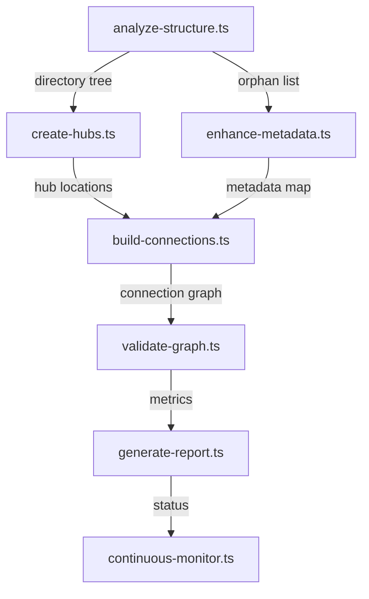

# Phase 14: Knowledge Graph Completion - System Architecture Design

**Status:** In Progress
**Created:** 2025-10-29
**Architect:** System Architecture Designer
**Priority:** Critical

## Executive Summary

### Problem Statement
The Weave-NN knowledge graph contains **2,891 markdown files** (511 in weave-nn, 2,380 in weaver) with an estimated **55% orphaned** (approximately 1,590 files with no connections). This creates:
- Poor discoverability of documentation
- Fragmented knowledge representation
- Difficulty understanding project evolution
- Loss of historical context
- Reduced value of accumulated documentation

### Solution Overview
Implement a **Hub-and-Spoke Architecture** for knowledge graph completion, combining:
1. **Hub Documents** - Central navigation points for each domain
2. **Automated Workflows** - DevKit-powered connection building
3. **Metadata Enrichment** - Systematic frontmatter standardization
4. **Timeline Narrative** - Phase evolution storytelling
5. **Archive Integration** - Historical context preservation

### Success Metrics
- **Orphaned Files:** 55% → <5% (from ~1,590 to <145 files)
- **Metadata Coverage:** <50% → >90%
- **Hub Coverage:** 0% → 100% (15+ hub documents)
- **Average Connections per File:** <2 → >5
- **Broken Links:** 0 detected
- **New Connections Added:** 330+

## System Architecture

### 1. Hub Document Architecture

#### 1.1 Hub Taxonomy

```
Root Hub (Level 0)
├── WEAVE-NN-HUB.md (Project root)
│
├── Domain Hubs (Level 1)
│   ├── PLANNING-HUB.md
│   ├── DOCUMENTATION-HUB.md
│   ├── ARCHITECTURE-HUB.md
│   ├── RESEARCH-HUB.md
│   ├── IMPLEMENTATION-HUB.md (weaver)
│   ├── DECISIONS-HUB.md
│   └── ARCHIVE-HUB.md
│
├── Phase Hubs (Level 2)
│   ├── PHASE-1-HUB.md
│   ├── PHASE-2-HUB.md
│   ├── ...
│   └── PHASE-14-HUB.md
│
└── Feature Hubs (Level 3)
    ├── LEARNING-LOOP-HUB.md
    ├── PERCEPTION-HUB.md
    ├── CHUNKING-HUB.md
    ├── WORKFLOW-ENGINE-HUB.md
    └── VAULT-INIT-HUB.md
```

#### 1.2 Hub Document Template

```yaml
---
title: {Domain} Hub
hub_type: {root|domain|phase|feature}
hub_level: {0|1|2|3}
parent_hub: [[parent-hub.md]]
child_hubs:
  - [[child-1.md]]
  - [[child-2.md]]
domain: {planning|docs|architecture|research|implementation}
status: active
created: YYYY-MM-DD
updated: YYYY-MM-DD
coverage_percentage: {calculated}
tags:
  - hub
  - {domain}
---

# {Domain} Hub

## Overview
{Brief description of this domain and its purpose}

## Visual Structure
```ascii
┌─────────────────────────────────┐
│  {Domain Name}                  │
├─────────────────────────────────┤
│                                 │
│  ┌──────┐  ┌──────┐  ┌──────┐ │
│  │ Cat1 │  │ Cat2 │  │ Cat3 │ │
│  └──────┘  └──────┘  └──────┘ │
│                                 │
└─────────────────────────────────┘
```

## Navigation

### Parent Hub
- [[parent-hub.md]] - Go up one level

### Sibling Hubs
- [[sibling-1.md]]
- [[sibling-2.md]]

### Child Hubs
- [[child-1.md]] - {Description}
- [[child-2.md]] - {Description}

## Key Documents

### Category 1
- [[doc-1.md]] - {Brief description}
- [[doc-2.md]] - {Brief description}

### Category 2
- [[doc-3.md]] - {Brief description}

## Quick Reference

### Most Accessed
1. [[frequently-used-1.md]]
2. [[frequently-used-2.md]]

### Getting Started
- [[quickstart.md]]
- [[tutorial.md]]

## Metadata

**Total Documents:** {count}
**Direct Children:** {count}
**Coverage:** {percentage}%
**Last Updated:** {date}
```

### 2. Workflow DevKit Architecture

#### 2.1 Workflow Dependency Graph



#### 2.2 Workflow Specifications

**Workflow 1: Structure Analyzer**
```typescript
// workflows/kg/analyze-structure.ts
'use workflow';

export interface StructureAnalysis {
  directories: DirectoryNode[];
  orphanedFiles: string[];
  missingMetadata: string[];
  brokenLinks: LinkError[];
  statistics: Statistics;
}

export async function analyzeStructure(): Promise<StructureAnalysis>
```

**Workflow 2: Hub Generator**
```typescript
// workflows/kg/create-hubs.ts
'use workflow';

export interface HubConfig {
  hubType: 'root' | 'domain' | 'phase' | 'feature';
  hubLevel: 0 | 1 | 2 | 3;
  domain: string;
  targetDirectory: string;
}

export async function createHubs(configs: HubConfig[]): Promise<HubResult[]>
```

**Workflow 3: Metadata Enhancer**
```typescript
// workflows/kg/enhance-metadata.ts
'use workflow';

export interface MetadataConfig {
  inferTags: boolean;
  inferRelations: boolean;
  validateSchema: boolean;
}

export async function enhanceMetadata(config: MetadataConfig): Promise<MetadataResult>
```

**Workflow 4: Connection Builder**
```typescript
// workflows/kg/build-connections.ts
'use workflow';

export interface ConnectionStrategy {
  strategy: 'semantic' | 'directory' | 'temporal' | 'hybrid';
  minSimilarity: number;
  maxConnections: number;
}

export async function buildConnections(strategy: ConnectionStrategy): Promise<ConnectionResult>
```

**Workflow 5: Graph Validator**
```typescript
// workflows/kg/validate-graph.ts
'use workflow';

export interface ValidationConfig {
  checkOrphans: boolean;
  checkBrokenLinks: boolean;
  checkMetadata: boolean;
  generateReport: boolean;
}

export async function validateGraph(config: ValidationConfig): Promise<ValidationResult>
```

### 3. Phase Evolution Timeline Architecture

#### 3.1 Timeline Structure

```yaml
phases:
  - phase: 1
    name: "Knowledge Graph Transformation"
    period: "2024-01"
    status: completed
    goals: [...original goals...]
    implemented: [...what was actually built...]
    changes: [...deviations from plan...]
    lessons: [...key learnings...]
    documents:
      planning: [[phase-1-planning.md]]
      spec: [[phase-1-spec.md]]
      deliverables: [[phase-1-deliverables.md]]
    superseded_by:
      - phase: 5
        feature: "MCP Integration"
        reason: "Enhanced coordination capabilities"
```

#### 3.2 Timeline Narrative Template

```markdown
# Phase {N}: {Name}

## Timeline
**Period:** {YYYY-MM}
**Duration:** {weeks}
**Status:** {completed|in-progress|planned}

## Original Vision
{What we planned to build}

## What We Built
{What was actually implemented}

## Evolution
{How the plan changed and why}

## Key Decisions
- Decision: {description}
  - ADR: [[adr-XXX.md]]
  - Rationale: {why}
  - Impact: {what changed}

## Lessons Learned
1. {lesson 1}
2. {lesson 2}

## Legacy
{What persists from this phase}

## Superseded Features
- {feature}: Now handled by [[modern-implementation.md]]
  - Archived: [[archive/old-implementation.md]]
  - Migration: [[migration-guide.md]]

## Documents
- Planning: [[phase-N-planning.md]]
- Specification: [[phase-N-spec.md]]
- Implementation: [[phase-N-implementation.md]]
- Deliverables: [[phase-N-deliverables.md]]

## Next Phase
→ [[PHASE-{N+1}-HUB.md]]
```

### 4. Archive Integration Architecture

#### 4.1 Archive Metadata Schema

```yaml
---
status: archived
archived_date: YYYY-MM-DD
archived_reason: {superseded|deprecated|obsolete|merged}
modern_alternative: [[current-implementation.md]]
historical_context: "{Why this mattered historically}"
phase: {N}
replaced_by: [[replacement.md]]
migration_guide: [[migration.md]]
preservation_reason: {reference|historical|learning}
tags:
  - archived
  - {original-tags}
---
```

#### 4.2 Archive Directory Structure

```
.archive/
├── ARCHIVE-INDEX.md (master index)
├── by-phase/
│   ├── phase-1/
│   ├── phase-2/
│   └── ...
├── by-reason/
│   ├── superseded/
│   ├── deprecated/
│   └── obsolete/
└── by-topic/
    ├── infrastructure/
    ├── workflows/
    └── ...
```

### 5. Connection Building Strategy

#### 5.1 Connection Types

| Type | Description | Implementation |
|------|-------------|----------------|
| **Hierarchical** | Parent-child relationships | Hub → Documents |
| **Temporal** | Evolution over time | Phase N → Phase N+1 |
| **Semantic** | Similar content | TF-IDF + cosine similarity |
| **Implementation** | Spec → Code | Planning → weaver/src |
| **Testing** | Test → Source | tests/ → src/ |
| **Dependency** | Requires relationship | Feature A → Feature B |

#### 5.2 Connection Priority Matrix

| Source | Target | Priority | Auto-Connect |
|--------|--------|----------|--------------|
| Planning | Implementation | High | Yes |
| Research | Code | High | Yes |
| Spec | Tests | High | Yes |
| Phase N | Phase N+1 | Critical | Yes |
| Archive | Modern | Critical | Yes |
| Hub | Documents | Critical | Yes |

#### 5.3 Semantic Connection Algorithm

```typescript
interface ConnectionAlgorithm {
  // 1. Extract features
  extractFeatures(doc: string): FeatureVector;

  // 2. Calculate similarity
  calculateSimilarity(v1: FeatureVector, v2: FeatureVector): number;

  // 3. Filter candidates
  filterCandidates(similarity: number, threshold: number): boolean;

  // 4. Rank connections
  rankConnections(connections: Connection[]): Connection[];

  // 5. Insert links
  insertWikilinks(doc: string, connections: Connection[]): string;
}
```

### 6. Validation and Metrics Architecture

#### 6.1 Metrics Dashboard

```typescript
interface KnowledgeGraphMetrics {
  // Coverage Metrics
  totalFiles: number;
  orphanedFiles: number;
  orphanPercentage: number;

  // Connection Metrics
  totalConnections: number;
  avgConnectionsPerFile: number;
  connectionDensity: number;

  // Metadata Metrics
  filesWithMetadata: number;
  metadataCoverage: number;
  compliantMetadata: number;

  // Hub Metrics
  totalHubs: number;
  hubCoverage: number;
  avgDocsPerHub: number;

  // Quality Metrics
  brokenLinks: number;
  duplicateLinks: number;
  circularReferences: number;

  // Progress Metrics
  changesSinceLastRun: number;
  improvementRate: number;
  estimatedCompletion: string;
}
```

#### 6.2 Validation Rules

| Rule | Severity | Auto-Fix |
|------|----------|----------|
| Missing frontmatter | Error | Yes |
| Invalid YAML | Error | No |
| Orphaned file | Warning | Yes |
| Broken link | Error | Yes |
| Missing hub | Warning | Yes |
| Invalid metadata | Error | Yes |
| No tags | Warning | Yes |
| Circular reference | Warning | No |

## Implementation Plan

### Phase A: Foundation (Days 1-2)

**Deliverables:**
1. Structure analyzer workflow
2. Hub generator workflow
3. Root hub (WEAVE-NN-HUB.md)
4. 7 domain hubs

**Tasks:**
- [ ] Implement workflows/kg/analyze-structure.ts
- [ ] Implement workflows/kg/create-hubs.ts
- [ ] Create /weave-nn/WEAVE-NN-HUB.md
- [ ] Create domain hubs (planning, docs, architecture, research, implementation, decisions, archive)
- [ ] Establish hub → document connections

### Phase B: Timeline & Archive (Days 3-4)

**Deliverables:**
1. Phase evolution timeline
2. Archive integration
3. 14 phase hubs

**Tasks:**
- [ ] Create PHASE-EVOLUTION-TIMELINE.md
- [ ] Implement archive metadata enhancement
- [ ] Create .archive/ARCHIVE-INDEX.md
- [ ] Create phase hubs (Phase 1-14)
- [ ] Link archive documents to modern equivalents

### Phase C: Automation (Days 5-6)

**Deliverables:**
1. Metadata enhancer workflow
2. Connection builder workflow
3. Validation workflow

**Tasks:**
- [ ] Implement workflows/kg/enhance-metadata.ts
- [ ] Implement workflows/kg/build-connections.ts
- [ ] Implement workflows/kg/validate-graph.ts
- [ ] Run metadata enhancement on all files
- [ ] Build semantic connections

### Phase D: Connection Building (Days 7-8)

**Deliverables:**
1. Planning → Implementation connections
2. Research → Code connections
3. Test → Source connections
4. 330+ new connections

**Tasks:**
- [ ] Connect planning docs to weaver implementation
- [ ] Connect research papers to code
- [ ] Connect test files to source files
- [ ] Connect archive to modern equivalents

### Phase E: Validation & Optimization (Days 9-10)

**Deliverables:**
1. Validation report
2. Metrics dashboard
3. Continuous monitoring

**Tasks:**
- [ ] Run full graph validation
- [ ] Generate metrics report
- [ ] Fix broken links
- [ ] Optimize connection density
- [ ] Deploy continuous monitoring

## Technology Stack

### Workflows
- **Language:** TypeScript
- **Runtime:** Bun
- **Pattern:** `'use workflow'` directive
- **Storage:** SQLite (shadow-cache)

### Vector Search (Future)
- **Embeddings:** `@xenova/transformers`
- **Model:** `sentence-transformers/all-MiniLM-L6-v2`
- **Storage:** FAISS or local vector DB

### Markdown Processing
- **Parser:** `gray-matter`
- **YAML:** `js-yaml`
- **AST:** `remark` / `unified`

## Quality Assurance

### Testing Strategy
1. **Unit Tests:** Each workflow independently
2. **Integration Tests:** End-to-end graph building
3. **Validation Tests:** Metrics verification
4. **Performance Tests:** Large-scale processing

### Success Criteria
- ✅ Orphaned files <5%
- ✅ Metadata coverage >90%
- ✅ Hub coverage 100%
- ✅ Zero broken links
- ✅ Avg connections >5 per file
- ✅ 330+ new connections
- ✅ All workflows executable

## Risk Mitigation

| Risk | Impact | Probability | Mitigation |
|------|--------|-------------|------------|
| Large-scale link breakage | High | Medium | Backup before changes, incremental rollout |
| Performance degradation | Medium | Low | Batch processing, caching |
| Incorrect connections | Medium | Medium | Manual review of high-value connections |
| Metadata conflicts | Low | Low | Validation before commit |

## Future Enhancements

### Phase 14.5: Obsidian Integration
- Graph visualization
- Interactive navigation
- Dataview queries
- Canvas integration

### Phase 15: Intelligent Search
- Vector-based semantic search
- Context-aware suggestions
- Auto-tagging with ML
- Relationship discovery

## Conclusion

This architecture provides a systematic, automated approach to transforming the Weave-NN knowledge graph from a fragmented collection of documents into a cohesive, navigable knowledge system. By combining hub documents, automated workflows, and intelligent connection building, we can reduce orphaned files from 55% to <5% while dramatically improving discoverability and utility.

---

**Document Status:** Living Document
**Next Review:** After Phase A completion
**Maintainer:** System Architecture Team
