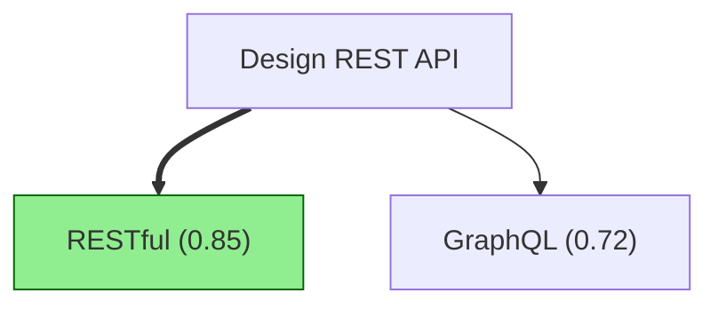

# Tree-of-Thought Reasoning Guide

Tree-of-Thought (ToT) reasoning explores multiple solution paths simultaneously, evaluating each branch to find the optimal reasoning chain. This guide shows you how to use Weaver's ToT implementation effectively.

## Table of Contents

1. [Quick Start](#quick-start)
2. [Core Concepts](#core-concepts)
3. [Evaluation Strategies](#evaluation-strategies)
4. [Pruning & Optimization](#pruning--optimization)
5. [Visualization](#visualization)
6. [Advanced Usage](#advanced-usage)
7. [Best Practices](#best-practices)

## Quick Start

```typescript
import { TreeOfThought } from '@weaver/reasoning';

// Create ToT instance
const tot = new TreeOfThought({
  maxDepth: 4,
  branchingFactor: 3,
  evaluationStrategy: 'ensemble',
});

// Explore problem space
const problem = 'Design a scalable REST API';
const bestPath = await tot.explore(problem);

// Analyze results
bestPath.forEach((node, i) => {
  console.log(`${i + 1}. ${node.thought} (confidence: ${node.value})`);
});
```

## Core Concepts

### Thought Tree Structure

A thought tree consists of nodes representing different reasoning approaches:

```typescript
interface ThoughtNode {
  id: string;           // Unique identifier
  thought: string;      // Reasoning step description
  value: number;        // Quality score (0-1)
  children: ThoughtNode[];
  parent?: string;
}
```

### Configuration Options

```typescript
interface ToTConfig {
  maxDepth?: number;              // Default: 4
  branchingFactor?: number;       // Default: 3
  evaluationStrategy?: string;    // 'value' | 'vote' | 'comparison' | 'ensemble'
  enablePruning?: boolean;        // Default: true
  pruneThreshold?: number;        // Default: 0.3
  voteCount?: number;             // Default: 5 (for vote strategy)
  ensembleWeights?: {             // For ensemble strategy
    value: number;
    vote: number;
    comparison: number;
  };
}
```

## Evaluation Strategies

### 1. Value Strategy (Baseline)

Simple heuristic-based evaluation:

```typescript
const tot = new TreeOfThought({
  evaluationStrategy: 'value',
  maxDepth: 4,
});
```

**Use when:** Quick exploration with basic quality metrics.

### 2. Vote Strategy

Multiple independent evaluations vote on best approach:

```typescript
const tot = new TreeOfThought({
  evaluationStrategy: 'vote',
  voteCount: 5,  // Number of independent evaluators
});
```

**Use when:** You need consensus from multiple perspectives.

### 3. Comparison Strategy

Pairwise comparison between branches:

```typescript
const tot = new TreeOfThought({
  evaluationStrategy: 'comparison',
});
```

**Use when:** Direct comparison is more reliable than absolute scoring.

### 4. Ensemble Strategy (Recommended)

Weighted combination of all strategies:

```typescript
const tot = new TreeOfThought({
  evaluationStrategy: 'ensemble',
  ensembleWeights: {
    value: 0.4,        // 40% weight
    vote: 0.3,         // 30% weight
    comparison: 0.3,   // 30% weight
  },
});
```

**Use when:** Maximum accuracy is needed (default choice).

## Pruning & Optimization

### Enabling Pruning

Pruning removes low-quality branches to optimize performance:

```typescript
const tot = new TreeOfThought({
  enablePruning: true,
  pruneThreshold: 0.5,  // Remove branches with value < 0.5
  maxDepth: 8,
  branchingFactor: 5,
});
```

### Performance Impact

```typescript
// Deep tree without pruning: ~1365 nodes
// Deep tree with pruning: ~400 nodes (70% reduction)

const metrics = tot.getMetrics();
console.log(`Pruned ${metrics.prunedNodes} nodes`);
console.log(`Efficiency: ${(metrics.prunedNodes / metrics.totalNodes * 100).toFixed(1)}%`);
```

### When to Prune

- ✅ Deep exploration (depth > 6)
- ✅ Wide branching (factor > 5)
- ✅ Limited computational resources
- ❌ Shallow trees (depth ≤ 3)
- ❌ When all branches might be valuable

## Visualization

### ASCII Terminal Output

```typescript
import { printTree } from '@weaver/reasoning/visualization';

const bestPath = await tot.explore(problem);
printTree(root, bestPath);
```

Output:
```
Design REST API
├─ RESTful architecture (value: 0.85)
│  ├─ Use JWT authentication (value: 0.90)
│  └─ Implement rate limiting (value: 0.82)
├─ GraphQL approach (value: 0.72)
└─ gRPC for microservices (value: 0.68)
```

### JSON Export

```typescript
import { ThoughtTreeVisualizer } from '@weaver/reasoning/visualization';

const visualizer = new ThoughtTreeVisualizer({ format: 'json' });
const result = visualizer.visualize(root, bestPath);

// Save to file
await fs.writeFile('thought-tree.json', result.output);
```

### Mermaid Diagrams

Perfect for documentation:

```typescript
const visualizer = new ThoughtTreeVisualizer({
  format: 'mermaid',
  showValues: true,
});
const result = visualizer.visualize(root, bestPath);
console.log(result.output);
```

Renders as:


### Export to File

```typescript
const visualizer = new ThoughtTreeVisualizer({ format: 'mermaid' });
await visualizer.exportToFile(root, bestPath, './diagrams/tot-tree.mmd');
```

## Advanced Usage

### Custom Thought Generation

In production, integrate with LLM for thought generation:

```typescript
class CustomToT extends TreeOfThought {
  async generateThought(parent: ThoughtNode, index: number): Promise<string> {
    // Call your LLM here
    const response = await llm.complete({
      prompt: `Generate approach ${index} for: ${parent.thought}`,
    });
    return response.text;
  }
}
```

### Monitoring Progress

```typescript
const tot = new TreeOfThought({ maxDepth: 8 });

// Explore with progress tracking
const interval = setInterval(() => {
  const metrics = tot.getMetrics();
  console.log(`Explored ${metrics.totalNodes} nodes...`);
}, 1000);

const result = await tot.explore(problem);
clearInterval(interval);
```

### Parallel Exploration

For very wide trees, explore branches in parallel:

```typescript
const tot = new TreeOfThought({ branchingFactor: 10 });

// Custom parallel expansion (pseudo-code)
async function parallelExpand(node: ThoughtNode) {
  const children = await Promise.all(
    Array(10).fill(0).map((_, i) => generateBranch(node, i))
  );
  node.children = children;
}
```

## Best Practices

### 1. Start Small, Scale Up

```typescript
// Start with shallow exploration
const quick = new TreeOfThought({ maxDepth: 3, branchingFactor: 2 });
const preview = await quick.explore(problem);

// If promising, go deeper
if (preview.some(n => n.value > 0.8)) {
  const deep = new TreeOfThought({ maxDepth: 6, branchingFactor: 4 });
  const full = await deep.explore(problem);
}
```

### 2. Use Ensemble for Important Decisions

```typescript
// Critical decision: use ensemble
const critical = new TreeOfThought({
  evaluationStrategy: 'ensemble',
  maxDepth: 5,
});

// Quick exploration: use value
const quick = new TreeOfThought({
  evaluationStrategy: 'value',
  maxDepth: 3,
});
```

### 3. Prune Aggressively for Deep Trees

```typescript
// Deep tree: aggressive pruning
const deep = new TreeOfThought({
  maxDepth: 8,
  pruneThreshold: 0.6,  // Keep only top 40%
});

// Shallow tree: minimal pruning
const shallow = new TreeOfThought({
  maxDepth: 3,
  pruneThreshold: 0.2,  // Keep top 80%
});
```

### 4. Visualize for Debugging

```typescript
const visualizer = new ThoughtTreeVisualizer({
  format: 'ascii',
  showValues: true,
  colorize: true,
});

const result = visualizer.visualize(root, bestPath);
console.log(result.output);
console.table(result.metadata);
```

### 5. Monitor Performance

```typescript
const tot = new TreeOfThought({
  maxDepth: 6,
  branchingFactor: 4,
});

const path = await tot.explore(problem);
const metrics = tot.getMetrics();

// Ensure performance targets
if (metrics.explorationTime > 5000) {
  console.warn('⚠️  Exploration took >5s, consider pruning');
}

if (metrics.totalNodes > 1000) {
  console.warn('⚠️  Large tree, enable pruning');
}
```

## Performance Guidelines

| Tree Size | Configuration | Expected Time |
|-----------|---------------|---------------|
| Small (depth ≤ 3) | Default | <100ms |
| Medium (depth 4-6) | Enable pruning | <1s |
| Large (depth 7-8) | Aggressive pruning | <3s |
| Very Large (depth > 8) | Not recommended | >10s |

## Examples

See complete working examples in:
- `/examples/phase-13/tot-reasoning-example.ts`

Run examples:
```bash
bun run /path/to/tot-reasoning-example.ts
```

## API Reference

### TreeOfThought

**Constructor:** `new TreeOfThought(config?: ToTConfig)`

**Methods:**
- `explore(problem: string): Promise<ThoughtNode[]>` - Main exploration method
- `getMetrics(): TreeMetrics` - Get exploration statistics
- `pruneThoughtTree(root: ThoughtNode): number` - Manual pruning

### ThoughtTreeVisualizer

**Constructor:** `new ThoughtTreeVisualizer(options?: VisualizationOptions)`

**Methods:**
- `visualize(root: ThoughtNode, bestPath?: ThoughtNode[]): VisualizationResult`
- `exportToFile(root: ThoughtNode, bestPath: ThoughtNode[], filepath: string): Promise<void>`

**Utility Functions:**
- `visualizeTree(root, bestPath?, format?): string`
- `printTree(root, bestPath?): void`

## Troubleshooting

### Exploration Too Slow

```typescript
// Enable pruning
const tot = new TreeOfThought({
  enablePruning: true,
  pruneThreshold: 0.5,
});

// Or reduce tree size
const tot = new TreeOfThought({
  maxDepth: 4,        // Instead of 8
  branchingFactor: 3, // Instead of 5
});
```

### Poor Quality Results

```typescript
// Use ensemble strategy
const tot = new TreeOfThought({
  evaluationStrategy: 'ensemble',
});

// Or increase exploration
const tot = new TreeOfThought({
  maxDepth: 6,
  branchingFactor: 5,
});
```

### Memory Issues

```typescript
// Enable aggressive pruning
const tot = new TreeOfThought({
  enablePruning: true,
  pruneThreshold: 0.7,  // Very strict
});
```

## Next Steps

- Explore [Chain-of-Thought Guide](./chain-of-thought-guide.md)
- Read [Reasoning Strategies Overview](./reasoning-strategies.md)
- See [Integration Examples](../../examples/phase-13/)

---

**Need Help?** Check the test suite at `/tests/reasoning/tree-of-thought.test.ts` for more examples.
