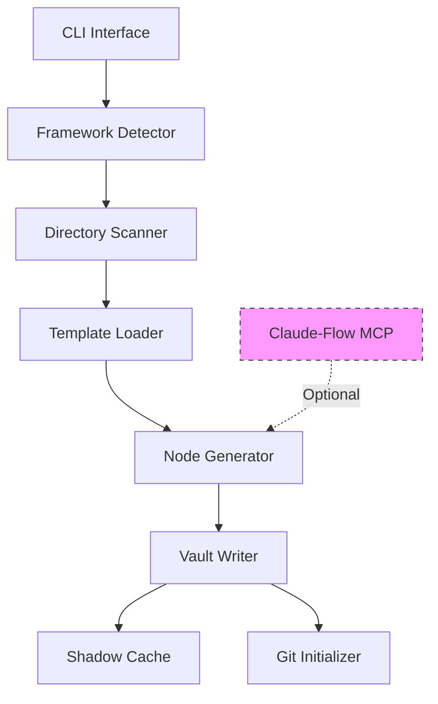
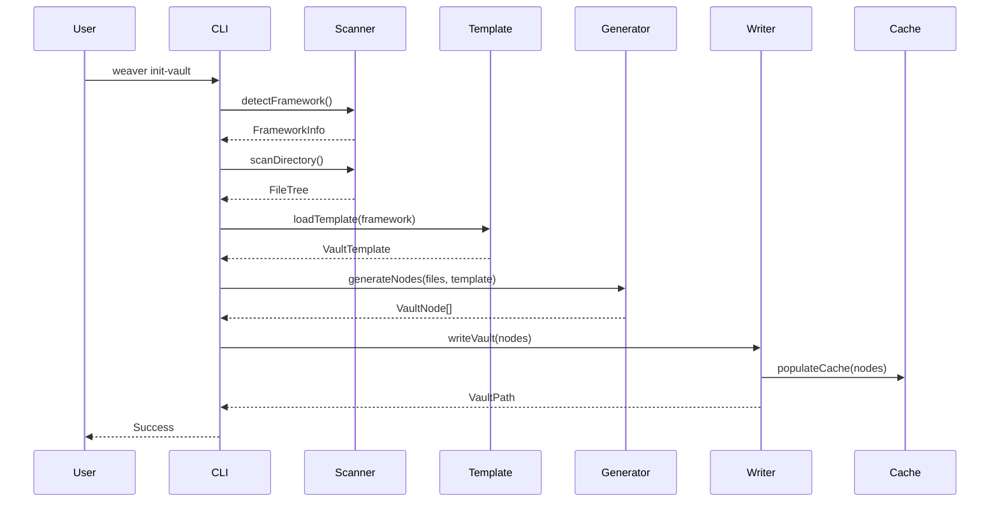

# Vault Initialization System - Developer Guide

**Version**: 1.0.0
**Last Updated**: 2025-10-25
**Phase**: 6 - Implementation Complete

---

## Table of Contents

1. [Architecture Overview](#architecture-overview)
2. [Module Documentation](#module-documentation)
3. [Creating Custom Templates](#creating-custom-templates)
4. [Extending Node Generators](#extending-node-generators)
5. [API Integration](#api-integration)
6. [Testing](#testing)
7. [Contributing](#contributing)

---

## Architecture Overview

### System Components



### Data Flow



### Directory Structure

```
src/vault-init/
├── scanner/                    # Project analysis
│   ├── framework-detector.ts   # Framework detection
│   ├── directory-scanner.ts    # File tree scanning
│   └── types.ts               # Scanner types
│
├── templates/                  # Template system
│   ├── types.ts               # Template types
│   ├── template-loader.ts     # Template loading
│   ├── nextjs-template.ts     # Next.js template
│   ├── react-template.ts      # React template
│   └── example-usage.ts       # Usage examples
│
├── generators/                 # Node generation (future)
│   ├── concept-generator.ts
│   ├── technical-generator.ts
│   └── feature-generator.ts
│
└── cli/                       # CLI interface (future)
    └── init-vault.ts
```

---

## Module Documentation

### Scanner Module

#### `framework-detector.ts`

**Purpose**: Detects project framework by analyzing dependencies and structure.

**Key Functions**:

```typescript
/**
 * Detects framework from project directory
 * @param projectPath - Absolute path to project
 * @returns Framework information
 */
export async function detectFramework(
  projectPath: string
): Promise<FrameworkInfo>

/**
 * Performs detailed detection with metadata
 * @param projectPath - Absolute path to project
 * @returns Complete detection results
 */
export async function detectFrameworkDetailed(
  projectPath: string
): Promise<DetectionResult>
```

**Algorithm**:
1. Validate project path exists
2. Read and parse `package.json`
3. Detect framework type (priority: Next.js → React → TypeScript → Node.js)
4. Detect version from dependencies
5. Scan for features (TypeScript, Tailwind, App Router, etc.)
6. Calculate confidence score

**Example**:
```typescript
import { detectFramework } from './scanner/framework-detector';

const info = await detectFramework('/path/to/project');
console.log(info.type);      // 'nextjs'
console.log(info.version);   // '14.0.0'
console.log(info.features);  // ['app-router', 'typescript', 'tailwind']
console.log(info.confidence); // 95
```

---

#### `directory-scanner.ts`

**Purpose**: Recursively scans project directory with ignore patterns.

**Key Functions**:

```typescript
/**
 * Scans directory tree
 * @param rootPath - Directory to scan
 * @param options - Scan options (ignore patterns, depth limit)
 * @returns File tree structure
 */
export async function scanDirectory(
  rootPath: string,
  options?: ScanOptions
): Promise<FileTree>
```

**Features**:
- Respects `.gitignore` patterns
- Custom ignore patterns (default: `node_modules`, `.git`, `dist`, `build`)
- Depth limiting for performance
- Symbolic link handling
- File metadata extraction (size, type, modified date)

**Example**:
```typescript
import { scanDirectory } from './scanner/directory-scanner';

const tree = await scanDirectory('/project', {
  ignore: ['*.test.ts', 'coverage/'],
  maxDepth: 5,
});
```

---

### Template Module

#### `template-loader.ts`

**Purpose**: Loads and validates vault templates.

**Key Class**:

```typescript
class TemplateLoader {
  /**
   * Loads template by framework type
   */
  loadTemplate(framework: FrameworkType): VaultTemplate

  /**
   * Validates template schema
   */
  validateTemplate(template: unknown): ValidationResult

  /**
   * Lists available templates
   */
  listTemplates(): TemplateMetadata[]
}
```

**Singleton Instance**:
```typescript
import { templateLoader } from './templates/template-loader';

const template = templateLoader.loadTemplate('nextjs');
console.log(template.name);        // 'Next.js Application'
console.log(template.directories); // Directory structure
```

---

#### Template Schema

**TypeScript Interface**:
```typescript
interface VaultTemplate {
  id: string;
  name: string;
  framework: string;
  version: string;
  description: string;
  directories: DirectoryStructure;
  nodeTemplates: Map<string, NodeTemplate>;
  metadata?: {
    author?: string;
    tags?: string[];
    dependencies?: string[];
  };
}
```

**Example Template**:
```typescript
const reactTemplate: VaultTemplate = {
  id: 'react-v1',
  name: 'React Application',
  framework: 'react',
  version: '1.0.0',
  description: 'Template for React applications',
  directories: {
    concepts: {
      description: 'High-level React concepts',
    },
    technical: {
      description: 'Technical implementation',
      children: {
        components: 'React components',
        hooks: 'Custom hooks',
        utils: 'Utility functions',
      },
    },
    features: {
      description: 'User-facing features',
    },
  },
  nodeTemplates: new Map([
    ['concept', {
      type: 'concept',
      frontmatter: { type: 'concept', tags: ['react'] },
      contentTemplate: '# {{nodeName}}\n\n{{description}}',
    }],
  ]),
};
```

---

## Creating Custom Templates

### Step 1: Define Template Structure

Create a new file: `src/vault-init/templates/my-template.ts`

```typescript
import { VaultTemplate, NodeTemplate } from './types';

export const myCustomTemplate: VaultTemplate = {
  id: 'my-template-v1',
  name: 'My Custom Framework',
  framework: 'custom',
  version: '1.0.0',
  description: 'Template for my custom framework',

  // Define directory structure
  directories: {
    concepts: {
      description: 'Framework concepts',
    },
    technical: {
      description: 'Technical details',
      children: {
        modules: 'Code modules',
        apis: 'API documentation',
      },
    },
    features: {
      description: 'Feature documentation',
    },
    architecture: {
      description: 'Architecture diagrams',
    },
  },

  // Define node templates
  nodeTemplates: new Map([
    ['concept', createConceptTemplate()],
    ['technical', createTechnicalTemplate()],
    ['feature', createFeatureTemplate()],
  ]),

  metadata: {
    author: 'Your Name',
    tags: ['custom', 'template'],
  },
};
```

### Step 2: Define Node Templates

**Concept Node Template**:
```typescript
function createConceptTemplate(): NodeTemplate {
  return {
    type: 'concept',
    frontmatter: {
      type: 'concept',
      tags: ['{{framework}}', 'concept'],
      created: '{{timestamp}}',
      author: '{{author}}',
    },
    contentTemplate: `
# {{nodeName}}

## Overview

{{description}}

## Key Ideas

- **Idea 1**: Description
- **Idea 2**: Description

## Related Concepts

{{#each relatedConcepts}}
- [[{{this}}]]
{{/each}}

## References

- [Official Docs]({{docsUrl}})
`,
    description: 'High-level concept documentation',
  };
}
```

**Technical Node Template**:
```typescript
function createTechnicalTemplate(): NodeTemplate {
  return {
    type: 'technical',
    frontmatter: {
      type: 'technical',
      tags: ['{{framework}}', 'technical', '{{nodeType}}'],
      file_path: '{{filePath}}',
      created: '{{timestamp}}',
    },
    contentTemplate: `
# {{nodeName}}

## Description

{{description}}

## Implementation

\`\`\`{{language}}
{{codeSnippet}}
\`\`\`

## API

{{#if parameters}}
### Parameters

| Name | Type | Description |
|------|------|-------------|
{{#each parameters}}
| \`{{name}}\` | \`{{type}}\` | {{description}} |
{{/each}}
{{/if}}

{{#if returns}}
### Returns

\`{{returns.type}}\` - {{returns.description}}
{{/if}}

## Usage Example

\`\`\`{{language}}
{{usageExample}}
\`\`\`

## Dependencies

{{#each dependencies}}
- [[{{this}}]]
{{/each}}
`,
  };
}
```

### Step 3: Register Template

Add to `template-loader.ts`:

```typescript
import { myCustomTemplate } from './my-template';

class TemplateLoader {
  private templates = new Map<string, VaultTemplate>([
    ['nextjs', nextjsTemplate],
    ['react', reactTemplate],
    ['custom', myCustomTemplate], // Add here
  ]);

  // ... rest of implementation
}
```

### Step 4: Use Custom Template

```bash
weaver init-vault --template custom --path /my/project
```

---

## Extending Node Generators

### Create Custom Generator

```typescript
// src/vault-init/generators/custom-generator.ts

import { NodeTemplate, TemplateContext } from '../templates/types';
import Handlebars from 'handlebars';

export class CustomNodeGenerator {
  private template: NodeTemplate;
  private compiled: HandlebarsTemplateDelegate;

  constructor(template: NodeTemplate) {
    this.template = template;
    this.compiled = Handlebars.compile(template.contentTemplate);
  }

  /**
   * Generates node content from context
   */
  generate(context: TemplateContext): string {
    // Add custom Handlebars helpers
    Handlebars.registerHelper('uppercase', (str: string) => {
      return str.toUpperCase();
    });

    Handlebars.registerHelper('wikilink', (name: string) => {
      return `[[${name}]]`;
    });

    // Render template
    const content = this.compiled(context);

    // Add frontmatter
    const frontmatter = this.generateFrontmatter(context);

    return `---\n${frontmatter}\n---\n\n${content}`;
  }

  private generateFrontmatter(context: TemplateContext): string {
    const fm = { ...this.template.frontmatter };

    // Replace template variables
    Object.keys(fm).forEach(key => {
      if (typeof fm[key] === 'string') {
        fm[key] = this.replaceVariables(fm[key], context);
      }
    });

    return Object.entries(fm)
      .map(([key, value]) => `${key}: ${JSON.stringify(value)}`)
      .join('\n');
  }

  private replaceVariables(str: string, context: TemplateContext): string {
    return str.replace(/\{\{(\w+)\}\}/g, (_, key) => {
      return context[key] ?? '';
    });
  }
}
```

### Custom Handlebars Helpers

```typescript
// src/vault-init/generators/handlebars-helpers.ts

import Handlebars from 'handlebars';

/**
 * Registers custom Handlebars helpers for vault generation
 */
export function registerCustomHelpers() {
  // Wikilink helper
  Handlebars.registerHelper('wikilink', (name: string) => {
    return `[[${name}]]`;
  });

  // Tag helper
  Handlebars.registerHelper('tag', (name: string) => {
    return `#${name.replace(/\s+/g, '-')}`;
  });

  // Mermaid diagram helper
  Handlebars.registerHelper('mermaid', (type: string, content: string) => {
    return `\`\`\`mermaid\n${type}\n${content}\n\`\`\``;
  });

  // Date formatting
  Handlebars.registerHelper('formatDate', (date: Date | string) => {
    const d = date instanceof Date ? date : new Date(date);
    return d.toISOString().split('T')[0];
  });

  // Code block helper
  Handlebars.registerHelper('code', (language: string, code: string) => {
    return `\`\`\`${language}\n${code}\n\`\`\``;
  });

  // Conditional wikilink (only if exists)
  Handlebars.registerHelper('maybeLink', (name: string | undefined) => {
    return name ? `[[${name}]]` : 'N/A';
  });
}
```

---

## API Integration

### Using Vault Init Programmatically

```typescript
import {
  detectFramework,
  scanDirectory,
  templateLoader
} from '@weave-nn/weaver/vault-init';

async function initializeVault(projectPath: string) {
  // Step 1: Detect framework
  const frameworkInfo = await detectFramework(projectPath);
  console.log(`Detected: ${frameworkInfo.type}`);

  // Step 2: Scan directory
  const fileTree = await scanDirectory(projectPath, {
    ignore: ['node_modules', 'dist'],
  });
  console.log(`Found ${fileTree.files.length} files`);

  // Step 3: Load template
  const template = templateLoader.loadTemplate(frameworkInfo.type);
  console.log(`Using template: ${template.name}`);

  // Step 4: Generate nodes (custom logic)
  const nodes = await generateNodes(fileTree, template);

  // Step 5: Write vault (custom logic)
  await writeVault(nodes, './output-vault');
}
```

### MCP Tool Integration

```typescript
// Example: Trigger vault init via MCP tool

import { trigger_vault_initialization } from '@weave-nn/weaver/mcp-server';

const result = await trigger_vault_initialization({
  appPath: '/path/to/project',
  template: 'nextjs',
  outputPath: './vault',
  options: {
    offline: false,
    verbose: true,
  },
});

console.log(result.vaultPath);   // './vault'
console.log(result.nodeCount);   // 47
console.log(result.status);      // 'completed'
```

---

## Testing

### Unit Testing

```typescript
// tests/vault-init/framework-detector.test.ts

import { describe, it, expect } from 'vitest';
import { detectFramework } from '../../src/vault-init/scanner/framework-detector';

describe('Framework Detector', () => {
  it('should detect Next.js with App Router', async () => {
    const result = await detectFramework('/test-project');

    expect(result.type).toBe('nextjs');
    expect(result.features).toContain('app-router');
    expect(result.confidence).toBeGreaterThan(80);
  });
});
```

### Integration Testing

```typescript
// tests/vault-init/end-to-end.test.ts

import { describe, it, expect } from 'vitest';
import { initVault } from '../../src/vault-init';
import fs from 'fs/promises';

describe('Vault Initialization E2E', () => {
  it('should generate complete vault for Next.js project', async () => {
    const result = await initVault({
      projectPath: './fixtures/nextjs-app',
      outputPath: '/tmp/test-vault',
      template: 'nextjs',
    });

    // Verify vault structure
    const conceptsDir = await fs.readdir('/tmp/test-vault/concepts');
    expect(conceptsDir.length).toBeGreaterThan(0);

    // Verify frontmatter
    const file = await fs.readFile('/tmp/test-vault/concepts/nextjs.md', 'utf-8');
    expect(file).toContain('---');
    expect(file).toContain('type: concept');

    // Verify wikilinks
    expect(file).toMatch(/\[\[.*\]\]/);
  });
});
```

### Run Tests

```bash
# All tests
bun test

# Specific suite
bun test tests/vault-init

# Watch mode
bun test --watch

# Coverage
bun test --coverage
```

---

## Contributing

### Development Setup

```bash
# Clone repository
git clone https://github.com/weave-nn/weaver.git
cd weaver

# Install dependencies
bun install

# Build
bun run build

# Run tests
bun test

# Type check
bun run typecheck

# Lint
bun run lint
```

### Code Style

- **TypeScript**: Strict mode enabled
- **Formatting**: Prettier with 2-space indentation
- **Naming**:
  - `camelCase` for variables/functions
  - `PascalCase` for classes/types
  - `UPPER_CASE` for constants
- **Comments**: JSDoc for all exported functions

### Pull Request Process

1. **Fork** the repository
2. **Create** feature branch: `git checkout -b feature/my-feature`
3. **Implement** changes with tests
4. **Ensure** all tests pass: `bun test`
5. **Commit** with clear message: `git commit -m "feat: add my feature"`
6. **Push** to fork: `git push origin feature/my-feature`
7. **Create** pull request with description

### Commit Convention

Follow [Conventional Commits](https://www.conventionalcommits.org/):

```
feat: add new template for Vue.js
fix: correct wikilink generation
docs: update developer guide
test: add tests for scanner
refactor: simplify template loader
```

---

## API Reference

See [API Reference](./vault-init-api-reference.md) for complete function signatures and interfaces.

---

## Resources

- **User Guide**: [vault-init-user-guide.md](./vault-init-user-guide.md)
- **API Reference**: [vault-init-api-reference.md](./vault-init-api-reference.md)
- **Phase 6 Spec**: [phase-6-vault-initialization.md](../_planning/phases/phase-6-vault-initialization.md)
- **GitHub**: https://github.com/weave-nn/weaver

---

**Last Updated**: 2025-10-25
**Version**: 1.0.0
**Phase**: 6 - Vault Initialization System
